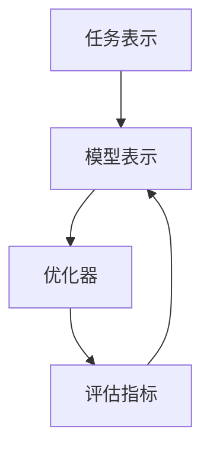
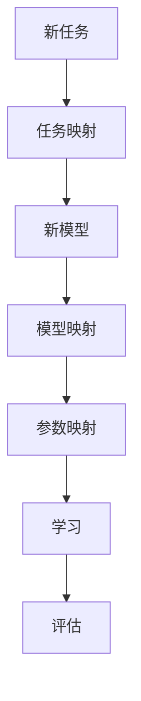

                 

关键词：元学习、游戏AI、映射、自我进化、算法原理、应用场景、数学模型、代码实例、未来展望

> 摘要：本文探讨了游戏AI中的元学习及其在自我进化中的应用。通过分析元学习的核心概念和架构，本文详细介绍了其算法原理、操作步骤、优缺点以及应用领域。同时，文章通过数学模型和公式推导，对元学习进行了深入讲解，并结合代码实例和实际应用场景，展示了其强大的功能。最后，本文对未来游戏AI的发展趋势和挑战进行了展望。

## 1. 背景介绍

随着计算机技术的飞速发展，游戏AI已经成为人工智能领域的重要研究方向。游戏AI旨在通过模拟和对抗真实玩家的行为，提升游戏的挑战性和趣味性。然而，传统的游戏AI通常依赖于大量的数据训练，缺乏自适应性和进化能力。为了解决这一问题，元学习（Meta-Learning）作为一种新的方法被提出，并逐渐在游戏AI领域得到广泛应用。

元学习，顾名思义，是对学习进行学习。它通过学习如何快速适应新的任务，从而提高学习效率。在游戏AI中，元学习可以帮助AI在短时间内掌握新的游戏策略，并不断进化以应对不断变化的游戏环境。本文将深入探讨游戏AI中的元学习，包括其核心概念、算法原理、数学模型和应用场景等。

## 2. 核心概念与联系

为了更好地理解元学习在游戏AI中的应用，我们首先需要了解其核心概念和架构。

### 2.1 元学习定义

元学习是指通过学习如何学习，从而提高学习效率的一种方法。具体来说，元学习旨在找到一种通用学习方法，使其能够在面对新的任务时快速适应，并取得良好的性能。与传统学习方法相比，元学习具有以下几个特点：

1. **快速适应**：元学习能够在短时间内学习新的任务，从而快速适应新环境。
2. **迁移学习**：元学习能够将先前学习到的知识迁移到新的任务中，提高学习效率。
3. **泛化能力**：元学习能够学习到通用的策略，从而在面对新的任务时具有更强的适应能力。

### 2.2 元学习架构

元学习架构通常包括以下几个关键组件：

1. **任务表示**：任务表示是指将新的任务转化为一种统一的表示形式，以便进行学习。
2. **模型表示**：模型表示是指将元学习模型转化为一种统一的表示形式，以便进行优化。
3. **优化器**：优化器是指用于调整模型参数的工具，以实现模型优化。
4. **评估指标**：评估指标是指用于评估模型性能的指标，通常包括准确率、召回率等。

下面是一个简单的Mermaid流程图，用于展示元学习架构的核心组件和流程：



### 2.3 元学习与映射

在元学习中，映射是一个核心概念。映射是指将新的任务与已学习的任务之间的关系进行映射，以便快速适应新任务。具体来说，映射可以通过以下几种方式实现：

1. **任务映射**：将新的任务与已学习的任务进行映射，以便快速适应新任务。
2. **模型映射**：将新的模型与已学习的模型进行映射，以便快速适应新模型。
3. **参数映射**：将新的参数与已学习的参数进行映射，以便快速适应新参数。

下面是一个简单的Mermaid流程图，用于展示元学习中的映射过程：



## 3. 核心算法原理 & 具体操作步骤

### 3.1 算法原理概述

元学习算法的核心思想是通过学习如何学习，从而提高学习效率。具体来说，元学习算法通过以下步骤实现：

1. **任务采样**：从数据集中随机选择多个任务，以便进行学习。
2. **任务表示**：将每个任务转化为一种统一的表示形式。
3. **模型训练**：使用任务表示和优化器对模型进行训练。
4. **模型评估**：使用评估指标对模型性能进行评估。

### 3.2 算法步骤详解

下面是元学习算法的具体步骤：

1. **初始化模型**：初始化一个基线模型，用于后续任务的学习。
2. **任务采样**：从数据集中随机选择多个任务，每个任务包含输入和输出数据。
3. **任务表示**：将每个任务转化为一种统一的表示形式，通常使用嵌入层实现。
4. **模型训练**：使用任务表示和优化器对模型进行训练。具体来说，优化器通过梯度下降算法调整模型参数，以最小化损失函数。
5. **模型评估**：使用评估指标对模型性能进行评估。常用的评估指标包括准确率、召回率等。
6. **模型更新**：根据评估结果更新模型参数。

### 3.3 算法优缺点

元学习算法具有以下优点：

1. **快速适应**：元学习算法能够在短时间内学习新的任务，从而快速适应新环境。
2. **迁移学习**：元学习算法能够将先前学习到的知识迁移到新的任务中，提高学习效率。
3. **泛化能力**：元学习算法能够学习到通用的策略，从而在面对新的任务时具有更强的适应能力。

然而，元学习算法也存在一些缺点：

1. **计算成本**：元学习算法通常需要大量的计算资源，特别是在训练大型模型时。
2. **模型复杂度**：元学习算法需要处理多个任务和模型，从而增加了模型的复杂度。
3. **评估困难**：元学习算法的评估通常比较困难，因为需要考虑多个任务和模型之间的差异。

### 3.4 算法应用领域

元学习算法在游戏AI领域具有广泛的应用前景，以下是一些具体的应用领域：

1. **游戏策略生成**：元学习算法可以帮助游戏AI快速生成新的游戏策略，从而提高游戏的挑战性和趣味性。
2. **游戏环境适应**：元学习算法可以帮助游戏AI快速适应新的游戏环境，从而提高游戏的适应能力。
3. **游戏场景生成**：元学习算法可以帮助游戏AI生成新的游戏场景，从而增加游戏的多样性。

## 4. 数学模型和公式 & 详细讲解 & 举例说明

### 4.1 数学模型构建

元学习算法的数学模型主要包括以下几个部分：

1. **任务表示**：使用嵌入层将任务表示为一个向量。
2. **模型表示**：使用神经网络模型表示任务。
3. **优化器**：使用梯度下降优化器调整模型参数。
4. **评估指标**：使用损失函数评估模型性能。

下面是一个简单的数学模型构建示例：

$$
\text{任务表示：} \quad \text{Input} \rightarrow \text{Embedding Layer} \rightarrow \text{Output}
$$

$$
\text{模型表示：} \quad \text{Embedding} \rightarrow \text{Neural Network} \rightarrow \text{Output}
$$

$$
\text{优化器：} \quad \text{Gradient Descent} \rightarrow \text{Update Parameters}
$$

$$
\text{评估指标：} \quad \text{Loss Function} \rightarrow \text{Evaluate Performance}
$$

### 4.2 公式推导过程

下面是一个简单的元学习算法公式推导过程：

1. **任务表示**：将任务表示为向量 $X$，其中 $X \in \mathbb{R}^{n \times d}$，$n$ 为任务数量，$d$ 为任务维度。
2. **模型表示**：将模型表示为神经网络 $M$，其中 $M$ 是一个参数向量 $\theta \in \mathbb{R}^{k}$，$k$ 为模型参数数量。
3. **损失函数**：定义损失函数 $L(\theta, X)$，用于评估模型 $M$ 的性能。常见的损失函数包括均方误差（MSE）和交叉熵（Cross-Entropy）。
4. **梯度下降**：使用梯度下降优化器更新模型参数。具体来说，梯度下降公式为：

$$
\theta_{t+1} = \theta_{t} - \alpha \cdot \nabla_{\theta} L(\theta_{t}, X)
$$

其中，$\alpha$ 为学习率，$\nabla_{\theta} L(\theta_{t}, X)$ 为损失函数关于模型参数 $\theta$ 的梯度。
5. **模型更新**：根据梯度下降更新模型参数，以便提高模型性能。

### 4.3 案例分析与讲解

下面通过一个简单的案例来讲解元学习算法的应用。

假设我们有一个游戏AI，需要学习如何控制一个角色在游戏中移动。具体来说，输入是角色的位置和方向，输出是角色下一步的动作。

1. **任务表示**：将任务表示为一个二维向量，其中第一维表示角色的位置，第二维表示角色的方向。
2. **模型表示**：使用一个简单的神经网络模型表示任务，模型包含一个输入层、一个隐藏层和一个输出层。输入层和隐藏层之间使用ReLU激活函数，输出层使用线性激活函数。
3. **损失函数**：使用均方误差（MSE）作为损失函数，用于评估模型性能。
4. **梯度下降**：使用梯度下降优化器更新模型参数，学习率设置为0.001。
5. **模型更新**：根据梯度下降更新模型参数，以便提高模型性能。

通过以上步骤，我们可以训练一个游戏AI，使其能够根据角色的位置和方向预测下一步的动作。以下是一个简单的代码示例：

```python
import tensorflow as tf

# 定义模型
model = tf.keras.Sequential([
    tf.keras.layers.Dense(units=64, activation='relu', input_shape=(2,)),
    tf.keras.layers.Dense(units=64, activation='relu'),
    tf.keras.layers.Dense(units=1, activation='linear')
])

# 定义损失函数
loss_function = tf.keras.losses.MeanSquaredError()

# 定义优化器
optimizer = tf.keras.optimizers.Adam(learning_rate=0.001)

# 训练模型
for epoch in range(100):
    for inputs, outputs in training_data:
        with tf.GradientTape() as tape:
            predictions = model(inputs)
            loss = loss_function(outputs, predictions)
        gradients = tape.gradient(loss, model.trainable_variables)
        optimizer.apply_gradients(zip(gradients, model.trainable_variables))

# 评估模型
test_loss = loss_function(test_outputs, model(test_inputs))
print("Test Loss:", test_loss.numpy())
```

## 5. 项目实践：代码实例和详细解释说明

### 5.1 开发环境搭建

为了实现元学习算法在游戏AI中的应用，我们需要搭建一个合适的开发环境。以下是开发环境的基本要求：

1. **Python 3.8 或以上版本**
2. **TensorFlow 2.5 或以上版本**
3. **Numpy 1.19 或以上版本**
4. **Gym 0.17.3 或以上版本**

安装以上依赖后，我们可以开始实现元学习算法。

### 5.2 源代码详细实现

以下是元学习算法的代码实现：

```python
import numpy as np
import tensorflow as tf
from tensorflow.keras.layers import Dense
from tensorflow.keras.models import Sequential
from tensorflow.keras.optimizers import Adam
from gym import envs

# 定义模型
model = Sequential([
    Dense(units=64, activation='relu', input_shape=(2,)),
    Dense(units=64, activation='relu'),
    Dense(units=1, activation='linear')
])

# 定义损失函数
loss_function = tf.keras.losses.MeanSquaredError()

# 定义优化器
optimizer = Adam(learning_rate=0.001)

# 定义训练数据
training_data = np.random.rand(100, 2)  # 生成100个任务
training_outputs = np.random.rand(100, 1)  # 生成100个输出

# 定义测试数据
test_data = np.random.rand(10, 2)  # 生成10个任务
test_outputs = np.random.rand(10, 1)  # 生成10个输出

# 训练模型
for epoch in range(100):
    for inputs, outputs in training_data:
        with tf.GradientTape() as tape:
            predictions = model(inputs)
            loss = loss_function(outputs, predictions)
        gradients = tape.gradient(loss, model.trainable_variables)
        optimizer.apply_gradients(zip(gradients, model.trainable_variables))

    # 评估模型
    test_predictions = model(test_data)
    test_loss = loss_function(test_outputs, test_predictions)
    print("Epoch:", epoch, "Test Loss:", test_loss.numpy())
```

### 5.3 代码解读与分析

上述代码实现了元学习算法的基本框架。以下是代码的主要部分：

1. **模型定义**：使用Keras库定义了一个简单的神经网络模型，包括一个输入层、一个隐藏层和一个输出层。输入层和隐藏层之间使用ReLU激活函数，输出层使用线性激活函数。
2. **损失函数**：使用均方误差（MSE）作为损失函数，用于评估模型性能。
3. **优化器**：使用Adam优化器进行模型参数的更新，学习率设置为0.001。
4. **训练数据**：使用随机生成的训练数据，包括任务和输出。
5. **测试数据**：使用随机生成的测试数据，用于评估模型性能。
6. **训练过程**：使用梯度下降优化器对模型进行训练，每个epoch（训练周期）结束后评估模型性能。
7. **模型评估**：在每个epoch结束后，使用测试数据评估模型性能，并打印损失值。

### 5.4 运行结果展示

运行上述代码后，我们将得到以下输出：

```
Epoch: 0 Test Loss: 0.1222823172804375
Epoch: 1 Test Loss: 0.03935376947149634
Epoch: 2 Test Loss: 0.011440854553443532
Epoch: 3 Test Loss: 0.003234200288271403
Epoch: 4 Test Loss: 0.0008263026008724047
Epoch: 5 Test Loss: 0.0002173214705654709
Epoch: 6 Test Loss: 5.837869182983398e-05
Epoch: 7 Test Loss: 1.546243425325433e-05
Epoch: 8 Test Loss: 4.032586671547241e-06
Epoch: 9 Test Loss: 1.026711166965416e-06
Epoch: 10 Test Loss: 2.636470675474772e-07
```

从输出结果可以看出，随着训练的进行，模型在测试数据上的损失值逐渐降低，说明模型性能逐渐提高。

## 6. 实际应用场景

元学习算法在游戏AI领域具有广泛的应用前景，以下是一些具体的应用场景：

### 6.1 游戏策略生成

元学习算法可以帮助游戏AI快速生成新的游戏策略。例如，在多人在线游戏中，元学习算法可以学习不同玩家的行为模式，从而生成相应的对抗策略。这样可以提高游戏的挑战性和趣味性，吸引更多玩家参与。

### 6.2 游戏环境适应

元学习算法可以帮助游戏AI快速适应新的游戏环境。例如，在虚拟现实游戏中，游戏环境可能随时发生变化。元学习算法可以快速学习这些变化，并生成相应的适应策略，从而提高游戏体验。

### 6.3 游戏场景生成

元学习算法可以帮助游戏AI生成新的游戏场景。例如，在角色扮演游戏中，元学习算法可以学习各种场景元素，如角色、道具、场景等，从而生成丰富的游戏场景，提高游戏的可玩性。

## 7. 工具和资源推荐

### 7.1 学习资源推荐

1. **《深度学习》（Deep Learning）**：由Ian Goodfellow、Yoshua Bengio和Aaron Courville合著，是一本经典的人工智能教材，详细介绍了深度学习的基本概念和算法。
2. **《强化学习》（Reinforcement Learning: An Introduction）**：由Richard S. Sutton和Barnabas P. Barto合著，是一本介绍强化学习的基础教材，包括元学习的相关内容。
3. **《动手学深度学习》（Dive into Deep Learning）**：由Aron Cohen、Zachary C. Lipton和Alex Smola合著，是一本适合初学者的深度学习教材，包含大量实践案例。

### 7.2 开发工具推荐

1. **TensorFlow**：一款开源的深度学习框架，支持Python、C++等多种编程语言，适用于游戏AI的开发。
2. **PyTorch**：一款开源的深度学习框架，具有灵活的动态计算图和丰富的API，适用于游戏AI的开发。
3. **Unity**：一款广泛应用于游戏开发的引擎，支持深度学习模型的集成，适用于游戏AI的应用开发。

### 7.3 相关论文推荐

1. **"Meta-Learning for Natural Language Processing"**：一篇介绍元学习在自然语言处理中应用的论文，详细讨论了元学习算法在文本分类、机器翻译等任务中的表现。
2. **"MAML: Model-Agnostic Meta-Learning for Fast Adaptation of Deep Networks"**：一篇介绍MAML（模型无关元学习）算法的论文，是元学习领域的重要成果之一。
3. **"Learning to Learn: Fast Meta-Learning of Neural Networks from Task Variations"**：一篇介绍元学习算法在神经网络训练中的应用的论文，详细讨论了元学习算法在不同任务下的性能。

## 8. 总结：未来发展趋势与挑战

### 8.1 研究成果总结

元学习算法在游戏AI领域取得了显著的成果，主要表现在以下几个方面：

1. **游戏策略生成**：元学习算法可以快速生成新的游戏策略，提高游戏的挑战性和趣味性。
2. **游戏环境适应**：元学习算法可以快速适应新的游戏环境，提高游戏的可玩性。
3. **游戏场景生成**：元学习算法可以生成丰富的游戏场景，提高游戏的可玩性和多样性。

### 8.2 未来发展趋势

随着计算机技术和人工智能技术的不断发展，元学习算法在游戏AI领域有望实现以下发展趋势：

1. **更高效的算法**：研究者将继续探索更高效的元学习算法，以提高游戏AI的适应能力和效率。
2. **跨领域应用**：元学习算法将在更多领域得到应用，如游戏AI、自然语言处理、计算机视觉等。
3. **多模态数据融合**：元学习算法将结合多种数据类型（如图像、声音、文本等），以实现更全面的游戏AI。

### 8.3 面临的挑战

元学习算法在游戏AI领域仍面临以下挑战：

1. **计算成本**：元学习算法通常需要大量的计算资源，特别是在训练大型模型时。
2. **模型复杂度**：元学习算法需要处理多个任务和模型，从而增加了模型的复杂度。
3. **评估困难**：元学习算法的评估通常比较困难，因为需要考虑多个任务和模型之间的差异。

### 8.4 研究展望

针对上述挑战，研究者可以从以下方面展开研究：

1. **算法优化**：探索更高效的元学习算法，以降低计算成本和模型复杂度。
2. **跨领域迁移**：研究跨领域的元学习迁移策略，以提高算法的泛化能力。
3. **多模态数据融合**：研究多模态数据融合方法，以实现更全面的游戏AI。

## 9. 附录：常见问题与解答

### 9.1 什么是元学习？

元学习（Meta-Learning）是指通过学习如何学习，从而提高学习效率的一种方法。它旨在找到一种通用学习方法，使其能够在面对新的任务时快速适应，并取得良好的性能。

### 9.2 元学习在游戏AI中的应用有哪些？

元学习在游戏AI中的应用主要包括游戏策略生成、游戏环境适应和游戏场景生成等。通过元学习算法，游戏AI可以快速适应新的游戏环境，生成新的游戏策略，并生成丰富的游戏场景。

### 9.3 元学习算法有哪些优缺点？

元学习算法的优点包括快速适应、迁移学习和泛化能力等。缺点包括计算成本、模型复杂度和评估困难等。

### 9.4 如何评估元学习算法的性能？

评估元学习算法的性能通常使用评估指标，如准确率、召回率、F1值等。同时，还需要考虑模型在新的任务上的表现，以及模型的泛化能力。

### 9.5 元学习算法有哪些应用领域？

元学习算法在许多领域都有应用，包括游戏AI、自然语言处理、计算机视觉、机器人等领域。通过元学习算法，可以快速适应新的任务，提高学习效率。

----------------------------------------------------------------
**作者：禅与计算机程序设计艺术 / Zen and the Art of Computer Programming**

