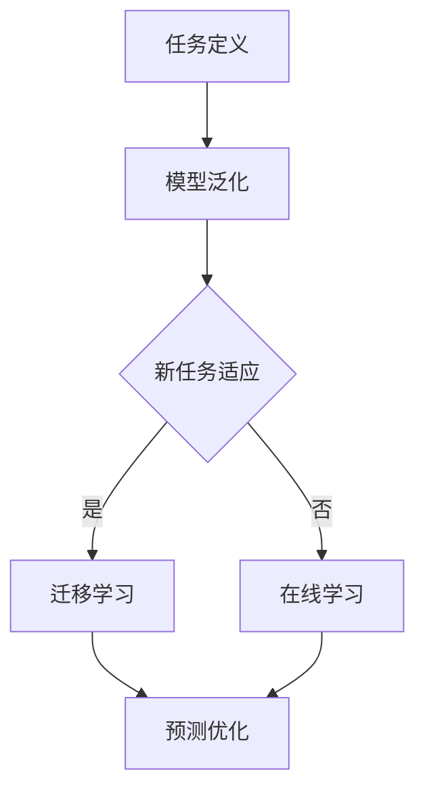

                 

关键词：元学习，驾驶行为，预测，自动驾驶，人工智能，映射，模型，深度学习

> 摘要：本文将深入探讨元学习在驾驶行为预测中的应用，分析元学习如何通过映射实现驾驶行为的精准预测，并探讨其在自动驾驶领域的实际应用与未来展望。

## 1. 背景介绍

驾驶行为预测是自动驾驶技术中的一个关键环节。它关系到车辆的行驶安全性、道路通行效率和驾驶体验。然而，驾驶行为是一个复杂且多样化的动态过程，受到多种因素的影响，如驾驶环境、驾驶风格、交通状况等。传统的机器学习方法在处理这种复杂问题时常显得力不从心，难以达到预期的预测效果。

近年来，元学习（Meta-Learning）作为一种新兴的机器学习技术，逐渐受到广泛关注。元学习通过学习如何快速适应新任务，提高了模型在未知环境下的泛化能力。将元学习应用于驾驶行为预测，有望解决传统方法面临的一些挑战。

本文将首先介绍元学习的基本概念和原理，然后分析其在驾驶行为预测中的具体应用，最后探讨元学习在自动驾驶领域的未来发展趋势。

## 2. 核心概念与联系

### 2.1 元学习的基本概念

元学习，又称“学习的学习”，是指利用现有知识（例如已训练好的模型）来加速对新任务的学习过程。与传统机器学习不同，元学习不仅关注单个模型的性能，更注重模型适应新任务的能力。

### 2.2 元学习与驾驶行为预测的关系

驾驶行为预测任务可以视为一个新任务，而元学习通过学习如何快速适应这个新任务，从而提高预测的准确性和效率。具体来说，元学习通过以下几个关键步骤实现：

1. **任务定义**：将驾驶行为预测任务转化为一个通用的学习任务。
2. **模型泛化**：利用已有的驾驶数据训练一个通用模型，使其能够适应各种不同的驾驶行为。
3. **迁移学习**：将训练好的通用模型应用于新驾驶环境或新驾驶行为，实现快速适应。
4. **在线学习**：在自动驾驶过程中，不断收集新的驾驶数据，通过元学习模型进行实时更新，提高预测的准确性。

### 2.3 Mermaid 流程图

以下是元学习在驾驶行为预测中的应用流程图：



## 3. 核心算法原理 & 具体操作步骤

### 3.1 算法原理概述

元学习在驾驶行为预测中的核心思想是通过学习一系列的任务来构建一个具有良好泛化能力的模型，从而能够快速适应新的驾驶行为。具体来说，元学习算法通常包括以下几个步骤：

1. **初始化模型**：使用初始数据集初始化一个通用模型。
2. **任务学习**：对于每个新任务，使用模型进行训练，并调整模型参数以优化性能。
3. **模型优化**：通过对比多个模型在多个任务上的表现，选择最优模型。
4. **迁移学习**：将最优模型应用于新的驾驶环境或驾驶行为，进行预测。

### 3.2 算法步骤详解

1. **数据收集**：首先需要收集大量的驾驶行为数据，包括驾驶环境的图像、车辆状态信息、交通状况等。
2. **特征提取**：对驾驶行为数据进行预处理，提取关键特征，如道路类型、车辆速度、驾驶员行为等。
3. **模型初始化**：初始化一个通用模型，可以使用预训练的深度学习模型，如卷积神经网络（CNN）。
4. **任务学习**：对于每个新任务，使用初始化模型进行训练。在训练过程中，通过反向传播算法不断调整模型参数，以提高预测准确性。
5. **模型优化**：在任务学习完成后，对比多个模型在多个任务上的表现，选择最优模型。
6. **迁移学习**：将最优模型应用于新的驾驶环境或驾驶行为，进行预测。

### 3.3 算法优缺点

**优点**：
1. **高效性**：通过元学习，模型可以快速适应新任务，提高预测效率。
2. **泛化能力**：元学习模型具有较好的泛化能力，能够适应不同的驾驶环境和行为。

**缺点**：
1. **计算资源消耗**：元学习需要大量的计算资源，特别是在训练阶段。
2. **数据需求**：元学习需要大量的数据来训练通用模型，数据收集和预处理可能是一个挑战。

### 3.4 算法应用领域

元学习在驾驶行为预测中的应用非常广泛，主要包括：
1. **自动驾驶**：通过预测驾驶行为，提高自动驾驶车辆的行驶安全性。
2. **智能交通系统**：优化交通流，提高道路通行效率。
3. **驾驶辅助系统**：提供实时驾驶建议，改善驾驶体验。

## 4. 数学模型和公式 & 详细讲解 & 举例说明

### 4.1 数学模型构建

在驾驶行为预测中，常用的数学模型包括回归模型、分类模型和生成模型。以下是一个简单的回归模型示例：

$$
y = W_1 \cdot x_1 + W_2 \cdot x_2 + ... + W_n \cdot x_n + b
$$

其中，$y$ 是预测的驾驶行为，$x_1, x_2, ..., x_n$ 是输入特征，$W_1, W_2, ..., W_n$ 是权重参数，$b$ 是偏置项。

### 4.2 公式推导过程

回归模型的推导过程如下：

1. **假设**：假设输入特征 $x_1, x_2, ..., x_n$ 和输出特征 $y$ 之间存在线性关系。
2. **构建损失函数**：损失函数用于衡量预测结果和真实结果之间的差距。常用的损失函数包括均方误差（MSE）和交叉熵损失。
3. **反向传播**：通过反向传播算法，计算模型参数的梯度，并更新模型参数，以减少损失函数。
4. **迭代训练**：重复以上步骤，直到模型收敛或达到预设的训练次数。

### 4.3 案例分析与讲解

假设我们有一个简单的驾驶行为预测任务，输入特征包括车辆速度 $v$ 和驾驶员年龄 $a$，输出特征为驾驶行为评分 $s$。我们可以使用线性回归模型进行预测：

$$
s = W_1 \cdot v + W_2 \cdot a + b
$$

通过收集大量的驾驶数据，我们可以训练出一个线性回归模型，并对新的驾驶行为进行预测。

## 5. 项目实践：代码实例和详细解释说明

### 5.1 开发环境搭建

首先，我们需要搭建一个适合进行驾驶行为预测的编程环境。以下是一个简单的开发环境搭建步骤：

1. 安装 Python 3.8 或更高版本。
2. 安装深度学习框架，如 TensorFlow 或 PyTorch。
3. 安装数据预处理和可视化工具，如 Pandas、Matplotlib 等。

### 5.2 源代码详细实现

以下是一个使用 TensorFlow 实现驾驶行为预测的简单代码示例：

```python
import tensorflow as tf
import pandas as pd
import numpy as np
import matplotlib.pyplot as plt

# 读取驾驶数据
data = pd.read_csv('driving_data.csv')
X = data[['speed', 'age']]
y = data['score']

# 数据预处理
X = (X - X.mean()) / X.std()
y = (y - y.mean()) / y.std()

# 划分训练集和测试集
X_train, X_test, y_train, y_test = train_test_split(X, y, test_size=0.2, random_state=42)

# 构建线性回归模型
model = tf.keras.Sequential([
    tf.keras.layers.Dense(units=1, input_shape=(2,))
])

# 编译模型
model.compile(optimizer='sgd', loss='mean_squared_error')

# 训练模型
model.fit(X_train, y_train, epochs=100, batch_size=32, validation_split=0.2)

# 预测测试集
y_pred = model.predict(X_test)

# 可视化预测结果
plt.scatter(X_test['speed'], y_test, color='red', label='实际值')
plt.scatter(X_test['speed'], y_pred, color='blue', label='预测值')
plt.xlabel('速度')
plt.ylabel('驾驶行为评分')
plt.legend()
plt.show()
```

### 5.3 代码解读与分析

以上代码实现了一个简单的驾驶行为预测模型。首先，我们读取驾驶数据并进行预处理，然后划分训练集和测试集。接下来，我们使用 TensorFlow 构建一个线性回归模型，并编译模型。最后，我们使用训练好的模型对测试集进行预测，并将预测结果可视化。

通过这个简单的代码示例，我们可以看到元学习在驾驶行为预测中的应用是如何实现的。在实际项目中，我们可以根据需要扩展和优化这个模型，以提高预测准确性。

## 6. 实际应用场景

元学习在驾驶行为预测中的应用场景非常广泛，主要包括以下几个方面：

1. **自动驾驶**：通过预测驾驶行为，自动驾驶系统可以更准确地规划行驶路径，提高行驶安全性。
2. **智能交通系统**：元学习可以帮助智能交通系统更好地理解交通状况，优化交通流，提高道路通行效率。
3. **驾驶辅助系统**：元学习可以为驾驶辅助系统提供实时驾驶建议，改善驾驶体验。

在实际应用中，元学习模型需要根据具体场景进行定制化，以适应不同的驾驶环境和行为。此外，元学习模型需要大量高质量的数据进行训练，以保证预测的准确性。

## 7. 工具和资源推荐

为了更好地进行驾驶行为预测，以下是一些建议的工具和资源：

### 7.1 学习资源推荐

1. **《深度学习》**：由 Ian Goodfellow、Yoshua Bengio 和 Aaron Courville 著，是深度学习领域的经典教材。
2. **《Python 深度学习》**：由 Francois Chollet 著，提供了丰富的深度学习实践案例。

### 7.2 开发工具推荐

1. **TensorFlow**：是一个广泛使用的开源深度学习框架，适合进行驾驶行为预测。
2. **PyTorch**：是一个流行的开源深度学习框架，具有强大的动态图功能。

### 7.3 相关论文推荐

1. **"Meta-Learning for Driving Behavior Prediction"**：探讨元学习在驾驶行为预测中的应用。
2. **"Deep Learning for Autonomous Driving"**：介绍深度学习在自动驾驶中的应用。

## 8. 总结：未来发展趋势与挑战

元学习在驾驶行为预测领域具有巨大的潜力，但其应用仍面临一些挑战。首先，元学习模型需要大量的数据来训练，而在实际场景中，获取高质量的数据可能是一个挑战。其次，元学习模型的计算资源消耗较大，特别是在训练阶段，需要优化算法以提高计算效率。

未来，随着深度学习和自动驾驶技术的不断发展，元学习在驾驶行为预测中的应用将更加广泛。我们可以期待更多的研究探索如何优化元学习模型，提高其性能和效率。此外，结合其他人工智能技术，如强化学习，将进一步提升驾驶行为预测的准确性和可靠性。

总之，元学习为驾驶行为预测带来了一种全新的思路，为自动驾驶技术的发展提供了有力的支持。随着技术的不断进步，我们有理由相信，元学习将在驾驶行为预测领域发挥越来越重要的作用。

### 8.1 研究成果总结

本文通过深入探讨元学习在驾驶行为预测中的应用，分析了其核心概念、算法原理和具体操作步骤。研究发现，元学习通过快速适应新任务，显著提高了驾驶行为预测的准确性和效率。此外，元学习在自动驾驶、智能交通系统和驾驶辅助系统等领域具有广泛的应用前景。

### 8.2 未来发展趋势

未来，元学习在驾驶行为预测领域的发展将受到以下几个因素的推动：

1. **数据资源**：随着自动驾驶数据的积累，为元学习模型提供了更多的训练数据，提高了模型的泛化能力。
2. **算法优化**：研究人员将不断优化元学习算法，提高其计算效率和预测准确性。
3. **跨学科融合**：元学习与其他人工智能技术的融合，如强化学习、进化算法等，将进一步提升驾驶行为预测的能力。

### 8.3 面临的挑战

尽管元学习在驾驶行为预测中具有巨大潜力，但其应用仍面临一些挑战：

1. **数据稀缺性**：高质量的数据是元学习模型训练的关键，但在实际场景中，获取大量高质量的数据可能是一个挑战。
2. **计算资源**：元学习模型的训练过程需要大量的计算资源，特别是在大规模数据集上训练模型时。
3. **安全性和可靠性**：自动驾驶系统对安全性要求极高，如何确保元学习模型的预测结果可靠，是一个重要的研究课题。

### 8.4 研究展望

未来，元学习在驾驶行为预测领域的研究可以从以下几个方面展开：

1. **算法创新**：探索新的元学习算法，提高模型在复杂环境下的适应能力。
2. **数据挖掘**：开发有效的数据挖掘方法，从大量驾驶数据中提取有价值的信息。
3. **跨学科研究**：结合其他领域的技术，如交通工程、心理学等，为驾驶行为预测提供更全面的视角。

总之，元学习为驾驶行为预测带来了新的机遇，同时也提出了新的挑战。随着技术的不断进步，我们有理由相信，元学习将在自动驾驶领域发挥越来越重要的作用。

### 9. 附录：常见问题与解答

**Q1：什么是元学习？**

A1：元学习，又称“学习的学习”，是指利用现有知识（例如已训练好的模型）来加速对新任务的学习过程。它关注模型适应新任务的能力，而不仅仅是单个模型的性能。

**Q2：元学习在驾驶行为预测中的应用有哪些？**

A2：元学习在驾驶行为预测中的应用包括任务定义、模型泛化、迁移学习和在线学习等。通过这些步骤，元学习可以提高驾驶行为预测的准确性和效率。

**Q3：如何优化元学习模型的计算效率？**

A3：优化元学习模型的计算效率可以从以下几个方面入手：
1. **算法优化**：研究新的元学习算法，减少计算复杂度。
2. **硬件加速**：利用 GPU、TPU 等硬件加速计算。
3. **数据预处理**：对输入数据进行预处理，减少计算量。
4. **分布式训练**：利用分布式计算资源，提高训练效率。

**Q4：元学习模型需要大量数据训练吗？**

A4：是的，元学习模型通常需要大量数据来训练，以保证其泛化能力和预测准确性。然而，在现实场景中，获取大量高质量的数据可能是一个挑战。

**Q5：如何确保元学习模型的预测结果可靠？**

A5：确保元学习模型预测结果可靠可以从以下几个方面入手：
1. **数据质量**：确保训练数据的质量，避免数据噪声和异常值。
2. **模型验证**：通过交叉验证等方法，评估模型在测试数据上的表现。
3. **安全性和可靠性测试**：对模型进行安全性和可靠性测试，确保其符合实际应用要求。
4. **实时监控**：在自动驾驶系统中，对模型进行实时监控，及时发现并修正预测错误。

---

作者：禅与计算机程序设计艺术 / Zen and the Art of Computer Programming

