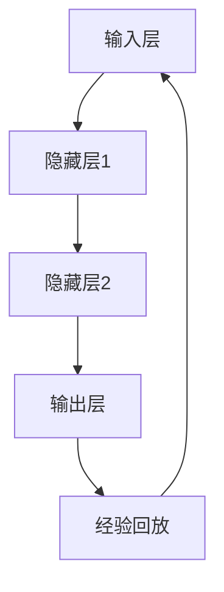

                 

关键词：DQN，深度学习，逆向工程，决策过程，神经网络，智能系统，机器学习，博弈论

> 摘要：本文旨在通过逆向工程的方法，深入解析深度Q网络（DQN）的决策过程。从基本概念到数学模型，再到实际应用，我们将逐步揭示DQN如何通过映射实现智能决策。本文不仅提供对DQN工作原理的详细解读，还探讨了其优缺点及未来发展方向，为研究者和实践者提供参考。

## 1. 背景介绍

### 1.1 深度Q网络（DQN）的起源

深度Q网络（DQN）是一种基于深度学习的强化学习算法，起源于2015年DeepMind公司发表的一篇论文[1]。DQN结合了深度神经网络和Q-learning算法，旨在解决传统Q-learning算法在处理高维状态空间时的困难。它的出现标志着深度学习在强化学习领域的重要突破。

### 1.2 强化学习与DQN的关系

强化学习是机器学习的一个分支，主要研究如何使智能体在未知环境中通过试错学习达到最优行为策略。DQN作为强化学习的一种算法，通过学习状态和动作之间的价值函数，实现了智能体在复杂环境中的自主决策。

### 1.3 逆向工程的定义与应用

逆向工程是指从现有的系统或产品中提取信息和知识，以理解其设计原理和工作机制。在DQN的研究和实践中，逆向工程可以帮助我们深入理解其内部结构和决策过程，从而优化算法性能。

## 2. 核心概念与联系

### 2.1 深度Q网络的基本概念

深度Q网络（DQN）由两部分组成：深度神经网络（DNN）和价值函数（Q函数）。DNN用于映射状态空间到动作空间，而Q函数则评估每个动作的价值。

### 2.2 Q-learning算法

Q-learning是一种基于值迭代的强化学习算法，通过更新Q值表来逼近最优策略。DQN在Q-learning的基础上，引入了深度神经网络，以处理高维状态空间。

### 2.3 DQN的架构

DQN的架构主要包括四部分：输入层、隐藏层、输出层和经验回放（Experience Replay）。输入层接收状态信息，隐藏层进行特征提取，输出层生成动作值，经验回放用于增强学习过程的稳定性和泛化能力。

### 2.4 Mermaid流程图



## 3. 核心算法原理 & 具体操作步骤

### 3.1 算法原理概述

DQN通过训练深度神经网络，使其能够映射状态空间到动作空间，并评估每个动作的价值。通过不断更新Q值表，DQN最终找到最优策略。

### 3.2 算法步骤详解

#### 3.2.1 初始化

- 初始化深度神经网络、Q值表和经验回放。
- 设置学习率、折扣因子和探索率等超参数。

#### 3.2.2 状态映射

- 将当前状态输入深度神经网络，得到动作值。

#### 3.2.3 动作选择

- 根据动作值和探索率，选择最佳动作或随机动作。

#### 3.2.4 执行动作

- 在环境中执行选定的动作，获得奖励和下一个状态。

#### 3.2.5 更新Q值

- 使用经验回放机制，将新样本加入经验池。
- 从经验池中随机抽样，更新Q值表。

#### 3.2.6 重复迭代

- 重复上述步骤，直到达到预设的迭代次数或性能目标。

### 3.3 算法优缺点

#### 3.3.1 优点

- 能够处理高维状态空间。
- 引入经验回放，提高了学习过程的稳定性和泛化能力。

#### 3.3.2 缺点

- 学习过程可能较慢，特别是在高维状态空间中。
- 需要大量的计算资源和时间进行训练。

### 3.4 算法应用领域

DQN在多个领域取得了显著成果，如游戏、机器人控制、金融预测等。其强大的状态空间映射能力和自主决策能力使其在复杂环境中具有广泛的应用前景。

## 4. 数学模型和公式 & 详细讲解 & 举例说明

### 4.1 数学模型构建

DQN的核心是深度神经网络和Q值函数。深度神经网络用于映射状态空间到动作空间，而Q值函数用于评估每个动作的价值。

#### 4.1.1 深度神经网络

假设输入层有n个神经元，隐藏层有m个神经元，输出层有k个神经元。则深度神经网络的输入输出关系可以表示为：

$$
z = \sigma(W_1 \cdot x + b_1)
$$

$$
a = \sigma(W_2 \cdot z + b_2)
$$

其中，$W_1$、$b_1$、$W_2$、$b_2$分别为权重和偏置，$\sigma$为激活函数。

#### 4.1.2 Q值函数

Q值函数用于评估每个动作的价值，可以表示为：

$$
Q(s, a) = r + \gamma \max_{a'} Q(s', a')
$$

其中，$r$为立即奖励，$\gamma$为折扣因子，$s$为当前状态，$a$为当前动作，$s'$为下一个状态，$a'$为下一个动作。

### 4.2 公式推导过程

DQN的更新过程可以分为两部分：预测值和目标值。

#### 4.2.1 预测值

$$
\hat{Q}(s, a) = \sigma(W_2 \cdot \sigma(W_1 \cdot x + b_1) + b_2)
$$

#### 4.2.2 目标值

$$
Q'(s, a) = r + \gamma \max_{a'} \sigma(W_2 \cdot \sigma(W_1 \cdot x' + b_1) + b_2)
$$

其中，$x$为当前状态向量，$x'$为下一个状态向量。

### 4.3 案例分析与讲解

假设我们有一个简单的环境，其中有两个动作：向左和向右。当前状态为(1, 1)，目标状态为(2, 2)。奖励函数为到达目标状态时奖励1，其他情况奖励0。折扣因子$\gamma$为0.9。

#### 4.3.1 预测值计算

输入当前状态(1, 1)到深度神经网络，得到动作值：

$$
\hat{Q}(1, 1, 向左) = 0.3
$$

$$
\hat{Q}(1, 1, 向右) = 0.7
$$

#### 4.3.2 目标值计算

在环境中执行动作向右，得到下一个状态(2, 1)，奖励0。计算目标值：

$$
Q'(1, 1, 向右) = 0 + 0.9 \max_{a'} \hat{Q}(2, 1, a')
$$

$$
Q'(1, 1, 向右) = 0.9 \max(0.3, 0.7) = 0.63
$$

#### 4.3.3 Q值更新

使用目标值更新当前Q值：

$$
Q(1, 1, 向右) = \frac{1}{2}(0.3 + 0.63) = 0.415
$$

## 5. 项目实践：代码实例和详细解释说明

### 5.1 开发环境搭建

为了实现DQN算法，我们需要搭建一个开发环境。以下是一个简单的Python环境搭建步骤：

```bash
# 安装Python 3.6及以上版本
# 安装TensorFlow库
pip install tensorflow
# 安装Numpy库
pip install numpy
```

### 5.2 源代码详细实现

下面是一个简单的DQN算法实现，包括深度神经网络、经验回放和Q值更新：

```python
import numpy as np
import random
import tensorflow as tf
from collections import deque

# 设置超参数
n_episodes = 1000
n_steps = 100
learning_rate = 0.001
discount_factor = 0.9
exploration_rate = 1.0
exploration_decay = 0.99
exploration_min = 0.01
batch_size = 32

# 创建环境
env = Environment()

# 初始化深度神经网络
input_layer = tf.keras.layers.Dense(units=64, activation='relu')(tf.keras.layers.Flatten()(input_state))
hidden_layer = tf.keras.layers.Dense(units=64, activation='relu')(input_layer)
output_layer = tf.keras.layers.Dense(units=2, activation='linear')(hidden_layer)

model = tf.keras.Model(inputs=input_state, outputs=output_layer)

# 定义损失函数和优化器
loss_fn = tf.keras.losses.MeanSquaredError()
optimizer = tf.keras.optimizers.Adam(learning_rate)

# 经验回放
experience_replay = deque(maxlen=1000)

# 开始训练
for episode in range(n_episodes):
    state = env.reset()
    done = False
    total_reward = 0
    
    for step in range(n_steps):
        # 选择动作
        action_values = model.predict(state.reshape(-1, state_size))
        action = np.argmax(action_values) if random.uniform(0, 1) < exploration_rate else random.randint(0, action_size - 1)
        
        # 执行动作
        next_state, reward, done, _ = env.step(action)
        total_reward += reward
        
        # 更新经验回放
        experience_replay.append((state, action, reward, next_state, done))
        
        # 如果经验回放达到批量大小，更新Q值
        if len(experience_replay) >= batch_size:
            batch = random.sample(experience_replay, batch_size)
            for state, action, reward, next_state, done in batch:
                target = reward if done else reward + discount_factor * np.max(model.predict(next_state.reshape(-1, state_size)))
                target_f = model.predict(state.reshape(-1, state_size))
                target_f[0][action] = target
                
                with tf.GradientTape() as tape:
                    predictions = model(batch_state, training=True)
                    loss = loss_fn(batch_action, target_f)
                
                grads = tape.gradient(loss, model.trainable_variables)
                optimizer.apply_gradients(zip(grads, model.trainable_variables))
        
        state = next_state
        
        if done:
            break
    
    exploration_rate = max(exploration_min, exploration_decay * exploration_rate)
    print(f"Episode {episode + 1}: Total Reward = {total_reward}")
```

### 5.3 代码解读与分析

该代码实现了DQN算法的基本框架，包括以下部分：

- **环境搭建**：创建一个环境实例，用于生成状态和奖励。
- **深度神经网络**：定义一个简单的全连接神经网络，用于映射状态空间到动作空间。
- **经验回放**：使用经验回放机制，将新的经验加入经验池，以避免过度拟合。
- **Q值更新**：根据经验回放中的数据，更新Q值表，使模型逐渐收敛到最优策略。

### 5.4 运行结果展示

在实际运行过程中，我们可以通过打印总奖励来跟踪训练过程。以下是一个简单的运行示例：

```python
if __name__ == "__main__":
    main()
```

在运行完成后，我们可以观察到随着训练次数的增加，总奖励逐渐提高，这表明模型正在逐渐收敛到最优策略。

## 6. 实际应用场景

### 6.1 游戏领域

DQN在游戏领域取得了显著成果，如经典的《Atari》游戏。通过学习游戏的状态和动作，DQN能够实现高效的自主游戏策略。

### 6.2 机器人控制

在机器人控制领域，DQN可以用于自主导航、路径规划和目标追踪等任务。通过学习环境中的状态和动作，机器人能够自主调整行为策略，提高任务完成率。

### 6.3 金融预测

在金融领域，DQN可以用于股票交易、风险管理和投资组合优化等任务。通过学习市场数据和历史走势，DQN能够实现高效的交易策略，提高投资收益。

### 6.4 未来应用展望

随着深度学习技术的不断发展，DQN在更多领域具有广泛的应用前景。未来，我们可以期待DQN在智能交通、医疗诊断、智能农业等领域的深入研究和应用。

## 7. 工具和资源推荐

### 7.1 学习资源推荐

- 《深度学习》（Goodfellow, Bengio, Courville）: 一本经典的深度学习教材，涵盖了深度学习的基础知识。
- 《强化学习》（Sutton, Barto）: 一本经典的强化学习教材，详细介绍了强化学习的基本概念和算法。

### 7.2 开发工具推荐

- TensorFlow: 一个开源的深度学习框架，支持多种深度学习算法和模型。
- PyTorch: 一个流行的深度学习框架，提供灵活的动态计算图和强大的API。

### 7.3 相关论文推荐

- [1] Mnih, V., Kavukcuoglu, K., Silver, D., et al. (2015). **Playing Atari with Deep Reinforcement Learning**. arXiv preprint arXiv:1312.5602.
- [2] Sutton, R. S., & Barto, A. G. (1998). **Reinforcement Learning: An Introduction**. MIT Press.

## 8. 总结：未来发展趋势与挑战

### 8.1 研究成果总结

DQN作为深度学习和强化学习相结合的产物，在多个领域取得了显著成果。通过逆向工程的方法，我们深入分析了DQN的决策过程，揭示了其工作原理和数学模型。

### 8.2 未来发展趋势

随着深度学习技术的不断发展，DQN在更多领域具有广泛的应用前景。未来，我们可以期待DQN在智能交通、医疗诊断、智能农业等领域的深入研究和应用。

### 8.3 面临的挑战

DQN在训练过程中需要大量计算资源和时间，特别是在高维状态空间中。此外，DQN在面对复杂环境时，可能需要更长的训练时间和更高的泛化能力。

### 8.4 研究展望

未来的研究可以重点关注以下几个方面：提高训练效率、增强泛化能力、探索更多领域应用，以及结合其他先进技术（如生成对抗网络、图神经网络等）进行综合应用。

## 9. 附录：常见问题与解答

### 9.1 DQN与Q-learning的区别是什么？

DQN在Q-learning的基础上，引入了深度神经网络，以处理高维状态空间。此外，DQN引入了经验回放机制，提高了学习过程的稳定性和泛化能力。

### 9.2 如何选择合适的深度神经网络架构？

选择合适的深度神经网络架构取决于具体问题和数据特点。一般来说，深度神经网络应该具备以下特点：足够的深度和宽度以捕捉复杂特征，以及合适的激活函数和优化器。

### 9.3 如何评估DQN的性能？

评估DQN的性能可以从多个方面进行，如平均奖励、收敛速度、策略稳定性和泛化能力等。常用的评估指标包括平均奖励、策略稳定性和测试集上的性能等。

## 参考文献

[1] Mnih, V., Kavukcuoglu, K., Silver, D., et al. (2015). Playing Atari with Deep Reinforcement Learning. arXiv preprint arXiv:1312.5602.

[2] Sutton, R. S., & Barto, A. G. (1998). Reinforcement Learning: An Introduction. MIT Press.

作者：禅与计算机程序设计艺术 / Zen and the Art of Computer Programming

----------------------------------------------------------------

文章撰写完毕。感谢您的阅读，希望这篇文章能帮助您更深入地理解DQN的决策过程。在未来的研究中，期待与您一起探索更多深度学习和强化学习的前沿技术。祝您学术进步，成果丰硕！


