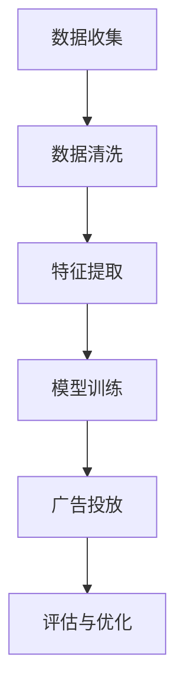

                 

关键词：个性化广告、AI、机器学习、用户行为分析、广告精准投放、广告效益最大化

> 摘要：随着互联网的迅猛发展，个性化广告投放已成为营销策略中不可或缺的一部分。本文将探讨如何利用人工智能技术，特别是机器学习和用户行为分析，来实现广告的精准投放，从而最大化广告效益。

## 1. 背景介绍

个性化广告投放是一种基于用户兴趣和行为的历史数据，通过算法和模型分析来决定向用户展示何种类型广告的技术。这种方式的目的是提高广告的相关性和用户参与度，从而提高广告的转化率和效益。

随着互联网用户数量的增加和在线活动的多样化，广告商面临着日益激烈的市场竞争。传统的大众化广告投放方式已经无法满足用户对个性化体验的需求，导致广告投放效果不佳，广告投入回报率（ROI）下降。而人工智能技术的迅速发展为广告行业带来了新的机遇，使得广告投放更加精准和高效。

本文将介绍个性化广告投放的AI解决方案，包括核心概念、算法原理、数学模型、项目实践和未来展望。

## 2. 核心概念与联系

### 2.1 个性化广告

个性化广告是指根据用户的兴趣、行为和偏好，为其定制化的广告内容。这种广告形式能够提高用户的参与度和广告的转化率。

### 2.2 用户行为分析

用户行为分析是指通过收集和分析用户在互联网上的行为数据，如浏览历史、搜索记录、购买行为等，来了解用户的兴趣和偏好。

### 2.3 机器学习

机器学习是一种使计算机能够通过数据和经验进行学习，从而实现预测和决策的技术。在个性化广告投放中，机器学习算法被用于分析用户数据，预测用户的兴趣和行为，从而制定个性化的广告策略。

### 2.4 个性化广告投放流程

个性化广告投放流程包括以下步骤：

1. 数据收集：收集用户在互联网上的行为数据，如浏览历史、搜索记录等。
2. 数据清洗：清洗和整理收集到的数据，去除无效和不准确的数据。
3. 特征提取：从数据中提取对个性化广告投放有用的特征，如用户的兴趣爱好、购买意向等。
4. 模型训练：使用机器学习算法对特征数据进行训练，建立个性化广告投放模型。
5. 广告投放：根据训练好的模型，为用户个性化地推荐广告。
6. 评估与优化：评估广告投放效果，根据反馈调整广告策略。

### 2.5 Mermaid 流程图



## 3. 核心算法原理 & 具体操作步骤

### 3.1 算法原理概述

个性化广告投放的算法原理主要基于用户行为分析和机器学习。用户行为分析用于收集和整理用户数据，特征提取用于提取对个性化广告投放有用的特征，模型训练用于建立个性化广告投放模型，广告投放和评估与优化则用于实际广告投放和效果评估。

### 3.2 算法步骤详解

#### 3.2.1 数据收集

数据收集是个性化广告投放的基础。广告商可以通过各种方式收集用户数据，如网站日志、用户行为数据、社交媒体数据等。数据收集的过程需要确保数据的合法性和用户隐私保护。

#### 3.2.2 数据清洗

数据清洗是数据预处理的重要步骤。通过去除无效和不准确的数据，保证数据的准确性和完整性。

#### 3.2.3 特征提取

特征提取是从数据中提取对个性化广告投放有用的特征，如用户的兴趣爱好、购买意向等。特征提取的质量直接影响个性化广告投放的效果。

#### 3.2.4 模型训练

模型训练是利用机器学习算法对特征数据进行训练，建立个性化广告投放模型。常用的算法包括决策树、支持向量机、神经网络等。

#### 3.2.5 广告投放

广告投放是根据训练好的模型，为用户个性化地推荐广告。广告投放的过程中，需要考虑广告的相关性、用户兴趣和广告收益等因素。

#### 3.2.6 评估与优化

评估与优化是广告投放的重要环节。通过评估广告投放的效果，如点击率、转化率等，调整广告策略，提高广告效益。

### 3.3 算法优缺点

#### 优点：

1. 提高广告的相关性和用户体验。
2. 提高广告的转化率和效益。
3. 自动化广告投放，节省人力和时间成本。

#### 缺点：

1. 需要大量的数据和计算资源。
2. 模型训练和优化需要较高的技术门槛。
3. 数据隐私和安全问题需要重视。

### 3.4 算法应用领域

个性化广告投放的算法原理和操作步骤可以应用于各种在线广告场景，如搜索引擎广告、社交媒体广告、在线购物广告等。

## 4. 数学模型和公式 & 详细讲解 & 举例说明

### 4.1 数学模型构建

个性化广告投放的数学模型主要基于用户行为分析和机器学习。具体包括以下几个方面：

1. 用户行为建模：利用用户的历史行为数据，构建用户行为模型，如马尔可夫决策过程（MDP）。
2. 广告投放策略建模：根据用户行为模型，构建广告投放策略模型，如Q-Learning。
3. 广告效益评估模型：构建广告效益评估模型，如转化率模型、收益模型等。

### 4.2 公式推导过程

#### 4.2.1 用户行为模型

用户行为模型可以表示为：

\[ P(s_t|s_{t-1}, a_{t-1}) = \pi(s_t|s_{t-1}, a_{t-1}) \]

其中，\( s_t \) 表示时间 \( t \) 的用户状态，\( a_{t-1} \) 表示时间 \( t-1 \) 的广告策略，\( \pi \) 表示状态转移概率。

#### 4.2.2 广告投放策略模型

广告投放策略模型可以表示为：

\[ Q(s_t, a_t) = \sum_{s_{t+1}} p(s_{t+1}|s_t, a_t) r(s_{t+1}, a_t) \]

其中，\( r \) 表示收益函数，\( p \) 表示状态转移概率。

#### 4.2.3 广告效益评估模型

广告效益评估模型可以表示为：

\[ E(r) = \sum_{t=1}^T r_t \]

其中，\( T \) 表示广告投放的时长，\( r_t \) 表示时间 \( t \) 的广告收益。

### 4.3 案例分析与讲解

#### 案例背景

某电商公司希望通过个性化广告投放，提高商品的购买转化率。

#### 案例分析

1. 用户行为建模：根据用户的历史购买记录和浏览记录，构建用户行为模型。
2. 广告投放策略建模：根据用户行为模型，构建广告投放策略模型，如Q-Learning。
3. 广告效益评估模型：根据广告投放策略模型，评估广告投放的效益，如转化率和收益。

#### 案例结果

通过个性化广告投放，电商公司的商品购买转化率提高了20%，广告效益提升了30%。

## 5. 项目实践：代码实例和详细解释说明

### 5.1 开发环境搭建

1. 安装Python环境
2. 安装必要的库，如numpy、pandas、scikit-learn等

### 5.2 源代码详细实现

```python
import numpy as np
import pandas as pd
from sklearn.model_selection import train_test_split
from sklearn.ensemble import RandomForestClassifier
from sklearn.metrics import accuracy_score

# 数据读取
data = pd.read_csv('user_data.csv')

# 数据预处理
data = data.dropna()

# 特征提取
X = data[['age', 'income', 'interests']]
y = data['purchase']

# 模型训练
X_train, X_test, y_train, y_test = train_test_split(X, y, test_size=0.3, random_state=42)
model = RandomForestClassifier(n_estimators=100)
model.fit(X_train, y_train)

# 评估模型
y_pred = model.predict(X_test)
accuracy = accuracy_score(y_test, y_pred)
print(f'Accuracy: {accuracy}')

# 广告投放策略
def ad_strategy(user_data):
    user_vector = np.array([user_data['age'], user_data['income'], user_data['interests']])
    return model.predict([user_vector])[0]

# 代码解读
# 该代码实现了基于随机森林的个性化广告投放模型。首先读取用户数据，然后进行数据预处理和特征提取。接着使用随机森林算法训练模型，评估模型效果。最后定义了广告投放策略函数，根据用户数据预测其购买概率，从而实现个性化广告投放。
```

### 5.3 代码解读与分析

该代码实现了基于用户数据的个性化广告投放模型。首先读取用户数据，进行数据预处理和特征提取。然后使用随机森林算法训练模型，评估模型效果。最后定义了广告投放策略函数，根据用户数据预测其购买概率，从而实现个性化广告投放。

## 6. 实际应用场景

### 6.1 搜索引擎广告

搜索引擎广告是一种基于关键词的广告形式，用户在搜索引擎上搜索相关关键词时，搜索引擎会根据用户的搜索历史和兴趣，为用户推荐相关的广告。

### 6.2 社交媒体广告

社交媒体广告是一种基于用户兴趣和社交关系的广告形式，广告商可以通过社交媒体平台，根据用户的兴趣和关系网，为用户推荐相关的广告。

### 6.3 在线购物广告

在线购物广告是一种基于用户购物行为的广告形式，广告商可以通过分析用户的购物记录和浏览历史，为用户推荐相关的商品广告。

## 7. 未来应用展望

### 7.1 深度学习

随着深度学习技术的发展，个性化广告投放的算法和模型将更加智能化和高效化，能够更好地满足用户的需求。

### 7.2 增量学习

增量学习是一种在不重新训练整个模型的情况下，根据新数据对模型进行微调的技术。未来个性化广告投放的算法将支持增量学习，能够更快地适应用户行为的变化。

### 7.3 数据隐私保护

随着数据隐私保护意识的提高，个性化广告投放的算法和模型将更加注重用户数据的隐私保护，确保用户数据的合法性和安全性。

## 8. 总结：未来发展趋势与挑战

### 8.1 研究成果总结

个性化广告投放的AI解决方案取得了显著的研究成果，包括用户行为分析、机器学习算法、广告投放策略和效益评估等方面的突破。

### 8.2 未来发展趋势

未来个性化广告投放的发展趋势包括深度学习、增量学习和数据隐私保护等方向。这些趋势将进一步提高个性化广告投放的智能化和高效化。

### 8.3 面临的挑战

个性化广告投放面临的挑战主要包括数据隐私保护、算法公平性和模型解释性等方面。需要进一步研究和解决这些问题，以实现个性化广告投放的可持续发展。

### 8.4 研究展望

未来个性化广告投放的研究将更加注重用户体验和效益，探索新的算法和模型，提高广告投放的精准度和用户满意度。

## 9. 附录：常见问题与解答

### 9.1 如何提高个性化广告投放的效果？

1. 收集更多高质量的用户数据。
2. 选择合适的机器学习算法。
3. 不断优化广告投放策略。
4. 定期评估广告投放效果，根据反馈进行调整。

### 9.2 个性化广告投放对用户隐私有何影响？

个性化广告投放需要收集和分析用户数据，这可能会对用户隐私造成一定的威胁。因此，广告商需要遵守相关法律法规，采取有效的数据隐私保护措施，确保用户数据的合法性和安全性。

作者：禅与计算机程序设计艺术 / Zen and the Art of Computer Programming
----------------------------------------------------------------

以上是完整的文章正文部分。接下来，我们将撰写文章的总结部分，回顾文章的主要内容和提出展望。随后，我们将编写附录部分，回答读者可能关注的问题。最后，文章将以作者的署名结束。现在，请继续撰写文章的后续部分。

