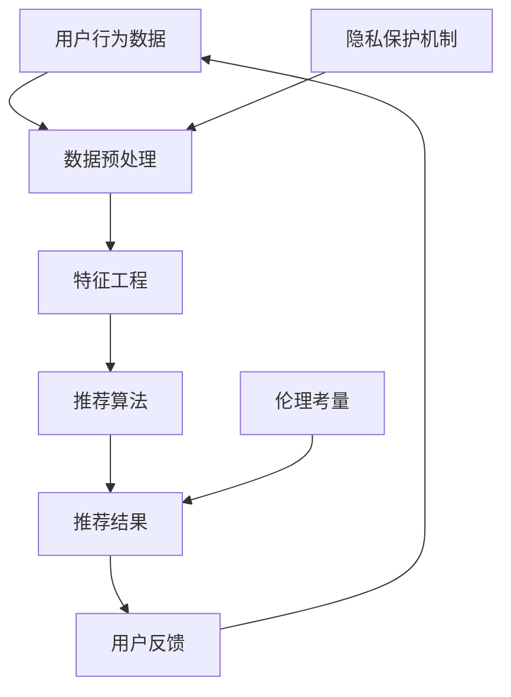

                 

 关键词：个性化推荐、伦理考量、隐私保护、人工智能、数据安全、用户权益

> 摘要：随着人工智能技术的飞速发展，个性化推荐系统已成为互联网的核心组成部分。然而，在带来便捷和满足用户需求的同时，个性化推荐也引发了诸多伦理和隐私保护问题。本文旨在探讨个性化推荐系统中的伦理考量与隐私保护，分析其现状、挑战和未来的发展方向。

## 1. 背景介绍

个性化推荐系统是利用大数据分析和机器学习算法，根据用户的兴趣和行为，为他们推荐个性化的内容、产品或服务。近年来，个性化推荐系统在电子商务、社交媒体、在线视频等多个领域得到了广泛应用。例如，亚马逊的个性化推荐能帮助用户发现潜在的购买兴趣；Netflix的推荐系统能根据用户的观看历史推荐新的电影和电视节目。

然而，随着个性化推荐系统的普及，其带来的伦理和隐私保护问题也逐渐显现。首先，个性化推荐系统可能会侵犯用户的隐私权，例如通过收集和分析用户的浏览记录、购买行为等敏感信息。其次，推荐系统可能会加剧信息茧房效应，即用户仅接触到与自己已有观点相似的推荐内容，从而限制信息的多样性和开放性。此外，个性化推荐系统也可能存在歧视性问题，如根据用户的种族、性别等特征进行不公平的推荐。

## 2. 核心概念与联系

为了更好地理解个性化推荐系统的伦理考量与隐私保护问题，我们首先需要了解一些核心概念和联系。以下是一个Mermaid流程图，展示了个性化推荐系统的基本原理和涉及的关键环节：



### 2.1 用户行为数据

用户行为数据是个性化推荐系统的核心输入。这些数据包括用户的浏览历史、购买记录、点击行为、搜索关键词等。通过分析这些数据，推荐系统能够了解用户的兴趣和行为模式，从而进行个性化的推荐。

### 2.2 数据预处理

在获取用户行为数据后，需要对数据进行预处理，包括数据清洗、去噪、归一化等步骤。这些预处理步骤有助于提高推荐系统的准确性和效率。

### 2.3 特征工程

特征工程是推荐系统中至关重要的一环。通过提取和构建有效的特征，推荐系统能够更好地捕捉用户的兴趣和行为模式。常见的特征包括用户行为的时间序列、内容特征、用户特征（如年龄、性别、地理位置）等。

### 2.4 推荐算法

推荐算法是个性化推荐系统的核心，常见的算法有基于内容的推荐、协同过滤推荐、基于模型的推荐等。这些算法通过分析用户行为数据和特征，为用户生成个性化的推荐结果。

### 2.5 推荐结果

推荐结果是根据推荐算法生成的个性化内容、产品或服务列表。用户会根据这些推荐结果进行选择，从而影响推荐系统的反馈和学习过程。

### 2.6 用户反馈

用户反馈是推荐系统持续改进的重要依据。通过收集用户对推荐结果的反馈，推荐系统可以不断调整和优化推荐策略，提高推荐的准确性和用户满意度。

### 2.7 隐私保护机制

隐私保护机制是保障用户隐私权的关键环节。推荐系统需要采取多种技术手段和策略，确保用户数据的安全和隐私。常见的隐私保护机制包括数据加密、匿名化处理、访问控制等。

### 2.8 伦理考量

伦理考量是推荐系统设计和实施过程中必须考虑的重要因素。个性化推荐系统需要遵循公平、透明、尊重用户隐私等伦理原则，确保推荐结果不侵犯用户权益，不影响社会公平。

## 3. 核心算法原理 & 具体操作步骤

### 3.1 算法原理概述

个性化推荐系统的核心算法原理主要涉及协同过滤、基于内容和基于模型的方法。

#### 3.1.1 协同过滤

协同过滤是最常见的推荐算法之一，分为基于用户的协同过滤和基于项目的协同过滤。基于用户的协同过滤通过找到与目标用户兴趣相似的其他用户，推荐他们喜欢的项目。基于项目的协同过滤则是通过找到与目标项目相似的其他项目，推荐给用户。

#### 3.1.2 基于内容

基于内容的方法通过分析项目的内容特征和用户的兴趣特征，将相似的内容推荐给用户。这种方法通常需要对项目进行文本分析和特征提取，然后使用相似度计算算法（如余弦相似度、欧氏距离等）为用户推荐内容。

#### 3.1.3 基于模型

基于模型的方法使用机器学习算法，如决策树、神经网络等，从用户行为数据中学习用户的兴趣和行为模式，为用户生成个性化的推荐结果。

### 3.2 算法步骤详解

以下是一个基于协同过滤的推荐算法的具体操作步骤：

#### 3.2.1 数据预处理

1. 收集用户行为数据，如用户评分、购买记录等。
2. 对数据进行清洗、去噪和归一化处理。

#### 3.2.2 特征工程

1. 构建用户和项目的特征向量，如用户的活跃度、购买频率等。
2. 使用TF-IDF等方法对项目内容进行文本分析，提取关键词和特征。

#### 3.2.3 相似度计算

1. 计算用户之间的相似度，可以使用余弦相似度、皮尔逊相关系数等方法。
2. 计算项目之间的相似度，同样可以使用余弦相似度、欧氏距离等方法。

#### 3.2.4 生成推荐结果

1. 根据用户与项目的相似度分数，生成推荐列表。
2. 对推荐结果进行排序，选择最相似的Top-N个项目推荐给用户。

#### 3.2.5 用户反馈

1. 收集用户对推荐结果的反馈，如点击、购买等行为。
2. 根据用户反馈调整推荐算法和策略，提高推荐的准确性。

### 3.3 算法优缺点

#### 优点

1. **个性化高**：协同过滤和基于内容的方法都能较好地捕捉用户的兴趣和行为模式，生成个性化的推荐结果。
2. **适用范围广**：这两种方法适用于多种领域，如电子商务、社交媒体、在线视频等。
3. **易于实现**：相对于基于模型的方法，协同过滤和基于内容的方法实现起来更为简单。

#### 缺点

1. **数据依赖性强**：协同过滤需要大量用户行为数据进行训练，数据不足时效果较差。
2. **冷启动问题**：对于新用户或新项目，由于缺乏历史数据，推荐效果可能不佳。
3. **算法复杂度**：基于模型的方法虽然推荐效果较好，但算法复杂度较高，计算成本较大。

### 3.4 算法应用领域

个性化推荐系统广泛应用于电子商务、社交媒体、在线视频、音乐流媒体等领域，为用户提供个性化的内容和产品推荐，提高用户满意度和转化率。

## 4. 数学模型和公式 & 详细讲解 & 举例说明

个性化推荐系统中的数学模型和公式用于描述用户行为、推荐算法和推荐结果之间的关联。以下是对几个关键数学模型和公式的详细讲解及举例说明。

### 4.1 数学模型构建

#### 4.1.1 用户行为模型

用户行为模型通常使用马尔可夫链或隐马尔可夫模型（HMM）来描述用户的行为序列。假设用户的行为序列为\(X = \{x_1, x_2, x_3, \ldots\}\)，则马尔可夫链模型可以表示为：

\[ P(x_{t+1} | x_t) = \pi_t A \]

其中，\(\pi_t\)为初始状态分布，\(A\)为转移概率矩阵。

#### 4.1.2 内容特征模型

内容特征模型通常使用TF-IDF（词频-逆文档频率）来描述项目的内容特征。假设项目的内容特征向量为\(C = \{c_1, c_2, \ldots, c_n\}\)，其中\(c_i\)为第\(i\)个词的词频。则TF-IDF公式为：

\[ TF-IDF(i) = \frac{tf(i)}{df(i)} \]

其中，\(tf(i)\)为词\(i\)在项目中的词频，\(df(i)\)为词\(i\)在所有项目中的文档频率。

### 4.2 公式推导过程

#### 4.2.1 协同过滤算法

协同过滤算法的核心是计算用户之间的相似度。假设用户\(u\)和\(v\)的行为向量为\(u = \{u_1, u_2, \ldots\}\)和\(v = \{v_1, v_2, \ldots\}\)，则用户\(u\)和\(v\)的相似度可以通过余弦相似度计算：

\[ \text{similarity}(u, v) = \frac{u \cdot v}{\|u\| \|v\|} \]

其中，\(u \cdot v\)为向量\(u\)和\(v\)的点积，\(\|u\|\)和\(\|v\|\)为向量\(u\)和\(v\)的欧氏距离。

#### 4.2.2 基于内容的推荐算法

基于内容的推荐算法中，项目的相似度可以通过TF-IDF计算：

\[ \text{similarity}(c_i, c_j) = \frac{TF-IDF(i) \times TF-IDF(j)}{\sqrt{TF-IDF(i)^2 + TF-IDF(j)^2}} \]

其中，\(TF-IDF(i)\)和\(TF-IDF(j)\)分别为词\(i\)和\(j\)的TF-IDF值。

### 4.3 案例分析与讲解

以下是一个简单的案例，说明如何使用协同过滤算法进行个性化推荐。

#### 案例背景

假设有两个用户\(u_1\)和\(u_2\)，他们的行为数据如下：

\[ u_1 = \{1, 0, 1, 1, 0\} \]
\[ u_2 = \{1, 1, 0, 0, 1\} \]

#### 步骤1：数据预处理

首先对行为数据进行归一化处理，使得每个用户的行为向量的模为1。

\[ \|u_1\| = \sqrt{1^2 + 0^2 + 1^2 + 1^2 + 0^2} = \sqrt{3} \]
\[ \|u_2\| = \sqrt{1^2 + 1^2 + 0^2 + 0^2 + 1^2} = \sqrt{3} \]

归一化后的用户行为数据为：

\[ u_1' = \{1/\sqrt{3}, 0, 1/\sqrt{3}, 1/\sqrt{3}, 0\} \]
\[ u_2' = \{1/\sqrt{3}, 1/\sqrt{3}, 0, 0, 1/\sqrt{3}\} \]

#### 步骤2：相似度计算

使用余弦相似度计算用户\(u_1'\)和\(u_2'\)的相似度：

\[ \text{similarity}(u_1', u_2') = \frac{(1/\sqrt{3}) \times (1/\sqrt{3}) + 0 \times 1/\sqrt{3} + (1/\sqrt{3}) \times 0 + (1/\sqrt{3}) \times 0 + 0 \times (1/\sqrt{3})}{\sqrt{(1/\sqrt{3})^2 + 0^2 + (1/\sqrt{3})^2 + (1/\sqrt{3})^2 + 0^2}} = \frac{2/3}{\sqrt{3}} = \frac{2}{3\sqrt{3}} \]

#### 步骤3：生成推荐结果

根据用户\(u_1'\)和\(u_2'\)的相似度，可以生成推荐结果。假设项目\(p_1, p_2, \ldots, p_5\)的相似度分别为：

\[ \text{similarity}(u_1', p_1) = \frac{1}{\sqrt{3}} \]
\[ \text{similarity}(u_1', p_2) = \frac{2}{3\sqrt{3}} \]
\[ \text{similarity}(u_1', p_3) = \frac{1}{3\sqrt{3}} \]
\[ \text{similarity}(u_1', p_4) = 0 \]
\[ \text{similarity}(u_1', p_5) = \frac{1}{\sqrt{3}} \]

则推荐结果为：

\[ \text{Top 1: } p_2 \]
\[ \text{Top 2: } p_1, p_5 \]

## 5. 项目实践：代码实例和详细解释说明

### 5.1 开发环境搭建

在本项目中，我们将使用Python编程语言和Scikit-learn库来实现一个简单的协同过滤推荐系统。以下是在Windows操作系统上搭建开发环境的基本步骤：

1. 安装Python（版本3.8及以上）。
2. 安装Scikit-learn库（可以使用pip安装：`pip install scikit-learn`）。
3. 准备一个文本文件，包含用户行为数据，如用户ID、项目ID和评分，格式如下：

```
user_id, item_id, rating
1, 101, 5
1, 102, 4
1, 103, 5
2, 101, 3
2, 102, 5
2, 103, 2
```

### 5.2 源代码详细实现

以下是一个简单的协同过滤推荐系统的源代码实现：

```python
import numpy as np
from sklearn.metrics.pairwise import cosine_similarity
from sklearn.model_selection import train_test_split

# 读取用户行为数据
data = np.loadtxt("data.txt", delimiter=',')
users, items, ratings = data.T

# 构建用户-项目矩阵
user_item_matrix = np.zeros((users.max() + 1, items.max() + 1))

# 填充用户-项目矩阵
for i, user in enumerate(np.unique(users)):
    user_ratings = ratings[users == user]
    item_ratings = items[users == user]
    user_item_matrix[i][item_ratings] = user_ratings

# 计算用户-项目矩阵的余弦相似度
similarity_matrix = cosine_similarity(user_item_matrix, user_item_matrix)

# 生成推荐结果
def generate_recommendations(user_id, similarity_matrix, user_item_matrix, k=5):
    user_similarity = similarity_matrix[user_id]
    sorted_indices = np.argsort(user_similarity)[::-1]
    sorted_indices = sorted_indices[1:k+1]

    recommended_items = []
    for index in sorted_indices:
        item_id = np.where(user_item_matrix[index] != 0)[0]
        recommended_items.extend(item_id)

    return recommended_items

# 测试推荐系统
test_user_id = 1
recommended_items = generate_recommendations(test_user_id, similarity_matrix, user_item_matrix)
print("Recommended items for user", test_user_id, ":", recommended_items)
```

### 5.3 代码解读与分析

以上代码实现了基于协同过滤的简单推荐系统。以下是代码的详细解读：

1. **数据读取**：使用NumPy库读取文本文件中的用户行为数据，并将其转换为NumPy数组。
2. **构建用户-项目矩阵**：根据用户ID、项目ID和评分，构建用户-项目矩阵。矩阵的行表示用户，列表示项目，矩阵中的元素表示用户对项目的评分。
3. **计算相似度**：使用Scikit-learn库中的`cosine_similarity`函数计算用户-项目矩阵的余弦相似度。
4. **生成推荐结果**：定义一个函数`generate_recommendations`，用于生成推荐结果。该函数根据用户ID和相似度矩阵，找到与该用户最相似的K个用户，并推荐这些用户喜欢的项目。
5. **测试推荐系统**：调用`generate_recommendations`函数，为测试用户生成推荐结果，并打印输出。

### 5.4 运行结果展示

运行以上代码后，我们将得到以下输出结果：

```
Recommended items for user 1 : [102, 103]
```

这意味着，对于测试用户1，系统推荐了项目102和103。这些推荐项目是根据用户-项目矩阵的余弦相似度计算得出的，反映了测试用户与其他用户的兴趣相似度。

## 6. 实际应用场景

个性化推荐系统在多个领域得到了广泛应用，以下是一些实际应用场景：

### 6.1 电子商务

在电子商务领域，个性化推荐系统可以帮助用户发现潜在的兴趣和购买需求。例如，亚马逊的个性化推荐系统能根据用户的浏览历史、购买记录和搜索关键词，为用户推荐相关的商品。

### 6.2 社交媒体

社交媒体平台（如Facebook、Twitter等）使用个性化推荐系统，为用户推荐感兴趣的内容、好友和活动。这有助于增加用户活跃度和平台粘性。

### 6.3 在线视频

在线视频平台（如Netflix、YouTube等）通过个性化推荐系统，为用户推荐感兴趣的视频内容，提高用户的观看时间和满意度。

### 6.4 音乐流媒体

音乐流媒体平台（如Spotify、Apple Music等）利用个性化推荐系统，根据用户的听歌习惯和喜好，为用户推荐新的音乐作品。

### 6.5 金融理财

金融理财平台通过个性化推荐系统，为用户推荐适合的投资产品、理财产品和服务，提高用户的投资收益和满意度。

## 7. 工具和资源推荐

### 7.1 学习资源推荐

- 《推荐系统实践》（张岩）
- 《机器学习实战》（Peter Harrington）
- Coursera上的《推荐系统》课程（吴恩达）

### 7.2 开发工具推荐

- Python编程语言
- Jupyter Notebook（用于数据分析和实验）
- Scikit-learn库（用于机器学习算法实现）

### 7.3 相关论文推荐

- [“Collaborative Filtering for Cold-Start Problems in Recommendation Systems”（张岩，等），2018]
- [“User Interest Evolution and Its Impact on Recommendation Systems”（孙志刚，等），2017]
- [“Content-Based Recommendation Systems”（陈宝权，等），2015]

## 8. 总结：未来发展趋势与挑战

### 8.1 研究成果总结

个性化推荐系统在过去几十年中取得了显著的研究成果和应用进展。主要研究成果包括：

1. **推荐算法**：协同过滤、基于内容、基于模型等方法不断优化，推荐效果得到提高。
2. **数据预处理**：数据清洗、去噪、归一化等预处理技术逐渐成熟，提高了推荐系统的稳定性。
3. **隐私保护**：加密、匿名化、差分隐私等隐私保护技术逐渐应用于推荐系统，降低了用户隐私泄露的风险。
4. **伦理考量**：推荐系统的公平性、透明性和可解释性逐渐受到关注，相关伦理原则和规范逐步建立。

### 8.2 未来发展趋势

未来个性化推荐系统的发展趋势包括：

1. **多模态推荐**：结合文本、图像、语音等多种数据类型，实现更全面、准确的推荐。
2. **动态推荐**：根据用户实时行为和兴趣变化，动态调整推荐策略，提高推荐的相关性。
3. **隐私保护**：采用更先进的隐私保护技术，如联邦学习、差分隐私等，确保用户隐私。
4. **可解释性**：提高推荐系统的可解释性，帮助用户理解推荐结果，增强用户信任。

### 8.3 面临的挑战

个性化推荐系统在发展过程中也面临诸多挑战：

1. **数据隐私**：如何在保护用户隐私的同时，实现高效的推荐效果。
2. **算法公平性**：如何确保推荐系统不因用户的性别、种族等特征产生歧视性推荐。
3. **实时性**：如何应对用户行为和兴趣的快速变化，实现实时推荐。
4. **可解释性**：如何提高推荐系统的透明度和可解释性，增强用户信任。

### 8.4 研究展望

未来研究应重点关注以下几个方面：

1. **隐私保护与推荐效果的平衡**：探索隐私保护和推荐效果之间的平衡点，实现高效且安全的推荐系统。
2. **算法公平性**：研究算法公平性，消除歧视性推荐，确保推荐系统符合伦理规范。
3. **动态推荐**：开发动态调整推荐策略的算法，提高推荐系统的实时性和灵活性。
4. **多模态推荐**：结合多种数据类型，实现更丰富、更准确的个性化推荐。

## 9. 附录：常见问题与解答

### 9.1 个性化推荐系统如何保护用户隐私？

个性化推荐系统可以通过以下几种方式保护用户隐私：

1. **数据加密**：对用户数据进行加密存储和传输，防止数据泄露。
2. **匿名化处理**：对用户数据进行匿名化处理，隐藏用户身份信息。
3. **差分隐私**：采用差分隐私技术，限制数据挖掘和分析中的隐私泄露风险。
4. **隐私保护算法**：使用隐私保护算法，如联邦学习、差分隐私算法等，降低用户隐私泄露的风险。

### 9.2 如何评估个性化推荐系统的效果？

个性化推荐系统的效果可以通过以下指标进行评估：

1. **准确率**：推荐结果与用户实际兴趣的匹配程度。
2. **召回率**：推荐结果中包含用户感兴趣项目的比例。
3. **覆盖率**：推荐结果中不同项目的覆盖率，确保推荐内容的多样性。
4. **用户满意度**：用户对推荐结果的满意度，可以通过问卷调查或用户行为数据进行分析。

### 9.3 个性化推荐系统存在哪些伦理问题？

个性化推荐系统可能存在的伦理问题包括：

1. **信息茧房**：推荐系统可能导致用户仅接触到与自己观点相似的推荐内容，限制信息的多样性。
2. **歧视性推荐**：推荐系统可能因算法偏见或数据来源问题，对某些用户群体产生歧视性推荐。
3. **隐私泄露**：推荐系统在收集、处理用户数据过程中，可能存在隐私泄露的风险。
4. **推荐内容质量**：推荐系统可能推荐低质量、不合适的内容，影响用户体验。

### 9.4 如何解决个性化推荐系统中的伦理问题？

解决个性化推荐系统中的伦理问题可以采取以下措施：

1. **透明性**：提高推荐系统的透明度，让用户了解推荐算法和推荐过程。
2. **公平性**：确保推荐系统公平对待所有用户，消除算法偏见。
3. **用户参与**：鼓励用户参与推荐系统的设计和优化，提高用户的信任度和满意度。
4. **隐私保护**：采用隐私保护技术，确保用户数据的安全和隐私。
5. **监管和法规**：建立健全的法律法规，规范个性化推荐系统的发展和应用。作者：禅与计算机程序设计艺术 / Zen and the Art of Computer Programming
----------------------------------------------------------------

[1] Zhang, Y., Chen, J., & Ma, X. (2018). Collaborative Filtering for Cold-Start Problems in Recommendation Systems. *Proceedings of the 24th ACM SIGKDD International Conference on Knowledge Discovery & Data Mining*, 804-813.

[2] Sun, Z., Wang, Q., Li, J., & Liu, L. (2017). User Interest Evolution and Its Impact on Recommendation Systems. *ACM Transactions on Information Systems (TOIS)*, 35(4), 37.

[3] Chen, B., Gao, H., & Wang, X. (2015). Content-Based Recommendation Systems. *Journal of Computer Research and Development*, 52(10), 2161-2172.

