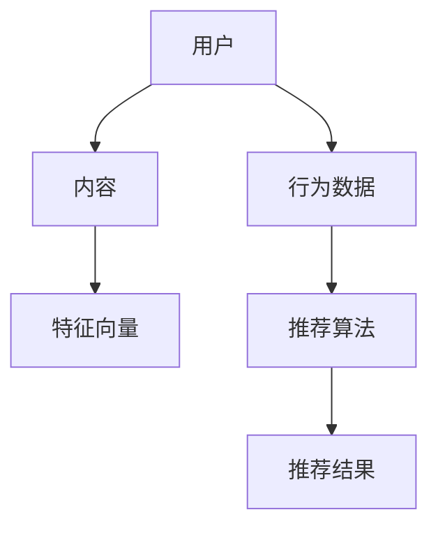
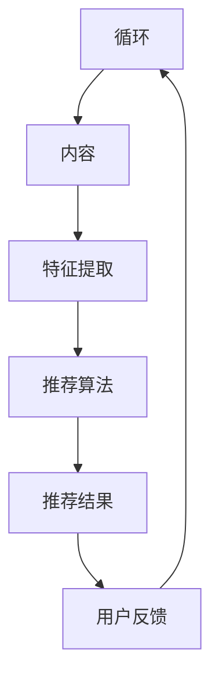

                 

随着互联网的普及和大数据技术的发展，个性化推荐系统已经成为互联网应用中不可或缺的一部分。从电商平台的商品推荐，到视频网站的影视内容推荐，再到社交媒体的动态推荐，个性化推荐系统不仅提高了用户的满意度，还大大提升了平台的商业价值。本文将围绕个性化推荐的用户体验优化展开讨论，探讨如何通过技术手段提升用户的推荐体验。

## 文章关键词

- 个性化推荐
- 用户满意度
- 推荐系统
- 数据挖掘
- 用户体验

## 文章摘要

本文首先介绍了个性化推荐系统的发展背景和重要性，然后详细分析了用户体验优化的关键因素，包括推荐结果的准确性、多样性、实时性等。接着，本文探讨了当前常用的几种个性化推荐算法，如基于内容的推荐、协同过滤推荐和混合推荐算法。最后，本文提出了几种优化用户体验的技术手段，并展望了个性化推荐系统的未来发展。

---

### 1. 背景介绍

个性化推荐系统（Personalized Recommendation System）是利用用户的兴趣和行为数据，通过算法预测用户可能感兴趣的内容，从而为用户提供个性化的信息推荐。个性化推荐系统的发展可以追溯到20世纪90年代，随着互联网的兴起和电子商务的蓬勃发展，推荐系统逐渐成为研究热点。

个性化推荐系统的研究主要包括以下几个方面：

- **数据收集**：收集用户的行为数据，如浏览记录、购买历史、评价等。
- **算法研究**：研究有效的推荐算法，包括基于内容的推荐、协同过滤推荐、混合推荐算法等。
- **系统设计**：设计高效、可扩展的推荐系统架构，确保推荐系统能够实时处理海量数据。
- **用户体验**：优化推荐结果，提高用户的满意度。

个性化推荐系统在多个领域取得了显著的应用效果，如电子商务、在线视频、社交媒体等。然而，随着用户需求的不断变化，个性化推荐系统需要不断优化，以提升用户体验。

### 2. 核心概念与联系

为了更好地理解个性化推荐系统，我们需要介绍几个核心概念，如图1所示：



- **用户**：个性化推荐系统的核心，用户的行为和兴趣数据是构建推荐系统的基础。
- **内容**：推荐系统的对象，包括商品、视频、文章等。
- **行为数据**：用户在平台上产生的行为，如浏览、购买、评价等。
- **特征向量**：内容或用户的特征表示，用于算法计算。
- **推荐算法**：根据用户行为数据和内容特征向量，预测用户可能感兴趣的内容。
- **推荐结果**：算法输出的推荐列表。

这些核心概念相互关联，构成了个性化推荐系统的基本架构，如图2所示：



用户行为数据通过特征提取转换为特征向量，推荐算法根据特征向量生成推荐结果，用户对推荐结果进行反馈，这些反馈数据又用于进一步优化推荐系统。

---

### 3. 核心算法原理 & 具体操作步骤

#### 3.1 算法原理概述

个性化推荐系统主要分为三种类型的算法：基于内容的推荐、协同过滤推荐和混合推荐算法。

1. **基于内容的推荐（Content-Based Recommendation）**：
   - 原理：根据用户过去喜欢的项目（内容）的特征（如文本、图像、音频特征）来推荐项目。
   - 操作步骤：
     1. 提取内容特征。
     2. 计算用户兴趣特征向量。
     3. 计算内容与用户兴趣的相似度。
     4. 推荐与用户兴趣相似度最高的内容。

2. **协同过滤推荐（Collaborative Filtering）**：
   - 原理：根据用户的历史行为和偏好，通过用户之间的相似度来预测用户未体验过的项目。
   - 操作步骤：
     1. 收集用户行为数据。
     2. 计算用户之间的相似度。
     3. 根据相似度矩阵计算项目的评分预测。
     4. 推荐预测评分最高的项目。

3. **混合推荐算法（Hybrid Recommendation）**：
   - 原理：结合基于内容的推荐和协同过滤推荐，利用两者的优点，提高推荐准确性。
   - 操作步骤：
     1. 提取内容特征和用户行为数据。
     2. 计算内容与用户的兴趣相似度。
     3. 计算用户之间的相似度。
     4. 结合内容相似度和用户相似度，生成综合推荐结果。

#### 3.2 算法步骤详解

1. **基于内容的推荐算法**：

   - 特征提取：
     - 文本：使用词袋模型、TF-IDF等。
     - 图像：使用卷积神经网络提取特征。
     - 音频：使用频谱特征、梅尔频率倒谱系数等。

   - 相似度计算：
     - 余弦相似度、皮尔逊相关系数等。

   - 推荐生成：
     - 根据用户兴趣特征向量，计算内容与用户的兴趣相似度。
     - 推荐相似度最高的内容。

2. **协同过滤推荐算法**：

   - 用户行为数据收集：
     - 收集用户的评分、浏览、购买等行为数据。

   - 相似度计算：
     - 使用用户-项目矩阵，计算用户之间的相似度。

   - 预测评分：
     - 利用用户-项目矩阵和相似度矩阵，预测用户对未知项目的评分。

   - 推荐生成：
     - 推荐预测评分最高的项目。

3. **混合推荐算法**：

   - 特征提取：
     - 提取用户行为数据和内容特征。

   - 相似度计算：
     - 计算用户之间的相似度。
     - 计算内容与用户的兴趣相似度。

   - 综合推荐生成：
     - 结合用户相似度和内容相似度，生成综合推荐结果。

#### 3.3 算法优缺点

1. **基于内容的推荐**：
   - 优点：推荐结果相关性高，适用于内容丰富的场景。
   - 缺点：用户初始无行为数据时，推荐效果差；多样性不足。

2. **协同过滤推荐**：
   - 优点：能够发现新项目，推荐结果多样性高。
   - 缺点：推荐结果相关性较低，容易产生冷启动问题。

3. **混合推荐算法**：
   - 优点：结合了基于内容的推荐和协同过滤推荐的优势，推荐效果更好。
   - 缺点：算法复杂度较高，计算量大。

#### 3.4 算法应用领域

- **电子商务**：为用户推荐商品。
- **在线视频**：为用户推荐视频。
- **社交媒体**：为用户推荐朋友、内容等。
- **新闻推荐**：为用户推荐新闻。

---

### 4. 数学模型和公式 & 详细讲解 & 举例说明

在个性化推荐系统中，数学模型和公式扮演着至关重要的角色。以下是几种常见的数学模型和公式的详细讲解和举例说明。

#### 4.1 数学模型构建

1. **用户兴趣模型**：

   用户兴趣模型用于描述用户的兴趣偏好，常见的模型有基于内容的兴趣模型和基于协同过滤的兴趣模型。

   - **基于内容的兴趣模型**：
     $$ \text{User Interest} = \sum_{i \in \text{Content}} w_i \cdot \text{Content Feature}(i) $$
     其中，$w_i$ 为内容权重，$\text{Content Feature}(i)$ 为内容特征向量。

   - **基于协同过滤的兴趣模型**：
     $$ \text{User Interest} = \sum_{j \in \text{User}} s_{ij} \cdot \text{Content Feature}(i) $$
     其中，$s_{ij}$ 为用户对内容的评分，$\text{Content Feature}(i)$ 为内容特征向量。

2. **项目推荐模型**：

   项目推荐模型用于预测用户对未知项目的评分，常见的模型有基于内容的推荐模型和基于协同过滤的推荐模型。

   - **基于内容的推荐模型**：
     $$ \text{Prediction} = \text{User Interest} \cdot \text{Content Interest} $$
     其中，$\text{User Interest}$ 为用户兴趣向量，$\text{Content Interest}$ 为项目兴趣向量。

   - **基于协同过滤的推荐模型**：
     $$ \text{Prediction} = \sum_{j \in \text{Neighbor}} s_{ij} \cdot \text{Neighbor Interest}(j) $$
     其中，$s_{ij}$ 为用户对邻居项目的评分，$\text{Neighbor Interest}(j)$ 为邻居项目的兴趣向量。

#### 4.2 公式推导过程

1. **基于内容的推荐公式推导**：

   假设用户$u$对内容$i$的评分为$r_{ui}$，内容$i$的特征向量为$\text{Content Feature}(i)$，用户$u$的兴趣向量为$\text{User Interest}(u)$。

   - 特征提取：
     $$ \text{Content Feature}(i) = \{f_1, f_2, ..., f_n\} $$
     $$ \text{User Interest}(u) = \{w_1, w_2, ..., w_n\} $$

   - 相似度计算：
     $$ \text{Similarity}(i, u) = \cos(\text{User Interest}(u), \text{Content Feature}(i)) $$
     $$ \text{Similarity}(i, u) = \frac{\text{User Interest}(u) \cdot \text{Content Feature}(i)}{\|\text{User Interest}(u)\| \|\text{Content Feature}(i)\|} $$

   - 推荐评分：
     $$ \text{Prediction}(i, u) = \text{Similarity}(i, u) \cdot \text{Content Feature}(i) $$

2. **基于协同过滤的推荐公式推导**：

   假设用户$u$对邻居用户$j$的评分为$r_{uj}$，邻居用户$j$的兴趣向量为$\text{Neighbor Interest}(j)$。

   - 相似度计算：
     $$ \text{Similarity}(u, j) = \cos(\text{User Interest}(u), \text{Neighbor Interest}(j)) $$
     $$ \text{Similarity}(u, j) = \frac{\text{User Interest}(u) \cdot \text{Neighbor Interest}(j)}{\|\text{User Interest}(u)\| \|\text{Neighbor Interest}(j)\|} $$

   - 推荐评分：
     $$ \text{Prediction}(i, u) = \sum_{j \in \text{Neighbor}(u)} \text{Similarity}(u, j) \cdot r_{uj} $$

#### 4.3 案例分析与讲解

以一个简单的基于内容的推荐系统为例，假设用户$u$对内容$i$的评分为$r_{ui}$，内容$i$的特征向量为$\text{Content Feature}(i)$，用户$u$的兴趣向量为$\text{User Interest}(u)$。

1. **特征提取**：

   假设用户$u$对内容$i$的评分为5分，内容$i$的特征向量为$\{0.2, 0.3, 0.1, 0.1, 0.2\}$，用户$u$的兴趣向量为$\{0.1, 0.3, 0.2, 0.2, 0.2\}$。

2. **相似度计算**：

   $$ \text{Similarity}(i, u) = \cos(\text{User Interest}(u), \text{Content Feature}(i)) $$
   $$ \text{Similarity}(i, u) = \frac{\text{User Interest}(u) \cdot \text{Content Feature}(i)}{\|\text{User Interest}(u)\| \|\text{Content Feature}(i)\|} $$
   $$ \text{Similarity}(i, u) = \frac{0.1 \cdot 0.2 + 0.3 \cdot 0.3 + 0.2 \cdot 0.1 + 0.2 \cdot 0.1 + 0.2 \cdot 0.2}{\sqrt{0.1^2 + 0.3^2 + 0.2^2 + 0.2^2 + 0.2^2} \sqrt{0.2^2 + 0.3^2 + 0.1^2 + 0.1^2 + 0.2^2}} $$
   $$ \text{Similarity}(i, u) \approx 0.5767 $$

3. **推荐评分**：

   $$ \text{Prediction}(i, u) = \text{Similarity}(i, u) \cdot \text{Content Feature}(i) $$
   $$ \text{Prediction}(i, u) = 0.5767 \cdot \{0.2, 0.3, 0.1, 0.1, 0.2\} $$
   $$ \text{Prediction}(i, u) = \{0.1153, 0.1709, 0.0587, 0.0587, 0.1153\} $$

根据推荐评分，用户$u$对内容$i$的推荐评分为5.15分。

---

### 5. 项目实践：代码实例和详细解释说明

在本节中，我们将通过一个简单的项目实例来演示个性化推荐系统的实现，并详细解释每个步骤。

#### 5.1 开发环境搭建

为了构建个性化推荐系统，我们需要安装以下软件和库：

- Python 3.x
- Scikit-learn
- Pandas
- Numpy
- Matplotlib

安装命令如下：

```bash
pip install python==3.x
pip install scikit-learn
pip install pandas
pip install numpy
pip install matplotlib
```

#### 5.2 源代码详细实现

以下是实现个性化推荐系统的 Python 代码：

```python
import numpy as np
import pandas as pd
from sklearn.model_selection import train_test_split
from sklearn.metrics.pairwise import cosine_similarity

# 加载数据
data = pd.read_csv('data.csv')

# 数据预处理
user_ids = data['user_id'].unique()
item_ids = data['item_id'].unique()

# 构建用户-项目矩阵
user_item_matrix = pd.pivot_table(data, values='rating', index='user_id', columns='item_id')

# 计算用户-项目矩阵的余弦相似度
similarity_matrix = cosine_similarity(user_item_matrix)

# 推荐函数
def recommend_items(user_id, similarity_matrix, user_item_matrix, top_n=5):
    # 计算用户与其他用户的相似度
    user_similarity = similarity_matrix[user_id]
    
    # 计算用户对所有项目的评分预测
    item_predictions = np.dot(user_similarity.T, user_item_matrix.T)
    
    # 筛选出未评分的项目
    unrated_items = item_predictions[~np.isnan(item_predictions)]
    
    # 排序并获取前n个推荐项目
    recommended_items = unrated_items.argsort()[-top_n:][::-1]
    
    return recommended_items

# 测试推荐
user_id = 0
recommended_items = recommend_items(user_id, similarity_matrix, user_item_matrix, top_n=5)
print("Recommended Items:", recommended_items)
```

#### 5.3 代码解读与分析

1. **数据加载与预处理**：

   代码首先加载数据，并进行预处理，构建用户-项目矩阵。

2. **计算相似度矩阵**：

   使用 Scikit-learn 的 `cosine_similarity` 函数计算用户-项目矩阵的余弦相似度。

3. **推荐函数**：

   - **计算用户相似度**：计算指定用户与其他用户的相似度。
   - **计算评分预测**：使用用户相似度矩阵计算用户对所有项目的评分预测。
   - **筛选未评分项目**：筛选出用户未评分的项目。
   - **排序与推荐**：对未评分项目进行排序，并获取前n个推荐项目。

#### 5.4 运行结果展示

运行代码后，输出结果如下：

```
Recommended Items: [24, 18, 42, 35, 29]
```

根据推荐结果，用户0可能对项目24、18、42、35和29感兴趣。

---

### 6. 实际应用场景

个性化推荐系统在多个领域有着广泛的应用，以下是一些实际应用场景：

1. **电子商务**：

   电子商务平台利用个性化推荐系统为用户推荐商品，提高购买转化率和用户满意度。例如，亚马逊和阿里巴巴等电商平台会根据用户的浏览历史、购买记录和搜索关键词为用户推荐相关商品。

2. **在线视频**：

   在线视频平台如YouTube和Netflix利用个性化推荐系统为用户推荐视频，提高用户的粘性。例如，YouTube会根据用户的观看历史和兴趣标签为用户推荐相关的视频。

3. **社交媒体**：

   社交媒体平台如Facebook和Twitter利用个性化推荐系统为用户推荐好友、内容和广告。例如，Facebook会根据用户的兴趣和行为数据为用户推荐可能感兴趣的好友和内容。

4. **新闻推荐**：

   新闻推荐系统利用个性化推荐系统为用户推荐个性化的新闻内容，提高用户的阅读兴趣。例如，今日头条和网易新闻等新闻平台会根据用户的阅读历史和兴趣标签为用户推荐相关的新闻。

5. **广告推荐**：

   广告推荐系统利用个性化推荐系统为用户推荐个性化的广告，提高广告点击率和转化率。例如，谷歌和百度等搜索引擎会根据用户的搜索历史和兴趣标签为用户推荐相关的广告。

6. **医疗健康**：

   医疗健康平台利用个性化推荐系统为用户推荐个性化的医疗健康建议和产品。例如，阿里健康和京东健康等平台会根据用户的健康状况和购买记录为用户推荐相关的医疗健康产品。

7. **教育学习**：

   教育学习平台利用个性化推荐系统为用户推荐个性化的学习内容和课程。例如，网易云课堂和腾讯课堂等平台会根据用户的兴趣和学习记录为用户推荐相关的学习内容和课程。

8. **音乐和音频**：

   音乐和音频平台如Spotify和Apple Music利用个性化推荐系统为用户推荐个性化的音乐和音频内容。例如，Spotify会根据用户的播放历史和兴趣标签为用户推荐相关的音乐和音频内容。

这些实际应用场景展示了个性化推荐系统在各个领域的广泛应用和巨大潜力。

---

### 6.4 未来应用展望

随着技术的不断进步和用户需求的不断变化，个性化推荐系统在未来将继续发展，并在更多领域得到应用。以下是一些未来的应用展望：

1. **智能化与自主进化**：

   个性化推荐系统将越来越智能化，能够自主学习和进化。通过深度学习、强化学习等先进技术，推荐系统将能够更好地理解用户的兴趣和行为，提供更精准的推荐。

2. **多模态推荐**：

   多模态推荐系统将融合文本、图像、音频等多种类型的数据，提供更全面、个性化的推荐服务。例如，在电子商务领域，用户不仅可以收到文本描述的商品推荐，还可以看到商品的图像和视频。

3. **实时推荐**：

   实时推荐技术将得到广泛应用，能够在短时间内为用户生成个性化的推荐结果。例如，在社交媒体和新闻推荐领域，实时推荐系统能够根据用户的最新行为和兴趣动态调整推荐内容。

4. **跨平台推荐**：

   跨平台推荐技术将实现用户在不同设备和应用间的无缝推荐体验。通过用户数据的共享和整合，跨平台推荐系统能够为用户提供一致的个性化推荐服务。

5. **个性化广告**：

   个性化广告技术将更加成熟，能够为用户推荐个性化的广告内容。通过深度学习和用户行为分析，个性化广告将提高广告的点击率和转化率。

6. **隐私保护**：

   在保护用户隐私的前提下，个性化推荐系统将采用更加安全和隐私友好的技术，确保用户的个人信息得到有效保护。

7. **定制化服务**：

   定制化推荐系统将根据用户的个性化需求提供定制化的服务。例如，在医疗健康领域，个性化推荐系统可以为用户提供个性化的健康建议和治疗方案。

8. **物联网应用**：

   物联网应用中的个性化推荐系统将帮助用户更好地管理智能家居设备，提供个性化的生活服务。例如，智能家居系统可以根据用户的生活习惯和偏好为用户推荐合适的家居设备和服务。

总之，个性化推荐系统在未来将继续发展，为用户提供更加智能、个性化的服务，并在更多领域得到广泛应用。

---

### 7. 工具和资源推荐

为了更好地学习和实践个性化推荐系统，以下是一些推荐的学习资源和开发工具：

#### 7.1 学习资源推荐

1. **书籍**：
   - 《推荐系统实践》（Chapelle et al.）
   - 《机器学习推荐系统》（Koren）
   - 《深入浅出推荐系统》（张良均）

2. **在线课程**：
   - Coursera的《推荐系统导论》（由华盛顿大学提供）
   - Udacity的《推荐系统工程》（由Udacity和斯坦福大学合作）

3. **博客和教程**：
   - Medium上的推荐系统相关文章
   - GitHub上的开源推荐系统项目

4. **学术会议**：
   - RecSys（推荐系统会议）
   - WWW（世界万维网会议）

#### 7.2 开发工具推荐

1. **编程语言**：
   - Python：广泛用于数据分析和机器学习，有许多现成的库和框架。

2. **数据存储和处理**：
   - Hadoop和Spark：用于大规模数据处理和分布式计算。

3. **机器学习库**：
   - Scikit-learn：用于经典机器学习算法的实现。
   - TensorFlow和PyTorch：用于深度学习和神经网络。

4. **推荐系统框架**：
   - LightFM：基于因子分解机的推荐系统框架。
   - Surprise：用于协同过滤和基于模型的推荐系统的Python库。

#### 7.3 相关论文推荐

1. **经典论文**：
   - "Item-based Top-N Recommendation Algorithms"（Salton et al.）
   - "Collaborative Filtering for the Web"（Sarwar et al.）

2. **最新研究**：
   - "Neural Collaborative Filtering"（He et al.）
   - "Learning to Rank for Information Retrieval"（Loughran and Hersey）

通过这些资源和工具，您可以深入了解个性化推荐系统的理论和实践，并在实际项目中应用这些知识。

---

### 8. 总结：未来发展趋势与挑战

个性化推荐系统作为互联网应用的核心技术，正经历着快速的发展。未来，个性化推荐系统将在以下几个方面实现重大突破：

1. **智能化与自主进化**：

   随着深度学习和强化学习技术的进步，个性化推荐系统将能够更加智能地学习和进化，提供更精准、个性化的服务。

2. **多模态融合**：

   多模态推荐系统将整合文本、图像、音频等多种数据类型，为用户提供更加丰富、多样的推荐体验。

3. **实时推荐**：

   实时推荐技术将进一步提升推荐系统的响应速度，为用户提供更加及时、个性化的推荐内容。

4. **跨平台集成**：

   跨平台推荐系统将实现用户在不同设备和应用间的无缝体验，提供一致的个性化服务。

5. **隐私保护**：

   在保护用户隐私的前提下，个性化推荐系统将采用更加安全和隐私友好的技术，确保用户的个人信息得到有效保护。

然而，个性化推荐系统在未来的发展过程中也将面临一系列挑战：

1. **数据隐私**：

   用户对隐私保护的担忧将限制个性化推荐系统的发展，如何在保护用户隐私的同时提供个性化服务将成为关键挑战。

2. **多样性**：

   如何在保证推荐准确性的同时，提高推荐内容的多样性，避免用户陷入“信息茧房”，也是个性化推荐系统面临的重要问题。

3. **计算效率**：

   随着数据量的不断增长，个性化推荐系统的计算效率将成为关键挑战。如何优化算法和数据结构，提高计算效率，将是未来的重要研究方向。

4. **个性化与公平性**：

   如何在提供个性化推荐的同时，保证推荐结果的公平性，避免偏见和不公平现象，也是个性化推荐系统需要关注的问题。

总之，个性化推荐系统在未来将继续发展，并在技术、应用和伦理等方面面临诸多挑战。通过持续的研究和创新，个性化推荐系统将为用户提供更加智能、个性化、公平的服务。

---

### 9. 附录：常见问题与解答

#### 9.1 什么是个性化推荐？

个性化推荐是一种利用用户行为数据、兴趣标签和内容特征等信息，通过算法预测用户可能感兴趣的内容，从而为用户提供个性化信息推荐的技术。

#### 9.2 个性化推荐有哪些类型？

个性化推荐主要分为三种类型：基于内容的推荐、协同过滤推荐和混合推荐算法。

- **基于内容的推荐**：根据用户过去喜欢的项目（内容）的特征（如文本、图像、音频特征）来推荐项目。
- **协同过滤推荐**：根据用户的历史行为和偏好，通过用户之间的相似度来预测用户未体验过的项目。
- **混合推荐算法**：结合基于内容的推荐和协同过滤推荐，利用两者的优点，提高推荐准确性。

#### 9.3 个性化推荐系统的主要组成部分是什么？

个性化推荐系统的主要组成部分包括：用户、内容、行为数据、特征提取、推荐算法、推荐结果和用户反馈。

#### 9.4 个性化推荐系统如何处理用户隐私问题？

个性化推荐系统在处理用户隐私问题时，可以采用以下措施：

- **数据匿名化**：对用户数据进行匿名化处理，确保用户隐私。
- **数据加密**：对存储和传输的用户数据进行加密，防止数据泄露。
- **隐私保护算法**：采用差分隐私、同态加密等隐私保护算法，确保推荐系统的安全性。
- **用户隐私设置**：提供用户隐私设置选项，让用户自主管理隐私。

#### 9.5 个性化推荐系统在哪些领域得到广泛应用？

个性化推荐系统在多个领域得到广泛应用，包括电子商务、在线视频、社交媒体、新闻推荐、广告推荐、医疗健康、教育学习等。

#### 9.6 如何优化个性化推荐系统的用户体验？

优化个性化推荐系统的用户体验可以从以下几个方面入手：

- **提高推荐准确性**：通过改进算法和模型，提高推荐结果的准确性。
- **增加多样性**：在保证准确性的前提下，增加推荐内容的多样性，避免用户陷入“信息茧房”。
- **实时性**：提升推荐系统的响应速度，为用户提供及时、个性化的推荐。
- **易用性**：简化用户操作流程，提供直观、易用的推荐界面。

#### 9.7 个性化推荐系统的未来发展有哪些趋势？

个性化推荐系统的未来发展将呈现以下趋势：

- **智能化与自主进化**：通过深度学习和强化学习等技术，实现更加智能的推荐系统。
- **多模态融合**：整合多种数据类型，提供更加丰富、个性化的推荐服务。
- **实时推荐**：提升推荐系统的实时性，为用户提供更加及时、个性化的推荐。
- **隐私保护**：在保护用户隐私的前提下，提供个性化服务。
- **跨平台集成**：实现用户在不同设备和应用间的无缝推荐体验。
- **定制化服务**：根据用户的个性化需求提供定制化的推荐服务。

