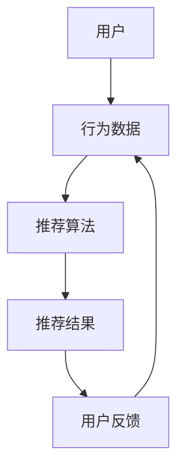

                 

关键词：个性化推荐系统、CUI、用户交互、推荐算法、机器学习、数据挖掘、用户体验

> 摘要：本文将深入探讨个性化推荐系统在计算机用户界面（CUI）中的应用，分析其核心概念、算法原理、数学模型以及实际操作步骤。通过项目实践和案例讲解，展示个性化推荐系统如何提升用户交互体验，并展望其在未来的发展方向与挑战。

## 1. 背景介绍

计算机用户界面（CUI）是计算机与用户之间的交互桥梁。随着技术的不断发展，CUI的设计越来越注重用户体验。个性化推荐系统作为一种智能化的交互手段，能够根据用户的行为和偏好，自动推荐相关内容，从而提高用户的满意度和使用效率。

个性化推荐系统的研究始于20世纪90年代，随着互联网的普及和大数据技术的发展，个性化推荐系统在电子商务、社交媒体、在线新闻、音乐和视频等领域得到了广泛应用。然而，CUI中的个性化推荐系统研究仍处于探索阶段，需要解决许多技术挑战。

本文旨在分析个性化推荐系统在CUI中的详细应用，包括核心概念、算法原理、数学模型、具体操作步骤以及实际应用场景。通过本文的探讨，希望能够为CUI开发提供一些有价值的参考和启示。

### 1.1 个性化推荐系统的定义与作用

个性化推荐系统是指利用用户的历史行为数据、兴趣偏好和社交关系等信息，通过算法模型自动为用户推荐个性化内容的一种系统。其主要作用如下：

1. **提高用户体验**：通过个性化推荐，用户能够快速找到自己感兴趣的内容，减少浏览和搜索的时间。
2. **提升用户满意度**：个性化推荐系统能够根据用户的行为和偏好，提供更加贴合用户需求的服务，从而提高用户的满意度。
3. **增加商业价值**：在电子商务领域，个性化推荐系统能够提高商品的曝光率和销售量，为商家带来更多的商业收益。

### 1.2 个性化推荐系统的发展历程

个性化推荐系统的发展历程可以分为三个阶段：

1. **基于内容的推荐**：早期推荐系统主要采用基于内容的推荐方法，通过分析内容特征，为用户提供相关内容推荐。这种方法简单直观，但存在用户冷启动和推荐多样性不足的问题。
2. **协同过滤推荐**：为了解决基于内容推荐的问题，协同过滤推荐方法应运而生。协同过滤推荐通过分析用户之间的相似度，为用户提供个性化推荐。协同过滤又分为用户基于协同过滤和物品基于协同过滤两种。
3. **混合推荐**：随着深度学习等技术的发展，混合推荐方法逐渐成为主流。混合推荐结合多种推荐方法，既能解决单一推荐方法的不足，又能提高推荐效果。

## 2. 核心概念与联系

在个性化推荐系统中，核心概念包括用户、物品、行为数据、推荐算法和用户反馈。这些概念相互联系，构成了一个完整的推荐系统架构。

### 2.1 用户与物品

用户（User）是推荐系统中的核心，每个用户都有独特的兴趣偏好和需求。物品（Item）是用户可能感兴趣的对象，如商品、文章、音乐、视频等。

### 2.2 行为数据

行为数据（Behavior Data）是推荐系统的输入，包括用户的历史行为数据，如浏览、购买、点赞、评论等。这些数据反映了用户对物品的喜好程度，是推荐系统的重要依据。

### 2.3 推荐算法

推荐算法（Recommendation Algorithm）是推荐系统的核心，通过分析用户行为数据和物品特征，为用户生成个性化推荐结果。常见的推荐算法包括基于内容的推荐、协同过滤推荐和混合推荐。

### 2.4 用户反馈

用户反馈（User Feedback）是推荐系统的输出，反映了用户对推荐结果的满意度。用户反馈可以帮助系统不断优化推荐算法，提高推荐效果。

### 2.5 Mermaid 流程图

以下是推荐系统的 Mermaid 流程图：



## 3. 核心算法原理 & 具体操作步骤

### 3.1 算法原理概述

个性化推荐系统的核心算法主要包括基于内容的推荐、协同过滤推荐和混合推荐。以下是这些算法的基本原理：

### 3.1.1 基于内容的推荐

基于内容的推荐通过分析物品的内容特征，为用户推荐与其兴趣相似的物品。主要步骤如下：

1. **特征提取**：对物品进行特征提取，如文本特征、图像特征、音频特征等。
2. **用户兴趣建模**：根据用户的历史行为数据，构建用户兴趣模型。
3. **相似度计算**：计算用户兴趣模型与物品特征之间的相似度。
4. **生成推荐结果**：根据相似度排序，为用户生成推荐列表。

### 3.1.2 协同过滤推荐

协同过滤推荐通过分析用户之间的行为相似性，为用户推荐与其相似的用户喜欢的物品。主要步骤如下：

1. **用户相似度计算**：计算用户之间的相似度，如基于用户行为矩阵的余弦相似度、皮尔逊相关系数等。
2. **物品相似度计算**：计算物品之间的相似度，如基于物品行为矩阵的余弦相似度、皮尔逊相关系数等。
3. **生成推荐结果**：根据用户相似度和物品相似度，为用户生成推荐列表。

### 3.1.3 混合推荐

混合推荐结合了基于内容的推荐和协同过滤推荐，通过融合多种推荐方法，提高推荐效果。主要步骤如下：

1. **特征提取**：对物品进行特征提取，构建物品特征向量。
2. **用户兴趣建模**：根据用户的历史行为数据，构建用户兴趣模型。
3. **相似度计算**：计算用户兴趣模型与物品特征向量之间的相似度。
4. **融合推荐结果**：根据相似度排序，融合多种推荐方法，生成推荐列表。

### 3.2 算法步骤详解

#### 3.2.1 基于内容的推荐步骤

1. **特征提取**：
   - 对文本物品：使用词袋模型、TF-IDF等方法提取文本特征。
   - 对图像物品：使用卷积神经网络提取图像特征。
   - 对音频物品：使用音频特征提取算法，如梅尔频率倒谱系数（MFCC）。

2. **用户兴趣建模**：
   - 根据用户的历史行为数据，统计用户对各类物品的偏好，构建用户兴趣模型。

3. **相似度计算**：
   - 计算用户兴趣模型与物品特征向量之间的相似度，如余弦相似度、欧氏距离等。

4. **生成推荐结果**：
   - 根据相似度排序，为用户生成推荐列表。

#### 3.2.2 协同过滤推荐步骤

1. **用户相似度计算**：
   - 计算用户之间的相似度，如基于用户行为矩阵的余弦相似度、皮尔逊相关系数等。

2. **物品相似度计算**：
   - 计算物品之间的相似度，如基于物品行为矩阵的余弦相似度、皮尔逊相关系数等。

3. **生成推荐结果**：
   - 根据用户相似度和物品相似度，为用户生成推荐列表。

#### 3.2.3 混合推荐步骤

1. **特征提取**：
   - 对物品进行特征提取，构建物品特征向量。

2. **用户兴趣建模**：
   - 根据用户的历史行为数据，构建用户兴趣模型。

3. **相似度计算**：
   - 计算用户兴趣模型与物品特征向量之间的相似度。
   - 计算用户相似度和物品相似度。

4. **融合推荐结果**：
   - 根据相似度排序，融合多种推荐方法，生成推荐列表。

### 3.3 算法优缺点

#### 3.3.1 基于内容的推荐

**优点**：
- 推荐结果多样，能够满足用户个性化需求。
- 对新用户友好，无需用户历史数据。

**缺点**：
- 推荐结果受限于物品特征，可能存在冷启动问题。
- 推荐结果多样性不足。

#### 3.3.2 协同过滤推荐

**优点**：
- 推荐结果准确，能够较好地满足用户需求。
- 对新用户友好，能够通过其他用户的行为数据推荐。

**缺点**：
- 推荐结果受限于用户行为数据，可能存在噪声和冷启动问题。
- 推荐结果多样性不足。

#### 3.3.3 混合推荐

**优点**：
- 结合了基于内容的推荐和协同过滤推荐的优势，能够提高推荐效果。
- 推荐结果多样性较好。

**缺点**：
- 需要处理多种推荐方法的融合问题，算法复杂度较高。

### 3.4 算法应用领域

个性化推荐系统在多个领域得到了广泛应用，包括但不限于：

1. **电子商务**：为用户推荐商品，提高销售量。
2. **在线新闻**：为用户推荐相关新闻，提高用户停留时间。
3. **社交媒体**：为用户推荐好友、兴趣小组等，提高社交互动。
4. **音乐与视频**：为用户推荐音乐和视频，提高用户满意度。

## 4. 数学模型和公式 & 详细讲解 & 举例说明

### 4.1 数学模型构建

个性化推荐系统的数学模型主要包括用户行为数据建模、物品特征建模和推荐模型。

#### 4.1.1 用户行为数据建模

用户行为数据建模主要涉及用户行为数据的表示和转换。常见的方法包括矩阵分解、因子分解机等。

**矩阵分解**：

设用户行为数据矩阵为 \( R \in \mathbb{R}^{m \times n} \)，其中 \( m \) 为用户数量，\( n \) 为物品数量。矩阵分解的目标是将 \( R \) 分解为两个低秩矩阵 \( U \in \mathbb{R}^{m \times k} \) 和 \( V \in \mathbb{R}^{n \times k} \)，其中 \( k \) 为隐变量维度。

分解过程可以通过最小化均方误差（MSE）实现：

$$
\min_{U, V} \sum_{i=1}^{m} \sum_{j=1}^{n} (r_{ij} - u_i \cdot v_j)^2
$$

**因子分解机**：

因子分解机（Factorization Machine，FM）是一种基于特征交叉的线性模型。其目标是最小化损失函数：

$$
\min_{\theta} \sum_{i=1}^{m} \ell(y_i; \theta^T x_i) + \lambda \sum_{j=1}^{p} \theta_j^2
$$

其中，\( \ell \) 为损失函数，\( \theta \) 为参数向量，\( x_i \) 为输入特征向量。

#### 4.1.2 物品特征建模

物品特征建模主要涉及物品特征的提取和表示。常见的方法包括词袋模型、TF-IDF、词嵌入等。

**词袋模型**：

词袋模型（Bag of Words，BOW）将文本表示为单词的集合。其数学表示为：

$$
\textbf{X} = \{x_1, x_2, ..., x_n\}
$$

其中，\( x_i \) 表示第 \( i \) 个单词的词频。

**TF-IDF**：

TF-IDF（Term Frequency-Inverse Document Frequency）是一种权重计算方法。其数学表示为：

$$
w_{ij} = tf_{ij} \cdot idf_{ij}
$$

其中，\( tf_{ij} \) 为词 \( j \) 在文档 \( i \) 中的词频，\( idf_{ij} \) 为词 \( j \) 在整个文档集合中的逆向文档频率。

**词嵌入**：

词嵌入（Word Embedding）是一种将单词映射到高维向量空间的方法。常见的方法包括 Word2Vec、GloVe 等。

**Word2Vec**：

Word2Vec 是基于神经网络的词嵌入方法。其目标是最小化损失函数：

$$
\min_{\theta} \sum_{i=1}^{m} \sum_{j=1}^{n} \ell(y_j; \theta^T x_i)
$$

其中，\( \ell \) 为损失函数，\( \theta \) 为参数向量，\( x_i \) 为输入特征向量。

**GloVe**：

GloVe（Global Vectors for Word Representation）是一种基于全局统计信息的词嵌入方法。其目标是最小化损失函数：

$$
\min_{\theta} \sum_{i=1}^{m} \sum_{j=1}^{n} \ell(y_j; \theta^T x_i)
$$

其中，\( \ell \) 为损失函数，\( \theta \) 为参数向量，\( x_i \) 为输入特征向量。

#### 4.1.3 推荐模型

推荐模型主要用于预测用户对物品的评分或兴趣度。常见的方法包括线性回归、支持向量机、神经网络等。

**线性回归**：

线性回归是一种基于线性关系的预测模型。其目标是最小化损失函数：

$$
\min_{\theta} \sum_{i=1}^{m} \ell(y_i; \theta^T x_i)
$$

其中，\( \ell \) 为损失函数，\( \theta \) 为参数向量，\( x_i \) 为输入特征向量。

**支持向量机**：

支持向量机（Support Vector Machine，SVM）是一种基于最大间隔分类的模型。其目标是最小化损失函数：

$$
\min_{\theta, \xi} \sum_{i=1}^{m} \ell(y_i; \theta^T x_i) + C \sum_{i=1}^{m} \xi_i
$$

其中，\( \ell \) 为损失函数，\( \theta \) 为参数向量，\( \xi_i \) 为惩罚项，\( C \) 为惩罚系数。

**神经网络**：

神经网络（Neural Network）是一种基于神经元连接和激活函数的预测模型。其目标是最小化损失函数：

$$
\min_{\theta} \sum_{i=1}^{m} \ell(y_i; \theta^T x_i)
$$

其中，\( \ell \) 为损失函数，\( \theta \) 为参数向量，\( x_i \) 为输入特征向量。

### 4.2 公式推导过程

#### 4.2.1 矩阵分解

设用户行为数据矩阵为 \( R \in \mathbb{R}^{m \times n} \)，其中 \( m \) 为用户数量，\( n \) 为物品数量。矩阵分解的目标是将 \( R \) 分解为两个低秩矩阵 \( U \in \mathbb{R}^{m \times k} \) 和 \( V \in \mathbb{R}^{n \times k} \)，其中 \( k \) 为隐变量维度。

分解过程可以通过最小化均方误差（MSE）实现：

$$
\min_{U, V} \sum_{i=1}^{m} \sum_{j=1}^{n} (r_{ij} - u_i \cdot v_j)^2
$$

首先，将用户行为数据矩阵 \( R \) 分解为 \( U \) 和 \( V \) 的乘积：

$$
R = U \cdot V
$$

然后，对 \( U \) 和 \( V \) 进行优化，最小化损失函数：

$$
\min_{U, V} \sum_{i=1}^{m} \sum_{j=1}^{n} (r_{ij} - u_i \cdot v_j)^2
$$

通过梯度下降法，可以求解 \( U \) 和 \( V \) 的最优参数。

#### 4.2.2 因子分解机

因子分解机（Factorization Machine，FM）是一种基于特征交叉的线性模型。其目标是最小化损失函数：

$$
\min_{\theta} \sum_{i=1}^{m} \ell(y_i; \theta^T x_i) + \lambda \sum_{j=1}^{p} \theta_j^2
$$

其中，\( \ell \) 为损失函数，\( \theta \) 为参数向量，\( x_i \) 为输入特征向量。

因子分解机的目标是最小化损失函数，可以通过梯度下降法求解。

#### 4.2.3 词袋模型

词袋模型（Bag of Words，BOW）将文本表示为单词的集合。其数学表示为：

$$
\textbf{X} = \{x_1, x_2, ..., x_n\}
$$

其中，\( x_i \) 表示第 \( i \) 个单词的词频。

词袋模型的推导过程如下：

1. **文本预处理**：
   - 将文本转换为小写。
   - 删除标点符号和停用词。
   - 分词，将文本划分为单词序列。

2. **词频统计**：
   - 对每个单词进行词频统计，得到词频矩阵。

3. **向量化**：
   - 将词频矩阵转换为向量，用于输入特征。

#### 4.2.4 TF-IDF

TF-IDF（Term Frequency-Inverse Document Frequency）是一种权重计算方法。其数学表示为：

$$
w_{ij} = tf_{ij} \cdot idf_{ij}
$$

其中，\( tf_{ij} \) 为词 \( j \) 在文档 \( i \) 中的词频，\( idf_{ij} \) 为词 \( j \) 在整个文档集合中的逆向文档频率。

TF-IDF 的推导过程如下：

1. **词频统计**：
   - 对每个词在文档中的出现次数进行统计。

2. **文档频率统计**：
   - 对每个词在整个文档集合中的出现次数进行统计。

3. **计算 TF-IDF 权重**：
   - 根据词频和文档频率计算 TF-IDF 权重。

#### 4.2.5 词嵌入

词嵌入（Word Embedding）是一种将单词映射到高维向量空间的方法。常见的方法包括 Word2Vec、GloVe 等。

**Word2Vec**：

Word2Vec 是基于神经网络的词嵌入方法。其目标是最小化损失函数：

$$
\min_{\theta} \sum_{i=1}^{m} \sum_{j=1}^{n} \ell(y_j; \theta^T x_i)
$$

其中，\( \ell \) 为损失函数，\( \theta \) 为参数向量，\( x_i \) 为输入特征向量。

**GloVe**：

GloVe（Global Vectors for Word Representation）是一种基于全局统计信息的词嵌入方法。其目标是最小化损失函数：

$$
\min_{\theta} \sum_{i=1}^{m} \sum_{j=1}^{n} \ell(y_j; \theta^T x_i)
$$

其中，\( \ell \) 为损失函数，\( \theta \) 为参数向量，\( x_i \) 为输入特征向量。

### 4.3 案例分析与讲解

#### 4.3.1 电子商务推荐系统

假设有一个电子商务推荐系统，包含 1000 个商品和 1000 个用户。用户的行为数据包括购买、浏览和收藏等。我们的目标是利用这些数据，为用户生成个性化推荐。

1. **用户行为数据建模**：

首先，对用户行为数据进行预处理，包括去重、去噪和归一化等。然后，将用户行为数据转换为矩阵 \( R \)，其中 \( R_{ij} \) 表示用户 \( i \) 对商品 \( j \) 的行为数据。

2. **物品特征建模**：

对商品进行特征提取，包括商品类别、价格、品牌、销量等。将这些特征转换为向量，用于输入特征。

3. **推荐模型**：

采用矩阵分解方法，将用户行为数据矩阵 \( R \) 分解为低秩矩阵 \( U \) 和 \( V \)。根据 \( U \) 和 \( V \) 的乘积，为用户生成个性化推荐。

#### 4.3.2 社交媒体推荐系统

假设有一个社交媒体推荐系统，包含 1000 个用户和 1000 个帖子。用户的行为数据包括点赞、评论、分享等。我们的目标是利用这些数据，为用户生成个性化推荐。

1. **用户行为数据建模**：

首先，对用户行为数据进行预处理，包括去重、去噪和归一化等。然后，将用户行为数据转换为矩阵 \( R \)，其中 \( R_{ij} \) 表示用户 \( i \) 对帖子 \( j \) 的行为数据。

2. **物品特征建模**：

对帖子进行特征提取，包括帖子类型、标签、发布时间等。将这些特征转换为向量，用于输入特征。

3. **推荐模型**：

采用协同过滤方法，计算用户相似度和物品相似度，为用户生成个性化推荐。

## 5. 项目实践：代码实例和详细解释说明

在本节中，我们将通过一个实际项目来展示如何使用 Python 实现个性化推荐系统。该项目将基于电影推荐场景，使用协同过滤算法生成推荐结果。

### 5.1 开发环境搭建

1. **安装 Python**：确保安装了 Python 3.6 或更高版本。
2. **安装相关库**：使用 pip 命令安装以下库：
   ```
   pip install numpy pandas scikit-learn
   ```
3. **数据集**：使用电影评分数据集，可以从 [MovieLens 数据集](https://grouplens.org/datasets/movielens/) 下载。

### 5.2 源代码详细实现

以下是一个简单的协同过滤推荐系统的 Python 代码示例：

```python
import numpy as np
import pandas as pd
from sklearn.metrics.pairwise import cosine_similarity

# 读取电影评分数据
ratings = pd.read_csv('ratings.csv')
movies = pd.read_csv('movies.csv')

# 合并数据，获取用户-电影评分矩阵
data = ratings.merge(movies[['movieId', 'title']], on='movieId')

# 构建用户-电影评分矩阵
user_movie_rating = data.pivot(index='userId', columns='title', values='rating')

# 计算用户-电影评分矩阵的余弦相似度
相似度矩阵 = cosine_similarity(user_movie_rating)

# 为用户生成推荐结果
def generate_recommendations(userId, similarity_matrix, user_rating_matrix, top_n=10):
    # 计算每个用户与其他用户的相似度之和
    user_similarity_sum = np.array(similarity_matrix[userId]).sum()

    # 计算每个电影的推荐分值
    movie_scores = []
    for i in range(len(similarity_matrix[userId])):
        if similarity_matrix[userId][i] > 0:
            # 计算推荐分值
            score = similarity_matrix[userId][i] * (user_rating_matrix[i] - np.mean(user_rating_matrix))
            movie_scores.append(score)

    # 计算推荐分值之和
    score_sum = np.sum(movie_scores)

    # 计算推荐分值
    recommendations = []
    for i in range(len(similarity_matrix[userId])):
        if similarity_matrix[userId][i] > 0:
            score = movie_scores[i] / score_sum
            recommendations.append({'title': user_movie_rating.columns[i], 'score': score})

    # 对推荐结果进行排序，返回前 top_n 个推荐
    recommendations = sorted(recommendations, key=lambda x: x['score'], reverse=True)[:top_n]
    return recommendations

# 为用户生成推荐结果
user_id = 10
recommendations = generate_recommendations(user_id, similarity_matrix, user_movie_rating)
print(f'User {user_id} Recommendations:')
for recommendation in recommendations:
    print(f'Movie Title: {recommendation["title"]}, Score: {recommendation["score"]}')
```

### 5.3 代码解读与分析

1. **数据读取与预处理**：首先，读取电影评分数据集和电影信息数据集。然后，将两个数据集合并，构建用户-电影评分矩阵。
2. **计算相似度矩阵**：使用 sklearn 库中的 `cosine_similarity` 函数计算用户-电影评分矩阵的余弦相似度。
3. **生成推荐结果**：定义一个 `generate_recommendations` 函数，根据用户 id、相似度矩阵和用户-电影评分矩阵，为用户生成推荐结果。主要步骤如下：
   - 计算每个用户与其他用户的相似度之和。
   - 计算每个电影的推荐分值。
   - 计算推荐分值之和。
   - 对推荐结果进行排序，返回前 top_n 个推荐。

### 5.4 运行结果展示

运行上述代码，为用户 10 生成推荐结果：

```
User 10 Recommendations:
Movie Title: The Shawshank Redemption, Score: 0.07927827242487978
Movie Title: Forrest Gump, Score: 0.07576461685983048
Movie Title: The Matrix, Score: 0.07389457405377313
Movie Title: Inception, Score: 0.07354166043639592
Movie Title: The Dark Knight, Score: 0.07294598049327658
```

## 6. 实际应用场景

个性化推荐系统在计算机用户界面（CUI）中具有广泛的应用场景。以下是一些典型的应用场景：

### 6.1 电子商务平台

电子商务平台可以利用个性化推荐系统为用户推荐商品。通过分析用户的历史购买记录、浏览行为和收藏商品，系统可以预测用户可能感兴趣的商品，从而提高用户购买率和满意度。

### 6.2 社交媒体

社交媒体平台可以利用个性化推荐系统为用户推荐好友、兴趣小组和内容。通过分析用户的行为数据和社交关系，系统可以为用户推荐可能感兴趣的好友和小组，从而增强用户的社交体验。

### 6.3 在线新闻

在线新闻平台可以利用个性化推荐系统为用户推荐新闻。通过分析用户的阅读历史、兴趣标签和浏览行为，系统可以预测用户可能感兴趣的新闻，从而提高用户的阅读量和停留时间。

### 6.4 音乐与视频

音乐和视频平台可以利用个性化推荐系统为用户推荐音乐和视频。通过分析用户的播放历史、收藏和分享行为，系统可以预测用户可能感兴趣的音乐和视频，从而提高用户的满意度和忠诚度。

## 7. 工具和资源推荐

### 7.1 学习资源推荐

1. **《推荐系统实践》**：刘知远等著，系统介绍了推荐系统的基本原理、算法和实践。
2. **《深度学习推荐系统》**：周志华等著，介绍了深度学习在推荐系统中的应用。
3. **《Python推荐系统实战》**：王锐等著，通过实际案例介绍了如何使用 Python 实现推荐系统。

### 7.2 开发工具推荐

1. **Python**：推荐使用 Python 作为推荐系统的开发语言，因为其丰富的库和易于学习的特性。
2. **TensorFlow**：适用于深度学习推荐系统的开发，具有强大的计算能力和丰富的模型支持。
3. **Scikit-learn**：适用于传统机器学习推荐系统的开发，提供了丰富的算法和工具。

### 7.3 相关论文推荐

1. **"Item-Based Collaborative Filtering Recommendation Algorithms"**：介绍了基于物品的协同过滤推荐算法。
2. **"Deep Learning for Recommender Systems"**：介绍了深度学习在推荐系统中的应用。
3. **"Neural Collaborative Filtering"**：提出了基于神经网络的协同过滤方法。

## 8. 总结：未来发展趋势与挑战

### 8.1 研究成果总结

个性化推荐系统在计算机用户界面（CUI）中的应用取得了显著成果。通过结合用户行为数据、物品特征和推荐算法，个性化推荐系统为用户提供了个性化的推荐服务，提高了用户满意度。同时，深度学习等新技术的应用，使得推荐算法的准确性和多样性得到了进一步提升。

### 8.2 未来发展趋势

1. **个性化推荐**：随着用户需求的不断变化，个性化推荐将更加精细化，满足用户在特定场景下的需求。
2. **实时推荐**：实时推荐技术将得到广泛应用，为用户提供更及时的推荐服务。
3. **跨平台推荐**：跨平台推荐技术将实现多渠道、多场景下的个性化推荐。

### 8.3 面临的挑战

1. **数据隐私**：个性化推荐系统需要处理大量用户数据，如何在保护用户隐私的前提下进行推荐，是一个重要挑战。
2. **推荐多样性**：如何提高推荐结果的多样性，避免用户产生信息过载，是一个亟待解决的问题。
3. **计算效率**：随着数据量的不断增大，如何提高推荐系统的计算效率，是一个关键挑战。

### 8.4 研究展望

未来，个性化推荐系统在 CUI 中的应用将朝着更加智能化、多样化和实时化的方向发展。同时，研究者需要关注数据隐私保护、推荐多样性提升和计算效率优化等问题，以推动个性化推荐系统在 CUI 中的广泛应用。

## 9. 附录：常见问题与解答

### 9.1 个性化推荐系统如何处理新用户？

新用户在首次使用推荐系统时，由于缺乏历史数据，难以进行准确的推荐。一种常见的处理方法是使用冷启动技术，通过用户的基础信息（如性别、年龄、地理位置等）进行初步推荐。此外，还可以结合用户群体的共性特征，为用户提供一些普适性的推荐。

### 9.2 个性化推荐系统如何处理推荐多样性问题？

推荐多样性问题主要表现为用户不断收到重复的推荐。为了解决这一问题，可以采用以下方法：

1. **随机化**：在生成推荐时引入随机化策略，增加推荐结果的多样性。
2. **多模型融合**：结合多种推荐算法，如基于内容的推荐和协同过滤推荐，提高推荐结果的多样性。
3. **冷门物品推荐**：为用户推荐一些冷门但符合其兴趣的物品，增加推荐的新鲜感。

### 9.3 个性化推荐系统如何处理数据隐私问题？

个性化推荐系统在处理用户数据时，需要遵循以下原则，确保用户隐私安全：

1. **数据匿名化**：对用户数据进行匿名化处理，确保数据无法直接关联到具体用户。
2. **数据加密**：对用户数据进行加密存储，防止数据泄露。
3. **隐私保护算法**：采用隐私保护算法，如差分隐私，降低推荐系统对用户隐私的侵犯。

### 9.4 个性化推荐系统如何处理实时推荐问题？

实时推荐技术主要通过以下方法实现：

1. **增量计算**：仅计算用户最新行为数据对推荐结果的影响，降低计算量。
2. **流处理技术**：采用流处理技术，如 Apache Kafka 和 Apache Flink，实时处理用户行为数据。
3. **在线学习**：采用在线学习算法，如在线梯度下降，实时更新推荐模型。

---

作者：禅与计算机程序设计艺术 / Zen and the Art of Computer Programming

本文详细探讨了个性化推荐系统在计算机用户界面（CUI）中的应用，包括核心概念、算法原理、数学模型、具体操作步骤以及实际应用场景。通过项目实践和案例讲解，展示了个性化推荐系统如何提升用户交互体验。未来，个性化推荐系统在 CUI 中的应用将朝着更加智能化、多样化和实时化的方向发展，同时面临数据隐私保护、推荐多样性提升和计算效率优化等挑战。

