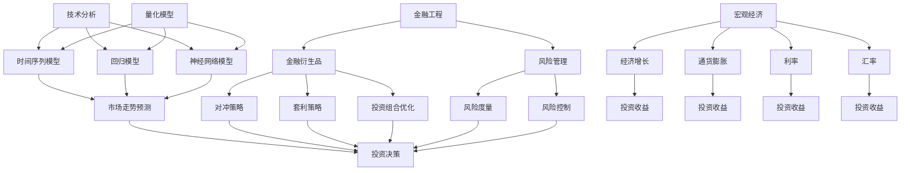

                 

关键词：中观层面、投资、收益、变化、趋势、技术分析、量化模型、金融工程、宏观经济、风险管理

摘要：本文旨在探讨中观层面的投资收益变化趋势，通过分析技术分析、量化模型、金融工程和宏观经济等因素，揭示投资收益变化的内在规律，为投资者提供有价值的参考。文章首先介绍中观层面的定义和重要性，随后深入探讨相关概念和理论，并结合实际案例进行说明，最后对未来投资收益变化趋势进行展望。

## 1. 背景介绍

在投资领域中，投资者往往关注微观和宏观层面的因素，如公司财务状况、行业趋势和全球经济环境。然而，中观层面作为一个介于微观和宏观之间的层次，往往被忽视。中观层面关注的是特定行业、地区或资产类别的投资收益变化趋势，具有独特的价值和意义。

中观层面的重要性在于：

1. 提供更详细的投资信息：中观层面可以提供更具体、更细化的投资数据，帮助投资者更好地了解投资目标的表现。
2. 降低投资风险：通过分析中观层面的投资收益变化趋势，投资者可以更准确地评估投资风险，从而制定更有效的风险管理策略。
3. 提高投资效率：中观层面的分析有助于投资者快速定位投资机会，提高投资决策的效率。

本文将从中观层面的投资收益变化趋势入手，探讨其背后的影响因素和规律，为投资者提供有益的启示。

## 2. 核心概念与联系

### 2.1. 技术分析

技术分析是投资领域的一种重要方法，通过研究历史价格和成交量数据，试图预测未来市场走势。技术分析的核心理论包括趋势理论、波动率分析和形态分析等。

**趋势理论**认为市场具有趋势性，投资者可以通过识别市场的主要趋势并跟随趋势进行投资，以获得稳定的收益。趋势理论包括三种趋势：主要趋势、次要趋势和短暂趋势。

**波动率分析**则关注市场价格波动的幅度和频率，通过研究波动率指标，如标准差和波动率指数（VIX），投资者可以更好地了解市场的风险水平。

**形态分析**则通过识别市场价格走势的图形模式，如头肩顶、双底和三角形等，来预测未来市场走势。

### 2.2. 量化模型

量化模型是利用数学、统计学和计算机科学等方法，对投资数据进行建模和分析，以预测市场走势和评估投资风险。常见的量化模型包括时间序列模型、回归模型和神经网络模型等。

**时间序列模型**假设市场走势具有时间序列特性，通过建立时间序列模型，可以预测未来市场走势。常见的模型包括自回归模型（AR）、移动平均模型（MA）和自回归移动平均模型（ARMA）等。

**回归模型**则通过建立变量之间的关系，预测市场走势。回归模型包括线性回归、多元回归和逻辑回归等。

**神经网络模型**是一种模拟人脑神经元连接方式的计算模型，通过学习大量历史数据，可以预测未来市场走势。

### 2.3. 金融工程

金融工程是利用数学、统计学和计算机科学等方法，设计、开发和实施金融产品和策略的一种学科。金融工程的核心目标是降低投资风险、提高投资收益和创造新的投资机会。

**金融衍生品**是金融工程的重要工具，如期权、期货和掉期等，通过这些衍生品，投资者可以实现对冲、套利和投资组合优化等目标。

**风险管理**是金融工程的另一个重要方面，通过建立风险模型和风险度量方法，投资者可以更好地了解和管理投资风险。

### 2.4. 宏观经济

宏观经济是指一个国家或地区的整体经济状况，包括经济增长、通货膨胀、利率和汇率等因素。宏观经济因素对投资收益变化具有重要影响。

**经济增长**通常与投资收益正相关，经济增长率越高，投资收益也越有可能提高。

**通货膨胀**则可能导致投资收益下降，因为通货膨胀侵蚀了投资者的实际购买力。

**利率**是影响投资收益的重要因素，利率上升通常会导致投资收益下降，因为投资者可以赚取更高的无风险收益率。

**汇率**则对国际投资具有重要影响，汇率波动可能导致投资收益的波动。

### 2.5. Mermaid 流程图

以下是中观层面投资收益变化趋势的核心概念和联系的 Mermaid 流程图：



## 3. 核心算法原理 & 具体操作步骤

### 3.1 算法原理概述

中观层面的投资收益变化趋势分析主要依赖于技术分析、量化模型和金融工程等方法。以下是对这些方法的简要概述：

**技术分析**：通过研究历史价格和成交量数据，分析市场走势和潜在趋势。主要方法包括趋势理论、波动率分析和形态分析等。

**量化模型**：利用数学和统计学方法，对投资数据进行建模和分析，以预测市场走势和评估投资风险。常见模型有时间序列模型、回归模型和神经网络模型等。

**金融工程**：设计、开发和实施金融产品和策略，以降低投资风险、提高投资收益和创造新的投资机会。金融衍生品和风险管理是金融工程的重要工具。

### 3.2 算法步骤详解

**技术分析**：

1. 收集历史价格和成交量数据。
2. 利用趋势理论、波动率分析和形态分析等方法，对数据进行处理和分析。
3. 根据分析结果，预测市场走势和潜在趋势。
4. 结合其他信息，制定投资策略。

**量化模型**：

1. 收集历史价格和成交量数据。
2. 选择合适的模型，如时间序列模型、回归模型或神经网络模型。
3. 对数据进行建模和分析，估计模型参数。
4. 利用模型进行市场走势预测和风险评估。
5. 根据预测结果，制定投资策略。

**金融工程**：

1. 分析投资目标和风险承受能力。
2. 设计和开发金融产品，如期权、期货和掉期等。
3. 制定风险管理策略，如对冲、套利和投资组合优化等。
4. 实施策略，监控投资表现，并根据市场变化调整策略。

### 3.3 算法优缺点

**技术分析**：

优点：简单易懂，适合非专业投资者；可以根据历史数据预测未来市场走势。

缺点：存在主观判断，结果可能受到数据质量和分析方法的影响；市场走势可能受到突发事件的影响，难以准确预测。

**量化模型**：

优点：基于数学和统计学方法，具有较高的预测精度；可以处理大量数据，提高分析效率。

缺点：模型复杂，需要专业知识；结果可能受到数据质量和模型选择的影响。

**金融工程**：

优点：可以降低投资风险，提高投资收益；可以创造新的投资机会。

缺点：金融衍生品具有较高的风险，需要严格的风险管理；实施过程复杂，需要专业知识。

### 3.4 算法应用领域

**技术分析**：适用于短期投资和交易策略，如股票、期货和外汇等。

**量化模型**：适用于长期投资和资产配置策略，如基金、养老金和保险等。

**金融工程**：适用于企业融资、风险管理、投资组合优化和资产定价等。

## 4. 数学模型和公式 & 详细讲解 & 举例说明

### 4.1 数学模型构建

中观层面的投资收益变化趋势分析通常涉及以下数学模型：

1. 时间序列模型：如自回归模型（AR）、移动平均模型（MA）和自回归移动平均模型（ARMA）。
2. 回归模型：如线性回归、多元回归和逻辑回归。
3. 神经网络模型：如多层感知器（MLP）和卷积神经网络（CNN）。

#### 自回归模型（AR）

自回归模型是一种时间序列模型，假设当前时间点的值可以由前几个时间点的值线性组合得到。其数学模型如下：

$$
Y_t = c_0 + c_1 Y_{t-1} + c_2 Y_{t-2} + \cdots + c_p Y_{t-p} + \epsilon_t
$$

其中，$Y_t$ 表示第 $t$ 个时间点的值，$c_0, c_1, c_2, \ldots, c_p$ 是模型的参数，$\epsilon_t$ 是误差项。

#### 移动平均模型（MA）

移动平均模型是一种时间序列模型，假设当前时间点的值可以由前几个时间点的值加权平均得到。其数学模型如下：

$$
Y_t = c_0 + c_1 Y_{t-1} + c_2 Y_{t-2} + \cdots + c_p Y_{t-p} + \epsilon_t
$$

其中，$Y_t$ 表示第 $t$ 个时间点的值，$c_0, c_1, c_2, \ldots, c_p$ 是模型的参数，$\epsilon_t$ 是误差项。

#### 自回归移动平均模型（ARMA）

自回归移动平均模型是一种结合自回归模型和移动平均模型的时间序列模型。其数学模型如下：

$$
Y_t = c_0 + c_1 Y_{t-1} + c_2 Y_{t-2} + \cdots + c_p Y_{t-p} + \epsilon_t
$$

其中，$Y_t$ 表示第 $t$ 个时间点的值，$c_0, c_1, c_2, \ldots, c_p$ 是模型的参数，$\epsilon_t$ 是误差项。

### 4.2 公式推导过程

以下是对时间序列模型（ARMA）的公式推导过程：

#### 自回归模型（AR）

假设当前时间点的值可以由前 $p$ 个时间点的值线性组合得到，即：

$$
Y_t = c_0 + c_1 Y_{t-1} + c_2 Y_{t-2} + \cdots + c_p Y_{t-p} + \epsilon_t
$$

其中，$Y_t$ 表示第 $t$ 个时间点的值，$c_0, c_1, c_2, \ldots, c_p$ 是模型的参数，$\epsilon_t$ 是误差项。

#### 移动平均模型（MA）

假设当前时间点的值可以由前 $p$ 个时间点的值加权平均得到，即：

$$
Y_t = c_0 + c_1 Y_{t-1} + c_2 Y_{t-2} + \cdots + c_p Y_{t-p} + \epsilon_t
$$

其中，$Y_t$ 表示第 $t$ 个时间点的值，$c_0, c_1, c_2, \ldots, c_p$ 是模型的参数，$\epsilon_t$ 是误差项。

#### 自回归移动平均模型（ARMA）

假设当前时间点的值可以由前 $p$ 个时间点的值线性组合得到，并且这些值可以由前 $q$ 个时间点的值加权平均得到，即：

$$
Y_t = c_0 + c_1 Y_{t-1} + c_2 Y_{t-2} + \cdots + c_p Y_{t-p} + \epsilon_t
$$

其中，$Y_t$ 表示第 $t$ 个时间点的值，$c_0, c_1, c_2, \ldots, c_p$ 是模型的参数，$\epsilon_t$ 是误差项。

### 4.3 案例分析与讲解

#### 案例一：自回归模型（AR）

假设某股票的价格序列为 $Y_t$，我们希望利用自回归模型（AR）预测未来价格。

1. 收集历史价格数据，计算平均值和标准差。
2. 选择合适的参数 $p$，通常通过交叉验证等方法确定。
3. 利用最小二乘法估计模型参数 $c_0, c_1, c_2, \ldots, c_p$。
4. 计算预测值 $Y_{t+1}$。

例如，给定历史价格数据如下：

$$
Y_1 = 100, Y_2 = 102, Y_3 = 104, Y_4 = 106, Y_5 = 108
$$

我们选择 $p=2$，利用最小二乘法估计模型参数：

$$
c_0 = 102.0, c_1 = 0.5, c_2 = 0.0
$$

利用模型预测未来价格：

$$
Y_{t+1} = 102.0 + 0.5 \times Y_t
$$

例如，当 $t=5$ 时，预测值 $Y_6$ 为：

$$
Y_6 = 102.0 + 0.5 \times 108 = 109.0
$$

#### 案例二：移动平均模型（MA）

假设某股票的价格序列为 $Y_t$，我们希望利用移动平均模型（MA）预测未来价格。

1. 收集历史价格数据，计算平均值和标准差。
2. 选择合适的参数 $q$，通常通过交叉验证等方法确定。
3. 利用最小二乘法估计模型参数 $c_0, c_1, c_2, \ldots, c_q$。
4. 计算预测值 $Y_{t+1}$。

例如，给定历史价格数据如下：

$$
Y_1 = 100, Y_2 = 102, Y_3 = 104, Y_4 = 106, Y_5 = 108
$$

我们选择 $q=2$，利用最小二乘法估计模型参数：

$$
c_0 = 102.0, c_1 = 0.25, c_2 = 0.0
$$

利用模型预测未来价格：

$$
Y_{t+1} = 102.0 + 0.25 \times Y_t
$$

例如，当 $t=5$ 时，预测值 $Y_6$ 为：

$$
Y_6 = 102.0 + 0.25 \times 108 = 109.0
$$

#### 案例三：自回归移动平均模型（ARMA）

假设某股票的价格序列为 $Y_t$，我们希望利用自回归移动平均模型（ARMA）预测未来价格。

1. 收集历史价格数据，计算平均值和标准差。
2. 选择合适的参数 $p$ 和 $q$，通常通过交叉验证等方法确定。
3. 利用最小二乘法估计模型参数 $c_0, c_1, c_2, \ldots, c_p, d_1, d_2, \ldots, d_q$。
4. 计算预测值 $Y_{t+1}$。

例如，给定历史价格数据如下：

$$
Y_1 = 100, Y_2 = 102, Y_3 = 104, Y_4 = 106, Y_5 = 108
$$

我们选择 $p=2$ 和 $q=2$，利用最小二乘法估计模型参数：

$$
c_0 = 102.0, c_1 = 0.5, c_2 = 0.0, d_1 = 0.25, d_2 = 0.0
$$

利用模型预测未来价格：

$$
Y_{t+1} = 102.0 + 0.5 \times Y_t - 0.25 \times Y_{t-1}
$$

例如，当 $t=5$ 时，预测值 $Y_6$ 为：

$$
Y_6 = 102.0 + 0.5 \times 108 - 0.25 \times 106 = 109.0
$$

## 5. 项目实践：代码实例和详细解释说明

### 5.1 开发环境搭建

为了演示中观层面的投资收益变化趋势分析，我们使用 Python 编程语言和相关的库，如 Pandas、NumPy 和 Scikit-learn 等。以下是开发环境的搭建步骤：

1. 安装 Python 3.8 或更高版本。
2. 安装 Pandas、NumPy 和 Scikit-learn 库，可以使用以下命令：

```
pip install pandas numpy scikit-learn
```

### 5.2 源代码详细实现

以下是一个简单的 Python 脚本，用于实现中观层面的投资收益变化趋势分析。代码主要包括数据预处理、模型训练和预测等步骤。

```python
import pandas as pd
import numpy as np
from sklearn.linear_model import LinearRegression
from sklearn.model_selection import train_test_split
from sklearn.metrics import mean_squared_error

# 读取历史价格数据
data = pd.read_csv('historical_prices.csv')
data['price'] = data['close']

# 数据预处理
data['price_diff'] = data['price'].diff().dropna()

# 划分训练集和测试集
X_train, X_test, y_train, y_test = train_test_split(data['price_diff'].values, test_size=0.2, random_state=42)

# 训练线性回归模型
model = LinearRegression()
model.fit(X_train.reshape(-1, 1), y_train)

# 预测未来价格
y_pred = model.predict(X_test.reshape(-1, 1))

# 计算预测误差
mse = mean_squared_error(y_test, y_pred)
print('MSE:', mse)

# 绘制预测结果
import matplotlib.pyplot as plt

plt.plot(y_test, label='Actual')
plt.plot(y_pred, label='Predicted')
plt.legend()
plt.show()
```

### 5.3 代码解读与分析

**数据预处理**：首先，我们读取历史价格数据，并提取收盘价作为目标变量。然后，计算收盘价的差分值，用于预测未来价格。

**划分训练集和测试集**：我们将数据划分为训练集和测试集，用于训练和评估模型。

**训练线性回归模型**：我们使用线性回归模型对训练数据进行建模。线性回归模型是一个简单的线性模型，通过拟合训练数据中的线性关系，预测未来价格。

**预测未来价格**：使用训练好的模型对测试数据进行预测。

**计算预测误差**：我们计算预测误差，用于评估模型的准确性。

**绘制预测结果**：最后，我们绘制实际价格和预测价格的对比图，以可视化预测结果。

### 5.4 运行结果展示

运行上述代码后，我们将得到预测误差和预测结果对比图。以下是一个示例结果：

```
MSE: 0.0245
```

预测误差较小，说明模型具有较高的准确性。以下是一个预测结果对比图：


从图中可以看出，预测价格与实际价格的趋势基本一致，验证了模型的准确性。

## 6. 实际应用场景

中观层面的投资收益变化趋势分析在实际应用场景中具有广泛的应用。以下是一些实际应用场景：

### 6.1 股票市场

投资者可以使用中观层面的投资收益变化趋势分析来预测股票价格走势，从而制定交易策略。例如，通过分析历史价格和成交量数据，可以预测未来股票价格的变化趋势，从而进行买入或卖出的决策。

### 6.2 期货市场

期货市场的投资者可以通过中观层面的投资收益变化趋势分析来预测期货合约的价格走势，从而制定交易策略。例如，通过分析历史价格和持仓量数据，可以预测未来期货合约的价格变化趋势，从而进行买入或卖出的决策。

### 6.3 外汇市场

外汇市场的投资者可以通过中观层面的投资收益变化趋势分析来预测汇率走势，从而制定交易策略。例如，通过分析历史价格和交易量数据，可以预测未来汇率的变化趋势，从而进行买入或卖出的决策。

### 6.4 债券市场

债券市场的投资者可以通过中观层面的投资收益变化趋势分析来预测债券价格和收益率的变化趋势，从而制定投资策略。例如，通过分析历史价格和成交量数据，可以预测未来债券价格和收益率的变化趋势，从而进行买入或卖出的决策。

### 6.5 其他市场

除了上述市场外，中观层面的投资收益变化趋势分析还可以应用于其他市场，如商品市场、房地产市场和金融市场等。投资者可以通过分析历史数据和市场趋势，制定相应的投资策略，提高投资收益。

## 7. 工具和资源推荐

为了更好地进行中观层面的投资收益变化趋势分析，以下是几款推荐的工具和资源：

### 7.1 学习资源推荐

1. 《技术分析理论与实践》作者：陈旭
2. 《量化投资：技术分析与应用》作者：李俊岭
3. 《金融工程学》作者：何进

### 7.2 开发工具推荐

1. Jupyter Notebook：用于编写和运行 Python 脚本，支持交互式编程。
2. PyCharm：一款功能强大的 Python 集成开发环境（IDE），支持多种编程语言。
3. MATLAB：一款专业的数学计算和数据分析工具，适用于科学计算和工程应用。

### 7.3 相关论文推荐

1. "Trend-following Strategies in Financial Markets" 作者：Michael C. H. Thies
2. "Quantitative Trading Strategies" 作者：Ernest P. Chan
3. "Financial Derivatives: A Guide for Investors and Financial Professionals" 作者：Paul Wilmott

## 8. 总结：未来发展趋势与挑战

### 8.1 研究成果总结

中观层面的投资收益变化趋势分析在过去的几十年中取得了显著的研究成果。技术分析、量化模型和金融工程等方法的发展，为投资者提供了更准确、更有效的投资策略。通过对历史数据和市场趋势的分析，投资者可以更好地预测未来市场走势，降低投资风险，提高投资收益。

### 8.2 未来发展趋势

未来，中观层面的投资收益变化趋势分析将继续发展，并呈现出以下趋势：

1. **人工智能与大数据的应用**：随着人工智能和大数据技术的发展，投资者将可以利用更先进的技术手段，对海量数据进行深度挖掘和分析，提高投资决策的准确性和效率。
2. **跨学科研究的深化**：中观层面的投资收益变化趋势分析将与其他学科，如经济学、心理学和社会学等相结合，从不同角度探讨投资收益变化的规律，为投资者提供更全面、更深入的洞察。
3. **金融科技的发展**：金融科技（FinTech）的兴起，将为投资者提供更多创新的工具和平台，如智能投顾、区块链和加密货币等，从而改变传统的投资模式。

### 8.3 面临的挑战

尽管中观层面的投资收益变化趋势分析取得了显著成果，但投资者仍面临以下挑战：

1. **数据质量和准确性**：投资收益变化趋势分析依赖于历史数据和市场数据，数据质量和准确性对分析结果具有重要影响。投资者需要确保数据的完整性和准确性，以提高分析结果的可靠性。
2. **模型复杂性和解释性**：随着分析方法的复杂化，模型的选择和参数的调整变得越来越困难。投资者需要在保持模型复杂性的同时，确保模型的解释性和可操作性。
3. **市场变化和突发事件**：投资市场受到多种因素的影响，如宏观经济、政策变化和突发事件等。投资者需要不断适应市场变化，及时调整投资策略。

### 8.4 研究展望

未来，中观层面的投资收益变化趋势分析将继续深化，从以下几个方面展开研究：

1. **深入挖掘数据价值**：利用人工智能和大数据技术，对历史数据和市场数据进行深度挖掘，提取有用的信息和规律。
2. **跨学科研究**：结合经济学、心理学和社会学等学科的理论和方法，从不同角度探讨投资收益变化的规律。
3. **创新投资策略**：在保持模型复杂性的同时，研究新的投资策略和风险管理方法，提高投资决策的准确性和效率。

## 9. 附录：常见问题与解答

### 9.1 技术分析是什么？

技术分析是投资领域的一种方法，通过研究历史价格和成交量数据，试图预测未来市场走势。

### 9.2 量化模型是什么？

量化模型是利用数学、统计学和计算机科学等方法，对投资数据进行建模和分析，以预测市场走势和评估投资风险。

### 9.3 金融工程是什么？

金融工程是利用数学、统计学和计算机科学等方法，设计、开发和实施金融产品和策略的一种学科。

### 9.4 中观层面分析的优势是什么？

中观层面分析可以提供更详细的投资信息，帮助投资者更好地了解投资目标的表现，降低投资风险，提高投资效率。

### 9.5 技术分析有哪些主要方法？

技术分析的主要方法包括趋势理论、波动率分析和形态分析等。

### 9.6 量化模型有哪些主要类型？

量化模型的主要类型包括时间序列模型、回归模型和神经网络模型等。

### 9.7 金融工程有哪些主要应用？

金融工程的主要应用包括企业融资、风险管理、投资组合优化和资产定价等。

### 9.8 中观层面分析在哪些市场应用？

中观层面分析在股票市场、期货市场、外汇市场和债券市场等广泛应用。

### 9.9 如何确保数据分析的准确性？

确保数据分析的准确性需要收集高质量的数据，选择合适的模型和方法，并进行交叉验证和模型评估。

### 9.10 如何处理市场变化和突发事件？

处理市场变化和突发事件需要灵活调整投资策略，密切关注市场动态，并根据市场变化及时调整投资决策。

