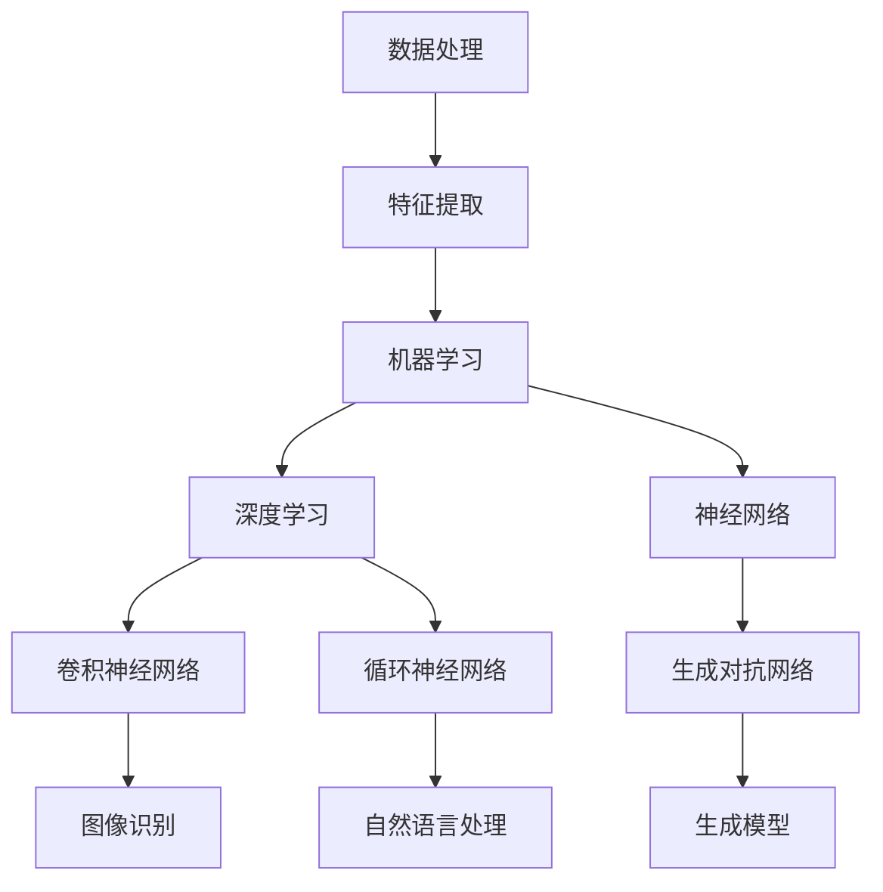
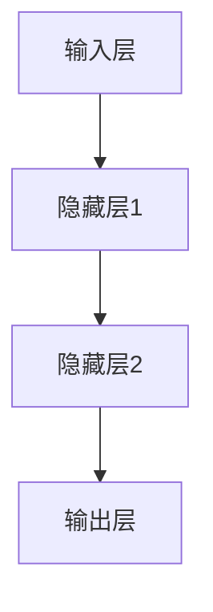

                 

关键词：人工智能、技术变革、应用场景、算法原理、数学模型、代码实例

摘要：本文探讨了人工智能技术在产业变革中的应用，从核心概念、算法原理、数学模型、项目实践等多个角度深入分析了AI技术的重要性和发展前景。

## 1. 背景介绍

在过去的几十年中，人工智能（AI）技术经历了从实验室研究到实际应用的飞跃。随着计算能力的提升和大数据的普及，AI技术逐渐渗透到各个行业，带来了产业变革。从自动驾驶到智能客服，从医疗诊断到金融风控，AI技术的应用正在改变我们的生活方式。

本文旨在探讨AI技术在产业变革中的关键应用，分析其核心概念、算法原理、数学模型以及实际应用场景，为读者提供一个全面的技术视角。

## 2. 核心概念与联系

在探讨AI技术的应用之前，我们需要先了解一些核心概念和它们之间的关系。以下是一个简化的Mermaid流程图，展示了AI技术中的主要概念和它们之间的联系。



### 2.1 数据处理

数据处理是AI技术的基础，它包括数据的收集、清洗、存储和转换。高质量的数据是训练有效AI模型的关键。

### 2.2 特征提取

特征提取是将原始数据转换成适合机器学习算法的格式。这一步至关重要，因为它决定了模型能否准确地捕捉到数据的特征。

### 2.3 机器学习

机器学习是AI的核心，它使计算机能够从数据中学习并做出预测。常见的机器学习算法有决策树、支持向量机等。

### 2.4 深度学习

深度学习是机器学习的一个分支，它通过多层神经网络模拟人脑的决策过程。深度学习在图像识别、自然语言处理等领域取得了显著成果。

### 2.5 神经网络

神经网络是深度学习的基础，它由许多简单的神经元组成，通过层层传递信息，实现复杂的计算任务。

### 2.6 卷积神经网络（CNN）

卷积神经网络在图像识别任务中表现出色，它通过卷积操作提取图像中的特征。

### 2.7 循环神经网络（RNN）

循环神经网络在序列数据处理中具有优势，如自然语言处理和时间序列预测。

### 2.8 生成对抗网络（GAN）

生成对抗网络是一种生成模型，通过两个神经网络的对抗训练，能够生成高质量的图像和其他数据。

## 3. 核心算法原理 & 具体操作步骤

### 3.1 算法原理概述

深度学习是AI技术中的核心，它通过多层神经网络模拟人脑的决策过程。以下是一个简化的神经网络结构图。



### 3.2 算法步骤详解

1. **初始化参数**：包括权重和偏置，通常使用随机初始化。
2. **前向传播**：将输入数据通过网络传递，计算每个神经元的输出。
3. **计算损失**：使用损失函数（如均方误差）计算预测值与真实值之间的差距。
4. **反向传播**：根据损失函数的梯度，更新网络参数。
5. **迭代优化**：重复步骤2-4，直到损失函数收敛。

### 3.3 算法优缺点

**优点**：
- **强大的表示能力**：多层神经网络能够捕捉到数据的复杂模式。
- **自学习能力**：无需手动编写特征提取规则，能够从数据中自动学习。

**缺点**：
- **计算成本高**：训练深度神经网络需要大量的计算资源和时间。
- **对数据质量要求高**：高质量的数据是训练有效模型的必要条件。

### 3.4 算法应用领域

深度学习在图像识别、自然语言处理、语音识别、推荐系统等领域取得了显著成果。

## 4. 数学模型和公式 & 详细讲解 & 举例说明

### 4.1 数学模型构建

神经网络的核心是数学模型，主要包括损失函数、激活函数、反向传播算法等。

#### 4.1.1 损失函数

常见的损失函数有均方误差（MSE）和交叉熵（Cross Entropy）。

$$MSE(y, \hat{y}) = \frac{1}{m}\sum_{i=1}^{m}(y_i - \hat{y}_i)^2$$

$$CE(y, \hat{y}) = -\sum_{i=1}^{m}y_i\log(\hat{y}_i)$$

#### 4.1.2 激活函数

激活函数为神经网络引入非线性，常见的激活函数有ReLU、Sigmoid和Tanh。

$$ReLU(x) = \max(0, x)$$

$$Sigmoid(x) = \frac{1}{1 + e^{-x}}$$

$$Tanh(x) = \frac{e^x - e^{-x}}{e^x + e^{-x}}$$

#### 4.1.3 反向传播算法

反向传播算法是一种优化算法，用于更新神经网络参数。

$$\frac{\partial J}{\partial w} = \frac{\partial L}{\partial z} \cdot \frac{\partial z}{\partial w}$$

### 4.2 公式推导过程

以下是一个简单的多层神经网络前向传播和反向传播的推导过程。

#### 4.2.1 前向传播

假设有一个两层神经网络，输入层有m个神经元，隐藏层有n个神经元，输出层有1个神经元。

$$z_2 = W_2 \cdot a_1 + b_2$$

$$a_2 = \sigma(z_2)$$

$$z_3 = W_3 \cdot a_2 + b_3$$

$$\hat{y} = \sigma(z_3)$$

其中，$\sigma$为激活函数，$W$和$b$分别为权重和偏置。

#### 4.2.2 反向传播

计算输出层的梯度：

$$\frac{\partial J}{\partial z_3} = \frac{\partial J}{\partial \hat{y}} \cdot \frac{\partial \hat{y}}{\partial z_3}$$

$$\frac{\partial J}{\partial z_2} = \frac{\partial J}{\partial z_3} \cdot \frac{\partial z_3}{\partial z_2}$$

更新权重和偏置：

$$W_3 := W_3 - \alpha \cdot \frac{\partial J}{\partial z_3} \cdot a_2$$

$$b_3 := b_3 - \alpha \cdot \frac{\partial J}{\partial z_3}$$

$$W_2 := W_2 - \alpha \cdot \frac{\partial J}{\partial z_2} \cdot a_1$$

$$b_2 := b_2 - \alpha \cdot \frac{\partial J}{\partial z_2}$$

其中，$\alpha$为学习率。

### 4.3 案例分析与讲解

以下是一个简单的图像识别案例，使用卷积神经网络进行手写数字识别。

#### 4.3.1 数据预处理

首先，我们需要对图像进行预处理，包括缩放、归一化等操作。

#### 4.3.2 构建模型

构建一个简单的卷积神经网络，包括两个卷积层、一个池化层和一个全连接层。

#### 4.3.3 训练模型

使用预处理后的图像数据进行模型训练，迭代优化网络参数。

#### 4.3.4 测试模型

使用未见过的新图像数据进行模型测试，评估模型性能。

## 5. 项目实践：代码实例和详细解释说明

### 5.1 开发环境搭建

安装Python、TensorFlow等开发工具和库。

### 5.2 源代码详细实现

```python
import tensorflow as tf
from tensorflow.keras import layers

# 构建模型
model = tf.keras.Sequential([
    layers.Conv2D(32, (3, 3), activation='relu', input_shape=(28, 28, 1)),
    layers.MaxPooling2D((2, 2)),
    layers.Conv2D(64, (3, 3), activation='relu'),
    layers.MaxPooling2D((2, 2)),
    layers.Conv2D(64, (3, 3), activation='relu'),
    layers.Flatten(),
    layers.Dense(64, activation='relu'),
    layers.Dense(10, activation='softmax')
])

# 编译模型
model.compile(optimizer='adam',
              loss='sparse_categorical_crossentropy',
              metrics=['accuracy'])

# 训练模型
model.fit(train_images, train_labels, epochs=5)

# 测试模型
test_loss, test_acc = model.evaluate(test_images,  test_labels)
print(f'Test accuracy: {test_acc:.4f}')
```

### 5.3 代码解读与分析

这段代码实现了卷积神经网络进行手写数字识别的简单示例。首先，我们导入必要的库，然后构建一个Sequential模型，添加卷积层、池化层和全连接层。接着，编译模型并使用训练数据训练模型。最后，使用测试数据评估模型性能。

## 6. 实际应用场景

AI技术在各个行业都有广泛的应用，以下是一些典型的应用场景：

### 6.1 自动驾驶

自动驾驶是AI技术的一个重要应用领域。通过深度学习算法，车辆能够实时感知周围环境，做出安全的驾驶决策。

### 6.2 医疗诊断

AI技术在医疗诊断中具有巨大潜力，如癌症检测、心血管疾病预测等。通过图像识别和深度学习，AI能够辅助医生做出更准确的诊断。

### 6.3 金融风控

AI技术在金融风控中用于欺诈检测、信用评估等任务。通过大数据分析和机器学习算法，AI能够识别异常行为，降低风险。

### 6.4 智能家居

智能家居是AI技术在家居领域的应用，如智能音箱、智能门锁等。通过语音识别和自然语言处理，智能家居设备能够实现人机交互。

## 7. 工具和资源推荐

### 7.1 学习资源推荐

- 《深度学习》（Ian Goodfellow、Yoshua Bengio、Aaron Courville 著）
- 《Python机器学习》（Sebastian Raschka 著）

### 7.2 开发工具推荐

- TensorFlow
- PyTorch

### 7.3 相关论文推荐

- "A Theoretical Framework for Back-Propagation"（1986）
- "Deep Learning"（2015）

## 8. 总结：未来发展趋势与挑战

### 8.1 研究成果总结

AI技术在图像识别、自然语言处理、语音识别等领域取得了显著成果，推动了产业变革。

### 8.2 未来发展趋势

- AI与5G、物联网等技术的深度融合
- 生成对抗网络等新型算法的发展
- 跨学科研究，如AI在生物学、物理学等领域的应用

### 8.3 面临的挑战

- 数据隐私和安全问题
- AI算法的可解释性和透明度
- 算法偏见和公平性问题

### 8.4 研究展望

未来，AI技术将在更多领域得到应用，同时也需要解决一系列挑战，以实现可持续的发展。

## 9. 附录：常见问题与解答

### 9.1 什么是深度学习？

深度学习是一种机器学习方法，通过多层神经网络模拟人脑的决策过程，用于解决复杂的计算问题。

### 9.2 AI技术如何推动产业变革？

AI技术通过提高效率、降低成本、创新产品和服务等方式，推动了各行各业的产业变革。

### 9.3 深度学习算法有哪些优缺点？

深度学习算法的优点包括强大的表示能力、自学习能力等，缺点包括计算成本高、对数据质量要求高等。

作者：禅与计算机程序设计艺术 / Zen and the Art of Computer Programming
----------------------------------------------------------------

