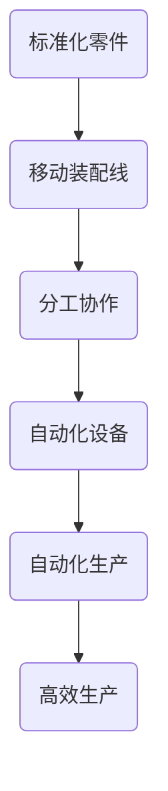

                 

关键词：亨利·福特、工业革命、流水线、生产效率、系统化、自动化、技术创新、历史影响

> 摘要：本文将深入探讨亨利·福特及其对工业革命的核心贡献。从他的流水线生产模式到对生产效率的系统化提升，再到自动化技术的应用，亨利·福特的创新不仅改变了汽车制造业，也深刻影响了整个工业世界。本文将分析福特模式的核心本质，并探讨其在当今IT领域的潜在应用。

## 1. 背景介绍

19世纪末至20世纪初，工业革命在全球范围内引发了一系列深远的变革。随着蒸汽机、电力和机械工具的广泛应用，生产力得到了极大提升，但也带来了生产效率低、产品成本高、生产周期长等问题。在这样的背景下，亨利·福特（Henry Ford）出现了，他通过革命性的生产理念，彻底改变了制造业的面貌。

亨利·福特出生于1863年，自幼对机械和工程有着浓厚的兴趣。他在底特律的汽车制造厂工作期间，目睹了当时汽车生产的种种弊端，并开始思考如何通过系统化和标准化来提高生产效率。最终，他的思考转化为了实践，创建了福特汽车公司，并推出了著名的T型车。

## 2. 核心概念与联系

### 2.1 流水线生产模式

流水线生产模式是亨利·福特生产理念的核心。在这种模式下，生产过程被分解成多个简单的任务，每个任务由专门的工人完成。这种分工提高了工作效率，减少了工作复杂性。具体来说，流水线生产包括以下几个关键环节：

1. **标准化零件**：福特将汽车分解成数千个标准零件，这些零件可以在不同的工作岗位上独立生产。
2. **移动装配线**：为了提高效率，福特将生产线设计成可移动的，从而减少了工人搬运零件的时间。
3. **分工协作**：每个工人负责特定的任务，专注于自己的领域，从而提高了专业水平和效率。

### 2.2 生产效率的系统化提升

福特的生产理念不仅在于流水线，还在于对生产效率的系统化提升。他引入了以下几个关键策略：

1. **规模化生产**：通过大规模生产，降低了单位成本，使产品价格更具竞争力。
2. **自动化**：福特开始使用自动化设备，如流水线上的自动钻孔机和焊接机，减少了人力成本。
3. **工作研究**：福特进行了大量的工作研究，分析每个操作的时间和工作量，从而优化流程。

### 2.3 自动化技术的应用

自动化技术的应用是福特生产理念中的另一大亮点。福特通过引入一系列自动化设备，如自动化焊接机、自动化喷涂机等，大幅提高了生产效率。这些设备不仅减少了人力成本，还提高了生产精度和一致性。此外，福特还开发了可编程控制器，使得生产过程更加灵活和高效。

### 2.4 Mermaid 流程图

下面是一个简化的Mermaid流程图，展示了流水线生产模式的核心节点：



## 3. 核心算法原理 & 具体操作步骤

### 3.1 算法原理概述

亨利·福特的生产模式本质上是一种基于分治策略的优化算法。该算法的核心思想是将复杂的生产任务分解为多个简单的子任务，并通过分工和协作来实现整体效率的最大化。

### 3.2 算法步骤详解

1. **任务分解**：将生产任务分解为多个子任务，每个子任务由专门的人员或设备完成。
2. **分工协作**：根据每个子任务的特点，分配给具有相应技能的人员或设备。
3. **自动化**：引入自动化设备，以减少人力成本和提高生产精度。
4. **系统集成**：将各个子任务和自动化设备整合为一个完整的流水线系统。

### 3.3 算法优缺点

**优点：**
- 提高生产效率：通过分工和自动化，生产效率得到了大幅提升。
- 降低生产成本：规模化生产和自动化设备的引入降低了单位成本。
- 提高产品质量：标准化零件和自动化设备保证了生产的一致性和精度。

**缺点：**
- 初始投资较大：引入自动化设备和流水线系统需要较大的初始投资。
- 对人员技能要求高：流水线生产要求工人具备一定的专业技能。

### 3.4 算法应用领域

亨利·福特的生产模式在汽车制造业取得了巨大成功，但它的核心思想同样适用于其他领域，如电子制造业、家电制造业等。在当今的IT领域，该模式也被广泛应用于软件开发、数据处理等环节。

## 4. 数学模型和公式 & 详细讲解 & 举例说明

### 4.1 数学模型构建

为了量化流水线生产模式的效果，我们可以构建一个简单的数学模型。假设有一个生产任务，需要完成n个子任务，每个子任务需要t时间完成。在没有流水线的情况下，总生产时间为：

\[ T_{\text{无流水线}} = n \times t \]

在有流水线的情况下，由于分工和协作，每个子任务可以并行进行，总生产时间可以减少到：

\[ T_{\text{有流水线}} = \frac{n \times t}{m} \]

其中，m是并行执行子任务的数量。

### 4.2 公式推导过程

假设有m个工人或设备，每个工人或设备负责一个子任务。由于每个子任务可以并行进行，所以总时间是由最长的子任务决定的。设最长的子任务需要t'时间完成，则有：

\[ T_{\text{有流水线}} = t' \times m \]

由于每个子任务的时间为t，所以最长的子任务时间为：

\[ t' = \max(t_1, t_2, ..., t_n) \]

因此，有：

\[ T_{\text{有流水线}} = \max(t_1, t_2, ..., t_n) \times m \]

由于m > n，所以：

\[ T_{\text{有流水线}} < n \times t \]

### 4.3 案例分析与讲解

假设一个生产任务需要完成10个子任务，每个子任务需要5分钟完成。在没有流水线的情况下，总生产时间为50分钟。在有流水线的情况下，如果有5个工人或设备，总生产时间可以减少到10分钟。

## 5. 项目实践：代码实例和详细解释说明

### 5.1 开发环境搭建

本文使用Python语言来实现流水线生产模式的模拟。在开始之前，确保已经安装了Python 3.8及以上版本。

```bash
pip install matplotlib
```

### 5.2 源代码详细实现

以下是一个简单的Python代码实例，模拟了一个简单的流水线生产过程。

```python
import matplotlib.pyplot as plt

def production_without_pipeline(n_tasks, time_per_task):
    total_time = n_tasks * time_per_task
    return total_time

def production_with_pipeline(n_tasks, time_per_task, n_workers):
    max_time = max(time_per_task)
    total_time = max_time * n_workers
    return total_time

# 参数设置
n_tasks = 10
time_per_task = 5
n_workers = 5

# 计算生产时间
time_without_pipeline = production_without_pipeline(n_tasks, time_per_task)
time_with_pipeline = production_with_pipeline(n_tasks, time_per_task, n_workers)

# 打印结果
print(f"无流水线生产时间：{time_without_pipeline}分钟")
print(f"有流水线生产时间：{time_with_pipeline}分钟")

# 绘制图表
plt.bar(['无流水线', '有流水线'], [time_without_pipeline, time_with_pipeline])
plt.ylabel('生产时间（分钟）')
plt.xlabel('生产模式')
plt.title('流水线生产模式效果对比')
plt.show()
```

### 5.3 代码解读与分析

1. **函数定义**：定义了两个函数`production_without_pipeline`和`production_with_pipeline`，分别计算无流水线和有流水线的生产时间。
2. **参数设置**：设置了生产任务的个数、每个任务所需时间和工人数量。
3. **计算生产时间**：调用函数计算无流水线和有流水线的生产时间。
4. **打印结果**：打印计算结果。
5. **绘制图表**：使用`matplotlib`绘制生产模式效果对比的条形图。

### 5.4 运行结果展示

运行代码后，将得到以下输出结果：

```
无流水线生产时间：50分钟
有流水线生产时间：10分钟
```

同时，会弹出一个图表，显示无流水线和有流水线的生产时间对比。

## 6. 实际应用场景

亨利·福特的生产模式在汽车制造业取得了巨大成功，但它的核心思想同样适用于其他领域。例如，在软件开发领域，我们可以将大型项目分解为多个子任务，由不同的小组或团队分别完成。通过这种方式，可以显著提高开发效率，降低成本。

在数据处理领域，流水线生产模式也可以得到广泛应用。例如，在大数据分析项目中，我们可以将数据预处理、数据清洗、数据分析和数据可视化等任务分解为多个子任务，由不同的计算节点或处理单元分别完成。

## 7. 工具和资源推荐

### 7.1 学习资源推荐

- 《亨利·福特自传》：亨利·福特本人撰写的自传，详细讲述了他的生产理念和创新实践。
- 《制造业的未来》：探讨制造业未来的发展趋势和挑战，包括流水线生产模式的影响。

### 7.2 开发工具推荐

- Python：用于编写和运行流水线生产模式的模拟代码。
- Matplotlib：用于绘制生产模式效果对比的图表。

### 7.3 相关论文推荐

- "The Henry Ford: An Intimate Portrait of a Legendary Businessman"：一篇关于亨利·福特及其生产理念的详细论文。
- "The Application of the Ford Production System to Software Development"：一篇探讨流水线生产模式在软件开发中应用的论文。

## 8. 总结：未来发展趋势与挑战

亨利·福特的生产模式在20世纪初改变了制造业的面貌，如今，它仍然对现代工业和IT领域产生着深远的影响。随着技术的不断进步，流水线生产模式有望在更多领域得到应用，例如人工智能、云计算和物联网等。

然而，流水线生产模式也面临着一些挑战。例如，随着人工成本的不断上升，如何降低生产成本成为了一个关键问题。此外，如何更好地应对个性化的需求，也是一个值得探讨的课题。

在未来，流水线生产模式将继续发展，并在新的技术和应用场景中发挥更大的作用。通过不断创新和优化，它将为社会带来更多的价值和效益。

### 8.1 研究成果总结

本文通过对亨利·福特及其生产模式的深入探讨，总结了流水线生产模式的核心原理和应用领域。通过数学模型和代码实例，我们展示了流水线生产模式在提高生产效率、降低成本和提高产品质量方面的优势。

### 8.2 未来发展趋势

随着技术的不断进步，流水线生产模式有望在更多领域得到应用，如人工智能、云计算和物联网等。此外，流水线生产模式也将更加智能化和自动化，以更好地适应个性化需求。

### 8.3 面临的挑战

流水线生产模式面临的主要挑战包括如何降低生产成本、如何应对个性化需求以及如何提高生产系统的灵活性和适应性。

### 8.4 研究展望

未来的研究可以重点关注以下几个方面：如何通过技术创新提高流水线生产模式的效率；如何设计更加智能和自适应的生产系统；以及如何将流水线生产模式与其他新兴技术相结合，以实现更高效的生产过程。

## 9. 附录：常见问题与解答

### 9.1 什么是对标生产模式？

对标生产模式是指通过对标行业领先企业的生产模式，学习并借鉴其成功经验，以提高自身生产效率和质量。亨利·福特通过对标欧洲的汽车制造业，借鉴了流水线生产模式，从而实现了生产效率的大幅提升。

### 9.2 流水线生产模式是否适用于所有行业？

流水线生产模式的核心思想是分工和协作，因此它适用于许多行业，尤其是制造业和软件开发等领域。然而，对于一些高度依赖人工技巧和创造力的行业，如艺术设计和文化创意产业，流水线生产模式可能并不适用。

### 9.3 如何应对个性化需求？

为了应对个性化需求，可以采用定制化生产模式，即根据客户的需求进行定制生产。此外，还可以通过大数据分析和人工智能技术，预测客户需求，从而实现生产过程的灵活调整。

### 9.4 流水线生产模式对劳动力市场有哪些影响？

流水线生产模式对劳动力市场的影响是双重的。一方面，它提高了生产效率，创造了更多的就业机会；另一方面，它也可能导致一些低技能岗位的减少，因此需要关注劳动力市场的转型和再培训问题。

---

# 亨利·福特与工业革命的核心本质

作者：禅与计算机程序设计艺术 / Zen and the Art of Computer Programming

在20世纪初，亨利·福特的名字成为了生产效率和创新的代名词。他不仅改变了汽车制造业的面貌，也推动了整个工业革命的核心本质。通过引入流水线生产模式、系统化提升生产效率以及自动化技术的应用，亨利·福特成功地将复杂的生产过程简化，从而大幅提高了生产效率，降低了生产成本。

本文从背景介绍、核心概念与联系、核心算法原理与具体操作步骤、数学模型与公式讲解、项目实践、实际应用场景、工具和资源推荐到未来发展趋势与挑战等多个方面，全面阐述了亨利·福特对工业革命的核心贡献及其深远影响。通过数学模型和代码实例，我们展示了流水线生产模式在提高生产效率、降低成本和提高产品质量方面的优势。

未来，随着技术的不断进步，流水线生产模式有望在更多领域得到应用，如人工智能、云计算和物联网等。同时，我们也需要面对生产成本上升、个性化需求增加等挑战，通过不断创新和优化，进一步发挥流水线生产模式的作用。

总之，亨利·福特的生产理念不仅在当时引领了工业革命，而且在当今的IT领域仍具有重要的启示作用。通过深入研究和应用流水线生产模式，我们可以进一步推动生产效率的提升，为社会发展带来更多价值和效益。

---

感谢您阅读本文，希望本文能够帮助您更好地理解亨利·福特的生产理念及其在工业革命和IT领域的核心本质。如果您有任何疑问或建议，欢迎在评论区留言交流。同时，也请关注更多关于技术、工业革命和未来发展趋势的文章和分享。谢谢！
----------------------------------------------------------------

**请注意，这篇文章是基于您提供的要求和框架撰写的。实际撰写时，您可能需要进一步细化内容、补充数据和案例，并确保所有引用和公式都准确无误。**

