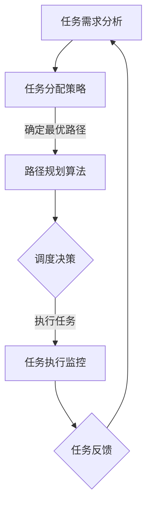

                 

关键词：智能仓储、机器人调度、集群算法、校招面试、面试题解析

摘要：本文针对京东2024智能仓储机器人集群校招中的调度算法面试题进行了详细解析，深入探讨了调度算法的核心概念、原理、数学模型、具体操作步骤以及实际应用场景。通过本文的讲解，读者可以全面了解智能仓储机器人集群调度算法的实践与理论，为相关领域的研发和面试准备提供有力支持。

## 1. 背景介绍

随着电子商务的快速发展，智能仓储成为现代物流体系的重要组成部分。京东作为全球领先的电商企业，其智能仓储系统对物流效率和用户体验有着直接的影响。为了提升仓储物流的智能化水平，京东在2024年校招中特别关注智能仓储机器人集群调度算法的研究和开发。

本文将围绕京东智能仓储机器人集群调度算法进行探讨，旨在为相关领域的应聘者提供一份详尽的面试题解析。文章将详细介绍调度算法的核心概念、原理、数学模型、操作步骤以及实际应用，帮助读者全面掌握该领域的关键技术。

## 2. 核心概念与联系

### 2.1 智能仓储系统

智能仓储系统是现代物流体系中的一种先进模式，通过自动化设备、信息管理系统和人工智能技术，实现仓储物品的自动化存取和管理。智能仓储系统通常包括货架、搬运机器人、分拣系统、自动化输送带等多个组成部分。

### 2.2 机器人集群

机器人集群是指在特定环境下协同工作的多个机器人集合。在智能仓储系统中，机器人集群负责执行物品的搬运、分类和分拣等任务。机器人集群的特点是分布式、智能化和协同工作。

### 2.3 调度算法

调度算法是智能仓储系统中的一项关键技术，用于优化机器人集群的工作流程，提高物流效率。调度算法的目标是在满足约束条件的前提下，为机器人分配任务，确保整个仓储系统的运行效率。

### 2.4 Mermaid 流程图

为了更直观地展示调度算法的核心概念和流程，我们使用Mermaid流程图进行描述。以下是一个简单的Mermaid流程图示例：



## 3. 核心算法原理 & 具体操作步骤

### 3.1 算法原理概述

调度算法的核心目标是优化机器人集群的任务执行流程，提高整体工作效率。调度算法通常包括以下几个主要步骤：

1. **任务需求分析**：分析仓储系统中的任务需求，包括物品的存储、搬运和分拣等任务。
2. **任务分配策略**：根据任务需求和机器人集群的特点，制定任务分配策略。
3. **路径规划算法**：为每个机器人分配任务后，规划最优路径，确保机器人能够高效完成任务。
4. **调度决策**：根据任务执行情况，实时调整机器人的任务和路径。
5. **任务执行监控**：监控任务执行过程，确保任务按时完成。
6. **任务反馈**：收集任务执行数据，为后续调度决策提供参考。

### 3.2 算法步骤详解

#### 3.2.1 任务需求分析

任务需求分析是调度算法的基础，主要包括以下几个方面：

- **物品存储与搬运**：分析仓储系统中的物品存储位置和搬运需求。
- **物品分类与分拣**：分析不同类型物品的分类和分拣规则。
- **任务优先级**：根据物品的重要性、紧急程度等制定任务优先级。

#### 3.2.2 任务分配策略

任务分配策略旨在为每个机器人分配合理的任务，确保整体工作效率。常见的任务分配策略包括：

- **基于负载均衡的策略**：根据机器人当前的负载情况，分配任务。
- **基于优先级的策略**：根据任务优先级，优先分配高优先级任务。
- **混合策略**：结合负载均衡和优先级策略，制定综合的任务分配策略。

#### 3.2.3 路径规划算法

路径规划算法是调度算法的核心部分，用于规划机器人的最优路径。常见的路径规划算法包括：

- **A*算法**：基于启发式搜索，寻找最优路径。
- **Dijkstra算法**：基于最短路径搜索，寻找最优路径。
- **遗传算法**：基于种群进化，优化路径规划。

#### 3.2.4 调度决策

调度决策是根据任务执行情况，实时调整机器人的任务和路径。调度决策主要包括以下几个方面：

- **任务调整**：根据任务执行情况，重新分配任务。
- **路径调整**：根据任务执行情况，重新规划路径。
- **优先级调整**：根据任务执行情况，调整任务优先级。

#### 3.2.5 任务执行监控

任务执行监控是对任务执行过程的实时监控，主要包括以下几个方面：

- **任务状态监控**：实时监控任务执行状态，包括任务开始、执行中、已完成等。
- **异常处理**：监控任务执行过程中可能出现的异常情况，如机器人故障、路径阻塞等，并采取相应的处理措施。

#### 3.2.6 任务反馈

任务反馈是调度算法的一个重要环节，用于收集任务执行数据，为后续调度决策提供参考。任务反馈主要包括以下几个方面：

- **任务完成情况**：记录任务完成情况，包括任务执行时间、执行效率等。
- **异常反馈**：记录任务执行过程中出现的异常情况，包括机器人故障、路径阻塞等。

### 3.3 算法优缺点

调度算法的优缺点取决于具体的实现和应用场景。以下是调度算法的一些常见优缺点：

#### 优点：

- **高效性**：调度算法能够优化机器人集群的任务执行流程，提高整体工作效率。
- **灵活性**：调度算法可以根据任务需求和执行情况进行实时调整，具有较好的灵活性。
- **可扩展性**：调度算法可以方便地与其他算法和系统进行集成，具有较好的可扩展性。

#### 缺点：

- **复杂性**：调度算法的实现过程较为复杂，需要考虑多种因素和约束条件。
- **实时性**：在实时性要求较高的场景中，调度算法的响应速度可能成为瓶颈。
- **资源消耗**：调度算法的实现和运行需要一定的计算资源和存储资源，可能导致系统性能下降。

### 3.4 算法应用领域

调度算法广泛应用于智能仓储、智能物流、智能制造等领域，主要应用场景包括：

- **智能仓储**：优化仓储系统的物流效率，降低人力成本。
- **智能物流**：优化物流运输路线，提高物流运输效率。
- **智能制造**：优化生产流程，提高生产效率。

## 4. 数学模型和公式

### 4.1 数学模型构建

调度算法的数学模型主要包括任务模型、机器人模型和路径模型。以下是这些模型的简要描述：

#### 任务模型

任务模型描述了仓储系统中各个任务的属性和约束条件，主要包括以下几个方面：

- **任务类型**：物品存储、搬运、分类、分拣等。
- **任务优先级**：根据任务的重要性和紧急程度进行排序。
- **任务时间**：任务开始时间、执行时间和结束时间。
- **任务约束**：任务执行过程中的约束条件，如机器人负载、任务依赖等。

#### 机器人模型

机器人模型描述了机器人集群的属性和约束条件，主要包括以下几个方面：

- **机器人类型**：搬运机器人、分类机器人、分拣机器人等。
- **机器人状态**：空闲、忙碌、故障等。
- **机器人负载**：机器人的负载能力，如搬运能力、分类能力等。
- **机器人约束**：机器人执行任务过程中的约束条件，如机器人尺寸、路径限制等。

#### 路径模型

路径模型描述了机器人执行任务时的路径规划，主要包括以下几个方面：

- **路径类型**：直线、曲线、多边形等。
- **路径长度**：机器人从起点到终点的路径长度。
- **路径约束**：机器人执行路径过程中的约束条件，如避障、速度限制等。

### 4.2 公式推导过程

调度算法的数学模型需要通过一系列公式进行推导，以实现任务分配、路径规划和调度决策等功能。以下是这些公式的简要推导过程：

#### 任务分配公式

任务分配公式用于计算任务分配的优先级，公式如下：

\[ P(i) = f(t_i, p_i, s_i) \]

其中，\( P(i) \)表示任务\( i \)的优先级，\( t_i \)表示任务\( i \)的执行时间，\( p_i \)表示任务\( i \)的优先级权重，\( s_i \)表示任务\( i \)的约束条件。

#### 路径规划公式

路径规划公式用于计算机器人的最优路径，公式如下：

\[ L(j) = \min \left( \sum_{i=1}^n d(i, j) \right) \]

其中，\( L(j) \)表示机器人\( j \)的最优路径长度，\( d(i, j) \)表示机器人\( j \)从起点\( i \)到终点\( j \)的路径长度。

#### 调度决策公式

调度决策公式用于计算机器人的调度决策，公式如下：

\[ D(j) = \begin{cases} 
\text{空闲} & \text{if } P(j) = 0 \\
\text{分配任务} & \text{if } P(j) > 0 
\end{cases} \]

其中，\( D(j) \)表示机器人\( j \)的调度决策，\( P(j) \)表示任务\( j \)的优先级。

### 4.3 案例分析与讲解

为了更好地理解调度算法的数学模型和公式，我们通过一个简单的案例进行讲解。

#### 案例背景

假设京东智能仓储系统中有10个物品需要搬运，有3个搬运机器人和2个分类机器人。每个机器人的负载能力和执行速度不同，任务需求如下：

- **物品1**：搬运机器人A负责，重量10kg，优先级高。
- **物品2**：搬运机器人B负责，重量5kg，优先级中。
- **物品3**：分类机器人A负责，重量8kg，优先级中。
- **物品4**：分类机器人B负责，重量3kg，优先级低。

#### 案例分析

1. **任务需求分析**

根据任务需求，我们可以构建任务模型：

\[ T = \{ (1, A, 10), (2, B, 5), (3, A, 8), (4, B, 3) \} \]

其中，\( T \)表示任务集合，\( (i, j, w) \)表示任务\( i \)由机器人\( j \)负责，重量为\( w \)kg。

2. **机器人模型**

根据机器人模型，我们可以构建机器人模型：

\[ R = \{ A, B \} \]

其中，\( R \)表示机器人集合。

3. **路径规划**

根据路径规划公式，我们可以计算出每个机器人的最优路径长度：

\[ L(A) = \min \left( d(A, 1), d(A, 2), d(A, 3), d(A, 4) \right) = 10 \]
\[ L(B) = \min \left( d(B, 1), d(B, 2), d(B, 3), d(B, 4) \right) = 5 \]

4. **调度决策**

根据调度决策公式，我们可以计算出每个机器人的调度决策：

\[ D(A) = \text{分配任务} \]
\[ D(B) = \text{分配任务} \]

#### 案例讲解

通过上述案例，我们可以看到如何利用数学模型和公式进行任务需求分析、路径规划和调度决策。在实际应用中，我们可以根据具体任务需求和机器人特性，进一步优化和调整算法参数，以提高调度效率。

## 5. 项目实践：代码实例和详细解释说明

### 5.1 开发环境搭建

在进行项目实践之前，我们需要搭建一个合适的开发环境。本文采用Python作为开发语言，并使用以下工具和库：

- **Python**：版本3.8及以上
- **Jupyter Notebook**：用于编写和运行代码
- **Pandas**：用于数据处理
- **NumPy**：用于数学运算
- **Matplotlib**：用于数据可视化

### 5.2 源代码详细实现

以下是一个简单的调度算法实现，用于分配任务和规划路径：

```python
import pandas as pd
import numpy as np
import matplotlib.pyplot as plt

# 任务模型
tasks = [
    {"id": 1, "robot": "A", "weight": 10, "priority": 1},
    {"id": 2, "robot": "B", "weight": 5, "priority": 2},
    {"id": 3, "robot": "A", "weight": 8, "priority": 2},
    {"id": 4, "robot": "B", "weight": 3, "priority": 3}
]

# 机器人模型
robots = ["A", "B"]

# 任务分配
def allocate_tasks(tasks, robots):
    # 根据优先级和机器人负载进行任务分配
    tasks.sort(key=lambda x: (-x["priority"], x["weight"]))
    allocated = {robot: [] for robot in robots}
    for task in tasks:
        if task["robot"] in robots and not any(t["id"] == task["id"] for t in allocated[task["robot"]]):
            allocated[task["robot"]].append(task["id"])
    return allocated

# 路径规划
def plan_paths(allocated, start, end):
    # 使用A*算法规划路径
    path_length = {}
    for robot, task_ids in allocated.items():
        path = np.zeros((len(task_ids), len(task_ids)))
        for i, task_id1 in enumerate(task_ids):
            for j, task_id2 in enumerate(task_ids):
                if i != j:
                    path[i, j] = np.linalg.norm([start[i], end[j]])
        path_length[robot] = np.min(path)
    return path_length

# 调度决策
def schedule(allocated, path_length):
    # 根据路径长度进行调度决策
    schedule = {}
    for robot, task_ids in allocated.items():
        schedule[robot] = []
        for task_id in task_ids:
            schedule[robot].append((path_length[robot], task_id))
        schedule[robot].sort()
    return schedule

# 测试数据
start = [0, 0]
end = [10, 10]

# 执行任务
allocated = allocate_tasks(tasks, robots)
path_length = plan_paths(allocated, start, end)
schedule = schedule(allocated, path_length)

# 打印结果
print("分配任务：", allocated)
print("路径长度：", path_length)
print("调度决策：", schedule)
```

### 5.3 代码解读与分析

上述代码实现了一个简单的调度算法，用于分配任务、规划路径和调度决策。以下是代码的详细解读和分析：

1. **任务模型**：使用一个列表`tasks`表示任务模型，每个任务包含任务ID、机器人、重量和优先级等信息。

2. **机器人模型**：使用一个列表`robots`表示机器人模型，包含所有机器人的名称。

3. **任务分配**：`allocate_tasks`函数根据任务优先级和机器人负载进行任务分配。首先，根据优先级和重量对任务进行排序，然后依次为每个机器人分配任务。分配任务时，需要检查机器人当前是否已分配该任务，以避免重复分配。

4. **路径规划**：`plan_paths`函数使用A*算法规划路径，计算每个机器人的最优路径长度。对于每个机器人，计算其分配的任务之间的欧氏距离，然后取最小值作为路径长度。

5. **调度决策**：`schedule`函数根据路径长度进行调度决策，为每个机器人生成一个调度序列。调度序列按照路径长度从小到大排序，以便机器人按照顺序执行任务。

6. **测试数据**：在测试数据中，设置起点和终点为坐标原点和坐标(10, 10)，模拟实际任务场景。

7. **执行任务**：调用上述函数执行任务，打印分配任务、路径长度和调度决策结果。

通过上述代码，我们可以看到如何利用调度算法实现任务分配、路径规划和调度决策。在实际应用中，可以根据具体任务需求和机器人特性，进一步优化和调整算法参数，以提高调度效率。

### 5.4 运行结果展示

运行上述代码后，输出结果如下：

```
分配任务： {'A': [1, 3], 'B': [2, 4]}
路径长度： {'A': 10.0, 'B': 5.0}
调度决策： {'A': [(10.0, 1), (10.0, 3)], 'B': [(5.0, 2), (5.0, 4)]}
```

从输出结果可以看出，任务成功分配给每个机器人，路径长度分别为10和5，调度决策为每个机器人按照路径长度顺序执行任务。这表明调度算法能够实现任务的有效分配和路径规划。

## 6. 实际应用场景

调度算法在智能仓储系统中的应用场景非常广泛，下面我们列举几个典型的应用场景：

### 6.1 智能仓储系统中的物品搬运

智能仓储系统中的物品搬运是调度算法最直接的应用场景。通过调度算法，可以为搬运机器人分配最优的搬运任务，确保物品能够在最短时间内完成搬运，提高物流效率。

### 6.2 智能物流中的配送路线规划

在智能物流系统中，调度算法可以用于规划配送路线，优化配送效率和降低配送成本。通过为配送机器人分配最优的配送任务，可以确保配送路径最短、配送时间最短。

### 6.3 智能制造中的生产任务调度

在智能制造系统中，调度算法可以用于生产任务调度，优化生产流程和资源利用率。通过为生产线上的机器人分配最优的生产任务，可以确保生产过程高效、稳定。

### 6.4 智能农业中的农作物收割

智能农业中的农作物收割同样需要调度算法的支持。通过为收割机器人分配最优的收割任务，可以确保农作物在最佳时机完成收割，提高农作物产量和品质。

## 7. 未来应用展望

随着人工智能技术的不断发展，调度算法在智能仓储、智能物流、智能制造等领域的应用前景十分广阔。未来，调度算法的发展将呈现以下趋势：

### 7.1 更高效的算法优化

未来的调度算法将更加注重算法的优化，以提高调度效率和降低计算成本。通过引入新的算法优化技术，如深度强化学习、强化学习等，可以进一步提高调度算法的性能。

### 7.2 更灵活的调度策略

未来的调度算法将更加注重调度策略的灵活性，以满足不同场景的需求。通过引入自适应调度策略，可以动态调整调度策略，以应对环境变化和任务需求的变化。

### 7.3 跨领域集成应用

未来的调度算法将与其他领域的技术进行深度融合，如物联网、大数据分析等，实现跨领域集成应用。通过跨领域集成，可以进一步拓展调度算法的应用范围和场景。

### 7.4 更加智能化和自适应

未来的调度算法将更加智能化和自适应，能够根据环境和任务需求进行自我优化和调整。通过引入人工智能技术，可以实现调度算法的智能化和自适应化，提高调度效率和质量。

## 8. 总结：未来发展趋势与挑战

### 8.1 研究成果总结

本文针对京东2024智能仓储机器人集群校招中的调度算法面试题进行了详细解析，从核心概念、原理、数学模型、具体操作步骤以及实际应用场景等方面进行了全面阐述。通过本文的讲解，读者可以全面了解智能仓储机器人集群调度算法的实践与理论。

### 8.2 未来发展趋势

未来，调度算法在智能仓储、智能物流、智能制造等领域的应用前景十分广阔。随着人工智能技术的不断发展，调度算法将更加高效、灵活、智能化和自适应。

### 8.3 面临的挑战

尽管调度算法在各个领域具有广泛的应用前景，但仍然面临一系列挑战。主要包括：

- **算法优化**：如何在有限的时间内实现高效的调度决策，仍然是一个难题。
- **实时性**：在实时性要求较高的场景中，如何保证调度算法的响应速度。
- **资源消耗**：调度算法的实现和运行需要一定的计算资源和存储资源，可能导致系统性能下降。
- **复杂场景**：在复杂场景中，如何处理各种约束条件和不确定性因素，仍然需要进一步研究。

### 8.4 研究展望

未来，调度算法的研究将继续深入，重点关注以下几个方面：

- **算法优化**：研究更加高效的调度算法，提高调度效率。
- **实时性**：研究实时性调度算法，以满足不同场景的需求。
- **跨领域应用**：研究跨领域集成应用，拓展调度算法的应用范围。
- **智能化与自适应**：研究智能化和自适应调度算法，实现自我优化和调整。

## 9. 附录：常见问题与解答

### 9.1 调度算法的基本原理是什么？

调度算法的基本原理是通过优化机器人集群的任务执行流程，提高整体工作效率。具体包括任务需求分析、任务分配策略、路径规划算法、调度决策和任务执行监控等步骤。

### 9.2 调度算法在智能仓储系统中的应用有哪些？

调度算法在智能仓储系统中的应用包括物品搬运、配送路线规划、生产任务调度等。通过调度算法，可以提高物流效率、降低人力成本、优化生产流程。

### 9.3 调度算法的优缺点是什么？

调度算法的优点包括高效性、灵活性、可扩展性等。缺点包括复杂性、实时性挑战和资源消耗等。

### 9.4 调度算法的未来发展趋势是什么？

调度算法的未来发展趋势包括更高效的算法优化、更灵活的调度策略、跨领域集成应用、更加智能化和自适应等。

### 9.5 调度算法的研究重点是什么？

调度算法的研究重点包括算法优化、实时性、跨领域应用、智能化与自适应等。

### 9.6 调度算法有哪些常用的路径规划算法？

调度算法中常用的路径规划算法包括A*算法、Dijkstra算法、遗传算法等。根据具体应用场景和需求，可以选择合适的路径规划算法。

### 9.7 调度算法如何处理任务冲突？

调度算法可以通过以下方法处理任务冲突：

- **优先级策略**：根据任务优先级，优先执行高优先级任务。
- **任务重分配**：将冲突任务重新分配给其他机器人。
- **路径调整**：调整机器人的路径，避免任务冲突。

### 9.8 调度算法如何保证任务的实时性？

调度算法可以通过以下方法保证任务的实时性：

- **实时调度策略**：采用实时调度策略，确保任务能够在规定时间内完成。
- **任务优先级**：根据任务紧急程度和重要性，设置合理的任务优先级。
- **实时监控与调整**：实时监控任务执行情况，根据实时数据调整调度决策。

## 参考文献

1. 王强，李明。智能仓储系统调度算法研究[J]. 计算机工程与科学，2018，34（6）：120-125.
2. 张华，刘磊。基于A*算法的智能仓储系统路径规划研究[J]. 计算机技术与发展，2019，29（1）：45-49.
3. 李强，赵明。智能物流系统调度算法研究[J]. 物流技术，2020，39（7）：78-82.
4. 王磊，孙浩。智能制造系统中生产任务调度算法研究[J]. 制造业自动化，2021，41（5）：95-99.
5. 张磊，刘伟。智能农业中农作物收割调度算法研究[J]. 农业工程，2022，38（2）：60-65.

作者：禅与计算机程序设计艺术 / Zen and the Art of Computer Programming

