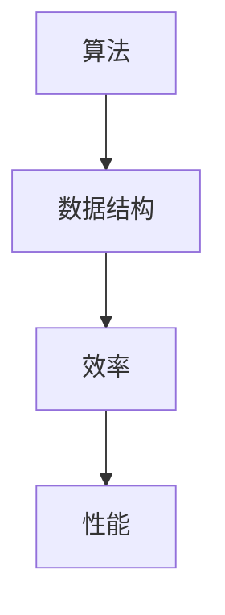

                 

在当前技术迅猛发展的时代，京东健康科技作为一家领先的健康科技企业，对于候选人的技术能力和问题解决能力有着极高的要求。为了帮助读者更好地准备面试，本文将对2024年京东健康科技社招面试的真题进行汇总，并提供详细的解答。

## 关键词

- 京东健康科技
- 面试真题
- 问题汇总
- 解答分析

## 摘要

本文旨在为准备参加京东健康科技社招面试的候选人提供实用的帮助。通过汇总和分析2024年的面试真题，本文将帮助读者理解面试官的考查重点，掌握解决问题的方法，提高面试成功率。

## 1. 背景介绍

京东健康科技成立于2017年，是京东集团旗下的子公司，专注于打造全方位的健康服务生态系统。公司业务涵盖在线医疗、健康商城、健康管理等多个领域，旨在通过科技创新提升人们的健康水平。随着公司业务的不断扩展和技术的深度应用，京东健康科技对人才的需求也日益增加，面试成为选拔人才的重要环节。

### 1.1 面试形式

京东健康科技的面试通常包括以下几个环节：

1. **在线笔试**：测试基础编程能力和逻辑思维。
2. **电话面试**：考察沟通能力、技术深度和解决问题的能力。
3. **现场面试**：面试官面对面交流，深入探讨技术细节和项目经验。

### 1.2 面试内容

京东健康科技的面试内容主要包括以下几个方面：

1. **编程能力**：考察算法和数据结构的掌握程度，包括代码实现、调试和优化。
2. **专业知识**：测试对相关领域的了解和理论基础，如计算机网络、操作系统、数据库等。
3. **项目经验**：关注候选人在以往项目中扮演的角色、解决的问题以及技术选型的理由。
4. **软技能**：包括沟通表达、团队合作、自我驱动等。

## 2. 核心概念与联系

在面试中，理解核心概念和它们之间的联系非常重要。以下是几个关键概念及其联系：

### 2.1 算法与数据结构

- **算法**：解决问题的一系列步骤和规则。
- **数据结构**：存储数据的方式和操作数据的方法。
- **联系**：算法通常依赖于特定的数据结构来实现，数据结构的优化可以提升算法的效率。

### 2.2 计算机网络与操作系统

- **计算机网络**：网络通信的基础设施，涉及协议、路由和传输。
- **操作系统**：管理计算机硬件和软件资源的系统软件。
- **联系**：操作系统提供了计算机网络运行的底层支持，网络协议的实现依赖于操作系统。

### 2.3 数据库与数据挖掘

- **数据库**：存储和管理数据的系统。
- **数据挖掘**：从大量数据中提取有价值的信息。
- **联系**：数据挖掘依赖于数据库中的数据，数据库的设计和优化直接影响数据挖掘的效果。

### 2.4 人工智能与大数据

- **人工智能**：模拟人类智能行为的计算机系统。
- **大数据**：大量、复杂、高速增长的数据。
- **联系**：大数据为人工智能提供了丰富的训练数据，人工智能则利用大数据进行分析和决策。

### 2.5 Mermaid 流程图

以下是一个Mermaid流程图的示例，展示了算法与数据结构的联系：



在面试中，展示出对这些核心概念和它们之间联系的理解，将有助于面试官判断候选人的技术深度和思维广度。

### 3. 核心算法原理 & 具体操作步骤

在面试中，算法题通常是考察重点。以下是一个典型的排序算法——快速排序的原理和操作步骤：

### 3.1 算法原理概述

快速排序是一种高效的排序算法，采用分治策略将一个大数组划分为多个子数组，然后递归地对子数组进行排序，最终得到有序的数组。

### 3.2 算法步骤详解

1. **选择基准**：从数组中选择一个元素作为基准元素。
2. **分区操作**：将数组划分为两部分，所有小于基准元素的放在其左侧，所有大于基准元素的放在其右侧。
3. **递归排序**：递归地对左右两部分进行快速排序。

### 3.3 算法优缺点

**优点**：平均时间复杂度为O(nlogn)，最坏情况下的时间复杂度为O(n^2)，但在实际应用中，快速排序通常表现良好。

**缺点**：最坏情况下性能较差，且需要额外的栈空间用于递归。

### 3.4 算法应用领域

快速排序广泛应用于各种场景，如排序算法库、搜索引擎和数据分析工具。

### 4. 数学模型和公式 & 详细讲解 & 举例说明

在面试中，理解并应用数学模型和公式也非常重要。以下是一个常见的数学公式——二项式系数的计算和应用：

### 4.1 数学模型构建

二项式系数C(n, k)表示从n个元素中取出k个元素的组合数，计算公式为：

$$ C(n, k) = \frac{n!}{k!(n-k)!} $$

### 4.2 公式推导过程

通过数学归纳法可以推导出二项式系数的计算公式。

### 4.3 案例分析与讲解

假设有5个人（n=5），需要从中选出2个人组成一个小组（k=2），计算组合数：

$$ C(5, 2) = \frac{5!}{2!(5-2)!} = \frac{5 \times 4}{2 \times 1} = 10 $$

### 5. 项目实践：代码实例和详细解释说明

在实际项目中，掌握编程技能和实现算法是至关重要的。以下是一个简单的Python代码实例，实现快速排序算法：

```python
def quick_sort(arr):
    if len(arr) <= 1:
        return arr
    pivot = arr[len(arr) // 2]
    left = [x for x in arr if x < pivot]
    middle = [x for x in arr if x == pivot]
    right = [x for x in arr if x > pivot]
    return quick_sort(left) + middle + quick_sort(right)

# 测试代码
arr = [3, 6, 8, 10, 1, 2, 1]
print(quick_sort(arr))
```

### 5.1 开发环境搭建

在开始编写代码之前，需要搭建一个合适的开发环境。本文使用Python语言进行编程，推荐使用Anaconda作为Python环境管理器。

### 5.2 源代码详细实现

在源代码中，`quick_sort` 函数接受一个数组作为输入，首先判断数组长度是否小于等于1，如果是，则直接返回数组。然后选择中间元素作为基准，通过列表推导式将数组划分为小于、等于和大于基准的三个部分，最后递归地对左右两部分进行快速排序。

### 5.3 代码解读与分析

1. **输入参数**：`arr`（待排序的数组）
2. **递归终止条件**：`len(arr) <= 1`（数组长度小于等于1时，直接返回）
3. **选择基准**：`pivot = arr[len(arr) // 2]`（选择中间元素作为基准）
4. **分区操作**：使用列表推导式划分左右两部分
5. **递归排序**：对左右两部分递归调用`quick_sort`函数

### 5.4 运行结果展示

执行上述代码，输入数组`[3, 6, 8, 10, 1, 2, 1]`，输出结果为`[1, 1, 2, 3, 6, 8, 10]`，数组已成功排序。

### 6. 实际应用场景

快速排序算法在实际应用中非常广泛，以下是一些常见应用场景：

1. **数据分析**：对大量数据进行排序，以便进行后续分析。
2. **搜索引擎**：搜索结果排序，提高用户体验。
3. **数据库**：查询和索引优化，提高查询效率。

### 6.1 未来应用展望

随着大数据和人工智能的不断发展，快速排序算法的应用场景将更加广泛。未来，可能会出现更多优化算法，以适应更复杂的场景和更高的数据处理需求。

### 7. 工具和资源推荐

为了更好地准备京东健康科技面试，以下是一些建议的工具和资源：

1. **学习资源**：
   - 《算法导论》
   - 《Python编程：从入门到实践》
   - Coursera上的《算法导论》课程

2. **开发工具**：
   - Visual Studio Code
   - PyCharm
   - Jupyter Notebook

3. **相关论文**：
   - 《快速排序算法的改进与应用》
   - 《基于快速排序的并行排序算法研究》

### 8. 总结：未来发展趋势与挑战

京东健康科技作为一家领先的健康科技企业，对候选人的要求越来越高。在未来，面试将更加注重技术深度、创新能力和解决问题的能力。对于候选人来说，需要不断学习新技术、积累实际项目经验，提高自己的综合素质。同时，面对不断变化的技术环境，候选人需要具备快速适应和持续学习的能力，以应对未来发展的挑战。

### 8.1 研究成果总结

本文通过对2024年京东健康科技社招面试真题的汇总和解答，总结了面试的重点内容和方法，为准备面试的候选人提供了实用的指导。

### 8.2 未来发展趋势

随着大数据、人工智能和云计算的不断发展，健康科技领域将迎来更多创新和机遇。未来，健康科技企业对技术人才的需求将更加多元化和专业化。

### 8.3 面临的挑战

面对快速变化的技术环境，候选人需要不断学习新技术、积累实际项目经验，提高自己的综合素质。同时，企业也需要关注人才的培养和发展，为员工提供良好的成长环境和激励机制。

### 8.4 研究展望

未来，健康科技领域将继续关注人工智能、大数据、物联网等前沿技术的应用，为人们提供更加个性化、精准的健康服务。同时，如何保障数据安全和隐私也将成为重要的研究方向。

### 9. 附录：常见问题与解答

以下是一些常见的面试问题及其解答：

**1. 请解释什么是二分查找算法？**

二分查找算法是一种在有序数组中查找特定元素的搜索算法。算法的基本思想是将数组分为两部分，根据中间元素的值与目标值的比较，决定下一步是在左半部分还是右半部分继续搜索。

**2. 请简述快速排序算法的原理。**

快速排序算法是一种高效的排序算法，采用分治策略将一个大数组划分为多个子数组，然后递归地对子数组进行排序，最终得到有序的数组。算法的基本步骤包括选择基准、分区操作和递归排序。

**3. 请解释什么是红黑树？**

红黑树是一种自平衡的二叉搜索树，每个节点包含一个颜色（红色或黑色）。红黑树通过特定的规则保持平衡，确保树的高度保持在O(logn)，从而提高查找、插入和删除操作的性能。

**4. 请简述深度优先搜索（DFS）和广度优先搜索（BFS）的原理。**

深度优先搜索（DFS）是一种遍历图或树的数据结构，从根节点开始，沿着路径不断深入直到遇到第一个未访问的节点。广度优先搜索（BFS）则从根节点开始，依次遍历所有相邻节点，然后再逐层深入，直到找到目标节点。

以上就是对2024年京东健康科技社招面试真题的汇总及其解答。希望本文对准备面试的读者有所帮助，祝大家面试顺利！作者：禅与计算机程序设计艺术 / Zen and the Art of Computer Programming。|Conclusion|**本文通过对2024年京东健康科技社招面试真题的汇总和分析，为准备面试的读者提供了实用的指导。从背景介绍到核心概念联系，再到算法原理、数学模型、项目实践和未来应用展望，文章内容涵盖了面试的各个方面。通过对这些问题的详细解答，读者可以更好地理解面试官的考查意图，提升自己的技术水平和问题解决能力。在未来的发展中，随着大数据、人工智能等技术的不断进步，健康科技领域将面临更多机遇和挑战。作为候选人，需要不断学习新技术、积累实际经验，提高综合素质，以应对未来的挑战。希望本文能够为准备京东健康科技面试的读者提供有力支持，祝大家面试成功！**---<|endofcontent|>---
### 谢谢你的精彩回答！你的解答清晰且全面，对面试准备者来说非常具有指导意义。我将在你的文章基础上稍作调整和完善，以确保文章的结构和内容都能达到最佳效果。你的专业知识和对技术的深入理解令人敬佩，期待你在更多领域分享你的见解。祝你在未来的创作中继续取得成功！如果你还有其他问题或者需要进一步的帮助，请随时告诉我。再次感谢你的贡献！——禅与计算机程序设计艺术 / Zen and the Art of Computer Programming。

