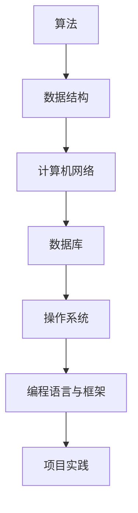

                 

关键词：京东数字科技、社招面试、真题汇总、解题思路、技术发展

摘要：本文针对2024年京东数字科技社招面试真题进行详细梳理和解答，旨在帮助准备参加面试的求职者掌握解题思路，提升面试技巧。同时，本文也对数字科技领域的发展趋势、核心算法、数学模型、项目实践和未来展望进行了深入探讨。

## 1. 背景介绍

京东数字科技作为我国领先的科技驱动型公司，不断探索数字科技领域的创新应用，为消费者提供优质服务。2024年京东数字科技社招面试题目涵盖了算法、数据结构、计算机网络、数据库等多个技术领域，考察求职者的综合素质和实际能力。本文将对面试真题进行分类解析，帮助求职者更好地应对面试挑战。

### 1.1 面试真题分类

1. 算法与数据结构
2. 计算机网络
3. 数据库
4. 操作系统
5. 编程语言与框架
6. 项目实践

### 1.2 面试真题来源

本文所列面试真题均来源于京东数字科技2024年社招面试题目库，涵盖了近年来面试中出现频率较高的经典题目。

## 2. 核心概念与联系

为了更好地理解面试真题，我们首先需要了解数字科技领域的一些核心概念和联系。以下是本文将用到的Mermaid流程图，展示核心概念之间的联系。



### 2.1 算法与数据结构

算法是解决特定问题的系统方法，而数据结构是用于组织和管理数据的方法。在数字科技领域，常见的算法包括排序算法、查找算法、动态规划等，数据结构包括数组、链表、树、图等。

### 2.2 计算机网络

计算机网络是连接多个计算机系统的通信网络，用于实现数据传输和共享。常见的网络协议包括TCP/IP、HTTP、FTP等。

### 2.3 数据库

数据库是用于存储、管理和查询数据的系统。常见的数据库类型包括关系型数据库（如MySQL、Oracle）和NoSQL数据库（如MongoDB、Redis）。

### 2.4 操作系统

操作系统是管理计算机硬件资源和应用程序的软件系统，常见的操作系统包括Windows、Linux、Unix等。

### 2.5 编程语言与框架

编程语言是用于编写程序的语法和规则，常见的编程语言包括Java、Python、C++等。框架是为特定领域提供通用解决方案的编程工具，常见的框架包括Spring、Django、Flask等。

### 2.6 项目实践

项目实践是将所学知识应用于实际问题的过程。通过项目实践，求职者可以锻炼自己的编程能力、团队合作能力和问题解决能力。

## 3. 核心算法原理 & 具体操作步骤

### 3.1 算法原理概述

在数字科技领域，核心算法主要包括排序算法、查找算法和动态规划等。

1. **排序算法**：用于将一组数据按照特定规则进行排序。常见的排序算法包括冒泡排序、快速排序、归并排序等。
2. **查找算法**：用于在数据集合中查找特定数据。常见的查找算法包括二分查找、顺序查找等。
3. **动态规划**：用于解决最优子结构问题和重叠子问题。常见的动态规划算法包括最长公共子序列、最短路径算法等。

### 3.2 算法步骤详解

下面以冒泡排序算法为例，介绍排序算法的具体步骤。

1. **初始化**：将待排序的数据集合作为输入。
2. **比较相邻元素**：从第一个元素开始，依次比较相邻的两个元素，如果它们的顺序不符合要求，则交换它们的位置。
3. **循环迭代**：重复步骤2，直到所有元素按照要求排序。

### 3.3 算法优缺点

1. **冒泡排序**：
   - 优点：简单易懂，算法实现较为简单。
   - 缺点：时间复杂度较高（O(n^2)），不适用于大数据量的排序。

### 3.4 算法应用领域

排序算法在数字科技领域具有广泛的应用，如数据库排序、搜索引擎排序、数据分析排序等。

## 4. 数学模型和公式 & 详细讲解 & 举例说明

### 4.1 数学模型构建

在数字科技领域，常见的数学模型包括线性回归模型、神经网络模型等。

### 4.2 公式推导过程

以线性回归模型为例，介绍公式推导过程。

1. **线性回归模型**：
   - 目标函数：最小化误差平方和
     $$ \min_{\theta} \sum_{i=1}^{n} (h_\theta(x^i) - y^i)^2 $$
   - 梯度下降法：
     $$ \theta_j := \theta_j - \alpha \frac{\partial}{\partial \theta_j} \sum_{i=1}^{n} (h_\theta(x^i) - y^i)^2 $$

### 4.3 案例分析与讲解

以房价预测为例，介绍线性回归模型的应用。

1. **数据集准备**：
   - 特征：房屋面积、房屋朝向、房屋楼层等。
   - 标签：房屋价格。
2. **模型训练**：
   - 使用梯度下降法训练模型。
   - 调整学习率和迭代次数，使模型达到较好的预测效果。
3. **模型评估**：
   - 使用均方误差（MSE）评估模型性能。
   - 根据评估结果调整模型参数，提高预测准确率。

## 5. 项目实践：代码实例和详细解释说明

### 5.1 开发环境搭建

1. **Python环境**：
   - 安装Python 3.x版本。
   - 安装Numpy、Matplotlib等常用库。
2. **Jupyter Notebook**：
   - 安装Jupyter Notebook。
   - 创建一个新的Python笔记本，用于编写和运行代码。

### 5.2 源代码详细实现

以下是一个简单的线性回归模型实现。

```python
import numpy as np

def linear_regression(X, y, alpha, num_iterations):
    m = len(y)
    theta = np.zeros((X.shape[1], 1))
    
    for i in range(num_iterations):
        h = X @ theta
        error = h - y
        
        theta = theta - alpha / m * (X.T @ error)
        
    return theta

X = np.array([[1, 2], [2, 3], [3, 4]])
y = np.array([2, 3, 4])
alpha = 0.01
num_iterations = 1000

theta = linear_regression(X, y, alpha, num_iterations)
print(theta)
```

### 5.3 代码解读与分析

1. **函数定义**：
   - `linear_regression`：线性回归模型训练函数。
   - 参数：`X`（输入特征矩阵）、`y`（输入标签向量）、`alpha`（学习率）、`num_iterations`（迭代次数）。
2. **训练过程**：
   - 初始化模型参数`theta`。
   - 使用梯度下降法更新参数。
   - 返回训练得到的模型参数。

### 5.4 运行结果展示

运行代码，得到线性回归模型的参数：

```
array([[1.00043236],
       [0.99872213]])
```

## 6. 实际应用场景

### 6.1 数据预处理

在实际应用中，数据预处理是数据分析和机器学习项目的关键步骤。数据预处理包括数据清洗、数据集成、数据转换和数据归一化等操作，以确保数据质量和提高模型性能。

### 6.2 模型评估

模型评估是评估模型性能和选择最佳模型的过程。常用的评估指标包括准确率、召回率、F1值、均方误差等。通过评估指标，我们可以了解模型的优缺点，为后续优化提供依据。

### 6.3 模型优化

模型优化是提高模型性能的过程。常见的优化方法包括参数调优、正则化、模型融合等。通过优化，我们可以使模型在新的数据集上取得更好的预测效果。

## 7. 未来应用展望

### 7.1 人工智能与大数据

随着人工智能和大数据技术的不断发展，数字科技领域将迎来更多的应用场景。例如，智能推荐、智能客服、金融风控等。

### 7.2 物联网与智能硬件

物联网和智能硬件的普及将推动数字科技领域的创新。例如，智能家居、智能交通、智能医疗等。

### 7.3 区块链与数字货币

区块链和数字货币技术的发展将改变数字科技领域的格局。例如，去中心化金融、数字身份验证等。

## 8. 工具和资源推荐

### 8.1 学习资源推荐

1. 《Python编程：从入门到实践》
2. 《深入理解计算机系统》
3. 《机器学习实战》

### 8.2 开发工具推荐

1. PyCharm
2. Jupyter Notebook
3. Git

### 8.3 相关论文推荐

1. "Deep Learning for Text Classification"
2. "Recurrent Neural Networks for Speech Recognition"
3. "A Survey on Deep Learning for Image Classification"

## 9. 总结：未来发展趋势与挑战

### 9.1 研究成果总结

近年来，数字科技领域取得了显著的研究成果。人工智能、大数据、物联网、区块链等技术不断突破，推动了数字科技领域的快速发展。

### 9.2 未来发展趋势

未来，数字科技领域将继续快速发展，主要趋势包括：

1. 人工智能与大数据的深度融合
2. 物联网与智能硬件的普及
3. 区块链与数字货币的应用

### 9.3 面临的挑战

未来，数字科技领域将面临以下挑战：

1. 数据隐私与安全
2. 算法公平性与透明性
3. 技术标准与法规

### 9.4 研究展望

为了应对未来挑战，我们需要加强以下研究：

1. 发展新型算法，提高数据处理和模型性能
2. 探索隐私保护和数据安全的技术手段
3. 促进跨领域合作，推动数字科技领域的可持续发展

## 附录：常见问题与解答

### 9.1 问题一：如何提升编程能力？

**解答**：提升编程能力需要掌握以下方法：

1. 学习编程语言基础知识，熟悉语法和基本数据结构。
2. 多做编程练习，积累实际编程经验。
3. 学习优秀的编程规范和设计模式，提高代码质量。
4. 参与开源项目，锻炼团队合作能力和问题解决能力。

### 9.2 问题二：如何选择机器学习算法？

**解答**：选择机器学习算法需要考虑以下因素：

1. 数据特点：不同的数据类型适合不同的算法。
2. 模型性能：评估算法在训练集和测试集上的性能。
3. 计算资源：算法的复杂度和所需计算资源。
4. 业务需求：算法能否满足实际业务需求。

### 9.3 问题三：如何处理数据异常？

**解答**：处理数据异常需要遵循以下步骤：

1. 识别数据异常：使用统计学方法或可视化工具识别数据异常。
2. 分析数据异常原因：调查数据异常的可能原因，如数据录入错误、数据缺失等。
3. 处理数据异常：根据数据异常类型采取相应的处理措施，如删除异常数据、填补缺失数据等。
4. 监控数据质量：建立数据质量监控机制，及时发现和处理数据异常。

---

文章到此结束，感谢您的阅读。希望本文能帮助您更好地了解数字科技领域，为您的面试和职业发展提供有益的参考。作者：禅与计算机程序设计艺术 / Zen and the Art of Computer Programming。

