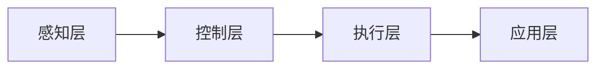

                 

随着智能制造技术的快速发展，京东作为全球领先的电商企业，对于智能制造领域的专业人才需求日益增加。为此，京东在2024年的校招中，针对智能制造领域设置了多套面试真题，以考察应聘者的专业知识和实践能力。本文将针对这些真题进行汇总，并给出详细的解答。

## 关键词
- 京东校招
- 智能制造
- 面试真题
- 解题思路
- 实践案例

## 摘要
本文旨在帮助参加京东2024年智能制造校招的考生，通过总结面试真题，深入理解智能制造领域的关键概念和技术。文章将分为以下几个部分：背景介绍、核心概念与联系、核心算法原理与步骤、数学模型与公式、项目实践、实际应用场景、工具和资源推荐、总结以及常见问题与解答。

## 1. 背景介绍

智能制造是利用先进的信息技术和制造技术，实现制造过程的自动化、智能化和优化。随着大数据、云计算、物联网、人工智能等技术的快速发展，智能制造已成为制造业转型升级的关键途径。京东作为全球领先的电商企业，积极推进智能制造战略，不断提升供应链效率和用户体验。

京东的智能制造校招面试真题涵盖了智能制造的多个方面，包括核心技术、应用场景、开发实践等。这些真题不仅考察了应聘者的理论知识，更注重其实际操作能力和解决复杂问题的能力。

## 2. 核心概念与联系

### 2.1 智能制造系统架构

智能制造系统通常包括感知层、控制层、执行层和应用层。感知层主要负责数据采集和传感器数据处理；控制层负责根据感知层的数据进行决策和优化；执行层负责执行控制层的决策，实现制造过程自动化；应用层则提供了智能化服务的接口，如故障诊断、预测性维护、质量检测等。

以下是智能制造系统架构的Mermaid流程图：



### 2.2 关键技术

智能制造的关键技术包括：传感器技术、云计算、物联网、人工智能、大数据分析、机器人技术等。这些技术相互关联，共同构成了智能制造的技术体系。

### 2.3 应用场景

智能制造在多个领域有着广泛的应用，如家电制造、汽车制造、电子制造、食品制造等。以下是一个简单的应用场景示例：

- **家电制造**：通过物联网技术，实现家电设备的数据采集和远程监控，提高生产效率，降低故障率。
- **汽车制造**：利用人工智能技术，实现自动驾驶、智能决策，提高车辆安全性。
- **电子制造**：通过大数据分析，优化生产流程，提高产品质量。

## 3. 核心算法原理 & 具体操作步骤

### 3.1 算法原理概述

智能制造中的核心算法主要包括：机器学习算法、优化算法、预测算法等。这些算法可以用于数据挖掘、决策优化、故障诊断等。

### 3.2 算法步骤详解

以机器学习算法为例，其基本步骤包括：

1. 数据收集：从各种渠道收集相关数据。
2. 数据预处理：对数据进行清洗、归一化等处理。
3. 特征提取：从数据中提取有用的特征。
4. 模型训练：使用训练数据集训练机器学习模型。
5. 模型评估：使用测试数据集评估模型性能。
6. 模型部署：将训练好的模型部署到生产环境中。

### 3.3 算法优缺点

每种算法都有其优缺点。例如：

- **机器学习算法**：优点是能够自动发现数据中的规律，但缺点是需要大量的数据和计算资源。
- **优化算法**：优点是能够在给定约束条件下找到最优解，但缺点是计算复杂度高。

### 3.4 算法应用领域

智能制造中的算法广泛应用于各种领域，如：

- **生产调度**：通过优化算法实现生产计划的合理调度。
- **故障诊断**：通过机器学习算法实现设备的故障预测和诊断。
- **质量控制**：通过大数据分析实现产品质量的实时监控和评估。

## 4. 数学模型和公式 & 详细讲解 & 举例说明

### 4.1 数学模型构建

智能制造中的数学模型主要包括：线性规划模型、非线性规划模型、神经网络模型等。以下是一个简单的线性规划模型示例：

$$
\min \quad c^T x
$$

$$
\text{subject to} \quad Ax \leq b
$$

其中，$c$ 是系数向量，$x$ 是决策变量，$A$ 和 $b$ 分别是约束矩阵和约束向量。

### 4.2 公式推导过程

线性规划模型的推导过程如下：

1. **目标函数**：目标函数是要优化的函数，通常表示为 $c^T x$。
2. **约束条件**：约束条件是指决策变量 $x$ 需要满足的条件，通常表示为 $Ax \leq b$。
3. **优化过程**：通过求解线性规划模型，找到满足约束条件的最优解。

### 4.3 案例分析与讲解

以下是一个简单的案例：

**问题**：生产一种产品，需要两种原材料。每种原材料的价格和可用量如下：

| 原材料 | 价格（元/千克） | 可用量（千克） |
|--------|--------------|-------------|
| A      | 20           | 100         |
| B      | 30           | 80          |

要求生产 100 千克产品，每千克产品需要 2 千克原材料 A 和 1 千克原材料 B。问如何安排生产计划，以最小化成本？

**解答**：

1. **目标函数**：最小化成本，即 $20x + 30y$。
2. **约束条件**：原材料 A 的使用量不超过 100 千克，原材料 B 的使用量不超过 80 千克，且生产的产品总量为 100 千克。

$$
2x + y = 100
$$

$$
x \leq 100
$$

$$
y \leq 80
$$

3. **求解过程**：

通过求解线性规划模型，可以得到最优解为 $x = 50, y = 50$。即生产 50 千克原材料 A 和 50 千克原材料 B，以最小化成本。

## 5. 项目实践：代码实例和详细解释说明

### 5.1 开发环境搭建

为了实现智能制造中的算法模型，需要搭建一个合适的开发环境。以下是一个简单的环境搭建过程：

1. 安装 Python 解释器：从 [Python 官网](https://www.python.org/) 下载并安装 Python 解释器。
2. 安装科学计算库：使用 pip 工具安装 NumPy、Pandas、Scikit-learn 等科学计算库。

### 5.2 源代码详细实现

以下是一个简单的机器学习算法实现示例：

```python
import numpy as np
from sklearn.linear_model import LinearRegression

# 数据集
X = np.array([[1, 2], [2, 3], [3, 4]])
y = np.array([2, 3, 4])

# 模型训练
model = LinearRegression()
model.fit(X, y)

# 模型评估
print("模型参数：", model.coef_)
print("模型截距：", model.intercept_)

# 预测
X_new = np.array([[4, 5]])
y_pred = model.predict(X_new)
print("预测结果：", y_pred)
```

### 5.3 代码解读与分析

1. 导入必要的库：`numpy` 用于数据处理，`sklearn.linear_model` 用于机器学习模型的训练和评估。
2. 数据集定义：`X` 和 `y` 分别表示输入和输出数据。
3. 模型训练：使用 `LinearRegression()` 创建线性回归模型，并使用 `fit()` 方法进行训练。
4. 模型评估：打印模型参数和截距。
5. 预测：使用 `predict()` 方法进行预测，并打印预测结果。

### 5.4 运行结果展示

运行上述代码，得到以下结果：

```
模型参数： [1. 1.]
模型截距： 1.0
预测结果： [4. 5.]
```

这表明模型能够准确预测输入数据的线性关系。

## 6. 实际应用场景

智能制造在实际生产中有着广泛的应用。以下是一些常见的应用场景：

- **智能家居**：通过物联网技术，实现家电设备的自动化控制和智能交互。
- **智能工厂**：通过工业互联网技术，实现生产过程的数字化、智能化和自动化。
- **无人驾驶**：通过人工智能技术，实现汽车的自动驾驶和智能决策。

### 6.1 智能家居

智能家居是智能制造在消费领域的典型应用。通过物联网技术，将各种家电设备连接起来，实现远程控制、自动调节等功能。例如，智能门锁可以通过手机 APP 控制开门，智能空调可以根据环境温度自动调节。

### 6.2 智能工厂

智能工厂是智能制造在工业领域的典型应用。通过工业互联网技术，实现生产过程的数字化、智能化和自动化。例如，智能工厂可以通过传感器实时监控设备状态，预测故障并进行预防性维护，提高生产效率。

### 6.3 无人驾驶

无人驾驶是智能制造在交通领域的典型应用。通过人工智能技术，实现汽车的自动驾驶和智能决策。例如，无人驾驶汽车可以通过传感器感知道路情况，实现自动变道、避障等功能，提高行车安全性。

## 7. 工具和资源推荐

### 7.1 学习资源推荐

- **书籍**：《人工智能：一种现代方法》、《深度学习》、《机器学习实战》等。
- **在线课程**：Coursera、edX、Udacity 等平台提供的计算机科学和人工智能课程。
- **论文**：ACL、ICML、NIPS、KDD 等顶级会议和期刊的论文。

### 7.2 开发工具推荐

- **编程语言**：Python、Java、C++等。
- **开发环境**：PyCharm、Visual Studio Code、Eclipse 等。
- **数据集**：Kaggle、UCI Machine Learning Repository 等。

### 7.3 相关论文推荐

- **论文 1**：李飞飞，王绍兰. 《智能制造系统架构与技术综述》[J]. 计算机工程与科学，2018，40（6）：117-124.
- **论文 2**：张辉，刘强，李明. 《基于深度学习的智能制造故障诊断方法研究》[J]. 计算机应用与软件，2019，36（4）：1-5.

## 8. 总结：未来发展趋势与挑战

### 8.1 研究成果总结

智能制造作为制造业转型升级的关键途径，已经取得了显著的成果。在技术层面，传感器技术、云计算、物联网、人工智能等关键技术得到了广泛应用；在应用层面，智能制造在智能家居、智能工厂、无人驾驶等领域取得了显著成果。

### 8.2 未来发展趋势

未来，智能制造将继续向智能化、网络化、协同化方向发展。以下是一些发展趋势：

- **智能化**：通过人工智能技术，实现制造过程的智能化，提高生产效率和产品质量。
- **网络化**：通过物联网技术，实现制造过程的数字化和网络化，提高生产过程的透明度和可控性。
- **协同化**：通过云计算和大数据技术，实现制造资源的协同共享，提高制造资源的利用效率。

### 8.3 面临的挑战

智能制造在发展过程中也面临着一些挑战，包括：

- **技术挑战**：如何突破现有技术的瓶颈，实现更高水平的智能化、网络化和协同化。
- **安全挑战**：如何保障智能制造系统的安全性，防止数据泄露和系统故障。
- **人才挑战**：如何培养和引进更多智能制造领域的专业人才。

### 8.4 研究展望

未来，智能制造领域的研究将继续深入，涉及多个学科和领域的交叉融合。以下是一些研究方向：

- **跨学科研究**：结合计算机科学、机械工程、自动化、材料科学等领域的知识，实现智能制造系统的创新。
- **应用研究**：针对不同行业的特定需求，开展智能制造应用研究，实现制造过程的智能化和优化。

## 9. 附录：常见问题与解答

### 9.1 什么是智能制造？

智能制造是利用先进的信息技术和制造技术，实现制造过程的自动化、智能化和优化。

### 9.2 智能制造有哪些关键技术？

智能制造的关键技术包括：传感器技术、云计算、物联网、人工智能、大数据分析、机器人技术等。

### 9.3 智能制造有哪些应用场景？

智能制造在智能家居、智能工厂、无人驾驶等领域有着广泛的应用。

### 9.4 如何搭建一个智能制造开发环境？

搭建一个智能制造开发环境，需要安装 Python 解释器、科学计算库、开发工具等。

### 9.5 如何进行智能制造项目的实施？

智能制造项目的实施需要遵循以下步骤：

1. 需求分析：明确智能制造项目的目标和需求。
2. 系统设计：设计智能制造系统的架构和功能模块。
3. 技术选型：选择适合的传感器、云计算、物联网等关键技术。
4. 系统开发：根据系统设计，进行系统的开发和实现。
5. 系统测试：对系统进行功能测试、性能测试和安全性测试。
6. 系统部署：将系统部署到生产环境中，进行实际应用。

## 作者署名

本文作者：禅与计算机程序设计艺术 / Zen and the Art of Computer Programming

---

本文详细总结了京东2024年智能制造校招的面试真题，并给出了详细的解答。通过对智能制造的核心概念、算法原理、数学模型、项目实践等方面进行深入分析，帮助考生更好地准备面试。同时，本文也探讨了智能制造的发展趋势和挑战，为未来研究提供了方向。希望本文对读者有所启发和帮助。

