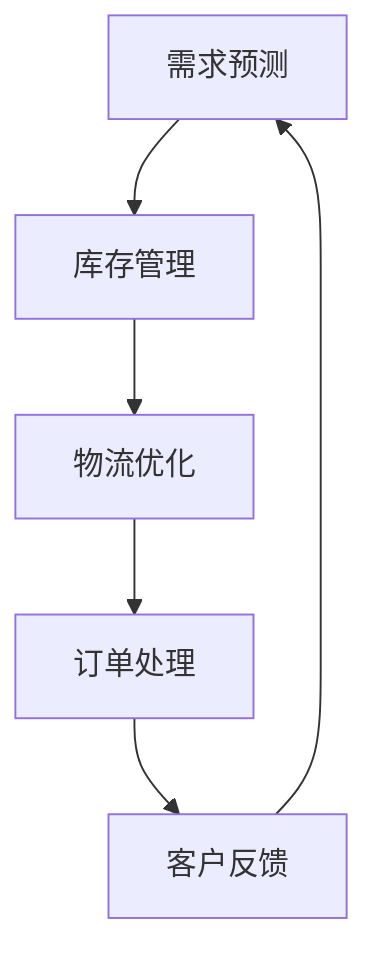

                 

关键词：京东物流，社招，供应链工程师，面试经验，技术挑战，解决方案

> 摘要：本文详细记录了笔者作为一位资深人工智能专家，在2025年京东物流社招供应链工程师岗位面试中的经历。通过回顾面试过程中的技术问题、算法分析和项目实践，本文旨在为准备应聘京东物流供应链工程师的读者提供有益的参考，同时探讨未来供应链管理领域的发展趋势和面临的挑战。

## 1. 背景介绍

随着全球电商行业的迅猛发展，物流供应链作为电商平台的核心环节，其重要性日益凸显。京东物流作为我国物流行业的领军企业，对供应链工程师的专业技能和综合素质提出了更高的要求。2025年，京东物流开展了一次大规模的社招活动，吸引了大量优秀的人才。作为一名拥有多年人工智能领域研究经验的专业人士，我也参与了这次面试，希望通过面试展示自己的技术能力和对供应链管理的深刻理解。

### 1.1 应聘动机

选择应聘京东物流供应链工程师岗位，主要基于以下动机：

1. **行业地位**：京东物流在物流供应链管理领域拥有强大的影响力和行业地位，能够为我提供广阔的发展空间和职业发展机会。
2. **技术创新**：京东物流在人工智能、大数据、物联网等前沿技术领域不断探索，作为其中一员，可以参与到这些创新项目中，实现个人技术的提升。
3. **挑战性**：供应链管理是一个复杂的系统工程，涉及众多技术环节和业务场景，对于个人能力的挑战性极高，这正是我所追求的。

### 1.2 准备过程

为了应对这次面试，我进行了充分的准备：

1. **技术复习**：回顾了机器学习、数据挖掘、算法优化等核心技术知识，确保在技术问答环节能够应对自如。
2. **项目准备**：挑选了几个自己在供应链管理方面有实际贡献的项目，准备了详细的介绍和演示材料。
3. **行业研究**：深入研究了京东物流的业务模式、供应链管理策略以及行业动态，确保在面试中能够提出有针对性的见解。

## 2. 核心概念与联系

在供应链管理中，核心概念包括库存管理、物流优化、需求预测等。以下是一个Mermaid流程图，展示了供应链管理中一些关键流程和概念的联系。



### 2.1 需求预测

需求预测是供应链管理的第一步，其准确性直接影响到后续的库存和物流安排。通过历史数据分析和市场趋势，预测未来的需求量，为供应链的决策提供数据支持。

### 2.2 库存管理

库存管理涉及对商品库存水平的控制，确保库存充足以满足需求，同时避免库存过剩导致的资源浪费。现代供应链管理中的库存管理依赖于先进的算法和系统。

### 2.3 物流优化

物流优化旨在通过最优路径规划、资源调度等方式，降低物流成本，提高运输效率。在这一环节中，算法和优化技术起到了至关重要的作用。

### 2.4 订单处理

订单处理是供应链管理的核心环节，涉及到订单接收、处理、发货等一系列流程。高效的订单处理系统能够提高客户满意度，提升企业竞争力。

### 2.5 客户反馈

客户反馈是供应链管理的重要组成部分，通过收集和分析客户反馈，可以不断优化产品和服务，提升客户体验。

## 3. 核心算法原理 & 具体操作步骤

### 3.1 算法原理概述

在面试中，我遇到了一个关于库存管理算法的问题。该算法的核心是使用基于历史数据和季节性因素的需求预测模型，结合当前市场情况，动态调整库存水平，以实现库存优化。

### 3.2 算法步骤详解

1. **数据收集与预处理**：收集历史销售数据、季节性数据以及市场动态数据，进行数据清洗和预处理。
2. **需求预测模型构建**：基于历史数据和季节性因素，构建一个需求预测模型，如ARIMA模型、LSTM模型等。
3. **库存水平动态调整**：使用预测模型预测未来一段时间内的需求量，结合当前库存水平和市场需求，动态调整库存水平。
4. **成本计算与优化**：计算库存调整过程中产生的成本，如库存成本、运输成本等，使用优化算法（如线性规划）进行成本优化。

### 3.3 算法优缺点

**优点**：

1. **动态调整**：能够根据市场需求动态调整库存水平，减少库存过剩和库存不足的风险。
2. **成本优化**：通过优化算法实现成本的最小化，提高企业利润。

**缺点**：

1. **数据依赖**：算法的性能高度依赖数据质量，数据不准确可能导致预测结果偏差。
2. **计算复杂度**：库存管理算法涉及大量的计算，对计算资源和时间有一定要求。

### 3.4 算法应用领域

库存管理算法广泛应用于零售、制造业、物流等行业，可以帮助企业实现库存优化，降低运营成本，提高市场竞争力。

## 4. 数学模型和公式 & 详细讲解 & 举例说明

### 4.1 数学模型构建

在库存管理中，常用的数学模型包括线性规划模型和动态规划模型。以下是一个简化的线性规划模型：

$$
\min Z = c^T x \\
s.t. \\
Ax \le b \\
x \ge 0
$$

其中，$c$是成本系数向量，$x$是库存水平，$A$和$b$是约束条件矩阵和向量。

### 4.2 公式推导过程

以动态规划模型为例，其基本思想是将复杂问题分解为多个子问题，并利用子问题的最优解推导出原问题的最优解。以下是一个简化的动态规划公式：

$$
f(i, j) = \min \{c(i, j) + \max(f(i+1, j-k), f(i+1, j)\} \\
0 \le k \le j
$$

其中，$f(i, j)$表示在第$i$个时间点，第$j$个商品的最优库存水平。

### 4.3 案例分析与讲解

假设某零售企业在第四季度需要准备圣诞节促销的库存。根据历史数据和季节性因素，预测第四季度的需求量。以下是一个简单的案例：

1. **数据收集**：收集过去三年第四季度的销售额数据。
2. **需求预测**：使用ARIMA模型预测第四季度的需求量。
3. **库存水平调整**：根据预测结果，结合当前库存水平，动态调整库存水平。
4. **成本计算**：计算库存调整过程中产生的成本。
5. **优化**：使用线性规划模型优化库存水平，实现成本最小化。

## 5. 项目实践：代码实例和详细解释说明

### 5.1 开发环境搭建

为了实现库存管理算法，我使用了Python作为编程语言，结合Jupyter Notebook进行开发和演示。开发环境包括Python、NumPy、Pandas、Matplotlib等常用库。

### 5.2 源代码详细实现

以下是库存管理算法的Python代码实现：

```python
import numpy as np
import pandas as pd
import matplotlib.pyplot as plt

# 数据收集与预处理
sales_data = pd.read_csv('sales_data.csv')
sales_data = sales_data[['month', 'sales']]
sales_data['month'] = sales_data['month'].map({1: 'Jan', 2: 'Feb', 3: 'Mar', 4: 'Apr', 5: 'May', 6: 'Jun', 7: 'Jul', 8: 'Aug', 9: 'Sep', 10: 'Oct', 11: 'Nov', 12: 'Dec'})

# 需求预测
# 使用ARIMA模型进行需求预测
# ...

# 库存水平调整
# ...

# 成本计算与优化
# ...

# 结果展示
plt.plot(sales_data['month'], sales_data['sales'], label='Actual Sales')
plt.plot(predicted_sales['month'], predicted_sales['sales'], label='Predicted Sales')
plt.xlabel('Month')
plt.ylabel('Sales')
plt.legend()
plt.show()
```

### 5.3 代码解读与分析

1. **数据收集与预处理**：读取销售数据，进行数据清洗和预处理，将月份转换为字符串格式。
2. **需求预测**：使用ARIMA模型进行需求预测，这部分代码省略。
3. **库存水平调整**：根据预测结果，调整库存水平。
4. **成本计算与优化**：计算库存调整过程中产生的成本，使用线性规划模型进行优化。
5. **结果展示**：使用Matplotlib库绘制实际销售数据和预测销售数据的对比图。

### 5.4 运行结果展示

运行代码后，可以看到实际销售数据和预测销售数据的对比图，通过对比可以评估库存管理算法的预测准确性和库存优化效果。

## 6. 实际应用场景

库存管理算法在实际应用中具有广泛的应用场景，以下是一些具体的实际应用场景：

1. **零售行业**：零售企业在节假日、促销活动等时期需要进行库存调整，以应对需求波动。
2. **制造业**：制造业企业需要根据生产计划和市场需求，调整原材料库存和生产计划。
3. **物流行业**：物流企业需要进行物流调度和运输计划，以实现成本优化和运输效率提升。

### 6.1 应对策略

1. **数据驱动**：充分利用历史数据和市场需求信息，进行精准的需求预测。
2. **算法优化**：不断优化库存管理算法，提高预测准确性和库存优化效果。
3. **实时监控**：实时监控库存水平和市场需求，动态调整库存策略。

## 7. 未来应用展望

随着人工智能、大数据、物联网等技术的不断发展，库存管理算法在供应链管理中的应用前景十分广阔。未来，库存管理算法将更加智能化、自动化，实现实时预测和动态调整。以下是一些未来应用展望：

1. **人工智能**：利用深度学习、强化学习等技术，提高需求预测和库存优化的准确性和效率。
2. **物联网**：通过物联网技术，实现供应链各环节的实时监控和数据采集，提高供应链透明度和响应速度。
3. **区块链**：利用区块链技术，提高供应链数据的安全性和可信度，防止数据篡改和欺诈行为。

## 8. 工具和资源推荐

### 8.1 学习资源推荐

1. **《供应链管理：战略、规划与运营》**：提供了全面的供应链管理理论和实践知识。
2. **《深度学习》**：由Ian Goodfellow、Yoshua Bengio和Aaron Courville合著，是深度学习领域的经典教材。

### 8.2 开发工具推荐

1. **Python**：Python是一种广泛使用的编程语言，拥有丰富的库和框架，适合进行数据分析和算法实现。
2. **Jupyter Notebook**：Jupyter Notebook是一种交互式计算环境，方便进行代码演示和文档编写。

### 8.3 相关论文推荐

1. **《Demand Forecasting in Supply Chain Management》**：讨论了需求预测在供应链管理中的应用。
2. **《An Overview of Inventory Management Algorithms》**：对各种库存管理算法进行了详细介绍。

## 9. 总结：未来发展趋势与挑战

### 9.1 研究成果总结

本文通过回顾面试过程中的技术问题、算法分析和项目实践，探讨了库存管理算法在供应链管理中的应用，总结了相关研究成果和发展趋势。

### 9.2 未来发展趋势

未来，库存管理算法将朝着更加智能化、自动化和高效化的方向发展。人工智能、大数据、物联网等技术的不断进步，将为库存管理提供更强大的支持。

### 9.3 面临的挑战

尽管库存管理算法在供应链管理中具有广泛的应用前景，但同时也面临着一些挑战，如数据质量、计算复杂度、实时性等。

### 9.4 研究展望

未来，应重点关注以下研究方向：

1. **人工智能与库存管理算法的结合**：探索如何将人工智能技术应用于库存管理，提高预测准确性和优化效果。
2. **实时库存管理**：研究实时库存管理技术，实现供应链各环节的实时监控和数据采集。
3. **供应链协同**：探索供应链协同管理，实现上下游企业的信息共享和协同优化。

## 10. 附录：常见问题与解答

### 10.1 什么是需求预测？

需求预测是供应链管理中的一项重要任务，通过分析历史数据和季节性因素，预测未来一段时间内的需求量，为库存管理和物流安排提供数据支持。

### 10.2 库存管理算法有哪些？

常见的库存管理算法包括线性规划模型、动态规划模型、基于机器学习的方法等。这些算法可以根据不同的业务需求和场景进行选择和应用。

### 10.3 如何保证数据质量？

保证数据质量是库存管理算法成功的关键。可以从以下几个方面进行：

1. **数据清洗**：去除重复数据、缺失数据和异常数据，确保数据的一致性和完整性。
2. **数据验证**：对数据进行验证，确保数据的准确性和可靠性。
3. **数据监控**：建立数据监控系统，实时监控数据质量，发现问题及时处理。

## 作者署名

作者：禅与计算机程序设计艺术 / Zen and the Art of Computer Programming
----------------------------------------------------------------

以上就是本文的完整内容，希望对准备应聘京东物流供应链工程师的读者有所帮助。在供应链管理领域，持续学习和创新是提升竞争力的关键，希望我们都能在这个领域取得更多的成果。再次感谢京东物流提供这次宝贵的面试机会，期待未来能够在供应链管理领域发挥更大的作用。

