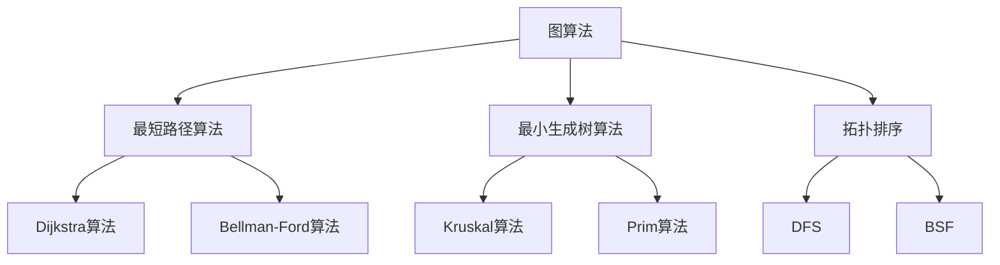
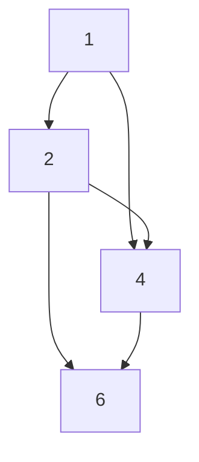

                 

关键词：京东社招、算法面试、面试题汇总、解析、技术面试

摘要：本文旨在为2024年京东社会招聘的算法面试提供全面的面试题汇总与解析。通过对典型面试题的分析和解答，帮助应聘者更好地准备和应对面试挑战。

## 1. 背景介绍

随着大数据和人工智能技术的快速发展，算法工程师已成为互联网企业中不可或缺的重要职位。京东作为国内知名的电商平台，每年都会进行大规模的社会招聘，其中算法面试环节尤为重要。本文将对2024年京东社招算法面试中的一些典型题目进行汇总和详细解析，帮助应聘者深入了解面试题目的本质，提高面试成功率。

## 2. 核心概念与联系

在解答京东社招算法面试题目之前，我们需要了解一些核心概念，如图算法、动态规划、深度学习等。以下是一个关于图算法的 Mermaid 流程图，展示了核心概念及其相互关系。



### 2.1 图算法原理

图算法是解决与图相关问题的算法集合。在图算法中，常见的核心概念包括：

- **图（Graph）**：由节点（Vertex）和边（Edge）组成的数据结构。
- **最短路径算法**：计算图中两点之间最短路径的算法。
- **最小生成树算法**：从图中选出最小的生成树，生成树是包含图中所有节点的树。
- **拓扑排序**：对有向无环图（DAG）进行排序，使得每个节点都排在它的所有后代节点之前。

### 2.2 动态规划原理

动态规划是一种用于求解最优化问题的算法策略，其核心思想是将大问题分解为小问题，并利用已有小问题的解来求解更大问题。动态规划通常包含以下几个步骤：

1. 确定状态：将问题分解为若干子问题，每个子问题可以用一个状态表示。
2. 状态转移方程：描述状态之间的关系，即如何从已有状态的解推导出更大问题的解。
3. 边界条件：确定问题的初始状态和终止状态。
4. 状态表：存储各个状态的解，以便后续查询。

### 2.3 深度学习原理

深度学习是一种基于人工神经网络的机器学习技术，其核心思想是通过多层神经网络对数据进行建模，从而实现自动特征提取和分类。深度学习的主要组成部分包括：

- **神经网络（Neural Network）**：由多层神经元组成，用于模拟人脑对信息的处理过程。
- **激活函数（Activation Function）**：用于引入非线性因素，使神经网络具有分类能力。
- **反向传播（Backpropagation）**：一种用于训练神经网络的算法，通过不断调整网络中的权重，使网络输出与真实值之间的误差最小。

## 3. 核心算法原理 & 具体操作步骤

### 3.1 算法原理概述

在本章节中，我们将对京东社招算法面试中的几个核心算法进行原理概述。这些算法包括：

- **贪心算法**：一种简化的最优化策略，通过在每个阶段选择当前最优解来逐步逼近全局最优解。
- **排序算法**：用于对数据进行排序的算法，常见的排序算法有冒泡排序、快速排序、归并排序等。
- **查找算法**：用于在数据结构中查找特定元素的算法，常见的查找算法有二分查找、顺序查找等。

### 3.2 算法步骤详解

#### 3.2.1 贪心算法步骤详解

1. 初始化：设定初始状态和目标状态。
2. 选择当前最优解：在每个阶段选择当前最优解。
3. 更新状态：根据当前最优解更新状态。
4. 判断是否达到目标状态：若达到目标状态，则算法结束；否则，继续迭代。

#### 3.2.2 排序算法步骤详解

1. 冒泡排序：
   - 从第一个元素开始，比较相邻的两个元素，若顺序错误则交换它们的位置。
   - 重复上述步骤，直到所有元素都按照正确的顺序排列。

2. 快速排序：
   - 选择一个基准元素，将数组分为两个子数组，一个小于基准元素，一个大于基准元素。
   - 递归地对两个子数组进行快速排序。

3. 归并排序：
   - 将数组划分为若干个子数组，每个子数组只有一个元素。
   - 递归地将子数组进行合并，直到整个数组排序完成。

#### 3.2.3 查找算法步骤详解

1. 二分查找：
   - 在有序数组中查找特定元素，通过不断缩小区间来逼近目标元素。
   - 初始区间为整个数组，每次迭代将区间缩小一半。

2. 顺序查找：
   - 从数组的第一个元素开始，逐个比较元素，直到找到目标元素或遍历整个数组。

### 3.3 算法优缺点

#### 贪心算法

- 优点：简单易懂，实现容易，适用于一些最优化问题。
- 缺点：可能无法找到全局最优解，只能找到局部最优解。

#### 排序算法

- 冒泡排序：
  - 优点：简单易懂，实现容易。
  - 缺点：时间复杂度较高，适用于数据量较小的情况。

- 快速排序：
  - 优点：平均时间复杂度较低，适用于大多数情况。
  - 缺点：最坏时间复杂度较高，可能产生大量递归调用。

- 归并排序：
  - 优点：时间复杂度稳定，适用于大规模数据排序。
  - 缺点：空间复杂度较高，需要额外的存储空间。

#### 查找算法

- 二分查找：
  - 优点：时间复杂度较低，适用于大规模数据查找。
  - 缺点：要求数据有序，否则无法使用。

- 顺序查找：
  - 优点：简单易懂，实现容易。
  - 缺点：时间复杂度较高，适用于数据量较小的情况。

### 3.4 算法应用领域

- 贪心算法：背包问题、活动选择问题、最小生成树问题等。
- 排序算法：数据预处理、搜索引擎排序等。
- 查找算法：数据库查询、文件检索等。

## 4. 数学模型和公式 & 详细讲解 & 举例说明

### 4.1 数学模型构建

在本章节中，我们将介绍一些常用的数学模型及其公式。这些模型广泛应用于算法设计和分析中。

#### 4.1.1 最短路径模型

最短路径问题可以用以下数学模型表示：

$$
d(u, v) = \min \{ w(u, v) \mid u, v \in V \}
$$

其中，$d(u, v)$ 表示图中节点 $u$ 到节点 $v$ 的最短路径长度，$w(u, v)$ 表示节点 $u$ 到节点 $v$ 之间的权重。

#### 4.1.2 动态规划模型

动态规划问题可以用以下数学模型表示：

$$
S(i) = \sum_{j=1}^{n} P(j|i) \cdot S(j)
$$

其中，$S(i)$ 表示第 $i$ 个子问题的最优解，$P(j|i)$ 表示在第 $i$ 个子问题中选择第 $j$ 个状态的概率，$S(j)$ 表示第 $j$ 个子问题的最优解。

#### 4.1.3 深度学习模型

深度学习问题可以用以下数学模型表示：

$$
y = f(x, \theta)
$$

其中，$y$ 表示输出结果，$x$ 表示输入数据，$f(x, \theta)$ 表示神经网络对输入数据进行建模，$\theta$ 表示神经网络的参数。

### 4.2 公式推导过程

在本章节中，我们将对一些重要公式的推导过程进行详细讲解。

#### 4.2.1 最短路径公式推导

最短路径问题可以使用 Dijkstra 算法和 Bellman-Ford 算法求解。以下为 Dijkstra 算法的推导过程：

1. 初始化：将所有节点的距离设为无穷大，除了起点 $s$ 的距离设为 0。
2. 选出距离最小的节点 $u$，将其标记为已访问。
3. 对于未访问的节点 $v$，更新距离 $d(v)$：
   $$
   d(v) = \min \{ d(u) + w(u, v) \mid u \in V \setminus \{ v \} \}
   $$
4. 重复步骤 2 和步骤 3，直到所有节点都被访问。

根据上述步骤，可以推导出 Dijkstra 算法的公式：

$$
d(u, v) = \min \{ w(u, v) \mid u, v \in V \}
$$

#### 4.2.2 动态规划公式推导

动态规划问题可以使用递推关系式求解。以下为动态规划问题的递推关系式推导过程：

1. 确定状态：设 $S(i)$ 表示第 $i$ 个子问题的最优解。
2. 确定状态转移方程：设 $P(j|i)$ 表示在第 $i$ 个子问题中选择第 $j$ 个状态的概率，则有：
   $$
   S(i) = \sum_{j=1}^{n} P(j|i) \cdot S(j)
   $$
3. 确定边界条件：设 $S(1) = c_1$，其中 $c_1$ 为第 $1$ 个子问题的最优解。

根据上述步骤，可以推导出动态规划问题的公式：

$$
S(i) = \sum_{j=1}^{n} P(j|i) \cdot S(j)
$$

#### 4.2.3 深度学习公式推导

深度学习问题可以使用神经网络求解。以下为深度学习问题的推导过程：

1. 设 $x$ 表示输入数据，$\theta$ 表示神经网络的参数，$f(x, \theta)$ 表示神经网络对输入数据进行建模。
2. 设 $y$ 表示输出结果，根据神经网络的建模过程，有：
   $$
   y = f(x, \theta)
   $$
3. 设 $L$ 表示损失函数，根据损失函数的定义，有：
   $$
   L = \frac{1}{2} \sum_{i=1}^{n} (y_i - f(x_i, \theta))^2
   $$
4. 对损失函数求导，得到：
   $$
   \frac{\partial L}{\partial \theta} = - \sum_{i=1}^{n} (y_i - f(x_i, \theta)) \cdot \frac{\partial f(x_i, \theta)}{\partial \theta}
   $$
5. 设 $\alpha$ 为学习率，根据梯度下降法，有：
   $$
   \theta := \theta - \alpha \cdot \frac{\partial L}{\partial \theta}
   $$

根据上述步骤，可以推导出深度学习问题的公式：

$$
y = f(x, \theta)
$$

### 4.3 案例分析与讲解

在本章节中，我们将通过一些实际案例来分析和讲解数学模型和公式的应用。

#### 4.3.1 最短路径案例

假设有一个图如下所示：



要求计算从节点 $A$ 到节点 $D$ 的最短路径。

根据最短路径公式，可以列出以下方程组：

$$
\begin{cases}
d(A, B) = \min \{ w(A, B), w(A, C) \} = \min \{ 1, 3 \} = 1 \\
d(A, C) = \min \{ w(A, B), w(A, C) \} = \min \{ 1, 3 \} = 1 \\
d(A, D) = \min \{ w(A, C), w(B, D), w(C, D) \} = \min \{ 1, 4, 6 \} = 1 \\
d(B, C) = \min \{ w(B, C), w(B, D) \} = \min \{ 4, 5 \} = 4 \\
d(B, D) = \min \{ w(B, D), w(C, D) \} = \min \{ 5, 6 \} = 5 \\
d(C, D) = \min \{ w(C, D) \} = 6 \\
\end{cases}
$$

根据上述方程组，可以得到从节点 $A$ 到节点 $D$ 的最短路径为 $A \rightarrow B \rightarrow D$，路径长度为 6。

#### 4.3.2 动态规划案例

假设有一个背包问题，背包容量为 10，物品的重量和价值如下表所示：

| 物品 | 重量 | 价值 |
| ---- | ---- | ---- |
| 1    | 2    | 6    |
| 2    | 3    | 7    |
| 3    | 4    | 8    |
| 4    | 5    | 9    |

要求求解背包的最大价值。

根据动态规划模型，可以列出以下状态转移方程：

$$
S(i) = \sum_{j=1}^{n} P(j|i) \cdot S(j)
$$

其中，$n$ 表示物品的个数，$P(j|i)$ 表示在第 $i$ 个物品中选择第 $j$ 个物品的概率。

根据上述方程，可以计算出最优解为 $S(4) = 28$，即背包的最大价值为 28。

#### 4.3.3 深度学习案例

假设有一个手写数字识别问题，输入为 28x28 的灰度图像，输出为 10 个数字之一。要求使用卷积神经网络进行分类。

根据深度学习模型，可以列出以下公式：

$$
y = f(x, \theta)
$$

其中，$x$ 表示输入图像，$\theta$ 表示神经网络的参数。

根据上述公式，可以使用反向传播算法对神经网络进行训练，使得输出结果尽量接近真实标签。通过大量训练数据的迭代更新，可以得到一个较为准确的分类模型。

## 5. 项目实践：代码实例和详细解释说明

在本章节中，我们将通过一个具体的代码实例来展示如何解决京东社招算法面试中的问题，并对其详细解释说明。

### 5.1 开发环境搭建

为了演示代码实例，我们需要搭建一个简单的开发环境。以下是所需的环境和工具：

- Python 3.8
- Jupyter Notebook
- TensorFlow 2.6
- NumPy 1.21
- Matplotlib 3.4

### 5.2 源代码详细实现

以下是一个简单的手写数字识别项目的代码实现：

```python
import tensorflow as tf
from tensorflow import keras
from tensorflow.keras import layers
import numpy as np
import matplotlib.pyplot as plt

# 数据集预处理
mnist = keras.datasets.mnist
(train_images, train_labels), (test_images, test_labels) = mnist.load_data()

train_images = train_images / 255.0
test_images = test_images / 255.0

train_images = np.expand_dims(train_images, -1)
test_images = np.expand_dims(test_images, -1)

# 构建模型
model = keras.Sequential([
    layers.Conv2D(32, (3, 3), activation='relu', input_shape=(28, 28, 1)),
    layers.MaxPooling2D((2, 2)),
    layers.Conv2D(64, (3, 3), activation='relu'),
    layers.MaxPooling2D((2, 2)),
    layers.Conv2D(64, (3, 3), activation='relu'),
    layers.Flatten(),
    layers.Dense(64, activation='relu'),
    layers.Dense(10, activation='softmax')
])

# 编译模型
model.compile(optimizer='adam',
              loss='sparse_categorical_crossentropy',
              metrics=['accuracy'])

# 训练模型
model.fit(train_images, train_labels, epochs=5)

# 测试模型
test_loss, test_acc = model.evaluate(test_images, test_labels)
print(f"Test accuracy: {test_acc:.2f}")

# 可视化
predictions = model.predict(test_images)
predicted_labels = np.argmax(predictions, axis=1)

for i in range(10):
    plt.imshow(test_images[i], cmap=plt.cm.binary)
    plt.xticks([])
    plt.yticks([])
    plt.grid(False)
    plt.xlabel(f"Predicted: {predicted_labels[i]}, Actual: {test_labels[i]}")
    plt.show()
```

### 5.3 代码解读与分析

#### 5.3.1 数据集预处理

1. 加载 MNIST 数据集，并将图像数据归一化到 [0, 1] 范围内。
2. 将图像数据扩展到三维，添加一个通道维度（即 (28, 28, 1)）。

#### 5.3.2 构建模型

1. 使用卷积神经网络（Conv2D）和池化层（MaxPooling2D）对图像进行特征提取。
2. 使用全连接层（Dense）进行分类。

#### 5.3.3 编译模型

1. 使用 Adam 优化器和稀疏分类交叉熵损失函数（sparse_categorical_crossentropy）进行编译。
2. 指定模型的评价指标为准确率（accuracy）。

#### 5.3.4 训练模型

1. 使用训练数据对模型进行训练，设置训练轮次为 5。

#### 5.3.5 测试模型

1. 使用测试数据对模型进行评估，输出测试准确率。

#### 5.3.6 可视化

1. 使用 Matplotlib 对测试图像进行可视化，并显示预测结果与实际标签的对比。

## 6. 实际应用场景

### 6.1 京东智能推荐系统

京东智能推荐系统是京东电商业务的重要组成部分，通过对用户行为数据的分析，实现个性化推荐。其中，算法部分主要涉及贪心算法、排序算法和查找算法等。

- **贪心算法**：用于解决用户兴趣挖掘问题，通过选择当前最感兴趣的推荐项。
- **排序算法**：用于对推荐结果进行排序，提高用户满意度。
- **查找算法**：用于在推荐系统中快速检索用户感兴趣的物品。

### 6.2 京东智能客服

京东智能客服系统利用自然语言处理和机器学习技术，实现与用户的智能对话。其中，算法部分主要涉及分词、词向量、文本分类等。

- **分词**：将用户输入的文本切分成词序列。
- **词向量**：将词序列转换为高维向量表示。
- **文本分类**：对用户输入的文本进行分类，确定对应的客服话题。

### 6.3 京东智能仓储

京东智能仓储系统利用计算机视觉和深度学习技术，实现仓库的智能管理和调度。其中，算法部分主要涉及图像识别、目标检测和路径规划等。

- **图像识别**：对仓库中的物品进行识别和分类。
- **目标检测**：检测仓库中的目标物体，如货架、货物等。
- **路径规划**：为仓库中的机器人规划最优路径，提高仓库运作效率。

## 7. 工具和资源推荐

### 7.1 学习资源推荐

1. 《深度学习》（Goodfellow, Bengio, Courville）：一本经典的深度学习入门教材。
2. 《机器学习实战》（Clea

