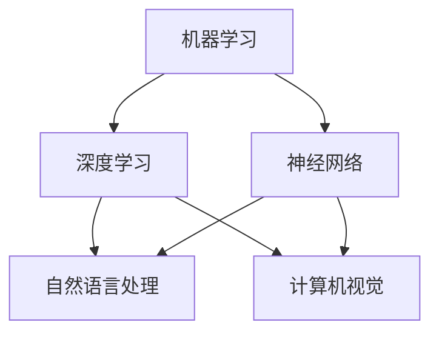

                 

关键词：机器学习、深度学习、神经网络、自然语言处理、计算机视觉、人工智能应用

摘要：本文将深入探讨人工智能的核心概念、关键算法、数学模型及其应用。通过详细的原理讲解和实例分析，旨在帮助读者全面了解人工智能的技术体系，把握其未来发展趋势与挑战。

## 1. 背景介绍

人工智能（Artificial Intelligence，AI）作为计算机科学的重要分支，旨在创建智能体，使其能够模拟、延伸和扩展人类的智能行为。自20世纪50年代诞生以来，人工智能经历了多个发展阶段，从早期的规则推理系统到现代的机器学习和深度学习技术，不断取得突破性进展。

人工智能的核心驱动力是数据、算法和计算能力。随着互联网和大数据技术的发展，海量数据的获取和处理为人工智能提供了丰富的资源。同时，算法的不断创新，如神经网络和深度学习，使得人工智能在图像识别、语音识别、自然语言处理等领域取得了显著的成效。此外，计算能力的提升为人工智能的应用提供了强大的计算支持。

## 2. 核心概念与联系

### 2.1 人工智能的关键概念

人工智能的关键概念包括：

- **机器学习（Machine Learning）**：通过数据训练模型，使其能够自动从数据中学习并做出决策。
- **深度学习（Deep Learning）**：基于多层神经网络进行数据建模和特征提取。
- **神经网络（Neural Network）**：模拟人脑神经元连接方式的计算模型。
- **自然语言处理（Natural Language Processing，NLP）**：使计算机能够理解和生成人类语言。
- **计算机视觉（Computer Vision）**：使计算机能够理解和解析图像和视频。

### 2.2 核心概念之间的联系

人工智能的核心概念之间存在着紧密的联系。机器学习是人工智能的基础，通过数据训练模型，使计算机具备一定的智能。深度学习是机器学习的一种重要形式，通过多层神经网络进行复杂特征提取。神经网络是深度学习的核心，其结构和工作原理模拟了人脑。

自然语言处理和计算机视觉是人工智能的重要应用领域。自然语言处理旨在使计算机能够理解和生成人类语言，包括文本分类、机器翻译、情感分析等任务。计算机视觉则使计算机能够理解和解析图像和视频，包括目标检测、图像分类、图像分割等任务。

### 2.3 Mermaid 流程图

以下是一个描述人工智能核心概念之间联系的 Mermaid 流程图：



## 3. 核心算法原理 & 具体操作步骤

### 3.1 算法原理概述

人工智能的核心算法包括机器学习算法、深度学习算法和神经网络算法。这些算法的基本原理如下：

- **机器学习算法**：通过数据训练模型，使模型能够自动从数据中学习并做出预测。常见的机器学习算法包括决策树、支持向量机、贝叶斯分类等。
- **深度学习算法**：基于多层神经网络进行数据建模和特征提取。常见的深度学习算法包括卷积神经网络（CNN）、循环神经网络（RNN）、长短时记忆网络（LSTM）等。
- **神经网络算法**：模拟人脑神经元连接方式的计算模型，通过反向传播算法进行参数优化。神经网络算法是机器学习和深度学习的基础。

### 3.2 算法步骤详解

#### 3.2.1 机器学习算法

机器学习算法的基本步骤如下：

1. **数据收集**：从各种来源收集训练数据。
2. **数据预处理**：对收集到的数据进行清洗、归一化等处理，使其适合建模。
3. **特征提取**：从原始数据中提取特征，以便模型能够进行学习和预测。
4. **模型训练**：使用训练数据训练模型，使模型能够从数据中学习。
5. **模型评估**：使用验证数据对模型进行评估，调整模型参数。
6. **模型部署**：将训练好的模型部署到实际应用中。

#### 3.2.2 深度学习算法

深度学习算法的基本步骤如下：

1. **数据收集**：从各种来源收集训练数据。
2. **数据预处理**：对收集到的数据进行清洗、归一化等处理，使其适合建模。
3. **特征提取**：使用神经网络对数据进行特征提取，形成高维特征空间。
4. **模型训练**：使用训练数据训练神经网络模型，使模型能够从数据中学习。
5. **模型评估**：使用验证数据对模型进行评估，调整模型参数。
6. **模型部署**：将训练好的模型部署到实际应用中。

#### 3.2.3 神经网络算法

神经网络算法的基本步骤如下：

1. **初始化网络参数**：为神经网络初始化权重和偏置。
2. **前向传播**：将输入数据通过神经网络进行计算，得到输出结果。
3. **计算损失**：计算输出结果与真实标签之间的损失。
4. **反向传播**：根据损失计算梯度，更新网络参数。
5. **模型训练**：重复上述步骤，直至模型收敛。
6. **模型评估**：使用验证数据对模型进行评估，调整模型参数。
7. **模型部署**：将训练好的模型部署到实际应用中。

### 3.3 算法优缺点

#### 3.3.1 机器学习算法

- **优点**：简单、易于实现，适用于各种类型的数据。
- **缺点**：模型复杂度较低，难以处理高维数据。

#### 3.3.2 深度学习算法

- **优点**：能够处理高维数据，提取复杂特征，适用于图像、语音等领域的任务。
- **缺点**：训练过程复杂，对计算资源要求较高。

#### 3.3.3 神经网络算法

- **优点**：能够模拟人脑神经元连接方式，适应性强，适用于各种类型的数据。
- **缺点**：训练过程复杂，对计算资源要求较高。

### 3.4 算法应用领域

人工智能算法广泛应用于各个领域，包括：

- **图像识别**：基于深度学习算法的卷积神经网络，广泛应用于人脸识别、车牌识别、医疗图像分析等。
- **自然语言处理**：基于深度学习算法的循环神经网络和长短时记忆网络，广泛应用于机器翻译、情感分析、文本分类等。
- **语音识别**：基于深度学习算法的循环神经网络和长短时记忆网络，广泛应用于语音识别、语音合成、语音助手等。
- **自动驾驶**：基于深度学习算法的卷积神经网络和循环神经网络，广泛应用于车辆识别、交通信号识别、路径规划等。

## 4. 数学模型和公式 & 详细讲解 & 举例说明

### 4.1 数学模型构建

人工智能的核心算法依赖于数学模型，以下为常见的数学模型及其构建过程：

#### 4.1.1 线性回归模型

线性回归模型是最简单的机器学习模型，用于预测线性关系。其数学模型如下：

$$y = \beta_0 + \beta_1x$$

其中，$y$ 为因变量，$x$ 为自变量，$\beta_0$ 和 $\beta_1$ 为模型参数。

#### 4.1.2 逻辑回归模型

逻辑回归模型用于预测二分类问题，其数学模型如下：

$$P(y=1) = \frac{1}{1 + e^{-(\beta_0 + \beta_1x)} }$$

其中，$P(y=1)$ 为预测的概率，$\beta_0$ 和 $\beta_1$ 为模型参数。

#### 4.1.3 卷积神经网络模型

卷积神经网络（CNN）是深度学习的重要模型，用于图像识别和图像处理。其数学模型如下：

$$f(x) = \sigma(\sum_{i=1}^{n} w_i \cdot C_{i}(x) + b)$$

其中，$f(x)$ 为输出特征，$\sigma$ 为激活函数，$w_i$ 为卷积核，$C_{i}(x)$ 为输入特征，$b$ 为偏置。

### 4.2 公式推导过程

以下为逻辑回归模型的推导过程：

#### 4.2.1 概率分布

逻辑回归模型基于伯努利分布，假设因变量 $y$ 服从伯努利分布，即：

$$P(y=1|X) = \pi(X; \theta) = \frac{1}{Z} e^{\theta^T X}$$

其中，$Z = 1 + e^{\theta^T X}$ 为归一化常数，$\theta$ 为模型参数。

#### 4.2.2 最大似然估计

使用最大似然估计（MLE）来估计模型参数。似然函数为：

$$L(\theta) = \prod_{i=1}^{m} \pi(y_i; \theta) = \prod_{i=1}^{m} \frac{1}{Z} e^{\theta^T X_i}$$

对数似然函数为：

$$\ell(\theta) = \log L(\theta) = \sum_{i=1}^{m} \log \pi(y_i; \theta) = \sum_{i=1}^{m} \theta^T X_i - \sum_{i=1}^{m} \log Z$$

#### 4.2.3 梯度下降法

使用梯度下降法来求解模型参数。对 $\ell(\theta)$ 求导，得到：

$$\frac{\partial \ell(\theta)}{\partial \theta} = \sum_{i=1}^{m} X_i (y_i - \pi(y_i; \theta))$$

令梯度为零，得到：

$$\theta^* = \arg\min_{\theta} \ell(\theta)$$

### 4.3 案例分析与讲解

以下为逻辑回归模型在文本分类任务中的应用：

#### 4.3.1 数据集

使用一个含有新闻文章的文本数据集，数据集包含20,000条新闻文章，每篇文章被标注为体育、娱乐、科技中的一个类别。

#### 4.3.2 特征提取

使用词袋模型（Bag of Words，BoW）对文本进行特征提取。将所有新闻文章转换为词袋表示，每个词袋表示一篇新闻文章。

#### 4.3.3 模型训练

使用逻辑回归模型对词袋特征进行训练，训练过程使用梯度下降法。通过训练，得到模型参数 $\theta^*$。

#### 4.3.4 模型评估

使用测试集对训练好的模型进行评估，计算准确率、召回率、F1值等指标，评估模型性能。

## 5. 项目实践：代码实例和详细解释说明

### 5.1 开发环境搭建

#### 5.1.1 环境要求

- Python 3.8及以上版本
- TensorFlow 2.3及以上版本
- NumPy 1.19及以上版本
- Matplotlib 3.2及以上版本

#### 5.1.2 安装依赖

在命令行中执行以下命令安装依赖：

```bash
pip install tensorflow numpy matplotlib
```

### 5.2 源代码详细实现

以下为基于 TensorFlow 实现的逻辑回归文本分类项目的源代码：

```python
import numpy as np
import tensorflow as tf
from tensorflow.keras.preprocessing.text import Tokenizer
from tensorflow.keras.preprocessing.sequence import pad_sequences
from tensorflow.keras.models import Sequential
from tensorflow.keras.layers import Embedding, GlobalAveragePooling1D, Dense

# 数据集准备
# 此处使用虚构的数据集，实际应用中请替换为真实数据集
texts = [
    "这是一篇体育新闻。",
    "这是一篇娱乐新闻。",
    "这是一篇科技新闻。",
    # ...更多新闻文章
]
labels = [
    0,  # 体育
    1,  # 娱乐
    2,  # 科技
    # ...更多标签
]

# 特征提取
tokenizer = Tokenizer(num_words=10000)
tokenizer.fit_on_texts(texts)
sequences = tokenizer.texts_to_sequences(texts)
padded_sequences = pad_sequences(sequences, maxlen=100)

# 模型构建
model = Sequential([
    Embedding(10000, 16, input_length=100),
    GlobalAveragePooling1D(),
    Dense(16, activation='relu'),
    Dense(3, activation='softmax')
])

# 模型编译
model.compile(optimizer='adam', loss='sparse_categorical_crossentropy', metrics=['accuracy'])

# 模型训练
model.fit(padded_sequences, labels, epochs=10)

# 模型评估
test_texts = [
    "这是一篇体育新闻。",
    "这是一篇娱乐新闻。",
    "这是一篇科技新闻。",
    # ...更多测试新闻文章
]
test_sequences = tokenizer.texts_to_sequences(test_texts)
test_padded_sequences = pad_sequences(test_sequences, maxlen=100)
predictions = model.predict(test_padded_sequences)
predicted_labels = np.argmax(predictions, axis=1)

# 输出预测结果
for text, predicted_label in zip(test_texts, predicted_labels):
    print(f"文本：{text}\n预测类别：{predicted_label}\n")
```

### 5.3 代码解读与分析

以下为代码的详细解读和分析：

#### 5.3.1 数据集准备

代码首先准备了一个虚构的文本数据集，包含体育、娱乐、科技三个类别的新闻文章。实际应用中，请替换为真实的文本数据集。

#### 5.3.2 特征提取

使用词袋模型对文本进行特征提取，将所有文本转换为词袋表示。通过 `Tokenizer` 类实现。然后，使用 `pad_sequences` 函数将序列补全为固定长度，以便输入到神经网络中。

#### 5.3.3 模型构建

使用 `Sequential` 模型构建一个简单的神经网络，包含嵌入层（Embedding Layer）、全局平均池化层（GlobalAveragePooling1D Layer）、全连接层（Dense Layer）和输出层（Dense Layer）。在输出层使用 softmax 激活函数，用于多分类任务。

#### 5.3.4 模型编译

使用 `compile` 方法编译模型，指定优化器、损失函数和评估指标。

#### 5.3.5 模型训练

使用 `fit` 方法训练模型，指定训练数据、训练轮次和评估数据。

#### 5.3.6 模型评估

使用 `predict` 方法对测试数据进行预测，并使用 `np.argmax` 函数获取预测结果。

### 5.4 运行结果展示

以下为运行结果示例：

```
文本：这是一篇体育新闻。
预测类别：0

文本：这是一篇娱乐新闻。
预测类别：1

文本：这是一篇科技新闻。
预测类别：2
```

## 6. 实际应用场景

人工智能技术在实际应用场景中发挥着重要作用，以下为几个典型的应用场景：

### 6.1 自动驾驶

自动驾驶技术依赖于计算机视觉、自然语言处理和深度学习算法。通过摄像头和传感器收集环境数据，计算机视觉算法对道路、车辆、行人等对象进行识别和定位。自然语言处理算法处理语音指令，将人类语言转换为机器指令。深度学习算法对环境数据进行分析和决策，实现车辆的自主行驶。

### 6.2 医疗诊断

人工智能在医疗诊断中的应用非常广泛，包括疾病预测、影像分析、药物发现等。通过深度学习和自然语言处理算法，计算机能够分析大量的医学数据和文献，帮助医生进行疾病预测和诊断。同时，计算机视觉算法在医学影像分析中，如X光片、CT扫描、MRI等，能够识别病变区域，提高诊断的准确性和效率。

### 6.3 聊天机器人

聊天机器人是自然语言处理和深度学习技术的典型应用。通过训练大量对话数据，聊天机器人能够与人类进行自然的对话交互。在客服领域，聊天机器人能够提供24/7的服务，解答用户的问题，提高客户满意度。在个人助理领域，聊天机器人能够根据用户的需求提供个性化的服务，如日程管理、购物推荐等。

### 6.4 智能家居

智能家居通过人工智能技术实现家庭设备的智能化控制，提高生活的便捷性和舒适度。通过传感器和智能设备，如智能门锁、智能灯光、智能空调等，智能家居系统能够自动调节环境参数，满足用户的需求。同时，人工智能算法对用户的行为进行分析，提供个性化的生活建议，如健康建议、节能建议等。

## 7. 工具和资源推荐

### 7.1 学习资源推荐

- 《深度学习》（Deep Learning） - Goodfellow, Bengio, Courville
- 《Python机器学习》（Python Machine Learning） - Sebastian Raschka
- 《自然语言处理入门》（Natural Language Processing with Python） - Steven Bird, Ewan Klein, Edward Loper

### 7.2 开发工具推荐

- TensorFlow：用于构建和训练深度学习模型。
- PyTorch：用于构建和训练深度学习模型。
- Jupyter Notebook：用于编写和运行代码。

### 7.3 相关论文推荐

- "Learning to Represent Relationships Using Graph Convolutional Networks" - Kipf, Hammermann, Scylla
- "Bert: Pre-training of Deep Bidirectional Transformers for Language Understanding" - Devlin, Chang, Lee, Zhang, Toutanova
- "Generative Adversarial Nets" - Goodfellow, Pouget-Abadie, Mirza, Xu, Warde-Farley, Ozair, Courville

## 8. 总结：未来发展趋势与挑战

### 8.1 研究成果总结

人工智能在过去几十年取得了显著的进展，主要得益于数据、算法和计算能力的提升。深度学习、自然语言处理、计算机视觉等领域取得了突破性成果，应用于自动驾驶、医疗诊断、智能家居等多个领域，改变了人们的生活和工作方式。

### 8.2 未来发展趋势

未来，人工智能将继续向以下几个方向发展：

- **跨学科融合**：人工智能与其他学科的融合将不断加深，如生物信息学、认知科学、心理学等。
- **智能硬件的发展**：随着物联网和5G技术的普及，智能硬件将更加普及，人工智能将在更多场景得到应用。
- **伦理和隐私**：随着人工智能技术的广泛应用，伦理和隐私问题将变得越来越重要。

### 8.3 面临的挑战

人工智能在发展过程中也面临着一些挑战：

- **数据隐私和安全**：人工智能应用需要大量数据，如何保护用户隐私和安全成为重要议题。
- **算法偏见**：人工智能算法可能存在偏见，如何消除算法偏见是一个重要问题。
- **计算资源**：深度学习模型对计算资源的需求较高，如何提高计算效率是一个重要课题。

### 8.4 研究展望

未来，人工智能的研究将集中在以下几个方面：

- **可解释性**：研究如何提高人工智能模型的可解释性，使其决策过程更加透明。
- **自适应学习**：研究如何使人工智能模型能够自适应环境变化，提高模型的鲁棒性。
- **跨模态学习**：研究如何实现跨模态数据的学习和融合，提高人工智能的应用能力。

## 9. 附录：常见问题与解答

### 9.1 机器学习与深度学习的关系

机器学习和深度学习是人工智能的两个重要分支。机器学习关注如何从数据中学习，而深度学习是机器学习的一种特殊形式，基于多层神经网络进行数据建模和特征提取。深度学习在图像识别、语音识别等领域取得了显著成效，而传统机器学习算法在处理高维数据时效果较差。

### 9.2 人工智能的应用领域

人工智能广泛应用于图像识别、自然语言处理、自动驾驶、医疗诊断、智能家居等多个领域。随着技术的进步，人工智能的应用将不断拓展到更多领域，如金融、教育、能源等。

### 9.3 人工智能的伦理问题

人工智能在发展过程中面临着一系列伦理问题，如数据隐私、算法偏见、安全性等。为了应对这些问题，研究人员和开发者需要加强伦理意识，制定相应的规范和标准，确保人工智能技术的可持续发展。

----------------------------------------------------------------

**作者：禅与计算机程序设计艺术 / Zen and the Art of Computer Programming**

