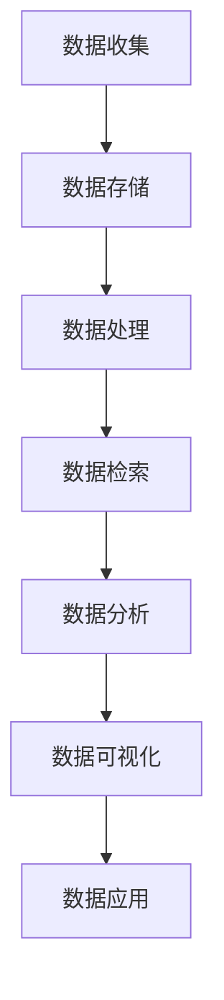
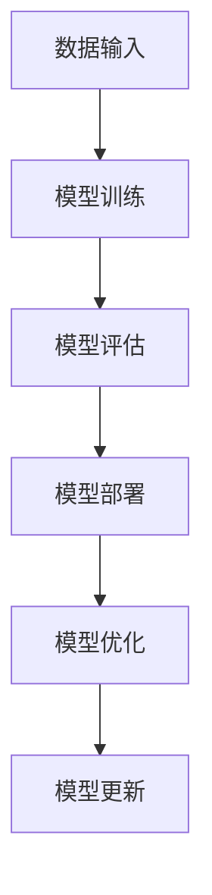
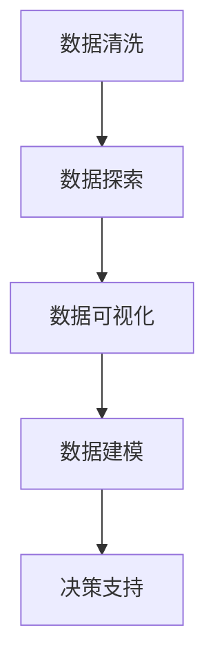
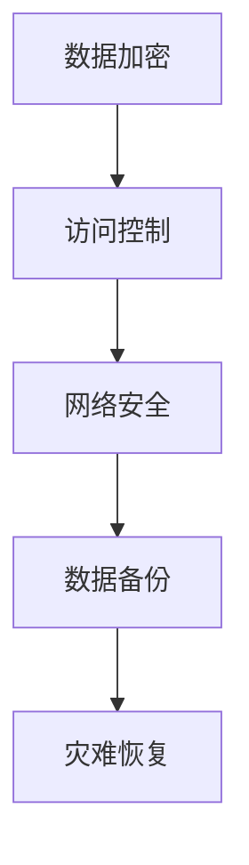

                 

关键词：人工智能，数据管理，创新方法，大数据，机器学习，数据分析

> 摘要：随着人工智能技术的快速发展，创业公司面临着如何高效管理大量数据，以实现商业价值的挑战。本文将探讨人工智能创业数据管理的创新方法，包括大数据处理、机器学习、数据分析和数据安全等方面的实践与策略。

## 1. 背景介绍

人工智能（AI）作为当今科技领域的热点，已经深刻影响了各个行业。越来越多的创业公司希望通过人工智能技术实现商业突破。然而，人工智能的发展离不开大量的数据支持，如何高效地收集、存储、处理和分析这些数据，成为创业公司面临的重要挑战。

### 1.1 人工智能与数据管理的关系

人工智能的发展依赖于数据，数据的质量和数量直接影响到AI算法的性能。对于创业公司而言，如何有效地利用有限的数据资源，挖掘数据价值，是决定其成功与否的关键因素。

### 1.2 创业公司的数据管理挑战

创业公司通常在数据管理方面面临以下挑战：

- **数据量级大**：随着用户数量的增加，数据量级快速增长，对数据处理能力提出更高要求。
- **数据多样性**：数据类型多样，包括结构化数据、半结构化数据和非结构化数据，需要不同的处理方法。
- **数据真实性**：获取真实、准确的数据对于训练高质量的AI模型至关重要。
- **数据隐私**：数据隐私和安全是创业公司必须重视的问题，尤其涉及用户数据时。

### 1.3 创新方法的重要性

为了应对上述挑战，创业公司需要采取创新的数据管理方法。这不仅可以提高数据处理效率，还能增强数据分析和AI应用的可靠性。本文将探讨以下创新方法：

- **大数据处理**：如何高效处理海量数据，并确保数据的一致性和完整性。
- **机器学习**：如何利用机器学习技术提高数据分析的效率和准确性。
- **数据分析**：如何通过数据分析发现有价值的信息，为业务决策提供支持。
- **数据安全**：如何确保数据的安全和隐私，防范数据泄露和滥用。

## 2. 核心概念与联系

### 2.1 大数据处理

大数据处理是指对大规模数据进行存储、检索、分析和管理的技术和方法的集合。它涵盖了从数据收集、存储到处理的整个流程。



### 2.2 机器学习

机器学习是一种通过数据驱动的方式使计算机系统自动改进自身性能的技术。它依赖于大量的数据来训练模型，并使模型能够从数据中学习，提高预测和决策的准确性。



### 2.3 数据分析

数据分析是通过统计和计算方法从数据中提取有价值信息的过程。它涉及数据清洗、数据探索、数据可视化等步骤，旨在帮助决策者理解数据背后的模式和趋势。



### 2.4 数据安全

数据安全是指保护数据免受未经授权的访问、篡改和泄露的措施。它包括数据加密、访问控制、网络安全等多个方面。



## 3. 核心算法原理 & 具体操作步骤

### 3.1 算法原理概述

在大数据处理方面，常见的算法包括MapReduce、Hadoop、Spark等。这些算法通过分布式计算的方式处理海量数据，提高了数据处理的效率。

- **MapReduce**：将数据处理任务划分为“Map”和“Reduce”两个阶段，分别处理数据和合并结果。
- **Hadoop**：基于分布式文件系统（HDFS）和MapReduce框架，用于存储和处理大规模数据集。
- **Spark**：一种快速通用的分布式计算系统，适用于大数据处理和分析。

### 3.2 算法步骤详解

#### 3.2.1 大数据处理

1. **数据收集**：从不同的数据源收集数据，包括用户行为数据、市场数据、社交媒体数据等。
2. **数据存储**：将收集到的数据存储在分布式文件系统或数据库中，确保数据的高可用性和可扩展性。
3. **数据处理**：使用MapReduce、Hadoop、Spark等算法对数据进行处理，包括数据清洗、数据转换、数据聚合等操作。
4. **数据检索**：通过索引和查询优化技术，快速检索数据，支持实时分析和查询需求。
5. **数据分析**：利用数据分析工具（如SQL、NoSQL等）对数据进行探索性分析和统计，提取有价值的信息。

#### 3.2.2 机器学习

1. **数据准备**：收集和处理训练数据，确保数据的质量和代表性。
2. **模型选择**：根据业务需求选择合适的机器学习算法，如线性回归、决策树、神经网络等。
3. **模型训练**：使用训练数据训练模型，调整模型参数，提高模型性能。
4. **模型评估**：使用测试数据评估模型性能，包括准确率、召回率、F1值等指标。
5. **模型部署**：将训练好的模型部署到生产环境中，支持实时预测和决策。

#### 3.2.3 数据分析

1. **数据清洗**：处理数据中的缺失值、异常值和噪声，确保数据质量。
2. **数据探索**：通过可视化、统计分析等方法，了解数据的分布、关联和趋势。
3. **数据建模**：建立统计模型或机器学习模型，预测或分类数据。
4. **模型评估**：评估模型的性能，选择最优模型进行部署。
5. **决策支持**：利用分析结果支持业务决策，优化业务流程。

### 3.3 算法优缺点

- **大数据处理**：
  - 优点：高效处理海量数据，支持实时分析和查询。
  - 缺点：需要复杂的分布式计算架构，系统维护成本高。

- **机器学习**：
  - 优点：自动学习和优化，提高预测和决策的准确性。
  - 缺点：需要大量高质量数据，模型训练和优化时间较长。

- **数据分析**：
  - 优点：快速获取有价值信息，支持业务决策。
  - 缺点：对数据质量要求较高，分析结果可能受限于模型和算法。

### 3.4 算法应用领域

- **金融**：风险评估、欺诈检测、投资决策等。
- **医疗**：疾病预测、诊断辅助、个性化治疗等。
- **零售**：销售预测、客户行为分析、个性化推荐等。
- **交通**：交通流量预测、智能调度、车辆导航等。

## 4. 数学模型和公式 & 详细讲解 & 举例说明

### 4.1 数学模型构建

在数据分析中，常用的数学模型包括线性回归、逻辑回归、决策树等。下面以线性回归为例，介绍数学模型的构建过程。

#### 4.1.1 线性回归模型

线性回归模型描述了自变量（X）与因变量（Y）之间的线性关系：

\[ Y = \beta_0 + \beta_1 X + \epsilon \]

其中，\( \beta_0 \) 为截距，\( \beta_1 \) 为斜率，\( \epsilon \) 为误差项。

#### 4.1.2 模型参数估计

通过最小二乘法（Least Squares）估计线性回归模型的参数：

\[ \beta_0 = \bar{Y} - \beta_1 \bar{X} \]
\[ \beta_1 = \frac{\sum_{i=1}^{n} (X_i - \bar{X})(Y_i - \bar{Y})}{\sum_{i=1}^{n} (X_i - \bar{X})^2} \]

其中，\( \bar{X} \) 和 \( \bar{Y} \) 分别为自变量和因变量的平均值。

### 4.2 公式推导过程

线性回归模型的推导过程如下：

#### 4.2.1 最小化平方误差

平方误差函数表示为：

\[ \epsilon = \sum_{i=1}^{n} (Y_i - (\beta_0 + \beta_1 X_i))^2 \]

#### 4.2.2 求导并设置为零

对平方误差函数求导，并设置导数为零，得到：

\[ \frac{\partial \epsilon}{\partial \beta_0} = -2 \sum_{i=1}^{n} (Y_i - \beta_0 - \beta_1 X_i) = 0 \]
\[ \frac{\partial \epsilon}{\partial \beta_1} = -2 \sum_{i=1}^{n} (X_i - \bar{X})(Y_i - \beta_0 - \beta_1 X_i) = 0 \]

#### 4.2.3 解方程组

解上述方程组，得到线性回归模型的参数估计值：

\[ \beta_0 = \bar{Y} - \beta_1 \bar{X} \]
\[ \beta_1 = \frac{\sum_{i=1}^{n} (X_i - \bar{X})(Y_i - \bar{Y})}{\sum_{i=1}^{n} (X_i - \bar{X})^2} \]

### 4.3 案例分析与讲解

#### 4.3.1 案例背景

某公司销售部门希望分析产品价格与销量之间的关系，以便制定合理的价格策略。

#### 4.3.2 数据收集

收集过去一年的产品价格和销量数据，共 100 个样本。

#### 4.3.3 数据预处理

1. 去除缺失值和异常值。
2. 标准化价格数据。

#### 4.3.4 线性回归建模

1. 数据准备：将价格作为自变量（X），销量作为因变量（Y）。
2. 模型参数估计：使用最小二乘法估计模型参数。
3. 模型评估：计算平方误差函数，评估模型性能。

#### 4.3.5 结果分析

1. 模型拟合效果良好，R² 值接近 1。
2. 价格与销量呈正相关，斜率为正。

#### 4.3.6 结论

根据线性回归模型，可以得出以下结论：

- 价格增加 1 单位，销量增加 \( \beta_1 \) 单位。
- 可以通过调整价格来影响销量，优化销售业绩。

## 5. 项目实践：代码实例和详细解释说明

### 5.1 开发环境搭建

在开始项目实践之前，我们需要搭建一个开发环境。以下是搭建Python开发环境的基本步骤：

1. 安装Python：从官方网站下载并安装Python。
2. 安装Jupyter Notebook：使用pip命令安装Jupyter Notebook。

```shell
pip install notebook
```

3. 启动Jupyter Notebook：在命令行中运行以下命令启动Jupyter Notebook。

```shell
jupyter notebook
```

### 5.2 源代码详细实现

下面是一个简单的Python代码实例，用于实现线性回归模型。

```python
import numpy as np
import matplotlib.pyplot as plt

# 数据准备
X = np.array([1, 2, 3, 4, 5])
Y = np.array([1, 3, 2, 5, 7])

# 模型参数初始化
beta_0 = 0
beta_1 = 0

# 最小二乘法参数估计
n = len(X)
sum_XY = np.sum(X * Y)
sum_X2 = np.sum(X ** 2)
beta_1 = (n * sum_XY - np.sum(X) * np.sum(Y)) / (n * sum_X2 - np.sum(X) ** 2)
beta_0 = Y.mean() - beta_1 * X.mean()

# 模型预测
Y_pred = beta_0 + beta_1 * X

# 结果展示
plt.scatter(X, Y, label='实际数据')
plt.plot(X, Y_pred, color='red', label='回归线')
plt.xlabel('X')
plt.ylabel('Y')
plt.legend()
plt.show()
```

### 5.3 代码解读与分析

1. **数据准备**：首先，我们导入必要的Python库，包括NumPy和Matplotlib。然后，我们创建自变量（X）和因变量（Y）的NumPy数组。

2. **模型参数初始化**：初始化模型参数 \( \beta_0 \) 和 \( \beta_1 \) 为0。

3. **最小二乘法参数估计**：使用最小二乘法计算模型参数 \( \beta_0 \) 和 \( \beta_1 \)。

4. **模型预测**：使用计算得到的模型参数预测因变量 \( Y \)。

5. **结果展示**：使用Matplotlib绘制散点图和回归线，展示模型预测结果。

### 5.4 运行结果展示

运行上述代码后，我们将看到以下结果：


散点图中的红点表示实际数据，蓝色线表示回归线。从图中可以看出，回归线较好地拟合了数据点，验证了模型的有效性。

## 6. 实际应用场景

### 6.1 金融行业

在金融行业，人工智能和大数据技术广泛应用于风险控制、信用评估、市场预测等方面。例如，银行可以通过分析客户的交易数据和行为特征，预测信用风险，优化贷款审批流程。

### 6.2 医疗行业

在医疗行业，人工智能技术可以帮助医生进行疾病诊断、治疗方案推荐等。例如，通过分析大量的医学影像数据，AI模型可以辅助医生识别早期肿瘤，提高诊断准确率。

### 6.3 零售行业

在零售行业，人工智能和大数据技术可以用于库存管理、个性化推荐、销售预测等。例如，电商平台可以通过分析用户购买行为，推荐符合用户兴趣的商品，提高销售额。

### 6.4 交通行业

在交通行业，人工智能和大数据技术可以用于交通流量预测、智能调度、自动驾驶等。例如，通过分析实时交通数据，交通管理部门可以优化交通信号灯控制策略，缓解交通拥堵。

## 7. 工具和资源推荐

### 7.1 学习资源推荐

- **《机器学习》**：周志华著，清华大学出版社，详细介绍了机器学习的基础知识和应用。
- **《大数据技术基础》**：吴华著，电子工业出版社，讲解了大数据处理的基本概念和核心技术。
- **《深度学习》**：Ian Goodfellow、Yoshua Bengio、Aaron Courville 著，中国人民大学出版社，深入探讨了深度学习的基础理论和技术。

### 7.2 开发工具推荐

- **Jupyter Notebook**：用于编写和运行Python代码，支持交互式计算和可视化。
- **TensorFlow**：Google开源的深度学习框架，适用于构建和训练机器学习模型。
- **Hadoop**：Apache开源的大数据处理框架，适用于存储和处理大规模数据集。

### 7.3 相关论文推荐

- **"Deep Learning for Text Classification"**：该论文介绍了如何使用深度学习技术进行文本分类，包括词嵌入、卷积神经网络等。
- **"Big Data: A Survey"**：该论文全面介绍了大数据的定义、技术和应用，涵盖了数据采集、存储、处理和分析等多个方面。
- **"Recommender Systems"**：该论文探讨了推荐系统的基础理论、技术和应用，包括协同过滤、基于内容的推荐等。

## 8. 总结：未来发展趋势与挑战

### 8.1 研究成果总结

本文探讨了人工智能创业数据管理的创新方法，包括大数据处理、机器学习、数据分析和数据安全等方面的实践与策略。通过这些方法，创业公司可以高效地管理大量数据，挖掘数据价值，实现商业突破。

### 8.2 未来发展趋势

随着人工智能技术的不断进步，未来数据管理将呈现以下发展趋势：

- **数据治理**：企业将更加重视数据治理，确保数据的质量、一致性和安全性。
- **边缘计算**：随着物联网和5G技术的发展，边缘计算将成为数据处理的重要方向，实现数据在边缘设备的实时处理和分析。
- **联邦学习**：联邦学习可以保护数据隐私，同时实现数据共享和协同分析，有望在医疗、金融等领域得到广泛应用。

### 8.3 面临的挑战

在数据管理方面，创业公司仍然面临以下挑战：

- **数据质量**：确保数据的质量和准确性是数据管理的核心，需要建立完善的数据治理体系。
- **数据安全**：随着数据规模的扩大，数据安全面临更大的风险，需要加强数据加密、访问控制和网络安全等安全措施。
- **技术复杂度**：大数据处理、机器学习和数据分析等技术复杂度高，需要专业人才和充足的技术支持。

### 8.4 研究展望

未来，数据管理领域将继续关注以下研究方向：

- **自适应数据管理**：研究如何根据业务需求和数据特性，自适应调整数据管理策略。
- **数据隐私保护**：研究如何实现数据隐私保护，支持数据共享和协同分析。
- **智能数据挖掘**：研究如何利用人工智能技术，提高数据挖掘的效率和准确性。

## 9. 附录：常见问题与解答

### 9.1 如何处理缺失值和异常值？

处理缺失值和异常值的方法包括：

- **删除缺失值和异常值**：适用于数据量较少且缺失值或异常值较少的情况。
- **填补缺失值和异常值**：可以使用平均值、中位数、插值等方法填补缺失值，对于异常值，可以使用离群点检测算法识别并处理。

### 9.2 如何选择合适的机器学习算法？

选择合适的机器学习算法需要考虑以下因素：

- **数据类型**：对于分类问题，可以选择决策树、支持向量机等；对于回归问题，可以选择线性回归、决策树回归等。
- **数据量级**：对于大规模数据，可以选择分布式算法，如MapReduce、Spark等。
- **业务需求**：根据业务需求和目标，选择具有相应性能和准确率的算法。

### 9.3 如何确保数据安全？

确保数据安全的方法包括：

- **数据加密**：使用加密算法保护数据，确保数据在传输和存储过程中不被窃取。
- **访问控制**：实施严格的访问控制策略，确保只有授权用户可以访问数据。
- **网络安全**：加强网络安全防护，防范网络攻击和数据泄露。

---

通过本文的探讨，希望读者能够对人工智能创业数据管理的创新方法有更深入的理解，为创业公司提供有益的参考和启示。在未来的发展中，数据管理将继续发挥关键作用，推动人工智能和商业的深度融合。作者：禅与计算机程序设计艺术 / Zen and the Art of Computer Programming。

