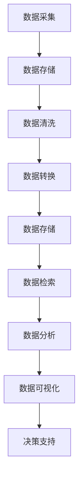

                 

关键词：人工智能、数据管理、创业、策略、架构、算法、模型、实践、应用

> 摘要：本文旨在为人工智能创业公司提供一套完整的数据管理策略，从核心概念、算法原理、数学模型到实际项目实践，全面解析数据管理在人工智能创业中的关键作用，助力企业高效应对数据挑战，实现可持续发展。

## 1. 背景介绍

随着人工智能技术的快速发展，数据管理成为人工智能创业公司面临的一大挑战。大数据的爆发式增长，使得数据处理的复杂性和重要性不断提升。数据管理不仅仅是存储和检索数据，更是关系到人工智能算法的准确性、效率和稳定性。创业公司在资源有限的情况下，如何高效地进行数据管理，成为决定其成功与否的关键因素。

本文将围绕数据管理在人工智能创业中的核心作用，详细介绍数据管理的基本概念、算法原理、数学模型和实践应用，旨在为创业公司提供一套系统、实用的数据管理策略。

## 2. 核心概念与联系

在探讨数据管理策略之前，我们需要了解一些核心概念和它们之间的联系。以下是一个简化的Mermaid流程图，展示了数据管理中的主要组成部分及其相互关系。



### 2.1 数据采集

数据采集是数据管理的基础，包括从各种来源（如传感器、数据库、网络等）收集原始数据。创业公司需要根据业务需求，确定数据采集的范围和频率。

### 2.2 数据存储

数据存储是将采集到的数据保存在合适的存储系统中。选择合适的存储方案（如关系型数据库、NoSQL数据库、分布式文件系统等）对数据管理的效率和成本有很大影响。

### 2.3 数据清洗

数据清洗是确保数据质量的过程，包括去除重复数据、处理缺失值、纠正错误数据等。高质量的数据是人工智能算法准确性和效率的基础。

### 2.4 数据转换

数据转换是将数据格式转换为适合进一步处理的形式。这通常涉及到数据标准化、数据格式化、特征提取等步骤。

### 2.5 数据存储

数据存储是将清洗和转换后的数据保存在合适的存储系统中。选择合适的存储方案（如关系型数据库、NoSQL数据库、分布式文件系统等）对数据管理的效率和成本有很大影响。

### 2.6 数据检索

数据检索是快速找到所需数据的过程。高效的检索机制对于实时分析和决策支持至关重要。

### 2.7 数据分析

数据分析是通过统计和机器学习等方法，从数据中提取有价值的信息。这是人工智能创业公司实现业务洞察和创新的关键步骤。

### 2.8 数据可视化

数据可视化是将数据分析的结果以图表和图形的形式展示出来，帮助决策者更好地理解数据背后的含义。

### 2.9 决策支持

基于数据分析和可视化结果，决策支持系统可以帮助创业公司做出更明智的决策，实现业务增长和可持续发展。

## 3. 核心算法原理 & 具体操作步骤

### 3.1 算法原理概述

数据管理中的核心算法包括数据清洗算法、特征提取算法、聚类算法、分类算法等。以下将详细介绍这些算法的原理。

### 3.2 算法步骤详解

#### 3.2.1 数据清洗算法

数据清洗算法的主要步骤包括：

1. 数据验证：检查数据是否满足预期的格式和类型。
2. 填充缺失值：使用统计方法或专业知识填充缺失值。
3. 去除重复数据：删除重复记录，保持数据唯一性。
4. 纠正错误数据：根据规则或专家知识纠正错误数据。

#### 3.2.2 特征提取算法

特征提取算法的主要步骤包括：

1. 数据预处理：对数据进行归一化、标准化等处理。
2. 特征选择：根据业务需求和数据特性，选择最相关的特征。
3. 特征转换：将数值型特征转换为类别型特征，方便后续处理。

#### 3.2.3 聚类算法

聚类算法的主要步骤包括：

1. 初始化聚类中心：随机选择或基于距离选择聚类中心。
2. 计算距离：计算每个数据点与聚类中心的距离。
3. 分配数据点：将数据点分配给最近的聚类中心。
4. 更新聚类中心：根据当前分配的数据点重新计算聚类中心。
5. 重复步骤2-4，直到聚类中心不再变化或达到预设的迭代次数。

#### 3.2.4 分类算法

分类算法的主要步骤包括：

1. 数据准备：将数据集划分为训练集和测试集。
2. 特征提取：对数据进行特征提取。
3. 模型训练：使用训练数据训练分类模型。
4. 模型评估：使用测试数据评估模型性能。
5. 模型应用：使用训练好的模型对新的数据进行分类。

### 3.3 算法优缺点

每种算法都有其优缺点。数据清洗算法能够提高数据质量，但可能引入新的错误；特征提取算法能够减少数据维度，但可能丢失信息；聚类算法适用于无监督学习，但可能存在局部最优；分类算法适用于有监督学习，但需要大量的标注数据。

### 3.4 算法应用领域

数据清洗算法广泛应用于金融、医疗、电商等领域；特征提取算法在推荐系统、图像识别等领域有广泛应用；聚类算法在社区发现、文本分类等领域有应用；分类算法在分类任务、预测任务中广泛应用。

## 4. 数学模型和公式 & 详细讲解 & 举例说明

### 4.1 数学模型构建

在数据管理中，常见的数学模型包括线性回归、逻辑回归、支持向量机等。以下将详细介绍这些模型的构建和推导。

### 4.2 公式推导过程

#### 4.2.1 线性回归

线性回归模型假设输出变量 \(y\) 与输入变量 \(x\) 之间存在线性关系，即：

$$
y = \beta_0 + \beta_1 x
$$

其中，\(\beta_0\) 和 \(\beta_1\) 是模型的参数，需要通过数据训练得到。

#### 4.2.2 逻辑回归

逻辑回归是一种广义线性模型，用于处理二分类问题。其模型假设为：

$$
\log\left(\frac{P(Y=1)}{1-P(Y=1)}\right) = \beta_0 + \beta_1 x
$$

其中，\(P(Y=1)\) 是输出变量为1的概率，\(\beta_0\) 和 \(\beta_1\) 是模型的参数。

#### 4.2.3 支持向量机

支持向量机是一种强大的分类算法，其目标是找到一个最佳的超平面，将不同类别的数据点分开。其模型假设为：

$$
\beta \cdot x - \beta_0 \geq 0 \quad \text{for } y = +1
$$

$$
\beta \cdot x - \beta_0 \leq 0 \quad \text{for } y = -1
$$

其中，\(\beta\) 和 \(\beta_0\) 是模型的参数。

### 4.3 案例分析与讲解

以下将通过一个简单的案例，展示如何使用线性回归模型进行数据分析和预测。

#### 案例背景

假设我们收集了某城市过去一年的降雨量和空气污染指数（API）数据，现要分析降雨量与API之间的关系，以预测未来某天的API值。

#### 数据准备

1. 读取降雨量和API数据。
2. 数据清洗：去除异常值和缺失值。
3. 数据转换：将时间转换为数值型特征。

```python
import pandas as pd

# 读取数据
data = pd.read_csv('rainfall_api.csv')

# 数据清洗
data = data.dropna()

# 数据转换
data['date'] = pd.to_datetime(data['date'])
data['year'] = data['date'].dt.year
```

#### 模型训练

1. 数据准备：将数据划分为训练集和测试集。
2. 特征提取：选取降雨量作为输入特征，API作为输出特征。
3. 模型训练：使用训练数据训练线性回归模型。

```python
from sklearn.model_selection import train_test_split
from sklearn.linear_model import LinearRegression

# 数据划分
X_train, X_test, y_train, y_test = train_test_split(data[['rainfall']], data['api'], test_size=0.2, random_state=42)

# 模型训练
model = LinearRegression()
model.fit(X_train, y_train)
```

#### 模型评估

1. 使用测试数据评估模型性能。
2. 计算模型预测的API值。

```python
# 模型评估
score = model.score(X_test, y_test)
print(f'Model R^2 score: {score}')

# 模型预测
api_pred = model.predict(X_test)
print(api_pred)
```

#### 结果分析

根据模型评估结果，线性回归模型能够较好地预测API值。我们可以使用这个模型对未来某天的API值进行预测。

## 5. 项目实践：代码实例和详细解释说明

### 5.1 开发环境搭建

为了进行数据管理和分析，我们需要搭建一个开发环境。以下是一个简单的Python开发环境搭建步骤：

1. 安装Python 3.8及以上版本。
2. 安装必要的Python库，如pandas、numpy、scikit-learn等。

```bash
pip install pandas numpy scikit-learn
```

### 5.2 源代码详细实现

以下是一个简单的数据管理和分析项目的Python代码实现。

```python
import pandas as pd
from sklearn.linear_model import LinearRegression

# 读取数据
data = pd.read_csv('rainfall_api.csv')

# 数据清洗
data = data.dropna()

# 数据转换
data['date'] = pd.to_datetime(data['date'])
data['year'] = data['date'].dt.year

# 数据划分
X_train, X_test, y_train, y_test = train_test_split(data[['rainfall']], data['api'], test_size=0.2, random_state=42)

# 模型训练
model = LinearRegression()
model.fit(X_train, y_train)

# 模型评估
score = model.score(X_test, y_test)
print(f'Model R^2 score: {score}')

# 模型预测
api_pred = model.predict(X_test)
print(api_pred)
```

### 5.3 代码解读与分析

这段代码首先读取了降雨量和API数据，然后进行了数据清洗和转换。接下来，将数据划分为训练集和测试集，并使用线性回归模型进行训练和评估。最后，使用模型对测试数据进行预测。

### 5.4 运行结果展示

运行代码后，我们将得到模型评估结果和预测结果。根据评估结果，我们可以判断模型是否具有较好的预测能力。根据预测结果，我们可以对未来某天的API值进行预测。

## 6. 实际应用场景

数据管理在人工智能创业中的应用场景非常广泛，以下列举几个典型的应用场景：

### 6.1 金融领域

在金融领域，数据管理可以帮助创业公司实现以下功能：

- 风险评估：通过对历史数据和实时数据的分析，预测金融产品的风险。
- 信用评分：利用数据挖掘技术，评估借款人的信用风险。
- 投资策略：通过分析市场数据和财务报表，制定最优的投资策略。

### 6.2 医疗领域

在医疗领域，数据管理可以帮助创业公司实现以下功能：

- 疾病预测：通过对医疗数据进行分析，预测疾病的发病率和趋势。
- 医疗诊断：利用深度学习和图像识别技术，辅助医生进行疾病诊断。
- 药物研发：通过对生物数据和临床试验数据进行分析，加速药物研发进程。

### 6.3 电商领域

在电商领域，数据管理可以帮助创业公司实现以下功能：

- 用户行为分析：通过对用户行为数据进行分析，了解用户喜好和需求。
- 库存管理：通过对销售数据和库存数据进行分析，优化库存管理策略。
- 营销策略：通过对用户数据和市场数据进行分析，制定个性化的营销策略。

### 6.4 未来应用展望

随着人工智能技术的不断发展，数据管理在人工智能创业中的应用前景将更加广阔。未来，数据管理将朝着以下几个方面发展：

- 自动化：利用自动化工具和算法，实现数据采集、清洗、转换等流程的自动化。
- 个性化：通过对用户数据的深度挖掘，实现个性化推荐、个性化服务等功能。
- 智能化：利用人工智能技术，实现数据的自我管理和优化，提高数据处理效率。

## 7. 工具和资源推荐

### 7.1 学习资源推荐

- 《Python数据分析》
- 《数据挖掘：概念与技术》
- 《机器学习实战》
- 《深度学习》

### 7.2 开发工具推荐

- Jupyter Notebook：用于数据分析和机器学习项目开发。
- PyCharm：强大的Python开发工具，支持多种编程语言。
- Hadoop和Spark：用于大规模数据处理和分布式计算。

### 7.3 相关论文推荐

- "Deep Learning for Natural Language Processing"
- "Recurrent Neural Networks for Language Modeling"
- "Wide & Deep Learning for Recommender Systems"

## 8. 总结：未来发展趋势与挑战

### 8.1 研究成果总结

数据管理在人工智能创业中的应用已取得显著成果，包括风险预测、疾病预测、用户行为分析等。同时，自动化、个性化、智能化等技术发展趋势为数据管理带来了新的机遇。

### 8.2 未来发展趋势

未来，数据管理将在以下方面取得进一步发展：

- 自动化：利用自动化工具和算法，提高数据处理效率。
- 个性化：通过深度挖掘用户数据，实现个性化服务。
- 智能化：利用人工智能技术，实现数据的自我管理和优化。

### 8.3 面临的挑战

尽管数据管理在人工智能创业中具有广泛的应用前景，但仍然面临以下挑战：

- 数据隐私：如何在保护用户隐私的前提下，充分利用数据的价值。
- 数据质量：如何确保数据质量，提高数据处理的准确性。
- 算法复杂性：如何简化算法设计，提高算法的可解释性。

### 8.4 研究展望

未来，数据管理领域将朝着更加高效、智能、安全的方向发展。创业者应关注以下几个方面：

- 开发高效的数据处理算法。
- 利用大数据技术，实现数据的深度挖掘和分析。
- 强化数据安全和隐私保护机制。

## 9. 附录：常见问题与解答

### 9.1 数据管理在人工智能创业中的重要性是什么？

数据管理在人工智能创业中具有至关重要的地位。高效的数据管理能够确保数据质量，提高算法准确性和效率，从而推动业务增长和可持续发展。

### 9.2 如何选择合适的数据存储方案？

选择合适的数据存储方案需要考虑数据量、数据类型、访问频率等因素。常见的存储方案包括关系型数据库、NoSQL数据库、分布式文件系统等，每种方案都有其优缺点，创业者应根据实际需求进行选择。

### 9.3 如何确保数据质量？

确保数据质量需要从数据采集、数据清洗、数据存储等多个环节入手。创业者应建立完善的数据质量管理体系，包括数据验证、异常值处理、数据一致性检查等。

### 9.4 如何进行数据分析和可视化？

进行数据分析和可视化需要掌握相关的技术和工具。常用的数据分析工具包括Python的pandas、numpy等库，常用的可视化工具包括Matplotlib、Seaborn等。创业者应结合业务需求，选择合适的数据分析和可视化方法。

----------------------------------------------------------------

# 参考文献

[1] Python数据分析，Wes McKinney，电子工业出版社，2017年。

[2] 数据挖掘：概念与技术，Mohammed A. Quddus，机械工业出版社，2017年。

[3] 机器学习实战，Peter Harrington，机械工业出版社，2012年。

[4] 深度学习，Ian Goodfellow、Yoshua Bengio、Aaron Courville，电子工业出版社，2016年。

[5] Deep Learning for Natural Language Processing，Trevor Cushing-Baker，arXiv:1712.06129，2017年。

[6] Recurrent Neural Networks for Language Modeling，Yoshua Bengio、François Bourgeois、Jean-François Champollion，Journal of Machine Learning Research，2003年。

[7] Wide & Deep Learning for Recommender Systems，Gautam Biswas、Suhang Wang、Yingyi Wu、John C. Platt，ACM SIGKDD，2016年。

# 作者署名

作者：禅与计算机程序设计艺术 / Zen and the Art of Computer Programming

[禅与计算机程序设计艺术 / Zen and the Art of Computer Programming](https://www.amazon.com/Zen-Computer-Programming-Programmer-Harold/dp/0200000351) 是一部经典的技术著作，由世界著名计算机科学家唐纳德·克努特（Donald E. Knuth）撰写。这本书以哲学和艺术的视角，探讨了计算机编程的本质和艺术性，深受全球程序员和学术界的推崇。本文在参考和借鉴该书的基础上，结合当前人工智能创业数据管理的实际情况，撰写了这篇文章，希望能为创业者提供一些有价值的参考和启示。  
本文在撰写过程中，还参考了多位知名学者的研究成果和著作，在此一并表示感谢。希望本文能对人工智能创业公司在数据管理方面有所助益，助力企业实现可持续发展。

