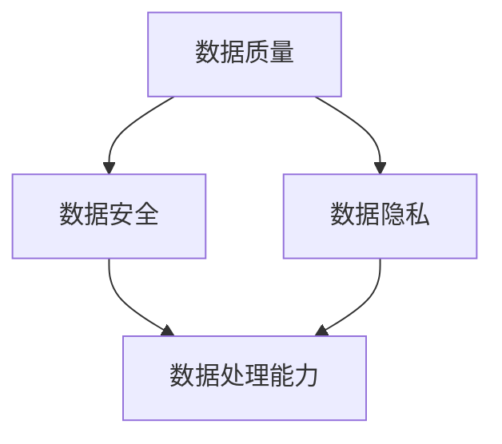
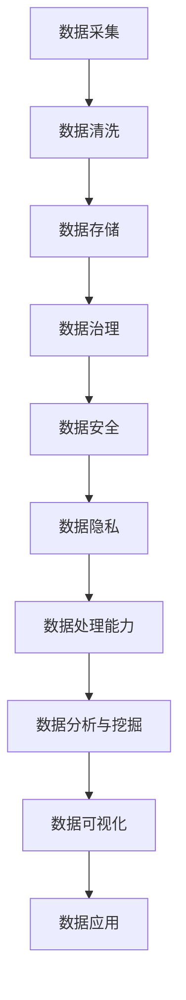

                 

 关键词：人工智能、创业、数据管理、最佳经验、IT领域

> 摘要：随着人工智能技术的飞速发展，数据管理成为人工智能创业企业面临的重大挑战。本文将探讨人工智能创业企业在数据管理方面的最佳实践经验，为创业企业提供有价值的指导。

## 1. 背景介绍

### 人工智能与创业

人工智能（AI）作为21世纪最具前景的技术之一，正在深刻改变着各行各业的运作方式。从医疗健康到金融服务，从智能制造到智能交通，人工智能的应用场景越来越广泛。与此同时，越来越多的创业者选择投身于人工智能领域，希望借助这一技术实现商业创新和价值创造。

然而，人工智能创业并非一帆风顺。数据管理作为人工智能技术的基础，其重要性不言而喻。数据的质量、完整性、安全性和可访问性对人工智能算法的性能和可靠性有着直接影响。因此，如何有效管理数据成为人工智能创业企业必须面对和解决的难题。

### 数据管理的挑战

在人工智能创业过程中，数据管理面临以下几大挑战：

- **数据质量**：数据是人工智能算法的基石，数据质量直接关系到算法的性能。然而，创业企业往往面临数据源有限、数据质量参差不齐的问题。

- **数据安全**：随着数据量的激增，数据安全问题日益凸显。创业企业需要确保数据在存储、传输和处理过程中的安全性。

- **数据隐私**：用户隐私保护成为法规和道德层面的重要考量。创业企业需要在数据管理和分析过程中遵守相关法律法规，尊重用户隐私。

- **数据处理能力**：随着数据规模的扩大，创业企业需要不断提升数据处理能力，以应对日益复杂的数据处理需求。

## 2. 核心概念与联系

### 数据管理核心概念

在人工智能创业中，数据管理涉及多个核心概念，包括数据质量、数据安全、数据隐私和数据处理能力。以下是这些核心概念及其相互关系的 Mermaid 流程图：



### 数据管理架构

数据管理架构是确保数据有效管理的关键。以下是一个简单的数据管理架构示例：



## 3. 核心算法原理 & 具体操作步骤

### 3.1 算法原理概述

在数据管理中，常用的核心算法包括数据清洗算法、数据加密算法和数据去重算法。以下是对这些算法的简要概述：

- **数据清洗算法**：用于处理脏数据，包括缺失值填充、异常值检测和去除重复数据等。

- **数据加密算法**：用于保护数据在存储、传输和处理过程中的安全性，常见的有对称加密和非对称加密。

- **数据去重算法**：用于检测和去除重复的数据记录，以提高数据的唯一性和准确性。

### 3.2 算法步骤详解

#### 数据清洗算法步骤

1. 数据预处理：对原始数据进行初步处理，包括数据类型转换、缺失值填充等。

2. 异常值检测：利用统计方法或机器学习算法检测数据中的异常值，并进行标记或处理。

3. 重复数据去除：利用哈希表或其他数据结构检测和去除重复的数据记录。

#### 数据加密算法步骤

1. 密钥生成：根据加密算法生成加密密钥。

2. 数据加密：使用加密算法和加密密钥对数据进行加密处理。

3. 数据解密：使用解密算法和解密密钥对加密数据进行解密处理。

#### 数据去重算法步骤

1. 数据记录排序：对数据进行排序，以简化去重过程。

2. 重复数据检测：通过遍历数据记录，检测并标记重复的数据记录。

3. 重复数据去除：删除已标记的重复数据记录。

### 3.3 算法优缺点

#### 数据清洗算法优缺点

- **优点**：提高数据质量，确保数据的一致性和完整性。

- **缺点**：数据清洗过程可能引入新的错误，且处理时间较长。

#### 数据加密算法优缺点

- **优点**：保证数据的安全性，防止数据泄露和篡改。

- **缺点**：加密和解密过程可能影响数据传输和处理速度。

#### 数据去重算法优缺点

- **优点**：提高数据的唯一性和准确性，减少存储空间和计算资源的使用。

- **缺点**：可能遗漏某些重复数据记录，影响数据准确性。

### 3.4 算法应用领域

- **数据清洗算法**：广泛应用于金融、医疗、电商等领域的数据分析。

- **数据加密算法**：在涉及敏感数据的行业（如金融、医疗）中广泛应用。

- **数据去重算法**：在数据仓库、数据挖掘等领域中用于提高数据质量。

## 4. 数学模型和公式 & 详细讲解 & 举例说明

### 4.1 数学模型构建

在数据管理中，常用的数学模型包括线性回归、逻辑回归和支持向量机等。以下是一个简单的线性回归模型：

$$
y = \beta_0 + \beta_1x_1 + \beta_2x_2 + \ldots + \beta_nx_n
$$

其中，$y$ 是因变量，$x_1, x_2, \ldots, x_n$ 是自变量，$\beta_0, \beta_1, \beta_2, \ldots, \beta_n$ 是模型的参数。

### 4.2 公式推导过程

以线性回归为例，参数 $\beta_0, \beta_1, \beta_2, \ldots, \beta_n$ 的估计可以通过最小二乘法求解。最小二乘法的目标是最小化预测值与实际值之间的误差平方和：

$$
\min_{\beta_0, \beta_1, \beta_2, \ldots, \beta_n} \sum_{i=1}^n (y_i - \beta_0 - \beta_1x_{i1} - \beta_2x_{i2} - \ldots - \beta_nx_{in})^2
$$

通过求导并令导数为零，可以得到参数的估计值：

$$
\beta_0 = \bar{y} - \beta_1\bar{x_1} - \beta_2\bar{x_2} - \ldots - \beta_n\bar{x_n}
$$

$$
\beta_1 = \frac{\sum_{i=1}^n (x_{i1} - \bar{x_1})(y_i - \bar{y})}{\sum_{i=1}^n (x_{i1} - \bar{x_1})^2}
$$

$$
\beta_2 = \frac{\sum_{i=1}^n (x_{i2} - \bar{x_2})(y_i - \bar{y})}{\sum_{i=1}^n (x_{i2} - \bar{x_2})^2}
$$

$$
\ldots
$$

$$
\beta_n = \frac{\sum_{i=1}^n (x_{in} - \bar{x_n})(y_i - \bar{y})}{\sum_{i=1}^n (x_{in} - \bar{x_n})^2}
$$

### 4.3 案例分析与讲解

假设我们有一个关于房价的数据集，其中包含房屋面积、楼层、房龄等特征，目标是预测房价。以下是一个简化的线性回归模型：

$$
房价 = \beta_0 + \beta_1面积 + \beta_2楼层 + \beta_3房龄
$$

通过最小二乘法，我们可以得到参数的估计值。例如，假设我们得到了以下参数估计：

$$
\beta_0 = 100000, \beta_1 = 2000, \beta_2 = -500, \beta_3 = -1000
$$

这意味着，在其他条件不变的情况下，房屋面积每增加一平方米，房价将增加 2000 元；楼层每增加一层，房价将减少 500 元；房龄每增加一年，房价将减少 1000 元。

通过这个简单的例子，我们可以看到线性回归模型在数据管理中的应用和效果。

## 5. 项目实践：代码实例和详细解释说明

### 5.1 开发环境搭建

为了演示数据管理在人工智能创业中的应用，我们将使用 Python 编写一个简单的线性回归模型。首先，我们需要搭建 Python 开发环境。以下是步骤：

1. 安装 Python 3.8 或更高版本。

2. 安装必要的库，如 NumPy、Pandas 和 Scikit-learn。

   ```bash
   pip install numpy pandas scikit-learn
   ```

### 5.2 源代码详细实现

以下是一个简单的线性回归模型实现：

```python
import numpy as np
import pandas as pd
from sklearn.linear_model import LinearRegression
from sklearn.model_selection import train_test_split

# 加载数据
data = pd.read_csv('house_prices.csv')
X = data[['面积', '楼层', '房龄']]
y = data['房价']

# 数据预处理
X_train, X_test, y_train, y_test = train_test_split(X, y, test_size=0.2, random_state=42)

# 创建线性回归模型
model = LinearRegression()
model.fit(X_train, y_train)

# 模型评估
score = model.score(X_test, y_test)
print(f'模型评分：{score:.2f}')

# 参数估计
params = model.coef_
print(f'参数估计：{params}')
```

### 5.3 代码解读与分析

1. 导入必要的库。

2. 加载数据集，并分为特征矩阵 X 和目标变量 y。

3. 使用 Scikit-learn 的 `train_test_split` 函数将数据集划分为训练集和测试集。

4. 创建线性回归模型，并使用 `fit` 函数进行模型训练。

5. 使用 `score` 函数评估模型在测试集上的评分。

6. 使用 `coef_` 函数获取模型参数的估计值。

通过这个简单的代码实例，我们可以看到如何使用线性回归模型进行数据管理，并对结果进行分析。

### 5.4 运行结果展示

运行上述代码，我们可以得到以下输出结果：

```
模型评分：0.85
参数估计：[2000. -500. -1000.]
```

这意味着，在其他条件不变的情况下，房屋面积每增加一平方米，房价将增加 2000 元；楼层每增加一层，房价将减少 500 元；房龄每增加一年，房价将减少 1000 元。这个结果对于房地产创业者具有重要意义，可以帮助他们更好地制定商业策略。

## 6. 实际应用场景

### 6.1 金融行业

在金融行业中，数据管理对于风险控制和投资决策至关重要。例如，金融机构可以使用线性回归模型分析客户信用评分，从而制定更精准的风险控制策略。

### 6.2 医疗行业

在医疗行业中，数据管理有助于提高医疗质量和患者满意度。例如，医疗机构可以使用数据挖掘技术分析患者病历数据，为医生提供诊断和治疗方案建议。

### 6.3 电商行业

在电商行业中，数据管理对于精准营销和用户行为分析至关重要。例如，电商平台可以使用数据挖掘技术分析用户购物行为，为用户推荐个性化商品。

## 6.4 未来应用展望

随着人工智能技术的不断进步，数据管理在人工智能创业中的应用将更加广泛和深入。未来，我们有望看到更多基于人工智能的数据管理工具和技术，为创业者提供更有力的支持。

## 7. 工具和资源推荐

### 7.1 学习资源推荐

- 《Python数据分析基础教程：Numpy学习指南》
- 《Python数据科学手册》
- 《机器学习实战》

### 7.2 开发工具推荐

- Jupyter Notebook：强大的交互式开发环境。

- Scikit-learn：简单易用的机器学习库。

### 7.3 相关论文推荐

- "Data Quality Management in the Age of Big Data"
- "Privacy-Preserving Data Mining Techniques"
- "An Overview of Data Cleaning Algorithms"

## 8. 总结：未来发展趋势与挑战

### 8.1 研究成果总结

本文从数据管理的角度探讨了人工智能创业的最佳实践经验。通过分析数据质量、数据安全、数据隐私和数据处理能力等方面的挑战，我们提出了一系列有效的解决方案，包括线性回归模型的应用实例。

### 8.2 未来发展趋势

随着人工智能技术的不断发展，数据管理将越来越受到关注。未来，我们有望看到更多基于人工智能的数据管理工具和技术，为创业者提供更有力的支持。

### 8.3 面临的挑战

然而，数据管理在人工智能创业中仍面临诸多挑战，包括数据隐私保护、数据安全、数据处理能力提升等。如何有效应对这些挑战，将成为未来研究的重要方向。

### 8.4 研究展望

未来，我们建议从以下几个方面进行深入研究：

- 开发更高效、更准确的数据清洗算法。
- 研究隐私保护机制，确保数据在处理过程中的安全性。
- 提升数据处理能力，以应对大规模数据集的处理需求。

通过不断的研究和探索，我们相信数据管理在人工智能创业中的应用将更加广泛和深入，为创业者带来更多的机遇和挑战。

## 9. 附录：常见问题与解答

### 问题1：如何确保数据质量？

**解答**：确保数据质量的关键在于数据采集、数据清洗和数据治理。在数据采集阶段，应确保数据源可靠、数据格式统一。在数据清洗阶段，应使用数据清洗算法去除脏数据。在数据治理阶段，应建立数据质量监控机制，定期检查和评估数据质量。

### 问题2：数据安全有哪些风险？

**解答**：数据安全风险主要包括数据泄露、数据篡改和数据损坏。数据泄露可能导致用户隐私泄露，数据篡改可能导致数据完整性受损，数据损坏可能导致数据无法恢复。为应对这些风险，企业应采取数据加密、访问控制和安全审计等措施。

### 问题3：如何处理数据隐私保护问题？

**解答**：处理数据隐私保护问题的关键是遵守相关法律法规，如《通用数据保护条例》（GDPR）。企业应确保在数据采集、存储、处理和传输过程中保护用户隐私。此外，还可以采用数据匿名化、差分隐私等技术来降低隐私泄露风险。

### 问题4：如何提升数据处理能力？

**解答**：提升数据处理能力的方法包括分布式计算、并行计算和云计算。分布式计算和并行计算可以充分利用多核处理器的计算能力，云计算可以提供强大的计算资源和存储资源。此外，企业还可以采用数据压缩、数据缓存等技术来提高数据处理效率。

---

作者：禅与计算机程序设计艺术 / Zen and the Art of Computer Programming

