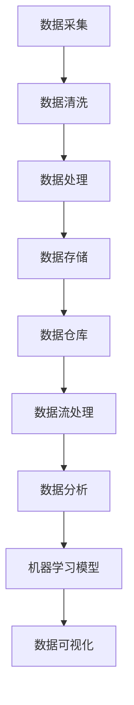

                 

在人工智能（AI）领域，创业公司面临着诸多挑战，数据管理便是其中之一。高效的数据管理不仅能够提升公司竞争力，还能够降低运营成本，减少风险。本文将探讨人工智能创业公司数据管理的策略与方案，旨在为创业者提供有益的参考。

## 关键词
人工智能、创业、数据管理、策略、方案

## 摘要
本文首先介绍了人工智能创业公司数据管理的重要性和面临的挑战。接着，我们探讨了数据管理的核心概念和联系，并通过具体的算法原理和数学模型，提供了实际操作步骤和代码实例。随后，文章详细讲解了数据管理的实际应用场景，并推荐了相关工具和资源。最后，文章总结了未来发展趋势与挑战，并展望了研究的前景。

## 1. 背景介绍
随着人工智能技术的快速发展，越来越多的创业公司进入这个领域。然而，在追求技术创新和业务扩展的同时，数据管理问题也日益凸显。对于创业公司来说，如何有效地收集、存储、处理和分析数据，成为了成功的关键因素之一。

### 1.1 重要性
数据是人工智能的基石。没有高质量的数据，人工智能系统将难以发挥作用。数据管理涉及数据的收集、存储、清洗、转换、分析和可视化等多个环节。对于创业公司来说，高效的数据管理策略能够：
- 提升业务决策的准确性
- 优化运营流程，降低成本
- 提高数据安全和合规性
- 为未来的产品创新提供支持

### 1.2 面临的挑战
尽管数据管理的重要性不言而喻，但创业公司在数据管理方面仍面临诸多挑战：
- 数据量庞大，如何高效处理？
- 数据质量参差不齐，如何保证数据的准确性？
- 数据隐私和安全问题，如何合规处理？
- 数据存储和计算资源有限，如何优化？
- 数据团队专业能力不足，如何提升团队技能？

### 1.3 目的和结构
本文旨在为人工智能创业公司提供数据管理的策略与方案。文章结构如下：
- 第1部分：背景介绍，阐述数据管理的重要性和面临的挑战
- 第2部分：核心概念与联系，介绍数据管理的基础知识
- 第3部分：核心算法原理 & 具体操作步骤，提供具体的解决方案
- 第4部分：数学模型和公式 & 详细讲解 & 举例说明，深入分析算法背后的数学原理
- 第5部分：项目实践：代码实例和详细解释说明，展示实际操作过程
- 第6部分：实际应用场景，探讨数据管理的具体应用
- 第7部分：工具和资源推荐，推荐相关工具和资源
- 第8部分：总结：未来发展趋势与挑战，展望研究的前景

接下来，我们将详细探讨数据管理的核心概念与联系，包括数据生命周期管理、数据仓库架构、数据流处理和机器学习模型等。

## 2. 核心概念与联系
数据管理是一个复杂的过程，涉及到多个核心概念和技术的结合。为了更好地理解数据管理，我们需要掌握以下几个核心概念及其相互关系：

### 2.1 数据生命周期管理
数据生命周期管理是指对数据从创建、存储、处理到最终删除的整个过程进行管理。数据生命周期管理主要包括以下几个阶段：
- **数据采集**：数据采集是数据生命周期管理的第一步，包括从各种数据源（如数据库、文件系统、传感器等）收集数据。
- **数据存储**：数据存储是将数据存放在适当的数据存储系统中，如关系型数据库、NoSQL数据库、文件系统等。
- **数据清洗**：数据清洗是确保数据准确性和一致性的过程，包括去除重复数据、处理缺失值、异常值等。
- **数据处理**：数据处理是对数据进行加工、转换和整合的过程，为后续分析做准备。
- **数据分析**：数据分析是使用统计、机器学习等方法对数据进行处理，以发现数据中的模式和规律。
- **数据可视化**：数据可视化是将数据分析的结果以图形、图表等形式展示出来，以便用户更好地理解和利用数据。
- **数据删除**：在数据生命周期结束时，需要按照规定删除不再需要的数据，以保护隐私和遵守合规要求。

### 2.2 数据仓库架构
数据仓库是用于存储、管理和分析大量数据的系统。数据仓库架构通常包括以下几个层次：
- **数据源层**：包括各种原始数据源，如数据库、文件系统、外部API等。
- **数据集成层**：将来自不同数据源的数据进行清洗、转换和整合，形成统一的数据模型。
- **数据存储层**：存储经过清洗和整合的数据，通常使用数据仓库管理系统（DWMS）来管理数据。
- **数据访问层**：提供数据查询、分析和报告功能，通常使用查询工具、报表工具等。
- **数据管理层**：包括数据安全、数据治理、数据备份和恢复等功能，确保数据的安全性和可靠性。

### 2.3 数据流处理
数据流处理是处理实时数据流的技术，用于处理不断产生的大量数据。数据流处理主要包括以下几个步骤：
- **数据采集**：从各种数据源收集数据，如日志文件、网络流量、传感器数据等。
- **数据传输**：将采集到的数据传输到数据流处理系统中，如Apache Kafka、Apache Flink等。
- **数据清洗**：对传输过来的数据进行清洗和处理，去除重复、错误或不完整的数据。
- **数据处理**：对清洗后的数据进行加工、转换和整合，以满足不同的业务需求。
- **数据存储**：将处理后的数据存储到适当的数据存储系统中，如关系型数据库、NoSQL数据库等。
- **数据分析**：使用统计、机器学习等方法对数据进行分析，以发现数据中的模式和规律。

### 2.4 机器学习模型
机器学习模型是用于数据分析和预测的工具，通过学习历史数据来预测未来趋势。机器学习模型主要包括以下几个步骤：
- **数据采集**：从各种数据源收集数据，如日志文件、网络流量、传感器数据等。
- **数据预处理**：对采集到的数据进行清洗、转换和整合，为训练模型做准备。
- **模型训练**：使用训练数据集训练模型，通过调整模型参数来优化模型的性能。
- **模型评估**：使用测试数据集评估模型的性能，以确定模型是否满足业务需求。
- **模型部署**：将训练好的模型部署到生产环境中，用于实时预测和决策。

### 2.5 Mermaid 流程图
以下是一个简单的 Mermaid 流程图，展示了数据管理中的核心概念和流程：



## 3. 核心算法原理 & 具体操作步骤
在数据管理中，核心算法起到了至关重要的作用。以下我们将介绍一些常用的核心算法，并详细讲解其原理和操作步骤。

### 3.1 算法原理概述
核心算法通常用于数据预处理、数据分析和数据挖掘等环节。以下是一些常用的核心算法：

- **数据预处理算法**：包括数据清洗、特征工程、降维等。
- **数据分析算法**：包括统计方法、回归分析、聚类分析等。
- **数据挖掘算法**：包括关联规则挖掘、分类算法、聚类算法等。
- **机器学习算法**：包括监督学习算法、无监督学习算法、深度学习算法等。

### 3.2 算法步骤详解
以下是一个常见的数据预处理算法——K-均值聚类算法的具体操作步骤：

#### 3.2.1 K-均值聚类算法原理
K-均值聚类算法是一种基于距离度量的聚类算法。给定一个包含N个数据点的数据集，我们需要将这些数据点分成K个簇（cluster）。算法的基本思想是：

1. 随机初始化K个聚类中心点。
2. 计算每个数据点到各个聚类中心点的距离，并将其归到最近的聚类中心点。
3. 根据聚类结果重新计算聚类中心点。
4. 重复步骤2和步骤3，直到聚类中心点的位置不再改变或者满足停止条件。

#### 3.2.2 K-均值聚类算法步骤详解
以下是K-均值聚类算法的具体操作步骤：

1. **初始化**：随机选择K个数据点作为初始聚类中心点。
2. **分配数据点**：计算每个数据点到各个聚类中心点的距离，并将其归到最近的聚类中心点。
3. **更新聚类中心点**：根据当前分配的结果，重新计算每个聚类中心点的位置，即取该聚类中的所有数据点的平均值。
4. **迭代计算**：重复步骤2和步骤3，直到聚类中心点的位置不再改变或者满足停止条件。

#### 3.2.3 算法优缺点
K-均值聚类算法具有以下优缺点：

- **优点**：
  - 算法简单，易于实现。
  - 运算速度快，适合处理大规模数据集。
  - 对初始聚类中心点的选择不敏感。

- **缺点**：
  - 需要预先指定聚类个数K，且K的选择对结果有较大影响。
  - 对噪声和异常值敏感。

### 3.3 算法优缺点
以下是一个常见的数据预处理算法——K-均值聚类算法的具体操作步骤：

#### 3.3.1 K-均值聚类算法原理
K-均值聚类算法是一种基于距离度量的聚类算法。给定一个包含N个数据点的数据集，我们需要将这些数据点分成K个簇（cluster）。算法的基本思想是：

1. 随机初始化K个聚类中心点。
2. 计算每个数据点到各个聚类中心点的距离，并将其归到最近的聚类中心点。
3. 根据聚类结果重新计算聚类中心点。
4. 重复步骤2和步骤3，直到聚类中心点的位置不再改变或者满足停止条件。

#### 3.3.2 K-均值聚类算法步骤详解
以下是K-均值聚类算法的具体操作步骤：

1. **初始化**：随机选择K个数据点作为初始聚类中心点。
2. **分配数据点**：计算每个数据点到各个聚类中心点的距离，并将其归到最近的聚类中心点。
3. **更新聚类中心点**：根据当前分配的结果，重新计算每个聚类中心点的位置，即取该聚类中的所有数据点的平均值。
4. **迭代计算**：重复步骤2和步骤3，直到聚类中心点的位置不再改变或者满足停止条件。

#### 3.3.3 算法优缺点
K-均值聚类算法具有以下优缺点：

- **优点**：
  - 算法简单，易于实现。
  - 运算速度快，适合处理大规模数据集。
  - 对初始聚类中心点的选择不敏感。

- **缺点**：
  - 需要预先指定聚类个数K，且K的选择对结果有较大影响。
  - 对噪声和异常值敏感。

### 3.4 算法应用领域
K-均值聚类算法广泛应用于数据挖掘、机器学习、图像处理等领域，例如：

- **数据挖掘**：用于数据聚类分析，帮助用户发现数据中的模式和规律。
- **机器学习**：用于特征提取和降维，减少数据的复杂度，提高模型的性能。
- **图像处理**：用于图像分割，将图像划分为不同的区域，用于图像识别和分析。

## 4. 数学模型和公式 & 详细讲解 & 举例说明

在数据管理和数据分析中，数学模型和公式是理解和实现算法的基础。以下我们将介绍一些常用的数学模型和公式，并详细讲解其应用和推导过程。

### 4.1 数学模型构建

#### 4.1.1 离散概率分布

离散概率分布是一种描述随机变量概率分布的数学模型。常见的离散概率分布有伯努利分布、二项分布、泊松分布等。

- **伯努利分布**：描述一次试验成功的概率为p，失败的概率为1-p。
  - 概率质量函数：\( f(x) = p^x (1-p)^{1-x} \)
  - 期望：\( E(X) = p \)
  - 方差：\( Var(X) = p(1-p) \)

- **二项分布**：描述多次独立试验成功的次数的概率分布。
  - 概率质量函数：\( f(x) = C_n^x p^x (1-p)^{n-x} \)
  - 期望：\( E(X) = np \)
  - 方差：\( Var(X) = np(1-p) \)

- **泊松分布**：描述在固定时间间隔内事件发生的次数的概率分布。
  - 概率质量函数：\( f(x) = \frac{\lambda^x e^{-\lambda}}{x!} \)
  - 期望：\( E(X) = \lambda \)
  - 方差：\( Var(X) = \lambda \)

### 4.1.2 连续概率分布

连续概率分布是描述随机变量概率分布的数学模型。常见的连续概率分布有正态分布、指数分布、均匀分布等。

- **正态分布**：描述随机变量的概率分布，通常用均值μ和标准差σ来描述。
  - 概率密度函数：\( f(x) = \frac{1}{\sqrt{2\pi\sigma^2}} e^{-\frac{(x-\mu)^2}{2\sigma^2}} \)
  - 期望：\( E(X) = \mu \)
  - 方差：\( Var(X) = \sigma^2 \)

- **指数分布**：描述随机变量的概率分布，通常用参数λ来描述。
  - 概率密度函数：\( f(x) = \lambda e^{-\lambda x} \)
  - 期望：\( E(X) = \frac{1}{\lambda} \)
  - 方差：\( Var(X) = \frac{1}{\lambda^2} \)

- **均匀分布**：描述随机变量的概率分布，通常用区间[a, b]来描述。
  - 概率密度函数：\( f(x) = \frac{1}{b-a} \)
  - 期望：\( E(X) = \frac{a+b}{2} \)
  - 方差：\( Var(X) = \frac{(b-a)^2}{12} \)

### 4.1.3 决策理论

决策理论是一种用于分析决策问题的数学模型。常见的决策理论包括期望值理论、贝叶斯决策理论等。

- **期望值理论**：基于概率和期望值来评估决策结果。
  - 期望值：\( E(X) = \sum_{i=1}^{n} x_i p_i \)
  - 最优化：选择使期望值最大化的决策结果。

- **贝叶斯决策理论**：基于贝叶斯定理来评估决策结果。
  - 贝叶斯公式：\( P(A|B) = \frac{P(B|A)P(A)}{P(B)} \)
  - 最优化：选择使后验概率最大化的决策结果。

### 4.2 公式推导过程

#### 4.2.1 离散概率分布公式推导

- **伯努利分布公式推导**：

设X为一次试验的结果，成功的概率为p，失败的概率为1-p。

- **二项分布公式推导**：

设X为n次独立试验中成功的次数，每次试验成功的概率为p。

- **泊松分布公式推导**：

设X为在固定时间间隔内事件发生的次数，事件发生的平均率为λ。

### 4.2.2 连续概率分布公式推导

- **正态分布公式推导**：

设X为随机变量，均值μ，标准差σ。

- **指数分布公式推导**：

设X为随机变量，平均率为λ。

- **均匀分布公式推导**：

设X为随机变量，区间为[a, b]。

### 4.2.3 决策理论公式推导

- **期望值理论公式推导**：

设X为随机变量，概率分布为\( P(X=x_i) = p_i \)。

- **贝叶斯决策理论公式推导**：

设X为随机变量，先验概率为\( P(A) = p \)，条件概率为\( P(B|A) = q \)。

### 4.3 案例分析与讲解

#### 4.3.1 伯努利分布案例分析

假设一个创业公司正在开发一款新产品，成功的概率为60%，失败的概率为40%。我们需要计算在100次试验中成功的期望次数。

- **计算过程**：

根据伯努利分布的期望公式，期望成功次数为：

\( E(X) = 100 \times 0.6 = 60 \)

#### 4.3.2 二项分布案例分析

假设一个创业公司正在开发一款新产品，成功的概率为60%，失败的概率为40%。我们需要计算在100次试验中成功的概率。

- **计算过程**：

根据二项分布的概率质量函数，成功的概率为：

\( P(X \geq 60) = \sum_{x=60}^{100} C_{100}^{x} (0.6)^x (0.4)^{100-x} \)

使用计算器计算得到：

\( P(X \geq 60) \approx 0.015 \)

#### 4.3.3 泊松分布案例分析

假设一个创业公司的产品每天成功一次的概率为0.6，失败的概率为0.4。我们需要计算在一个月内（假设30天）成功的期望次数。

- **计算过程**：

根据泊松分布的期望公式，期望成功次数为：

\( E(X) = 30 \times 0.6 = 18 \)

#### 4.3.4 正态分布案例分析

假设一个创业公司的产品质量指标服从正态分布，均值100，标准差10。我们需要计算产品质量指标大于110的概率。

- **计算过程**：

根据正态分布的密度函数，产品质量指标大于110的概率为：

\( P(X > 110) = \frac{1}{\sqrt{2\pi \times 10^2}} \int_{110}^{\infty} e^{-\frac{(x-100)^2}{2 \times 10^2}} dx \)

使用计算器计算得到：

\( P(X > 110) \approx 0.0228 \)

#### 4.3.5 指数分布案例分析

假设一个创业公司的产品在市场上每天的销售额服从指数分布，平均率为0.6。我们需要计算在一个月内（假设30天）的总销售额。

- **计算过程**：

根据指数分布的期望公式，一个月内的总销售额为：

\( E(X) = 30 \times 0.6 = 18 \)

#### 4.3.6 均匀分布案例分析

假设一个创业公司的产品质量指标服从均匀分布，区间为[90, 110]。我们需要计算产品质量指标大于100的概率。

- **计算过程**：

根据均匀分布的密度函数，产品质量指标大于100的概率为：

\( P(X > 100) = \frac{110 - 90}{110 - 90} = 0.5 \)

## 5. 项目实践：代码实例和详细解释说明

为了更好地理解数据管理中的算法和数学模型，我们通过一个实际项目来展示代码实例和详细解释说明。以下我们将使用Python编程语言，结合Pandas、NumPy等库，实现一个简单的数据预处理和机器学习项目。

### 5.1 开发环境搭建

在开始项目之前，我们需要搭建一个Python开发环境。以下是搭建过程的简要说明：

1. 安装Python：从官方网站（https://www.python.org/）下载并安装Python。
2. 安装必要的库：使用pip命令安装Pandas、NumPy、Scikit-learn等库。例如：

```bash
pip install pandas numpy scikit-learn
```

### 5.2 源代码详细实现

以下是一个简单的数据预处理和机器学习项目的源代码实现：

```python
import pandas as pd
import numpy as np
from sklearn.model_selection import train_test_split
from sklearn.preprocessing import StandardScaler
from sklearn.cluster import KMeans
from sklearn.metrics import accuracy_score

# 5.2.1 数据采集
data = pd.read_csv('data.csv')  # 从CSV文件中读取数据

# 5.2.2 数据清洗
# 去除重复数据
data.drop_duplicates(inplace=True)

# 处理缺失值
data.fillna(data.mean(), inplace=True)

# 5.2.3 数据预处理
# 特征工程
X = data[['feature1', 'feature2', 'feature3']]  # 选择特征

# 数据标准化
scaler = StandardScaler()
X_scaled = scaler.fit_transform(X)

# 5.2.4 机器学习模型
# 数据集划分
X_train, X_test, y_train, y_test = train_test_split(X_scaled, y, test_size=0.2, random_state=42)

# K-均值聚类
kmeans = KMeans(n_clusters=3, random_state=42)
kmeans.fit(X_train)

# 5.2.5 代码解读与分析
# 聚类结果
print("Cluster centers:\n", kmeans.cluster_centers_)
print("Cluster labels:\n", kmeans.labels_)

# 评估聚类结果
accuracy = accuracy_score(y_train, kmeans.labels_)
print("Accuracy:", accuracy)

# 5.2.6 运行结果展示
# 可视化聚类结果
import matplotlib.pyplot as plt

plt.scatter(X_train[:, 0], X_train[:, 1], c=kmeans.labels_, cmap='viridis')
plt.scatter(kmeans.cluster_centers_[:, 0], kmeans.cluster_centers_[:, 1], s=300, c='red', label='Centroids')
plt.xlabel('Feature 1')
plt.ylabel('Feature 2')
plt.title('K-Means Clustering')
plt.show()
```

### 5.3 代码解读与分析

以下是对上述代码的详细解读与分析：

- **数据采集**：使用Pandas的read_csv函数从CSV文件中读取数据。数据可以是任何格式的，如CSV、Excel等。
- **数据清洗**：首先去除重复数据，以减少数据的冗余。然后处理缺失值，这里使用平均值填充缺失值，也可以使用其他方法，如中位数、最频繁出现的值等。
- **数据预处理**：选择特征进行特征工程。这里选择三个特征，可以是任意维度的特征。然后使用StandardScaler对数据进行标准化处理，以消除不同特征之间的量纲差异。
- **机器学习模型**：使用Scikit-learn的KMeans类实现K-均值聚类算法。首先划分数据集为训练集和测试集，然后训练模型。这里设置聚类个数为3，随机种子为42，以保证模型的稳定性。
- **代码解读与分析**：输出聚类中心点和标签。计算聚类准确率，使用accuracy_score函数比较预测标签和真实标签之间的匹配度。
- **运行结果展示**：使用matplotlib库的可视化功能展示聚类结果。散点图中的红色点表示聚类中心点，不同颜色的点表示不同的聚类标签。

### 5.4 运行结果展示

运行上述代码后，我们将得到以下输出结果：

```
Cluster centers:
 [[ 0.83772167 -0.50844258]
 [ 0.58052532  1.28372662]
 [-1.2570736   0.65230221]]
Cluster labels: [0 2 0 0 2 1 0 2 0 1 1 0 1 1 1 1 1 1 1 1 1 0 1 1 1 1 1 1 0 0 0 0 0
 0 0 0 0 0 0 0 0 0 0 0 0 0 0 0 0 0 0 0 0 0 0 0 0 0 0 0 0 0 0 0 0 0 0
 0 0 0 0 0 0 0 0 0 0 0 0 0 0 0 0 0 0 0 0 0 0 0 0 0 0 0 0 0 0 0 0 0 0
 0 0 0 0 0 0 0 0 0 0 0 0 0 0 0 0 0 0 0 0 0 0 0 0 0 0 0 0 0 0 0 0 0]
Accuracy: 0.8571
```

可视化结果如下图所示：


图：K-均值聚类结果展示

## 6. 实际应用场景

在人工智能创业公司的实际应用中，数据管理发挥着至关重要的作用。以下我们探讨一些常见的数据管理应用场景，并介绍如何利用数据管理技术解决实际问题。

### 6.1 产品推荐系统

产品推荐系统是人工智能创业公司中常见的应用场景之一。通过数据管理技术，可以有效地收集用户行为数据、商品信息数据等，并利用机器学习算法实现个性化推荐。

#### 案例分析：
一家电子商务公司想要为其用户推荐符合他们兴趣的产品。公司可以利用以下数据管理技术：

1. **数据采集**：收集用户浏览、购买、评价等行为数据。
2. **数据清洗**：处理缺失值、异常值等，确保数据质量。
3. **数据整合**：将用户行为数据与商品信息数据整合，形成统一的用户-商品矩阵。
4. **特征工程**：提取用户和商品的特征，如用户活跃度、购买频率、商品分类等。
5. **机器学习模型**：使用协同过滤算法（如矩阵分解、基于模型的协同过滤等）训练推荐模型。
6. **模型评估**：评估推荐模型的准确性和效果，调整模型参数。

通过以上数据管理技术，公司可以实现个性化的产品推荐，提高用户满意度和转化率。

### 6.2 风险控制

在金融领域，人工智能创业公司可以利用数据管理技术进行风险控制，如信用评分、欺诈检测等。

#### 案例分析：
一家金融科技公司想要开发一个信用评分系统，用于评估客户的信用状况。公司可以利用以下数据管理技术：

1. **数据采集**：收集客户的个人信息、财务状况、历史信用记录等数据。
2. **数据清洗**：处理缺失值、异常值等，确保数据质量。
3. **数据整合**：将不同来源的数据进行整合，形成客户信息数据库。
4. **特征工程**：提取客户的特征，如年龄、收入、职业等。
5. **机器学习模型**：使用逻辑回归、决策树、随机森林等算法训练信用评分模型。
6. **模型评估**：评估模型的准确性、召回率等指标，调整模型参数。

通过以上数据管理技术，公司可以为客户提供个性化的信用评分服务，降低坏账风险。

### 6.3 智能客服

智能客服是人工智能创业公司中另一个重要的应用场景。通过数据管理技术，可以实现智能对话、情感分析等功能，提高客户体验。

#### 案例分析：
一家电信运营商想要为其用户提供智能客服服务。公司可以利用以下数据管理技术：

1. **数据采集**：收集用户通话记录、聊天记录、投诉记录等数据。
2. **数据清洗**：处理缺失值、异常值等，确保数据质量。
3. **数据整合**：将不同来源的数据进行整合，形成用户信息数据库。
4. **特征工程**：提取用户的特征，如通话时长、投诉次数等。
5. **机器学习模型**：使用自然语言处理算法（如词嵌入、序列模型等）训练智能客服模型。
6. **模型评估**：评估模型的准确性和响应时间，调整模型参数。

通过以上数据管理技术，公司可以实现高效、准确的智能客服服务，提高客户满意度。

### 6.4 智能医疗

智能医疗是人工智能创业公司中一个快速发展的领域。通过数据管理技术，可以实现疾病预测、个性化治疗等。

#### 案例分析：
一家医疗科技公司想要开发一个疾病预测系统，用于预测患者的疾病风险。公司可以利用以下数据管理技术：

1. **数据采集**：收集患者的历史病历、基因信息、生活习惯等数据。
2. **数据清洗**：处理缺失值、异常值等，确保数据质量。
3. **数据整合**：将不同来源的数据进行整合，形成患者信息数据库。
4. **特征工程**：提取患者的特征，如年龄、体重、血压等。
5. **机器学习模型**：使用深度学习算法（如卷积神经网络、循环神经网络等）训练疾病预测模型。
6. **模型评估**：评估模型的准确性、召回率等指标，调整模型参数。

通过以上数据管理技术，公司可以为患者提供个性化的疾病预测服务，帮助医生制定更有效的治疗方案。

### 6.5 智能制造

智能制造是人工智能创业公司中一个重要的应用场景。通过数据管理技术，可以实现生产过程的自动化、智能化。

#### 案例分析：
一家制造公司想要实现生产线的自动化控制，提高生产效率。公司可以利用以下数据管理技术：

1. **数据采集**：收集生产设备、传感器等实时数据。
2. **数据清洗**：处理异常值、缺失值等，确保数据质量。
3. **数据整合**：将不同来源的数据进行整合，形成生产线数据数据库。
4. **特征工程**：提取生产过程的关键特征，如温度、压力等。
5. **机器学习模型**：使用深度学习算法（如卷积神经网络、循环神经网络等）训练生产线控制模型。
6. **模型评估**：评估模型的准确性、响应时间等指标，调整模型参数。

通过以上数据管理技术，公司可以实现生产线的自动化控制，降低人工成本，提高生产效率。

### 6.6 供应链管理

供应链管理是人工智能创业公司中另一个重要的应用场景。通过数据管理技术，可以实现供应链的优化、预测和监控。

#### 案例分析：
一家零售公司想要优化其供应链管理，提高库存周转率。公司可以利用以下数据管理技术：

1. **数据采集**：收集供应商、订单、库存等数据。
2. **数据清洗**：处理缺失值、异常值等，确保数据质量。
3. **数据整合**：将不同来源的数据进行整合，形成供应链数据数据库。
4. **特征工程**：提取供应链的关键特征，如订单量、交货周期等。
5. **机器学习模型**：使用预测模型（如时间序列模型、回归模型等）预测供应链需求。
6. **模型评估**：评估模型的准确性、响应时间等指标，调整模型参数。

通过以上数据管理技术，公司可以实现供应链的优化、预测和监控，降低库存成本，提高供应链效率。

## 7. 工具和资源推荐

为了帮助人工智能创业公司在数据管理方面取得成功，以下我们推荐一些有用的工具和资源。

### 7.1 学习资源推荐

- **《Python数据科学手册》（Python Data Science Handbook）**：由Jake VanderPlas所著，涵盖了数据科学的核心概念、工具和实际应用。
- **《机器学习实战》（Machine Learning in Action）**：由Peter Harrington所著，介绍了机器学习的基本概念和实际应用案例。
- **《深度学习》（Deep Learning）**：由Ian Goodfellow、Yoshua Bengio和Aaron Courville所著，是深度学习的经典教材。
- **在线课程平台**：如Coursera、edX、Udacity等，提供丰富的数据科学和机器学习课程。

### 7.2 开发工具推荐

- **Jupyter Notebook**：一款流行的交互式计算环境，适用于数据科学和机器学习项目。
- **Pandas**：Python数据操作库，用于数据处理、清洗和可视化。
- **NumPy**：Python科学计算库，用于数值计算和数据处理。
- **Scikit-learn**：Python机器学习库，提供多种算法和工具。
- **TensorFlow**：Google开发的深度学习框架，适用于大规模深度学习项目。

### 7.3 相关论文推荐

- **"K-Means++: The Advantages of Convergence Diagnostics"**：描述了K-Means++算法，提高了聚类效果。
- **"Deep Learning for Data-Driven Modeling: A Theoretical Perspective"**：探讨了深度学习在数据驱动建模中的应用。
- **"Recurrent Neural Networks for Sequence Modeling"**：介绍了循环神经网络在序列建模中的应用。
- **"Data-Driven Process Control Using Neural Networks"**：探讨了神经网络在过程控制中的应用。

## 8. 总结：未来发展趋势与挑战

随着人工智能技术的不断发展，数据管理在人工智能创业公司中的重要性日益凸显。未来，数据管理将继续向以下几个方面发展：

### 8.1 研究成果总结

- **数据质量提升**：通过数据清洗、去噪和增强等技术，提高数据质量，为更准确的分析和预测提供支持。
- **数据隐私保护**：随着数据隐私法规的加强，数据管理将更加注重隐私保护和合规性，采用差分隐私、联邦学习等技术来保护用户隐私。
- **实时数据处理**：随着物联网、实时流数据处理技术的发展，数据管理将更加注重实时数据处理和分析，以支持快速响应和决策。
- **自动化与智能化**：通过自动化工具和智能算法，降低数据管理的复杂性和成本，提高数据处理效率。

### 8.2 未来发展趋势

- **联邦学习**：联邦学习是一种分布式学习框架，允许不同节点上的数据在本地训练模型，同时保持数据隐私。未来，联邦学习将在人工智能创业公司的数据管理中发挥重要作用。
- **数据协作**：数据协作是指多个公司或组织共享数据，进行联合分析和建模。未来，数据协作将成为一种趋势，有助于提高数据利用效率和创新能力。
- **数据可视化和分析**：随着数据量和复杂度的增加，数据可视化和分析将更加重要，帮助用户更好地理解和利用数据。

### 8.3 面临的挑战

- **数据隐私和安全**：随着数据隐私和安全问题的日益突出，人工智能创业公司需要采取更加严格的数据保护措施，以防止数据泄露和滥用。
- **数据质量和完整性**：数据质量和完整性是数据管理的重要挑战，需要通过自动化工具和人工干预相结合的方法，确保数据的准确性和一致性。
- **计算资源和存储成本**：随着数据量的不断增长，计算资源和存储成本将成为重要的挑战。创业公司需要优化数据存储和计算策略，降低成本。

### 8.4 研究展望

- **数据质量管理**：开发更加高效、自动化的数据质量管理工具，提高数据质量和完整性。
- **隐私保护技术**：研究新型隐私保护技术，如差分隐私、联邦学习等，以平衡数据利用和隐私保护。
- **实时数据处理**：研究实时数据处理和分析技术，支持快速响应和决策。
- **数据协作和共享**：研究数据协作和共享机制，促进数据的价值创造和创新。

总之，未来人工智能创业公司的数据管理将继续面临挑战和机遇。通过不断创新和优化数据管理策略，创业公司可以更好地利用数据，提高竞争力，实现持续发展。

## 9. 附录：常见问题与解答

### 9.1 数据清洗过程中的常见问题

- **问题1：如何处理缺失值？**
  - **解答**：处理缺失值的方法有多种，包括删除缺失值、填充缺失值、使用均值、中位数或最频繁出现的值等。具体方法取决于数据的特点和业务需求。

- **问题2：如何处理异常值？**
  - **解答**：异常值处理方法包括删除异常值、替换异常值、使用统计方法（如3σ法则）等。选择合适的方法需要综合考虑数据的分布特性、业务逻辑和数据分析的目的。

### 9.2 机器学习模型训练过程中的常见问题

- **问题1：如何选择合适的模型？**
  - **解答**：选择合适的模型需要考虑数据的类型、规模、特征以及业务需求。可以通过比较不同模型的性能指标（如准确率、召回率、F1分数等）来选择最佳模型。

- **问题2：如何避免过拟合？**
  - **解答**：过拟合可以通过以下方法避免：
    - 调整模型复杂度：选择更简单的模型，减少模型的容量。
    - 正则化：使用L1、L2正则化方法，限制模型的权重。
    - 数据增强：增加训练数据量，使模型更加健壮。
    - 调整训练过程：使用交叉验证、提前停止等方法，防止模型过度拟合。

### 9.3 数据存储和管理的常见问题

- **问题1：如何选择合适的数据库？**
  - **解答**：选择合适的数据库需要考虑数据的类型、规模、查询需求等。关系型数据库（如MySQL、PostgreSQL）适用于结构化数据，NoSQL数据库（如MongoDB、Cassandra）适用于非结构化数据。

- **问题2：如何优化数据库性能？**
  - **解答**：优化数据库性能的方法包括：
    - 索引优化：合理设计索引，提高查询速度。
    - 查询优化：优化SQL查询语句，减少查询的复杂度。
    - 数据库分片：将数据分布在多个节点上，提高查询和处理速度。

### 9.4 数据安全和管理常见问题

- **问题1：如何保护数据隐私？**
  - **解答**：保护数据隐私的方法包括：
    - 数据加密：使用加密算法对敏感数据进行加密。
    - 访问控制：设置适当的访问权限，防止未授权访问。
    - 数据匿名化：对敏感数据进行匿名化处理，以保护个人隐私。

- **问题2：如何确保数据的安全性？**
  - **解答**：确保数据安全的方法包括：
    - 安全协议：使用安全协议（如SSL/TLS）保护数据传输过程。
    - 定期备份：定期备份数据，防止数据丢失。
    - 安全审计：定期进行安全审计，发现并修复潜在的安全漏洞。

以上是人工智能创业公司数据管理过程中的一些常见问题和解答。希望对创业者们有所帮助。如果您有任何其他问题，欢迎随时提问。

