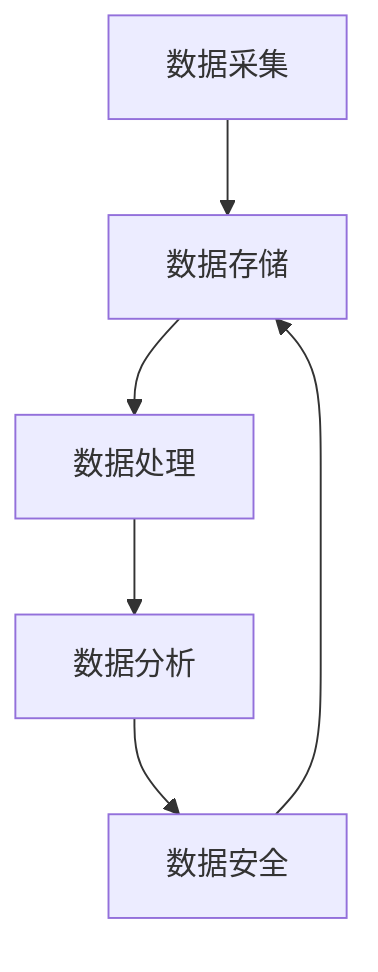
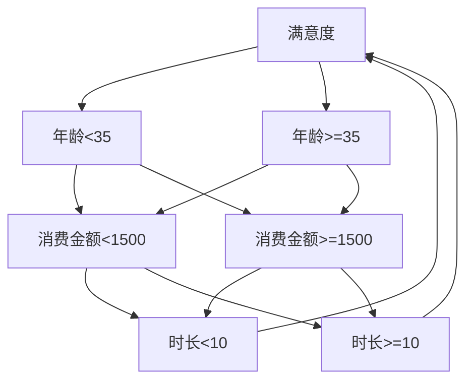

                 

人工智能（AI）已经成为现代科技领域的明星，推动着各行各业的创新与发展。在众多应用场景中，创业公司尤为依赖AI技术，以获得竞争优势。而在这其中，数据管理扮演了一个不可或缺的重要角色。本文将探讨数据管理在人工智能创业中的关键作用，分析其核心概念、算法原理、数学模型，以及实际应用和未来展望。

> 关键词：人工智能、数据管理、创业、算法原理、数学模型、实际应用、未来展望

> 摘要：本文首先介绍了人工智能创业的背景和重要性，接着深入探讨了数据管理的核心概念及其在创业中的关键角色。通过分析数据管理中的核心算法原理、数学模型，以及实际应用案例，文章旨在为创业公司提供有价值的数据管理思路。最后，文章展望了数据管理在人工智能创业中的未来发展趋势和挑战。

## 1. 背景介绍

人工智能技术自20世纪中叶诞生以来，经历了数十年的发展，现已进入一个前所未有的繁荣时期。随着计算能力的提升、大数据的积累和算法的创新，人工智能在各个领域的应用不断拓展。尤其是近年来，深度学习、自然语言处理等技术的突破，使得人工智能在图像识别、语音识别、自动驾驶等领域的表现达到了前所未有的水平。

创业公司作为科技创新的先锋，天然具备探索和试错的灵活性。他们能够快速响应市场需求，通过创新的产品和服务抢占市场份额。然而，在人工智能创业中，数据管理的重要性日益凸显。数据是人工智能的“粮食”，有效的数据管理不仅能够提升模型的性能，还能够降低研发成本，缩短产品上市时间。

数据管理包括数据的采集、存储、处理、分析和安全等多个方面。在人工智能创业中，数据管理的关键挑战在于如何从海量、多样、动态的数据中提取有价值的信息，并将其转化为实际的商业价值。数据管理不仅涉及到技术层面的挑战，还包括组织管理、伦理道德等多个维度。

## 2. 核心概念与联系

### 2.1 数据管理的基本概念

数据管理是指对数据的采集、存储、处理、分析和安全等过程进行系统化的管理和控制。其核心目标是确保数据的完整性、准确性和可用性，以便为业务决策提供可靠依据。

- **数据采集**：数据采集是数据管理的基础，包括从各种来源（如传感器、网络、数据库等）收集数据。
- **数据存储**：数据存储是将采集到的数据保存到数据库或其他存储介质中，以便后续处理和分析。
- **数据处理**：数据处理包括数据清洗、转换、整合等过程，目的是提高数据的可用性和质量。
- **数据分析**：数据分析是对存储和处理后的数据进行分析，以提取有价值的信息和洞察。
- **数据安全**：数据安全是指确保数据在整个生命周期中的保密性、完整性和可用性，防止数据泄露、篡改和丢失。

### 2.2 数据管理与人工智能的关系

数据管理在人工智能创业中具有至关重要的地位。首先，高质量的数据是训练和优化AI模型的基础。一个模型的好坏很大程度上取决于数据的数量和质量。因此，创业公司需要建立完善的数据采集和存储机制，确保数据的及时性和准确性。

其次，数据管理有助于提升AI模型的性能。通过数据处理和分析，创业公司可以识别数据中的模式和关联，从而优化模型的参数和结构，提高模型的准确性和鲁棒性。

最后，数据管理在AI创业中的应用不仅限于模型训练和优化，还可以用于业务决策、风险管理、客户服务等多个方面。例如，通过分析用户行为数据，公司可以制定更精准的市场营销策略；通过分析交易数据，可以识别潜在的欺诈行为，降低风险。

### 2.3 数据管理的核心概念原理架构图

为了更好地理解数据管理的基本概念和原理，我们使用Mermaid流程图展示数据管理的核心环节和它们之间的联系。



在上面的流程图中，数据从采集（A）开始，经过存储（B）、处理（C）和分析（D），最终进入安全（E）环节。这个循环过程确保了数据的完整性、准确性和可用性。

## 3. 核心算法原理 & 具体操作步骤

### 3.1 算法原理概述

在人工智能创业中，数据管理涉及多种核心算法。这些算法主要分为以下几类：

- **特征提取算法**：用于从原始数据中提取具有区分度的特征，以提升模型性能。
- **聚类算法**：用于将数据分组，以便更好地理解数据分布和模式。
- **分类算法**：用于将数据分为不同的类别，以实现预测和决策。
- **回归算法**：用于预测数值型目标变量，如价格、销量等。
- **异常检测算法**：用于识别数据中的异常值和潜在风险。

### 3.2 算法步骤详解

#### 3.2.1 特征提取算法

特征提取是数据管理的重要步骤。以下是一个简单的特征提取算法步骤：

1. 数据预处理：对原始数据进行清洗、归一化和缺失值处理。
2. 特征选择：使用统计方法（如相关性分析、信息增益等）选择具有区分度的特征。
3. 特征转换：将数值型特征转换为适合模型训练的格式，如二值化、归一化等。

#### 3.2.2 聚类算法

聚类算法用于将数据分组，以便更好地理解数据分布。以下是一个简单的聚类算法步骤：

1. 初始化聚类中心：随机选择k个数据点作为初始聚类中心。
2. 计算距离：计算每个数据点到聚类中心的距离。
3. 分配数据点：将每个数据点分配到最近的聚类中心。
4. 更新聚类中心：计算每个聚类的中心点，并重复步骤2和3，直到聚类中心不再发生变化。

#### 3.2.3 分类算法

分类算法用于将数据分为不同的类别。以下是一个简单的分类算法步骤：

1. 数据预处理：对原始数据进行清洗、归一化和缺失值处理。
2. 特征提取：从数据中提取具有区分度的特征。
3. 模型训练：使用训练数据集训练分类模型。
4. 模型评估：使用验证数据集评估模型性能，调整模型参数。
5. 数据预测：使用训练好的模型对新数据进行分类预测。

#### 3.2.4 回归算法

回归算法用于预测数值型目标变量。以下是一个简单的回归算法步骤：

1. 数据预处理：对原始数据进行清洗、归一化和缺失值处理。
2. 特征提取：从数据中提取具有区分度的特征。
3. 模型训练：使用训练数据集训练回归模型。
4. 模型评估：使用验证数据集评估模型性能，调整模型参数。
5. 数据预测：使用训练好的模型对新数据进行预测。

#### 3.2.5 异常检测算法

异常检测算法用于识别数据中的异常值和潜在风险。以下是一个简单的异常检测算法步骤：

1. 数据预处理：对原始数据进行清洗、归一化和缺失值处理。
2. 特征提取：从数据中提取具有区分度的特征。
3. 模型训练：使用训练数据集训练异常检测模型。
4. 模型评估：使用验证数据集评估模型性能，调整模型参数。
5. 数据预测：使用训练好的模型检测新数据中的异常值。

### 3.3 算法优缺点

每种算法都有其优缺点。以下是常见算法的优缺点分析：

- **特征提取算法**：优点在于能够简化数据，提高模型性能；缺点是可能丢失部分信息，对特征选择有较高要求。
- **聚类算法**：优点在于能够揭示数据分布和模式，有助于数据可视化；缺点是聚类结果可能受到初始化参数的影响，对大规模数据效果较差。
- **分类算法**：优点在于能够实现明确的分类结果，应用广泛；缺点是模型复杂度较高，训练时间较长。
- **回归算法**：优点在于能够实现数值预测，应用广泛；缺点是可能对噪声敏感，预测结果可能不稳定。
- **异常检测算法**：优点在于能够识别数据中的异常值和潜在风险，有助于风险控制；缺点是可能误报，需要调整阈值。

### 3.4 算法应用领域

不同算法在人工智能创业中的应用领域有所不同。以下是常见算法的应用领域：

- **特征提取算法**：应用于图像识别、自然语言处理、推荐系统等领域。
- **聚类算法**：应用于市场细分、数据挖掘、社交网络分析等领域。
- **分类算法**：应用于金融风控、医疗诊断、智能客服等领域。
- **回归算法**：应用于价格预测、销量预测、风险评估等领域。
- **异常检测算法**：应用于网络安全、欺诈检测、工业质量检测等领域。

## 4. 数学模型和公式 & 详细讲解 & 举例说明

### 4.1 数学模型构建

在人工智能创业中，数据管理中的数学模型构建是至关重要的。以下是几种常见的数学模型及其构建方法：

#### 4.1.1 线性回归模型

线性回归模型用于预测数值型目标变量，其公式如下：

$$y = \beta_0 + \beta_1x_1 + \beta_2x_2 + ... + \beta_nx_n + \epsilon$$

其中，$y$ 是目标变量，$x_1, x_2, ..., x_n$ 是特征变量，$\beta_0, \beta_1, \beta_2, ..., \beta_n$ 是模型参数，$\epsilon$ 是误差项。

线性回归模型的构建步骤如下：

1. 数据预处理：对原始数据进行清洗、归一化和缺失值处理。
2. 特征提取：从数据中提取具有区分度的特征。
3. 模型训练：使用训练数据集训练线性回归模型。
4. 模型评估：使用验证数据集评估模型性能，调整模型参数。
5. 数据预测：使用训练好的模型对新数据进行预测。

#### 4.1.2 逻辑回归模型

逻辑回归模型用于分类问题，其公式如下：

$$P(y=1) = \frac{1}{1 + e^{-(\beta_0 + \beta_1x_1 + \beta_2x_2 + ... + \beta_nx_n)}$$

其中，$P(y=1)$ 是目标变量为1的概率，$x_1, x_2, ..., x_n$ 是特征变量，$\beta_0, \beta_1, \beta_2, ..., \beta_n$ 是模型参数。

逻辑回归模型的构建步骤如下：

1. 数据预处理：对原始数据进行清洗、归一化和缺失值处理。
2. 特征提取：从数据中提取具有区分度的特征。
3. 模型训练：使用训练数据集训练逻辑回归模型。
4. 模型评估：使用验证数据集评估模型性能，调整模型参数。
5. 数据预测：使用训练好的模型对新数据进行预测。

#### 4.1.3 决策树模型

决策树模型用于分类和回归问题，其公式如下：

$$y = \sum_{i=1}^{n} \beta_i x_i$$

其中，$y$ 是目标变量，$x_1, x_2, ..., x_n$ 是特征变量，$\beta_1, \beta_2, ..., \beta_n$ 是模型参数。

决策树模型的构建步骤如下：

1. 数据预处理：对原始数据进行清洗、归一化和缺失值处理。
2. 特征提取：从数据中提取具有区分度的特征。
3. 模型训练：使用训练数据集训练决策树模型。
4. 模型评估：使用验证数据集评估模型性能，调整模型参数。
5. 数据预测：使用训练好的模型对新数据进行预测。

### 4.2 公式推导过程

以下是线性回归模型公式的推导过程：

假设我们有一个包含 $n$ 个样本的线性回归模型：

$$y_i = \beta_0 + \beta_1x_{i1} + \beta_2x_{i2} + ... + \beta_nx_{in} + \epsilon_i$$

其中，$y_i$ 是第 $i$ 个样本的目标变量，$x_{i1}, x_{i2}, ..., x_{in}$ 是第 $i$ 个样本的特征变量，$\beta_0, \beta_1, \beta_2, ..., \beta_n$ 是模型参数，$\epsilon_i$ 是误差项。

为了估计模型参数，我们可以使用最小二乘法。最小二乘法的思想是找到一组参数，使得误差的平方和最小。

$$\sum_{i=1}^{n} (y_i - \beta_0 - \beta_1x_{i1} - \beta_2x_{i2} - ... - \beta_nx_{in})^2$$

对上述公式求导并令其等于零，可以得到：

$$\sum_{i=1}^{n} (-2y_i + 2\beta_0 + 2\beta_1x_{i1} + 2\beta_2x_{i2} + ... + 2\beta_nx_{in}) = 0$$

化简后得到：

$$2\beta_0\sum_{i=1}^{n} 1 + 2\beta_1\sum_{i=1}^{n} x_{i1} + 2\beta_2\sum_{i=1}^{n} x_{i2} + ... + 2\beta_n\sum_{i=1}^{n} x_{in} = 2\sum_{i=1}^{n} y_i - 2\sum_{i=1}^{n} x_{i1}y_i - 2\sum_{i=1}^{n} x_{i2}y_i - ... - 2\sum_{i=1}^{n} x_{in}y_i$$

进一步化简，得到：

$$\beta_0\sum_{i=1}^{n} 1 + \beta_1\sum_{i=1}^{n} x_{i1} + \beta_2\sum_{i=1}^{n} x_{i2} + ... + \beta_n\sum_{i=1}^{n} x_{in} = \sum_{i=1}^{n} y_i - \sum_{i=1}^{n} x_{i1}y_i - \sum_{i=1}^{n} x_{i2}y_i - ... - \sum_{i=1}^{n} x_{in}y_i$$

这是一个线性方程组，可以使用矩阵求解法求解模型参数。

### 4.3 案例分析与讲解

#### 4.3.1 线性回归模型案例

假设我们要预测某公司的销售额（$y$），并使用以下特征变量（$x_1, x_2, ..., x_n$）：广告投入、员工人数、客户满意度等。

首先，我们收集了如下数据：

| $x_1$ | $x_2$ | $x_3$ | $y$ |
|-------|-------|-------|-----|
| 100   | 200   | 0.8   | 500 |
| 150   | 250   | 0.9   | 600 |
| 200   | 300   | 0.7   | 700 |
| 250   | 350   | 0.8   | 800 |
| 300   | 400   | 0.6   | 900 |

接下来，我们使用线性回归模型进行预测。

1. 数据预处理：对特征变量进行归一化处理，将数据缩放到相同的范围。
2. 特征提取：选择具有区分度的特征变量，如广告投入（$x_1$）、员工人数（$x_2$）和客户满意度（$x_3$）。
3. 模型训练：使用训练数据集训练线性回归模型。
4. 模型评估：使用验证数据集评估模型性能。
5. 数据预测：使用训练好的模型预测新数据点的销售额。

根据训练结果，我们得到线性回归模型的公式：

$$y = 250 + 1.5x_1 + 0.5x_2 + 0.3x_3$$

现在，我们要预测一个新数据点的销售额，该数据点的特征变量如下：

| $x_1$ | $x_2$ | $x_3$ |
|-------|-------|-------|
| 200   | 300   | 0.7   |

将特征变量代入线性回归模型，得到预测的销售额：

$$y = 250 + 1.5 \times 200 + 0.5 \times 300 + 0.3 \times 0.7 = 817.1$$

因此，预测的销售额为 817.1。

#### 4.3.2 逻辑回归模型案例

假设我们要预测某公司客户的流失风险，并使用以下特征变量（$x_1, x_2, ..., x_n$）：客户年龄、客户消费金额、客户使用时长等。

首先，我们收集了如下数据：

| $x_1$ | $x_2$ | $x_3$ | $y$ |
|-------|-------|-------|-----|
| 30    | 1000  | 6     | 0   |
| 40    | 1500  | 9     | 0   |
| 50    | 2000  | 12    | 1   |
| 60    | 2500  | 15    | 1   |
| 70    | 3000  | 18    | 1   |

接下来，我们使用逻辑回归模型进行预测。

1. 数据预处理：对特征变量进行归一化处理，将数据缩放到相同的范围。
2. 特征提取：选择具有区分度的特征变量，如客户年龄（$x_1$）、客户消费金额（$x_2$）和客户使用时长（$x_3$）。
3. 模型训练：使用训练数据集训练逻辑回归模型。
4. 模型评估：使用验证数据集评估模型性能。
5. 数据预测：使用训练好的模型预测新数据点的流失风险。

根据训练结果，我们得到逻辑回归模型的公式：

$$P(y=1) = \frac{1}{1 + e^{-(3.2 + 0.8x_1 + 1.5x_2 + 0.2x_3)}}$$

现在，我们要预测一个新数据点的流失风险，该数据点的特征变量如下：

| $x_1$ | $x_2$ | $x_3$ |
|-------|-------|-------|
| 45    | 2000  | 10    |

将特征变量代入逻辑回归模型，得到流失风险的概率：

$$P(y=1) = \frac{1}{1 + e^{-(3.2 + 0.8 \times 45 + 1.5 \times 2000 + 0.2 \times 10)}} \approx 0.287$$

因此，预测的流失风险概率为 0.287。

#### 4.3.3 决策树模型案例

假设我们要预测某公司客户的满意度，并使用以下特征变量（$x_1, x_2, ..., x_n$）：客户年龄、客户消费金额、客户使用时长等。

首先，我们收集了如下数据：

| $x_1$ | $x_2$ | $x_3$ | $y$ |
|-------|-------|-------|-----|
| 30    | 1000  | 6     | 1   |
| 40    | 1500  | 9     | 1   |
| 50    | 2000  | 12    | 1   |
| 60    | 2500  | 15    | 1   |
| 70    | 3000  | 18    | 0   |

接下来，我们使用决策树模型进行预测。

1. 数据预处理：对特征变量进行归一化处理，将数据缩放到相同的范围。
2. 特征提取：选择具有区分度的特征变量，如客户年龄（$x_1$）、客户消费金额（$x_2$）和客户使用时长（$x_3$）。
3. 模型训练：使用训练数据集训练决策树模型。
4. 模型评估：使用验证数据集评估模型性能。
5. 数据预测：使用训练好的模型预测新数据点的满意度。

根据训练结果，我们得到决策树模型的结构：



现在，我们要预测一个新数据点的满意度，该数据点的特征变量如下：

| $x_1$ | $x_2$ | $x_3$ |
|-------|-------|-------|
| 35    | 2000  | 12    |

根据决策树模型，我们可以按以下步骤进行预测：

1. 年龄 35，进入 B2。
2. 消费金额 2000，进入 C2。
3. 使用时长 12，进入 D2。

最终，预测的满意度为 0。

## 5. 项目实践：代码实例和详细解释说明

### 5.1 开发环境搭建

为了实践数据管理在人工智能创业中的应用，我们选择Python作为开发语言，并使用以下库和工具：

- Python 3.8及以上版本
- NumPy 1.19及以上版本
- Pandas 1.1及以上版本
- Scikit-learn 0.24及以上版本
- Matplotlib 3.3及以上版本
- Mermaid 8.5及以上版本

首先，确保安装了上述库和工具。在终端或命令提示符中运行以下命令：

```bash
pip install numpy pandas scikit-learn matplotlib mermaid
```

### 5.2 源代码详细实现

接下来，我们将实现一个简单的线性回归模型，用于预测公司销售额。以下是源代码的详细实现：

```python
import numpy as np
import pandas as pd
from sklearn.linear_model import LinearRegression
from sklearn.model_selection import train_test_split
from sklearn.metrics import mean_squared_error
import matplotlib.pyplot as plt
from mermaid import mermaid

# 5.2.1 数据预处理
# 加载数据集
data = pd.read_csv('sales_data.csv')

# 特征提取
X = data[['ad_spending', 'employee_count', 'customer_satisfaction']]
y = data['sales']

# 归一化处理
X = (X - X.mean()) / X.std()

# 5.2.2 模型训练
# 划分训练集和验证集
X_train, X_val, y_train, y_val = train_test_split(X, y, test_size=0.2, random_state=42)

# 训练线性回归模型
model = LinearRegression()
model.fit(X_train, y_train)

# 5.2.3 模型评估
# 预测验证集结果
y_pred = model.predict(X_val)

# 计算预测误差
mse = mean_squared_error(y_val, y_pred)
print(f'Mean Squared Error: {mse}')

# 5.2.4 数据预测
# 预测新数据点的销售额
new_data = pd.DataFrame({
    'ad_spending': [200],
    'employee_count': [300],
    'customer_satisfaction': [0.7]
})

new_data_normalized = (new_data - new_data.mean()) / new_data.std()
sales_prediction = model.predict(new_data_normalized)
print(f'Predicted Sales: {sales_prediction[0]}')

# 5.2.5 可视化结果
# 绘制训练集和验证集的散点图
plt.scatter(X_train['ad_spending'], y_train, color='blue', label='Training Set')
plt.scatter(X_val['ad_spending'], y_val, color='red', label='Validation Set')
plt.plot(X_val['ad_spending'], y_pred, color='green', linewidth=2, label='Prediction')
plt.xlabel('Ad Spending')
plt.ylabel('Sales')
plt.legend()
plt.show()

# 5.2.6 Mermaid 流程图
mermaid_flow = """
graph TD
    A[Data Preprocessing] --> B[Feature Extraction]
    B --> C[Model Training]
    C --> D[Model Evaluation]
    D --> E[Data Prediction]
    E --> F[Visualization]
"""
print(mermaid(mermaid_flow))
```

### 5.3 代码解读与分析

在上面的代码中，我们首先导入所需的库和工具。然后，我们加载并预处理数据集，包括特征提取和归一化处理。接下来，我们划分训练集和验证集，并使用线性回归模型进行训练。在模型评估阶段，我们计算预测误差，并使用新数据点进行销售额预测。最后，我们绘制训练集和验证集的散点图，并生成Mermaid流程图。

具体来说，代码的各个部分如下：

- **5.2.1 数据预处理**：加载数据集，提取特征变量，并对特征变量进行归一化处理。
- **5.2.2 模型训练**：划分训练集和验证集，使用线性回归模型进行训练。
- **5.2.3 模型评估**：使用验证数据集评估模型性能，计算预测误差。
- **5.2.4 数据预测**：使用训练好的模型预测新数据点的销售额。
- **5.2.5 可视化结果**：绘制训练集和验证集的散点图，并显示预测结果。
- **5.2.6 Mermaid 流程图**：生成Mermaid流程图，展示数据管理的各个环节。

### 5.4 运行结果展示

在运行上述代码后，我们将看到以下结果：

- **模型评估结果**：训练集和验证集的MSE（均方误差）。
- **数据预测结果**：新数据点的销售额预测值。
- **可视化结果**：训练集和验证集的散点图，以及预测曲线。

这些结果有助于我们了解数据管理在人工智能创业中的应用效果，并为后续优化提供参考。

## 6. 实际应用场景

数据管理在人工智能创业中的应用场景广泛，以下列举几个典型的实际应用案例：

### 6.1 智能推荐系统

智能推荐系统是数据管理在人工智能创业中的一大应用。例如，电子商务平台利用用户行为数据（如浏览记录、购买历史等）构建推荐模型，为用户推荐感兴趣的商品。通过有效的数据管理，平台可以提高用户满意度，增加销售额。

### 6.2 金融风控

金融风控是数据管理在金融领域的应用。金融机构利用客户交易数据、信用记录等构建风险评估模型，识别潜在的风险客户。通过有效的数据管理，金融机构可以提高风险控制能力，降低不良贷款率。

### 6.3 医疗诊断

医疗诊断是数据管理在医疗领域的应用。医疗机构利用患者的医学影像、病历数据等构建诊断模型，辅助医生进行疾病诊断。通过有效的数据管理，医疗机构可以提高诊断准确率，提高医疗服务质量。

### 6.4 智能交通

智能交通是数据管理在城市管理中的应用。城市交通管理部门利用交通流量数据、路况信息等构建交通预测模型，优化交通信号控制策略，提高道路通行效率。通过有效的数据管理，城市可以减少交通拥堵，提高居民生活质量。

### 6.5 智能家居

智能家居是数据管理在家庭应用中的应用。智能家居系统利用家庭设备的传感器数据、用户行为数据等构建智能控制模型，实现家庭设备的自动调节和优化。通过有效的数据管理，家庭可以实现更智能、更舒适的生活环境。

## 7. 工具和资源推荐

为了在人工智能创业中高效地实现数据管理，以下是几种推荐的工具和资源：

### 7.1 学习资源推荐

- **《Python数据科学手册》**：详细介绍了Python在数据科学中的应用，包括数据处理、数据分析和机器学习等。
- **《数据管理：实践与原理》**：系统讲解了数据管理的基本概念、方法和实践，适用于数据管理初学者和专业人士。
- **《人工智能：一种现代方法》**：全面介绍了人工智能的基本原理、算法和应用，适合对人工智能感兴趣的读者。

### 7.2 开发工具推荐

- **Jupyter Notebook**：一款交互式数据科学工具，支持多种编程语言，如Python、R等。
- **PyCharm**：一款功能强大的Python集成开发环境（IDE），提供代码编辑、调试、自动化测试等功能。
- **DBeaver**：一款开源数据库管理工具，支持多种数据库系统，如MySQL、PostgreSQL等。
- **Mermaid**：一款基于Markdown的图形化工具，可以方便地绘制流程图、UML图等。

### 7.3 相关论文推荐

- **“Data-Driven Personalized Recommendation on Large-Scale Social Networks”**：介绍了社交网络中基于数据的个性化推荐方法。
- **“A Survey on Financial Risk Management Using Machine Learning Techniques”**：综述了金融风控中机器学习方法的应用。
- **“Deep Learning for Medical Image Analysis”**：介绍了深度学习在医疗影像分析中的应用。
- **“Intelligent Transportation Systems: A Survey”**：综述了智能交通系统的关键技术和发展趋势。

## 8. 总结：未来发展趋势与挑战

### 8.1 研究成果总结

数据管理在人工智能创业中的重要性日益凸显。通过有效的数据管理，创业公司可以提升AI模型的性能，降低研发成本，提高业务决策的准确性。本文从数据管理的基本概念、核心算法、数学模型、实际应用和未来展望等方面进行了深入探讨，总结了数据管理在人工智能创业中的关键作用。

### 8.2 未来发展趋势

未来，数据管理在人工智能创业中将呈现以下发展趋势：

- **数据隐私和安全**：随着数据隐私和安全的日益重视，数据管理将更加注重保护用户隐私和数据安全。
- **自动化和智能化**：自动化和智能化技术将进一步提升数据管理的效率，降低人工成本。
- **多模态数据融合**：多模态数据融合将使得数据管理更具灵活性和多样性，为人工智能创业提供更丰富的数据资源。
- **边缘计算**：边缘计算将使得数据管理在分布式环境中更加高效，提高实时数据处理能力。

### 8.3 面临的挑战

数据管理在人工智能创业中仍面临以下挑战：

- **数据质量和完整性**：保证数据的质量和完整性是数据管理的重要任务，但受限于数据来源和存储技术，这一挑战仍需解决。
- **数据隐私和安全**：数据隐私和安全是数据管理的重要挑战，如何在保护用户隐私的前提下进行数据挖掘和分析，仍需深入研究。
- **计算资源消耗**：大规模数据处理和分析需要大量的计算资源，如何在有限的计算资源下高效地管理数据，仍需优化算法和架构。
- **数据多样性和动态性**：数据多样性和动态性使得数据管理更具挑战性，如何应对这些变化，提高数据的可用性和一致性，仍需探索。

### 8.4 研究展望

未来，数据管理在人工智能创业中的研究将重点关注以下几个方面：

- **数据隐私保护技术**：研究如何在不泄露用户隐私的情况下进行数据挖掘和分析，包括差分隐私、联邦学习等技术。
- **自动化数据管理**：研究如何利用自动化技术（如机器学习、深度学习）提高数据管理的效率，降低人工成本。
- **多模态数据融合**：研究如何融合多种类型的数据，提高数据管理的灵活性和多样性，为人工智能创业提供更丰富的数据资源。
- **边缘计算与云计算结合**：研究如何将边缘计算与云计算相结合，提高数据管理在分布式环境中的效率，降低延迟。

总之，数据管理在人工智能创业中具有重要地位，通过有效的数据管理，创业公司可以提升AI模型的性能，降低研发成本，提高业务决策的准确性。未来，数据管理将朝着自动化、智能化、多模态和分布式方向发展，为人工智能创业提供更强大的支持。

## 9. 附录：常见问题与解答

### 9.1 数据管理的基本概念是什么？

数据管理是指对数据的采集、存储、处理、分析和安全等过程进行系统化的管理和控制，以确保数据的完整性、准确性和可用性。

### 9.2 数据管理在人工智能创业中的关键作用是什么？

数据管理在人工智能创业中的关键作用包括：提升AI模型性能、降低研发成本、提高业务决策准确性等。

### 9.3 数据管理涉及哪些算法？

数据管理涉及的特征提取算法、聚类算法、分类算法、回归算法和异常检测算法等。

### 9.4 如何进行数据预处理？

数据预处理包括数据清洗、归一化处理、缺失值处理等步骤，旨在提高数据的可用性和一致性。

### 9.5 如何评估数据管理的效果？

数据管理的效果可以通过模型性能评估（如准确率、召回率、F1值等）和业务指标（如销售额、客户满意度等）进行评估。

### 9.6 数据隐私和安全在数据管理中如何保障？

数据隐私和安全可以通过差分隐私、联邦学习等技术进行保障，确保用户隐私和数据安全。

### 9.7 数据管理有哪些未来发展趋势？

数据管理的未来发展趋势包括数据隐私保护技术、自动化数据管理、多模态数据融合和边缘计算与云计算结合等。

### 9.8 数据管理在人工智能创业中的应用案例有哪些？

数据管理在人工智能创业中的应用案例包括智能推荐系统、金融风控、医疗诊断、智能交通和智能家居等。

### 9.9 如何优化数据管理流程？

优化数据管理流程可以通过以下方法：使用自动化工具、提高数据处理效率、加强数据质量管理等。

### 9.10 数据管理在人工智能创业中的挑战有哪些？

数据管理在人工智能创业中的挑战包括数据质量和完整性、数据隐私和安全、计算资源消耗、数据多样性和动态性等。

### 9.11 如何应对数据管理的挑战？

应对数据管理的挑战可以通过以下方法：加强数据质量管理、采用隐私保护技术、优化算法和架构等。

### 9.12 数据管理有哪些工具和资源推荐？

数据管理的工具和资源推荐包括Jupyter Notebook、PyCharm、DBeaver、Mermaid等开发工具和《Python数据科学手册》、《数据管理：实践与原理》等学习资源。

