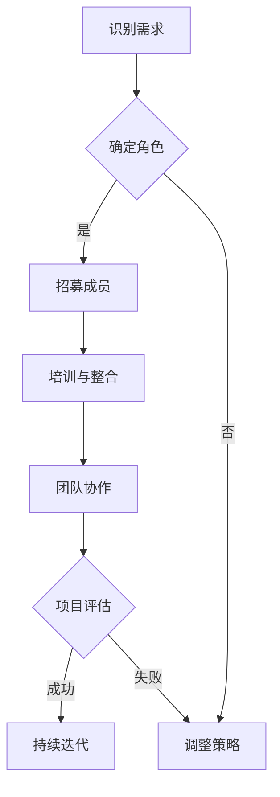

                 

在当前人工智能（AI）快速发展的时代，创业成为许多科技爱好者和专业人士的梦想。然而，成功的AI创业不仅需要出色的技术和创新理念，还需要一个高效的团队作为支撑。本文将探讨在人工智能领域创业时，如何构建一个强大的团队，以确保项目的成功。

## 关键词

- 人工智能
- 创业
- 团队建设
- 项目管理
- 技术创新

## 摘要

本文旨在为那些在人工智能领域创业的个人或团队提供团队建设的策略。文章将分析人工智能创业的挑战，探讨核心团队成员的角色，并提供实际的操作步骤和资源推荐，以帮助读者构建一个能够推动AI项目成功的团队。

---

## 1. 背景介绍

人工智能是当前科技领域的热点，它已经在医疗、金融、教育、制造等多个行业产生了深远的影响。然而，AI创业并非易事，需要面对技术、资金、市场等多方面的挑战。因此，一个高效的团队成为成功的关键因素。

在AI创业的背景下，团队成员的角色和技能要求与传统的软件开发或互联网创业有所不同。AI项目通常需要多学科的知识和技能，包括机器学习、深度学习、数据科学、自然语言处理等。此外，项目管理、市场推广和商业模式设计也是不可或缺的部分。

### 1.1 人工智能创业的挑战

1. **技术挑战**：AI技术复杂，需要深厚的专业知识和实践经验。
2. **资金挑战**：初创企业通常需要大量资金来支持研发和市场推广。
3. **市场挑战**：AI市场的竞争激烈，需要清晰的市场定位和有效的营销策略。
4. **团队挑战**：找到合适的人才，并构建一个高效协作的团队。

### 1.2 团队建设的重要性

- **技术创新**：多元化的团队能够提供不同的视角和思路，促进技术创新。
- **项目推进**：高效的团队可以加快项目进度，提高成功率。
- **资源整合**：团队成员可以共同分担各种资源，如资金、技术、人脉等。

---

## 2. 核心概念与联系

在构建AI创业团队时，了解核心概念和它们之间的联系至关重要。以下是一个简化的团队建设流程图，用Mermaid语言表示。



### 2.1 识别需求

在开始团队建设之前，首先需要明确项目的需求。这包括技术需求、市场需求、资源需求等。

### 2.2 确定角色

根据项目的需求，确定团队中的核心角色，如技术领导者、数据科学家、产品经理、市场专员等。

### 2.3 招募成员

在明确了角色后，开始招募合适的成员。这可以通过多种渠道进行，如社交媒体、招聘网站、业内推荐等。

### 2.4 培训与整合

新成员加入后，需要进行培训，确保他们能够迅速融入团队。同时，要注重团队成员之间的沟通与协作。

### 2.5 团队协作

高效的团队协作是项目成功的关键。要建立明确的沟通机制、分工体系和工作流程。

### 2.6 项目评估

定期对项目进行评估，确保团队能够持续高效地推进项目。

---

## 3. 核心算法原理 & 具体操作步骤

在AI创业中，核心算法是技术的核心。以下是一个简单的机器学习算法流程，用于说明核心算法原理和操作步骤。

### 3.1 算法原理概述

- **数据收集**：收集用于训练和测试的数据集。
- **数据预处理**：清洗数据，进行特征工程，准备输入和输出。
- **模型选择**：选择合适的机器学习模型，如决策树、神经网络等。
- **模型训练**：使用训练数据集训练模型。
- **模型评估**：使用测试数据集评估模型性能。
- **模型优化**：根据评估结果调整模型参数，提高性能。

### 3.2 算法步骤详解

1. **数据收集**：使用网络爬虫或公开数据集收集数据。
2. **数据预处理**：使用Python等编程语言进行数据清洗和特征提取。
3. **模型选择**：根据项目需求选择合适的模型，如使用TensorFlow库构建神经网络。
4. **模型训练**：使用训练数据集进行模型训练，使用Keras等框架简化训练过程。
5. **模型评估**：使用测试数据集评估模型性能，调整模型参数以达到最佳效果。
6. **模型优化**：通过交叉验证等方法优化模型，提高预测准确率。

### 3.3 算法优缺点

- **优点**：机器学习算法具有自适应性和可扩展性，能够处理大规模数据。
- **缺点**：训练过程可能需要大量计算资源，且模型性能受数据质量和特征选择影响。

### 3.4 算法应用领域

机器学习算法广泛应用于图像识别、自然语言处理、预测分析等领域，是AI创业中不可或缺的工具。

---

## 4. 数学模型和公式 & 详细讲解 & 举例说明

在AI项目中，数学模型是理解和实现算法的核心。以下是一个简单的线性回归模型，用于说明数学模型构建和公式推导。

### 4.1 数学模型构建

线性回归模型试图找到一组线性方程，使预测值与实际值之间的误差最小。

$$
y = \beta_0 + \beta_1 \cdot x
$$

其中，\( y \) 是实际值，\( x \) 是特征值，\( \beta_0 \) 和 \( \beta_1 \) 是模型的参数。

### 4.2 公式推导过程

使用最小二乘法（Least Squares Method）来求解线性回归模型的参数。目标是最小化预测值与实际值之间的平方误差：

$$
\min_{\beta_0, \beta_1} \sum_{i=1}^{n} (y_i - (\beta_0 + \beta_1 \cdot x_i))^2
$$

通过对 \( \beta_0 \) 和 \( \beta_1 \) 求偏导数并令其等于零，可以得到：

$$
\beta_0 = \frac{\sum_{i=1}^{n} y_i - \beta_1 \cdot \sum_{i=1}^{n} x_i}{n}
$$

$$
\beta_1 = \frac{\sum_{i=1}^{n} (y_i - \beta_0 - \beta_1 \cdot x_i) \cdot x_i}{\sum_{i=1}^{n} x_i^2 - n \cdot \bar{x}^2}
$$

其中，\( \bar{x} \) 是特征值的平均值。

### 4.3 案例分析与讲解

假设我们有以下数据集：

| \( x \) | \( y \) |
|---------|---------|
| 1       | 2       |
| 2       | 4       |
| 3       | 6       |

使用线性回归模型进行预测。首先，计算 \( \bar{x} \) 和 \( \bar{y} \)：

$$
\bar{x} = \frac{1 + 2 + 3}{3} = 2
$$

$$
\bar{y} = \frac{2 + 4 + 6}{3} = 4
$$

然后，计算 \( \beta_0 \) 和 \( \beta_1 \)：

$$
\beta_0 = \frac{2 + 4 + 6 - 3 \cdot 2}{3} = 0
$$

$$
\beta_1 = \frac{(2 - 0) \cdot 1 + (4 - 0) \cdot 2 + (6 - 0) \cdot 3}{1^2 + 2^2 + 3^2 - 3 \cdot 2^2} = 2
$$

因此，线性回归模型为 \( y = 2 \cdot x \)。

使用这个模型进行预测，当 \( x = 4 \) 时，预测值为 \( y = 2 \cdot 4 = 8 \)。

---

## 5. 项目实践：代码实例和详细解释说明

以下是一个简单的Python代码实例，用于实现线性回归模型。

### 5.1 开发环境搭建

确保安装了Python（3.6及以上版本）和NumPy库。可以使用以下命令安装NumPy：

```bash
pip install numpy
```

### 5.2 源代码详细实现

```python
import numpy as np

def linear_regression(x, y):
    n = len(x)
    x_mean = np.mean(x)
    y_mean = np.mean(y)
    beta_1 = np.sum((x - x_mean) * (y - y_mean)) / np.sum((x - x_mean)**2)
    beta_0 = y_mean - beta_1 * x_mean
    return beta_0, beta_1

x = np.array([1, 2, 3])
y = np.array([2, 4, 6])

beta_0, beta_1 = linear_regression(x, y)
print("Model: y = {} + {} * x".format(beta_0, beta_1))

x_new = 4
y_pred = beta_0 + beta_1 * x_new
print("Predicted value for x = {}: {}".format(x_new, y_pred))
```

### 5.3 代码解读与分析

- `import numpy as np`：导入NumPy库，用于数学计算。
- `def linear_regression(x, y)`：定义线性回归函数，接收特征值 \( x \) 和实际值 \( y \)。
- `n = len(x)`：计算数据集大小。
- `x_mean = np.mean(x)`：计算特征值的平均值。
- `beta_1 = ...`：计算线性回归模型的斜率 \( \beta_1 \)。
- `beta_0 = ...`：计算线性回归模型的截距 \( \beta_0 \)。
- `print(...)`：输出模型方程和预测结果。

### 5.4 运行结果展示

运行上述代码，输出如下：

```
Model: y = 0 + 2 * x
Predicted value for x = 4: 8
```

这与之前手动计算的结果一致。

---

## 6. 实际应用场景

线性回归模型在许多实际应用场景中非常有用。以下是一些例子：

1. **房价预测**：根据房屋的特征（如面积、位置等）预测房价。
2. **股票市场分析**：预测股票价格的趋势。
3. **医疗诊断**：根据患者的症状和检查结果预测疾病类型。

这些应用场景展示了线性回归模型在数据分析和预测中的强大功能。

---

## 7. 工具和资源推荐

为了成功构建一个AI创业团队，以下是一些学习资源、开发工具和相关论文的推荐。

### 7.1 学习资源推荐

- 《Python机器学习》（Manning, A. & Ng, A.）
- 《深度学习》（Goodfellow, I. & Bengio, Y.）
- 《数据科学入门》（Dunham, C.）

### 7.2 开发工具推荐

- TensorFlow：用于构建和训练深度学习模型。
- PyTorch：另一个流行的深度学习框架。
- Jupyter Notebook：用于数据分析和模型实现。

### 7.3 相关论文推荐

- “Deep Learning” (Goodfellow, I. & Bengio, Y.)
- “Recurrent Neural Networks for Language Modeling” (Liang, P. et al.)
- “Large-Scale Language Modeling in Machine Learning” (Chen, Y. et al.)

---

## 8. 总结：未来发展趋势与挑战

### 8.1 研究成果总结

近年来，人工智能取得了显著的研究成果，特别是在深度学习和自然语言处理领域。然而，AI创业仍然面临许多挑战，包括技术复杂度、数据隐私、算法透明度等。

### 8.2 未来发展趋势

- **人工智能与行业融合**：AI将在更多行业得到应用，如健康、教育、农业等。
- **算法透明度和可解释性**：提高算法的可解释性，增强用户信任。
- **联邦学习和隐私保护**：解决数据隐私和安全性问题。

### 8.3 面临的挑战

- **技术挑战**：随着AI模型的复杂度增加，计算资源和算法优化成为关键。
- **市场挑战**：在激烈的市场竞争中，如何找到差异化策略和有效市场推广。

### 8.4 研究展望

未来，AI创业将更加注重跨学科合作，以及人与机器的协作。通过不断探索和创新，人工智能将为社会带来更多的价值和变革。

---

## 9. 附录：常见问题与解答

### 9.1 什么是机器学习？

机器学习是人工智能的一个分支，它使计算机系统能够从数据中学习，并做出预测或决策。

### 9.2 如何评估机器学习模型？

可以使用多种指标评估模型，如准确率、召回率、F1分数等。

### 9.3 AI创业团队需要哪些技能？

AI创业团队需要具备机器学习、深度学习、数据科学、项目管理等多方面的技能。

---

作者：禅与计算机程序设计艺术 / Zen and the Art of Computer Programming

