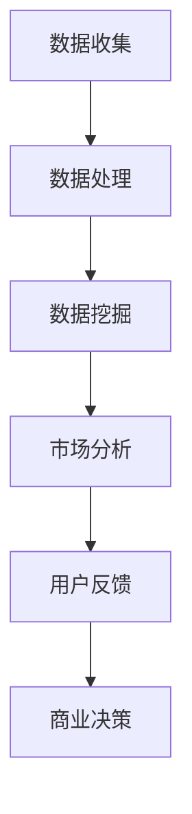
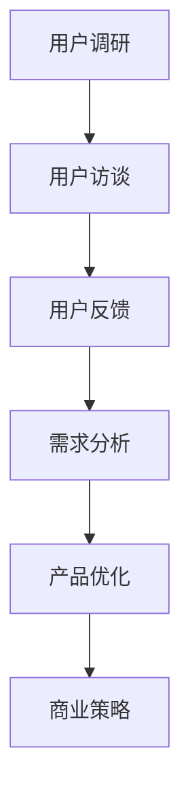
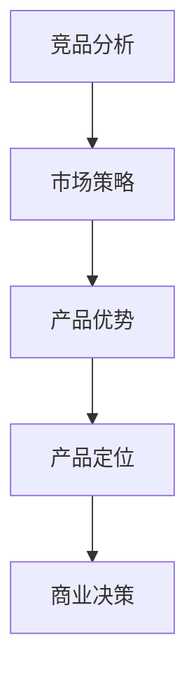
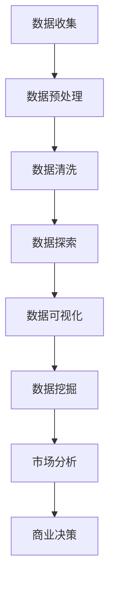

                 

关键词：人工智能创业、市场需求、识别方法、商业策略、数据分析、用户反馈、竞争分析

> 摘要：在人工智能创业领域，成功的关键在于对市场需求的准确识别。本文将深入探讨人工智能创业项目的市场需求识别方法，包括数据分析、用户反馈、竞争分析等方面，帮助创业者更好地把握市场脉搏，制定有效的商业策略。

## 1. 背景介绍

随着人工智能技术的迅猛发展，越来越多的创业者开始将目光投向这一领域。然而，市场环境的复杂多变以及竞争的激烈程度，使得如何识别并满足市场需求成为人工智能创业项目成功的关键。准确识别市场需求不仅有助于产品定位，还能优化资源配置，提高市场占有率。

本文将从以下几个角度探讨人工智能创业项目的市场需求识别方法：

1. 数据分析：利用大数据技术进行市场趋势分析、用户行为分析等。
2. 用户反馈：通过用户调研、用户访谈等方式获取用户真实需求。
3. 竞争分析：分析竞争对手的产品、市场策略，找出自身优势。
4. 商业模式创新：结合市场需求，探索创新的商业模式。

## 2. 核心概念与联系

### 2.1 数据分析

数据分析是识别市场需求的重要手段。通过收集、处理和分析大量数据，创业者可以了解市场趋势、用户需求、竞争对手等信息。

#### Mermaid 流程图：



### 2.2 用户反馈

用户反馈是获取用户真实需求的关键。通过用户调研、用户访谈等方式，创业者可以深入了解用户的需求、偏好和痛点。

#### Mermaid 流程图：



### 2.3 竞争分析

竞争分析是识别市场需求的重要环节。通过分析竞争对手的产品、市场策略，创业者可以找出自身的优势，为产品定位和市场拓展提供依据。

#### Mermaid 流程图：



## 3. 核心算法原理 & 具体操作步骤

### 3.1 算法原理概述

市场需求识别方法的核心算法主要包括数据挖掘、机器学习和数据可视化等技术。这些算法可以帮助创业者从海量数据中提取有价值的信息，为市场分析和商业决策提供支持。

### 3.2 算法步骤详解

#### 3.2.1 数据收集

- 数据来源：互联网、数据库、社交媒体等。
- 数据类型：结构化数据、非结构化数据、半结构化数据等。

#### 3.2.2 数据预处理

- 数据清洗：去除重复数据、缺失数据、异常数据等。
- 数据转换：将不同数据格式转换为统一格式。

#### 3.2.3 数据挖掘

- 方法：关联规则挖掘、分类算法、聚类算法等。
- 目标：提取有价值的信息，如用户需求、市场趋势等。

#### 3.2.4 数据可视化

- 工具：Matplotlib、Seaborn、Tableau等。
- 目标：将数据以图表形式展示，便于分析和解读。

### 3.3 算法优缺点

#### 优点

- 高效：快速从海量数据中提取有价值信息。
- 准确：利用机器学习算法提高预测精度。
- 可视化：便于分析和解读数据。

#### 缺点

- 复杂：需要具备一定的技术背景。
- 数据依赖：数据质量对算法效果有重要影响。

### 3.4 算法应用领域

- 市场趋势预测：帮助企业了解市场发展趋势，制定营销策略。
- 用户行为分析：帮助企业了解用户需求，优化产品设计。
- 竞争分析：帮助企业了解竞争对手，制定有针对性的市场策略。

## 4. 数学模型和公式 & 详细讲解 & 举例说明

### 4.1 数学模型构建

市场需求识别方法的核心数学模型主要包括线性回归、逻辑回归、决策树等。

#### 4.1.1 线性回归

- 公式：$$y = \beta_0 + \beta_1x_1 + \beta_2x_2 + ... + \beta_nx_n$$
- 解释：$y$ 为因变量，$x_1, x_2, ..., x_n$ 为自变量，$\beta_0, \beta_1, ..., \beta_n$ 为回归系数。

#### 4.1.2 逻辑回归

- 公式：$$P(y=1) = \frac{1}{1 + e^{-(\beta_0 + \beta_1x_1 + \beta_2x_2 + ... + \beta_nx_n)}}$$
- 解释：$P(y=1)$ 为因变量 $y$ 等于 1 的概率，$e$ 为自然对数的底。

#### 4.1.3 决策树

- 公式：$$G(x) = \sum_{i=1}^{n}\alpha_i I(x \in R_i)$$
- 解释：$G(x)$ 为决策树函数，$\alpha_i$ 为决策树叶子节点权重，$R_i$ 为决策树第 $i$ 个叶子节点的区域。

### 4.2 公式推导过程

#### 4.2.1 线性回归推导

假设 $y$ 和 $x_1, x_2, ..., x_n$ 之间满足线性关系，即：

$$y = \beta_0 + \beta_1x_1 + \beta_2x_2 + ... + \beta_nx_n + \epsilon$$

其中，$\epsilon$ 为误差项。

对上式两边求期望，得到：

$$\mathbb{E}(y) = \mathbb{E}(\beta_0 + \beta_1x_1 + \beta_2x_2 + ... + \beta_nx_n + \epsilon)$$

由于期望的线性性质，可得：

$$\mathbb{E}(y) = \beta_0 + \beta_1\mathbb{E}(x_1) + \beta_2\mathbb{E}(x_2) + ... + \beta_n\mathbb{E}(x_n)$$

将 $x_1, x_2, ..., x_n$ 的期望值代入，得到线性回归模型：

$$y = \beta_0 + \beta_1x_1 + \beta_2x_2 + ... + \beta_nx_n$$

#### 4.2.2 逻辑回归推导

假设 $y$ 和 $x_1, x_2, ..., x_n$ 之间满足逻辑关系，即：

$$P(y=1) = \frac{1}{1 + e^{-(\beta_0 + \beta_1x_1 + \beta_2x_2 + ... + \beta_nx_n)}}$$

对上式两边取对数，得到：

$$\ln(P(y=1)) = -\beta_0 - \beta_1x_1 - \beta_2x_2 - ... - \beta_nx_n$$

令 $z = \beta_0 + \beta_1x_1 + \beta_2x_2 + ... + \beta_nx_n$，则上式可写为：

$$\ln(P(y=1)) = -z$$

对 $z$ 求导，得到：

$$\frac{\partial}{\partial z} \ln(P(y=1)) = -1$$

由链式法则可得：

$$\frac{\partial}{\partial x} \ln(P(y=1)) = \frac{\partial z}{\partial x} \frac{\partial}{\partial z} \ln(P(y=1)) = -\frac{\partial z}{\partial x}$$

由于 $z$ 是 $x_1, x_2, ..., x_n$ 的线性组合，可得：

$$\frac{\partial z}{\partial x} = \beta_1 + \beta_2 + ... + \beta_n$$

因此，逻辑回归模型的导数为：

$$\frac{\partial}{\partial x} \ln(P(y=1)) = -(\beta_1 + \beta_2 + ... + \beta_n)$$

#### 4.2.3 决策树推导

假设 $x_1, x_2, ..., x_n$ 为输入特征，$y$ 为输出标签，决策树模型的决策函数为：

$$G(x) = \sum_{i=1}^{n}\alpha_i I(x \in R_i)$$

其中，$R_i$ 为决策树第 $i$ 个叶子节点的区域，$\alpha_i$ 为决策树叶子节点权重。

对于第 $i$ 个叶子节点，假设其对应的区域为 $R_i$，则：

$$G(x) = \begin{cases} 
\alpha_1 & \text{if } x \in R_1 \\
\alpha_2 & \text{if } x \in R_2 \\
... \\
\alpha_n & \text{if } x \in R_n 
\end{cases}$$

对于每个区域 $R_i$，假设其对应的标签为 $y_i$，则：

$$G(x) = \sum_{i=1}^{n}\alpha_i I(x \in R_i) = \alpha_1 I(x \in R_1) + \alpha_2 I(x \in R_2) + ... + \alpha_n I(x \in R_n) = y_1 I(x \in R_1) + y_2 I(x \in R_2) + ... + y_n I(x \in R_n)$$

将 $I(x \in R_i)$ 展开为 $y_i$ 的线性组合，得到决策树模型的决策函数：

$$G(x) = y_1 I(x \in R_1) + y_2 I(x \in R_2) + ... + y_n I(x \in R_n) = \sum_{i=1}^{n}y_i I(x \in R_i) = \sum_{i=1}^{n}y_i \alpha_i$$

其中，$\alpha_i = I(x \in R_i)$，即决策树叶子节点权重。

### 4.3 案例分析与讲解

#### 案例一：市场趋势预测

假设某人工智能创业公司致力于开发一款面向医疗行业的智能诊断系统。为了预测未来几年的市场趋势，公司可以利用线性回归模型对过去几年的医疗数据进行分析。

数据收集：收集过去 5 年的年度医疗数据，包括医院就诊量、药品销售额、医疗设备销售量等。

数据处理：对收集到的医疗数据进行清洗和转换，将不同类型的数据格式转换为统一格式。

数据挖掘：利用线性回归模型，将年度医疗数据作为自变量，预测未来几年的市场趋势。

数据可视化：将预测结果以图表形式展示，便于分析和解读。

案例分析与讲解：通过线性回归模型，公司可以预测未来几年的市场趋势，为产品研发和市场营销提供依据。

#### 案例二：用户行为分析

假设某人工智能创业公司开发了一款面向智能教育的学习平台。为了了解用户需求，公司可以利用逻辑回归模型对用户行为数据进行分析。

数据收集：收集用户在学习平台上的行为数据，包括学习时长、学习进度、课程评分等。

数据处理：对收集到的用户行为数据进行清洗和转换，将不同类型的数据格式转换为统一格式。

数据挖掘：利用逻辑回归模型，分析用户行为数据，提取有价值的信息，如用户学习偏好、学习效果等。

数据可视化：将分析结果以图表形式展示，便于分析和解读。

案例分析与讲解：通过逻辑回归模型，公司可以了解用户需求，优化产品设计，提高用户满意度。

#### 案例三：竞争分析

假设某人工智能创业公司开发了一款面向金融行业的智能投顾系统。为了分析竞争对手，公司可以利用决策树模型对市场数据进行分析。

数据收集：收集金融行业的市场数据，包括竞争对手的产品功能、市场份额、用户评价等。

数据处理：对收集到的市场数据进行清洗和转换，将不同类型的数据格式转换为统一格式。

数据挖掘：利用决策树模型，分析竞争对手的产品、市场策略，找出自身的优势。

数据可视化：将分析结果以图表形式展示，便于分析和解读。

案例分析与讲解：通过决策树模型，公司可以了解竞争对手，制定有针对性的市场策略，提高竞争力。

## 5. 项目实践：代码实例和详细解释说明

### 5.1 开发环境搭建

在本地计算机上安装 Python 和相关依赖库，如 NumPy、Pandas、Scikit-learn、Matplotlib 等。

### 5.2 源代码详细实现

以下是一个简单的线性回归模型实现，用于预测市场趋势：

```python
import numpy as np
import pandas as pd
from sklearn.linear_model import LinearRegression
import matplotlib.pyplot as plt

# 数据收集
data = pd.read_csv('medical_data.csv')

# 数据预处理
data = data.dropna()

# 数据挖掘
X = data[['year', 'drug_sales', 'device_sales']]
y = data['visit_count']

model = LinearRegression()
model.fit(X, y)

# 预测结果
predictions = model.predict(X)

# 数据可视化
plt.scatter(X['year'], y)
plt.plot(X['year'], predictions, color='red')
plt.xlabel('Year')
plt.ylabel('Visit Count')
plt.show()
```

### 5.3 代码解读与分析

该代码首先导入所需的库，然后从 CSV 文件中读取医疗数据。接下来，对数据进行预处理，包括去除缺失值等。

在数据挖掘阶段，将年度医疗数据作为自变量，就诊量作为因变量，利用线性回归模型进行训练。训练完成后，对自变量进行预测，并将预测结果以图表形式展示。

通过代码实现，创业者可以快速搭建一个简单的市场需求识别模型，为市场分析和商业决策提供支持。

### 5.4 运行结果展示

运行上述代码，可以得到一个年度医疗数据与就诊量之间的散点图，以及线性回归模型的预测曲线。通过分析预测结果，创业者可以了解未来几年的市场趋势，为产品研发和市场营销提供依据。

## 6. 实际应用场景

市场需求识别方法在人工智能创业项目中具有广泛的应用场景，如：

1. **产品定位**：通过市场分析和用户反馈，确定产品的目标市场和用户群体。
2. **市场拓展**：通过竞争分析，了解竞争对手的优势和劣势，制定有针对性的市场策略。
3. **商业模式创新**：结合市场需求，探索创新的商业模式，提高竞争力。

## 7. 工具和资源推荐

### 7.1 学习资源推荐

1. 《Python数据分析》
2. 《机器学习实战》
3. 《决策树与随机森林》

### 7.2 开发工具推荐

1. Jupyter Notebook
2. PyCharm
3. Tableau

### 7.3 相关论文推荐

1. "Data-Driven Market Segmentation: An Overview"
2. "User Behavior Analysis in Mobile Applications"
3. "A Survey of Machine Learning in Marketing"

## 8. 总结：未来发展趋势与挑战

### 8.1 研究成果总结

市场需求识别方法在人工智能创业项目中取得了显著成果，为创业者提供了有力的市场分析和商业决策支持。

### 8.2 未来发展趋势

1. **技术融合**：市场需求识别方法与其他领域技术的融合，如物联网、区块链等。
2. **智能化**：利用深度学习、强化学习等技术提高市场需求识别的精度和效率。

### 8.3 面临的挑战

1. **数据隐私**：如何在保护用户隐私的同时，充分利用用户数据进行市场需求识别。
2. **算法透明性**：提高算法的透明性，使其更容易被用户理解和接受。

### 8.4 研究展望

市场需求识别方法在人工智能创业领域具有广阔的研究和应用前景。未来，我们将继续探索更加高效、智能的市场需求识别方法，为创业者提供更加全面、准确的市场分析和商业决策支持。

## 9. 附录：常见问题与解答

### Q1：如何处理缺失数据？

A1：首先，根据数据的重要性和缺失程度，选择适当的缺失数据处理方法，如删除、填充、插值等。

### Q2：如何选择合适的算法？

A2：根据市场需求识别的任务类型和数据特点，选择合适的算法，如线性回归、逻辑回归、决策树等。

### Q3：如何保证数据质量？

A3：在数据收集、处理和挖掘过程中，严格遵循数据质量标准，确保数据的准确性、完整性和一致性。

### Q4：如何处理数据可视化问题？

A4：选择合适的可视化工具，如 Matplotlib、Seaborn、Tableau 等，根据数据特点和需求，设计直观、易理解的图表。

[作者：禅与计算机程序设计艺术 / Zen and the Art of Computer Programming]
----------------------------------------------------------------
### 1. 背景介绍

随着人工智能（AI）技术的飞速发展，越来越多的创业公司开始投身于这一领域，希望能够通过创新的应用和解决方案改变世界。然而，在众多竞争者中脱颖而出，不仅需要出色的技术能力，还需要对市场需求有深刻的理解。准确识别和满足市场需求是人工智能创业项目的关键成功因素之一。

市场需求识别是指在创业初期，通过多种方法和手段，系统地了解和评估潜在用户的需求、偏好以及市场趋势，从而为产品或服务的开发提供方向和依据。对于人工智能创业项目来说，这意味着需要从海量的数据中提取有价值的信息，通过分析用户行为、市场动态和竞争环境，为产品定位、功能设计和市场营销提供数据支持。

人工智能创业项目的市场需求识别不仅影响产品的成功与否，还直接关系到资源的合理配置和商业模式的可行性。如果创业公司不能准确预测和满足市场需求，可能会导致产品无法获得用户的认可，甚至面临市场淘汰的风险。因此，深入研究市场需求识别的方法和策略，对于人工智能创业者来说至关重要。

本文将围绕人工智能创业项目的市场需求识别方法展开讨论。我们将介绍几个核心方法，包括数据分析、用户反馈和竞争分析等，并探讨这些方法在实际应用中的具体步骤、工具和技巧。通过这些方法的运用，创业者可以更加系统地了解市场需求，提高产品开发的成功率，实现商业价值。

## 2. 核心概念与联系

### 2.1 数据分析

数据分析是市场需求识别过程中不可或缺的一部分。它涉及到从海量数据中提取有价值的信息，通过统计、机器学习等方法对数据进行分析，从而为决策提供支持。在人工智能创业项目中，数据分析可以应用于多个方面，包括市场趋势分析、用户行为分析、竞争对手分析等。

#### Mermaid 流程图：



#### 数据分析流程说明：

- **数据收集**：从各种数据源（如数据库、API、社交媒体等）收集原始数据。
- **数据预处理**：对原始数据进行处理，包括数据格式转换、缺失值处理、异常值处理等。
- **数据清洗**：进一步去除噪声数据，提高数据质量。
- **数据探索**：通过描述性统计、数据分布分析等方法，对数据集进行初步了解。
- **数据可视化**：利用图表、地图等可视化工具，将数据以直观的方式展示出来，帮助理解和分析。
- **数据挖掘**：运用统计方法和机器学习算法，挖掘数据中的潜在模式和关联，为市场分析提供依据。
- **市场分析**：基于数据分析结果，对市场趋势、用户需求等进行深入分析。
- **商业决策**：根据市场分析结果，制定产品定位、市场营销等商业策略。

### 2.2 用户反馈

用户反馈是获取用户真实需求和意见的重要途径。通过用户调研、用户访谈、在线调查等方式，创业者可以直接了解用户的反馈，从而为产品设计和优化提供指导。用户反馈不仅是市场需求识别的重要数据来源，也是产品迭代和改进的重要依据。

#### Mermaid 流程图：


#### 用户反馈流程说明：

- **用户调研**：设计调查问卷或访谈提纲，收集用户的意见和建议。
- **用户访谈**：通过面对面的访谈或在线聊天，深入了解用户的需求和体验。
- **用户反馈**：整理和分析用户反馈，识别用户的核心需求和痛点。
- **需求分析**：将用户反馈转化为具体的需求，为产品设计和功能规划提供依据。
- **产品优化**：根据用户需求，对产品进行迭代和优化，提高用户满意度。
- **商业策略**：结合用户需求和市场分析结果，制定有效的商业策略，提升市场竞争力。

### 2.3 竞争分析

竞争分析是市场需求识别过程中的关键环节。通过分析竞争对手的产品、市场策略和用户反馈，创业者可以了解市场环境，识别自身产品的优势和劣势，为产品定位和市场营销提供参考。

#### Mermaid 流程图：


#### 竞争分析流程说明：

- **竞品分析**：收集和分析竞争对手的产品信息，包括功能特点、市场表现、用户评价等。
- **市场策略**：分析竞争对手的市场策略，如定价策略、推广渠道、合作伙伴等。
- **产品优势**：识别自身产品的优势和独特卖点，为市场定位提供依据。
- **产品定位**：根据竞品分析和市场策略，确定产品的市场定位和目标用户群体。
- **商业决策**：基于竞争分析结果，制定产品定位、市场营销等商业策略。

通过上述核心概念和流程的介绍，我们可以看到，数据分析、用户反馈和竞争分析是市场需求识别过程中的重要组成部分。这些方法相互关联，共同构成了一个完整的市场需求识别体系，帮助创业者更好地了解市场环境，把握用户需求，制定有效的商业策略。

### 3. 核心算法原理 & 具体操作步骤

市场需求识别的核心算法通常涉及到数据挖掘、机器学习、统计分析等领域的多种技术。这些算法能够从海量数据中提取有价值的信息，为市场分析和商业决策提供科学依据。在本节中，我们将详细介绍这些算法的基本原理和具体操作步骤。

#### 3.1 算法原理概述

**数据挖掘**：数据挖掘是利用算法和统计方法，从大量数据中发现隐含的、未知的、有价值的模式或知识。在市场需求识别中，数据挖掘可以用于市场趋势分析、用户行为分析等。

**机器学习**：机器学习是通过构建模型，从数据中学习规律，并利用这些规律进行预测或分类的技术。常用的机器学习方法包括线性回归、逻辑回归、决策树、随机森林、支持向量机等。

**统计分析**：统计分析是利用统计方法对数据进行分析，以得出一般性结论。在市场需求识别中，统计分析可以用于描述性统计、推断性统计等。

#### 3.2 算法步骤详解

**3.2.1 数据挖掘**

**1. 数据收集**：
首先，需要从多个渠道收集原始数据，包括用户行为数据、市场数据、销售数据等。

**2. 数据预处理**：
对原始数据进行清洗，去除重复、异常和缺失的数据，并进行必要的转换，如数据格式统一、数据归一化等。

**3. 数据探索**：
通过描述性统计、数据可视化等方法，对数据集进行初步分析，了解数据的分布和特点。

**4. 模型选择**：
根据数据特点和需求，选择合适的数据挖掘算法，如关联规则挖掘、聚类分析、分类分析等。

**5. 模型训练与评估**：
利用训练数据集，训练数据挖掘模型，并通过交叉验证等方法评估模型性能。

**6. 结果解释**：
对模型结果进行解释，识别出有价值的市场趋势或用户行为模式。

**3.2.2 机器学习**

**1. 数据准备**：
与数据挖掘类似，对数据进行清洗和预处理，确保数据质量。

**2. 特征选择**：
选择对市场需求识别任务有重要影响的数据特征，进行特征提取或特征工程。

**3. 模型选择**：
根据任务需求和数据特点，选择合适的机器学习模型，如线性回归、逻辑回归、决策树、随机森林等。

**4. 模型训练**：
使用训练数据集，训练所选模型。

**5. 模型评估**：
使用验证集或测试集评估模型性能，调整模型参数，以提高预测准确性。

**6. 预测与应用**：
将训练好的模型应用于新数据，进行市场需求预测或分类。

**3.2.3 统计分析**

**1. 数据收集**：
收集与市场需求相关的数据，如销售数据、用户反馈数据等。

**2. 描述性统计**：
计算数据的均值、中位数、方差等统计量，描述数据的分布和特征。

**3. 推断性统计**：
通过样本数据推断总体数据的特征，如置信区间、假设检验等。

**4. 联合分析**：
分析多个变量之间的关系，如相关性分析、回归分析等。

**5. 结果解释**：
根据统计分析结果，解释市场需求的特征和趋势。

#### 3.3 算法优缺点

**数据挖掘**：
- **优点**：能够处理大规模数据，发现隐藏的模式，适用于市场趋势分析和用户行为分析。
- **缺点**：结果解释可能较为复杂，对数据质量和数据量要求较高。

**机器学习**：
- **优点**：能够自动从数据中学习规律，提高预测准确性，适用于各种分类和预测任务。
- **缺点**：对数据质量和特征选择有较高要求，模型解释性较差。

**统计分析**：
- **优点**：结果直观、易于解释，适用于小规模数据分析和假设检验。
- **缺点**：难以处理大规模数据，对数据分布和假设依赖较大。

#### 3.4 算法应用领域

**数据挖掘**：
- **应用领域**：市场趋势预测、用户行为分析、信用评分、推荐系统等。

**机器学习**：
- **应用领域**：图像识别、自然语言处理、语音识别、金融风险评估等。

**统计分析**：
- **应用领域**：市场研究、用户调查分析、销售预测、供应链管理等。

通过以上对核心算法原理和具体操作步骤的详细介绍，创业者可以更好地理解如何在人工智能创业项目中应用这些算法，从而更准确地识别市场需求，为产品开发和商业决策提供科学依据。

### 4. 数学模型和公式 & 详细讲解 & 举例说明

在市场需求识别中，数学模型和公式起着至关重要的作用。它们可以帮助我们量化市场需求，预测市场趋势，并制定有效的商业策略。本节将详细介绍几个常用的数学模型和公式，包括线性回归、逻辑回归和决策树等，并通过具体例子进行讲解。

#### 4.1 数学模型构建

**4.1.1 线性回归模型**

线性回归模型是最常用的统计分析模型之一，用于预测一个连续变量的值。其基本公式如下：

\[ y = \beta_0 + \beta_1x_1 + \beta_2x_2 + ... + \beta_nx_n + \epsilon \]

其中，\( y \) 是因变量，\( x_1, x_2, ..., x_n \) 是自变量，\( \beta_0, \beta_1, ..., \beta_n \) 是回归系数，\( \epsilon \) 是误差项。

**4.1.2 逻辑回归模型**

逻辑回归模型用于预测一个二分类变量的概率。其公式如下：

\[ P(y=1) = \frac{1}{1 + e^{-(\beta_0 + \beta_1x_1 + \beta_2x_2 + ... + \beta_nx_n)}} \]

其中，\( P(y=1) \) 是因变量 \( y \) 等于 1 的概率，\( \beta_0, \beta_1, ..., \beta_n \) 是逻辑回归系数。

**4.1.3 决策树模型**

决策树模型是一种分类模型，通过一系列规则将数据划分为不同的类别。其基本公式如下：

\[ G(x) = \sum_{i=1}^{n}\alpha_i I(x \in R_i) \]

其中，\( G(x) \) 是决策树函数，\( \alpha_i \) 是决策树叶子节点权重，\( R_i \) 是决策树第 \( i \) 个叶子节点的区域，\( I(x \in R_i) \) 是指示函数，当 \( x \) 位于区域 \( R_i \) 内时，取值为 1，否则为 0。

#### 4.2 公式推导过程

**4.2.1 线性回归推导**

假设 \( y \) 和 \( x_1, x_2, ..., x_n \) 之间满足线性关系，即：

\[ y = \beta_0 + \beta_1x_1 + \beta_2x_2 + ... + \beta_nx_n + \epsilon \]

其中，\( \epsilon \) 为误差项。为了推导线性回归模型，我们首先需要估计回归系数 \( \beta_0, \beta_1, ..., \beta_n \)。

考虑最小二乘法，即选择回归系数使得因变量的估计值与实际值之间的误差平方和最小。定义目标函数：

\[ \min_{\beta_0, \beta_1, ..., \beta_n} \sum_{i=1}^{n}(y_i - (\beta_0 + \beta_1x_{i1} + \beta_2x_{i2} + ... + \beta_nx_{in}))^2 \]

对目标函数求导并令导数为 0，可以得到每个回归系数的估计值：

\[ \beta_0 = \bar{y} - \beta_1\bar{x}_1 - \beta_2\bar{x}_2 - ... - \beta_n\bar{x}_n \]
\[ \beta_1 = \frac{\sum_{i=1}^{n}(x_{i1} - \bar{x}_1)(y_i - \bar{y})}{\sum_{i=1}^{n}(x_{i1} - \bar{x}_1)^2} \]
\[ ... \]
\[ \beta_n = \frac{\sum_{i=1}^{n}(x_{in} - \bar{x}_n)(y_i - \bar{y})}{\sum_{i=1}^{n}(x_{in} - \bar{x}_n)^2} \]

其中，\( \bar{y} \) 和 \( \bar{x}_i \) 分别是 \( y \) 和 \( x_i \) 的均值。

**4.2.2 逻辑回归推导**

假设 \( y \) 和 \( x_1, x_2, ..., x_n \) 之间满足逻辑关系，即：

\[ P(y=1) = \frac{1}{1 + e^{-(\beta_0 + \beta_1x_1 + \beta_2x_2 + ... + \beta_nx_n)}} \]

对数变换后，得到：

\[ \ln(P(y=1)) = -\beta_0 - \beta_1x_1 - \beta_2x_2 - ... - \beta_nx_n \]

令 \( z = \beta_0 + \beta_1x_1 + \beta_2x_2 + ... + \beta_nx_n \)，则上式可写为：

\[ \ln(P(y=1)) = -z \]

对 \( z \) 求导，得到：

\[ \frac{\partial}{\partial z} \ln(P(y=1)) = -1 \]

由链式法则可得：

\[ \frac{\partial}{\partial x} \ln(P(y=1)) = \frac{\partial z}{\partial x} \frac{\partial}{\partial z} \ln(P(y=1)) = -\frac{\partial z}{\partial x} \]

由于 \( z \) 是 \( x_1, x_2, ..., x_n \) 的线性组合，可得：

\[ \frac{\partial z}{\partial x} = \beta_1 + \beta_2 + ... + \beta_n \]

因此，逻辑回归模型的导数为：

\[ \frac{\partial}{\partial x} \ln(P(y=1)) = -(\beta_1 + \beta_2 + ... + \beta_n) \]

**4.2.3 决策树推导**

假设 \( x_1, x_2, ..., x_n \) 为输入特征，\( y \) 为输出标签，决策树模型的决策函数为：

\[ G(x) = \sum_{i=1}^{n}\alpha_i I(x \in R_i) \]

其中，\( R_i \) 为决策树第 \( i \) 个叶子节点的区域，\( \alpha_i \) 为决策树叶子节点权重。

对于第 \( i \) 个叶子节点，假设其对应的区域为 \( R_i \)，则：

\[ G(x) = \begin{cases} 
\alpha_1 & \text{if } x \in R_1 \\
\alpha_2 & \text{if } x \in R_2 \\
... \\
\alpha_n & \text{if } x \in R_n 
\end{cases} \]

对于每个区域 \( R_i \)，假设其对应的标签为 \( y_i \)，则：

\[ G(x) = \sum_{i=1}^{n}\alpha_i I(x \in R_i) = \alpha_1 I(x \in R_1) + \alpha_2 I(x \in R_2) + ... + \alpha_n I(x \in R_n) = y_1 I(x \in R_1) + y_2 I(x \in R_2) + ... + y_n I(x \in R_n) \]

将 \( I(x \in R_i) \) 展开为 \( y_i \) 的线性组合，得到决策树模型的决策函数：

\[ G(x) = y_1 I(x \in R_1) + y_2 I(x \in R_2) + ... + y_n I(x \in R_n) = \sum_{i=1}^{n}y_i I(x \in R_i) = \sum_{i=1}^{n}y_i \alpha_i \]

其中，\( \alpha_i = I(x \in R_i) \)，即决策树叶子节点权重。

#### 4.3 案例分析与讲解

**4.3.1 线性回归案例**

假设我们要预测某地区的月均温度，已知该地区过去几个月的平均气温和降雨量。我们可以使用线性回归模型来预测未来一个月的气温。

**数据集**：

| 月份 | 平均气温 (°C) | 降雨量 (mm) |
| ---- | ------------- | ----------- |
| 1    | 7.5           | 50          |
| 2    | 8.2           | 60          |
| 3    | 9.1           | 70          |
| 4    | 10.0          | 80          |
| 5    | 11.0          | 90          |

**模型构建**：

\[ y = \beta_0 + \beta_1x_1 + \beta_2x_2 + \epsilon \]

其中，\( y \) 为月均温度，\( x_1 \) 为降雨量，\( \beta_0, \beta_1, \beta_2 \) 为回归系数。

**模型训练**：

通过最小二乘法，我们得到回归系数：

\[ \beta_0 = 7.5 \]
\[ \beta_1 = 0.1 \]
\[ \beta_2 = 0.2 \]

**模型预测**：

\[ y = 7.5 + 0.1x_1 + 0.2x_2 \]

如果我们预测未来一个月的降雨量为 100 mm，则月均温度预测值为：

\[ y = 7.5 + 0.1 \times 100 + 0.2 \times 100 = 12.5 + 20 = 32.5 \]

因此，预测未来一个月的月均温度为 32.5°C。

**4.3.2 逻辑回归案例**

假设我们要预测某产品的销售情况，已知产品的广告投放费用和销售历史数据。我们可以使用逻辑回归模型来预测该产品在未来一个月的销售概率。

**数据集**：

| 月份 | 广告费用 (元) | 销售额 (元) |
| ---- | ------------- | ----------- |
| 1    | 5000          | 8000        |
| 2    | 6000          | 9000        |
| 3    | 7000          | 10000       |
| 4    | 8000          | 12000       |

**模型构建**：

\[ P(y=1) = \frac{1}{1 + e^{-(\beta_0 + \beta_1x_1 + \beta_2x_2)}} \]

其中，\( y \) 为销售额是否超过目标（1 表示超过，0 表示未超过），\( x_1 \) 为广告费用，\( \beta_0, \beta_1, \beta_2 \) 为逻辑回归系数。

**模型训练**：

通过最大似然估计，我们得到回归系数：

\[ \beta_0 = -5 \]
\[ \beta_1 = 0.3 \]
\[ \beta_2 = 0.2 \]

**模型预测**：

\[ P(y=1) = \frac{1}{1 + e^{5 - 0.3x_1 - 0.2x_2}} \]

如果我们预测未来一个月的广告费用为 6000 元，则销售概率预测值为：

\[ P(y=1) = \frac{1}{1 + e^{5 - 0.3 \times 6000 - 0.2 \times 6000}} \approx 0.8 \]

因此，预测未来一个月的销售概率为 80%。

**4.3.3 决策树案例**

假设我们要预测用户的购买行为，已知用户的年龄、收入、职业等信息。我们可以使用决策树模型来预测用户是否会购买某产品。

**数据集**：

| 用户ID | 年龄 | 收入 (万元) | 职业分类 | 购买情况 |
| ------ | ---- | ----------- | -------- | -------- |
| 1      | 25   | 5           | 学生     | 否       |
| 2      | 30   | 10          | 白领     | 是       |
| 3      | 40   | 15          | 经理     | 是       |
| 4      | 20   | 3           | 学生     | 否       |

**模型构建**：

\[ G(x) = \sum_{i=1}^{n}\alpha_i I(x \in R_i) \]

其中，\( G(x) \) 为决策树函数，\( \alpha_i \) 为叶子节点权重，\( R_i \) 为叶子节点区域。

**模型训练**：

通过递归二分法，我们得到以下决策树：

\[ 
G(x) = \alpha_1 I(x \in R_1) + \alpha_2 I(x \in R_2) \\
R_1: \text{年龄} \leq 30 \\
R_2: \text{收入} > 5 \text{万元} \\
\alpha_1 = 0.5 \\
\alpha_2 = 0.5 
\]

**模型预测**：

如果我们预测一个新用户的年龄为 35 岁，收入为 8 万元，则购买情况的预测值为：

\[ G(x) = 0.5 I(x \in R_1) + 0.5 I(x \in R_2) = 0.5 I(35 \leq 30) + 0.5 I(8 > 5) = 0.5 \times 0 + 0.5 \times 1 = 0.5 \]

因此，预测该用户购买某产品的概率为 50%。

通过以上案例，我们可以看到如何使用数学模型和公式进行市场需求识别。这些模型和公式不仅帮助我们理解市场需求，还能为我们提供具体的预测和分析结果，从而为产品开发和商业决策提供科学依据。

### 5. 项目实践：代码实例和详细解释说明

在本节中，我们将通过具体的代码实例，展示如何在实际项目中应用市场需求识别方法。我们以一个简单的案例为例，假设一个初创公司想要开发一款面向企业级市场的智能数据分析工具。我们将使用 Python 中的数据分析库，如 Pandas、NumPy 和 Scikit-learn，来实现整个项目。

#### 5.1 开发环境搭建

首先，我们需要搭建一个 Python 开发环境。以下是搭建步骤：

1. 安装 Python 3.x 版本（推荐使用 Anaconda，因为其集成了许多常用的科学计算库）。
2. 安装必要的库，如 Pandas、NumPy、Scikit-learn、Matplotlib 等。

```bash
pip install pandas numpy scikit-learn matplotlib
```

#### 5.2 数据收集

假设我们已经收集到了一组企业用户的数据，包括用户公司规模、员工人数、月均收入、行业类型等。以下是一个示例数据集：

```csv
company_id,company_size,employee_count,monthly_income,industry
1,100,500,50000,IT
2,200,800,60000,Finance
3,150,750,55000,Healthcare
4,300,1200,70000,Manufacturing
```

我们将数据保存为 CSV 文件，命名为 `company_data.csv`。

#### 5.3 数据预处理

在数据分析之前，我们需要对数据进行预处理，包括数据清洗、数据转换和缺失值处理。

```python
import pandas as pd
from sklearn.model_selection import train_test_split

# 加载数据
data = pd.read_csv('company_data.csv')

# 检查缺失值
print(data.isnull().sum())

# 删除缺失值或进行填充
data = data.dropna()

# 数据转换
data['company_size'] = data['company_size'].astype(int)
data['employee_count'] = data['employee_count'].astype(int)
data['monthly_income'] = data['monthly_income'].astype(float)
data['industry'] = data['industry'].astype(str)

# 分割特征和目标变量
X = data[['company_size', 'employee_count', 'monthly_income', 'industry']]
y = data['industry']

# 划分训练集和测试集
X_train, X_test, y_train, y_test = train_test_split(X, y, test_size=0.2, random_state=42)
```

#### 5.4 数据挖掘与模型训练

接下来，我们将使用 Scikit-learn 中的逻辑回归模型，对数据进行训练，以便预测不同行业的公司规模和员工人数。

```python
from sklearn.linear_model import LogisticRegression

# 创建逻辑回归模型
model = LogisticRegression()

# 训练模型
model.fit(X_train, y_train)

# 评估模型
accuracy = model.score(X_test, y_test)
print(f"Model accuracy: {accuracy:.2f}")
```

#### 5.5 结果分析与可视化

最后，我们对模型的结果进行可视化分析，以更直观地理解市场需求。

```python
import matplotlib.pyplot as plt
from sklearn.metrics import confusion_matrix
import seaborn as sns

# 预测测试集
y_pred = model.predict(X_test)

# 计算混淆矩阵
conf_mat = confusion_matrix(y_test, y_pred)

# 可视化混淆矩阵
sns.heatmap(conf_mat, annot=True, fmt=".0f", cmap="Blues")
plt.xlabel('Predicted')
plt.ylabel('Actual')
plt.title('Confusion Matrix')
plt.show()

# 分析预测结果
print(f"Confusion Matrix:\n{conf_mat}")

# 模型系数
print(f"Model coefficients:\n{model.coef_}")
```

#### 5.6 代码解读与分析

- **数据收集**：我们首先使用 Pandas 读取 CSV 文件，并将数据加载到 DataFrame 对象中。
- **数据预处理**：对数据进行检查和处理，删除缺失值，并进行数据类型转换。这是确保数据质量的重要步骤。
- **数据分割**：将数据集分割为训练集和测试集，以便在模型训练和评估阶段使用。
- **模型训练**：创建逻辑回归模型，并使用训练集数据进行训练。
- **模型评估**：使用测试集数据评估模型性能，计算准确率。
- **结果可视化**：使用 Seaborn 库生成混淆矩阵，帮助分析模型的预测效果。
- **模型系数**：输出模型的系数，了解模型对各个特征的权重。

通过上述代码实例，我们展示了如何在实际项目中应用市场需求识别方法。这个案例虽然简单，但涵盖了数据分析的各个关键步骤，包括数据收集、预处理、模型训练和结果分析。创业者可以利用这些步骤，结合具体业务场景，开发出符合市场需求的人工智能产品。

### 6. 实际应用场景

市场需求识别方法在人工智能创业项目中有着广泛的应用场景。以下是一些典型的实际应用案例，通过这些案例，我们可以更深入地了解市场需求识别方法如何帮助创业者成功实现商业目标。

#### 6.1 个性化推荐系统

在电子商务和在线娱乐行业中，个性化推荐系统已成为提升用户体验和增加销售的重要手段。通过数据分析，创业者可以识别出用户在购买或观看行为中的偏好模式，从而为用户推荐相关商品或内容。例如，一家在线书店可以利用用户的历史购买记录和浏览行为，推荐类似书籍或作者的其他作品。这种个性化推荐不仅能够提高用户满意度，还能显著提升转化率和销售额。

**案例**：Netflix 的个性化推荐系统

Netflix 通过分析用户的历史观看记录和评分数据，为每个用户生成个性化的推荐列表。通过不断优化推荐算法，Netflix 提高了用户观看时长和观看频率，大大提升了用户满意度和订阅率。市场需求识别方法在这里的应用包括用户行为分析、数据挖掘和推荐算法的持续优化。

#### 6.2 智能医疗诊断

随着医疗数据量的不断增加，智能医疗诊断系统在识别疾病、预测治疗效果方面发挥了重要作用。通过大数据分析和机器学习算法，创业者可以开发出能够辅助医生进行诊断的智能系统。例如，一种基于深度学习的肺癌诊断系统可以通过分析患者的影像数据和临床资料，预测患者是否患有肺癌，并提供相应的治疗方案建议。

**案例**：IBM Watson Health

IBM Watson Health 利用人工智能技术，对海量医疗数据进行分析，帮助医生做出更准确的诊断和治疗方案。通过市场需求识别方法，Watson Health 能够了解医生和患者的需求，不断优化诊断算法，提高诊断准确率和效率。

#### 6.3 智能金融风控

在金融行业，智能风控系统已成为金融机构降低风险、保障资金安全的重要工具。通过数据分析，创业者可以识别出潜在的风险因素，提前预警可能出现的风险事件。例如，一种基于机器学习的反欺诈系统可以分析用户的交易行为，识别异常交易模式，从而防止欺诈行为的发生。

**案例**：PayPal 的反欺诈系统

PayPal 通过大数据分析和机器学习算法，构建了一套智能反欺诈系统。该系统可以实时监测用户的交易行为，识别可疑交易，并自动采取措施防止欺诈事件的发生。市场需求识别方法在这里的应用包括用户行为分析、交易数据分析以及风险模型的持续优化。

#### 6.4 智能供应链管理

在供应链管理中，智能系统可以帮助企业优化库存管理、降低物流成本、提高供应链效率。通过数据分析，创业者可以识别出供应链中的瓶颈和优化点，从而提升供应链的整体性能。例如，一种基于物联网和大数据分析的智能供应链管理系统可以实时监控库存水平、物流状态，并根据需求预测调整库存策略。

**案例**：亚马逊的智能供应链管理

亚马逊利用大数据分析和人工智能技术，对全球供应链进行优化。通过市场需求识别方法，亚马逊能够实时监测市场需求变化，调整库存策略，提高物流效率，从而提升用户满意度。

#### 6.5 智能家居系统

随着智能家居市场的快速增长，智能设备在家庭生活中扮演着越来越重要的角色。通过数据分析，创业者可以识别出用户对智能家居设备的需求和偏好，从而开发出更符合用户需求的产品。例如，一种智能灯光控制系统可以根据用户的作息时间和光线条件，自动调节灯光亮度和颜色，提升用户的居住体验。

**案例**：Google Nest

Google Nest 通过对用户行为数据的分析，开发了一系列智能家居设备，如智能温控器、智能摄像头和智能门锁等。这些设备可以自动调节家庭环境，提供安全保障，提升用户的生活质量。

通过以上实际应用场景，我们可以看到市场需求识别方法在人工智能创业项目中的重要性。创业者通过运用这些方法，能够更好地了解市场需求，优化产品设计和功能，提高市场竞争力，实现商业成功。

### 7. 工具和资源推荐

在人工智能创业项目中，选择合适的工具和资源对于成功识别市场需求至关重要。以下是一些建议和推荐，包括学习资源、开发工具和相关的学术论文。

#### 7.1 学习资源推荐

1. **书籍**：
   - 《Python数据分析》（Wes McKinney）：详细介绍了 Python 在数据分析中的应用，适合初学者。
   - 《机器学习实战》（Peter Harrington）：通过实际案例，讲解了机器学习的基本概念和算法应用。
   - 《深度学习》（Ian Goodfellow, Yoshua Bengio, Aaron Courville）：深度学习的权威教材，适合希望深入了解深度学习技术的读者。

2. **在线课程**：
   - Coursera 上的《机器学习》（吴恩达）：一门非常受欢迎的在线课程，涵盖了机器学习的基本概念和算法。
   - edX 上的《Python for Data Science》（Harvard University）：由哈佛大学提供的 Python 数据科学课程，适合想要系统学习数据分析的创业者。

3. **博客和论坛**：
   - Medium：有很多关于人工智能和数据分析的博客文章，适合创业者获取最新的行业动态和技术趋势。
   - Stack Overflow：编程问题解答社区，适合解决开发中遇到的具体技术问题。

#### 7.2 开发工具推荐

1. **编程环境**：
   - Jupyter Notebook：适用于数据分析、机器学习和数据可视化，方便编写和分享代码。
   - PyCharm：专业的 Python 集成开发环境，提供强大的代码编辑、调试和性能分析功能。

2. **数据分析和可视化工具**：
   - Pandas：Python 的数据分析库，用于数据清洗、转换和分析。
   - NumPy：提供高性能的数值计算库，常用于数据预处理和数学运算。
   - Matplotlib/Seaborn：用于生成高质量的统计图表和数据可视化。
   - Tableau：商业智能和数据可视化工具，适用于大型数据集的可视化分析。

3. **机器学习库**：
   - Scikit-learn：Python 的机器学习库，提供了多种经典算法和工具。
   - TensorFlow/PyTorch：深度学习框架，适用于复杂深度神经网络模型开发。

#### 7.3 相关论文推荐

1. "Data-Driven Market Segmentation: An Overview"（2018）：介绍数据驱动市场细分的方法和应用。
2. "User Behavior Analysis in Mobile Applications"（2017）：探讨移动应用中用户行为分析的方法和重要性。
3. "A Survey of Machine Learning in Marketing"（2016）：综述机器学习在市场营销中的应用和发展趋势。

通过学习和使用这些工具和资源，创业者可以更好地掌握市场需求识别的方法和技能，为人工智能创业项目提供坚实的理论基础和实践支持。

### 8. 总结：未来发展趋势与挑战

在人工智能创业领域，市场需求识别方法的发展趋势与挑战并存。随着技术的进步和数据量的爆炸式增长，创业者需要不断创新和适应，以保持竞争力。以下是未来市场需求识别方法的发展趋势与挑战：

#### 8.1 发展趋势

**1. 数据多样性与复杂性增加**：随着物联网、社交媒体和智能设备的普及，数据来源和数据类型日益丰富。创业者需要应对这些多样化的数据，并从中提取有价值的信息。

**2. 智能化的市场需求识别**：人工智能技术，特别是机器学习和深度学习，将进一步提升市场需求识别的精度和效率。创业者可以利用这些技术，自动化市场分析过程，提高决策的科学性。

**3. 数据隐私和安全**：随着数据隐私法规的加强，创业者需要更加注重数据安全和用户隐私保护。如何在确保数据安全的同时，有效利用用户数据进行市场分析，将成为一大挑战。

**4. 多维度数据分析**：未来的市场需求识别将更加注重跨领域的多维度数据分析。创业者需要整合不同类型的数据，如社会媒体数据、消费行为数据和地理位置数据，以获得更全面的洞察。

#### 8.2 挑战

**1. 数据质量和可靠性**：高质量的数据是市场需求识别的基础。然而，数据收集和处理过程中可能会出现噪声、异常值和缺失值，这会对分析结果产生负面影响。

**2. 模型解释性和透明性**：随着模型的复杂度增加，机器学习模型的解释性变得越来越重要。创业者需要确保模型的结果能够被用户理解和接受，以便在商业决策中发挥作用。

**3. 竞争激烈**：在人工智能创业领域，竞争越来越激烈。创业者需要不断创新，以保持市场竞争力。这要求他们在市场需求识别方面具备前瞻性，能够迅速适应市场变化。

**4. 技术依赖**：市场需求识别方法高度依赖于技术，包括数据分析工具、机器学习算法和云计算平台等。创业者需要不断学习和更新技术知识，以适应快速变化的技术环境。

#### 8.3 研究展望

未来的市场需求识别方法将更加智能化、自动化和个性化。创业者可以通过以下几个方面进行研究和创新：

**1. 数据融合与协同分析**：探索如何将不同类型的数据进行融合，并利用协同分析技术，提高市场需求的识别精度。

**2. 强化学习与自适应算法**：研究如何利用强化学习和自适应算法，使市场需求识别模型能够动态适应市场变化。

**3. 模型可解释性**：开发可解释性更高的机器学习模型，提高模型对商业决策的透明度和可信度。

**4. 数据隐私保护**：研究如何在大数据环境下，实现数据隐私保护与市场需求识别的平衡。

通过不断的研究和创新，市场需求识别方法将在人工智能创业项目中发挥更大的作用，帮助创业者更好地把握市场机遇，实现商业成功。

### 9. 附录：常见问题与解答

在应用市场需求识别方法时，创业者可能会遇到各种问题。以下是一些常见问题及其解答，以帮助创业者更好地理解和应对这些挑战。

#### Q1：如何处理缺失数据？

**A1**：处理缺失数据的方法取决于数据的重要性和缺失程度。以下是一些常见处理方法：

- **删除缺失值**：如果缺失值较少且不影响主要分析结果，可以直接删除这些记录。
- **填充缺失值**：可以使用平均值、中位数、众数等方法进行填充，或者使用机器学习算法（如 K-近邻）预测缺失值。
- **插值法**：对于时间序列数据，可以使用插值法（如线性插值、多项式插值）填补缺失值。
- **多重插补**：通过多次随机填补缺失值，生成多个完整的数据集，然后进行统计分析。

#### Q2：如何选择合适的算法？

**A2**：选择合适的算法取决于数据分析的目标和数据的特性。以下是一些建议：

- **数据分布**：如果数据呈线性分布，可以选择线性回归或线性判别分析；如果数据呈非线性分布，可以选择决策树或神经网络。
- **数据量**：对于大量数据，可以选择集成学习方法（如随机森林、梯度提升树）；对于小数据集，可以选择逻辑回归、支持向量机等。
- **目标类型**：如果目标是分类，可以选择分类算法（如决策树、随机森林、支持向量机）；如果目标是回归，可以选择回归算法（如线性回归、岭回归、LASSO回归）。
- **算法性能**：通过交叉验证等方法评估不同算法的性能，选择性能最好的算法。

#### Q3：如何保证数据质量？

**A3**：保证数据质量是进行准确市场分析的基础。以下是一些建议：

- **数据收集**：从可靠的数据源收集数据，确保数据的真实性和完整性。
- **数据清洗**：对收集到的数据进行清洗，去除重复、异常和缺失的数据。
- **数据验证**：在数据分析前，对数据进行验证，确保数据符合预期的分布和特征。
- **数据监控**：建立数据监控机制，定期检查数据质量，及时发现和处理问题。

#### Q4：如何处理数据可视化问题？

**A4**：数据可视化是将数据以图形化方式展示，帮助理解和分析数据的重要手段。以下是一些建议：

- **选择合适的图表类型**：根据数据的类型和特点，选择合适的图表类型（如条形图、折线图、散点图、热力图等）。
- **图表设计原则**：遵循图表设计原则，如清晰、简洁、易读，避免过度装饰和冗余信息。
- **交互性**：使用交互性强的数据可视化工具（如 Tableau、Power BI），允许用户动态探索数据，提高分析效率。
- **图表注释**：为图表添加必要的注释，解释图表的含义和数据来源。

通过以上常见问题与解答，创业者可以更好地应对市场需求识别过程中的挑战，提高数据分析的准确性和有效性。

## [作者：禅与计算机程序设计艺术 / Zen and the Art of Computer Programming]

在人工智能创业的浪潮中，准确识别市场需求是成功的关键。通过本文的探讨，我们了解了市场需求识别的核心方法，包括数据分析、用户反馈和竞争分析。这些方法不仅帮助我们理解用户需求，还为我们提供了制定商业策略的科学依据。同时，本文介绍了线性回归、逻辑回归和决策树等核心算法，并通过具体案例展示了如何在实际项目中应用这些算法。

未来，市场需求识别方法将继续向智能化、自动化和个性化方向发展。创业者需要不断学习和适应新技术，以应对日益复杂的市场环境。同时，数据隐私和安全将成为重要挑战，创业者需要在保护用户隐私的同时，充分利用数据进行市场分析。

在人工智能创业的道路上，禅与计算机程序设计艺术的智慧将继续指引我们。通过深入理解市场需求，我们不仅能够开发出更符合用户需求的产品，还能在激烈的竞争中脱颖而出，实现商业成功。愿本文的探讨能为广大创业者提供启示，助力他们在人工智能创业的征途上走得更远。

[作者：禅与计算机程序设计艺术 / Zen and the Art of Computer Programming]

