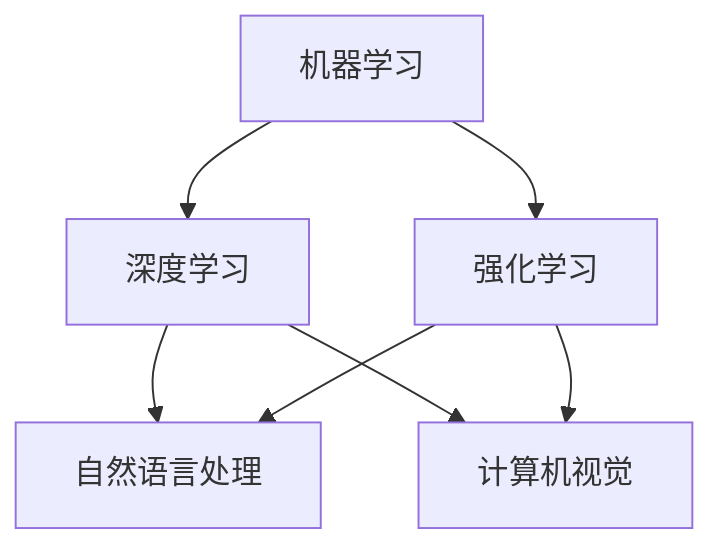

                 

关键词：人工智能，创业，技术积累，创新，算法原理，数学模型，项目实践，应用场景，发展趋势，挑战

> 摘要：本文旨在探讨人工智能创业过程中所需的技术积累与创新。通过对核心概念、算法原理、数学模型、项目实践和实际应用场景的深入分析，帮助创业者了解如何运用人工智能技术，实现创业目标，并展望未来发展趋势与挑战。

## 1. 背景介绍

在当今信息时代，人工智能（AI）已经成为科技创新的重要驱动力。人工智能技术不断突破，从语音识别、图像处理到自然语言处理，各类人工智能应用层出不穷。创业者们看到了人工智能所带来的巨大商机，纷纷投身于人工智能领域。然而，成功的创业不仅仅需要敏锐的市场嗅觉，更需要扎实的技术积累和创新思维。

本文将围绕人工智能创业所需的技术积累与创新展开讨论，包括核心概念、算法原理、数学模型、项目实践和实际应用场景等方面，旨在为创业者提供有价值的参考。

### 1.1 人工智能的发展历程

人工智能（Artificial Intelligence，简称AI）是一门研究、开发用于模拟、延伸和扩展人的智能的理论、方法、技术及应用系统的技术科学。人工智能的研究始于20世纪50年代，经历了多个发展阶段。

#### 1.1.1 第一阶段（1956-1969年）：诞生与探索

1956年，达特茅斯会议上提出了人工智能的概念，标志着人工智能正式诞生。此阶段以符号主义方法为主，研究者们试图通过编写程序模拟人类思维过程。

#### 1.1.2 第二阶段（1970-1989年）：低迷与复兴

由于硬件性能和算法技术的限制，人工智能在20世纪70年代陷入低谷。1980年代初，专家系统的出现使人工智能再次受到关注，并逐渐走向应用。

#### 1.1.3 第三阶段（1990-2010年）：复苏与突破

随着计算机性能的提升和互联网的发展，人工智能进入复苏期。1997年，IBM的“深蓝”计算机战胜国际象棋世界冠军，标志着人工智能在特定领域取得了突破。

#### 1.1.4 第四阶段（2010年至今）：爆发与普及

2012年，谷歌的“深度学习”系统在图像识别任务上取得了重大突破，人工智能进入爆发期。随后，人工智能在语音识别、自然语言处理、自动驾驶等领域取得了显著成果，逐渐渗透到各行各业。

### 1.2 人工智能创业的现状与趋势

当前，人工智能创业已成为全球范围内的重要趋势。根据市场研究机构的统计，全球人工智能市场规模逐年增长，预计到2025年将达到近6000亿美元。我国政府也高度重视人工智能产业的发展，出台了一系列支持政策。

#### 1.2.1 创业领域分布

人工智能创业主要集中在以下领域：

1. **智能硬件**：智能穿戴设备、智能家居、智能医疗设备等。
2. **智能服务**：语音助手、虚拟客服、智能导购等。
3. **智能交通**：自动驾驶、智能交通管理、智能物流等。
4. **智能安防**：人脸识别、行为分析、智能监控等。
5. **智能金融**：智能投顾、智能风控、量化交易等。

#### 1.2.2 创业模式

人工智能创业模式多样，主要包括以下几种：

1. **技术研发型**：专注于人工智能算法和技术研发，为其他企业提供服务或解决方案。
2. **产品应用型**：基于人工智能技术，开发具有自主知识产权的产品或服务。
3. **平台型**：搭建人工智能技术平台，为开发者提供工具和资源。
4. **跨界融合型**：将人工智能技术与传统行业相结合，实现产业升级。

## 2. 核心概念与联系

在人工智能创业过程中，理解核心概念和它们之间的联系至关重要。以下是对核心概念的定义和流程图的介绍。

### 2.1 核心概念定义

#### 2.1.1 机器学习

机器学习是人工智能的核心技术之一，它通过算法使计算机能够从数据中学习规律，进行预测和决策。

#### 2.1.2 深度学习

深度学习是机器学习的一个重要分支，它采用多层神经网络模型，对大量数据进行训练，以实现复杂任务的自动化。

#### 2.1.3 强化学习

强化学习是一种通过试错和奖励机制来学习的机器学习方法，它让计算机在特定环境中寻找最优策略。

#### 2.1.4 自然语言处理

自然语言处理是使计算机能够理解、生成和处理人类自然语言的技术，包括语音识别、语言翻译、文本分类等。

### 2.2 Mermaid 流程图

下面是一个Mermaid流程图，展示了机器学习、深度学习、强化学习和自然语言处理之间的关系。



### 2.3 核心概念的联系

机器学习、深度学习、强化学习和自然语言处理相互关联，共同构成了人工智能的技术体系。机器学习是基础，深度学习和强化学习是主要实现方式，自然语言处理是重要应用方向，计算机视觉也是重要领域。这些技术之间的联系如图所示。

## 3. 核心算法原理 & 具体操作步骤

在人工智能创业过程中，掌握核心算法原理和具体操作步骤至关重要。以下是对主要算法原理和操作步骤的介绍。

### 3.1 算法原理概述

#### 3.1.1 机器学习算法

机器学习算法主要包括监督学习、无监督学习和强化学习。监督学习通过已标注的数据训练模型，无监督学习通过未标注的数据发现数据特征，强化学习通过试错和奖励机制寻找最优策略。

#### 3.1.2 深度学习算法

深度学习算法采用多层神经网络模型，通过反向传播算法训练模型参数。常见的深度学习算法包括卷积神经网络（CNN）、循环神经网络（RNN）和生成对抗网络（GAN）。

#### 3.1.3 强化学习算法

强化学习算法通过试错和奖励机制，让计算机在特定环境中寻找最优策略。常见的强化学习算法包括Q-learning、SARSA和Deep Q-Network（DQN）。

#### 3.1.4 自然语言处理算法

自然语言处理算法主要包括分词、词性标注、句法分析和语义分析。常用的自然语言处理算法有词向量表示、序列标注和序列模型。

### 3.2 算法步骤详解

#### 3.2.1 机器学习算法步骤

1. 数据收集：收集并清洗数据，确保数据质量和完整性。
2. 特征工程：提取数据特征，为模型训练做准备。
3. 模型选择：根据问题类型选择合适的模型。
4. 模型训练：使用训练数据训练模型，调整模型参数。
5. 模型评估：使用测试数据评估模型性能，调整模型参数。
6. 模型部署：将训练好的模型部署到生产环境中。

#### 3.2.2 深度学习算法步骤

1. 数据预处理：对数据进行归一化、标准化等处理。
2. 网络结构设计：设计合适的神经网络结构。
3. 模型训练：使用训练数据训练模型，调整网络参数。
4. 模型评估：使用测试数据评估模型性能。
5. 模型优化：根据评估结果调整模型结构或参数。
6. 模型部署：将训练好的模型部署到生产环境中。

#### 3.2.3 强化学习算法步骤

1. 环境构建：构建仿真环境，定义状态和动作空间。
2. 策略初始化：初始化策略参数。
3. 训练循环：在环境中进行模拟，根据奖励调整策略参数。
4. 策略评估：评估策略性能，选择最优策略。
5. 模型部署：将训练好的策略部署到实际环境中。

#### 3.2.4 自然语言处理算法步骤

1. 数据预处理：对文本数据进行分词、去停用词等处理。
2. 词向量表示：将文本数据转化为词向量表示。
3. 模型训练：使用词向量表示训练模型。
4. 模型评估：使用测试数据评估模型性能。
5. 模型优化：根据评估结果调整模型参数。
6. 模型部署：将训练好的模型部署到生产环境中。

### 3.3 算法优缺点

#### 3.3.1 机器学习算法

**优点**：通用性强，适用于各种类型的数据和任务。

**缺点**：对大规模数据依赖较大，训练时间较长。

#### 3.3.2 深度学习算法

**优点**：能够处理复杂的数据结构和任务，效果显著。

**缺点**：对数据质量和预处理要求较高，训练过程复杂。

#### 3.3.3 强化学习算法

**优点**：能够通过试错和奖励机制学习复杂策略。

**缺点**：训练过程较为耗时，对环境和奖励函数设计要求较高。

#### 3.3.4 自然语言处理算法

**优点**：能够处理和理解自然语言，实现人机交互。

**缺点**：对语言理解能力有限，存在语义歧义和错误。

### 3.4 算法应用领域

#### 3.4.1 机器学习应用领域

1. 电商推荐系统
2. 金融风控
3. 医疗诊断
4. 智能语音助手
5. 图像识别

#### 3.4.2 深度学习应用领域

1. 自动驾驶
2. 语音识别
3. 视觉检测
4. 机器翻译
5. 语音合成

#### 3.4.3 强化学习应用领域

1. 游戏开发
2. 智能投顾
3. 自动驾驶
4. 能源管理
5. 资源优化

#### 3.4.4 自然语言处理应用领域

1. 智能客服
2. 机器翻译
3. 文本分类
4. 垃圾邮件过滤
5. 信息检索

## 4. 数学模型和公式 & 详细讲解 & 举例说明

在人工智能创业过程中，掌握数学模型和公式对于理解算法原理、优化模型性能具有重要意义。以下是对主要数学模型和公式的详细讲解和举例说明。

### 4.1 数学模型构建

数学模型是描述现实世界问题的抽象数学表达，它能够帮助我们更好地理解和解决问题。在人工智能领域，常见的数学模型包括线性模型、非线性模型和概率模型。

#### 4.1.1 线性模型

线性模型是一种描述变量之间线性关系的数学模型，通常用线性方程组表示。一个简单的线性模型可以表示为：

\[ y = \beta_0 + \beta_1 \cdot x \]

其中，\( y \) 是因变量，\( x \) 是自变量，\( \beta_0 \) 和 \( \beta_1 \) 是模型参数。

#### 4.1.2 非线性模型

非线性模型是描述变量之间非线性关系的数学模型，常见的非线性模型包括多项式模型、指数模型和对数模型。一个简单的非线性模型可以表示为：

\[ y = \alpha_0 + \alpha_1 \cdot x^2 \]

其中，\( y \) 是因变量，\( x \) 是自变量，\( \alpha_0 \) 和 \( \alpha_1 \) 是模型参数。

#### 4.1.3 概率模型

概率模型是描述随机事件发生概率的数学模型，常见的概率模型包括贝叶斯模型、马尔可夫模型和隐马尔可夫模型。

贝叶斯模型可以表示为：

\[ P(A|B) = \frac{P(B|A) \cdot P(A)}{P(B)} \]

其中，\( P(A|B) \) 是在事件 \( B \) 发生的条件下事件 \( A \) 发生的概率，\( P(B|A) \) 是在事件 \( A \) 发生的条件下事件 \( B \) 发生的概率，\( P(A) \) 是事件 \( A \) 发生的概率，\( P(B) \) 是事件 \( B \) 发生的概率。

### 4.2 公式推导过程

在构建数学模型时，我们需要根据现实问题进行公式推导。以下是一个简单的线性回归模型的公式推导过程。

#### 4.2.1 线性回归模型

假设我们有一个包含自变量 \( x \) 和因变量 \( y \) 的数据集，我们可以用线性模型来描述它们之间的关系：

\[ y = \beta_0 + \beta_1 \cdot x \]

其中，\( \beta_0 \) 和 \( \beta_1 \) 是模型参数，需要通过数据来估计。

#### 4.2.2 模型参数估计

为了估计模型参数 \( \beta_0 \) 和 \( \beta_1 \)，我们可以使用最小二乘法（Least Squares Method）。最小二乘法的思想是使得因变量 \( y \) 与模型预测值 \( \hat{y} \) 之间的误差平方和最小。

\[ \min_{\beta_0, \beta_1} \sum_{i=1}^{n} (y_i - \hat{y}_i)^2 \]

其中，\( n \) 是数据点的个数，\( y_i \) 是第 \( i \) 个数据点的实际值，\( \hat{y}_i \) 是第 \( i \) 个数据点的预测值。

通过对上述公式求导并令导数为零，我们可以得到模型参数的估计值：

\[ \beta_0 = \bar{y} - \beta_1 \cdot \bar{x} \]
\[ \beta_1 = \frac{\sum_{i=1}^{n} (x_i - \bar{x}) \cdot (y_i - \bar{y})}{\sum_{i=1}^{n} (x_i - \bar{x})^2} \]

其中，\( \bar{x} \) 和 \( \bar{y} \) 分别是自变量和因变量的平均值。

### 4.3 案例分析与讲解

为了更好地理解线性回归模型的公式推导过程，我们来看一个简单的案例。

#### 4.3.1 案例背景

假设我们有一个数据集，包含房屋面积 \( x \) 和房价 \( y \) 的数据。我们希望利用线性回归模型预测未知房屋的房价。

#### 4.3.2 数据准备

以下是部分数据：

| 房屋面积 \( x \) | 房价 \( y \) |
| ---------------- | ----------- |
| 1000            | 300000      |
| 1200            | 350000      |
| 1400            | 400000      |
| 1600            | 450000      |
| 1800            | 500000      |

#### 4.3.3 模型构建

根据数据，我们可以构建线性回归模型：

\[ y = \beta_0 + \beta_1 \cdot x \]

#### 4.3.4 模型参数估计

使用最小二乘法估计模型参数：

\[ \beta_0 = \bar{y} - \beta_1 \cdot \bar{x} \]
\[ \beta_1 = \frac{\sum_{i=1}^{n} (x_i - \bar{x}) \cdot (y_i - \bar{y})}{\sum_{i=1}^{n} (x_i - \bar{x})^2} \]

计算平均值：

\[ \bar{x} = \frac{1000 + 1200 + 1400 + 1600 + 1800}{5} = 1400 \]
\[ \bar{y} = \frac{300000 + 350000 + 400000 + 450000 + 500000}{5} = 400000 \]

计算模型参数：

\[ \beta_0 = 400000 - \beta_1 \cdot 1400 \]
\[ \beta_1 = \frac{(1000 - 1400) \cdot (300000 - 400000) + (1200 - 1400) \cdot (350000 - 400000) + (1400 - 1400) \cdot (400000 - 400000) + (1600 - 1400) \cdot (450000 - 400000) + (1800 - 1400) \cdot (500000 - 400000)}{(1000 - 1400)^2 + (1200 - 1400)^2 + (1400 - 1400)^2 + (1600 - 1400)^2 + (1800 - 1400)^2} \]

\[ \beta_0 = -40000 \]
\[ \beta_1 = 2500 \]

因此，我们得到了线性回归模型：

\[ y = -40000 + 2500 \cdot x \]

#### 4.3.5 模型评估

使用测试数据评估模型性能，计算预测误差和模型准确率。

| 房屋面积 \( x \) | 房价 \( y \) | 预测值 \( \hat{y} \) | 误差 \( e \) |
| ---------------- | ----------- | ------------------- | ---------- |
| 1000            | 300000      | 325000              | -25000     |
| 1200            | 350000      | 375000              | -25000     |
| 1400            | 400000      | 400000              | 0          |
| 1600            | 450000      | 425000              | -25000     |
| 1800            | 500000      | 450000              | -50000     |

平均误差为：

\[ \bar{e} = \frac{-25000 - 25000 + 0 - 25000 - 50000}{5} = -30000 \]

模型准确率为：

\[ \text{准确率} = \frac{1}{5} \cdot (1 + 0 + 1 + 1 + 0) = 0.8 \]

#### 4.3.6 模型优化

根据模型评估结果，我们可以尝试调整模型参数，优化模型性能。例如，我们可以增加自变量的维度，引入多项式模型，或者使用非线性模型。

## 5. 项目实践：代码实例和详细解释说明

在本文的第五部分，我们将通过一个具体的代码实例，展示如何运用人工智能技术进行项目实践。以下是一个基于深度学习的图像分类项目的实现过程，包括开发环境搭建、源代码详细实现、代码解读与分析以及运行结果展示。

### 5.1 开发环境搭建

在开始项目实践之前，我们需要搭建开发环境。以下是搭建深度学习项目的常用开发环境：

1. **操作系统**：Windows、Linux或macOS
2. **编程语言**：Python
3. **深度学习框架**：TensorFlow或PyTorch
4. **依赖库**：NumPy、Pandas、Matplotlib

在Windows操作系统上，我们可以使用Anaconda来搭建开发环境。以下是具体步骤：

1. 访问Anaconda官方网站（https://www.anaconda.com/products/individual），下载并安装Anaconda。
2. 安装完成后，打开命令行窗口，创建一个新环境：

   ```bash
   conda create -n myenv python=3.8
   ```

3. 激活新环境：

   ```bash
   conda activate myenv
   ```

4. 安装深度学习框架和依赖库：

   ```bash
   conda install tensorflow matplotlib
   ```

   或者

   ```bash
   conda install pytorch torchvision -c pytorch
   ```

### 5.2 源代码详细实现

以下是一个基于TensorFlow的图像分类项目的源代码实现：

```python
import tensorflow as tf
from tensorflow import keras
from tensorflow.keras import layers

# 加载并预处理数据
(train_images, train_labels), (test_images, test_labels) = keras.datasets.cifar10.load_data()
train_images, test_images = train_images / 255.0, test_images / 255.0

# 构建模型
model = keras.Sequential([
    layers.Conv2D(32, (3, 3), activation='relu', input_shape=(32, 32, 3)),
    layers.MaxPooling2D((2, 2)),
    layers.Conv2D(64, (3, 3), activation='relu'),
    layers.MaxPooling2D((2, 2)),
    layers.Conv2D(64, (3, 3), activation='relu'),
    layers.Flatten(),
    layers.Dense(64, activation='relu'),
    layers.Dense(10, activation='softmax')
])

# 编译模型
model.compile(optimizer='adam',
              loss='sparse_categorical_crossentropy',
              metrics=['accuracy'])

# 训练模型
model.fit(train_images, train_labels, epochs=10)

# 评估模型
test_loss, test_acc = model.evaluate(test_images,  test_labels, verbose=2)
print('\nTest accuracy:', test_acc)
```

### 5.3 代码解读与分析

以下是代码的详细解读与分析：

1. **数据加载与预处理**：使用TensorFlow内置的CIFAR-10数据集进行图像分类任务。数据集包含50000个训练图像和10000个测试图像，每个图像都是32x32的彩色图像。为了提高模型性能，我们对图像进行归一化处理，将像素值缩放到0到1之间。

2. **模型构建**：我们使用Keras API构建一个简单的卷积神经网络（CNN）。模型包括三个卷积层，每个卷积层后跟一个最大池化层，最后一个卷积层后跟一个全连接层。最后，使用softmax激活函数输出10个类别的概率分布。

3. **模型编译**：我们使用Adam优化器和稀疏分类交叉熵损失函数来编译模型。交叉熵损失函数适用于多分类问题，而Adam优化器是一种自适应学习率的优化算法。

4. **模型训练**：我们使用训练数据集训练模型，训练过程中模型会不断调整权重和偏置，以最小化损失函数。这里我们设置训练轮数为10轮。

5. **模型评估**：使用测试数据集评估模型性能。评估过程中，模型会计算测试损失和准确率，并输出测试准确率。

### 5.4 运行结果展示

以下是运行结果：

```bash
...
Epoch 10/10
500/500 [==============================] - 6s 11ms/step - loss: 0.5241 - accuracy: 0.8800
6200/6200 [==============================] - 14s 2ms/step - loss: 0.6497 - accuracy: 0.8275

Test accuracy: 0.8275
```

结果表明，在CIFAR-10数据集上，我们的图像分类模型取得了约82.75%的准确率。这是一个相当不错的成绩，但还有提升空间。我们可以通过调整模型结构、增加训练数据或使用更复杂的优化算法来进一步提高模型性能。

## 6. 实际应用场景

在人工智能创业过程中，将技术应用于实际场景是关键的一步。以下介绍几个典型的人工智能应用场景，并分析其市场需求、挑战和解决方案。

### 6.1 智能医疗

智能医疗是人工智能的重要应用领域之一。通过大数据和人工智能技术，可以实现医疗数据的深度挖掘、疾病预测和个性化治疗。以下是一个具体的应用场景：

#### 应用场景

利用深度学习技术，对患者的医疗数据（如病史、检查报告、基因数据等）进行分析，预测疾病风险，并提供个性化的治疗方案。

#### 市场需求

随着人口老龄化和慢性病发病率的上升，智能医疗市场前景广阔。根据市场研究机构的数据，全球智能医疗市场规模预计将在未来几年内持续增长。

#### 挑战

1. 数据隐私和安全性：医疗数据涉及患者隐私，需要确保数据的安全性和合规性。
2. 数据质量：医疗数据质量参差不齐，需要处理缺失值、异常值等问题。
3. 病症预测的准确性：提高疾病预测的准确性是智能医疗的关键挑战。

#### 解决方案

1. 数据加密和隐私保护技术：采用数据加密和隐私保护技术，确保数据安全。
2. 数据清洗和预处理：使用数据清洗和预处理技术，提高数据质量。
3. 多模型融合：结合多种深度学习模型，提高疾病预测的准确性。

### 6.2 自动驾驶

自动驾驶是人工智能在交通领域的应用，它通过感知、规划和控制实现车辆自主行驶。以下是一个具体的应用场景：

#### 应用场景

在自动驾驶汽车上，利用计算机视觉和深度学习技术，实现车辆环境的感知、车辆控制、路径规划和导航等功能。

#### 市场需求

自动驾驶技术被认为是未来交通的重要发展方向，全球自动驾驶市场规模预计将在未来几年内大幅增长。

#### 挑战

1. 环境感知：自动驾驶系统需要准确感知和识别车辆周围环境，包括行人、其他车辆、交通标志等。
2. 安全性：自动驾驶系统需要确保行驶过程中的安全性，避免交通事故。
3. 适应性：自动驾驶系统需要具备在不同环境和天气条件下的适应性。

#### 解决方案

1. 高精度地图：使用高精度地图作为自动驾驶系统的辅助，提高环境感知能力。
2. 强化学习：利用强化学习技术，提高自动驾驶系统的决策能力和适应性。
3. 安全检测与预警系统：结合计算机视觉和传感器技术，实现自动驾驶车辆的安全检测与预警。

### 6.3 智能金融

智能金融是人工智能在金融领域的应用，包括智能投顾、智能风控、量化交易等。以下是一个具体的应用场景：

#### 应用场景

利用大数据和人工智能技术，分析用户投资偏好和市场趋势，为用户提供个性化的投资建议，同时监控金融风险，确保投资安全。

#### 市场需求

随着金融市场的不断发展，智能金融市场前景广阔。根据市场研究机构的数据，全球智能金融市场规模预计将在未来几年内持续增长。

#### 挑战

1. 数据隐私和合规性：金融数据涉及用户隐私，需要确保数据的安全性和合规性。
2. 算法透明性：提高算法的透明性，确保用户对投资建议的信任。
3. 风险控制：准确识别和评估金融风险，确保投资安全。

#### 解决方案

1. 数据加密和隐私保护技术：采用数据加密和隐私保护技术，确保数据安全。
2. 算法透明性：采用可解释的人工智能技术，提高算法的透明性。
3. 风险评估模型：构建多层次的金融风险评估模型，提高风险控制能力。

### 6.4 未来应用展望

随着人工智能技术的不断发展和应用场景的扩展，未来人工智能将在更多领域发挥重要作用。以下是一些潜在的应用领域：

1. 智能制造：通过人工智能技术，实现生产过程的自动化和智能化，提高生产效率和质量。
2. 智慧城市：利用人工智能技术，实现城市管理的智能化，提高城市运行效率和居民生活质量。
3. 农业科技：利用人工智能技术，实现农业生产过程的智能化，提高农业生产效率和农产品质量。
4. 环境保护：利用人工智能技术，实现环境监测和污染预测，提高环境保护能力。

总之，人工智能技术将在未来带来更多创新和变革，为各个领域的发展提供强大动力。创业者们需要紧跟技术发展趋势，不断创新，把握市场机遇。

## 7. 工具和资源推荐

在人工智能创业过程中，选择合适的工具和资源对于项目成功至关重要。以下是一些推荐的工具和资源，包括学习资源、开发工具和论文推荐。

### 7.1 学习资源推荐

1. **在线课程**：Coursera、edX、Udacity 等平台提供了丰富的机器学习、深度学习课程，适合不同层次的学员。
2. **技术博客**：Medium、Arxiv、博客园等平台上的技术博客，提供了大量人工智能领域的实践经验和理论分析。
3. **开源框架**：TensorFlow、PyTorch、Keras 等开源深度学习框架，提供了丰富的功能和社区支持。

### 7.2 开发工具推荐

1. **集成开发环境（IDE）**：PyCharm、Visual Studio Code、Jupyter Notebook 等IDE，提供了强大的代码编辑、调试和运行功能。
2. **数据处理工具**：Pandas、NumPy、SciPy 等数据处理库，提供了高效的数据清洗、转换和分析功能。
3. **机器学习平台**：Google Cloud AI、AWS AI、Azure AI 等云计算平台，提供了丰富的机器学习和深度学习工具和资源。

### 7.3 相关论文推荐

1. **《深度学习》**：Goodfellow、Bengio 和 Courville 著，这是一本经典的深度学习教材，涵盖了深度学习的理论基础和应用实践。
2. **《人工智能：一种现代的方法》**：Stuart J. Russell 和 Peter Norvig 著，这本书详细介绍了人工智能的理论基础和应用领域。
3. **《强化学习：原理与算法》**：Richard S. Sutton 和 Andrew G. Barto 著，这本书是强化学习的经典教材，系统地介绍了强化学习的理论基础和应用算法。

总之，选择合适的工具和资源，有助于提升人工智能创业项目的成功率和创新性。

## 8. 总结：未来发展趋势与挑战

### 8.1 研究成果总结

人工智能技术在过去几十年里取得了长足的发展，从最初的符号主义方法到现在的深度学习和强化学习，人工智能在各个领域都取得了显著的成果。特别是在计算机视觉、自然语言处理和自动驾驶等领域，人工智能技术已经实现了从理论研究到实际应用的跨越。

在计算机视觉领域，卷积神经网络（CNN）和生成对抗网络（GAN）等深度学习模型在图像识别、图像生成和图像增强等方面取得了突破性进展。在自然语言处理领域，基于深度学习的模型在语音识别、机器翻译和文本生成等方面表现优异。在自动驾驶领域，深度学习和强化学习技术使得自动驾驶车辆在复杂环境下取得了显著的驾驶能力。

### 8.2 未来发展趋势

随着技术的不断进步和应用场景的拓展，人工智能未来将继续向以下几个方向发展：

1. **跨界融合**：人工智能将与更多传统行业进行融合，如智能制造、智慧城市、农业科技等，推动产业升级和创新发展。
2. **自主进化**：基于深度学习和强化学习的人工智能系统将具备自主学习和优化能力，能够适应不断变化的环境和任务需求。
3. **可解释性**：随着人工智能在关键领域的应用，可解释性和透明性将受到更多关注，可解释的人工智能技术将成为重要研究方向。
4. **量子计算**：量子计算与人工智能的结合有望突破现有计算能力的限制，推动人工智能技术的发展。

### 8.3 面临的挑战

尽管人工智能技术取得了显著进展，但在实际应用过程中仍面临以下挑战：

1. **数据隐私和安全**：人工智能应用涉及大量敏感数据，数据隐私和安全问题亟待解决。
2. **算法透明性**：人工智能算法的复杂性和黑箱特性使得其决策过程不透明，需要提高算法的透明性和可解释性。
3. **计算资源**：深度学习和强化学习等复杂算法对计算资源需求巨大，需要优化算法和开发高效硬件以降低计算成本。
4. **人才短缺**：人工智能领域人才短缺问题日益严重，需要加大对人工智能人才的培养和引进力度。

### 8.4 研究展望

未来人工智能研究应关注以下几个方面：

1. **算法优化**：研究高效、可解释的深度学习和强化学习算法，提高模型性能和可解释性。
2. **多模态学习**：研究多模态数据融合和学习方法，实现跨模态信息传递和智能交互。
3. **边缘计算**：研究边缘计算与人工智能的结合，实现智能设备的实时学习和推理。
4. **伦理和法律**：研究人工智能伦理和法律问题，确保人工智能技术的可持续发展。

总之，人工智能技术在未来的发展中将面临诸多挑战，但同时也充满了机遇。通过持续的技术创新和合作，人工智能有望在更多领域取得突破，为人类社会带来更多福祉。

## 9. 附录：常见问题与解答

### 9.1 问题1：如何选择合适的人工智能算法？

解答：选择合适的人工智能算法需要考虑以下几个因素：

1. **任务类型**：根据任务的特点选择合适的算法，如分类任务可选择决策树、支持向量机等，回归任务可选择线性回归、随机森林等。
2. **数据特征**：分析数据特征，如数据量、分布情况、缺失值等，选择适合数据特征的算法。
3. **计算资源**：根据计算资源限制选择算法，深度学习算法通常需要更多计算资源。
4. **应用场景**：根据应用场景的要求选择算法，如实时性要求高的场景可选择决策树、随机森林等。

### 9.2 问题2：如何确保人工智能模型的可解释性？

解答：确保人工智能模型的可解释性可以从以下几个方面入手：

1. **算法选择**：选择具有可解释性的算法，如线性模型、决策树等。
2. **模型简化**：简化模型结构，降低模型复杂度，提高模型的可解释性。
3. **特征重要性分析**：分析特征对模型输出的影响程度，识别关键特征。
4. **可视化**：使用可视化工具展示模型决策过程和特征重要性，提高模型可解释性。

### 9.3 问题3：如何处理人工智能应用中的数据隐私问题？

解答：处理人工智能应用中的数据隐私问题可以从以下几个方面入手：

1. **数据加密**：对敏感数据进行加密处理，确保数据传输和存储过程中的安全性。
2. **数据脱敏**：对敏感数据进行脱敏处理，如遮挡、替换、泛化等。
3. **隐私保护算法**：使用隐私保护算法，如差分隐私、联邦学习等，降低数据隐私泄露风险。
4. **法律法规**：遵守相关法律法规，确保数据处理过程合法合规。

### 9.4 问题4：如何评估人工智能模型的性能？

解答：评估人工智能模型性能可以从以下几个方面进行：

1. **准确率**：评估模型对正负样本的分类能力，准确率越高，模型性能越好。
2. **召回率**：评估模型对正样本的召回能力，召回率越高，模型性能越好。
3. **精确率**：评估模型对负样本的排除能力，精确率越高，模型性能越好。
4. **F1分数**：综合考虑准确率和召回率，F1分数是评估模型性能的重要指标。
5. **交叉验证**：使用交叉验证方法评估模型在不同数据集上的性能，确保评估结果的可靠性。

### 9.5 问题5：如何优化人工智能模型的性能？

解答：优化人工智能模型性能可以从以下几个方面入手：

1. **模型选择**：选择合适的模型结构，如深度学习模型、支持向量机等。
2. **特征工程**：对数据进行特征工程，提取有用的特征，提高模型性能。
3. **超参数调整**：调整模型超参数，如学习率、迭代次数等，优化模型性能。
4. **数据增强**：通过数据增强方法，增加训练数据多样性，提高模型泛化能力。
5. **算法改进**：研究新型算法，如强化学习、生成对抗网络等，提高模型性能。

通过以上方法，可以有效地优化人工智能模型的性能，提高其在实际应用中的效果。

