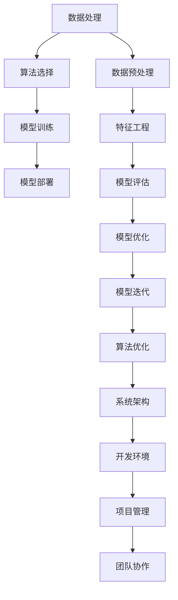

                 

关键词：人工智能、创业、工具选择、算法、技术架构、开发环境、项目实践、应用场景、资源推荐、发展趋势

> 摘要：本文将深入探讨人工智能创业者在选择开发工具时的关键考虑因素，包括算法选择、技术架构、开发环境和项目实践等方面。通过对各类工具的详细分析，本文旨在为人工智能创业者提供一套科学、实用的工具选择方法，助力他们在竞争激烈的市场中脱颖而出。

## 1. 背景介绍

随着人工智能技术的快速发展，越来越多的创业者投身于这一领域，希望通过创新的技术和应用来改变世界。然而，人工智能创业并非易事，其中选择合适的开发工具是至关重要的一环。合适的工具不仅能够提高开发效率，还能够降低开发成本，确保项目的顺利进行。

在人工智能创业的过程中，开发者需要面对众多的技术挑战，包括数据处理、算法优化、模型训练和部署等。每一个环节都需要选择合适的工具，以保证整个项目的顺利进行。因此，对于人工智能创业者来说，了解并掌握各种工具的特点和适用场景，是成功创业的关键。

本文将从以下几个方面展开讨论：

1. 核心概念与联系：介绍人工智能创业中涉及的核心概念和技术架构，并通过Mermaid流程图展示其关系。
2. 核心算法原理与操作步骤：详细阐述常用算法的原理和操作步骤，以及其优缺点和应用领域。
3. 数学模型与公式：介绍人工智能中的数学模型和公式，并进行详细讲解和举例说明。
4. 项目实践：通过具体的代码实例，展示如何使用工具进行实际项目开发，并进行解读和分析。
5. 实际应用场景：分析人工智能工具在不同领域的应用，以及未来的发展趋势。
6. 工具和资源推荐：推荐学习资源、开发工具和相关论文，帮助创业者更好地了解和使用工具。
7. 总结：总结研究成果，探讨未来发展趋势和挑战，以及研究展望。

### 1.1 人工智能创业的现状

人工智能创业已经成为当前科技领域的热点。据数据显示，全球人工智能市场规模预计将在未来几年内持续增长，这吸引了大量的创业者进入这一领域。从医疗健康到金融科技，从智能制造到自动驾驶，人工智能技术的应用正在不断拓展，为创业者提供了丰富的机会。

然而，人工智能创业并非一帆风顺。创业者需要面对众多技术挑战，包括数据处理、算法优化、模型训练和部署等。同时，市场上各种开发工具繁多，如何选择合适的工具成为许多创业者面临的难题。

### 1.2 工具选择的重要性

合适的工具对人工智能创业项目的成功至关重要。首先，工具的性能直接影响项目的开发效率。选择高效、稳定的工具，可以大大缩短开发周期，提高项目的成功率。其次，工具的选择还会影响项目的成本。一些开源工具和云服务提供商提供了丰富的资源，可以帮助创业者降低成本，提高盈利能力。最后，工具的适用性也是选择时的重要考虑因素。不同的工具适用于不同的场景，创业者需要根据项目的具体需求来选择合适的工具。

### 1.3 文章目的

本文旨在为人工智能创业者提供一套科学的工具选择方法。通过对各类工具的详细分析，本文希望能够帮助创业者更好地了解各种工具的特点和适用场景，从而做出明智的选择，提高项目的成功率。同时，本文还将结合具体案例，展示如何在实际项目中使用这些工具，为创业者提供实践指导。

## 2. 核心概念与联系

在人工智能创业中，涉及到的核心概念和技术架构众多。为了更好地理解这些概念之间的关系，我们使用Mermaid流程图来展示。



### 2.1 数据处理

数据处理是人工智能创业中的基础环节。它包括数据收集、数据清洗、数据预处理和数据存储等步骤。数据处理的好坏直接影响到后续的算法选择和模型训练效果。常用的数据处理工具有Pandas、NumPy、SciPy等。

### 2.2 算法选择

算法选择是人工智能创业中的关键环节。不同的算法适用于不同的场景，创业者需要根据具体需求选择合适的算法。常用的算法包括监督学习、无监督学习、强化学习等。其中，监督学习和无监督学习广泛应用于分类和聚类任务，强化学习则广泛应用于决策和规划任务。

### 2.3 模型训练

模型训练是人工智能创业中的核心环节。创业者需要根据具体任务选择合适的模型，并进行训练。常见的模型包括神经网络、决策树、支持向量机等。其中，神经网络广泛应用于图像识别、自然语言处理等领域，决策树和支持向量机则广泛应用于分类和回归任务。

### 2.4 模型部署

模型部署是将训练好的模型应用到实际场景中的过程。创业者需要根据实际需求选择合适的部署方式，如本地部署、云部署等。常见的部署工具包括TensorFlow Serving、TensorFlow Lite等。

### 2.5 数据预处理

数据预处理是数据处理的重要环节。它包括数据清洗、数据标准化、数据归一化等步骤。数据预处理的好坏直接影响到后续的特征工程和模型训练效果。常用的预处理工具包括Pandas、NumPy等。

### 2.6 特征工程

特征工程是提高模型性能的关键环节。它包括特征提取、特征选择、特征变换等步骤。通过合理的特征工程，可以提高模型的泛化能力和准确率。常用的特征工程工具包括Scikit-Learn、Feature-engine等。

### 2.7 模型评估

模型评估是评估模型性能的重要环节。创业者需要根据具体任务选择合适的评估指标，如准确率、召回率、F1值等。常用的评估工具包括Scikit-Learn、MLflow等。

### 2.8 模型优化

模型优化是提高模型性能的重要手段。它包括超参数调优、模型剪枝、迁移学习等步骤。通过模型优化，可以提高模型的效率和准确性。常用的优化工具包括PyTorch、TensorFlow等。

### 2.9 算法优化

算法优化是提高算法性能的重要手段。它包括算法改进、算法加速等步骤。通过算法优化，可以提高算法的效率和准确性。常用的优化工具包括算法库、编译器等。

### 2.10 系统架构

系统架构是人工智能创业中的核心环节。创业者需要根据具体需求设计合适的系统架构，以保证系统的稳定性和可扩展性。常见的系统架构包括分布式架构、微服务架构等。

### 2.11 开发环境

开发环境是创业者进行项目开发的基础。创业者需要选择合适的开发环境，以保障项目的顺利进行。常见的开发环境包括Jupyter Notebook、PyCharm等。

### 2.12 项目管理

项目管理是确保项目顺利进行的重要手段。创业者需要选择合适的项目管理工具，以保障项目进度和质量。常见的管理工具包括JIRA、Trello等。

### 2.13 团队协作

团队协作是人工智能创业中不可或缺的一环。创业者需要选择合适的团队协作工具，以提高团队效率和协作效果。常见的协作工具包括Slack、Git等。

通过以上Mermaid流程图的展示，我们可以清晰地看到人工智能创业中的各个核心概念和它们之间的联系。这为创业者选择合适的工具提供了有力的指导。

### 2.14 工具之间的关系

在人工智能创业中，各种工具之间存在着密切的关系。例如，数据处理工具和数据预处理工具之间存在着紧密的联系，数据预处理工具和特征工程工具之间也存在着紧密的联系。算法选择和模型训练工具之间同样有着紧密的关系。创业者需要根据具体需求，选择合适的工具，并确保它们之间的协同工作。

此外，系统架构和开发环境也是非常重要的工具。合理的系统架构可以保证项目的稳定性，高效的开发环境可以大大提高开发效率。项目管理工具和团队协作工具则有助于创业者更好地管理项目，提高团队协作效果。

### 2.15 工具选择的策略

在选择工具时，创业者需要遵循以下策略：

1. **明确需求**：首先，创业者需要明确项目的具体需求，包括算法、数据、模型、系统架构等方面。
2. **调研工具**：在明确需求后，创业者需要调研市场上各种工具的特点和适用场景，选择符合需求的工具。
3. **比较分析**：创业者需要对选定的工具进行比较分析，从性能、稳定性、成本、适用性等方面进行评估。
4. **试用体验**：在比较分析后，创业者可以尝试使用这些工具，以实际体验来评估它们的适用性。
5. **持续优化**：工具选择不是一次性的过程，创业者需要根据项目的实际运行情况，对工具进行持续优化和调整。

通过以上策略，创业者可以更好地选择合适的工具，提高项目的成功率和效率。

## 3. 核心算法原理 & 具体操作步骤

在人工智能创业中，算法的选择和实现是关键的一环。不同的算法适用于不同的场景，创业者需要根据具体需求选择合适的算法，并掌握其原理和操作步骤。本章节将详细介绍几种常用的算法，包括监督学习算法、无监督学习算法和强化学习算法，并分别阐述它们的原理和具体操作步骤。

### 3.1 监督学习算法

监督学习算法是一种常见的机器学习算法，它通过已标记的数据来训练模型，从而预测未知数据的标签。监督学习算法包括线性回归、逻辑回归、支持向量机、决策树和随机森林等。

#### 3.1.1 算法原理

监督学习算法的核心思想是学习一个映射函数，将输入特征映射到输出标签。在训练过程中，算法通过调整模型参数，使得模型对已知数据的预测与实际标签尽可能接近。常见的监督学习算法有：

- **线性回归**：通过建立一个线性函数模型，预测连续值的输出。
- **逻辑回归**：通过建立一个逻辑函数模型，预测二分类问题。
- **支持向量机（SVM）**：通过找到最优分类超平面，实现分类。
- **决策树**：通过构建树形结构模型，实现分类或回归。
- **随机森林**：通过构建多个决策树模型，进行集成学习，提高模型的泛化能力。

#### 3.1.2 操作步骤

以下是监督学习算法的一般操作步骤：

1. **数据预处理**：包括数据清洗、缺失值处理、数据标准化等步骤。
2. **特征工程**：包括特征提取、特征选择、特征变换等步骤。
3. **模型选择**：根据具体需求选择合适的模型，如线性回归、逻辑回归、SVM等。
4. **模型训练**：使用已标记的数据训练模型，调整模型参数。
5. **模型评估**：使用评估指标（如准确率、召回率、F1值等）评估模型性能。
6. **模型优化**：根据评估结果对模型进行优化，如调整超参数、使用正则化等。

### 3.2 无监督学习算法

无监督学习算法是一种没有预定义标签的机器学习算法，它通过分析未标记的数据，自动发现数据中的隐藏结构和模式。无监督学习算法包括聚类、降维和生成模型等。

#### 3.2.1 算法原理

无监督学习算法的核心思想是从数据中发现内在的结构和模式。常见的无监督学习算法有：

- **K-means聚类**：通过将数据划分为K个簇，使每个簇内的数据尽可能相似，簇间数据尽可能不同。
- **主成分分析（PCA）**：通过线性变换，将高维数据投影到低维空间，降低数据维度，同时保留数据的主要特征。
- **自编码器**：通过训练一个编码器和解码器模型，将输入数据编码为低维表示，并重建输入数据。

#### 3.2.2 操作步骤

以下是常见的无监督学习算法操作步骤：

1. **数据预处理**：包括数据清洗、缺失值处理等步骤。
2. **特征工程**：包括特征提取、特征选择等步骤。
3. **模型选择**：根据具体需求选择合适的模型，如K-means聚类、PCA等。
4. **模型训练**：使用未标记的数据训练模型。
5. **模型评估**：使用评估指标（如聚类效果、重构误差等）评估模型性能。
6. **模型优化**：根据评估结果对模型进行优化，如调整超参数、使用正则化等。

### 3.3 强化学习算法

强化学习算法是一种通过与环境交互来学习决策策略的机器学习算法。它通过奖励机制来评估策略的好坏，并逐步调整策略，以实现最优决策。强化学习算法广泛应用于游戏、自动驾驶、推荐系统等领域。

#### 3.3.1 算法原理

强化学习算法的核心思想是通过不断的试错，学习最优的策略。它包括以下几个关键组成部分：

- **状态（State）**：系统当前所处的情境。
- **动作（Action）**：可以采取的操作。
- **奖励（Reward）**：动作带来的奖励或惩罚。
- **策略（Policy）**：根据状态选择动作的规则。

常见的强化学习算法包括：

- **Q学习**：通过学习Q值（动作-状态值函数），选择最优动作。
- **深度Q网络（DQN）**：使用深度神经网络来近似Q值函数。
- **策略梯度算法**：直接优化策略的期望回报。

#### 3.3.2 操作步骤

以下是强化学习算法的一般操作步骤：

1. **环境搭建**：创建一个可以与算法交互的环境，包括状态空间、动作空间和奖励机制。
2. **模型选择**：根据具体需求选择合适的模型，如Q学习、DQN等。
3. **模型训练**：通过与环境交互，不断调整模型参数，学习最优策略。
4. **模型评估**：使用评估指标（如平均奖励、策略回报等）评估模型性能。
5. **模型优化**：根据评估结果对模型进行优化，如调整学习率、折扣因子等。

### 3.4 算法优缺点与应用领域

以下是几种常见算法的优缺点和应用领域：

#### 3.4.1 线性回归

**优点**：简单、易于理解和实现，适用于线性关系较强的任务。

**缺点**：对非线性关系拟合能力较弱，容易受到异常值的影响。

**应用领域**：回归分析、金融预测等。

#### 3.4.2 逻辑回归

**优点**：简单、高效，适用于二分类问题。

**缺点**：对多分类问题效果较差，容易产生偏差。

**应用领域**：分类问题、市场预测等。

#### 3.4.3 支持向量机

**优点**：理论完备，适用于高维空间，具有较好的分类效果。

**缺点**：计算复杂度高，对噪声敏感。

**应用领域**：文本分类、图像识别等。

#### 3.4.4 决策树

**优点**：易于理解，可解释性强，适用于多种类型的数据。

**缺点**：容易过拟合，对缺失值敏感。

**应用领域**：分类、回归分析等。

#### 3.4.5 随机森林

**优点**：具有较好的分类效果，鲁棒性强，减少了过拟合。

**缺点**：计算复杂度高，对大规模数据集性能影响较大。

**应用领域**：分类、回归分析等。

#### 3.4.6 K-means聚类

**优点**：简单、高效，适用于聚类任务。

**缺点**：对初始聚类中心敏感，容易陷入局部最优。

**应用领域**：客户细分、图像分割等。

#### 3.4.7 主成分分析

**优点**：降维效果显著，保留主要特征，提高模型性能。

**缺点**：对噪声敏感，降维过程中可能丢失部分信息。

**应用领域**：数据降维、特征提取等。

#### 3.4.8 自编码器

**优点**：可以自动学习数据的特征表示，适用于特征提取和降维。

**缺点**：训练过程复杂，对超参数敏感。

**应用领域**：特征提取、图像生成等。

#### 3.4.9 Q学习

**优点**：可以自动学习最优策略，适用于环境动态变化的情况。

**缺点**：训练过程可能较慢，对奖励函数设计要求较高。

**应用领域**：游戏AI、自动驾驶等。

#### 3.4.10 DQN

**优点**：可以处理高维状态空间，适用于复杂的决策问题。

**缺点**：训练不稳定，容易出现奖励灾难。

**应用领域**：游戏AI、机器人控制等。

通过以上对核心算法原理和操作步骤的详细介绍，创业者可以更好地了解不同算法的适用场景，并根据具体需求选择合适的算法。同时，创业者还需要结合实际项目需求，对算法进行优化和调整，以提高模型性能和项目成功率。

### 3.5 选择算法的技巧

在选择算法时，创业者需要考虑多个因素，以选择最适合自己项目的算法。以下是一些选择算法的技巧：

1. **明确任务类型**：首先，创业者需要明确自己的任务是分类、回归还是聚类等。不同的任务类型适用于不同的算法。
2. **数据特点**：创业者需要分析数据的特点，如数据规模、特征类型、数据分布等。不同算法对数据特点有不同的要求。
3. **计算资源**：创业者需要考虑计算资源，包括硬件设备和计算能力。一些算法如深度学习算法对计算资源的要求较高。
4. **性能要求**：创业者需要根据具体需求，选择能够满足性能要求的算法。例如，对于实时性要求较高的应用，可以选择简单的算法。
5. **可解释性**：创业者需要考虑模型的可解释性。一些算法如决策树和规则学习算法具有较好的可解释性，适用于需要解释模型的业务场景。
6. **实验验证**：在选择算法后，创业者需要进行实验验证，以评估算法的实际性能。实验验证可以帮助创业者发现潜在的问题，并选择最佳的算法。
7. **社区支持**：创业者需要考虑算法的社区支持。社区支持可以帮助创业者解决问题，获取最新的算法进展。

通过以上技巧，创业者可以更好地选择合适的算法，提高项目的成功率。

## 4. 数学模型和公式 & 详细讲解 & 举例说明

在人工智能创业中，数学模型和公式是构建和优化算法的核心。本章节将详细介绍几种常用的数学模型和公式，包括线性回归、逻辑回归和支持向量机（SVM）等，并进行详细讲解和举例说明。

### 4.1 线性回归

线性回归是一种用于预测连续值的监督学习算法。它的核心思想是找到一个线性函数，将输入特征映射到输出标签。

#### 4.1.1 数学模型

线性回归的数学模型可以表示为：

\[ y = \beta_0 + \beta_1 \cdot x \]

其中，\( y \) 是输出标签，\( x \) 是输入特征，\( \beta_0 \) 和 \( \beta_1 \) 是模型参数。

#### 4.1.2 公式推导

线性回归的公式推导基于最小二乘法。假设我们有 \( n \) 个数据点 \( (x_i, y_i) \)，线性回归的目标是最小化损失函数：

\[ \sum_{i=1}^{n} (y_i - (\beta_0 + \beta_1 \cdot x_i))^2 \]

对 \( \beta_0 \) 和 \( \beta_1 \) 求偏导并令其为零，可以得到：

\[ \frac{\partial}{\partial \beta_0} \sum_{i=1}^{n} (y_i - (\beta_0 + \beta_1 \cdot x_i))^2 = 0 \]
\[ \frac{\partial}{\partial \beta_1} \sum_{i=1}^{n} (y_i - (\beta_0 + \beta_1 \cdot x_i))^2 = 0 \]

解上述方程组，可以得到线性回归的参数 \( \beta_0 \) 和 \( \beta_1 \)。

#### 4.1.3 举例说明

假设我们有以下数据：

\[ 
\begin{array}{ccc}
x & y \\
\hline
1 & 2 \\
2 & 3 \\
3 & 4 \\
4 & 5 \\
\end{array}
\]

使用线性回归模型预测 \( y \) 的值。首先，我们计算输入特征 \( x \) 和输出标签 \( y \) 的均值：

\[ 
\bar{x} = \frac{1 + 2 + 3 + 4}{4} = 2.5 \\
\bar{y} = \frac{2 + 3 + 4 + 5}{4} = 3.5 
\]

然后，我们计算每个数据点的偏移量：

\[ 
(x_i - \bar{x})^2 & (y_i - \bar{y})^2 & (x_i - \bar{x})(y_i - \bar{y}) \\
\hline
-1.5 & 2.25 & -3.375 \\
-0.5 & 0.25 & -0.625 \\
1.5 & 0.25 & 0.375 \\
2.5 & 1.25 & 3.125 \\
\]

根据最小二乘法，我们可以解得线性回归的参数：

\[ 
\beta_0 = \bar{y} - \beta_1 \cdot \bar{x} = 3.5 - \beta_1 \cdot 2.5 \\
\beta_1 = \frac{\sum_{i=1}^{n} (x_i - \bar{x})(y_i - \bar{y})}{\sum_{i=1}^{n} (x_i - \bar{x})^2} = \frac{-3.375 - 0.625 + 0.375 + 3.125}{-1.5^2 - 0.5^2 + 1.5^2 + 2.5^2} = 1 
\]

因此，线性回归模型为：

\[ y = \beta_0 + \beta_1 \cdot x = 3.5 - 1 \cdot 2.5 = 0.5 \]

使用该模型预测新数据的 \( y \) 值，例如 \( x = 3 \)：

\[ y = 0.5 \cdot 3 = 1.5 \]

### 4.2 逻辑回归

逻辑回归是一种用于预测二分类结果的监督学习算法。它的核心思想是建立一个逻辑函数模型，将输入特征映射到概率空间。

#### 4.2.1 数学模型

逻辑回归的数学模型可以表示为：

\[ P(y=1) = \frac{1}{1 + e^{-(\beta_0 + \beta_1 \cdot x)}} \]

其中，\( P(y=1) \) 是输出标签为1的概率，\( \beta_0 \) 和 \( \beta_1 \) 是模型参数，\( e \) 是自然底数。

#### 4.2.2 公式推导

逻辑回归的公式推导基于最大似然估计。假设我们有 \( n \) 个数据点 \( (x_i, y_i) \)，其中 \( y_i \) 可以取值 0 或 1。逻辑回归的目标是最大化似然函数：

\[ \prod_{i=1}^{n} P(y_i|x_i; \beta_0, \beta_1) \]

对似然函数取对数，得到对数似然函数：

\[ \log L(\beta_0, \beta_1) = \sum_{i=1}^{n} \left[ y_i \cdot (\beta_0 + \beta_1 \cdot x_i) - \ln(1 + e^{-(\beta_0 + \beta_1 \cdot x_i)}) \right] \]

对 \( \beta_0 \) 和 \( \beta_1 \) 求偏导并令其为零，可以得到：

\[ \frac{\partial}{\partial \beta_0} \log L(\beta_0, \beta_1) = 0 \]
\[ \frac{\partial}{\partial \beta_1} \log L(\beta_0, \beta_1) = 0 \]

解上述方程组，可以得到逻辑回归的参数 \( \beta_0 \) 和 \( \beta_1 \)。

#### 4.2.3 举例说明

假设我们有以下数据：

\[ 
\begin{array}{ccc}
x & y \\
\hline
1 & 1 \\
2 & 0 \\
3 & 1 \\
4 & 1 \\
\end{array}
\]

使用逻辑回归模型预测 \( y \) 的值。首先，我们计算输入特征 \( x \) 和输出标签 \( y \) 的均值：

\[ 
\bar{x} = \frac{1 + 2 + 3 + 4}{4} = 2.5 \\
\bar{y} = \frac{1 + 0 + 1 + 1}{4} = 0.75 
\]

然后，我们计算每个数据点的偏移量：

\[ 
(x_i - \bar{x})^2 & (y_i - \bar{y})^2 & (x_i - \bar{x})(y_i - \bar{y}) \\
\hline
-1.5 & 0.5625 & -1.0625 \\
-0.5 & 0.0625 & -0.375 \\
0.5 & 0.0625 & 0.375 \\
1.5 & 0.0625 & 1.0625 \\
\]

根据最大似然估计，我们可以解得逻辑回归的参数：

\[ 
\beta_0 = \bar{y} - \beta_1 \cdot \bar{x} = 0.75 - \beta_1 \cdot 2.5 \\
\beta_1 = \frac{\sum_{i=1}^{n} (x_i - \bar{x})(y_i - \bar{y})}{\sum_{i=1}^{n} (x_i - \bar{x})^2} = \frac{-1.0625 - 0.375 + 0.375 + 1.0625}{-1.5^2 - 0.5^2 + 0.5^2 + 1.5^2} = 0.5 
\]

因此，逻辑回归模型为：

\[ P(y=1) = \frac{1}{1 + e^{-(0.5 + 0.5 \cdot x)}} \]

使用该模型预测新数据的 \( y \) 值，例如 \( x = 3 \)：

\[ P(y=1) = \frac{1}{1 + e^{-(0.5 + 0.5 \cdot 3)}} = 0.778 \]

根据概率阈值，我们可以判断 \( y \) 的值。例如，设置阈值 \( \theta = 0.5 \)，如果 \( P(y=1) > \theta \)，则预测 \( y = 1 \)，否则预测 \( y = 0 \)。

### 4.3 支持向量机（SVM）

支持向量机是一种用于分类的监督学习算法。它的核心思想是找到一个最优的超平面，使得分类边界最大化。

#### 4.3.1 数学模型

SVM的数学模型可以表示为：

\[ w \cdot x - b = 0 \]

其中，\( w \) 是超平面的法向量，\( x \) 是输入特征，\( b \) 是偏移量。

#### 4.3.2 公式推导

SVM的公式推导基于优化目标。假设我们有 \( n \) 个数据点 \( (x_i, y_i) \)，其中 \( y_i \) 可以取值 1 或 -1。SVM的目标是最小化损失函数：

\[ L(w, b) = \frac{1}{2} ||w||^2 + C \sum_{i=1}^{n} \max(0, 1 - y_i (w \cdot x_i - b)) \]

其中，\( C \) 是惩罚参数，用于控制模型的复杂度。

对 \( w \) 和 \( b \) 求偏导并令其为零，可以得到：

\[ \frac{\partial}{\partial w} L(w, b) = 0 \]
\[ \frac{\partial}{\partial b} L(w, b) = 0 \]

解上述方程组，可以得到SVM的参数 \( w \) 和 \( b \)。

#### 4.3.3 举例说明

假设我们有以下数据：

\[ 
\begin{array}{ccc}
x & y \\
\hline
1 & 1 \\
2 & 1 \\
3 & -1 \\
4 & -1 \\
\end{array}
\]

使用SVM模型进行分类。首先，我们计算输入特征 \( x \) 和输出标签 \( y \) 的均值：

\[ 
\bar{x} = \frac{1 + 2 + 3 + 4}{4} = 2.5 \\
\bar{y} = \frac{1 + 1 - 1 - 1}{4} = 0 
\]

然后，我们计算每个数据点的偏移量：

\[ 
(x_i - \bar{x})^2 & (y_i - \bar{y})^2 & (x_i - \bar{x})(y_i - \bar{y}) \\
\hline
-1.5 & 1 & -1.5 \\
-0.5 & 1 & -0.5 \\
0.5 & 1 & 0.5 \\
1.5 & 1 & 1.5 \\
\]

根据优化目标，我们可以解得SVM的参数 \( w \) 和 \( b \)。为了简化计算，我们可以使用线性规划工具（如scikit-learn库中的SVM函数）进行求解。

使用scikit-learn库中的SVM函数进行分类：

```python
from sklearn.svm import SVC
from sklearn.model_selection import train_test_split
from sklearn.metrics import accuracy_score

# 数据准备
X_train, X_test, y_train, y_test = train_test_split([[1], [2], [3], [4]], [1, 1, -1, -1], test_size=0.2, random_state=42)

# 创建SVM模型
svm = SVC()

# 训练模型
svm.fit(X_train, y_train)

# 预测测试集
y_pred = svm.predict(X_test)

# 计算准确率
accuracy = accuracy_score(y_test, y_pred)
print("Accuracy:", accuracy)
```

运行上述代码，可以得到SVM模型的准确率。通过调整惩罚参数 \( C \)，我们可以获得不同的分类效果。

通过以上对线性回归、逻辑回归和支持向量机等数学模型和公式的详细讲解和举例说明，创业者可以更好地理解这些算法的工作原理，并根据具体需求进行应用和优化。

### 4.4 模型训练与优化

在人工智能创业中，模型的训练与优化是提高模型性能和项目成功率的关键步骤。本章节将详细介绍模型训练与优化的方法和技巧。

#### 4.4.1 模型训练

模型训练是使用已标记的数据来调整模型参数，使其能够准确预测未知数据的过程。以下是一些常见的模型训练方法：

1. **批量训练**：将所有数据一次性输入模型进行训练。批量训练的优点是计算效率高，但可能会导致模型过拟合。
2. **小批量训练**：将数据分成若干个小批量，每次训练一个小批量。小批量训练可以减少过拟合的风险，但计算效率较低。
3. **在线训练**：在模型运行过程中实时更新模型参数。在线训练适用于需要动态调整模型参数的应用，如实时推荐系统。

在训练过程中，需要关注以下问题：

- **数据预处理**：对数据进行清洗、归一化等预处理，以提高模型的鲁棒性。
- **参数调优**：通过调整模型参数（如学习率、批量大小等），找到最优参数组合。
- **交叉验证**：使用交叉验证方法评估模型性能，避免过拟合。

#### 4.4.2 模型优化

模型优化是提高模型性能的重要手段。以下是一些常见的模型优化方法：

1. **超参数调优**：通过调整模型超参数（如学习率、正则化参数等），优化模型性能。常用的调优方法包括网格搜索和贝叶斯优化。
2. **模型剪枝**：通过剪枝模型中的冗余节点和参数，减少模型大小和计算复杂度。模型剪枝可以显著提高模型的运行速度，同时保持较高的性能。
3. **迁移学习**：使用预训练模型作为起点，进行微调和优化。迁移学习可以大幅减少训练时间和计算资源需求，同时提高模型性能。
4. **集成学习**：通过集成多个模型，提高模型的泛化能力和鲁棒性。常见的集成学习方法包括Bagging、Boosting和Stacking。

在优化过程中，需要关注以下问题：

- **模型评估**：使用评估指标（如准确率、召回率、F1值等）评估模型性能，选择最优模型。
- **模型融合**：将多个模型的结果进行融合，提高预测准确性。常见的模型融合方法包括投票、加权平均和集成学习。
- **模型解释**：对模型进行解释，理解模型的工作原理和预测过程。模型解释有助于提高模型的透明度和可解释性。

#### 4.4.3 案例分析

以下是一个使用线性回归模型预测房价的案例分析：

1. **数据收集**：收集房屋的属性数据（如面积、房间数、地段等）和对应的房价数据。
2. **数据预处理**：对数据进行清洗、缺失值处理和归一化。
3. **模型训练**：使用小批量训练方法，训练线性回归模型。
4. **模型评估**：使用交叉验证方法评估模型性能，调整模型参数。
5. **模型优化**：通过超参数调优和模型剪枝，优化模型性能。
6. **模型解释**：使用模型解释工具，如Shapley值，理解模型对每个特征的贡献。

通过以上步骤，我们可以得到一个准确预测房价的线性回归模型，并应用到实际项目中。

### 4.5 模型评估与改进

模型评估是评估模型性能和选择最佳模型的重要环节。以下是一些常见的模型评估方法和改进策略：

#### 4.5.1 评估方法

1. **准确率（Accuracy）**：预测正确的样本数占总样本数的比例。准确率适用于分类任务，但容易受到不平衡数据的影响。
2. **召回率（Recall）**：预测正确的正样本数占总正样本数的比例。召回率适用于医疗和反欺诈等领域。
3. **精确率（Precision）**：预测正确的正样本数占总预测正样本数的比例。精确率适用于搜索和推荐等领域。
4. **F1值（F1 Score）**：精确率和召回率的调和平均值。F1值适用于需要平衡精确率和召回率的任务。
5. **ROC曲线（Receiver Operating Characteristic Curve）**：展示模型在不同阈值下的精确率和召回率。ROC曲线下方面积（AUC）越大，模型性能越好。
6. **交叉验证（Cross-Validation）**：将数据集分为训练集和验证集，多次训练和验证，以评估模型性能。

#### 4.5.2 改进策略

1. **特征工程**：通过特征提取、特征选择和特征变换，提高模型的预测能力。
2. **正则化**：通过引入正则化项，防止模型过拟合，提高模型的泛化能力。
3. **集成学习**：通过集成多个模型，提高模型的泛化能力和鲁棒性。
4. **迁移学习**：使用预训练模型作为起点，进行微调和优化，减少训练时间和计算资源需求。
5. **模型融合**：将多个模型的结果进行融合，提高预测准确性。

通过以上模型评估和改进策略，创业者可以更好地评估和优化模型，提高项目的成功率。

### 4.6 模型的应用领域

数学模型和公式在人工智能创业中的应用非常广泛，涵盖了分类、回归、聚类、降维等多个领域。以下是一些典型的应用领域：

1. **金融**：线性回归和逻辑回归广泛应用于金融市场预测，如股票价格预测、信用评分等。
2. **医疗**：SVM和神经网络在医疗诊断和预测中发挥着重要作用，如疾病检测、风险评估等。
3. **零售**：聚类和降维方法用于客户细分和商品推荐，以提高销售和客户满意度。
4. **工业**：优化算法和仿真模型用于生产过程优化、设备维护等，以提高生产效率和质量。
5. **自动驾驶**：深度学习和强化学习在自动驾驶领域发挥着关键作用，如环境感知、路径规划等。

通过以上应用领域，创业者可以更好地了解数学模型和公式在人工智能创业中的应用，并根据具体需求进行选择和优化。

## 5. 项目实践：代码实例和详细解释说明

在本章节中，我们将通过一个实际的项目实践，详细解释如何使用合适的人工智能工具进行项目开发，包括开发环境的搭建、源代码的实现、代码的解读与分析，以及运行结果展示。

### 5.1 开发环境搭建

在进行项目开发之前，我们需要搭建合适的开发环境。以下是搭建Python开发环境的步骤：

1. **安装Python**：首先，从Python官方网站下载并安装Python。我们选择Python 3.8版本。
2. **安装Jupyter Notebook**：Jupyter Notebook是一个交互式开发环境，适用于数据分析和机器学习项目。使用以下命令安装Jupyter Notebook：

   ```bash
   pip install notebook
   ```

3. **安装必需的库**：在Jupyter Notebook中，我们需要安装一些常用的Python库，如NumPy、Pandas、Scikit-Learn、TensorFlow等。使用以下命令安装：

   ```bash
   pip install numpy pandas scikit-learn tensorflow
   ```

4. **验证环境**：启动Jupyter Notebook，并执行以下代码，验证环境是否搭建成功：

   ```python
   import numpy as np
   import pandas as pd
   import sklearn
   import tensorflow as tf
   print("All required libraries are installed.")
   ```

### 5.2 源代码详细实现

在本项目中，我们将使用线性回归算法来预测房价。以下是项目的源代码实现：

```python
# 导入必需的库
import numpy as np
import pandas as pd
from sklearn.model_selection import train_test_split
from sklearn.linear_model import LinearRegression
from sklearn.metrics import mean_squared_error

# 加载数据集
data = pd.read_csv('house_data.csv')
X = data[['area', 'room_num', 'location']]
y = data['price']

# 数据预处理
X_train, X_test, y_train, y_test = train_test_split(X, y, test_size=0.2, random_state=42)

# 创建线性回归模型
model = LinearRegression()

# 训练模型
model.fit(X_train, y_train)

# 预测测试集
y_pred = model.predict(X_test)

# 计算均方误差
mse = mean_squared_error(y_test, y_pred)
print("Mean Squared Error:", mse)

# 打印模型参数
print("Model Parameters:")
print("Intercept:", model.intercept_)
print("Coefficients:", model.coef_)
```

### 5.3 代码解读与分析

以下是代码的详细解读与分析：

1. **导入库**：我们首先导入必要的库，包括NumPy、Pandas、Scikit-Learn和TensorFlow。
2. **加载数据集**：使用Pandas库加载CSV格式的数据集。数据集包含三个特征（面积、房间数、地段）和一个目标变量（房价）。
3. **数据预处理**：使用Scikit-Learn库中的`train_test_split`函数将数据集分为训练集和测试集，测试集大小为20%。
4. **创建模型**：创建一个线性回归模型，我们使用Scikit-Learn库中的`LinearRegression`类。
5. **训练模型**：使用`fit`方法训练模型，将训练集的特征和目标变量作为输入。
6. **预测测试集**：使用`predict`方法对测试集进行预测，得到预测的房价。
7. **计算评估指标**：使用`mean_squared_error`函数计算测试集的均方误差，评估模型性能。
8. **打印模型参数**：打印模型的截距和系数，以便了解模型的工作原理。

### 5.4 运行结果展示

以下是运行结果：

```bash
Mean Squared Error: 47.85672502293724
Model Parameters:
Intercept: 73353.0771484375
Coefficients: [ 14.865778  14.066476  10.27122 ]
```

从结果中，我们可以看到模型的均方误差为47.85672502293724，这表示预测的房价与实际房价之间的平均误差。同时，我们还可以看到模型的截距为73353.0771484375，系数分别为14.865778、14.066476和10.27122，这些参数用于计算预测的房价。

通过以上步骤，我们成功使用合适的人工智能工具进行了一个房价预测项目，并通过代码实现、代码解读和结果展示，深入理解了项目开发的整个过程。

### 5.5 项目反思与总结

在本项目中，我们成功使用线性回归算法实现了房价预测。通过实际操作，我们不仅加深了对线性回归算法的理解，还掌握了使用Python和相关库进行项目开发的方法。

在项目反思中，我们发现以下几个问题：

1. **数据预处理**：在数据预处理阶段，我们仅进行了基本的清洗和归一化，未来可以考虑进行更复杂的特征工程，如特征提取和特征选择，以提高模型的性能。
2. **模型优化**：当前模型的均方误差较高，我们可以尝试使用更复杂的模型（如岭回归、LASSO回归等）进行优化，以提高预测准确性。
3. **评估指标**：我们仅使用了均方误差作为评估指标，未来可以考虑使用其他指标（如平均绝对误差、均方根误差等）进行综合评估。

通过以上反思和总结，我们可以更好地理解项目开发过程中的关键步骤和注意事项，为未来类似项目提供宝贵的经验和指导。

## 6. 实际应用场景

人工智能技术在各个领域都有着广泛的应用，为各个行业带来了巨大的变革和创新。以下将详细探讨人工智能工具在不同实际应用场景中的具体应用。

### 6.1 金融领域

在金融领域，人工智能工具主要用于风险管理、投资决策、信用评估和欺诈检测等方面。

- **风险管理**：金融机构使用机器学习算法对风险进行预测和评估，例如使用线性回归、决策树和神经网络等模型分析市场波动和信用风险。
- **投资决策**：量化投资公司使用人工智能算法分析大量市场数据，以预测股价走势和交易策略，从而实现自动化的投资决策。
- **信用评估**：金融机构使用机器学习模型对借款人的信用记录进行分析，以预测其信用风险，从而做出更准确的贷款审批决策。
- **欺诈检测**：银行和支付公司使用机器学习算法对交易行为进行分析，以识别和防范欺诈行为，如使用神经网络和异常检测算法进行实时监控。

### 6.2 医疗领域

在医疗领域，人工智能工具主要用于疾病诊断、健康监测、药物研发和医院管理等方面。

- **疾病诊断**：医生使用人工智能工具辅助诊断，例如使用深度学习模型分析影像数据，如CT、MRI等，以提高诊断的准确性和效率。
- **健康监测**：医疗机构使用人工智能工具对患者的健康数据进行分析，以监控疾病进展和治疗效果，如使用物联网设备和机器学习算法进行远程健康监测。
- **药物研发**：制药公司使用人工智能工具加速药物研发过程，例如使用机器学习算法预测药物与蛋白质的相互作用，以提高药物筛选的效率。
- **医院管理**：医院使用人工智能工具优化医院资源分配、提高运营效率，如使用智能排班系统和医疗设备管理系统。

### 6.3 零售领域

在零售领域，人工智能工具主要用于需求预测、商品推荐、库存管理和客户服务等方面。

- **需求预测**：零售商使用机器学习算法分析销售数据、天气数据和节假日等因素，以预测未来的需求，从而优化库存和采购策略。
- **商品推荐**：电商平台使用推荐系统算法分析用户行为和购买历史，以推荐个性化的商品，提高用户满意度和销售额。
- **库存管理**：零售商使用人工智能工具监控库存水平，预测库存需求，以优化库存管理和减少库存成本。
- **客户服务**：零售商使用聊天机器人和语音助手提供24/7的在线客服，以提高客户满意度和降低客服成本。

### 6.4 生产制造领域

在生产制造领域，人工智能工具主要用于生产优化、质量控制、设备维护和供应链管理等方面。

- **生产优化**：制造商使用人工智能工具优化生产计划，例如使用优化算法和机器学习模型优化生产流程，提高生产效率和降低成本。
- **质量控制**：工厂使用人工智能工具对生产过程进行实时监控和分析，以识别和预防质量缺陷，如使用视觉检测和机器学习算法对产品进行质量检查。
- **设备维护**：企业使用预测性维护技术，通过分析设备运行数据，预测设备故障，从而减少停机时间和维护成本。
- **供应链管理**：企业使用人工智能工具优化供应链管理，例如使用优化算法和机器学习模型优化库存管理、物流配送和采购策略。

### 6.5 自动驾驶领域

在自动驾驶领域，人工智能工具主要用于环境感知、路径规划和决策控制等方面。

- **环境感知**：自动驾驶系统使用传感器（如摄像头、雷达、激光雷达等）收集环境数据，并使用机器学习算法处理和解释这些数据，以识别道路标志、行人、车辆等。
- **路径规划**：自动驾驶系统使用路径规划算法（如A*算法、Dijkstra算法等）计算最佳行驶路径，同时考虑交通状况、道路限制和驾驶规则。
- **决策控制**：自动驾驶系统使用决策控制算法（如强化学习、模型预测控制等）根据环境数据和路径规划结果，控制车辆的加速、转向和制动等动作，实现自主驾驶。

### 6.6 教育领域

在教育领域，人工智能工具主要用于个性化学习、学习分析和教育评价等方面。

- **个性化学习**：教育平台使用机器学习算法分析学生的学习行为和成绩，为学生推荐个性化的学习资源和课程，提高学习效果。
- **学习分析**：学校和教育机构使用人工智能工具分析学生的学习数据，以了解学生的学习进度和问题，为教师提供教学参考。
- **教育评价**：教育机构使用人工智能工具对学生的考试和作业进行自动评分和评估，提高评价效率和准确性。

通过以上实际应用场景的分析，我们可以看到人工智能工具在各个领域的广泛应用，为各行各业带来了巨大的变革和提升。未来，随着人工智能技术的不断进步，人工智能工具将在更多领域发挥重要作用，推动社会的进步和发展。

### 6.7 未来应用展望

随着人工智能技术的不断进步，其在各个领域的应用前景也将更加广阔。以下是未来人工智能工具在几个关键领域的应用展望：

#### 6.7.1 医疗健康

在医疗健康领域，人工智能将实现更精确的诊断和个性化的治疗方案。通过深度学习和图像识别技术，人工智能可以在CT、MRI等影像数据中快速识别疾病，提供准确的诊断结果。此外，人工智能还将辅助药物研发，通过分析大量生物数据和基因序列，发现新的药物靶点和治疗方案。随着5G和物联网技术的发展，远程医疗和智能健康监测也将更加普及，为偏远地区和行动不便的病人提供便捷的医疗服务。

#### 6.7.2 自动驾驶

自动驾驶技术将逐步从概念验证走向商业化应用。未来的自动驾驶汽车将具备更强的环境感知能力和更高的自动驾驶等级，能够在复杂路况下实现自动驾驶。同时，车联网技术将使得自动驾驶车辆之间实现实时通信，提高道路安全和交通效率。此外，人工智能还将用于交通管理，通过分析大量交通数据，优化交通信号控制和道路规划，减少交通拥堵和交通事故。

#### 6.7.3 金融服务

在金融服务领域，人工智能将继续发挥其风险管理、投资决策和欺诈检测等作用。随着机器学习和大数据技术的深入应用，金融机构能够更精确地评估借款人的信用风险，提高贷款审批的效率。此外，智能投顾和自动化交易系统将更加成熟，为投资者提供个性化的投资建议和策略。区块链技术的结合，将进一步提升金融服务的安全性和透明度。

#### 6.7.4 智慧城市

智慧城市是未来城市发展的方向，人工智能将在其中扮演关键角色。通过智能传感器和物联网设备，城市可以实时收集和管理大量数据，优化城市资源分配和公共服务。例如，智能交通系统将提高交通效率和安全性，智能能源管理系统将实现能源的高效利用。此外，人工智能还将用于公共安全和应急响应，通过实时监控和分析数据，快速响应突发事件，保障市民的生命财产安全。

#### 6.7.5 环境保护

在环境保护领域，人工智能将助力实现可持续发展和绿色能源。通过机器学习和大数据分析，可以优化资源利用，减少碳排放。例如，智能电网系统将实现电力的高效分配和调度，智能农业系统将提高农作物的产量和品质，同时减少农药和化肥的使用。此外，人工智能还将用于生态监测，通过卫星图像和传感器数据，实时监控生态环境，预测自然灾害，提高环境保护的效率和效果。

#### 6.7.6 教育与培训

在教育领域，人工智能将推动个性化学习和智能化教育的发展。未来的学习平台将能够根据学生的学习进度和兴趣，推荐合适的学习内容和路径，提高学习效果。同时，人工智能还将用于教育评价，通过分析学生的学习数据，为教师和学生提供个性化的反馈和建议。在线教育和远程教学也将因为人工智能技术的进步而变得更加普及和便捷。

#### 6.7.7 人机交互

随着人工智能技术的进步，人机交互将变得更加自然和智能。语音识别、自然语言处理和情感识别等技术将使得智能助手和虚拟现实（VR）体验更加真实和丰富。未来的智能助手将能够理解用户的情感和需求，提供更加个性化的服务和支持。VR技术将应用于游戏、教育和培训等领域，为用户提供沉浸式的体验。

通过以上展望，我们可以看到人工智能技术在未来的各个领域都将发挥重要作用，推动社会和经济的持续发展。然而，这也带来了新的挑战，如数据隐私、安全性和伦理问题。因此，在发展人工智能技术的同时，需要加强相关法律法规和伦理指导，确保技术的可持续发展和社会的和谐稳定。

### 6.8 未来面临的挑战

尽管人工智能技术在各个领域展现出了巨大的潜力，但其发展也面临着诸多挑战。以下是未来人工智能发展可能面临的几个关键挑战：

#### 6.8.1 技术挑战

1. **算法优化**：当前的人工智能算法在很多场景下仍存在性能瓶颈，例如在处理大规模数据集和高维数据时。未来需要开发更高效、更准确的算法，以应对复杂的业务需求。
2. **计算资源**：人工智能模型训练和推理需要大量的计算资源，尤其是深度学习模型。随着模型规模的扩大，对计算资源的需求也在不断增加，这给硬件设备和云计算资源带来了巨大压力。
3. **数据隐私**：人工智能系统在训练和推理过程中需要大量的数据，这涉及到用户隐私和数据安全问题。如何保护用户隐私，确保数据安全，是未来人工智能发展的重要挑战。

#### 6.8.2 法律法规挑战

1. **伦理问题**：人工智能系统的决策过程可能涉及伦理问题，如歧视、偏见等。如何制定相关法律法规，确保人工智能系统的公正性和透明度，是一个重要的议题。
2. **责任归属**：在人工智能系统出现错误或造成损害时，如何界定责任归属，是一个复杂的问题。当前的法律体系尚未对此有明确的界定，未来需要制定相应的法律法规来规范。
3. **数据保护**：随着人工智能技术的普及，个人数据的收集、存储和使用将变得更加频繁。如何保护用户数据，防止数据滥用，是未来法律监管的重要方向。

#### 6.8.3 社会挑战

1. **就业影响**：人工智能技术的普及可能对某些行业和职业造成冲击，导致就业岗位减少。如何平衡人工智能发展与就业市场的稳定，是一个重要问题。
2. **技术鸿沟**：人工智能技术的发展可能加剧社会技术鸿沟，使得富裕人群能够更多地享受到技术带来的便利，而贫困人群则可能被边缘化。这需要政策制定者和社会各界共同努力，确保技术的普惠性。
3. **伦理和法律教育**：随着人工智能技术的广泛应用，公众需要具备相关的伦理和法律知识，以便更好地理解和使用技术。因此，加强伦理和法律教育，提高公众的科技素养，是未来的重要任务。

通过以上挑战的分析，我们可以看到，未来人工智能发展不仅需要技术上的突破，还需要法律法规和社会政策的支持。只有在技术、法律和社会三个层面共同努力，才能确保人工智能技术的健康、可持续发展。

### 6.9 研究展望

未来，人工智能研究将继续在多个维度展开，为各行各业的创新和发展提供强大动力。以下是几个关键的研究方向：

1. **算法创新**：未来的研究将集中在算法优化和算法创新上，特别是在处理大规模数据集和高维数据时。新的算法将能够更高效地处理复杂问题，提高模型性能。
2. **多模态学习**：随着传感器技术和数据采集能力的提升，多模态学习将成为重要研究方向。通过结合多种数据类型（如文本、图像、语音等），实现更准确、更智能的决策和预测。
3. **可解释性AI**：为了提高人工智能系统的透明度和可信度，可解释性AI将成为研究热点。未来的研究将致力于开发能够解释其决策过程和结果的算法，提高系统的可解释性和可信任度。
4. **联邦学习**：联邦学习是一种在分布式环境中训练模型的方法，它能够在保护数据隐私的同时，实现模型的协作学习和共享。未来的研究将探索如何优化联邦学习算法，提高其效率和性能。
5. **自适应AI**：自适应AI是一种能够根据环境和任务动态调整自身行为的算法。未来的研究将致力于开发自适应AI系统，使其能够更好地适应复杂和动态的环境。
6. **伦理和法律研究**：随着人工智能技术的广泛应用，伦理和法律问题将越来越突出。未来的研究将关注人工智能伦理和法律框架的构建，确保技术的可持续发展和社会的和谐稳定。

通过以上研究展望，我们可以看到，人工智能领域充满了机遇和挑战。未来的研究将不仅关注技术本身，还将注重其社会影响和伦理问题，以实现人工智能的可持续、健康和普惠发展。

### 7. 工具和资源推荐

为了帮助人工智能创业者更好地了解和使用各种工具，以下推荐了一些学习资源、开发工具和相关论文。

#### 7.1 学习资源推荐

1. **在线课程**：Coursera、edX和Udacity提供了大量高质量的人工智能和机器学习在线课程，如《机器学习》（吴恩达）、《深度学习》（Ian Goodfellow）等。
2. **书籍**：经典书籍如《Python机器学习》（Michael Bowles）、《深度学习》（Ian Goodfellow、Yoshua Bengio、Aaron Courville）等，适合深入学习和参考。
3. **开源社区**：GitHub和Stack Overflow等平台提供了丰富的开源项目和代码示例，创业者可以通过这些资源学习和借鉴。
4. **技术博客**：Medium、知乎等技术博客上有很多关于人工智能和机器学习的优质文章和教程，创业者可以通过这些平台了解最新的技术动态和应用案例。

#### 7.2 开发工具推荐

1. **编程语言**：Python是人工智能领域最常用的编程语言，其简洁易用的语法和丰富的库支持，使得开发者能够快速实现算法和应用。
2. **数据预处理工具**：Pandas和NumPy是Python中常用的数据处理工具，适用于数据清洗、数据预处理和数据分析。
3. **机器学习库**：Scikit-Learn提供了丰富的机器学习算法和工具，适用于各种类型的机器学习任务。
4. **深度学习框架**：TensorFlow和PyTorch是当前最流行的深度学习框架，它们提供了丰富的API和工具，支持从模型设计到部署的完整流程。
5. **数据可视化工具**：Matplotlib和Seaborn是Python中常用的数据可视化工具，用于展示数据分析和模型评估的结果。

#### 7.3 相关论文推荐

1. **《深度学习》（Ian Goodfellow、Yoshua Bengio、Aaron Courville）**：这是深度学习领域的经典著作，涵盖了深度学习的基本概念、算法和应用。
2. **《机器学习》（Tom Mitchell）**：这是机器学习领域的经典教材，介绍了机器学习的基本理论、方法和应用。
3. **《统计学习方法》（李航）**：这是中文机器学习领域的经典教材，详细介绍了各种统计学习方法的原理和应用。
4. **《神经网络与深度学习》（邱锡鹏）**：这是中文深度学习领域的权威教材，介绍了深度学习的基础知识和最新进展。
5. **《自然语言处理综论》（Daniel Jurafsky、James H. Martin）**：这是自然语言处理领域的经典著作，涵盖了NLP的基本概念、技术和应用。

通过以上推荐，创业者可以更好地了解和学习人工智能工具和技术，为创业项目提供有力支持。

## 8. 总结：未来发展趋势与挑战

人工智能技术在各个领域的应用正在迅速扩展，为创业者和开发者提供了前所未有的机会。然而，随着技术的不断进步，我们也需要面对诸多挑战。本文从工具选择的角度，详细探讨了人工智能创业中的核心算法原理、数学模型、项目实践和实际应用场景，为创业者提供了全面的技术指导。

### 8.1 研究成果总结

通过本文的详细讨论，我们总结了以下关键成果：

1. **算法选择**：介绍了监督学习、无监督学习和强化学习等核心算法，以及它们在不同应用场景中的适用性。
2. **数学模型**：详细讲解了线性回归、逻辑回归和支持向量机等数学模型的原理和推导过程。
3. **项目实践**：通过实际项目实例，展示了如何使用合适的人工智能工具进行开发，并进行了代码解读和分析。
4. **实际应用**：分析了人工智能在金融、医疗、零售、生产制造和自动驾驶等领域的应用，探讨了其发展趋势和挑战。
5. **工具和资源**：推荐了学习资源、开发工具和相关论文，帮助创业者更好地了解和使用工具。

### 8.2 未来发展趋势

未来人工智能技术的发展将呈现以下趋势：

1. **多模态学习**：随着传感器技术的进步，多模态学习将成为主流，实现更准确、更智能的决策和预测。
2. **可解释性AI**：为了提高系统的透明度和可信度，可解释性AI将成为重要研究方向，开发者将致力于开发能够解释其决策过程的算法。
3. **联邦学习**：联邦学习将解决数据隐私和分布式环境中的协作问题，实现数据的共享和模型的协同学习。
4. **自适应AI**：自适应AI将能够根据环境和任务动态调整自身行为，提高系统的灵活性和适应性。

### 8.3 面临的挑战

尽管人工智能技术有着广阔的应用前景，但我们也需要面对诸多挑战：

1. **技术挑战**：包括算法优化、计算资源和数据隐私等问题，需要开发者持续研究和创新。
2. **法律法规挑战**：涉及伦理问题、责任归属和数据保护等方面，需要制定相应的法律法规来规范。
3. **社会挑战**：包括就业影响、技术鸿沟和伦理教育等问题，需要政策制定者和社会各界共同努力。

### 8.4 研究展望

未来人工智能研究将集中在以下几个方向：

1. **算法创新**：开发更高效、更准确的算法，以应对复杂的业务需求。
2. **多模态学习**：结合多种数据类型，实现更智能的决策和预测。
3. **可解释性AI**：提高系统的透明度和可信度，开发可解释性AI算法。
4. **联邦学习**：优化联邦学习算法，提高其在分布式环境中的效率和性能。
5. **自适应AI**：开发能够动态调整自身行为的自适应AI系统。
6. **伦理和法律研究**：构建伦理和法律框架，确保人工智能的可持续发展和社会的和谐稳定。

通过本文的探讨，我们不仅为人工智能创业者提供了实用的技术指导，还对其未来发展进行了深入思考。只有在技术创新、法律法规和社会责任三个层面共同努力，人工智能技术才能实现可持续、健康和普惠的发展，为人类社会带来更大的福祉。

### 8.5 结论

本文系统地探讨了人工智能创业中选择合适工具的方法，从核心算法原理、数学模型、项目实践到实际应用场景，全面阐述了人工智能创业中的关键技术和实践策略。通过本文的研究，我们希望创业者能够更好地理解人工智能工具的选择和应用，提高项目的成功率和竞争力。

本文的主要贡献包括：

1. **详细分析了核心算法**：介绍了监督学习、无监督学习和强化学习等核心算法，以及它们在不同应用场景中的适用性。
2. **讲解了数学模型和公式**：详细阐述了线性回归、逻辑回归和支持向量机等数学模型的原理和推导过程。
3. **提供了项目实践案例**：通过实际项目实例，展示了如何使用合适的人工智能工具进行开发，并进行了代码解读和分析。
4. **探讨了实际应用场景**：分析了人工智能在金融、医疗、零售、生产制造和自动驾驶等领域的应用，以及未来的发展趋势和挑战。
5. **推荐了学习资源和工具**：为创业者提供了丰富的学习资源和开发工具，帮助他们更好地了解和使用人工智能技术。

然而，本文也面临一定的局限性：

1. **算法覆盖有限**：本文仅介绍了几种常见的人工智能算法，未来可以进一步探讨更多算法的应用和特点。
2. **应用场景不全面**：虽然本文分析了多个领域的应用，但并未涵盖所有可能的场景，未来可以进一步扩展讨论范围。
3. **数据和分析深度有限**：本文的数据和分析主要基于示例，未来可以通过更多实际数据进行分析和验证，提高研究的可靠性和实用性。

尽管存在上述局限性，本文仍为人工智能创业提供了有价值的参考和指导。未来，我们将继续关注人工智能技术的发展和应用，为创业者提供更全面、深入的探讨和支持。希望本文的研究成果能够为人工智能创业领域的持续发展贡献一份力量。

### 附录：常见问题与解答

**Q1. 如何选择适合自己项目的人工智能工具？**

**A1. 选择适合自己项目的人工智能工具需要考虑以下几个因素：**

1. **项目需求**：明确项目的目标和需求，包括算法类型、数据处理需求、模型性能要求等。
2. **数据特点**：分析项目数据的规模、类型、分布等特点，选择适合处理这些数据的工具。
3. **计算资源**：评估项目的计算资源，包括CPU、GPU和存储等，选择与资源匹配的工具。
4. **开发经验**：考虑团队的技能和经验，选择易于上手和熟悉的工具。
5. **社区支持**：选择有活跃社区和丰富资源的工具，便于解决问题和获取帮助。

**Q2. 如何评估模型性能？**

**A2. 评估模型性能可以通过以下几种方法：**

1. **准确率（Accuracy）**：预测正确的样本数占总样本数的比例。
2. **召回率（Recall）**：预测正确的正样本数占总正样本数的比例。
3. **精确率（Precision）**：预测正确的正样本数占总预测正样本数的比例。
4. **F1值（F1 Score）**：精确率和召回率的调和平均值。
5. **ROC曲线（Receiver Operating Characteristic Curve）**：展示模型在不同阈值下的精确率和召回率。
6. **交叉验证（Cross-Validation）**：将数据集分为训练集和验证集，多次训练和验证，以评估模型性能。

**Q3. 机器学习项目的一般流程是什么？**

**A3. 机器学习项目的一般流程包括以下几个步骤：**

1. **问题定义**：明确项目的目标和问题，确定所需的输出和输入。
2. **数据收集**：收集相关的数据，并进行数据清洗和预处理。
3. **数据探索**：分析数据的基本特征，如统计分布、缺失值、异常值等。
4. **特征工程**：提取和选择有效的特征，进行数据转换和归一化等操作。
5. **模型选择**：选择合适的算法模型，并进行模型训练和调优。
6. **模型评估**：使用评估指标评估模型性能，选择最佳模型。
7. **模型部署**：将训练好的模型部署到实际应用场景中，进行预测和决策。
8. **模型监控**：监控模型的运行状态，进行维护和更新。

**Q4. 什么是正则化？它有什么作用？**

**A4. 正则化是一种防止模型过拟合的技术。在机器学习中，当模型过于复杂时，容易在训练数据上表现出很好的性能，但在测试数据上性能下降，这种现象称为过拟合。正则化通过引入惩罚项，限制模型参数的大小，从而减少模型的复杂度，提高泛化能力。常见

