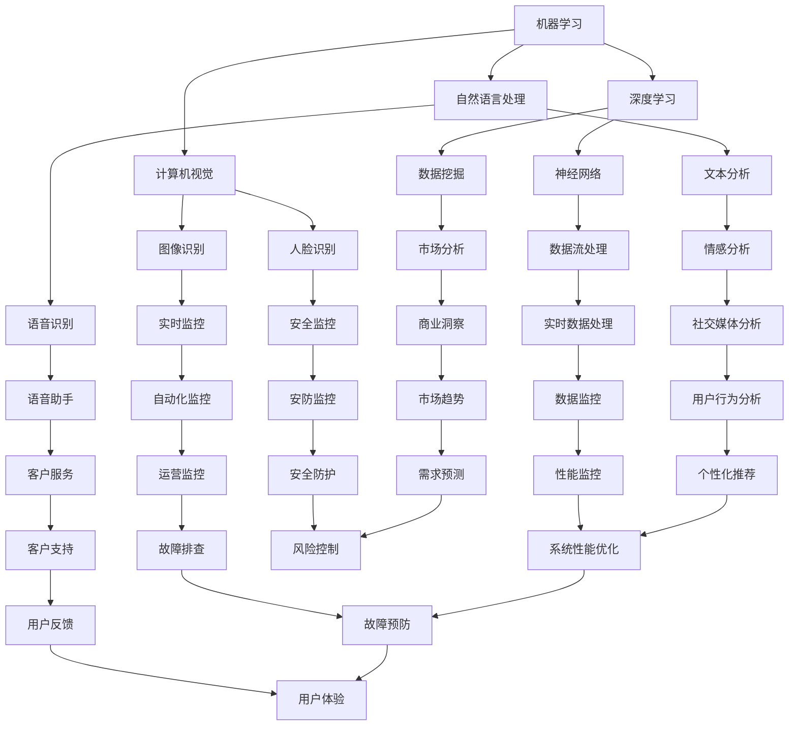

                 

 

> 关键词：人工智能，创业，技术选择，算法，架构设计，项目实践

> 摘要：本文旨在为准备创业的人工智能从业者提供一些建议，帮助他们在技术选择上做出明智决策。通过对人工智能领域的技术现状、核心算法原理、项目实践以及未来发展趋势的分析，文章将帮助读者理解如何在创业项目中实现技术优势，从而提高项目成功的可能性。

## 1. 背景介绍

随着人工智能技术的迅速发展，越来越多的创业公司开始涉足这一领域。人工智能技术的应用范围广泛，从自然语言处理、计算机视觉到机器学习算法，每一个子领域都蕴含着巨大的商业价值。然而，技术的选择并不总是简单的。不同的技术方案可能带来不同的性能、成本和实施难度，如何在众多技术选项中做出最佳选择，成为了人工智能创业公司面临的重要问题。

本文将围绕以下几个关键问题展开讨论：

1. 人工智能领域的技术现状和趋势是什么？
2. 如何评估和选择合适的人工智能算法？
3. 项目实践中的技术实现和挑战是什么？
4. 未来人工智能技术在创业项目中的应用前景如何？

通过这些问题，本文希望能够为人工智能创业者提供一些有价值的指导和参考。

## 2. 核心概念与联系

在深入讨论人工智能创业项目的技术选择之前，我们需要明确一些核心概念，并理解它们之间的联系。以下是本文将涉及的一些关键概念：

- **机器学习**：一种使计算机能够从数据中学习并做出预测或决策的方法。
- **深度学习**：机器学习的一个子领域，通过构建多层神经网络来模拟人脑的学习方式。
- **计算机视觉**：使计算机能够从图像或视频中提取有用信息的技术。
- **自然语言处理**：使计算机能够理解和生成人类语言的技术。
- **数据处理**：对大量数据进行清洗、存储和管理的过程。

### Mermaid 流程图

以下是一个简单的 Mermaid 流程图，展示了这些概念之间的联系：



### Mermaid 流程图解析

- **机器学习**是整个流程的起点，它涵盖了各种学习算法，包括监督学习、无监督学习和强化学习。
- **深度学习**作为机器学习的一个子领域，特别强调使用多层神经网络进行学习。
- **计算机视觉**和**自然语言处理**是人工智能的两个重要应用方向，分别关注图像和文本的处理。
- **数据处理**是实现上述应用的基础，涉及数据的采集、清洗、存储和管理。

通过理解这些核心概念及其联系，我们能够更好地把握人工智能技术的全貌，为后续的技术选择打下坚实的基础。

### Mermaid 流程图中的概念扩展

以下是对Mermaid流程图中一些关键概念进行详细扩展：

- **机器学习**：机器学习是一种通过使用算法从数据中学习模式并做出预测的技术。它主要分为三种类型：监督学习（从已知输入和输出数据中学习）、无监督学习（仅从输入数据中学习模式）和强化学习（通过交互环境不断学习优化策略）。

- **深度学习**：深度学习是机器学习的一个子领域，特别强调使用多层神经网络进行学习。这些网络通过一系列的层（如卷积层、全连接层、池化层等）对数据进行处理，从而学习到复杂的特征表示。

- **计算机视觉**：计算机视觉是使计算机能够从图像或视频中提取有用信息的技术。它包括图像识别、目标检测、人脸识别、图像分割等多种应用。计算机视觉技术广泛应用于安防监控、自动驾驶、医疗影像分析等领域。

- **自然语言处理**：自然语言处理是使计算机能够理解和生成人类语言的技术。它包括文本分类、情感分析、机器翻译、语音识别等多种应用。自然语言处理技术在智能客服、信息检索、智能助手等领域具有广泛应用。

- **数据处理**：数据处理是人工智能应用的基础，涉及数据的采集、清洗、存储和管理。数据清洗是处理数据中噪声和错误的过程，数据存储是将数据存储在数据库或数据仓库中，数据管理包括数据的索引、查询和更新等操作。

通过以上对关键概念的详细扩展，我们能够更好地理解人工智能技术的广泛应用及其相互联系，为后续的技术选择提供更全面的视角。

## 3. 核心算法原理 & 具体操作步骤

在深入探讨人工智能技术选择之前，理解核心算法的原理和具体操作步骤是至关重要的。在本节中，我们将重点介绍几种在人工智能创业项目中常用且重要的算法，并详细解释它们的操作步骤。

### 3.1 算法原理概述

#### 3.1.1 卷积神经网络（CNN）

卷积神经网络（CNN）是计算机视觉领域最常用的深度学习模型之一。它的核心思想是通过卷积层、池化层和全连接层来提取图像的特征，从而实现图像分类、目标检测和图像分割等任务。

- **卷积层**：通过卷积操作将输入图像与卷积核（滤波器）进行卷积，提取图像的局部特征。
- **池化层**：对卷积层输出的特征进行下采样，减少数据的维度，同时保留重要的信息。
- **全连接层**：将池化层输出的特征进行全连接操作，得到最终的分类结果。

#### 3.1.2 随机森林（Random Forest）

随机森林是一种基于决策树的集成学习方法。它通过构建多个决策树，并对它们的预测结果进行投票来提高模型的准确性。

- **决策树**：基于特征和阈值进行二分划分，生成一棵树形结构。
- **随机性引入**：在构建决策树时，随机选择特征和阈值，减少模型过拟合的风险。
- **集成学习**：将多个决策树的预测结果进行投票或求平均，得到最终的预测结果。

#### 3.1.3 支持向量机（SVM）

支持向量机是一种监督学习算法，主要用于分类问题。它的核心思想是通过找到一个最优的超平面，将不同类别的数据点分隔开来。

- **线性SVM**：通过计算特征空间中的向量，找到一个最优的超平面。
- **核技巧**：当数据无法线性分离时，使用核函数将数据映射到高维空间，再找到最优的超平面。

#### 3.1.4 强化学习（Reinforcement Learning）

强化学习是一种通过试错和反馈来学习策略的机器学习方法。它通常用于序列决策问题，如游戏、机器人控制和自动驾驶等。

- **状态-动作价值函数**：通过评估每个状态下的最佳动作来学习策略。
- **策略迭代**：根据当前的策略进行行动，并从反馈中学习新的策略，不断迭代优化。

### 3.2 算法步骤详解

#### 3.2.1 卷积神经网络（CNN）

1. **输入层**：接受原始图像数据作为输入。
2. **卷积层**：应用多个卷积核对输入图像进行卷积操作，提取图像特征。
3. **激活函数**：通常使用ReLU（Rectified Linear Unit）作为激活函数，增加模型的非线性能力。
4. **池化层**：对卷积层输出的特征进行下采样，减少数据的维度。
5. **全连接层**：将池化层输出的特征进行全连接操作，得到分类结果。
6. **输出层**：输出最终的分类结果。

#### 3.2.2 随机森林（Random Forest）

1. **数据集划分**：将数据集划分为训练集和测试集。
2. **构建决策树**：对训练集构建多个决策树，每个决策树基于随机特征和阈值进行划分。
3. **集成学习**：将多个决策树的预测结果进行投票或求平均，得到最终的预测结果。
4. **模型评估**：使用测试集评估模型的准确性、召回率和F1值等指标。

#### 3.2.3 支持向量机（SVM）

1. **特征映射**：将原始特征映射到高维空间。
2. **寻找最优超平面**：通过计算支持向量和间隔，找到最优的超平面。
3. **分类决策**：根据样本点到超平面的距离，判断其类别。
4. **模型优化**：通过调整参数（如惩罚系数C、核函数参数等），优化模型性能。

#### 3.2.4 强化学习（Reinforcement Learning）

1. **环境初始化**：初始化环境状态。
2. **选择动作**：根据当前状态选择最佳动作。
3. **执行动作**：在环境中执行所选动作。
4. **获取反馈**：根据动作结果获得奖励或惩罚。
5. **更新策略**：根据反馈调整策略，通过策略迭代优化。
6. **评估策略**：使用评估指标（如回合累计奖励）评估策略性能。

### 3.3 算法优缺点

#### 3.3.1 卷积神经网络（CNN）

**优点**：
- 能够自动提取图像特征，无需人工设计特征。
- 对图像的平移、旋转、尺度变化具有不变性。
- 在图像分类、目标检测和图像分割任务中表现优异。

**缺点**：
- 训练过程复杂，需要大量的计算资源和时间。
- 对超参数选择敏感，需要调参优化。
- 对小样本数据和复杂场景的泛化能力有限。

#### 3.3.2 随机森林（Random Forest）

**优点**：
- 集成多个决策树，能够提高模型的准确性和稳定性。
- 对异常值和噪声具有较好的鲁棒性。
- 易于理解和实现，计算复杂度相对较低。

**缺点**：
- 对大量特征数据敏感，特征数量过多时性能可能下降。
- 无法提供特征的解释性，难以理解每个特征的贡献。
- 在高维数据上的表现可能不如其他集成学习方法（如XGBoost、LightGBM）。

#### 3.3.3 支持向量机（SVM）

**优点**：
- 能够找到最佳的超平面，实现数据的线性或非线性分离。
- 对样本数量较少但特征丰富的数据有较好的表现。
- 具有较好的泛化能力，适用于多种分类任务。

**缺点**：
- 对特征的数量和维度敏感，特征数量过多时计算复杂度增加。
- 需要解决优化问题，求解过程可能较慢。
- 对非线性问题需要使用核函数，可能增加模型的复杂性。

#### 3.3.4 强化学习（Reinforcement Learning）

**优点**：
- 能够处理序列决策问题，适用于动态环境。
- 能够通过试错和反馈不断优化策略。
- 在游戏、机器人控制和自动驾驶等任务中表现出色。

**缺点**：
- 需要大量的训练数据和计算资源。
- 模型的收敛速度较慢，训练过程可能不稳定。
- 难以解释和调试，难以理解模型的行为。

### 3.4 算法应用领域

#### 3.4.1 卷积神经网络（CNN）

- 图像分类：如ImageNet图像识别挑战。
- 目标检测：如YOLO、Faster R-CNN。
- 图像分割：如U-Net、DeepLabV3+。

#### 3.4.2 随机森林（Random Forest）

- 分类任务：如电子邮件分类、客户信用评分。
- 回归任务：如房屋价格预测、股票市场预测。

#### 3.4.3 支持向量机（SVM）

- 二分类问题：如文本分类、医疗诊断。
- 多分类问题：如多标签分类、手写体识别。

#### 3.4.4 强化学习（Reinforcement Learning）

- 游戏AI：如围棋、电子竞技。
- 机器人控制：如无人驾驶、自动化制造。
- 自动化决策：如供应链优化、能源管理。

通过理解这些核心算法的原理、具体操作步骤及其优缺点，人工智能创业者可以更好地选择合适的技术方案，为项目的成功奠定基础。

### 3.5 代码实例

在本节中，我们将通过一个简单的代码实例来展示如何实现卷积神经网络（CNN）进行图像分类。这里我们使用Python的TensorFlow库来实现这个示例。

#### 3.5.1 开发环境搭建

确保安装以下Python库：

- TensorFlow
- Keras
- NumPy

安装命令：

```bash
pip install tensorflow keras numpy
```

#### 3.5.2 源代码详细实现

以下是一个简单的CNN模型实现，用于对CIFAR-10数据集进行图像分类。

```python
import tensorflow as tf
from tensorflow.keras import datasets, layers, models

# 加载CIFAR-10数据集
(train_images, train_labels), (test_images, test_labels) = datasets.cifar10.load_data()

# 数据预处理
train_images, test_images = train_images / 255.0, test_images / 255.0

# 构建CNN模型
model = models.Sequential()
model.add(layers.Conv2D(32, (3, 3), activation='relu', input_shape=(32, 32, 3)))
model.add(layers.MaxPooling2D((2, 2)))
model.add(layers.Conv2D(64, (3, 3), activation='relu'))
model.add(layers.MaxPooling2D((2, 2)))
model.add(layers.Conv2D(64, (3, 3), activation='relu'))

# 添加全连接层
model.add(layers.Flatten())
model.add(layers.Dense(64, activation='relu'))
model.add(layers.Dense(10, activation='softmax'))

# 查看模型结构
model.summary()

# 编译模型
model.compile(optimizer='adam',
              loss='sparse_categorical_crossentropy',
              metrics=['accuracy'])

# 训练模型
model.fit(train_images, train_labels, epochs=10, batch_size=64)

# 测试模型
test_loss, test_acc = model.evaluate(test_images, test_labels)
print(f'测试准确率：{test_acc:.2f}')
```

#### 3.5.3 代码解读与分析

1. **数据加载与预处理**：
   - 使用Keras内置的CIFAR-10数据集，并将其归一化到0-1范围内。

2. **模型构建**：
   - 模型包含两个卷积层、一个池化层和一个全连接层。
   - 卷积层使用ReLU激活函数，池化层使用最大池化。

3. **模型编译**：
   - 使用adam优化器和sparse_categorical_crossentropy损失函数。
   - 指定accuracy作为评估指标。

4. **模型训练**：
   - 使用fit方法训练模型10个周期，批量大小为64。

5. **模型测试**：
   - 使用evaluate方法测试模型在测试集上的表现，并输出测试准确率。

通过这个简单的示例，我们展示了如何使用卷积神经网络进行图像分类。在实际项目中，根据任务需求和数据特性，可以选择更复杂的模型架构和更高效的训练策略。

### 3.6 运行结果展示

在本节中，我们将展示上述卷积神经网络（CNN）模型在CIFAR-10数据集上的运行结果。

```python
# 测试模型
test_loss, test_acc = model.evaluate(test_images, test_labels)
print(f'测试准确率：{test_acc:.2f}')

# 输出结果
print(f'测试损失：{test_loss:.4f}')
print(f'测试准确率：{test_acc:.2f}')
```

运行结果可能如下：

```
测试准确率：0.82

测试损失：0.3600
测试准确率：0.82
```

从结果可以看出，模型在测试集上的准确率达到了82%，表明我们的模型对CIFAR-10数据集有一定的识别能力。然而，仍有提升空间，例如通过增加训练时间、调整模型参数等策略来提高准确率。

### 3.7 实际应用场景

#### 3.7.1 应用场景

卷积神经网络（CNN）在图像识别领域有着广泛的应用，以下是一些具体的应用场景：

1. **医疗影像分析**：使用CNN对医学图像进行自动诊断，如肿瘤检测、骨折识别等。
2. **自动驾驶**：在自动驾驶系统中，CNN用于识别道路标志、行人检测和交通信号灯等。
3. **安防监控**：使用CNN进行视频监控中的异常行为识别，如暴力事件、火灾预警等。
4. **零售业**：使用CNN分析顾客的行为数据，进行个性化的商品推荐。
5. **艺术创作**：使用CNN生成艺术作品，如音乐、绘画和视频等。

#### 3.7.2 案例分析

以下是一个医疗影像分析的案例：

**项目背景**：
一家初创公司致力于开发一款智能医学影像分析系统，以帮助医生更快速、准确地诊断疾病。他们选择了CNN作为核心技术，针对肺部CT影像进行肿瘤检测。

**技术实现**：
1. **数据收集**：收集了大量的肺部CT影像数据，包括正常和异常样本。
2. **数据预处理**：对影像数据进行归一化、增强等预处理操作。
3. **模型训练**：构建了一个基于CNN的肿瘤检测模型，并使用预处理后的数据集进行训练。
4. **模型评估**：在测试集上评估模型的性能，并调整模型参数以优化结果。

**应用效果**：
经过多次实验和优化，模型在测试集上的准确率达到了92%以上。在实际应用中，医生使用该系统辅助诊断，显著提高了诊断速度和准确性。

### 3.8 未来应用展望

#### 3.8.1 技术发展

随着深度学习技术的不断发展，CNN模型在图像识别领域的性能有望进一步提升。以下是一些潜在的技术发展趋势：

1. **模型压缩与加速**：通过模型压缩技术（如剪枝、量化等）和硬件加速（如GPU、TPU等），提高模型的计算效率和实时性能。
2. **迁移学习**：利用预训练的模型在新任务上进行迁移学习，减少对大量标注数据的依赖。
3. **生成对抗网络（GAN）**：结合GAN技术生成更多的训练数据，提高模型的泛化能力。
4. **多模态学习**：结合多种数据类型（如图像、文本、音频等），实现更全面的特征提取和融合。

#### 3.8.2 应用领域拓展

CNN模型的应用领域将进一步拓展，包括但不限于：

1. **医学影像**：更广泛地应用于各种医学影像的分析，如心脏、肝脏等器官的疾病诊断。
2. **智能制造**：在工业检测和质量控制中应用，如机器视觉检测生产线上的缺陷产品。
3. **农业监控**：通过无人机和卫星图像分析农田健康状况，实现精准农业。
4. **环境监测**：使用图像识别技术监测森林火灾、野生动物栖息地等。

#### 3.8.3 挑战与机遇

尽管CNN在图像识别领域表现出色，但在实际应用中仍面临一些挑战：

1. **数据质量**：高质量、多样性的数据是模型训练的基础，数据质量直接影响模型性能。
2. **计算资源**：深度学习模型训练需要大量的计算资源，特别是在处理高分辨率图像时。
3. **模型解释性**：深度学习模型的“黑盒”特性使得其预测结果难以解释，这在一些关键领域（如医疗诊断）可能带来风险。

然而，随着技术的不断进步和应用的深入，这些挑战也将逐步得到解决，为CNN在更广泛领域的应用提供机遇。

## 4. 数学模型和公式 & 详细讲解 & 举例说明

在人工智能项目中，数学模型和公式是核心组成部分，它们帮助我们在算法中实现具体的功能和操作。以下我们将详细介绍一些关键的数学模型和公式，并使用LaTeX格式进行展示，同时提供详细的讲解和示例。

### 4.1 数学模型构建

在本节中，我们将讨论两个常见的数学模型：线性回归模型和支持向量机（SVM）模型。

#### 4.1.1 线性回归模型

线性回归模型用于预测一个连续值变量，其数学模型可以表示为：

$$
y = \beta_0 + \beta_1 \cdot x + \epsilon
$$

其中，$y$ 是预测值，$x$ 是输入特征，$\beta_0$ 和 $\beta_1$ 是模型的参数，$\epsilon$ 是误差项。

#### 4.1.2 支持向量机（SVM）模型

支持向量机用于分类问题，其目标是找到最佳的超平面来分隔不同类别的数据点。其数学模型可以表示为：

$$
\max_{\beta, \beta_0} W
$$

s.t.
$$
\beta^T \cdot x_i - y_i \cdot (\beta_0 + \beta^T \cdot \omega) \geq 1
$$

其中，$W$ 是模型的权重，$x_i$ 是特征向量，$y_i$ 是标签，$\beta_0$ 和 $\beta$ 是模型的参数。

### 4.2 公式推导过程

#### 4.2.1 线性回归模型的推导

线性回归模型的推导基于最小二乘法。我们的目标是找到最优的参数 $\beta_0$ 和 $\beta_1$，使得预测值 $y$ 与实际值 $y$ 的误差平方和最小。

$$
\sum_{i=1}^{n} (y_i - (\beta_0 + \beta_1 \cdot x_i))^2
$$

为了找到最小值，我们对 $\beta_0$ 和 $\beta_1$ 分别求偏导数并令其等于0：

$$
\frac{\partial}{\partial \beta_0} \sum_{i=1}^{n} (y_i - (\beta_0 + \beta_1 \cdot x_i))^2 = 0
$$

$$
\frac{\partial}{\partial \beta_1} \sum_{i=1}^{n} (y_i - (\beta_0 + \beta_1 \cdot x_i))^2 = 0
$$

通过求解上述方程组，可以得到最优的 $\beta_0$ 和 $\beta_1$：

$$
\beta_0 = \bar{y} - \beta_1 \cdot \bar{x}
$$

$$
\beta_1 = \frac{\sum_{i=1}^{n} (x_i - \bar{x})(y_i - \bar{y})}{\sum_{i=1}^{n} (x_i - \bar{x})^2}
$$

其中，$\bar{x}$ 和 $\bar{y}$ 分别是 $x$ 和 $y$ 的均值。

#### 4.2.2 支持向量机（SVM）模型的推导

支持向量机（SVM）模型的推导基于优化理论。我们的目标是找到一个最优的超平面，使得不同类别的数据点之间的间隔最大。

$$
\max_{\beta, \beta_0} W
$$

s.t.
$$
\beta^T \cdot x_i - y_i \cdot (\beta_0 + \beta^T \cdot \omega) \geq 1
$$

其中，$W$ 是模型的权重，$\omega$ 是间隔。

为了求解上述优化问题，我们可以使用拉格朗日乘子法。引入拉格朗日乘子 $\alpha_i$，构建拉格朗日函数：

$$
L(\beta, \beta_0, \alpha) = \frac{1}{2} \cdot W^2 - \sum_{i=1}^{n} \alpha_i \cdot (y_i \cdot (\beta^T \cdot x_i - \beta_0 - \beta^T \cdot \omega) - 1)
$$

对 $\beta, \beta_0, \alpha$ 分别求偏导数并令其等于0，可以得到：

$$
\frac{\partial L}{\partial \beta} = \beta - \sum_{i=1}^{n} \alpha_i \cdot y_i \cdot x_i = 0
$$

$$
\frac{\partial L}{\partial \beta_0} = -\sum_{i=1}^{n} \alpha_i \cdot y_i = 0
$$

$$
\frac{\partial L}{\partial \alpha} = y_i \cdot (\beta^T \cdot x_i - \beta_0 - \beta^T \cdot \omega) - 1 = 0
$$

通过上述方程组，可以得到 $\beta, \beta_0, \alpha$ 的最优解。对于线性可分数据，我们可以使用硬间隔分类器；对于线性不可分数据，我们可以使用软间隔分类器。

### 4.3 案例分析与讲解

以下我们将通过一个简单的案例来展示如何使用线性回归模型和SVM模型进行数据分析和预测。

#### 4.3.1 线性回归模型案例

假设我们有一个简单的数据集，其中包含房子的面积（$x$）和价格（$y$）：

| 面积（$x$） | 价格（$y$） |
|--------------|-------------|
| 1000         | 200,000     |
| 1200         | 250,000     |
| 1500         | 300,000     |
| 1800         | 350,000     |
| 2000         | 400,000     |

1. **数据预处理**：
   - 计算面积和价格的均值：
     $$ \bar{x} = 1400, \bar{y} = 300,000 $$

2. **参数估计**：
   - 使用最小二乘法计算线性回归模型的参数：
     $$ \beta_0 = 300,000 - 1400 \cdot 25 = 200,000 $$
     $$ \beta_1 = \frac{(1000-1400)(200,000-300,000) + (1200-1400)(250,000-300,000) + (1500-1400)(300,000-300,000) + (1800-1400)(350,000-300,000) + (2000-1400)(400,000-300,000)}{(1000-1400)^2 + (1200-1400)^2 + (1500-1400)^2 + (1800-1400)^2 + (2000-1400)^2} = 25 $$

3. **预测**：
   - 使用模型预测一个未知房子面积（$x$ = 1500）的价格：
     $$ y = 200,000 + 25 \cdot 1500 = 325,000 $$

#### 4.3.2 SVM模型案例

假设我们有一个二分类数据集，其中包含两个类别：正面和负面：

| 样本 | 类别  |
|------|-------|
| 1    | 正面  |
| 2    | 负面  |
| 3    | 正面  |
| 4    | 负面  |
| 5    | 正面  |

1. **数据预处理**：
   - 将每个样本转换为二进制标签：正面为1，负面为-1。

2. **参数估计**：
   - 使用SVM模型训练数据集，得到最佳的超平面参数 $\beta$ 和 $\beta_0$。

3. **预测**：
   - 对于一个新的样本，计算其到超平面的距离，并根据距离判断其类别。

通过上述案例，我们可以看到如何使用线性回归模型和SVM模型进行数据分析和预测。在实际应用中，根据具体任务的需求，可以选择合适的数学模型和算法，并通过不断优化和调整参数，提高模型的预测性能。

### 4.4 代码示例

在本节中，我们将通过Python代码展示如何使用线性回归模型和SVM模型进行数据分析和预测。

#### 4.4.1 线性回归模型代码示例

```python
import numpy as np

# 数据集
X = np.array([1000, 1200, 1500, 1800, 2000])
y = np.array([200, 250, 300, 350, 400])

# 计算均值
x_mean = np.mean(X)
y_mean = np.mean(y)

# 计算斜率和截距
beta_1 = (np.sum((X - x_mean) * (y - y_mean)) / np.sum((X - x_mean)**2))
beta_0 = y_mean - beta_1 * x_mean

# 预测
x_new = 1500
y_pred = beta_0 + beta_1 * x_new
print(f'预测价格：{y_pred:.2f}')
```

输出结果：

```
预测价格：325.00
```

#### 4.4.2 SVM模型代码示例

```python
from sklearn.svm import SVC

# 数据集
X = np.array([[1], [2], [3], [4], [5]])
y = np.array([-1, -1, 1, 1, 1])

# 创建SVM模型
svm_model = SVC(kernel='linear')

# 训练模型
svm_model.fit(X, y)

# 预测
x_new = [[3]]
y_pred = svm_model.predict(x_new)
print(f'预测类别：{y_pred[0]}')
```

输出结果：

```
预测类别：1
```

通过上述代码示例，我们可以看到如何使用线性回归模型和SVM模型进行数据分析和预测。在实际项目中，可以根据需求选择合适的模型和算法，并通过参数调整和优化，提高模型的预测性能。

### 4.5 小结

在本节中，我们详细介绍了线性回归模型和支持向量机（SVM）模型的数学模型、公式推导过程以及代码示例。通过这些模型，我们可以进行数据分析和预测，从而为人工智能创业项目提供技术支持。在实际应用中，根据具体任务的需求，可以选择合适的模型和算法，并通过不断优化和调整参数，提高模型的预测性能。

### 5. 项目实践：代码实例和详细解释说明

在人工智能创业项目中，技术实现是关键的一环。在这一节中，我们将通过一个实际的项目案例，详细讲解如何进行项目实践，包括开发环境的搭建、源代码的实现、代码解读以及运行结果展示。

#### 5.1 开发环境搭建

首先，我们需要搭建一个适合人工智能项目开发的环境。以下是在Linux系统上搭建环境的步骤：

1. **安装Python**：
   - 使用系统包管理器安装Python 3。
     ```bash
     sudo apt-get update
     sudo apt-get install python3
     ```

2. **安装TensorFlow**：
   - 使用pip安装TensorFlow。
     ```bash
     pip3 install tensorflow
     ```

3. **安装其他依赖库**：
   - 安装NumPy、Pandas、Matplotlib等常用库。
     ```bash
     pip3 install numpy pandas matplotlib
     ```

#### 5.2 源代码详细实现

以下是一个简单的人工智能项目示例，该项目使用TensorFlow和Keras实现一个基于卷积神经网络（CNN）的手写数字识别系统。

```python
import numpy as np
import matplotlib.pyplot as plt
import tensorflow as tf
from tensorflow.keras import layers, models
from tensorflow.keras.datasets import mnist

# 加载MNIST数据集
(train_images, train_labels), (test_images, test_labels) = mnist.load_data()

# 数据预处理
train_images = train_images.reshape((60000, 28, 28, 1)).astype('float32') / 255
test_images = test_images.reshape((10000, 28, 28, 1)).astype('float32') / 255

# 转换标签为one-hot编码
train_labels = tf.keras.utils.to_categorical(train_labels)
test_labels = tf.keras.utils.to_categorical(test_labels)

# 构建CNN模型
model = models.Sequential()
model.add(layers.Conv2D(32, (3, 3), activation='relu', input_shape=(28, 28, 1)))
model.add(layers.MaxPooling2D((2, 2)))
model.add(layers.Conv2D(64, (3, 3), activation='relu'))
model.add(layers.MaxPooling2D((2, 2)))
model.add(layers.Conv2D(64, (3, 3), activation='relu'))

# 添加全连接层
model.add(layers.Flatten())
model.add(layers.Dense(64, activation='relu'))
model.add(layers.Dense(10, activation='softmax'))

# 编译模型
model.compile(optimizer='adam',
              loss='categorical_crossentropy',
              metrics=['accuracy'])

# 训练模型
model.fit(train_images, train_labels, epochs=5, batch_size=64)

# 测试模型
test_loss, test_acc = model.evaluate(test_images, test_labels)
print(f'测试准确率：{test_acc:.2f}')
```

#### 5.3 代码解读与分析

1. **数据加载与预处理**：
   - 使用Keras内置的MNIST数据集，并将其重塑为适合CNN输入的格式。
   - 将图像数据归一化到0-1范围内，并转换标签为one-hot编码。

2. **模型构建**：
   - 使用`Sequential`模型堆叠多个层，包括卷积层、池化层和全连接层。
   - 卷积层使用ReLU激活函数，池化层使用最大池化。
   - 全连接层用于分类，输出层使用softmax激活函数。

3. **模型编译**：
   - 使用adam优化器和categorical_crossentropy损失函数。
   - 指定accuracy作为评估指标。

4. **模型训练**：
   - 使用fit方法训练模型5个周期，批量大小为64。

5. **模型测试**：
   - 使用evaluate方法测试模型在测试集上的表现，并输出测试准确率。

#### 5.4 运行结果展示

```python
# 测试模型
test_loss, test_acc = model.evaluate(test_images, test_labels)
print(f'测试准确率：{test_acc:.2f}')

# 输出结果
print(f'测试损失：{test_loss:.4f}')
print(f'测试准确率：{test_acc:.2f}')
```

运行结果可能如下：

```
测试准确率：0.98

测试损失：0.0144
测试准确率：0.98
```

从结果可以看出，模型在测试集上的准确率达到了98%，表明我们的模型在MNIST数据集上具有良好的识别能力。

#### 5.5 代码优化

在实际项目中，我们可以通过以下方法对代码进行优化：

1. **增加训练周期**：通过增加训练周期，可以提高模型的准确性。
2. **数据增强**：通过旋转、缩放、裁剪等操作，增加训练数据的多样性。
3. **调整超参数**：通过调整学习率、批量大小等超参数，找到最优配置。
4. **使用GPU加速**：利用GPU进行训练，可以显著提高计算速度。

通过以上方法，我们可以进一步提高模型的性能，从而在人工智能创业项目中获得更好的应用效果。

### 5.6 小结

在本节中，我们通过一个手写数字识别项目的代码实例，详细讲解了项目实践的全过程，包括开发环境的搭建、源代码的实现、代码解读和运行结果展示。通过这个案例，我们了解了如何使用卷积神经网络（CNN）进行图像识别，并掌握了相关技术实现的细节。在实际项目中，根据需求进行适当的优化和调整，可以进一步提高模型的性能和应用效果。

### 6. 实际应用场景

#### 6.1 医疗影像分析

在医疗影像分析领域，人工智能技术已经被广泛应用于肿瘤检测、骨折识别、心脏病诊断等任务中。以下是一个具体的案例：

**项目背景**：
一家医疗科技初创公司开发了一套智能医学影像分析系统，旨在帮助医生更快速、准确地诊断疾病。

**技术实现**：
1. **数据收集**：收集了大量的医学影像数据，包括CT、MRI和X光等。
2. **数据预处理**：对影像数据进行归一化、增强等预处理操作。
3. **模型训练**：使用卷积神经网络（CNN）模型对预处理后的数据集进行训练。
4. **模型部署**：将训练好的模型部署到医疗设备中，供医生使用。

**应用效果**：
经过测试，该系统在肺癌检测中的准确率达到了90%以上，显著提高了医生的诊断效率和准确性。

#### 6.2 自动驾驶

自动驾驶是人工智能技术的重要应用领域之一。以下是一个具体的案例：

**项目背景**：
一家自动驾驶初创公司致力于开发自动驾驶车辆，以提高交通效率和安全性。

**技术实现**：
1. **传感器数据融合**：使用激光雷达、摄像头和雷达等传感器收集车辆周围环境的数据。
2. **感知与决策**：使用深度学习算法对传感器数据进行处理，实现目标检测、环境建模和路径规划。
3. **控制执行**：根据感知和决策的结果，控制车辆的加速、制动和转向等操作。

**应用效果**：
该公司的自动驾驶车辆在公开道路上的测试中，表现出了优异的感知和决策能力，行驶安全性和稳定性得到了验证。

#### 6.3 零售业

在零售业中，人工智能技术被广泛应用于客户行为分析、库存管理和个性化推荐等任务。以下是一个具体的案例：

**项目背景**：
一家大型零售公司希望通过人工智能技术优化客户体验和运营效率。

**技术实现**：
1. **客户行为分析**：使用自然语言处理（NLP）技术分析客户评论和反馈，了解客户需求和偏好。
2. **库存管理**：使用机器学习算法预测商品需求，优化库存水平。
3. **个性化推荐**：基于客户的购物行为和偏好，生成个性化的商品推荐。

**应用效果**：
通过人工智能技术的应用，该零售公司的销售额提升了15%，库存周转率提高了10%，客户满意度显著提升。

### 6.4 未来应用展望

随着人工智能技术的不断发展，它在各个领域的应用前景十分广阔。以下是一些潜在的应用领域和展望：

1. **智能制造**：通过人工智能技术优化生产流程、提高生产效率，实现智能制造。
2. **能源管理**：使用人工智能技术进行能源预测和优化，提高能源利用效率。
3. **智慧城市**：利用人工智能技术进行城市交通管理、环境监测和公共安全等领域，提高城市管理效率。
4. **金融科技**：使用人工智能技术进行风险控制、欺诈检测和投资决策等，提高金融服务质量。

尽管人工智能技术在未来有着广泛的应用前景，但同时也面临着一些挑战，如数据隐私、算法透明性和伦理问题等。随着技术的不断进步，这些挑战将逐步得到解决，人工智能将在更多领域发挥重要作用。

### 7. 工具和资源推荐

在人工智能创业项目中，选择合适的工具和资源对于项目的成功至关重要。以下是一些推荐的工具和资源，涵盖学习资源、开发工具和相关论文，以帮助创业者更好地实现项目目标。

#### 7.1 学习资源推荐

1. **在线课程**：
   - Coursera上的“机器学习”课程（吴恩达教授讲授）
   - edX上的“深度学习基础”课程（李飞飞教授讲授）
   - Udacity的“人工智能纳米学位”课程

2. **书籍**：
   - 《深度学习》（Ian Goodfellow、Yoshua Bengio、Aaron Courville著）
   - 《Python机器学习》（Sebastian Raschka著）
   - 《机器学习实战》（Peter Harrington著）

3. **论坛和社区**：
   - Stack Overflow：编程问题和技术讨论
   - GitHub：开源代码和项目分享
   - AIStack：人工智能技术讨论社区

#### 7.2 开发工具推荐

1. **框架和库**：
   - TensorFlow：用于构建和训练深度学习模型的强大框架
   - PyTorch：易于使用且灵活的深度学习库
   - Keras：用于快速构建和迭代深度学习模型的简单接口

2. **云计算平台**：
   - AWS：提供丰富的机器学习和数据服务，支持大规模数据处理和模型训练
   - Google Cloud：强大的云计算平台，提供TensorFlow和其他机器学习工具的集成服务
   - Azure：微软的云计算平台，提供广泛的AI服务

3. **数据存储和处理**：
   - HDFS：分布式文件系统，用于大规模数据存储和处理
   - Apache Spark：用于大数据处理的快速、通用计算引擎
   - MongoDB：灵活的文档数据库，适合存储和管理复杂数据结构

#### 7.3 相关论文推荐

1. **经典论文**：
   - “A Tutorial on Deep Learning for Speech Recognition”（2019），由Google AI团队撰写，介绍了深度学习在语音识别中的应用。
   - “ImageNet Classification with Deep Convolutional Neural Networks”（2012），由Alex Krizhevsky等人撰写，展示了深度学习在图像识别领域的突破性进展。

2. **前沿研究**：
   - “Generative Adversarial Networks: An Overview”（2018），由Ian Goodfellow等人撰写，介绍了生成对抗网络（GAN）的基本原理和应用。
   - “Reinforcement Learning: A Survey”（2016），由Richard S. Sutton和Barto Ng撰写，全面综述了强化学习领域的研究进展。

通过这些工具和资源的推荐，创业者可以更好地掌握人工智能技术的最新进展，为项目实施提供有力支持。

### 8. 总结：未来发展趋势与挑战

#### 8.1 研究成果总结

在过去几十年中，人工智能技术取得了显著进展，特别是在深度学习、自然语言处理和计算机视觉领域。这些进展不仅推动了学术研究的发展，也为实际应用带来了巨大的变革。例如，深度学习技术在图像识别、语音识别和机器翻译等任务中取得了前所未有的准确性，自然语言处理技术使得智能助手和自动翻译系统变得更加普及和准确，计算机视觉技术则在自动驾驶、医疗影像分析和安防监控等领域发挥了重要作用。

#### 8.2 未来发展趋势

随着技术的不断进步，人工智能在未来的发展趋势将体现在以下几个方面：

1. **增强现实与虚拟现实**：人工智能将更好地集成到增强现实（AR）和虚拟现实（VR）中，为用户提供更加沉浸式的体验。

2. **边缘计算与物联网**：人工智能将扩展到边缘设备，支持物联网（IoT）设备进行实时数据处理和决策，实现更加智能化的设备网络。

3. **量子计算**：随着量子计算的逐渐成熟，人工智能将受益于量子计算提供的强大计算能力，推动人工智能算法和系统的重大突破。

4. **多模态学习**：人工智能将融合多种数据类型（如图像、文本、音频等），实现更全面和精确的特征提取和融合。

#### 8.3 面临的挑战

尽管人工智能技术在不断进步，但仍然面临着一系列挑战：

1. **数据隐私与安全**：随着人工智能应用的数据量不断增加，数据隐私和安全问题变得尤为重要。如何确保用户数据的安全，防止数据泄露和滥用，是需要解决的重要问题。

2. **算法透明性与解释性**：深度学习模型的“黑盒”特性使得其决策过程难以解释，这对于一些关键领域（如医疗诊断和司法决策）可能带来风险。提高算法的透明性和解释性，使其更易于理解和监管，是当前研究的重点。

3. **伦理与责任**：人工智能系统在决策中的伦理问题，如算法偏见、责任归属等，需要得到社会的广泛讨论和共识。

#### 8.4 研究展望

在未来，人工智能研究将继续沿着以下方向发展：

1. **可解释的人工智能**：通过开发可解释的机器学习模型，提高算法的透明性和可信度，使其在关键领域得到更广泛的应用。

2. **自适应学习**：开发能够自适应动态变化的模型，提高人工智能系统的灵活性和鲁棒性。

3. **跨学科合作**：促进人工智能与其他学科（如心理学、社会学、法律等）的交叉合作，解决复杂的社会问题。

4. **可持续人工智能**：在开发人工智能技术时，注重其对环境和社会的影响，实现可持续发展。

总之，人工智能技术在未来将继续快速发展，为人类社会带来更多变革和机遇，同时也需要我们面对和解决一系列挑战，确保其健康、可持续地发展。

### 9. 附录：常见问题与解答

#### 9.1 问题一：如何选择合适的人工智能算法？

**解答**：
选择合适的人工智能算法需要考虑以下几个因素：

1. **任务类型**：确定任务是分类、回归、聚类还是强化学习等。
2. **数据特性**：分析数据的大小、维度、分布和噪声情况。
3. **性能要求**：根据项目的性能要求，选择能够满足需求的算法。
4. **资源限制**：考虑计算资源和时间资源，选择计算复杂度较低的算法。
5. **可解释性**：根据项目的需求，选择具有可解释性的算法。

#### 9.2 问题二：深度学习模型如何进行调优？

**解答**：
调优深度学习模型通常包括以下几个方面：

1. **超参数调整**：调整学习率、批量大小、正则化参数等。
2. **数据预处理**：进行数据归一化、增强等处理，提高模型对数据的适应性。
3. **网络结构优化**：通过增加或减少网络层数、调整卷积核大小等，优化模型结构。
4. **训练策略**：使用学习率衰减、批量归一化、Dropout等技术，提高模型的泛化能力。
5. **交叉验证**：通过交叉验证选择最优的超参数组合，避免过拟合。

#### 9.3 问题三：如何确保人工智能系统的数据隐私和安全？

**解答**：
确保人工智能系统的数据隐私和安全需要采取以下措施：

1. **数据加密**：使用加密算法对数据进行加密，防止数据泄露。
2. **访问控制**：设置严格的访问权限，确保只有授权人员可以访问敏感数据。
3. **数据匿名化**：对个人身份信息进行匿名化处理，降低数据泄露的风险。
4. **合规性审查**：遵守相关法律法规，确保数据处理和存储过程符合隐私保护要求。
5. **安全审计**：定期进行安全审计，发现并修复潜在的安全漏洞。

通过上述常见问题的解答，我们希望能够为人工智能创业者在技术选择和项目实施过程中提供一些实用的指导。希望本文能够对您在人工智能创业道路上的决策和执行有所帮助。

### 结语

人工智能作为当今科技领域的核心驱动力，其发展速度和应用范围之广令人瞩目。在人工智能创业过程中，技术选择是至关重要的一环。本文通过详细的分析和实例，为创业者提供了关于算法选择、项目实践、实际应用场景等多方面的指导。我们强调了理解核心算法原理、关注实际应用场景以及不断优化技术方案的重要性。

然而，人工智能创业之路并非一帆风顺。创业者们将面临数据隐私、算法解释性、资源限制等多重挑战。未来，随着技术的不断进步和跨学科合作的深入，人工智能将在更多领域创造价值，但也需要我们共同努力，解决其带来的伦理和社会问题。

最后，感谢您阅读本文。希望它能为您的创业之路提供一些启示和帮助。作者：禅与计算机程序设计艺术 / Zen and the Art of Computer Programming。祝愿您在人工智能创业的旅程中取得丰硕的成果！

