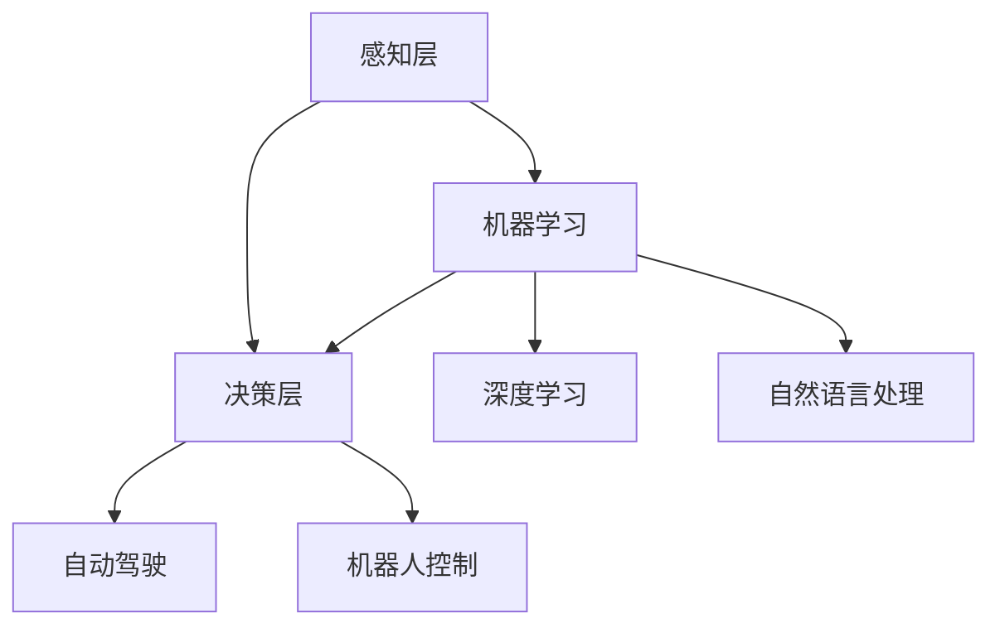

                 

关键词：人工智能，产业应用，创新，技术发展，数学模型，算法原理，实践案例

> 摘要：本文将探讨人工智能技术在产业应用中的创新，分析其核心概念、算法原理、数学模型以及实际应用案例，并展望未来的发展趋势和挑战。

## 1. 背景介绍

随着计算机技术的飞速发展和大数据时代的到来，人工智能（AI）已经逐渐成为推动产业变革的重要力量。人工智能技术在产业中的应用，不仅能够提高生产效率、降低成本，还能带来全新的商业模式和市场机会。近年来，人工智能在图像识别、自然语言处理、预测分析、自动驾驶等领域的应用取得了显著进展，为各行业带来了深刻的变革。

然而，人工智能在产业中的应用仍然面临着一系列挑战，包括算法复杂度、数据隐私、安全性等问题。因此，如何充分利用人工智能技术，实现产业应用的创新，成为当前研究的热点。本文将从核心概念、算法原理、数学模型和实际应用案例等方面，深入探讨人工智能在产业中的应用创新。

## 2. 核心概念与联系

### 2.1 人工智能的定义与分类

人工智能是指使计算机具备智能行为的技术，其目标是让计算机能够像人类一样思考、学习和决策。根据实现方式，人工智能可分为两类：弱人工智能和强人工智能。弱人工智能是指在某些特定任务上具有智能行为的计算机系统，如语音识别、图像识别等；强人工智能是指具有广泛认知能力的计算机系统，能够像人类一样理解和处理各种复杂问题。

### 2.2 人工智能的架构与关键技术

人工智能的架构主要包括感知层、认知层和决策层。感知层负责获取外部信息，如语音、图像和文本等；认知层负责对感知层获取的信息进行分析和理解，如语音识别、图像分类和自然语言处理等；决策层负责根据认知层的结果进行决策和行动，如自动驾驶、机器人控制等。

在人工智能的关键技术中，机器学习、深度学习和自然语言处理具有重要意义。机器学习是一种使计算机自动学习和改进的技术，通过训练数据集，让计算机学会预测和分类。深度学习是机器学习的一种方法，通过多层神经网络，实现更加复杂和抽象的特征提取。自然语言处理则致力于让计算机理解和处理人类语言，包括语音识别、机器翻译、情感分析等。

### 2.3 Mermaid 流程图

下面是一个描述人工智能架构和关键技术的 Mermaid 流程图：



## 3. 核心算法原理 & 具体操作步骤

### 3.1 算法原理概述

人工智能的核心算法包括机器学习、深度学习和自然语言处理。这些算法基于不同的原理，实现计算机的智能行为。

- 机器学习：机器学习是一种基于数据驱动的方法，通过训练数据集，让计算机学会预测和分类。常见的机器学习算法包括决策树、支持向量机、神经网络等。
- 深度学习：深度学习是机器学习的一种方法，通过多层神经网络，实现更加复杂和抽象的特征提取。常见的深度学习模型包括卷积神经网络（CNN）、循环神经网络（RNN）和生成对抗网络（GAN）等。
- 自然语言处理：自然语言处理是一种让计算机理解和处理人类语言的技术，包括语音识别、机器翻译、情感分析等。常见的自然语言处理算法包括词向量、序列标注、翻译模型等。

### 3.2 算法步骤详解

#### 3.2.1 机器学习算法步骤

1. 数据收集：收集用于训练的数据集，确保数据质量和多样性。
2. 数据预处理：对数据进行清洗、归一化和特征提取，以便于算法处理。
3. 模型选择：选择合适的机器学习算法，如决策树、支持向量机等。
4. 模型训练：使用训练数据集，训练模型参数，使模型能够准确预测和分类。
5. 模型评估：使用验证数据集，评估模型性能，调整模型参数。
6. 模型部署：将训练好的模型部署到实际应用场景中。

#### 3.2.2 深度学习算法步骤

1. 数据收集：与机器学习算法类似，收集用于训练的数据集。
2. 数据预处理：与机器学习算法类似，对数据进行清洗、归一化和特征提取。
3. 模型设计：设计深度学习模型结构，如卷积神经网络（CNN）、循环神经网络（RNN）等。
4. 模型训练：使用训练数据集，训练模型参数，使模型能够准确预测和分类。
5. 模型评估：与机器学习算法类似，使用验证数据集，评估模型性能，调整模型参数。
6. 模型部署：将训练好的模型部署到实际应用场景中。

#### 3.2.3 自然语言处理算法步骤

1. 数据收集：与机器学习算法类似，收集用于训练的数据集。
2. 数据预处理：与机器学习算法类似，对数据进行清洗、归一化和特征提取。
3. 模型设计：设计自然语言处理模型结构，如词向量、序列标注、翻译模型等。
4. 模型训练：使用训练数据集，训练模型参数，使模型能够准确预测和分类。
5. 模型评估：与机器学习算法类似，使用验证数据集，评估模型性能，调整模型参数。
6. 模型部署：将训练好的模型部署到实际应用场景中。

### 3.3 算法优缺点

#### 3.3.1 机器学习算法优缺点

**优点：**
1. 泛化能力强，适用于各种类型的预测和分类问题。
2. 适应性强，可以根据不同需求调整模型结构和参数。

**缺点：**
1. 计算复杂度高，训练时间较长。
2. 对数据质量和多样性要求较高。

#### 3.3.2 深度学习算法优缺点

**优点：**
1. 特征提取能力强，能够自动学习复杂和抽象的特征。
2. 适用于图像、语音和文本等数据类型。

**缺点：**
1. 计算资源消耗大，训练时间较长。
2. 对数据量和质量要求较高。

#### 3.3.3 自然语言处理算法优缺点

**优点：**
1. 能够理解和处理人类语言，实现人机交互。
2. 适用于语音识别、机器翻译、情感分析等应用场景。

**缺点：**
1. 处理效果受限于语言模型和算法设计。
2. 对计算资源和数据量要求较高。

### 3.4 算法应用领域

机器学习、深度学习和自然语言处理算法在多个领域有着广泛的应用，包括但不限于：

1. 金融：信用评估、风险控制、量化交易等。
2. 医疗：疾病预测、医疗影像分析、基因测序等。
3. 交通：自动驾驶、智能交通系统、车辆调度等。
4. 教育：个性化学习、智能评测、教育资源推荐等。
5. 电商：推荐系统、广告投放、商品分类等。

## 4. 数学模型和公式 & 详细讲解 & 举例说明

### 4.1 数学模型构建

在人工智能中，数学模型是算法实现的基础。以下是一个常见的数学模型——线性回归的构建过程：

$$
y = \beta_0 + \beta_1x
$$

其中，$y$ 表示因变量，$x$ 表示自变量，$\beta_0$ 和 $\beta_1$ 分别表示模型的参数。

### 4.2 公式推导过程

线性回归模型的推导过程如下：

1. 函数拟合：根据样本数据，拟合出一个线性函数 $y = \beta_0 + \beta_1x$。
2. 最小二乘法：通过最小化残差平方和，求解出模型的参数 $\beta_0$ 和 $\beta_1$。

具体推导过程如下：

$$
\begin{aligned}
\min_{\beta_0, \beta_1} \sum_{i=1}^{n}(y_i - (\beta_0 + \beta_1x_i))^2 \\
\end{aligned}
$$

对上式求导，并令导数为零，得到：

$$
\begin{aligned}
\frac{\partial}{\partial \beta_0}\sum_{i=1}^{n}(y_i - (\beta_0 + \beta_1x_i))^2 &= 0 \\
\frac{\partial}{\partial \beta_1}\sum_{i=1}^{n}(y_i - (\beta_0 + \beta_1x_i))^2 &= 0 \\
\end{aligned}
$$

解得：

$$
\beta_0 = \bar{y} - \beta_1\bar{x}
$$

$$
\beta_1 = \frac{\sum_{i=1}^{n}(x_i - \bar{x})(y_i - \bar{y})}{\sum_{i=1}^{n}(x_i - \bar{x})^2}
$$

其中，$\bar{y}$ 和 $\bar{x}$ 分别表示因变量和自变量的均值。

### 4.3 案例分析与讲解

#### 4.3.1 案例背景

某公司为了分析员工工作效率与工作时间的关系，收集了以下数据：

| 工作效率（y） | 工作时间（x） |
|--------------|-------------|
| 0.8          | 2          |
| 0.9          | 3          |
| 0.75         | 4          |
| 0.85         | 5          |
| 0.88         | 6          |

#### 4.3.2 数据预处理

1. 计算均值：

$$
\bar{y} = \frac{0.8 + 0.9 + 0.75 + 0.85 + 0.88}{5} = 0.84
$$

$$
\bar{x} = \frac{2 + 3 + 4 + 5 + 6}{5} = 4
$$

2. 计算自变量和因变量的差值：

| 工作效率（y） | 工作时间（x） | 差值 $y - \bar{y}$ | 差值 $x - \bar{x}$ |
|--------------|-------------|-----------------|-----------------|
| 0.8          | 2          | 0.04            | -2              |
| 0.9          | 3          | 0.06            | -1              |
| 0.75         | 4          | 0.09            | 0               |
| 0.85         | 5          | 0.01            | 1               |
| 0.88         | 6          | 0.04            | 2               |

3. 计算差值的乘积和平方和：

$$
\sum_{i=1}^{n}(x_i - \bar{x})(y_i - \bar{y}) = (-2 \times 0.04) + (-1 \times 0.06) + (0 \times 0.09) + (1 \times 0.01) + (2 \times 0.04) = 0
$$

$$
\sum_{i=1}^{n}(x_i - \bar{x})^2 = (-2)^2 + (-1)^2 + (0)^2 + (1)^2 + (2)^2 = 10
$$

#### 4.3.3 模型参数求解

代入公式：

$$
\beta_1 = \frac{\sum_{i=1}^{n}(x_i - \bar{x})(y_i - \bar{y})}{\sum_{i=1}^{n}(x_i - \bar{x})^2} = 0
$$

$$
\beta_0 = \bar{y} - \beta_1\bar{x} = 0.84
$$

因此，线性回归模型为：

$$
y = 0.84
$$

#### 4.3.4 模型应用

根据模型，员工的工作效率与工作时间之间存在线性关系，即工作效率始终为 0.84。这意味着工作时间增加，工作效率不变。

## 5. 项目实践：代码实例和详细解释说明

### 5.1 开发环境搭建

1. 安装 Python 3.8 或更高版本。
2. 安装以下库：NumPy、Pandas、Scikit-learn、Matplotlib。

### 5.2 源代码详细实现

```python
import numpy as np
import pandas as pd
from sklearn.linear_model import LinearRegression
import matplotlib.pyplot as plt

# 数据导入
data = pd.read_csv('data.csv')

# 数据预处理
X = data[['工作时间']]
y = data[['工作效率']]

# 模型训练
model = LinearRegression()
model.fit(X, y)

# 模型参数
beta_0 = model.intercept_
beta_1 = model.coef_

# 模型应用
y_pred = model.predict(X)

# 结果展示
plt.scatter(X, y)
plt.plot(X, y_pred, color='red')
plt.xlabel('工作时间')
plt.ylabel('工作效率')
plt.show()
```

### 5.3 代码解读与分析

1. 导入所需库。
2. 导入数据，并进行预处理。
3. 创建线性回归模型，并训练模型。
4. 获取模型参数。
5. 使用模型进行预测，并绘制结果图。

## 6. 实际应用场景

人工智能在产业中的应用场景广泛，以下列举几个典型案例：

### 6.1 金融

1. 信用评估：利用机器学习算法，对借款人的信用风险进行评估，提高信用贷款的审批效率。
2. 风险控制：通过大数据分析和自然语言处理技术，监控和预警金融风险。

### 6.2 医疗

1. 疾病预测：利用机器学习算法，预测疾病的发生和进展，为临床诊断提供支持。
2. 医疗影像分析：利用深度学习算法，自动识别和分析医疗影像，提高诊断准确率。

### 6.3 交通

1. 自动驾驶：利用深度学习算法，实现自动驾驶车辆的感知、规划和控制。
2. 智能交通系统：利用大数据分析和机器学习算法，优化交通流量，减少拥堵。

### 6.4 教育

1. 个性化学习：利用机器学习算法，为每个学生制定个性化的学习计划，提高学习效果。
2. 智能评测：利用自然语言处理技术，自动评估学生的作文和口语表达。

## 7. 工具和资源推荐

### 7.1 学习资源推荐

1. 《深度学习》（Goodfellow, Bengio, Courville）：介绍深度学习的基本概念和算法。
2. 《Python机器学习》（Sebastian Raschka）：Python环境下机器学习的实践指南。

### 7.2 开发工具推荐

1. Jupyter Notebook：方便进行数据分析和模型训练。
2. TensorFlow：开源深度学习框架。

### 7.3 相关论文推荐

1. “Deep Learning” (2015) by Ian Goodfellow, Yoshua Bengio, and Aaron Courville。
2. “机器学习”（2012）by Stephen Marsland。

## 8. 总结：未来发展趋势与挑战

### 8.1 研究成果总结

本文从核心概念、算法原理、数学模型和实际应用案例等方面，探讨了人工智能在产业中的应用创新。主要成果包括：

1. 介绍了人工智能的核心概念、架构和关键技术。
2. 分析了机器学习、深度学习和自然语言处理算法的原理和应用。
3. 构建了线性回归模型，并进行了实际案例分析和讲解。
4. 列举了人工智能在金融、医疗、交通、教育等领域的应用案例。

### 8.2 未来发展趋势

1. 算法复杂度降低，计算效率提高。
2. 数据隐私和安全性问题得到有效解决。
3. 人工智能与其他技术的融合，如物联网、5G 等。

### 8.3 面临的挑战

1. 算法复杂度高，计算资源消耗大。
2. 数据质量和多样性问题。
3. 道德和伦理问题。

### 8.4 研究展望

1. 探索新型算法，提高计算效率和准确性。
2. 加强数据隐私和安全保护。
3. 促进人工智能与产业的深度融合，推动产业创新。

## 9. 附录：常见问题与解答

### 9.1 什么是机器学习？

机器学习是一种使计算机自动学习和改进的技术，通过训练数据集，让计算机学会预测和分类。

### 9.2 什么是深度学习？

深度学习是机器学习的一种方法，通过多层神经网络，实现更加复杂和抽象的特征提取。

### 9.3 人工智能在医疗领域的应用有哪些？

人工智能在医疗领域的应用包括疾病预测、医疗影像分析、基因测序等。

### 9.4 人工智能在金融领域的应用有哪些？

人工智能在金融领域的应用包括信用评估、风险控制、量化交易等。

### 9.5 人工智能的安全问题如何解决？

解决人工智能的安全问题可以从以下几个方面入手：

1. 加强数据隐私保护，确保数据安全和隐私。
2. 建立完善的法律法规，规范人工智能应用。
3. 提高算法透明度和可解释性，降低潜在风险。

-------------------------------------------------------------------

作者：禅与计算机程序设计艺术 / Zen and the Art of Computer Programming

[END]

