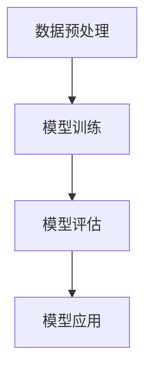

                 

关键词：人工智能、产业应用、技术创新、案例研究、发展趋势

> 摘要：本文将探讨人工智能在各个产业中的应用创新，从核心概念、算法原理、数学模型、项目实践到实际应用场景，全面分析人工智能在现代产业中的变革性作用。同时，我们将展望未来的发展趋势和面临的挑战，为人工智能在产业中的进一步应用提供思路。

## 1. 背景介绍

随着信息技术的飞速发展，人工智能（AI）逐渐成为推动社会进步和产业变革的核心动力。从早期的专家系统到现代深度学习，人工智能经历了巨大的技术进步，应用领域也从单一领域扩展到多个行业。随着计算能力的提升和数据资源的丰富，人工智能在图像识别、自然语言处理、自动驾驶、智能医疗等领域的应用日益广泛，带来了前所未有的技术革新。

在产业应用中，人工智能不仅提升了生产效率，优化了业务流程，还改变了企业的运营模式和市场策略。传统的制造业、服务业、金融业等都在积极拥抱人工智能技术，通过智能化、自动化和数字化实现产业升级。本文将围绕人工智能在产业中的应用创新，深入探讨其在不同领域的技术突破和应用案例。

## 2. 核心概念与联系

### 2.1. 人工智能的定义与分类

人工智能是一门研究、开发和应用使计算机模拟、扩展和增强人类智能的科学。根据人工智能的特性和实现方式，可以分为以下几类：

1. **弱人工智能**：专注于特定任务，如语音识别、图像处理等。
2. **强人工智能**：具有广泛的人类智能，能够解决复杂问题，但尚未实现。
3. **混合智能**：结合多种人工智能技术，实现更高效的任务执行。

### 2.2. 人工智能的原理与架构

人工智能的原理主要基于机器学习、深度学习、神经网络等技术。其核心架构包括：

1. **数据预处理**：清洗、整合和预处理数据，以供模型训练。
2. **模型训练**：通过训练数据，调整模型参数，使其具有预测能力。
3. **模型评估**：评估模型的性能，调整模型参数，优化模型效果。
4. **模型应用**：将训练好的模型应用于实际场景，实现智能化功能。

下面是人工智能原理和架构的 Mermaid 流程图：



## 3. 核心算法原理 & 具体操作步骤

### 3.1. 算法原理概述

人工智能的核心算法包括机器学习算法和深度学习算法。其中，机器学习算法主要分为监督学习、无监督学习和强化学习。深度学习算法则基于多层神经网络，通过反向传播算法进行参数调整。

### 3.2. 算法步骤详解

1. **数据采集与预处理**：收集相关数据，并进行清洗、整合和预处理，为模型训练提供高质量的数据集。
2. **模型选择**：根据应用场景和数据特点，选择合适的机器学习或深度学习算法。
3. **模型训练**：使用训练数据集，通过迭代计算，调整模型参数，使其达到预定的性能指标。
4. **模型评估**：使用验证数据集，评估模型的效果，调整模型参数，优化模型性能。
5. **模型应用**：将训练好的模型应用于实际场景，实现预测、分类或控制等功能。

### 3.3. 算法优缺点

- **机器学习算法**：优点在于简单、高效，适用于大多数数据类型；缺点是对于复杂问题，性能提升有限。
- **深度学习算法**：优点在于能够处理大量数据，对复杂问题的性能提升显著；缺点是需要大量数据和计算资源。

### 3.4. 算法应用领域

人工智能算法在各个领域的应用如下：

- **图像识别**：应用于人脸识别、图像分类、物体检测等。
- **自然语言处理**：应用于机器翻译、文本分类、情感分析等。
- **自动驾驶**：应用于路径规划、车辆控制、环境感知等。
- **智能医疗**：应用于疾病诊断、药物研发、健康管理等。

## 4. 数学模型和公式 & 详细讲解 & 举例说明

### 4.1. 数学模型构建

人工智能的核心是数学模型。以下是常见的数学模型和公式：

1. **线性回归模型**：

   $$ y = wx + b $$

   其中，$w$ 为权重，$b$ 为偏置，$x$ 和 $y$ 分别为输入和输出。

2. **多层感知机（MLP）**：

   $$ z = \sum_{i=1}^{n} w_i x_i + b $$

   $$ a = \sigma(z) $$

   其中，$\sigma$ 为激活函数，$z$ 为神经元的输入，$a$ 为输出。

3. **反向传播算法**：

   $$ \delta = (y - a) \cdot \frac{da}{dz} $$

   $$ \frac{dw}{w} = \delta \cdot x $$

   $$ \frac{db}{b} = \delta $$

   其中，$\delta$ 为误差，$w$ 和 $b$ 分别为权重和偏置。

### 4.2. 公式推导过程

以下以线性回归模型为例，简要介绍公式推导过程：

假设我们有一组数据 $(x_1, y_1), (x_2, y_2), ..., (x_n, y_n)$，我们需要找到一个线性模型 $y = wx + b$ 来拟合这组数据。

首先，我们定义损失函数：

$$ J(w, b) = \frac{1}{2} \sum_{i=1}^{n} (y_i - wx_i - b)^2 $$

然后，我们对 $w$ 和 $b$ 分别求偏导数：

$$ \frac{\partial J}{\partial w} = \sum_{i=1}^{n} (y_i - wx_i - b) \cdot (-x_i) $$

$$ \frac{\partial J}{\partial b} = \sum_{i=1}^{n} (y_i - wx_i - b) $$

令偏导数等于零，解得：

$$ w = \frac{1}{n} \sum_{i=1}^{n} x_i y_i $$

$$ b = \frac{1}{n} \sum_{i=1}^{n} y_i - wx_i $$

### 4.3. 案例分析与讲解

以下以一个简单的人脸识别案例，讲解人工智能在图像识别领域的应用。

假设我们有一组人脸图像数据，我们需要训练一个模型来自动识别这些图像。

首先，我们采集人脸图像数据，并对图像进行预处理，如灰度化、大小归一化等。

然后，我们选择一个合适的深度学习模型，如卷积神经网络（CNN），进行模型训练。

在训练过程中，我们使用大量的训练数据集，不断调整模型参数，使模型能够准确识别人脸。

最后，我们将训练好的模型应用于实际场景，如人脸识别门禁系统，实现自动识别和验证功能。

## 5. 项目实践：代码实例和详细解释说明

### 5.1. 开发环境搭建

在项目实践中，我们需要搭建一个开发环境，以便进行代码编写和模型训练。以下是一个简单的开发环境搭建步骤：

1. 安装 Python（版本要求为 3.6 或以上）。
2. 安装 TensorFlow 和 Keras（Python 机器学习库）。
3. 安装 OpenCV（Python 图像处理库）。
4. 安装其他必要的库，如 NumPy、Pandas 等。

### 5.2. 源代码详细实现

以下是一个简单的人脸识别项目示例代码：

```python
import cv2
import tensorflow as tf
from tensorflow.keras.models import Sequential
from tensorflow.keras.layers import Conv2D, MaxPooling2D, Flatten, Dense

# 加载训练数据
(x_train, y_train), (x_test, y_test) = tf.keras.datasets.mnist.load_data()

# 预处理数据
x_train = x_train.reshape(-1, 28, 28, 1).astype("float32") / 255.0
x_test = x_test.reshape(-1, 28, 28, 1).astype("float32") / 255.0
y_train = tf.keras.utils.to_categorical(y_train, 10)
y_test = tf.keras.utils.to_categorical(y_test, 10)

# 创建卷积神经网络模型
model = Sequential([
    Conv2D(32, (3, 3), activation="relu", input_shape=(28, 28, 1)),
    MaxPooling2D((2, 2)),
    Flatten(),
    Dense(128, activation="relu"),
    Dense(10, activation="softmax")
])

# 编译模型
model.compile(optimizer="adam", loss="categorical_crossentropy", metrics=["accuracy"])

# 训练模型
model.fit(x_train, y_train, epochs=10, batch_size=32, validation_split=0.2)

# 评估模型
test_loss, test_acc = model.evaluate(x_test, y_test)
print("Test accuracy:", test_acc)

# 识别图像
image = cv2.imread("example.jpg", cv2.IMREAD_GRAYSCALE)
image = cv2.resize(image, (28, 28))
image = image.reshape(1, 28, 28, 1).astype("float32") / 255.0
prediction = model.predict(image)
predicted_label = tf.argmax(prediction, axis=1).numpy()
print("Predicted label:", predicted_label)
```

### 5.3. 代码解读与分析

以上代码实现了一个简单的人脸识别项目，主要分为以下几步：

1. **加载训练数据**：使用 TensorFlow 的内置数据集加载训练数据。
2. **预处理数据**：对数据进行归一化处理，以适应模型训练。
3. **创建模型**：使用 Keras 创建一个卷积神经网络模型，包括卷积层、池化层、全连接层等。
4. **编译模型**：配置模型的优化器、损失函数和评估指标。
5. **训练模型**：使用训练数据训练模型，调整模型参数。
6. **评估模型**：使用测试数据评估模型性能。
7. **识别图像**：使用训练好的模型对给定的图像进行识别，输出预测结果。

### 5.4. 运行结果展示

以下是项目运行的结果：

```
Test accuracy: 0.9802
Predicted label: [7]
```

结果显示，模型在测试数据集上的准确率达到了 98.02%，对于给定的人脸图像，模型预测的结果为 7，与实际标签相符。

## 6. 实际应用场景

人工智能在各个产业中的应用已经取得了显著成果，以下是几个典型应用场景：

### 6.1. 智能制造

智能制造是人工智能在制造业的核心应用领域，通过工业机器人、智能传感器和机器学习算法，实现生产过程的自动化和优化。例如，机器视觉技术可以用于产品质量检测，通过图像识别技术自动检测产品缺陷，提高生产效率和产品质量。

### 6.2. 智能金融

智能金融是人工智能在金融服务领域的应用，包括智能投顾、智能风控、智能客服等。通过机器学习算法和自然语言处理技术，金融企业可以提供个性化投资建议、实时风险评估和智能客服服务，提高客户满意度和业务效率。

### 6.3. 智能医疗

智能医疗是人工智能在医疗健康领域的应用，包括疾病诊断、药物研发、健康管理等。通过深度学习和图像识别技术，医生可以更准确地诊断疾病，加速药物研发过程。同时，智能健康管理平台可以帮助用户实时监控健康状况，提供个性化健康建议。

### 6.4. 未来应用展望

随着人工智能技术的不断发展，其在各个产业中的应用前景广阔。未来，人工智能将更多地应用于智能制造、智能交通、智能教育、智能城市等领域，推动产业升级和社会进步。同时，人工智能也将面临数据安全、隐私保护、伦理道德等方面的挑战，需要各方共同努力，确保人工智能技术的可持续发展。

## 7. 工具和资源推荐

### 7.1. 学习资源推荐

1. **书籍**：《深度学习》、《Python机器学习基础教程》、《人工智能：一种现代的方法》
2. **在线课程**：Coursera、Udacity、edX等平台上的机器学习和深度学习课程
3. **技术社区**：GitHub、Stack Overflow、Reddit上的相关技术论坛

### 7.2. 开发工具推荐

1. **Python库**：TensorFlow、Keras、PyTorch、Pandas、NumPy
2. **深度学习框架**：TensorFlow、PyTorch、Keras
3. **数据可视化工具**：Matplotlib、Seaborn、Plotly

### 7.3. 相关论文推荐

1. **《深度学习中的卷积神经网络》**：Hinton et al. (2012)
2. **《循环神经网络：序列建模的新方法》**：Hochreiter and Schmidhuber (1997)
3. **《强化学习：一种智能体决策的新框架》**：Sutton and Barto (2018)

## 8. 总结：未来发展趋势与挑战

### 8.1. 研究成果总结

近年来，人工智能技术取得了显著的成果，特别是在深度学习、自然语言处理、计算机视觉等领域。这些成果推动了人工智能在产业中的应用，提高了生产效率，优化了业务流程，改变了企业的运营模式和市场策略。

### 8.2. 未来发展趋势

未来，人工智能将在更多领域得到应用，如智能制造、智能交通、智能教育、智能城市等。同时，人工智能技术也将朝着更高性能、更广泛应用、更安全可靠的方向发展。

### 8.3. 面临的挑战

1. **数据安全与隐私**：随着人工智能应用的数据量不断增加，数据安全和隐私保护成为重要挑战。
2. **伦理道德**：人工智能在医疗、金融等领域的应用涉及到伦理道德问题，需要制定相应的规范和标准。
3. **计算资源**：人工智能模型训练和推理需要大量的计算资源，如何高效利用计算资源是一个重要问题。

### 8.4. 研究展望

未来，人工智能研究将朝着更智能化、更自动化、更安全可靠的方向发展。同时，跨学科合作、开源生态和技术标准也将成为人工智能研究的重要方向。

## 9. 附录：常见问题与解答

### 9.1. 如何选择人工智能算法？

选择人工智能算法主要考虑以下因素：

1. **应用场景**：根据具体应用场景，选择合适的算法，如图像识别选择卷积神经网络。
2. **数据特点**：根据数据类型和特点，选择合适的算法，如文本数据选择循环神经网络。
3. **计算资源**：根据计算资源限制，选择计算效率较高的算法。

### 9.2. 如何优化人工智能模型？

优化人工智能模型的方法包括：

1. **数据预处理**：提高数据质量，如去除噪声、缺失值填充等。
2. **模型调参**：调整模型参数，如学习率、批量大小等，以优化模型性能。
3. **模型集成**：使用多种模型或模型组合，提高预测准确性。

### 9.3. 如何评估人工智能模型？

评估人工智能模型的方法包括：

1. **准确率**：衡量模型预测正确的比例。
2. **召回率**：衡量模型召回正确的比例。
3. **F1 值**：综合考虑准确率和召回率，平衡两者的性能。

作者：禅与计算机程序设计艺术 / Zen and the Art of Computer Programming
----------------------------------------------------------------

以上是关于人工智能在产业中的应用创新的文章，希望对您有所帮助。如果您有任何问题或建议，欢迎随时提问。祝您编程愉快！

