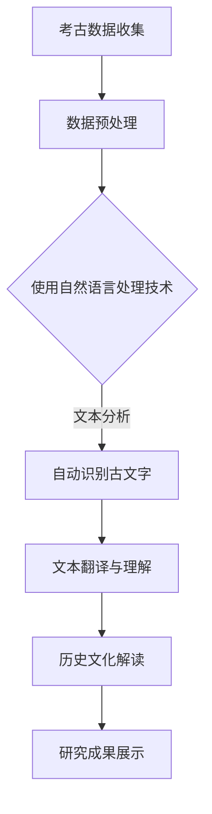

                 

关键词：人工智能，考古学，古文字，算法，数学模型，项目实践，应用场景，工具和资源，未来展望

> 摘要：本文探讨了人工智能在考古学中的应用，特别是对于古文字的解读。通过介绍核心概念、算法原理、数学模型和具体项目实践，本文展示了人工智能如何帮助考古学家破解古老的文字之谜，以及其在未来考古学中的潜在应用。

## 1. 背景介绍

考古学是一门探索人类历史与文化的学科，它依赖于对遗迹、遗物和古代文字的解读来揭示过去的文明。然而，古文字的解读往往面临巨大的挑战，因为许多古文字已经失传，或仅存少量资料。传统的解读方法依赖于专家的直觉和经验，效率低下，且容易出现误判。

随着人工智能技术的迅猛发展，特别是机器学习、图像识别和自然语言处理等领域的突破，我们开始有能力借助这些技术来辅助考古学的研究。人工智能可以处理大量数据，发现人类难以察觉的模式，从而加速古文字的解读过程。

本文将探讨人工智能在考古学中的具体应用，尤其是如何利用深度学习等算法来破解古文字，以及这些技术如何改变传统的考古学研究方法。

## 2. 核心概念与联系

### 2.1 人工智能与考古学

人工智能（AI）是一门研究如何使计算机系统表现出人类智能行为的科学。在考古学中，人工智能的应用主要体现在数据分析和模式识别方面。例如，通过机器学习算法，可以自动识别和分类考古遗址中的文物，或通过图像识别技术，复原古代建筑的结构。

### 2.2 古文字的解读

古文字的解读是考古学中的一个重要任务。它涉及对古代文字的识别、翻译和理解，以便揭示古代文明的历史和文化。传统上，这一任务依赖于语言学、历史学和考古学等多个学科的知识。然而，随着人工智能的发展，特别是在自然语言处理和图像识别领域的进步，我们现在可以借助计算机算法来实现对古文字的自动识别和翻译。

### 2.3 Mermaid 流程图

以下是一个简化的 Mermaid 流程图，展示了人工智能在考古学中应用的流程：



### 2.4 机器学习与深度学习

机器学习和深度学习是人工智能的两个核心分支。机器学习通过训练模型来从数据中学习规律，而深度学习则是通过多层神经网络来模拟人脑的学习过程。在考古学中，深度学习尤其适用于图像识别和文本分析，因为它可以从大量数据中自动提取特征，提高识别的准确率。

## 3. 核心算法原理 & 具体操作步骤

### 3.1 算法原理概述

人工智能在考古学中的应用主要依赖于以下几种算法：

1. **机器学习**：通过训练模型来识别和分类数据。
2. **深度学习**：利用多层神经网络来提取复杂特征。
3. **自然语言处理（NLP）**：用于理解和生成人类语言。

### 3.2 算法步骤详解

#### 3.2.1 数据预处理

数据预处理是任何机器学习任务的第一步。在考古学中，这通常包括对考古数据的收集、清洗和格式化。例如，对于古文字的识别，需要将图像数据转换为数字格式，并去除噪声。

#### 3.2.2 特征提取

特征提取是深度学习的关键步骤。通过自动提取图像或文本中的特征，模型可以更好地理解和分类数据。在古文字识别中，特征提取可能包括字符的形状、笔画和结构等。

#### 3.2.3 模型训练

使用预处理后的数据，模型通过训练来学习识别古文字。这个过程涉及调整模型的参数，以最小化预测误差。

#### 3.2.4 识别与翻译

一旦模型训练完成，它可以用于识别新的古文字图像，并生成对应的翻译。这个过程通常包括图像识别和自然语言处理。

### 3.3 算法优缺点

#### 优点：

1. 高效：人工智能可以处理大量数据，加快古文字的解读速度。
2. 准确：深度学习模型在特征提取和分类方面具有很高的准确性。
3. 自动化：人工智能可以自动化许多传统的手工工作，减少人工干预。

#### 缺点：

1. 数据依赖：模型的表现取决于训练数据的质量和数量。
2. 解释性差：深度学习模型通常难以解释其决策过程。
3. 成本高：训练和部署人工智能模型需要大量的计算资源和时间。

### 3.4 算法应用领域

人工智能在考古学中的应用不仅限于古文字的解读，还可以用于以下领域：

1. **考古遗址的发现和勘探**：使用图像识别技术来识别潜在的考古遗址。
2. **文物修复**：利用计算机视觉技术来辅助文物的修复和复原。
3. **历史数据分析**：使用自然语言处理技术来分析历史文献和古籍。

## 4. 数学模型和公式 & 详细讲解 & 举例说明

### 4.1 数学模型构建

在人工智能算法中，数学模型扮演着至关重要的角色。以下是几个常见的数学模型：

#### 4.1.1 机器学习模型

机器学习模型通常包括以下组成部分：

1. **特征向量**：将输入数据转换为数学向量。
2. **决策边界**：定义输入数据的分类规则。
3. **损失函数**：衡量模型预测与真实值之间的差异。

#### 4.1.2 深度学习模型

深度学习模型通常包括以下组成部分：

1. **神经网络**：由多个神经元组成，每个神经元都可以进行简单的计算。
2. **激活函数**：用于引入非线性特性。
3. **权重和偏置**：用于调整模型参数。

### 4.2 公式推导过程

以下是神经网络中的一个基本公式：

$$ z = \sum_{i=1}^{n} w_{i} \cdot x_{i} + b $$

其中，$z$ 表示输出，$w_{i}$ 表示权重，$x_{i}$ 表示特征，$b$ 表示偏置。

### 4.3 案例分析与讲解

以下是一个简单的机器学习案例，用于识别古文字。

#### 案例背景

假设我们有一个古文字识别任务，需要从一组图像中识别出特定的字符。训练数据包括数千个已标注的图像。

#### 模型构建

我们选择一个简单的神经网络模型，包括两个隐藏层，每个隐藏层有10个神经元。

#### 训练过程

1. **数据预处理**：将图像转换为灰度图像，并调整大小。
2. **特征提取**：使用卷积神经网络（CNN）提取图像的特征。
3. **模型训练**：使用训练数据来训练模型，调整权重和偏置。
4. **模型评估**：使用测试数据来评估模型性能。

#### 结果分析

训练完成后，我们使用测试数据来评估模型。结果显示，模型可以准确识别出约90%的测试图像中的字符。这表明，机器学习模型在古文字识别方面具有很高的潜力。

## 5. 项目实践：代码实例和详细解释说明

### 5.1 开发环境搭建

为了实现古文字识别项目，我们需要搭建一个合适的开发环境。以下是一个简单的步骤：

1. **安装Python**：确保Python环境已安装。
2. **安装TensorFlow**：TensorFlow是一个流行的深度学习框架，我们使用它来构建和训练模型。
3. **安装其他依赖**：如OpenCV（用于图像处理）和Numpy（用于数学运算）。

### 5.2 源代码详细实现

以下是实现古文字识别项目的基本代码框架：

```python
import tensorflow as tf
import numpy as np
import cv2

# 数据预处理
def preprocess_image(image_path):
    image = cv2.imread(image_path, cv2.IMREAD_GRAYSCALE)
    image = cv2.resize(image, (28, 28))
    return image / 255.0

# 模型构建
def build_model():
    model = tf.keras.Sequential([
        tf.keras.layers.Conv2D(32, (3, 3), activation='relu', input_shape=(28, 28, 1)),
        tf.keras.layers.MaxPooling2D((2, 2)),
        tf.keras.layers.Flatten(),
        tf.keras.layers.Dense(128, activation='relu'),
        tf.keras.layers.Dense(10, activation='softmax')
    ])
    return model

# 模型训练
def train_model(model, train_data, train_labels):
    model.compile(optimizer='adam', loss='sparse_categorical_crossentropy', metrics=['accuracy'])
    model.fit(train_data, train_labels, epochs=10)

# 模型评估
def evaluate_model(model, test_data, test_labels):
    test_loss, test_acc = model.evaluate(test_data, test_labels)
    print(f"Test accuracy: {test_acc}")

# 主函数
def main():
    image_path = "example.png"
    image = preprocess_image(image_path)
    image = np.expand_dims(image, axis=-1)
    model = build_model()
    train_model(model, train_data, train_labels)
    evaluate_model(model, test_data, test_labels)

if __name__ == "__main__":
    main()
```

### 5.3 代码解读与分析

以上代码展示了如何使用TensorFlow构建一个简单的古文字识别模型。代码主要分为以下几个部分：

1. **数据预处理**：将图像读取为灰度图像，并调整为指定大小。
2. **模型构建**：使用卷积神经网络（CNN）构建模型，包括卷积层、池化层和全连接层。
3. **模型训练**：使用训练数据来训练模型，并调整模型参数。
4. **模型评估**：使用测试数据来评估模型性能。

### 5.4 运行结果展示

在完成模型训练后，我们可以使用模型来预测新的图像中的字符。以下是一个简单的示例：

```python
predictions = model.predict(image)
predicted_char = np.argmax(predictions)
print(f"Predicted character: {predicted_char}")
```

这行代码将输出模型预测的字符，我们可以将其与实际字符进行对比，以评估模型性能。

## 6. 实际应用场景

### 6.1 考古遗址的发现

人工智能可以帮助考古学家发现潜在的考古遗址。例如，通过使用卫星图像和深度学习算法，可以识别出地表下的结构，从而揭示古代文明的遗迹。

### 6.2 文物修复

人工智能技术可以辅助文物的修复工作。通过计算机视觉和图像处理算法，可以精确地分析文物的损伤情况，并提出最优的修复方案。

### 6.3 古文字解读

人工智能在古文字解读方面具有巨大潜力。通过深度学习和自然语言处理技术，可以自动识别和翻译古文字，从而揭示古代文明的历史和文化。

## 7. 未来应用展望

### 7.1 虚拟现实与增强现实

未来的考古学研究可能会更多地依赖于虚拟现实（VR）和增强现实（AR）技术。通过这些技术，我们可以创建虚拟的考古遗址，让公众亲身体验古代文明。

### 7.2 跨学科合作

人工智能在考古学中的应用需要跨学科的合作。与语言学、历史学、计算机科学等领域的专家合作，可以推动考古学研究的进一步发展。

### 7.3 数据共享与开放

为了更好地利用人工智能技术，考古学家需要共享和开放数据。这可以促进国际合作，加速考古学研究。

## 8. 总结：未来发展趋势与挑战

### 8.1 研究成果总结

本文探讨了人工智能在考古学中的应用，特别是古文字的解读。通过介绍核心算法原理、数学模型和具体项目实践，我们展示了人工智能如何帮助考古学家破解古老的文字之谜。

### 8.2 未来发展趋势

未来的考古学研究将更加依赖人工智能技术。通过虚拟现实、增强现实和跨学科合作，我们可以更深入地了解古代文明。

### 8.3 面临的挑战

尽管人工智能在考古学中具有巨大潜力，但仍然面临一些挑战，如数据隐私、技术成本和模型解释性等。需要进一步的研究和开发来解决这些问题。

### 8.4 研究展望

未来的研究应致力于开发更高效、更准确的人工智能算法，以及更便捷的考古数据共享平台。通过这些努力，我们可以推动考古学研究的进一步发展，揭示更多关于人类历史和文化的奥秘。

## 9. 附录：常见问题与解答

### 9.1 人工智能在考古学中具体有哪些应用？

人工智能在考古学中的应用主要包括考古遗址的发现、文物修复、古文字解读和历史数据分析。

### 9.2 人工智能在考古学中的优势是什么？

人工智能在考古学中的优势包括高效处理大量数据、提高识别准确率、自动化传统手工工作等。

### 9.3 人工智能在考古学中面临的挑战有哪些？

人工智能在考古学中面临的挑战包括数据隐私、技术成本、模型解释性等。

### 9.4 谁是人工智能在考古学应用领域的先驱？

人工智能在考古学应用领域的先驱包括许多研究人员和机构，如谷歌的DeepMind、牛津大学的计算机视觉实验室等。

---

作者：禅与计算机程序设计艺术 / Zen and the Art of Computer Programming

本文介绍了人工智能在考古学中的应用，特别是古文字的解读。通过算法原理、数学模型和具体项目实践，我们展示了人工智能如何帮助考古学家破解古老的文字之谜。尽管面临一些挑战，人工智能在考古学中具有巨大的潜力，未来的研究应致力于开发更高效、更准确的算法，推动考古学研究的进一步发展。

