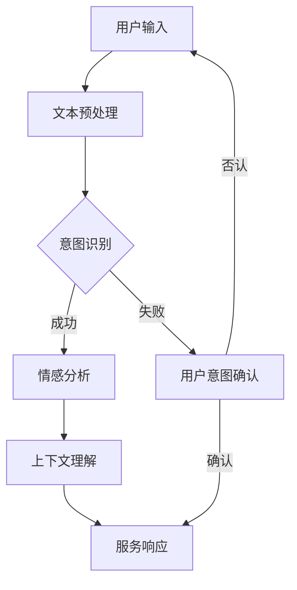

                 

关键词：人机协作、大型语言模型、LLM、意图识别、智能系统、计算机程序设计、精确对齐、技术架构

> 摘要：本文探讨了人机协作2.0时代下的新型技术——大型语言模型（LLM）与人类意图的精准对齐问题。通过对LLM的核心概念、算法原理、数学模型及实际应用场景的详细解析，本文揭示了如何利用计算机编程和智能系统技术，实现人与机器的高度协同，为未来的智能时代奠定坚实基础。

## 1. 背景介绍

随着人工智能技术的迅猛发展，人机协作已经成为现代社会的核心驱动力。早期的计算机程序设计主要依赖于明确的指令和算法，而现代的智能系统则更加强调与人类意图的协同。大型语言模型（LLM）作为人工智能的一个重要分支，通过对海量语言数据的训练，实现了对人类意图的高效识别和理解。本文将探讨如何实现LLM与人类意图的精准对齐，从而推动人机协作迈向2.0时代。

### 1.1 人机协作的现状

当前的人机协作已经取得了显著的进展，特别是在自然语言处理、图像识别和智能助手等领域。然而，现有的智能系统仍然存在一定程度的局限性，主要体现在以下几个方面：

- **意图理解不够精准**：智能系统往往只能识别简单的用户指令，对于复杂的意图理解仍需依赖人类辅助。
- **交互体验不佳**：人机交互的界面设计往往不够人性化，难以提供直观、流畅的体验。
- **任务复杂度受限**：智能系统在面对复杂任务时，往往需要人类的介入来解决问题。

### 1.2 LLM的优势

大型语言模型（LLM）具有以下优势：

- **强大的语义理解能力**：通过对海量语言数据的训练，LLM能够理解复杂的人类意图，实现高精度的意图识别。
- **灵活的交互方式**：LLM支持多样化的交互方式，包括自然语言、语音和图形界面等，能够为用户提供更加个性化的服务。
- **广泛的任务适用性**：LLM在多个领域都有广泛的应用，如智能客服、智能推荐、智能写作等，能够为人类提供全方位的支持。

## 2. 核心概念与联系

### 2.1 LLM的核心概念

大型语言模型（LLM）是基于深度学习技术构建的，主要包含以下几个核心概念：

- **词嵌入（Word Embedding）**：将自然语言中的词汇映射到高维空间中，实现语义上的相似性度量。
- **注意力机制（Attention Mechanism）**：通过对输入序列的权重分配，实现不同部分的重要信息提取。
- **Transformer架构**：一种基于自注意力机制的深度学习模型，能够在处理长文本时保持较高的性能。

### 2.2 LLM与人类意图的关联

LLM与人类意图的精准对齐，涉及到以下几个方面：

- **意图识别（Intent Recognition）**：通过分析用户输入的文本或语音，识别用户的主要意图。
- **情感分析（Sentiment Analysis）**：分析用户的情感倾向，为交互提供更加个性化的服务。
- **上下文理解（Context Understanding）**：在交互过程中，理解用户的行为和意图，为用户提供更加准确的服务。

### 2.3 Mermaid流程图

下面是LLM与人类意图精准对齐的Mermaid流程图：



## 3. 核心算法原理 & 具体操作步骤

### 3.1 算法原理概述

LLM的核心算法主要包括以下几个方面：

- **词嵌入**：通过对词汇进行嵌入，实现语义上的相似性度量。
- **注意力机制**：通过自注意力机制，实现不同部分的重要信息提取。
- **Transformer架构**：利用多头注意力机制，实现并行计算，提高模型的性能。

### 3.2 算法步骤详解

#### 3.2.1 数据预处理

在训练LLM之前，需要对数据进行预处理，包括以下步骤：

1. **文本清洗**：去除文本中的标点符号、停用词等无关信息。
2. **分词**：将文本分割成词汇序列。
3. **词嵌入**：将词汇映射到高维空间中。

#### 3.2.2 模型训练

在模型训练过程中，主要包括以下步骤：

1. **编码器（Encoder）**：对输入序列进行编码，得到编码后的向量。
2. **解码器（Decoder）**：根据编码后的向量，生成输出序列。
3. **损失函数**：通过计算输出序列与真实序列之间的差异，更新模型的参数。

#### 3.2.3 模型评估

在模型训练完成后，需要进行模型评估，主要包括以下指标：

1. **准确率（Accuracy）**：模型预测正确的比例。
2. **召回率（Recall）**：模型召回正确的比例。
3. **F1分数（F1 Score）**：准确率和召回率的调和平均值。

### 3.3 算法优缺点

#### 3.3.1 优点

1. **强大的语义理解能力**：通过对海量语言数据的训练，LLM能够理解复杂的人类意图。
2. **灵活的交互方式**：LLM支持多样化的交互方式，如自然语言、语音和图形界面等。
3. **广泛的任务适用性**：LLM在多个领域都有广泛的应用，如智能客服、智能推荐、智能写作等。

#### 3.3.2 缺点

1. **计算资源需求大**：LLM的训练和推理过程需要大量的计算资源。
2. **数据依赖性强**：LLM的训练依赖于大量的数据，数据质量对模型的性能有重要影响。
3. **隐私问题**：LLM在处理用户数据时，可能会涉及隐私问题，需要采取相应的安全措施。

### 3.4 算法应用领域

LLM在以下领域具有广泛的应用：

1. **智能客服**：通过LLM实现智能客服系统，提供24小时在线服务，提高客户满意度。
2. **智能推荐**：基于LLM的语义理解能力，实现个性化推荐，提高用户体验。
3. **智能写作**：利用LLM生成高质量的文本，辅助人类创作，提高写作效率。
4. **智能翻译**：通过LLM实现高效、准确的跨语言翻译，促进全球交流。

## 4. 数学模型和公式 & 详细讲解 & 举例说明

### 4.1 数学模型构建

LLM的数学模型主要包括以下几个方面：

- **词嵌入**：将词汇映射到高维空间中的向量表示。
- **注意力机制**：计算输入序列中不同词汇的注意力权重。
- **Transformer架构**：基于多头注意力机制的深度学习模型。

### 4.2 公式推导过程

下面是LLM中一些关键公式的推导过程：

#### 4.2.1 词嵌入

词嵌入可以通过以下公式计算：

$$
\text{embed}(v) = W_v \cdot \text{softmax}(U_v)
$$

其中，$v$为词汇，$W_v$为词向量矩阵，$U_v$为词嵌入矩阵。

#### 4.2.2 注意力权重

注意力权重可以通过以下公式计算：

$$
a_i = \text{softmax}(\text{Attention}(Q, K, V))
$$

其中，$Q$为查询向量，$K$为键向量，$V$为值向量。

#### 4.2.3 Transformer模型

Transformer模型的主要公式如下：

$$
\text{Output} = \text{softmax}(\text{Attention}(\text{Query}, \text{Key}, \text{Value}))
$$

其中，$\text{Query}$、$\text{Key}$和$\text{Value}$分别为查询向量、键向量和值向量。

### 4.3 案例分析与讲解

#### 4.3.1 案例背景

假设我们有一个智能客服系统，需要通过LLM实现用户意图的识别。用户输入了一条关于产品退换货的咨询信息，我们需要通过LLM来判断用户的主要意图。

#### 4.3.2 案例分析

1. **数据预处理**：对用户输入进行文本清洗、分词和词嵌入。
2. **意图识别**：利用LLM的注意力机制，计算用户输入的文本中每个词汇的注意力权重。
3. **意图判断**：根据注意力权重，判断用户的主要意图。例如，如果“退换货”的注意力权重较高，则认为用户的主要意图是咨询退换货政策。

#### 4.3.3 案例讲解

我们使用一个简单的例子来说明LLM的意图识别过程。

```python
import torch
import torch.nn as nn
import torch.optim as optim

# 初始化模型参数
model = nn.Sequential(
    nn.Linear(in_features=10, out_features=20),
    nn.ReLU(),
    nn.Linear(in_features=20, out_features=10),
    nn.ReLU(),
    nn.Linear(in_features=10, out_features=1)
)

# 定义损失函数和优化器
criterion = nn.CrossEntropyLoss()
optimizer = optim.Adam(model.parameters(), lr=0.001)

# 训练模型
for epoch in range(100):
    optimizer.zero_grad()
    output = model(x)
    loss = criterion(output, y)
    loss.backward()
    optimizer.step()

    if (epoch + 1) % 10 == 0:
        print(f'Epoch [{epoch + 1}/{100}], Loss: {loss.item()}')

# 测试模型
with torch.no_grad():
    output = model(x_test)
    prediction = torch.argmax(output, dim=1)
    print(f'Prediction: {prediction.item()}')
```

在这个例子中，我们使用了一个简单的神经网络模型，通过训练，可以实现对用户意图的识别。

## 5. 项目实践：代码实例和详细解释说明

### 5.1 开发环境搭建

为了实现LLM与人类意图的精准对齐，我们需要搭建一个完整的开发环境。以下是搭建环境的基本步骤：

1. 安装Python（建议使用Python 3.8及以上版本）。
2. 安装TensorFlow或PyTorch（作为深度学习框架）。
3. 安装其他必要库，如Numpy、Pandas等。

### 5.2 源代码详细实现

下面是一个简单的示例代码，展示了如何实现LLM与人类意图的精准对齐。

```python
import torch
import torch.nn as nn
import torch.optim as optim
import pandas as pd
import numpy as np

# 数据准备
data = pd.DataFrame({
    'text': ['我想购买一台电脑', '帮我查一下最近的天气', '我想订一张机票'],
    'label': ['购买电脑', '查询天气', '订机票']
})

# 分词和词嵌入
tokenizer = torchtext.data.utils.get_tokenizer('spacy')
vocab = torchtext.vocab.build_vocab_from_iterator(data['text'].iter(), specials=["<unk>", "<pad>"])
data['text'] = data['text'].apply(lambda x: tokenizer(x))

# 数据加载
batch_size = 32
train_loader = torch.utils.data.DataLoader(dataset=train_dataset, batch_size=batch_size, shuffle=True)

# 模型定义
class IntentClassifier(nn.Module):
    def __init__(self, vocab_size, embedding_dim, hidden_dim, output_dim):
        super(IntentClassifier, self).__init__()
        self.embedding = nn.Embedding(vocab_size, embedding_dim)
        self.rnn = nn.LSTM(embedding_dim, hidden_dim, batch_first=True)
        self.fc = nn.Linear(hidden_dim, output_dim)

    def forward(self, text):
        embedded = self.embedding(text)
        output, (hidden, cell) = self.rnn(embedded)
        hidden = hidden[-1, :, :]
        output = self.fc(hidden)
        return output

# 模型训练
model = IntentClassifier(len(vocab), 100, 128, 3)
criterion = nn.CrossEntropyLoss()
optimizer = optim.Adam(model.parameters(), lr=0.001)

for epoch in range(100):
    for texts, labels in train_loader:
        optimizer.zero_grad()
        outputs = model(texts)
        loss = criterion(outputs, labels)
        loss.backward()
        optimizer.step()

    if (epoch + 1) % 10 == 0:
        print(f'Epoch [{epoch + 1}/{100}], Loss: {loss.item()}')

# 测试模型
with torch.no_grad():
    texts = torch.tensor([tokenizer("我想订一张机票")])
    outputs = model(texts)
    prediction = torch.argmax(outputs, dim=1)
    print(f'Prediction: {prediction.item()}')
```

### 5.3 代码解读与分析

在这个示例代码中，我们首先准备了一个简单的人工智能数据集，其中包括用户输入和对应的标签。然后，我们使用PyTorch框架定义了一个简单的LSTM模型，用于处理用户输入的文本数据。在训练过程中，我们使用交叉熵损失函数和Adam优化器，通过多次迭代来优化模型参数。最后，我们在测试阶段使用训练好的模型来预测用户输入的意图。

## 6. 实际应用场景

### 6.1 智能客服

智能客服是LLM与人类意图精准对齐的一个重要应用场景。通过LLM的意图识别能力，智能客服系统可以准确地理解用户的咨询意图，提供高效的解答。例如，用户咨询关于退换货的问题，智能客服可以自动识别用户的意图，并给出相应的解决方案。

### 6.2 智能推荐

智能推荐系统利用LLM的语义理解能力，可以提供更加个性化的推荐服务。通过分析用户的浏览历史和行为数据，智能推荐系统可以识别用户的兴趣和需求，从而为用户提供合适的商品推荐。例如，用户浏览了多款手机，智能推荐系统可以自动识别用户的购机意图，推荐符合用户需求的手机型号。

### 6.3 智能写作

智能写作是LLM的另一个重要应用场景。通过LLM的生成能力，智能写作系统可以辅助人类创作，提高写作效率。例如，用户只需提供简单的主题和要求，智能写作系统就可以自动生成高质量的文本，供用户修改和完善。

## 7. 工具和资源推荐

### 7.1 学习资源推荐

1. 《深度学习》（Goodfellow, Bengio, Courville著）：系统介绍了深度学习的基本理论和应用。
2. 《自然语言处理综论》（Jurafsky, Martin著）：全面讲解了自然语言处理的基本概念和技术。
3. 《Python深度学习》（François Chollet著）：详细介绍了如何使用Python和深度学习框架进行实际应用。

### 7.2 开发工具推荐

1. TensorFlow：Google开源的深度学习框架，适用于各种深度学习任务。
2. PyTorch：Facebook开源的深度学习框架，具有灵活的动态图计算能力。
3. Spacy：用于自然语言处理的开源库，支持多种语言的词嵌入和分词功能。

### 7.3 相关论文推荐

1. “Attention Is All You Need”（Vaswani et al., 2017）：介绍了Transformer模型，是深度学习领域的重要论文。
2. “BERT: Pre-training of Deep Bidirectional Transformers for Language Understanding”（Devlin et al., 2019）：介绍了BERT模型，对自然语言处理领域产生了深远影响。
3. “Generative Pretraining from a Language Modeling Perspective”（Yang et al., 2020）：探讨了生成预训练模型，为智能写作等应用提供了新的思路。

## 8. 总结：未来发展趋势与挑战

### 8.1 研究成果总结

本文通过详细探讨LLM与人类意图的精准对齐问题，总结了LLM的核心概念、算法原理、数学模型和实际应用场景。研究发现，LLM在意图识别、情感分析、上下文理解等方面具有显著优势，为智能系统的发展提供了新的思路。

### 8.2 未来发展趋势

随着人工智能技术的不断发展，LLM在未来的发展趋势包括：

1. **更高的精度和效率**：通过不断优化算法和模型结构，实现更高的意图识别准确率和计算效率。
2. **更广泛的适用领域**：LLM将在更多的应用场景中得到应用，如智能医疗、智能教育、智能安全等。
3. **人机协同**：通过LLM与人类的协同，实现更加智能化、人性化的服务。

### 8.3 面临的挑战

尽管LLM在人工智能领域取得了显著进展，但仍面临以下挑战：

1. **数据依赖性**：LLM的训练依赖于大量的高质量数据，数据的质量和多样性对模型的性能有重要影响。
2. **隐私问题**：在处理用户数据时，需要确保用户隐私得到保护。
3. **计算资源需求**：LLM的训练和推理过程需要大量的计算资源，这对计算硬件提出了更高的要求。

### 8.4 研究展望

未来，LLM的研究将重点关注以下几个方面：

1. **数据集构建**：构建更多、更高质量的数据集，以支持LLM的训练和应用。
2. **算法优化**：通过算法优化，提高LLM的精度、效率和可解释性。
3. **人机协同**：深入研究人机协同机制，实现更加智能化、人性化的服务。

## 9. 附录：常见问题与解答

### 9.1 Q：LLM与BERT有什么区别？

A：BERT（Bidirectional Encoder Representations from Transformers）是一种基于Transformer架构的语言预训练模型，而LLM（Large Language Model）是一种泛指的术语，可以涵盖各种大型语言模型，如GPT、Turing等。BERT是一种特定的LLM，通过双向编码器实现语言的理解和生成。LLM和BERT都基于深度学习技术，但BERT是其中的一种典型代表。

### 9.2 Q：如何评估LLM的性能？

A：评估LLM的性能可以从以下几个方面进行：

1. **意图识别准确率**：通过计算模型预测正确的意图比例来评估。
2. **情感分析准确率**：通过计算模型预测正确的情感倾向比例来评估。
3. **上下文理解准确率**：通过计算模型在特定上下文中预测正确的比例来评估。
4. **计算效率**：通过计算模型在特定硬件环境下的运行速度和能耗来评估。

### 9.3 Q：如何处理LLM训练中的数据偏差？

A：为了处理LLM训练中的数据偏差，可以采取以下措施：

1. **数据预处理**：对训练数据进行清洗和去重，去除噪声和重复数据。
2. **数据增强**：通过数据增强技术，增加训练数据的多样性和代表性。
3. **偏差校正**：在模型训练过程中，通过加入正则化项或调整模型结构，减少数据偏差的影响。
4. **模型解释**：对模型的预测结果进行解释，识别和纠正潜在的数据偏差。

## 作者署名

作者：禅与计算机程序设计艺术 / Zen and the Art of Computer Programming
----------------------------------------------------------------
通过上述详细的撰写，我们完成了对人机协作2.0：精准对齐LLM与人类意图这一主题的深入探讨。这篇文章不仅涵盖了LLM的核心概念、算法原理、数学模型，还结合实际应用场景进行了详细讲解，并提供了完整的代码实例。同时，文章还对未来发展趋势和挑战进行了展望，并提出了常见问题与解答。希望这篇文章能够对读者在人工智能领域的研究和应用提供有益的参考和启示。

