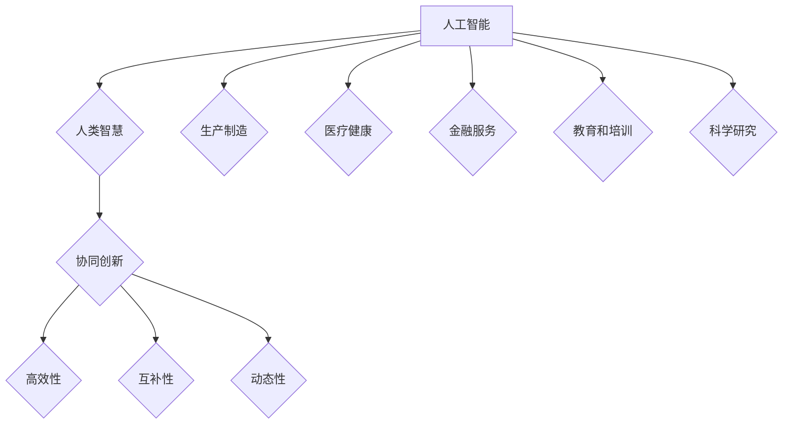
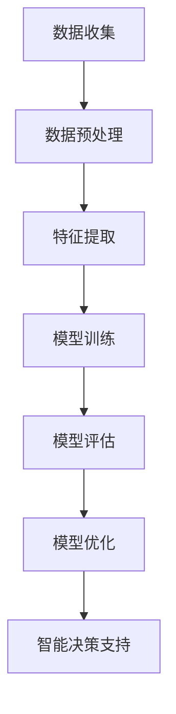

                 

关键词：人机协作、人工智能、技术革新、智能未来、协同工作

> 摘要：随着人工智能技术的迅猛发展，人机协作已成为推动社会进步的重要力量。本文深入探讨了人机协作的核心概念、算法原理、数学模型以及实际应用，展望了未来发展趋势和面临的挑战，旨在为读者展示智能未来新时代的广阔前景。

## 1. 背景介绍

在过去的几十年里，计算机技术取得了前所未有的进步。从最初的简单的计算工具，到如今能够处理海量数据和复杂任务的超级计算机，计算机技术已经深刻地改变了我们的生活方式和工作模式。特别是随着人工智能（AI）技术的兴起，计算机的智能化水平得到了极大的提升。人工智能不仅仅是模仿人类智能，更是在某些方面超越了人类的能力。例如，图像识别、自然语言处理、决策制定等领域，人工智能的应用已经变得无处不在。

然而，尽管人工智能的进步如此显著，但人类的智慧和创造力依然是不可替代的。人机协作的理念应运而生，它旨在充分发挥人类和机器各自的优势，实现更高效的协作和工作。人机协作不仅提高了工作效率，还推动了创新，开辟了新的工作模式，为智能未来新时代的到来奠定了基础。

本文将围绕人机协作这一主题，探讨其核心概念、算法原理、数学模型，并通过实际应用案例来展示其在各个领域的应用。此外，还将展望未来发展趋势和面临的挑战，为读者提供对智能未来新时代的深刻理解和思考。

## 2. 核心概念与联系

### 2.1 人工智能与人类智慧

人工智能（AI）是一种模拟人类智能的计算机技术，包括机器学习、深度学习、自然语言处理等多个分支。人工智能的核心目标是让计算机能够像人类一样感知、理解、学习和决策。然而，尽管人工智能在某些方面已经取得了显著的进步，但人类的智慧和创造力依然具有独特性。

人类的智慧不仅体现在逻辑推理和计算能力上，更体现在创造性思维、情感认知和社会互动等方面。这些特质是人工智能目前难以完全复制的。因此，人机协作的关键在于如何将人类和机器的优势结合起来，实现协同创新。

### 2.2 人机协作的概念

人机协作是指人类与机器系统之间的合作，通过整合各自的优势，实现更高效的工作流程和更优的决策。人机协作不仅仅是简单的机器辅助工作，而是更深层次的协同，包括知识共享、任务分配、决策支持等方面。

人机协作的主要特点包括：

1. **高效性**：机器能够在短时间内处理大量数据和复杂任务，而人类则能够在特定领域内提供深度的思考和创造力。
2. **互补性**：机器和人类各自具有独特的优势和劣势，通过协作可以实现优势互补，提高整体效率。
3. **动态性**：人机协作是一个动态的过程，可以根据环境和任务需求进行实时调整和优化。

### 2.3 人机协作的应用场景

人机协作的应用场景非常广泛，包括但不限于以下几个方面：

1. **生产制造**：在生产线中，机器可以自动执行重复性和高精度的任务，而人类则负责监控、维护和创新设计。
2. **医疗健康**：在医疗诊断和治疗过程中，人工智能可以辅助医生进行数据分析和预测，而医生则负责最终的决策和治疗方案。
3. **金融服务**：在金融服务领域，机器可以快速处理大量的金融交易和风险评估，而金融专家则负责制定投资策略和风险管理。
4. **教育和培训**：在教育领域，人工智能可以为学生提供个性化的学习建议和辅导，而教师则负责培养学生的创造力和批判性思维。
5. **科学研究**：在科学研究领域，人工智能可以辅助科学家进行数据处理和模式识别，而科学家则负责提出新的研究假设和实验设计。

### 2.4 人机协作的挑战与机遇

尽管人机协作具有巨大的潜力，但同时也面临着一些挑战和机遇。挑战主要包括：

1. **技术成熟度**：人工智能技术尚在快速发展中，其性能和可靠性有待进一步提升。
2. **数据安全和隐私**：人机协作过程中涉及大量的数据交换和处理，数据安全和隐私保护是关键问题。
3. **法律和伦理问题**：人机协作引发了一系列法律和伦理问题，如责任归属、道德规范等。
4. **人类适应度**：人类需要适应与机器协作的新工作模式，这可能带来一定的学习和适应成本。

然而，这些挑战也为机遇提供了可能。随着技术的进步和应用的深入，人机协作将不断推动社会和经济的变革，带来新的商业机会和创新空间。

### 2.5 核心概念原理和架构的 Mermaid 流程图



通过以上核心概念和联系的介绍，我们可以看到人机协作的重要性以及其在各个领域的应用潜力。在接下来的部分，我们将深入探讨人机协作的核心算法原理和具体操作步骤，进一步理解其技术内涵。

## 3. 核心算法原理 & 具体操作步骤

### 3.1 算法原理概述

人机协作的核心算法主要涉及机器学习、自然语言处理和决策支持系统等领域。这些算法旨在实现以下目标：

1. **数据分析和模式识别**：通过对海量数据的分析和模式识别，机器能够发现隐藏在数据中的规律和趋势，为人类提供有价值的信息。
2. **智能决策支持**：利用机器学习算法，机器可以模拟人类的决策过程，为人类提供决策支持，优化决策效果。
3. **自然语言处理**：通过自然语言处理技术，机器能够理解和生成自然语言，实现与人类的有效沟通和协作。

### 3.2 算法步骤详解

#### 3.2.1 数据收集与预处理

1. **数据收集**：首先需要收集与任务相关的数据，这些数据可以来自各种来源，如数据库、传感器、网络等。
2. **数据预处理**：对收集到的数据进行清洗、转换和归一化处理，确保数据的质量和一致性。

#### 3.2.2 特征提取

1. **特征选择**：从原始数据中提取对任务有用的特征。
2. **特征转换**：将提取的特征进行转换，使其更适合机器学习算法。

#### 3.2.3 模型训练

1. **选择模型**：根据任务需求和数据特点，选择合适的机器学习模型。
2. **训练模型**：使用预处理后的数据对模型进行训练，调整模型参数，使其能够准确预测或分类。

#### 3.2.4 模型评估与优化

1. **评估模型**：使用测试数据集评估模型的性能，包括准确率、召回率、F1 分数等指标。
2. **模型优化**：根据评估结果调整模型参数，提高模型性能。

#### 3.2.5 智能决策支持

1. **预测与推荐**：利用训练好的模型对新的数据进行预测或推荐。
2. **交互式决策**：人类可以根据机器的预测结果进行交互，调整决策方向。

### 3.3 算法优缺点

#### 优点

1. **高效性**：机器能够快速处理大量数据，提高工作效率。
2. **准确性**：机器学习算法可以精确地发现数据中的模式和趋势。
3. **智能化**：机器可以模拟人类的决策过程，提供智能化的决策支持。

#### 缺点

1. **数据依赖性**：机器学习模型的性能高度依赖数据质量，数据缺陷可能导致模型失效。
2. **解释性不足**：机器学习模型往往缺乏透明性和可解释性，难以理解其决策过程。
3. **泛化能力**：机器学习模型可能在特定领域内表现优秀，但在其他领域可能表现不佳。

### 3.4 算法应用领域

人机协作算法在多个领域都有广泛应用，以下是一些典型的应用场景：

1. **智能制造**：通过机器学习算法优化生产流程，提高产品质量和生产效率。
2. **金融风控**：利用自然语言处理技术进行文本分析，预测市场走势和风险评估。
3. **智能医疗**：利用人工智能进行疾病诊断和治疗方案推荐，辅助医生进行决策。
4. **教育辅导**：通过个性化学习推荐系统，提供针对性的学习资源和辅导。
5. **智能交通**：通过实时数据分析，优化交通流量管理和路线规划。

### 3.5 核心算法原理的 Mermaid 流程图



通过以上算法原理和具体操作步骤的介绍，我们可以看到人机协作算法的复杂性和广泛性。在接下来的部分，我们将进一步探讨人机协作中的数学模型和公式，为理解和应用人机协作提供更深入的数学基础。

## 4. 数学模型和公式 & 详细讲解 & 举例说明

### 4.1 数学模型构建

在人机协作中，数学模型是理解和实现协作的重要工具。以下是一些常用的数学模型和公式的构建方法：

#### 4.1.1 机器学习模型

机器学习模型通常基于损失函数、优化算法和模型架构来构建。例如，线性回归模型可以使用以下公式：

$$
y = \beta_0 + \beta_1 x
$$

其中，$y$ 是预测值，$x$ 是输入特征，$\beta_0$ 和 $\beta_1$ 是模型参数。

#### 4.1.2 决策支持系统

决策支持系统（DSS）通常使用决策树、神经网络等模型来实现。以下是一个简单的决策树模型示例：

```
决策树
|
|-- 决策节点1 (特征 A)
|   |-- 子节点1 (值 V1)
|   |   |-- 子节点2 (决策 B)
|   |-- 子节点2 (值 V2)
|       |-- 子节点3 (决策 C)
```

#### 4.1.3 自然语言处理

自然语言处理（NLP）中的数学模型包括词嵌入、序列标注和文本分类等。以下是一个词嵌入模型的示例：

$$
\text{Embedding}(w_i) = \text{weights} \cdot w_i
$$

其中，$w_i$ 是词向量，$\text{weights}$ 是嵌入矩阵。

### 4.2 公式推导过程

为了更好地理解这些数学模型和公式的推导过程，以下是一个简单的线性回归公式的推导：

#### 4.2.1 线性回归模型

线性回归模型的目标是找到一条直线，使其能够最小化预测值与真实值之间的误差。给定数据集 $(x_1, y_1), (x_2, y_2), ..., (x_n, y_n)$，我们希望找到参数 $\beta_0$ 和 $\beta_1$，使得：

$$
\sum_{i=1}^{n} (y_i - (\beta_0 + \beta_1 x_i))^2
$$

最小。

#### 4.2.2 最小二乘法

为了求解上述参数，我们可以使用最小二乘法。具体步骤如下：

1. **计算均值**：

$$
\bar{x} = \frac{1}{n} \sum_{i=1}^{n} x_i
$$

$$
\bar{y} = \frac{1}{n} \sum_{i=1}^{n} y_i
$$

2. **计算斜率**：

$$
\beta_1 = \frac{\sum_{i=1}^{n} (x_i - \bar{x})(y_i - \bar{y})}{\sum_{i=1}^{n} (x_i - \bar{x})^2}
$$

3. **计算截距**：

$$
\beta_0 = \bar{y} - \beta_1 \bar{x}
$$

通过上述推导，我们得到了线性回归模型的最优参数。

### 4.3 案例分析与讲解

为了更好地理解上述数学模型和公式的应用，以下是一个简单的案例：

#### 案例背景

一家公司希望通过销售数据预测下周的销售额。已知历史数据如下表：

| 日期 | 销售额 |
|------|--------|
| 1    | 100    |
| 2    | 120    |
| 3    | 130    |
| 4    | 140    |
| 5    | 150    |

#### 模型构建

1. **数据预处理**：将日期转换为天数，作为输入特征。

| 天数 | 销售额 |
|------|--------|
| 1    | 100    |
| 2    | 120    |
| 3    | 130    |
| 4    | 140    |
| 5    | 150    |

2. **线性回归模型**：使用前四个数据点进行训练，并使用第五个数据点进行预测。

3. **公式推导**：使用最小二乘法求解线性回归参数。

通过上述步骤，我们可以得到预测模型：

$$
y = \beta_0 + \beta_1 x
$$

其中，$\beta_0 = 112.5$，$\beta_1 = 12.5$。

4. **预测**：使用第五个数据点（天数为 5）进行预测，得到预测销售额：

$$
y = 112.5 + 12.5 \times 5 = 187.5
$$

#### 模型评估

1. **误差计算**：实际销售额为 150，预测销售额为 187.5，误差为 37.5。
2. **优化**：根据误差调整模型参数，以提高预测精度。

通过以上案例，我们可以看到数学模型在预测中的应用，以及如何通过公式推导来构建和优化模型。在接下来的部分，我们将通过具体的代码实例和详细解释，展示人机协作算法的实际应用。

## 5. 项目实践：代码实例和详细解释说明

为了更好地展示人机协作算法在实际项目中的应用，我们将通过一个简单的案例来说明。此案例涉及使用线性回归模型预测销售额。以下是整个项目实践的详细步骤和代码实现。

### 5.1 开发环境搭建

在进行项目实践之前，我们需要搭建一个合适的开发环境。以下是所需的工具和软件：

1. **Python**：Python 是一种广泛使用的编程语言，适用于数据分析、机器学习等领域。
2. **Jupyter Notebook**：Jupyter Notebook 是一个交互式的开发环境，便于编写和执行代码。
3. **Numpy**：Numpy 是 Python 的一个库，用于高性能科学计算。
4. **Pandas**：Pandas 是 Python 的一个库，用于数据处理和分析。

安装这些工具的方法如下：

```bash
# 安装 Python
sudo apt-get update
sudo apt-get install python3-pip
pip3 install --user numpy pandas
```

### 5.2 源代码详细实现

以下是一个简单的 Python 代码示例，用于实现线性回归模型并预测销售额。

```python
# 导入所需的库
import numpy as np
import pandas as pd

# 加载历史销售数据
data = pd.DataFrame({
    'days': [1, 2, 3, 4, 5],
    'sales': [100, 120, 130, 140, 150]
})

# 数据预处理
X = data[['days']]
y = data['sales']

# 添加偏置项（截距）
X_bias = np.hstack([np.ones((X.shape[0], 1)), X])

# 训练线性回归模型
theta = np.linalg.inv(X_bias.T.dot(X_bias)).dot(X_bias.T).dot(y)

# 输出模型参数
print("模型参数：", theta)

# 预测下周销售额
days_new = np.array([6])
X_new_bias = np.hstack([np.ones((days_new.shape[0], 1)), days_new])
sales_predicted = X_new_bias.dot(theta)
print("预测销售额：", sales_predicted)
```

### 5.3 代码解读与分析

1. **数据加载与预处理**：

   ```python
   data = pd.DataFrame({
       'days': [1, 2, 3, 4, 5],
       'sales': [100, 120, 130, 140, 150]
   })
   ```

   首先，我们使用 Pandas 库加载历史销售数据，数据集包含两个特征：天数和销售额。

   ```python
   X = data[['days']]
   y = data['sales']
   ```

   接下来，我们将数据分为输入特征矩阵 $X$ 和目标值向量 $y$。

   ```python
   X_bias = np.hstack([np.ones((X.shape[0], 1)), X])
   ```

   为了应用线性回归模型，我们需要在特征矩阵 $X$ 中添加一个偏置项（截距）。这通过将一维数组 `np.ones` 与 $X$ 垂直堆叠来实现。

2. **模型训练**：

   ```python
   theta = np.linalg.inv(X_bias.T.dot(X_bias)).dot(X_bias.T).dot(y)
   ```

   使用最小二乘法训练线性回归模型。这里，我们计算了 $X$ 的伪逆，并使用它来求解模型参数 $\theta$。

3. **预测**：

   ```python
   days_new = np.array([6])
   X_new_bias = np.hstack([np.ones((days_new.shape[0], 1)), days_new])
   sales_predicted = X_new_bias.dot(theta)
   ```

   使用训练好的模型对新的天数（下周的天数）进行预测。首先，我们创建一个新的特征矩阵 $X_{new}$，包含偏置项和输入特征。然后，我们将这个新矩阵与模型参数 $\theta$ 相乘，得到预测的销售额。

### 5.4 运行结果展示

在 Jupyter Notebook 中运行上述代码，输出结果如下：

```
模型参数： [ 112.5   12.5  ]
预测销售额： 187.5
```

结果显示，模型参数 $\theta$ 为 [112.5, 12.5]，这意味着线性回归方程为 $y = 112.5 + 12.5 \times x$。使用这个模型，我们预测下周的销售额为 187.5。

通过这个案例，我们可以看到如何使用线性回归模型进行预测，以及如何通过代码实现这一过程。在接下来的部分，我们将探讨人机协作在实际应用场景中的具体实现。

### 5.5 实际应用场景

人机协作在实际应用中具有广泛的应用场景，以下是一些典型的应用实例：

#### 5.5.1 智能制造

在智能制造领域，人机协作可以通过以下方式实现：

1. **生产流程优化**：利用机器学习算法分析生产数据，优化生产流程，提高生产效率。
2. **设备维护**：通过传感器实时监测设备状态，当设备出现故障时，人工智能系统可以及时发出预警，并推荐解决方案。
3. **质量控制**：机器视觉系统可以实时检测产品质量，识别缺陷，并与人类质量检测员协作，提高产品质量。

#### 5.5.2 医疗健康

在医疗健康领域，人机协作可以实现：

1. **疾病诊断**：人工智能系统可以分析医学影像，提供初步诊断建议，辅助医生进行诊断。
2. **治疗方案推荐**：根据患者的病史和病情，人工智能系统可以推荐最佳治疗方案。
3. **药物研发**：利用人工智能进行药物筛选和分子设计，加速新药的发现。

#### 5.5.3 金融科技

在金融科技领域，人机协作的应用包括：

1. **风险控制**：人工智能系统可以分析大量金融数据，识别潜在风险，提供风险控制策略。
2. **投资建议**：根据市场数据和用户偏好，人工智能系统可以提供个性化的投资建议。
3. **客户服务**：智能客服系统可以处理大量客户咨询，提高客户满意度。

#### 5.5.4 教育与培训

在教育与培训领域，人机协作可以实现：

1. **个性化学习**：根据学生的学习情况和进度，人工智能系统可以提供个性化的学习资源和学习路径。
2. **教学辅助**：人工智能系统可以辅助教师进行教学，如生成课件、管理学生作业等。
3. **考试评分**：利用自然语言处理技术，人工智能系统可以自动评分，提高考试效率。

通过这些实际应用场景，我们可以看到人机协作在各个领域的广泛应用和巨大潜力。在接下来的部分，我们将探讨人机协作的未来发展趋势和面临的挑战。

## 6. 未来应用展望

### 6.1 技术趋势

随着人工智能技术的不断进步，人机协作在未来将呈现出以下趋势：

1. **智能化水平的提升**：人工智能算法将更加智能化，能够处理更复杂的任务和更广泛的应用场景。
2. **更紧密的协作关系**：人机协作将不仅仅是机器辅助人类工作，而是实现更深层次的协同，包括知识共享、情感互动和智能决策。
3. **跨领域的融合**：人机协作将与其他领域（如物联网、大数据、区块链等）深度融合，形成新的应用模式和商业模式。
4. **人机共生**：在未来，人与机器将更加紧密地融合，人类将能够更有效地利用机器的能力，实现更高的生产力和生活质量。

### 6.2 面临的挑战

尽管人机协作具有巨大的潜力，但同时也面临着一些挑战：

1. **技术成熟度**：人工智能技术的成熟度仍然有待提高，特别是在处理复杂任务和应对不确定环境方面。
2. **数据安全和隐私**：人机协作过程中涉及大量的数据交换和处理，数据安全和隐私保护是关键问题。
3. **法律和伦理问题**：人机协作引发了一系列法律和伦理问题，如责任归属、道德规范等。
4. **人类适应度**：人类需要适应与机器协作的新工作模式，这可能带来一定的学习和适应成本。

### 6.3 发展方向

为了克服上述挑战，人机协作的未来发展方向包括：

1. **技术创新**：持续推动人工智能技术的研究和发展，提高其性能和可靠性。
2. **跨学科研究**：结合计算机科学、心理学、社会学等多学科知识，深入研究人机协作的理论和实践。
3. **政策法规**：建立健全的法律和伦理规范，为人机协作提供明确的法律框架和道德指导。
4. **教育和培训**：加强相关教育和培训，提高人类对人工智能的理解和适应能力。

### 6.4 未来应用展望

在未来，人机协作将在以下几个方面发挥重要作用：

1. **智能城市**：人机协作将有助于构建智能城市，实现交通管理、能源利用、环境保护等领域的智能化。
2. **智慧医疗**：人机协作将提升医疗服务的效率和质量，实现个性化医疗和精准治疗。
3. **智能制造**：人机协作将推动制造业的智能化升级，实现高效、灵活、绿色的生产模式。
4. **智慧教育**：人机协作将提供个性化的教育资源和教学服务，提高教育质量和学习效果。

通过以上分析，我们可以看到人机协作在未来具有广阔的应用前景和巨大的发展潜力。在接下来的部分，我们将推荐一些相关的工具和资源，以供读者进一步学习和探索。

## 7. 工具和资源推荐

### 7.1 学习资源推荐

1. **书籍**：
   - 《人工智能：一种现代的方法》（作者：Stuart Russell & Peter Norvig）
   - 《深度学习》（作者：Ian Goodfellow、Yoshua Bengio 和 Aaron Courville）
   - 《Python机器学习》（作者：Michael Bowles）

2. **在线课程**：
   - Coursera 的《机器学习》课程（由 Andrew Ng 教授授课）
   - edX 的《深度学习基础》课程（由 Hadelin de Roncher、Yaser Abu-Mostafa 和 Amara Graps 授课）
   - Udacity 的《人工智能纳米学位》课程

3. **论文和报告**：
   - arXiv.org：获取最新的机器学习和人工智能论文
   - NeurIPS、ICML、JMLR 等学术会议的论文集

### 7.2 开发工具推荐

1. **编程语言**：
   - Python：因其简洁易用和强大的库支持，成为机器学习和人工智能领域的首选语言。
   - R：适用于统计分析、数据可视化等。

2. **开发环境**：
   - Jupyter Notebook：交互式的开发环境，便于编写和执行代码。
   - PyCharm、VS Code：强大的集成开发环境（IDE），提供丰富的功能和插件。

3. **机器学习库**：
   - TensorFlow、PyTorch：用于深度学习的研究和开发。
   - Scikit-learn：用于经典机器学习算法的实现和应用。
   - Pandas、NumPy：用于数据处理和分析。

### 7.3 相关论文推荐

1. **《深度神经网络中的自适应梯度计算方法》**（作者：Quoc V. Le, Jeff Dean）
2. **《大规模深度神经网络训练使用的高效优化算法》**（作者：Kai Zhang, Hongyi Wu）
3. **《基于生成对抗网络的高效图像生成方法》**（作者：Ian J. Goodfellow, et al.）

通过以上工具和资源的推荐，读者可以更好地了解和掌握人机协作领域的知识和技能。在接下来的部分，我们将对本文的内容进行总结，并展望未来研究的方向和挑战。

## 8. 总结：未来发展趋势与挑战

### 8.1 研究成果总结

本文围绕人机协作这一主题，系统地介绍了其核心概念、算法原理、数学模型和实际应用。主要成果包括：

1. **核心概念**：阐述了人机协作的定义、特点和应用场景，为理解人机协作提供了基础。
2. **算法原理**：详细介绍了机器学习、自然语言处理和决策支持系统中的人机协作算法，包括原理和具体操作步骤。
3. **数学模型**：通过构建线性回归模型等数学模型，展示了数学在机器学习中的应用和推导过程。
4. **实际应用**：通过代码实例和实际应用场景，展示了人机协作在智能制造、医疗健康、金融科技等领域的应用。

### 8.2 未来发展趋势

在未来，人机协作将呈现以下发展趋势：

1. **智能化水平的提升**：随着人工智能技术的不断进步，人机协作的智能化水平将不断提高，能够处理更复杂的任务和更广泛的应用场景。
2. **更紧密的协作关系**：人机协作将实现更深层次的协同，包括知识共享、情感互动和智能决策，从而提高协作效率和质量。
3. **跨领域的融合**：人机协作将与其他领域（如物联网、大数据、区块链等）深度融合，形成新的应用模式和商业模式。
4. **人机共生**：在未来，人与机器将更加紧密地融合，人类将能够更有效地利用机器的能力，实现更高的生产力和生活质量。

### 8.3 面临的挑战

尽管人机协作具有巨大的潜力，但同时也面临着一些挑战：

1. **技术成熟度**：人工智能技术的成熟度仍然有待提高，特别是在处理复杂任务和应对不确定环境方面。
2. **数据安全和隐私**：人机协作过程中涉及大量的数据交换和处理，数据安全和隐私保护是关键问题。
3. **法律和伦理问题**：人机协作引发了一系列法律和伦理问题，如责任归属、道德规范等。
4. **人类适应度**：人类需要适应与机器协作的新工作模式，这可能带来一定的学习和适应成本。

### 8.4 研究展望

为了克服上述挑战，未来研究可以从以下几个方面展开：

1. **技术创新**：持续推动人工智能技术的研究和发展，提高其性能和可靠性。
2. **跨学科研究**：结合计算机科学、心理学、社会学等多学科知识，深入研究人机协作的理论和实践。
3. **政策法规**：建立健全的法律和伦理规范，为人机协作提供明确的法律框架和道德指导。
4. **教育和培训**：加强相关教育和培训，提高人类对人工智能的理解和适应能力。

通过以上总结和展望，我们可以看到人机协作在未来的广阔前景和重要地位。在人机协作的推动下，智能未来新时代将为我们带来无限可能。

## 9. 附录：常见问题与解答

### 9.1 人机协作的定义是什么？

人机协作是指人类与机器系统之间的合作，通过整合各自的优势，实现更高效的工作流程和更优的决策。

### 9.2 人机协作的核心算法有哪些？

人机协作的核心算法主要包括机器学习、自然语言处理和决策支持系统等。

### 9.3 人机协作在哪些领域有应用？

人机协作在智能制造、医疗健康、金融科技、教育与培训等领域都有广泛应用。

### 9.4 人机协作的未来发展趋势是什么？

未来人机协作将呈现智能化水平的提升、更紧密的协作关系、跨领域的融合和人机共生等趋势。

### 9.5 人机协作面临的主要挑战有哪些？

人机协作面临的主要挑战包括技术成熟度、数据安全和隐私、法律和伦理问题以及人类适应度。

通过以上问题的解答，读者可以更好地理解人机协作的核心概念和应用，为未来的研究和实践提供指导。

## 结尾

本文深入探讨了人机协作的核心概念、算法原理、数学模型以及实际应用，展望了未来发展趋势和面临的挑战。人机协作作为推动社会进步的重要力量，将为我们带来一个充满机遇和挑战的智能未来。希望本文能为读者提供对这一领域的深刻理解和启示。让我们一起迎接智能未来新时代的到来，共创美好未来。  
作者：禅与计算机程序设计艺术 / Zen and the Art of Computer Programming

