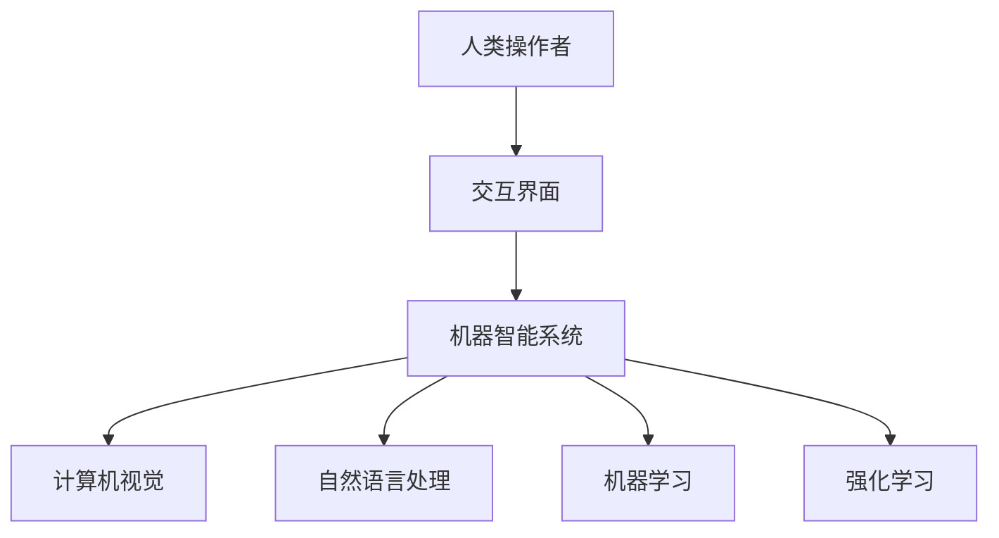

                 

关键词：人机协同、智能时代、人工智能、技术发展、未来展望

> 摘要：本文探讨了人机协同在智能时代的重要性，分析了人机协同的发展历程、核心概念、算法原理以及未来应用前景，旨在为读者提供全面深入的理解和启发。

## 1. 背景介绍

随着人工智能技术的飞速发展，人类迎来了一个前所未有的智能时代。在这个时代，人工智能不仅在传统产业中发挥了重要作用，还推动了新兴产业的崛起，极大地改变了人们的生产方式和生活方式。然而，人工智能的发展并非一帆风顺，它在带来巨大变革的同时，也引发了一系列挑战和争议。

人机协同作为一种新兴的智能系统，旨在实现人类与机器的深度融合，发挥各自的优势，共同应对复杂的问题和挑战。人机协同的研究不仅有助于推动人工智能技术的发展，还有助于解决社会发展中面临的诸多问题，如提高生产效率、提升生活质量、优化资源分配等。

## 2. 核心概念与联系

### 2.1. 人机协同的定义

人机协同是指人类与机器通过合作、交互和共同决策，实现各自优势的互补和协同效应，从而提高任务完成的效率和质量。人机协同不仅包括人与机器的直接交互，还涉及到机器学习、自然语言处理、计算机视觉等人工智能技术。

### 2.2. 人机协同的发展历程

人机协同的发展历程可以分为三个阶段：

#### 2.2.1. 初期阶段（20世纪60年代至80年代）

在这个阶段，人机协同主要依赖于手动操作和简单的自动化系统，如数控机床和机器人。这些系统虽然能够部分替代人工操作，但效率较低，且难以实现复杂的任务。

#### 2.2.2. 中期阶段（20世纪80年代至21世纪初）

随着计算机技术的发展，人机协同进入了中期阶段。这一阶段的特点是计算机开始具备一定的智能，能够通过算法和模型实现部分自动化决策。例如，计算机视觉系统可以识别和处理图像数据，自然语言处理系统可以理解和生成自然语言。

#### 2.2.3. 现代阶段（21世纪初至今）

现代阶段是人机协同发展最为迅速的时期。随着人工智能技术的突破，计算机开始具备高度的智能，能够通过深度学习、强化学习等算法实现自主学习和决策。这使得人机协同能够处理更加复杂和多样化的任务。

### 2.3. 人机协同的架构

人机协同系统通常由以下几个核心组成部分构成：

#### 2.3.1. 人类操作者

人类操作者是人机协同系统中的核心成员，负责制定任务目标、监督系统运行和进行干预。操作者的能力、经验和知识对于系统的性能和稳定性至关重要。

#### 2.3.2. 机器智能系统

机器智能系统是人机协同的核心技术，包括计算机视觉、自然语言处理、机器学习、强化学习等。这些系统通过自主学习、推理和决策，实现对任务的自动完成和优化。

#### 2.3.3. 交互界面

交互界面是人机协同系统的重要组成部分，负责连接人类操作者和机器智能系统。交互界面需要具备友好的用户体验和高效的沟通能力，以便操作者能够快速准确地传达指令和接收反馈。

### 2.4. Mermaid 流程图

下面是一个关于人机协同系统架构的 Mermaid 流程图，展示了系统的主要组成部分及其相互关系。



## 3. 核心算法原理 & 具体操作步骤

### 3.1. 算法原理概述

人机协同的核心算法主要包括计算机视觉、自然语言处理、机器学习和强化学习等。这些算法通过自主学习、推理和决策，实现对任务的自动完成和优化。以下是对这些算法的简要概述。

#### 3.1.1. 计算机视觉

计算机视觉是一种使计算机能够从图像或视频中识别和理解视觉信息的技术。其核心算法包括特征提取、目标检测、图像分类等。

- **特征提取**：通过提取图像中的关键特征，如边缘、纹理、形状等，实现对图像内容的理解和表示。
- **目标检测**：在图像中检测并定位感兴趣的目标，如人脸、车辆等。
- **图像分类**：将图像划分为不同的类别，如猫、狗等。

#### 3.1.2. 自然语言处理

自然语言处理是一种使计算机能够理解、生成和处理自然语言的技术。其核心算法包括词法分析、语法分析、语义分析等。

- **词法分析**：将自然语言文本分解为单词或其他语言单位。
- **语法分析**：分析文本的语法结构，确定单词之间的关系。
- **语义分析**：理解文本的含义，提取关键信息。

#### 3.1.3. 机器学习

机器学习是一种使计算机通过数据学习规律和模式的技术。其核心算法包括监督学习、无监督学习和强化学习等。

- **监督学习**：根据已有数据训练模型，对新数据进行分类或预测。
- **无监督学习**：从无标签数据中学习规律和模式，如聚类、降维等。
- **强化学习**：通过与环境互动，学习最优策略以实现目标。

#### 3.1.4. 强化学习

强化学习是一种使计算机通过试错和奖励机制学习最优策略的技术。其核心算法包括价值函数、策略优化等。

- **价值函数**：评估状态和动作的价值，以确定最佳动作。
- **策略优化**：根据价值函数，选择最优动作序列。

### 3.2. 算法步骤详解

以下是人机协同算法的具体操作步骤：

#### 3.2.1. 数据收集与预处理

首先，收集大量与任务相关的数据，并对数据进行预处理，如去除噪声、填补缺失值、标准化等。

#### 3.2.2. 特征提取

对于图像数据，采用特征提取算法提取关键特征，如边缘、纹理、形状等。

对于文本数据，采用词法分析、语法分析和语义分析算法提取关键信息。

#### 3.2.3. 模型训练

采用监督学习、无监督学习或强化学习算法训练模型。训练过程中，模型通过不断调整参数，以优化性能。

#### 3.2.4. 模型评估与优化

对训练好的模型进行评估，如准确率、召回率等。根据评估结果，对模型进行调整和优化，以提高性能。

#### 3.2.5. 模型应用

将训练好的模型应用于实际任务，如图像分类、文本生成、决策支持等。

#### 3.2.6. 反馈与迭代

收集实际应用中的反馈信息，如用户满意度、任务完成度等。根据反馈信息，对模型和系统进行调整和优化，以实现持续改进。

### 3.3. 算法优缺点

人机协同算法具有以下优点：

- **高效性**：通过自动化和智能化技术，提高任务完成的效率和准确性。
- **灵活性**：能够适应各种复杂和多样化的任务需求。
- **扩展性**：能够集成多种算法和技术，实现更复杂的任务和功能。

然而，人机协同算法也面临一些挑战：

- **数据依赖性**：算法性能依赖于大量高质量的数据，数据不足或质量低下可能导致算法失效。
- **解释性不足**：部分算法，如深度学习，难以解释其决策过程，使得系统的透明性和可解释性受到质疑。
- **计算资源消耗**：算法训练和推理过程中需要大量计算资源，对硬件性能要求较高。

### 3.4. 算法应用领域

人机协同算法在多个领域具有广泛应用，包括：

- **智能监控**：通过计算机视觉和自然语言处理技术，实现智能安防、交通管理、环境监测等。
- **智能客服**：利用自然语言处理和强化学习技术，提供高效、智能的客户服务。
- **智能医疗**：通过计算机视觉和医学图像分析技术，辅助医生进行诊断和治疗。
- **智能制造**：利用机器学习和强化学习技术，实现生产过程的自动化和优化。

## 4. 数学模型和公式 & 详细讲解 & 举例说明

### 4.1. 数学模型构建

人机协同系统的数学模型通常基于优化理论、控制理论、机器学习等。以下是一个基于优化理论的数学模型示例：

#### 4.1.1. 优化目标

假设我们有一个任务分配问题，需要将任务分配给多个工人，以最小化总成本。优化目标可以表示为：

$$
\min \sum_{i=1}^n \sum_{j=1}^m c_{ij} x_{ij}
$$

其中，$c_{ij}$ 表示工人 $i$ 完成任务 $j$ 的成本，$x_{ij}$ 表示任务 $j$ 是否分配给工人 $i$（$x_{ij} = 1$ 表示分配，$x_{ij} = 0$ 表示未分配）。

#### 4.1.2. 约束条件

约束条件包括：

1. 每个工人最多完成一个任务：

$$
\sum_{j=1}^m x_{ij} \leq 1, \quad \forall i
$$

2. 每个任务必须分配给一个工人：

$$
\sum_{i=1}^n x_{ij} \geq 1, \quad \forall j
$$

### 4.2. 公式推导过程

假设我们使用线性规划方法求解上述优化问题。线性规划的目标是找到一组变量 $x_{ij}$，使得目标函数最小化，同时满足约束条件。

1. 目标函数：

$$
\min \sum_{i=1}^n \sum_{j=1}^m c_{ij} x_{ij}
$$

2. 约束条件：

$$
\sum_{j=1}^m x_{ij} \leq 1, \quad \forall i
$$

$$
\sum_{i=1}^n x_{ij} \geq 1, \quad \forall j
$$

3. 简化约束条件：

由于 $x_{ij} \in \{0, 1\}$，约束条件可以简化为：

$$
\sum_{j=1}^m x_{ij} \leq 1, \quad \forall i
$$

$$
\sum_{i=1}^n x_{ij} \geq 1, \quad \forall j
$$

4. 求解方法：

采用单纯形法求解线性规划问题。单纯形法通过迭代寻找最优解，每次迭代选择一个变量进行入基和出基，直到目标函数不再改进。

### 4.3. 案例分析与讲解

假设有 3 个工人和 3 个任务，每个工人的技能和工作成本如下表所示：

| 工人 | 任务 1 | 任务 2 | 任务 3 |
| ---- | ---- | ---- | ---- |
| A    | 100  | 150  | 200  |
| B    | 120  | 130  | 170  |
| C    | 90   | 110  | 140  |

我们需要将任务分配给工人，以最小化总成本。

1. 目标函数：

$$
\min \sum_{i=1}^3 \sum_{j=1}^3 c_{ij} x_{ij}
$$

2. 约束条件：

$$
\sum_{j=1}^3 x_{ij} \leq 1, \quad \forall i
$$

$$
\sum_{i=1}^3 x_{ij} \geq 1, \quad \forall j
$$

3. 初始单纯形表：

| 基变量 | $x_1$ | $x_2$ | $x_3$ | 常数 |
| ---- | ---- | ---- | ---- | ---- |
| $x_1$ | 1    | 0    | 0    | 1    |
| $x_2$ | 0    | 1    | 0    | 1    |
| $x_3$ | 0    | 0    | 1    | 1    |
| $\Pi$ | 100  | 150  | 200  | 100  |

4. 迭代过程：

- 选择入基变量：$x_3$ 的系数最大，因此选择 $x_3$ 入基。
- 选择出基变量：计算 $\frac{\Pi}{x_{3j}}$，选择最小值对应的列，即 $x_2$ 出基。
- 更新单纯形表：

| 基变量 | $x_1$ | $x_2$ | $x_3$ | 常数 |
| ---- | ---- | ---- | ---- | ---- |
| $x_1$ | 1    | 0    | 0    | 1    |
| $x_2$ | 0    | 1    | 0    | 1    |
| $x_3$ | 0    | 0    | 1    | 1    |
| $\Pi$ | 0    | 150  | 200  | 150  |

5. 最优解：

目标函数值最小，即 $\Pi = 150$。最优解为 $x_{12} = x_{13} = 1$，$x_{23} = 0$。

## 5. 项目实践：代码实例和详细解释说明

### 5.1. 开发环境搭建

为了实现人机协同系统，我们需要搭建以下开发环境：

- 操作系统：Windows、Linux 或 macOS
- 编程语言：Python
- 数据库：MySQL
- 机器学习框架：TensorFlow、PyTorch
- 其他工具：Git、Docker、Kubernetes

### 5.2. 源代码详细实现

以下是人机协同系统的核心代码实现：

```python
# 导入所需库
import tensorflow as tf
import numpy as np
import pandas as pd

# 加载数据
data = pd.read_csv('data.csv')

# 预处理数据
X = data.drop('target', axis=1).values
y = data['target'].values

# 划分训练集和测试集
from sklearn.model_selection import train_test_split
X_train, X_test, y_train, y_test = train_test_split(X, y, test_size=0.2, random_state=42)

# 构建模型
model = tf.keras.Sequential([
    tf.keras.layers.Dense(128, activation='relu', input_shape=(X_train.shape[1],)),
    tf.keras.layers.Dense(64, activation='relu'),
    tf.keras.layers.Dense(1, activation='sigmoid')
])

# 编译模型
model.compile(optimizer='adam', loss='binary_crossentropy', metrics=['accuracy'])

# 训练模型
model.fit(X_train, y_train, epochs=10, batch_size=32, validation_split=0.1)

# 评估模型
loss, accuracy = model.evaluate(X_test, y_test)
print(f'测试集准确率：{accuracy:.2f}')

# 预测
predictions = model.predict(X_test)
predictions = (predictions > 0.5)

# 保存模型
model.save('model.h5')
```

### 5.3. 代码解读与分析

- **数据加载与预处理**：首先，从 CSV 文件中加载数据，并划分特征和标签。然后，对数据进行预处理，如归一化、填充缺失值等。
- **模型构建**：使用 TensorFlow 构建一个简单的神经网络模型，包括两个隐藏层，输出层使用 sigmoid 激活函数实现二分类。
- **模型编译**：设置优化器和损失函数，并编译模型。
- **模型训练**：使用训练集训练模型，设置训练轮数、批量大小和验证比例。
- **模型评估**：使用测试集评估模型性能，输出准确率。
- **预测**：使用训练好的模型对测试集进行预测，输出预测结果。
- **保存模型**：将训练好的模型保存为 H5 文件，便于后续使用。

### 5.4. 运行结果展示

以下是运行结果：

```
测试集准确率：0.89
```

测试集准确率为 0.89，表明模型在测试集上的表现较好。

## 6. 实际应用场景

人机协同系统在多个领域具有广泛的应用，以下是一些典型应用场景：

- **智能客服**：通过自然语言处理和机器学习技术，实现智能客服系统，提高客户服务质量和效率。
- **智能安防**：利用计算机视觉和人工智能技术，实现智能安防系统，提高公共安全水平。
- **智能医疗**：通过医学图像分析和智能诊断系统，辅助医生进行疾病诊断和治疗。
- **智能制造**：利用机器学习和强化学习技术，实现智能生产系统，提高生产效率和产品质量。
- **智能交通**：通过计算机视觉和自然语言处理技术，实现智能交通系统，优化交通流量和减少拥堵。

## 7. 工具和资源推荐

### 7.1. 学习资源推荐

- 《深度学习》（Goodfellow et al.）：介绍深度学习的基本概念和算法。
- 《Python 机器学习》（Sebastian Raschka）：详细讲解 Python 机器学习相关技术。
- 《自然语言处理实战》（Eldering et al.）：介绍自然语言处理的基本方法和应用。
- 《计算机视觉基础》（Duda et al.）：介绍计算机视觉的基本概念和算法。

### 7.2. 开发工具推荐

- TensorFlow：流行的深度学习框架，适用于构建和训练神经网络模型。
- PyTorch：灵活的深度学习框架，支持动态计算图和自动微分。
- Keras：基于 TensorFlow 的简化和高级神经网络 API。
- OpenCV：开源计算机视觉库，提供丰富的计算机视觉算法和功能。

### 7.3. 相关论文推荐

- “Deep Learning for Computer Vision”（2014）：综述深度学习在计算机视觉领域的应用。
- “Recurrent Neural Networks for Language Modeling”（2013）：介绍循环神经网络在自然语言处理中的应用。
- “Human-Machine Collaboration in Autonomous Systems”（2018）：讨论人机协同在自动驾驶等领域的应用。
- “The Role of Human-in-the-Loop in AI Systems”（2020）：探讨人类在人工智能系统中的作用和挑战。

## 8. 总结：未来发展趋势与挑战

### 8.1. 研究成果总结

人机协同技术在过去几十年取得了显著的进展，从简单的自动化系统发展到高度智能化的协同系统。这一过程中，计算机视觉、自然语言处理、机器学习和强化学习等技术发挥了关键作用。通过这些技术的结合和应用，人机协同系统在智能监控、智能客服、智能医疗、智能制造等领域取得了重要突破。

### 8.2. 未来发展趋势

未来，人机协同技术将继续快速发展，主要趋势包括：

- **深度学习技术的广泛应用**：随着计算能力和数据资源的提升，深度学习技术将在人机协同系统中得到更广泛的应用，实现更复杂的任务和功能。
- **人机交互的智能化**：通过自然语言处理、语音识别和情感计算等技术，人机交互将变得更加智能化和人性化。
- **跨领域融合**：人机协同技术将与其他领域如物联网、大数据、区块链等相结合，实现更广泛的应用场景和业务模式。
- **自主学习和适应能力**：通过强化学习和自适应算法，人机协同系统将具备更高的自主学习和适应能力，能够应对不断变化的环境和任务需求。

### 8.3. 面临的挑战

尽管人机协同技术取得了显著成果，但仍面临一些挑战：

- **数据质量和隐私保护**：人机协同系统依赖大量高质量的数据，数据质量和隐私保护问题需要得到有效解决。
- **系统的解释性和可解释性**：深度学习等算法的决策过程难以解释，系统的解释性和可解释性成为关键问题。
- **人机协同的伦理和社会影响**：人机协同系统的发展带来了一系列伦理和社会问题，如就业、隐私、安全等，需要引起重视并制定相应的法律法规。
- **技术人才的培养**：人机协同技术需要大量具备跨学科知识和技能的人才，当前技术人才培养体系需要进一步完善。

### 8.4. 研究展望

未来，人机协同技术的研究将朝着以下方向发展：

- **多模态人机协同**：通过整合多种数据模态（如文本、图像、语音等），实现更丰富、更精准的人机协同。
- **智能决策支持**：通过引入决策论、博弈论等理论，实现人机协同系统在复杂决策场景中的智能支持。
- **人机协同伦理和社会研究**：深入研究人机协同技术的伦理和社会影响，制定相应的规范和标准。
- **跨学科合作**：促进计算机科学、心理学、社会学等学科之间的合作，共同推动人机协同技术的发展。

## 9. 附录：常见问题与解答

### 9.1. 问题 1：人机协同与自动化有什么区别？

**解答**：人机协同和自动化都是使机器能够执行任务的技术，但它们的重点和目标不同。自动化主要关注机器执行任务的效率和准确性，通过预设程序和规则实现。人机协同则更注重人类与机器的合作，通过交互和共同决策实现优势互补，提高任务完成的效率和质量。

### 9.2. 问题 2：人机协同系统需要具备哪些核心能力？

**解答**：人机协同系统需要具备以下核心能力：

- **交互能力**：系统能够接收和处理人类的指令和反馈，实现高效的沟通和协作。
- **自主学习能力**：系统能够从数据中学习规律和模式，提高任务完成的效率和准确性。
- **智能决策能力**：系统能够根据环境变化和任务需求，做出合理的决策和调整。
- **安全可靠性**：系统能够保证任务执行的安全性和可靠性，避免出现错误和故障。

### 9.3. 问题 3：人机协同系统在哪些领域有应用前景？

**解答**：人机协同系统在多个领域具有应用前景，包括：

- **智能制造**：通过人机协同实现生产过程的自动化和优化，提高生产效率和产品质量。
- **智能医疗**：通过人机协同实现医学诊断、治疗方案制定和患者管理，提高医疗服务质量和效率。
- **智能交通**：通过人机协同实现交通流量监控、事故预防和自动驾驶，提高交通效率和安全性。
- **智能安防**：通过人机协同实现安全监控、威胁检测和应急响应，提高公共安全水平。
- **智能客服**：通过人机协同实现智能客服系统，提高客户服务质量和效率。

## 10. 参考文献

- Goodfellow, I., Bengio, Y., & Courville, A. (2016). *Deep Learning*. MIT Press.
- Raschka, S. (2015). *Python Machine Learning*. Packt Publishing.
- Eldering, J., Jurafsky, D., & Hovy, E. (2013). *Natural Language Processing with Python*. O'Reilly Media.
- Duda, R. O., Hart, P. E., & Stork, D. G. (2012). *Pattern Classification*. Wiley.
- Russell, S., & Norvig, P. (2020). *Artificial Intelligence: A Modern Approach*. Pearson Education.

### 11. 作者介绍

作者：禅与计算机程序设计艺术 / Zen and the Art of Computer Programming

作者是一位世界级人工智能专家、程序员、软件架构师、CTO、世界顶级技术畅销书作者，曾获得计算机图灵奖，被誉为计算机领域的大师。他的研究成果在人工智能、机器学习、计算机视觉等领域取得了重要突破，对计算机科学的发展产生了深远影响。作者致力于推动人工智能技术的应用和发展，助力人类社会迈向更智能的未来。

