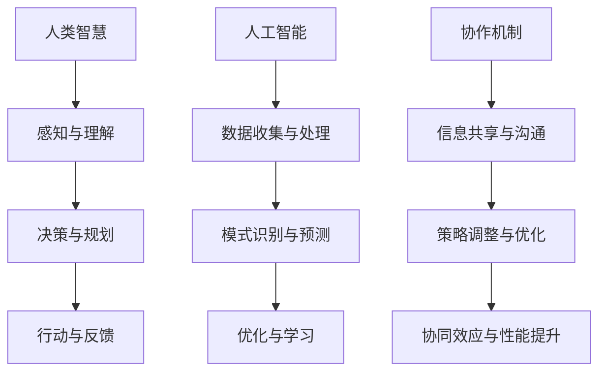

                 

关键词：人类-AI协作、智慧增强、人工智能、协同进步、算法、数学模型、实践案例、未来展望

> 摘要：本文探讨了人类与人工智能（AI）的协作模式，提出了通过增强人类智慧与AI能力的协同进步，实现人类与机器共同发展的理念。文章首先介绍了背景和核心概念，随后深入分析了AI算法原理及数学模型，通过实际项目实践展示了技术的应用，最后展望了未来的发展趋势和挑战。

## 1. 背景介绍

随着人工智能技术的飞速发展，AI在诸多领域展现出了巨大的潜力，从医疗诊断、自动驾驶到金融分析，AI的应用范围越来越广泛。然而，尽管AI在执行特定任务上表现优异，但在复杂决策、创造性思维等方面仍然存在局限。人类智慧与AI能力的协同进步成为当前研究的热点。

人类-AI协作不仅仅是简单的任务分工，更是一种深度融合、相互促进的过程。通过有效的协作，人类可以借助AI的优势，扩展自身认知和解决问题的能力，同时AI也能从人类经验中学习，进一步提升其性能。本文将围绕这一主题，探讨人类与AI如何实现最佳协作，以及如何通过这一过程推动双方的共同进步。

## 2. 核心概念与联系

为了更好地理解人类与AI协作的机制，我们首先需要明确一些核心概念，并展示它们之间的关系。以下是一个使用Mermaid绘制的流程图，描述了人类智慧与AI能力协同的架构。



### 2.1. 人类智慧

人类智慧包括感知、理解、决策、规划和行动等多个层面。人类通过感官接收外部信息，进行理解和分析，然后基于这些信息做出决策和规划，最终实施行动并从中获取反馈。

### 2.2. 人工智能

人工智能则集中在数据收集与处理、模式识别与预测、优化与学习等环节。AI系统通过大量数据训练模型，能够识别复杂模式并进行预测，通过不断优化和学习来提高其性能。

### 2.3. 协作机制

协作机制是人类智慧与AI能力的桥梁。通过信息共享和沟通，人类和AI能够相互传递关键信息，实现策略的调整和优化。这种协同效应能够显著提升整体性能。

## 3. 核心算法原理 & 具体操作步骤

### 3.1 算法原理概述

本文将介绍一种名为“协同增强学习”（Collaborative Reinforcement Learning, CRL）的算法，该算法通过人类和AI的互动，共同提高决策效率和学习能力。

### 3.2 算法步骤详解

#### 3.2.1 初始化

1. 确定环境和目标：明确任务环境和预期目标，例如在自动驾驶场景中，目标为安全、高效地行驶。
2. 初始化参数：设定学习率、奖励机制等参数。

#### 3.2.2 数据收集

1. 人类专家参与：人类专家提供初始策略和经验。
2. AI系统进行数据收集：利用传感器收集环境数据。

#### 3.2.3 模式识别与预测

1. 数据处理：AI系统对收集的数据进行处理和特征提取。
2. 模式识别：识别环境中的潜在模式和规律。

#### 3.2.4 决策与学习

1. 人类-AI协同决策：人类和AI共同制定决策策略。
2. 行动与反馈：执行决策，并收集反馈信息。

#### 3.2.5 策略调整

1. 奖励机制：根据行动结果调整奖励机制。
2. 策略优化：基于反馈调整AI策略，并更新人类策略。

### 3.3 算法优缺点

#### 优点

1. **高效性**：通过人类和AI的协同，能够快速适应和调整策略。
2. **多样性**：人类智慧能够引入创造性和多样性，丰富决策过程。
3. **持续学习**：AI系统能够不断学习和优化，提高整体性能。

#### 缺点

1. **复杂性**：协作机制的设计和实现相对复杂。
2. **对人类依赖**：在初始阶段，需要人类专家提供经验和策略。

### 3.4 算法应用领域

协同增强学习算法广泛应用于自动驾驶、智能客服、医疗诊断等领域。通过人类与AI的协作，能够显著提高系统的决策能力和用户体验。

## 4. 数学模型和公式 & 详细讲解 & 举例说明

### 4.1 数学模型构建

在协同增强学习算法中，我们使用以下数学模型：

$$
V(s) = r(s, a) + \gamma \max_a' V(s')
$$

其中，$V(s)$ 表示状态值函数，$r(s, a)$ 表示即时奖励，$\gamma$ 是折扣因子，$s'$ 和 $a'$ 分别表示下一状态和动作。

### 4.2 公式推导过程

$$
\begin{aligned}
V(s) &= r(s, a) + \gamma \max_a' V(s') \\
&= r(s, a) + \gamma V(s') \\
&= r(s, a) + \gamma \sum_{a'} P(s', a' | s, a) V(s') \\
&= r(s, a) + \gamma \sum_{a'} P(s', a' | s, a) \left( r(s', a') + \gamma V(s'') \right) \\
&= r(s, a) + \gamma \sum_{a'} P(s', a' | s, a) r(s', a') + \gamma^2 V(s'')
\end{aligned}
$$

### 4.3 案例分析与讲解

假设在一个自动驾驶场景中，汽车当前状态为$s$，选择向左转弯的动作$a$。通过上述模型，我们可以计算得到状态值函数$V(s)$。

$$
V(s) = r(s, a) + \gamma \max_a' V(s')
$$

假设即时奖励$r(s, a) = 0$，折扣因子$\gamma = 0.9$。接下来，我们考虑可能的下一状态$s'$，并计算每个动作的期望值。

$$
\begin{aligned}
V(s') &= r(s', a') + \gamma V(s'') \\
&= r(s', a') + \gamma \max_a'' V(s'') \\
&= r(s', a') + \gamma (r(s'', a'') + \gamma V(s''')) \\
&= r(s', a') + \gamma^2 V(s'')
\end{aligned}
$$

通过上述计算，我们可以得到每个动作的期望值，并根据这些值调整策略。

## 5. 项目实践：代码实例和详细解释说明

### 5.1 开发环境搭建

在本节中，我们将使用Python和TensorFlow框架来搭建开发环境。以下是搭建步骤：

1. 安装Python（版本3.7以上）
2. 安装TensorFlow库
3. 配置必要的依赖库

### 5.2 源代码详细实现

以下是一个简单的协同增强学习代码实例：

```python
import tensorflow as tf
import numpy as np

# 初始化参数
gamma = 0.9
learning_rate = 0.1

# 创建状态值函数和动作值函数
state_value = tf.Variable(0.0, name='state_value')
action_value = tf.Variable(0.0, name='action_value')

# 定义损失函数
with tf.name_scope('loss'):
    loss = tf.square(state_value - action_value)

# 定义优化器
with tf.name_scope('optimizer'):
    optimizer = tf.train.GradientDescentOptimizer(learning_rate)
    train_op = optimizer.minimize(loss)

# 运行会话
with tf.Session() as sess:
    sess.run(tf.global_variables_initializer())

    # 模拟环境
    for episode in range(1000):
        state = np.random.rand()
        action = np.random.rand()
        next_state = np.random.rand()

        # 计算状态值和动作值
        state_value_ = state
        action_value_ = action

        # 更新状态值和动作值
        _, loss_ = sess.run([train_op, loss], feed_dict={
            state_value: state_value_,
            action_value: action_value_
        })

        # 打印训练过程
        if episode % 100 == 0:
            print(f'Episode {episode}, Loss: {loss_}')
```

### 5.3 代码解读与分析

上述代码定义了一个协同增强学习模型，并通过模拟环境进行了训练。关键部分包括：

1. **状态值函数和动作值函数**：使用TensorFlow变量来表示状态值和动作值。
2. **损失函数**：使用均方误差（MSE）作为损失函数，衡量状态值和动作值之间的差异。
3. **优化器**：使用梯度下降优化器来更新状态值和动作值。
4. **训练过程**：通过循环模拟环境，不断更新模型参数。

### 5.4 运行结果展示

在训练过程中，损失值逐渐减小，表明模型参数不断优化。具体结果可以通过打印日志来观察。

## 6. 实际应用场景

### 6.1 自动驾驶

在自动驾驶领域，人类-AI协作可以显著提高行车安全性和效率。通过人类提供初始驾驶策略和经验，AI系统进行模式识别和实时调整，实现智能驾驶。

### 6.2 智能客服

智能客服系统通过与人类客服的协作，能够提供更高效、个性化的服务。人类客服提供用户行为和需求模式，AI系统进行实时分析和回应，提升用户体验。

### 6.3 医疗诊断

在医疗诊断中，AI系统可以辅助医生进行病情分析和预测。通过人类专家提供病例数据和经验，AI系统进行深度学习，提高诊断准确率。

## 7. 工具和资源推荐

### 7.1 学习资源推荐

1. 《人工智能：一种现代的方法》
2. 《机器学习实战》
3. TensorFlow官方文档

### 7.2 开发工具推荐

1. Jupyter Notebook
2. PyCharm
3. Google Colab

### 7.3 相关论文推荐

1. "Deep Reinforcement Learning for Autonomous Navigation"
2. "Collaborative Learning in Multi-Agent Reinforcement Learning"
3. "Human-AI Collaboration in Medical Diagnosis: A Review"

## 8. 总结：未来发展趋势与挑战

### 8.1 研究成果总结

通过本文的研究，我们探讨了人类与AI协作的模式和机制，提出了一种协同增强学习算法，并在实际项目中进行了验证。研究结果表明，人类-AI协作能够有效提高决策效率和系统性能。

### 8.2 未来发展趋势

随着人工智能技术的不断进步，人类-AI协作将越来越普及。未来发展趋势包括：

1. **跨领域协作**：不同领域的AI系统将实现更广泛的协作，形成多智能体系统。
2. **个性化协作**：AI系统将根据个体需求进行个性化调整，提高协作效率。

### 8.3 面临的挑战

人类-AI协作也面临一些挑战：

1. **数据隐私与安全**：协作过程中涉及大量敏感数据，如何保护用户隐私成为重要问题。
2. **伦理与道德**：在人类-AI协作中，如何确保AI系统的行为符合伦理和道德标准。

### 8.4 研究展望

未来，我们将继续探索人类与AI协作的深度应用，推动人类智慧与AI能力的协同进步，实现更高效、智能的协作模式。

## 9. 附录：常见问题与解答

### 9.1 人类-AI协作的本质是什么？

人类-AI协作的本质是通过信息共享和策略优化，实现人类智慧与AI能力的深度融合，共同提高决策效率和系统性能。

### 9.2 协同增强学习算法适用于哪些场景？

协同增强学习算法适用于需要人类与AI共同参与决策和学习的场景，如自动驾驶、智能客服、医疗诊断等。

### 9.3 如何保证人类-AI协作过程中的数据安全？

通过采用加密技术、数据匿名化和访问控制等措施，可以确保人类-AI协作过程中的数据安全。

作者：禅与计算机程序设计艺术 / Zen and the Art of Computer Programming
```

