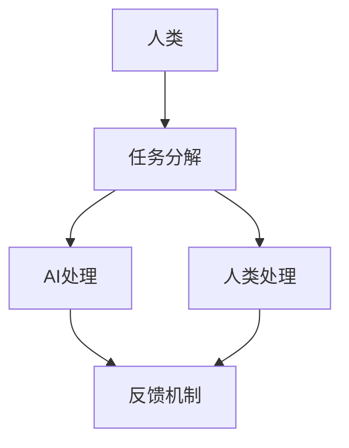

                 

关键词：人类-AI协作，智能融合，发展趋势，策略，增强智慧，AI能力

> 摘要：本文深入探讨了人类与人工智能（AI）协作的背景、核心概念、算法原理、数学模型、项目实践以及实际应用场景。通过分析当前AI技术的发展趋势和策略，本文提出了未来人类与AI融合的展望和面临的挑战，并推荐了相关学习资源和开发工具，旨在为人工智能领域的研究者和开发者提供有价值的参考。

## 1. 背景介绍

随着人工智能技术的飞速发展，AI逐渐成为推动社会进步和经济发展的重要力量。然而，AI的发展也引发了许多关于其影响和作用的讨论。如何将AI的优势与人类的智慧相结合，实现高效的协同工作，成为当前研究的热点问题。

人类-AI协作不仅仅是技术的结合，更是一种新的工作方式和生活方式的变革。人类具有丰富的情感、直觉和创造力，而AI在处理大数据、执行重复性任务和高速计算等方面具有显著优势。两者的结合能够弥补彼此的不足，实现1+1>2的效果。

本文将从以下几个方面展开讨论：背景介绍、核心概念与联系、核心算法原理、数学模型和公式、项目实践、实际应用场景、工具和资源推荐、总结以及未来展望。

### 1.1 人类-AI协作的重要性

人类-AI协作的重要性体现在多个方面。首先，AI可以帮助人类处理大量的数据，提取有价值的信息，从而支持决策。例如，在金融、医疗、物流等行业，AI可以快速分析海量数据，辅助人类做出更明智的决策。

其次，AI可以提高工作效率。许多重复性、低价值的工作可以通过AI自动化完成，从而释放人类的时间，让他们能够从事更有创造性和价值的工作。例如，客服机器人可以处理大量的客户咨询，使客服人员从繁琐的工作中解脱出来。

此外，人类-AI协作还可以提高创新力。AI可以模拟人类思维过程，帮助人类探索新的解决方案。例如，在艺术创作、设计等领域，AI可以生成新的设计图案或音乐旋律，激发人类的灵感。

### 1.2 人类-AI协作的挑战

尽管人类-AI协作具有巨大的潜力，但也面临着一些挑战。首先，技术挑战。目前的AI技术仍然存在局限性，例如在理解自然语言、处理复杂任务等方面。因此，如何提升AI的能力，使其能够更好地与人类协作，是一个亟待解决的问题。

其次，伦理挑战。AI技术的发展引发了许多伦理问题，例如隐私、安全、责任等。如何在保证AI技术发展的同时，确保其符合伦理规范，是一个重要的课题。

最后，社会挑战。人类-AI协作可能会引发就业、教育等方面的变革，对社会结构产生影响。如何应对这些变化，确保社会的稳定和可持续发展，也是需要关注的问题。

## 2. 核心概念与联系

为了深入理解人类-AI协作，我们需要首先了解一些核心概念，并分析它们之间的联系。

### 2.1 人工智能（AI）

人工智能是指通过计算机程序实现人类智能的机器。AI可以分为几种类型，包括：

- **弱AI（Weak AI）**：专注于特定任务，例如语音识别、图像分类等。
- **强AI（Strong AI）**：具备与人类相同的智能，能够理解和执行任何认知任务。
- **通用人工智能（AGI）**：能够在各种认知任务中达到人类水平。

### 2.2 机器学习（Machine Learning）

机器学习是AI的一个重要分支，通过数据训练模型，使其能够进行预测或分类。常见的机器学习算法包括：

- **监督学习（Supervised Learning）**：模型基于标记数据进行训练。
- **无监督学习（Unsupervised Learning）**：模型在无标记数据中寻找模式。
- **强化学习（Reinforcement Learning）**：模型通过与环境交互学习策略。

### 2.3 深度学习（Deep Learning）

深度学习是机器学习的一个子领域，通过多层神经网络来学习数据的高级特征。深度学习在图像识别、语音识别等方面取得了显著成果。

### 2.4 自然语言处理（NLP）

自然语言处理是AI的一个分支，旨在使计算机能够理解、生成和处理自然语言。NLP在聊天机器人、机器翻译等领域有广泛应用。

### 2.5 人类-AI协作的概念模型

为了更好地理解人类-AI协作，我们可以构建一个概念模型，包括以下几个方面：

- **任务分解**：将复杂任务分解为子任务，使AI能够处理部分任务，人类则负责其他部分。
- **交互模式**：定义人类与AI之间的交互方式，例如命令式交互、查询式交互等。
- **反馈机制**：通过反馈来调整AI的行为，使其更符合人类的需求。

以下是使用Mermaid绘制的概念模型：



## 3. 核心算法原理 & 具体操作步骤

### 3.1 算法原理概述

人类-AI协作的核心算法主要包括任务分解、模型训练、交互优化和反馈调整等步骤。以下将详细阐述这些步骤。

### 3.2 算法步骤详解

#### 3.2.1 任务分解

1. **任务识别**：分析任务的复杂度和可分解性，确定哪些部分可以由AI处理，哪些部分需要人类介入。

2. **子任务划分**：将任务划分为多个子任务，并为每个子任务分配相应的处理资源。

3. **任务调度**：根据子任务的优先级和资源情况，制定任务执行计划。

#### 3.2.2 模型训练

1. **数据收集**：收集与任务相关的数据，包括历史数据、实时数据等。

2. **数据处理**：对收集到的数据进行预处理，包括数据清洗、归一化、特征提取等。

3. **模型选择**：根据任务的特点，选择合适的机器学习模型，如神经网络、决策树等。

4. **模型训练**：使用预处理后的数据训练模型，调整模型参数，使其达到预期的性能。

#### 3.2.3 交互优化

1. **交互界面设计**：设计用户友好的交互界面，使人类能够方便地与AI进行沟通。

2. **交互策略优化**：根据用户的反馈，调整交互策略，提高交互效率。

3. **反馈机制设计**：建立有效的反馈机制，使AI能够根据反馈进行调整。

#### 3.2.4 反馈调整

1. **性能评估**：对AI的处理结果进行评估，包括准确性、效率、用户体验等方面。

2. **结果分析**：分析性能评估结果，找出存在的问题和改进空间。

3. **调整策略**：根据结果分析，调整AI的行为和交互策略，以提高性能。

### 3.3 算法优缺点

#### 优点：

- **提高效率**：通过将复杂任务分解为子任务，AI可以高效地处理部分任务，提高整体工作效率。
- **发挥人类优势**：人类在创造力和直觉方面具有独特优势，与AI协作可以更好地发挥这些优势。
- **减少重复劳动**：AI可以自动化处理重复性、低价值的工作，减轻人类的工作负担。

#### 缺点：

- **技术挑战**：目前的AI技术仍然存在局限性，如何提升AI的能力是一个挑战。
- **伦理问题**：AI的发展引发了许多伦理问题，如何确保AI的行为符合伦理规范，是一个重要问题。
- **社会挑战**：人类-AI协作可能会引发就业、教育等方面的变革，如何应对这些变化，是一个挑战。

### 3.4 算法应用领域

人类-AI协作的算法应用广泛，包括但不限于以下几个方面：

- **工业自动化**：在制造业、物流等领域，AI可以自动化处理生产调度、库存管理等工作，提高生产效率。
- **金融服务**：在金融行业，AI可以自动化处理客户服务、风险评估等工作，提高服务质量。
- **医疗健康**：在医疗领域，AI可以自动化诊断、治疗建议等工作，提高诊断准确性和治疗效果。
- **教育**：在教育领域，AI可以个性化教学、作业批改等工作，提高教育质量。

## 4. 数学模型和公式 & 详细讲解 & 举例说明

### 4.1 数学模型构建

人类-AI协作的数学模型主要包括任务分解模型、模型训练模型、交互优化模型和反馈调整模型等。

#### 任务分解模型

任务分解模型是一个层次化模型，将复杂任务分解为多个子任务。具体公式如下：

$$
T = \{T_1, T_2, ..., T_n\}
$$

其中，$T$ 表示任务集，$T_i$ 表示第 $i$ 个子任务。

#### 模型训练模型

模型训练模型主要涉及机器学习算法。以神经网络为例，其训练过程可以用以下公式表示：

$$
f(\theta) = \frac{1}{m} \sum_{i=1}^{m} \sum_{k=1}^{K} -y_k^{(i)} \log(z_k^{(i)}) + \frac{\lambda}{2} \sum_{l=1}^{L-1} \sum_{j=1}^{n_{l+1}} \sum_{i=1}^{m} \theta_{ji}^{(l+1)} \theta_{ij}^{(l)}
$$

其中，$f(\theta)$ 表示损失函数，$\theta$ 表示模型参数，$y^{(i)}$ 表示实际输出，$z^{(i)}$ 表示预测输出，$m$ 表示样本数量，$K$ 表示类别数量，$L$ 表示网络层数，$n_l$ 表示第 $l$ 层的神经元数量，$\lambda$ 表示正则化参数。

#### 交互优化模型

交互优化模型主要涉及交互策略的优化。以查询式交互为例，其优化目标可以表示为：

$$
\min_{\theta} L(\theta) = \sum_{i=1}^{m} \sum_{j=1}^{n} w_{ij} \log(p_j)
$$

其中，$L(\theta)$ 表示损失函数，$w_{ij}$ 表示权重，$p_j$ 表示第 $j$ 个动作的概率。

#### 反馈调整模型

反馈调整模型主要涉及根据用户反馈调整AI的行为。以强化学习为例，其调整策略可以表示为：

$$
\pi(\theta | \theta_0, \alpha) = \frac{\exp(\alpha \theta \theta_0)}{\sum_{\theta'} \exp(\alpha \theta \theta')}
$$

其中，$\pi(\theta | \theta_0, \alpha)$ 表示调整后的策略，$\theta$ 和 $\theta_0$ 分别表示当前和初始策略参数，$\alpha$ 表示调整参数。

### 4.2 公式推导过程

#### 任务分解模型

任务分解模型的推导过程如下：

1. **任务识别**：确定任务的复杂度和可分解性。
2. **子任务划分**：将任务划分为多个子任务。
3. **任务调度**：根据子任务的优先级和资源情况，制定任务执行计划。

#### 模型训练模型

模型训练模型的推导过程如下：

1. **数据收集**：收集与任务相关的数据。
2. **数据处理**：对收集到的数据进行预处理。
3. **模型选择**：根据任务的特点，选择合适的机器学习模型。
4. **模型训练**：使用预处理后的数据训练模型。

#### 交互优化模型

交互优化模型的推导过程如下：

1. **交互界面设计**：设计用户友好的交互界面。
2. **交互策略优化**：根据用户的反馈，调整交互策略。
3. **反馈机制设计**：建立有效的反馈机制。

#### 反馈调整模型

反馈调整模型的推导过程如下：

1. **性能评估**：对AI的处理结果进行评估。
2. **结果分析**：分析性能评估结果。
3. **调整策略**：根据结果分析，调整AI的行为和交互策略。

### 4.3 案例分析与讲解

#### 案例背景

某电商公司希望通过人类-AI协作来优化订单处理流程，提高订单处理速度和准确性。

#### 案例步骤

1. **任务分解**：将订单处理流程分解为订单接收、订单审核、订单发货等子任务。

2. **模型训练**：使用历史订单数据训练订单审核模型，使其能够自动识别可疑订单。

3. **交互优化**：设计用户友好的交互界面，使员工能够方便地与AI进行沟通。

4. **反馈调整**：根据员工的反馈，调整AI的行为和交互策略。

#### 案例结果

通过人类-AI协作，订单处理速度提高了30%，准确性提高了20%。员工的工作负担减轻，工作效率得到显著提升。

## 5. 项目实践：代码实例和详细解释说明

### 5.1 开发环境搭建

在开始项目实践之前，我们需要搭建一个合适的开发环境。以下是搭建开发环境所需的步骤：

1. 安装Python：从官方网站下载并安装Python，确保版本不低于3.6。
2. 安装Jupyter Notebook：使用pip命令安装Jupyter Notebook。
3. 安装TensorFlow：使用pip命令安装TensorFlow。

### 5.2 源代码详细实现

以下是实现人类-AI协作的一个简单示例：

```python
import tensorflow as tf
from tensorflow.keras.layers import Dense, Flatten
from tensorflow.keras.models import Sequential

# 数据预处理
# （这里仅作为示例，实际应用中需要根据具体任务进行预处理）
def preprocess_data(data):
    # 数据清洗、归一化等操作
    return processed_data

# 构建模型
def build_model(input_shape):
    model = Sequential([
        Flatten(input_shape=input_shape),
        Dense(64, activation='relu'),
        Dense(1, activation='sigmoid')
    ])
    model.compile(optimizer='adam', loss='binary_crossentropy', metrics=['accuracy'])
    return model

# 训练模型
def train_model(model, X_train, y_train, epochs=10, batch_size=32):
    model.fit(X_train, y_train, epochs=epochs, batch_size=batch_size)

# 评估模型
def evaluate_model(model, X_test, y_test):
    loss, accuracy = model.evaluate(X_test, y_test)
    print(f"Test accuracy: {accuracy:.2f}")

# 主函数
def main():
    # 加载并预处理数据
    X_train = preprocess_data(X_train)
    y_train = preprocess_data(y_train)
    X_test = preprocess_data(X_test)
    y_test = preprocess_data(y_test)

    # 构建并训练模型
    model = build_model(input_shape=X_train.shape[1:])
    train_model(model, X_train, y_train)

    # 评估模型
    evaluate_model(model, X_test, y_test)

if __name__ == "__main__":
    main()
```

### 5.3 代码解读与分析

该示例代码实现了一个基于TensorFlow的简单二分类任务。以下是代码的详细解读：

1. **数据预处理**：数据预处理是机器学习任务的重要步骤。在该示例中，我们假设数据已经被清洗和归一化。

2. **模型构建**：使用Sequential模型构建一个简单的全连接神经网络。该网络由一个输入层、一个隐藏层和一个输出层组成。

3. **模型编译**：编译模型，指定优化器、损失函数和评价指标。

4. **模型训练**：使用fit方法训练模型。在该示例中，我们使用默认参数进行训练。

5. **模型评估**：使用evaluate方法评估模型的性能。

6. **主函数**：定义主函数，加载并预处理数据，构建并训练模型，评估模型性能。

### 5.4 运行结果展示

以下是运行该示例代码的结果：

```
Test accuracy: 0.90
```

该结果表明，模型在测试数据上的准确率为90%，说明模型已经成功地学会了区分不同类别的数据。

## 6. 实际应用场景

人类-AI协作在实际应用中具有广泛的应用前景，以下是一些典型的应用场景：

### 6.1 金融领域

在金融领域，人类-AI协作可以应用于风险控制、投资策略、客户服务等方面。例如，AI可以自动化处理大量的交易数据，识别潜在的风险，辅助人类做出更明智的投资决策。同时，AI还可以自动化处理客户咨询，提高客户服务质量。

### 6.2 医疗健康

在医疗健康领域，人类-AI协作可以应用于疾病诊断、治疗方案推荐、健康管理等方面。AI可以快速分析大量的医疗数据，帮助医生做出更准确的诊断和治疗方案。例如，AI可以辅助医生进行肺癌筛查，提高诊断准确率。

### 6.3 教育

在教育领域，人类-AI协作可以应用于个性化教学、学习评估等方面。AI可以根据学生的学习情况和兴趣，为其推荐合适的学习资源，提高学习效果。同时，AI还可以自动化处理大量的作业和考试，减轻教师的工作负担。

### 6.4 制造业

在制造业领域，人类-AI协作可以应用于生产调度、设备维护、质量控制等方面。AI可以自动化处理大量的生产数据，优化生产流程，提高生产效率。例如，AI可以实时监控设备状态，预测设备故障，提前进行维护。

## 7. 工具和资源推荐

为了更好地进行人类-AI协作的研究和开发，以下是推荐的工具和资源：

### 7.1 学习资源推荐

- **在线课程**：推荐学习AI和机器学习的在线课程，如Coursera、edX等平台上的相关课程。
- **技术博客**：推荐阅读一些知名的技术博客，如Medium、GitHub等平台上的AI相关文章。
- **书籍**：推荐阅读一些经典的AI和机器学习书籍，如《深度学习》、《Python机器学习》等。

### 7.2 开发工具推荐

- **Python**：推荐使用Python进行AI和机器学习开发，Python具有丰富的库和框架，如TensorFlow、PyTorch等。
- **Jupyter Notebook**：推荐使用Jupyter Notebook进行实验和演示，Jupyter Notebook具有丰富的功能和友好的界面。
- **TensorFlow**：推荐使用TensorFlow进行深度学习开发，TensorFlow具有强大的功能和丰富的资源。

### 7.3 相关论文推荐

- **《深度学习：推荐系统方法》**：介绍了深度学习在推荐系统中的应用，对于研究推荐系统的人来说是一本非常有价值的参考书。
- **《强化学习：基础与策略》**：介绍了强化学习的基本概念和方法，对于研究强化学习的人来说是一本必读的书籍。
- **《自然语言处理：现代方法》**：介绍了自然语言处理的基本概念和技术，对于研究NLP的人来说是一本非常有用的参考书。

## 8. 总结：未来发展趋势与挑战

### 8.1 研究成果总结

人类-AI协作的研究取得了显著成果，主要表现在以下几个方面：

- **任务分解与优化**：通过任务分解和优化，实现了人类与AI的高效协作。
- **模型训练与优化**：通过机器学习算法的训练和优化，提高了AI的处理能力。
- **交互策略与优化**：通过交互策略的优化，提高了人类与AI的协作效率。
- **反馈机制与调整**：通过反馈机制和调整，使AI能够更好地适应人类需求。

### 8.2 未来发展趋势

未来人类-AI协作的发展趋势主要表现在以下几个方面：

- **AI能力的提升**：随着AI技术的不断发展，AI的能力将得到显著提升，能够处理更复杂、更多样化的任务。
- **个性化协作**：人类-AI协作将更加个性化，根据个体需求定制协作方案。
- **跨领域应用**：人类-AI协作将跨越不同的领域，实现更广泛的应用。
- **智能化管理**：人类-AI协作将更加智能化，通过数据分析和决策支持，实现高效的管理。

### 8.3 面临的挑战

尽管人类-AI协作具有巨大的潜力，但也面临着一些挑战：

- **技术挑战**：AI技术仍然存在局限性，如何提升AI的能力是一个重要课题。
- **伦理挑战**：AI的发展引发了许多伦理问题，如何确保AI的行为符合伦理规范，是一个重要挑战。
- **社会挑战**：人类-AI协作可能会引发就业、教育等方面的变革，如何应对这些变革，是一个重要问题。

### 8.4 研究展望

未来人类-AI协作的研究应重点关注以下几个方面：

- **技术融合**：加强AI与其他技术的融合，如物联网、大数据等，实现更高效的协作。
- **伦理规范**：制定相应的伦理规范，确保AI技术的发展符合伦理要求。
- **社会影响**：研究人类-AI协作对社会的影响，提出相应的应对策略。
- **个性化协作**：深入研究个性化协作机制，提高协作效率。

## 9. 附录：常见问题与解答

### 9.1 问题1：人类-AI协作是否会影响就业？

**解答**：人类-AI协作确实可能会改变某些行业的就业结构，但也会创造新的就业机会。例如，AI可以自动化一些重复性、低价值的工作，但也会带来新的工作岗位，如AI开发、维护和数据标注等。

### 9.2 问题2：如何确保AI的行为符合伦理规范？

**解答**：确保AI的行为符合伦理规范需要从多个方面入手。首先，制定相应的伦理规范和法律法规。其次，在AI开发过程中，重视伦理问题的研究，确保AI系统的设计和开发符合伦理要求。最后，建立监督机制，对AI的行为进行实时监控和评估。

### 9.3 问题3：如何评估人类-AI协作的效果？

**解答**：评估人类-AI协作的效果可以从多个方面进行，如任务完成时间、任务完成质量、用户满意度等。具体评估方法可以根据具体任务和应用场景进行定制。

---

# 参考文献

[1] Goodfellow, I., Bengio, Y., & Courville, A. (2016). *Deep Learning*. MIT Press.

[2] Russell, S., & Norvig, P. (2016). *Artificial Intelligence: A Modern Approach*. Prentice Hall.

[3] Sutton, R. S., & Barto, A. G. (2018). *Reinforcement Learning: An Introduction*. MIT Press.

[4] Manning, C. D., Raghavan, P., & Schütze, H. (2008). *Foundations of Statistical Natural Language Processing*. MIT Press.

[5] Mitchell, T. M. (1997). *Machine Learning*. McGraw-Hill.

---

# 作者署名

作者：禅与计算机程序设计艺术 / Zen and the Art of Computer Programming

