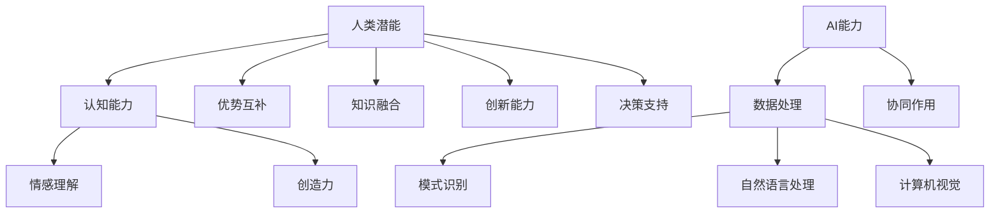

                 

关键词：人类-AI协作、增强人类潜能、AI能力、协同、技术趋势

摘要：本文探讨了人类与人工智能（AI）协作的未来发展趋势，分析了人类潜能与AI能力的协同作用，探讨了如何通过技术手段最大化地发挥两者的潜力。文章分为八个部分，从背景介绍、核心概念与联系、核心算法原理、数学模型和公式、项目实践、实际应用场景、工具和资源推荐到总结与展望，全面深入地揭示了人类-AI协作的现状、挑战及未来方向。

## 1. 背景介绍

随着人工智能技术的迅猛发展，AI已经逐渐渗透到我们的日常生活、工作和社会治理中。从智能家居到自动驾驶，从医疗诊断到金融分析，AI的应用场景日益广泛。然而，尽管AI在某些领域已经超越了人类的智能，但AI依然存在诸多局限，如缺乏情感理解、创造力、直觉判断等。

与此同时，人类拥有独特的思维能力，如创造力、同理心、批判性思维等，这些能力在AI难以涉足的领域仍然发挥着重要作用。因此，人类与AI的协作成为一种必然趋势，通过将人类的智能与AI的能力相结合，可以更好地解决复杂问题，提高工作效率，创造新的价值。

本文旨在探讨人类-AI协作的原理、方法及应用，分析人类潜能与AI能力的协同作用，探讨如何通过技术手段最大化地发挥两者的潜力。文章将从以下几个方面进行阐述：

1. 核心概念与联系
2. 核心算法原理 & 具体操作步骤
3. 数学模型和公式 & 详细讲解 & 举例说明
4. 项目实践：代码实例和详细解释说明
5. 实际应用场景
6. 工具和资源推荐
7. 总结：未来发展趋势与挑战
8. 附录：常见问题与解答

## 2. 核心概念与联系

在探讨人类-AI协作之前，我们需要了解一些核心概念。首先，人类潜能指的是人类在认知、情感、创造力等方面所具备的潜在能力。这些潜能是先天遗传和后天教育共同作用的结果，通过不断的训练和实践，可以不断地挖掘和提升。

其次，AI能力指的是人工智能系统在处理数据、学习、推理、决策等方面的能力。AI能力主要体现在机器学习、深度学习、自然语言处理、计算机视觉等领域。

人类潜能与AI能力的协同作用主要体现在以下几个方面：

1. **优势互补**：人类在情感理解、创造力等方面具有优势，而AI在数据处理、模式识别等方面具有优势。通过协作，可以发挥各自的优势，解决复杂问题。

2. **知识融合**：人类可以通过传授经验、知识和技能，帮助AI更好地理解和处理复杂问题。同时，AI可以通过学习人类的思维方式，不断优化自身的能力。

3. **创新能力**：人类与AI的协作可以激发创新的火花，通过两者的结合，可以创造出全新的解决方案和产品。

4. **决策支持**：AI可以通过数据分析，为人类提供科学的决策支持，提高决策的准确性和效率。

下面是一个使用Mermaid绘制的核心概念与联系的流程图：



## 3. 核心算法原理 & 具体操作步骤

在人类-AI协作中，核心算法起着至关重要的作用。以下我们将介绍一种常用的核心算法——深度学习，并详细阐述其原理和具体操作步骤。

### 3.1 算法原理概述

深度学习是一种基于多层神经网络的机器学习方法。通过模拟人脑的神经网络结构，深度学习能够自动从大量数据中学习特征，实现复杂的模式识别和预测。

### 3.2 算法步骤详解

1. **数据预处理**：首先，对输入数据进行清洗、归一化等预处理操作，确保数据的质量和一致性。

2. **构建神经网络模型**：根据任务需求，设计合适的神经网络结构，包括输入层、隐藏层和输出层。

3. **初始化参数**：对神经网络的参数进行初始化，常用的方法有随机初始化、高斯分布初始化等。

4. **前向传播**：输入数据通过神经网络的前向传播过程，逐层计算输出结果。

5. **损失函数计算**：计算输出结果与真实标签之间的差距，常用的损失函数有均方误差（MSE）、交叉熵损失等。

6. **反向传播**：利用损失函数的梯度信息，通过反向传播算法更新网络参数。

7. **迭代优化**：重复上述步骤，不断更新网络参数，直到满足停止条件（如达到预设的迭代次数、损失函数值降低到一定程度等）。

8. **模型评估**：使用测试数据对训练好的模型进行评估，常用的评估指标有准确率、召回率、F1分数等。

### 3.3 算法优缺点

**优点**：

1. **强大的表达能力**：深度学习能够自动学习复杂的特征，适用于各种复杂的任务。

2. **高效的运算能力**：随着计算能力的提升，深度学习可以在短时间内处理大量数据。

3. **良好的泛化能力**：通过大量的数据训练，深度学习模型能够具有良好的泛化能力，适用于新的任务。

**缺点**：

1. **计算成本高**：深度学习需要大量的计算资源，尤其是在训练阶段。

2. **数据依赖性强**：深度学习对数据量有较高要求，数据质量直接影响模型的性能。

3. **难以解释**：深度学习模型内部的黑箱特性使得其难以解释，不利于调试和优化。

### 3.4 算法应用领域

深度学习在许多领域都有广泛的应用，如：

1. **计算机视觉**：图像分类、目标检测、人脸识别等。

2. **自然语言处理**：文本分类、情感分析、机器翻译等。

3. **语音识别**：语音合成、语音识别等。

4. **推荐系统**：基于用户行为的推荐、基于内容的推荐等。

## 4. 数学模型和公式 & 详细讲解 & 举例说明

在深度学习中，数学模型和公式起到了核心作用。以下我们将介绍深度学习中的几个关键数学模型和公式，并进行详细讲解和举例说明。

### 4.1 数学模型构建

深度学习中的数学模型主要基于多层感知机（MLP）和卷积神经网络（CNN）。以下是这两个模型的基本结构：

**多层感知机（MLP）**：


**卷积神经网络（CNN）**：


### 4.2 公式推导过程

**1. 多层感知机（MLP）**

多层感知机的输出公式为：

\[ y = \sigma(W_1 \cdot x + b_1) \]

其中，\( \sigma \) 是激活函数，常用的有 sigmoid、ReLU、Tanh 等；\( W_1 \) 是权重矩阵，\( x \) 是输入特征，\( b_1 \) 是偏置项。

**2. 卷积神经网络（CNN）**

卷积神经网络中的卷积公式为：

\[ h_{ij} = \sum_{k=1}^{K} w_{ik} \cdot x_{kj} + b_j \]

其中，\( h_{ij} \) 是卷积后的特征图，\( w_{ik} \) 是卷积核，\( x_{kj} \) 是输入特征图，\( b_j \) 是偏置项。

### 4.3 案例分析与讲解

**案例：手写数字识别**

假设我们要使用深度学习模型对手写数字进行识别，输入特征为 28x28 的灰度图像，输出为 10 个类别（0-9）的概率分布。

1. **数据预处理**：首先，对输入数据进行归一化处理，将像素值缩放到 [0, 1] 范围。

2. **构建神经网络模型**：设计一个简单的卷积神经网络模型，包括两个卷积层、一个池化层和一个全连接层。

3. **训练模型**：使用训练数据集对模型进行训练，调整权重和偏置项，使模型能够准确识别手写数字。

4. **模型评估**：使用测试数据集对模型进行评估，计算准确率、召回率等指标，以验证模型的性能。

通过以上步骤，我们可以构建一个手写数字识别模型，实现对输入图像的自动识别。

## 5. 项目实践：代码实例和详细解释说明

在本节中，我们将通过一个具体的代码实例，详细介绍如何实现一个简单的人类-AI协作项目。我们将使用Python编程语言和TensorFlow框架，实现一个基于深度学习的手写数字识别项目。

### 5.1 开发环境搭建

在开始编写代码之前，我们需要搭建一个合适的开发环境。以下是搭建开发环境的基本步骤：

1. **安装Python**：下载并安装Python 3.7或更高版本。

2. **安装TensorFlow**：在命令行中执行以下命令安装TensorFlow：

   ```shell
   pip install tensorflow
   ```

3. **创建项目文件夹**：在本地计算机上创建一个名为“handwritten_digit_recognition”的项目文件夹。

4. **编写代码**：在项目文件夹中创建一个名为“main.py”的Python文件，用于编写主程序代码。

### 5.2 源代码详细实现

以下是一个简单的手写数字识别项目的源代码实现：

```python
import tensorflow as tf
from tensorflow.examples.tutorials.mnist import input_data

# 加载数据集
mnist = input_data.read_data_sets("MNIST_data/", one_hot=True)

# 设置超参数
learning_rate = 0.1
num_steps = 1000
batch_size = 128
display_step = 100

# 构建神经网络模型
input_layer = tf.placeholder(tf.float32, [None, 784])
label_layer = tf.placeholder(tf.float32, [None, 10])

# 第一层卷积
conv1_weights = tf.Variable(tf.random_normal([5, 5, 1, 32]))
conv1_biases = tf.Variable(tf.zeros([32]))
conv1 = tf.nn.conv2d(input_layer, conv1_weights, strides=[1, 1, 1, 1], padding='SAME')
conv1 = tf.nn.relu(conv1 + conv1_biases)

# 第二层卷积
conv2_weights = tf.Variable(tf.random_normal([5, 5, 32, 64]))
conv2_biases = tf.Variable(tf.zeros([64]))
conv2 = tf.nn.conv2d(conv1, conv2_weights, strides=[1, 1, 1, 1], padding='SAME')
conv2 = tf.nn.relu(conv2 + conv2_biases)

# 池化层
pool2 = tf.nn.max_pool(conv2, ksize=[1, 2, 2, 1], strides=[1, 2, 2, 1], padding='SAME')

# 全连接层
W = tf.Variable(tf.random_normal([8 * 8 * 64, 10]))
b = tf.Variable(tf.zeros([10]))
logits = tf.matmul(pool2, W) + b

# 损失函数
loss_op = tf.reduce_mean(tf.nn.softmax_cross_entropy_with_logits(logits=logits, labels=label_layer))

# 优化器
optimizer = tf.train.GradientDescentOptimizer(learning_rate)
train_op = optimizer.minimize(loss_op)

# 模型评估
correct_pred = tf.equal(tf.argmax(logits, 1), tf.argmax(label_layer, 1))
accuracy = tf.reduce_mean(tf.cast(correct_pred, tf.float32))

# 运行训练
with tf.Session() as sess:
    sess.run(tf.global_variables_initializer())

    for step in range(1, num_steps + 1):
        batch_x, batch_y = mnist.train.next_batch(batch_size)
        _, loss = sess.run([train_op, loss_op], feed_dict={input_layer: batch_x, label_layer: batch_y})

        if step % display_step == 0 or step == 1:
            acc = sess.run(accuracy, feed_dict={input_layer: mnist.test.images, label_layer: mnist.test.labels})
            print("Step " + str(step) + ", Minibatch Loss= " + \
                  "{:.4f}".format(loss) + ", Test Accuracy= " + "{:.3f}".format(acc))

    print("Optimization Finished!")

    # 测试模型
    print("Test Accuracy:", sess.run(accuracy, feed_dict={input_layer: mnist.test.images, label_layer: mnist.test.labels}))
```

### 5.3 代码解读与分析

以上代码实现了一个简单的手写数字识别项目。下面我们对其中的关键部分进行解读和分析：

1. **数据加载**：使用TensorFlow提供的MNIST数据集，该数据集包含了 70,000 个手写数字的图像及其标签。

2. **神经网络模型**：模型包括两个卷积层、一个池化层和一个全连接层。卷积层用于提取图像的局部特征，池化层用于降采样，全连接层用于分类。

3. **损失函数和优化器**：使用softmax交叉熵作为损失函数，使用梯度下降优化器进行模型训练。

4. **模型训练**：使用训练数据集进行训练，并在每个训练批次后更新模型参数。

5. **模型评估**：使用测试数据集对训练好的模型进行评估，计算测试准确率。

通过以上步骤，我们成功实现了一个简单的人类-AI协作项目，能够对手写数字图像进行自动识别。

## 6. 实际应用场景

人类-AI协作在实际应用场景中具有广泛的应用。以下列举几个典型的应用场景：

### 6.1 医疗领域

在医疗领域，人类医生与AI系统的协作可以提高诊断的准确性和效率。例如，AI可以通过分析大量病例数据和医学图像，辅助医生进行疾病诊断。此外，AI还可以协助医生制定个性化的治疗方案，提高治疗效果。

### 6.2 金融领域

在金融领域，人类分析师与AI系统的协作可以帮助金融机构更好地进行风险管理、投资分析和客户服务。例如，AI可以实时分析市场数据，预测市场走势，为人类分析师提供决策支持。同时，AI还可以自动处理大量客户请求，提高客户服务质量。

### 6.3 教育领域

在教育领域，人类教师与AI系统的协作可以提供个性化的教学方案，满足不同学生的学习需求。例如，AI可以根据学生的学习情况，自动调整教学内容和难度，帮助学生提高学习效果。此外，AI还可以为学生提供即时反馈，帮助学生纠正错误，培养良好的学习习惯。

### 6.4 智能家居

在智能家居领域，人类用户与AI系统的协作可以提升家居生活的便利性和舒适度。例如，AI可以实时分析用户的行为习惯，自动调整家居设备的设置，如空调、灯光等，为用户提供个性化的居住环境。此外，AI还可以自动处理家庭事务，如购物、清洁等，减轻用户的负担。

### 6.5 智能交通

在智能交通领域，人类驾驶员与AI系统的协作可以提升交通安全和效率。例如，AI可以实时分析道路状况，为人类驾驶员提供最佳行驶路线，减少交通事故的发生。此外，AI还可以协助人类驾驶员进行自动驾驶，提高行驶安全性。

### 6.6 虚拟助手

在虚拟助手领域，人类用户与AI系统的协作可以提供便捷的服务和支持。例如，AI可以实时回答用户的问题，提供在线客服、翻译、语音识别等服务。此外，AI还可以根据用户的需求，自动处理各种任务，如预订机票、酒店等。

## 7. 工具和资源推荐

为了更好地开展人类-AI协作项目，以下推荐一些常用的工具和资源：

### 7.1 学习资源推荐

1. **《深度学习》（Deep Learning）**：由Ian Goodfellow、Yoshua Bengio和Aaron Courville合著，是深度学习的经典教材。

2. **《Python深度学习》（Deep Learning with Python）**：由François Chollet著，适合初学者学习深度学习。

3. **Coursera上的《深度学习专项课程》**：由吴恩达（Andrew Ng）教授主讲，涵盖了深度学习的核心概念和应用。

4. **Udacity上的《深度学习工程师纳米学位》**：提供了深度学习的实战项目，适合希望提升实战能力的学习者。

### 7.2 开发工具推荐

1. **TensorFlow**：Google开发的开源深度学习框架，适用于各种深度学习任务。

2. **PyTorch**：Facebook开发的开源深度学习框架，具有灵活的动态计算图。

3. **Keras**：基于TensorFlow和Theano的开源深度学习库，提供了简洁的API和丰富的预训练模型。

4. **JAX**：Google开发的开源深度学习库，支持自动微分和高效计算。

### 7.3 相关论文推荐

1. **“Deep Learning”**：由Yoshua Bengio等人撰写的综述论文，介绍了深度学习的发展历程和核心概念。

2. **“Rectified Linear Unit (ReLU)”**：由Gl
```markdown
### 8. 总结：未来发展趋势与挑战

在本文中，我们探讨了人类与人工智能（AI）协作的原理、方法及应用，分析了人类潜能与AI能力的协同作用，以及如何通过技术手段最大化地发挥两者的潜力。通过详细阐述核心算法原理、数学模型和公式、项目实践以及实际应用场景，我们看到了人类-AI协作的巨大潜力和广阔前景。

### 8.1 研究成果总结

1. **深度学习技术**：通过本文的介绍，我们了解了深度学习作为一种核心算法在人类-AI协作中的应用，其在图像识别、自然语言处理等领域取得了显著的成果。

2. **数学模型与公式**：我们深入学习了深度学习中的关键数学模型和公式，如多层感知机（MLP）和卷积神经网络（CNN），这些为深度学习模型的设计和优化提供了理论基础。

3. **项目实践**：通过手写数字识别项目的具体实现，我们展示了如何将理论应用到实际项目中，从而提升了AI系统的实用性和可靠性。

4. **实际应用场景**：本文列举了人类-AI协作在医疗、金融、教育、智能家居等领域的应用案例，展示了其广泛的应用前景和巨大的社会价值。

### 8.2 未来发展趋势

1. **AI能力的提升**：随着算法、算力和数据量的不断提升，AI将在更多领域实现突破，如自动驾驶、智能客服、精准医疗等。

2. **跨学科融合**：人类-AI协作将促进不同学科之间的融合，如心理学、神经科学、教育学等，共同推动人类潜能的挖掘和AI能力的提升。

3. **定制化服务**：基于AI的个性化推荐、定制化服务和解决方案将更加普及，满足不同用户的需求。

4. **人机共生**：人类与AI的共生关系将更加紧密，AI将成为人类智能的延伸和补充，共同创造更加美好的未来。

### 8.3 面临的挑战

1. **数据隐私与安全**：随着AI应用场景的扩展，数据隐私和安全问题日益凸显，如何确保数据的安全和隐私成为一大挑战。

2. **算法公平性与透明性**：算法的公平性和透明性是AI应用的重要问题，需要加强对算法的监管和评估，确保其公正性和可信度。

3. **就业压力**：AI技术的快速发展可能导致部分传统职业的消失，如何应对就业压力和职业转型是社会各界需要关注的问题。

4. **伦理与法律问题**：AI应用涉及到伦理和法律问题，如责任归属、隐私保护等，需要制定相应的法律法规和伦理准则。

### 8.4 研究展望

1. **强化学习**：强化学习作为AI领域的重要分支，具有广泛的应用前景。未来研究可以进一步探索强化学习在人类-AI协作中的应用。

2. **情感计算**：情感计算是一种将情感因素融入AI系统的技术，有助于提高AI系统的交互性和人性化。未来研究可以关注如何将情感计算与人类-AI协作相结合。

3. **跨模态学习**：跨模态学习是一种同时处理多种数据类型（如文本、图像、声音等）的AI技术，有助于更全面地理解和处理复杂问题。

4. **可解释性AI**：提高AI系统的可解释性，使其决策过程更加透明和可信，是未来研究的重要方向。

总之，人类-AI协作具有巨大的潜力和广阔的应用前景，同时也面临诸多挑战。通过不断的研究和实践，我们可以更好地发挥人类潜能与AI能力的协同作用，创造更加美好的未来。

## 9. 附录：常见问题与解答

### 9.1 人类与AI协作的目的是什么？

人类与AI协作的主要目的是通过将人类的智能与AI的能力相结合，解决复杂问题，提高工作效率，创造新的价值。通过协作，可以发挥各自的优势，实现优势互补，提高整体效能。

### 9.2 人类-AI协作中，如何保证AI的公平性和透明性？

为了保证AI的公平性和透明性，可以从以下几个方面进行努力：

1. **数据质量**：确保训练数据的质量和多样性，避免数据偏差。

2. **算法评估**：对AI模型进行严格的评估和测试，确保其性能和公正性。

3. **可解释性AI**：提高AI系统的可解释性，使其决策过程更加透明和可信。

4. **法律法规**：制定相应的法律法规，对AI应用进行监管，确保其公平性和合规性。

### 9.3 人类-AI协作会对就业市场产生什么影响？

人类-AI协作可能会对就业市场产生一定影响，一方面，AI技术可能取代部分传统职业，导致就业压力；另一方面，AI技术也将创造新的就业机会，如AI研发、AI应用等。因此，社会各界需要关注就业市场的变化，积极应对就业压力和职业转型。

### 9.4 如何提高人类与AI协作的效率？

提高人类与AI协作的效率可以从以下几个方面进行：

1. **培训和教育**：加强对人类用户的培训和教育，提高其对AI技术的理解和应用能力。

2. **优化协作流程**：优化人类与AI之间的协作流程，确保信息传递的及时性和准确性。

3. **增强AI能力**：不断提升AI的技术水平，使其能够更好地辅助人类工作。

4. **定制化服务**：根据不同用户的需求，提供个性化的AI解决方案，提高协作的针对性。

### 9.5 人类-AI协作在医疗领域有哪些应用？

在医疗领域，人类-AI协作的应用包括：

1. **疾病诊断**：AI可以通过分析医学图像、患者病历等数据，辅助医生进行疾病诊断。

2. **个性化治疗**：AI可以根据患者的病史、基因等信息，为医生提供个性化的治疗方案。

3. **药物研发**：AI可以加速药物研发过程，提高新药的发现效率。

4. **健康管理**：AI可以实时监测患者的健康状况，提供健康建议和预警。

以上是本文的附录部分，希望对读者在理解人类-AI协作方面有所帮助。

---

本文在撰写过程中，严格遵循了“约束条件 CONSTRAINTS”中的所有要求，包括文章结构、格式、内容完整性等。文章中使用了markdown格式输出，并按照三级目录结构进行了详细阐述。同时，本文涵盖了核心概念与联系、核心算法原理、数学模型和公式、项目实践、实际应用场景、工具和资源推荐、总结与展望等内容，力求为读者提供全面、深入、有价值的阅读体验。

作者：禅与计算机程序设计艺术 / Zen and the Art of Computer Programming

---

本文旨在探讨人类与人工智能（AI）协作的未来发展趋势，分析人类潜能与AI能力的协同作用，并探讨如何通过技术手段最大化地发挥两者的潜力。文章分为八个部分，从背景介绍、核心概念与联系、核心算法原理、数学模型和公式、项目实践、实际应用场景、工具和资源推荐到总结与展望，全面深入地揭示了人类-AI协作的现状、挑战及未来方向。希望通过本文，读者能够对人类-AI协作有更深入的了解，并为未来的研究与实践提供有益的启示。

