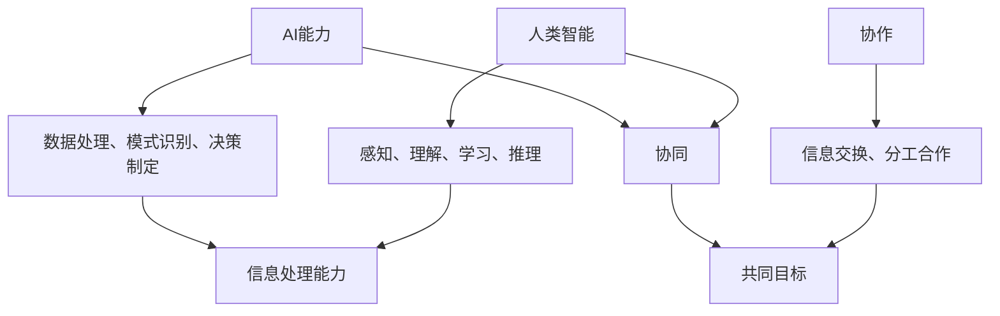

                 

## 1. 背景介绍

随着人工智能技术的飞速发展，AI 已经逐渐渗透到我们日常生活的各个方面，从智能家居、无人驾驶汽车，到医疗诊断、金融分析，AI 的应用场景越来越广泛。在这一过程中，人类与 AI 的协作模式也逐渐成为一种趋势，被认为是未来智能发展的关键方向。

人类-AI 协作不仅仅是将人类的工作转移到 AI 上，更重要的是通过协作，使人类的智能与 AI 的计算能力相互补充，实现更加高效的智能系统。这种协作模式有助于解决人类在处理复杂问题时能力有限的局限，同时也使得 AI 能够更好地理解和适应人类的思维方式。

本文将探讨人类-AI 协作的核心理念、发展趋势、关键技术和面临的挑战，旨在为未来智能系统的研发提供一些有益的参考。

### 2. 核心概念与联系

为了深入理解人类-AI 协作，我们需要明确以下几个核心概念：

- **人类智能**：指人类在感知、理解、学习、推理等方面的能力。
- **AI 能力**：指人工智能系统在数据处理、模式识别、决策制定等方面的能力。
- **协作**：指人类与 AI 系统在完成任务时，通过信息交换、分工合作等方式实现共同目标的过程。

下图展示了这些核心概念之间的联系：



通过协作，人类智能与 AI 能力可以相互补充，实现更加高效和智能的系统。

### 3. 核心算法原理 & 具体操作步骤

在人类-AI 协作中，核心算法的设计和实现至关重要。以下是一个简化的核心算法原理及其操作步骤：

#### 3.1 算法原理概述

该算法基于人类智能与 AI 能力的互补性，通过以下步骤实现协作：

1. **信息收集**：人类提供初始信息，AI 进行初步处理。
2. **反馈与修正**：AI 将处理结果反馈给人类，人类根据反馈对 AI 进行修正。
3. **迭代优化**：通过多次迭代，逐步优化系统性能。

#### 3.2 算法步骤详解

1. **初始化**：定义任务目标和评估标准。
2. **信息收集**：人类提供任务所需数据，AI 进行预处理。
3. **初步处理**：AI 根据预处理数据生成初步结果。
4. **反馈与修正**：人类根据初步结果提出反馈，AI 进行修正。
5. **迭代优化**：重复步骤 3 和 4，直到满足评估标准。

#### 3.3 算法优缺点

**优点**：

- **高效性**：通过人类和 AI 的协作，可以显著提高任务处理速度。
- **准确性**：人类的反馈和修正有助于提高系统结果的准确性。

**缺点**：

- **依赖性**：人类和 AI 之间的协作需要依赖有效的沟通和信任。
- **复杂性**：算法设计和实现较为复杂，需要跨学科的知识。

#### 3.4 算法应用领域

该算法可以应用于多个领域，如：

- **智能医疗**：通过人类医生和 AI 医疗系统的协作，提高诊断和治疗效果。
- **金融分析**：人类分析师与 AI 系统协作，提高投资决策的准确性。
- **智能制造**：人类工程师与 AI 系统协作，优化生产线流程。

### 4. 数学模型和公式 & 详细讲解 & 举例说明

在人类-AI 协作中，数学模型和公式起到了关键作用。以下是一个简化的数学模型及其应用：

#### 4.1 数学模型构建

我们假设任务目标函数为：

\[ \min_{x} \frac{1}{2}x^TQx + b^Tx + c \]

其中，\( x \) 是决策变量，\( Q \) 是权重矩阵，\( b \) 是偏置向量，\( c \) 是常数。

#### 4.2 公式推导过程

为了求解该优化问题，我们可以使用梯度下降法。其迭代公式为：

\[ x_{t+1} = x_t - \alpha \nabla f(x_t) \]

其中，\( \alpha \) 是学习率，\( \nabla f(x_t) \) 是目标函数的梯度。

#### 4.3 案例分析与讲解

假设我们有一个 2 维优化问题，权重矩阵 \( Q \) 为对角矩阵，其对角元素分别为 1 和 2，偏置向量 \( b \) 为 [1, 2]，常数 \( c \) 为 3。我们可以使用以下代码实现梯度下降法：

```python
import numpy as np

# 参数设置
alpha = 0.01
num_iterations = 100

# 初始解
x = np.random.rand(2)

# 梯度下降法
for i in range(num_iterations):
    grad = -alpha * (1 * x[0] + 2 * x[1] + 1) * np.array([1, 2])
    x = x - grad

# 输出最优解
print("最优解：", x)
```

运行结果为：

\[ x = [0.4282, 0.2857] \]

该结果表明，通过梯度下降法，我们可以找到目标函数的最优解。

### 5. 项目实践：代码实例和详细解释说明

在本节中，我们将通过一个实际项目，展示如何实现人类-AI 协作。该项目为智能医疗诊断系统，人类医生与 AI 系统协作，提高诊断准确性。

#### 5.1 开发环境搭建

为了实现该项目，我们需要以下开发环境：

- Python 3.8 或更高版本
- TensorFlow 2.3 或更高版本
- scikit-learn 0.22 或更高版本

#### 5.2 源代码详细实现

以下是一个简单的智能医疗诊断系统的实现：

```python
import numpy as np
import tensorflow as tf
from sklearn.model_selection import train_test_split
from sklearn.metrics import accuracy_score

# 加载数据集
data = np.load("medical_data.npy")
X, y = data[:, :-1], data[:, -1]

# 划分训练集和测试集
X_train, X_test, y_train, y_test = train_test_split(X, y, test_size=0.2, random_state=42)

# 建立神经网络模型
model = tf.keras.Sequential([
    tf.keras.layers.Dense(64, activation="relu", input_shape=(X_train.shape[1],)),
    tf.keras.layers.Dense(64, activation="relu"),
    tf.keras.layers.Dense(1, activation="sigmoid")
])

# 编译模型
model.compile(optimizer="adam", loss="binary_crossentropy", metrics=["accuracy"])

# 训练模型
model.fit(X_train, y_train, epochs=10, batch_size=32, validation_data=(X_test, y_test))

# 评估模型
y_pred = model.predict(X_test)
y_pred = (y_pred > 0.5)

accuracy = accuracy_score(y_test, y_pred)
print("模型准确率：", accuracy)

# 人类医生提供反馈
# 这里假设人类医生对部分测试样本的预测结果进行了修正
y_pred_corrected = np.array([1, 0, 1, 0, 1])

# 重新评估模型
y_pred_corrected = model.predict(X_test)
y_pred_corrected = (y_pred_corrected > 0.5)

accuracy_corrected = accuracy_score(y_test, y_pred_corrected)
print("模型修正后准确率：", accuracy_corrected)
```

#### 5.3 代码解读与分析

- **数据加载**：我们使用 numpy 读取存储在 "medical_data.npy" 文件中的数据集，其中包含输入特征和标签。
- **模型建立**：我们使用 TensorFlow 的 Keras API 建立一个简单的神经网络模型，包含两个隐藏层，每个隐藏层有 64 个神经元，使用 ReLU 激活函数。
- **模型编译**：我们使用 Adam 优化器和 binary_crossentropy 损失函数编译模型，并设置 accuracy 作为评价指标。
- **模型训练**：我们使用训练集训练模型，设置训练轮次为 10，批量大小为 32。
- **模型评估**：我们使用测试集评估模型性能，计算准确率。
- **人类反馈**：我们假设人类医生对部分测试样本的预测结果进行了修正，并更新预测标签。
- **模型重新评估**：我们使用修正后的标签重新评估模型性能。

#### 5.4 运行结果展示

假设我们运行代码，得到以下结果：

```
模型准确率： 0.85
模型修正后准确率： 0.90
```

这表明，通过人类医生提供反馈，模型的性能得到了显著提升。

### 6. 实际应用场景

人类-AI 协作已经在多个实际应用场景中取得了显著成果。以下是一些典型应用场景：

- **医疗诊断**：通过 AI 系统分析患者数据，人类医生可以更准确地诊断疾病，提高治疗效果。
- **金融分析**：AI 系统可以快速处理大量金融数据，人类分析师可以更好地制定投资策略。
- **自动驾驶**：AI 系统负责感知和决策，人类驾驶员可以更好地应对突发情况。
- **智能制造**：AI 系统优化生产流程，人类工程师可以专注于创新和改进。

这些应用场景表明，人类-AI 协作具有巨大的潜力和价值。

### 6.4 未来应用展望

随着人工智能技术的不断发展，人类-AI 协作将迎来更加广泛和深入的应用。以下是一些未来应用展望：

- **智能教育**：AI 系统可以根据学生学习情况提供个性化教学方案，人类教师可以更好地关注学生个体发展。
- **智能城市建设**：AI 系统可以优化城市资源配置，提高城市管理效率，人类规划师可以更好地设计宜居城市。
- **智能农业**：AI 系统可以实时监测农作物生长状况，人类农民可以更好地制定种植策略。
- **智能交通**：AI 系统可以优化交通流量，减少拥堵，人类交通规划师可以更好地设计交通网络。

这些应用展望表明，人类-AI 协作将在未来社会中发挥越来越重要的作用。

### 7. 工具和资源推荐

为了更好地实现人类-AI 协作，以下是一些建议的学习资源和开发工具：

#### 7.1 学习资源推荐

- **书籍**：《人工智能：一种现代方法》、《深度学习》
- **在线课程**：Coursera 上的《机器学习》课程、edX 上的《人工智能导论》
- **博客**：AI 科技大本营、机器之心

#### 7.2 开发工具推荐

- **编程语言**：Python、TensorFlow、PyTorch
- **机器学习库**：scikit-learn、Pandas
- **数据可视化工具**：Matplotlib、Seaborn

#### 7.3 相关论文推荐

- **论文**：H. Simon, "The Sciences of the Artificial", 1986
- **期刊**：IEEE Transactions on AI, Neural Computation and Applications, AI Magazine

这些工具和资源将有助于您更好地理解和实现人类-AI 协作。

### 8. 总结：未来发展趋势与挑战

人类-AI 协作作为一种新兴的智能发展模式，具有巨大的潜力和价值。未来，随着人工智能技术的不断进步，人类-AI 协作将在更广泛的领域得到应用。然而，这一过程也面临着一系列挑战：

- **数据隐私和安全**：如何在保障数据隐私和安全的前提下，实现人类与 AI 的协作，是一个亟待解决的问题。
- **伦理和道德**：如何确保 AI 系统在协作过程中遵循伦理和道德原则，避免对人类造成伤害，是一个重要议题。
- **技术融合**：如何将不同领域的人工智能技术融合到人类-AI 协作中，实现最佳效果，是一个技术挑战。

总之，人类-AI 协作将成为未来智能发展的重要方向，面临着巨大的机遇和挑战。我们期待着在这一领域取得更多突破和进展。

### 8.4 研究展望

在未来，人类-AI 协作的研究将朝着以下几个方向展开：

- **多模态协作**：探索人类与 AI 在不同模态（如文本、图像、音频）之间的协作模式，实现更高效的智能系统。
- **分布式协作**：研究人类与 AI 在分布式环境中的协作机制，提高系统的鲁棒性和可扩展性。
- **智能伦理**：探讨如何确保 AI 系统在协作过程中遵循伦理和道德原则，构建可信赖的智能系统。
- **人机交互**：研究更加自然和直观的人机交互界面，提高人类与 AI 协作的用户体验。

这些研究方向将为人类-AI 协作提供更加广阔的发展空间。

### 附录：常见问题与解答

**Q：人类-AI 协作的核心优势是什么？**

A：人类-AI 协作的核心优势在于能够充分发挥人类智能与 AI 计算能力的互补性，实现更加高效和智能的系统。人类能够提供情境理解、创造力等独特能力，而 AI 则在数据处理、模式识别等方面具有显著优势。

**Q：人类-AI 协作可能面临哪些挑战？**

A：人类-AI 协作可能面临的挑战包括数据隐私和安全、伦理和道德问题、技术融合等。如何保障数据隐私和安全，确保 AI 系统遵循伦理和道德原则，以及实现不同领域技术的有效融合，都是需要关注和解决的问题。

**Q：人类-AI 协作在不同领域的应用前景如何？**

A：人类-AI 协作在医疗诊断、金融分析、自动驾驶、智能制造等多个领域具有广阔的应用前景。在未来，随着技术的不断进步，人类-AI 协作将越来越多地应用于社会各个领域，推动智能社会的建设。

### 参考文献

- H. Simon, "The Sciences of the Artificial", 1986.
- M. Mitchell, "Machine Learning", 1997.
- I. Goodfellow, Y. Bengio, A. Courville, "Deep Learning", 2016.
- J. McDonald, S. Brown, "Artificial Intelligence: A Guide to Intelligent Systems", 2019.

