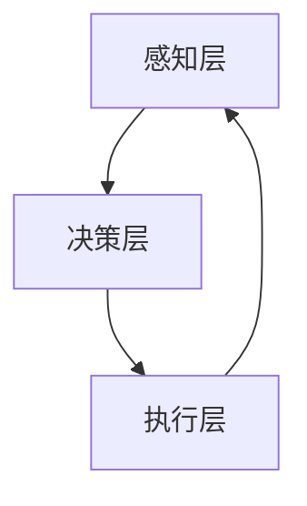

                 

关键词：人类-AI协作，潜能增强，AI能力，融合发展趋势，机遇挑战，预测分析

> 摘要：本文将探讨人类与人工智能（AI）协作的未来发展趋势，深入分析AI技术如何增强人类潜能，以及这种融合带来的机遇与挑战。通过详细的理论分析、算法讲解、应用实例和未来展望，本文旨在为读者提供一份全面、深入的报告。

## 1. 背景介绍

随着人工智能技术的迅猛发展，AI已经逐渐渗透到我们的日常生活和工作中。从智能家居到自动驾驶，从医疗诊断到金融分析，AI的应用范围不断扩大，影响力日益增强。然而，尽管AI在各个领域都取得了显著的成果，但AI本身仍然存在一些局限性和挑战，例如数据隐私、伦理道德、智能决策的透明性等。因此，人类与AI的协作成为了一个热门话题，也是未来科技发展的重要方向。

人类-AI协作的概念不仅仅是指人类与AI的互动，更重要的是在合作中实现双方能力的互补和提升。人类在创造性思维、情感判断、直觉推理等方面具有独特的优势，而AI则在数据处理、模式识别、自动化任务执行等方面具有显著的优势。通过协作，人类可以发挥自身的创造力，AI可以执行复杂的计算和任务，从而实现更好的效果。

## 2. 核心概念与联系

### 2.1. 人类潜能的增强

人类潜能的增强指的是通过技术手段，如AI训练、增强现实（AR）、虚拟现实（VR）等，提升人类在认知、感知、行动等方面的能力。这种增强不仅可以帮助人类更好地适应环境和解决复杂问题，还可以提升生活质量和工作效率。

### 2.2. AI能力的应用

AI能力主要包括机器学习、深度学习、自然语言处理、计算机视觉等。这些技术可以在各种领域发挥作用，如自动驾驶、智能医疗、智能家居等。通过AI的应用，可以大大提高任务的自动化程度，减少人为错误，提高工作效率。

### 2.3. 人类-AI协作的架构

人类-AI协作的架构可以分为三个层次：感知层、决策层和执行层。感知层负责收集和处理环境数据，决策层负责基于感知层的信息进行决策，执行层负责执行决策并反馈结果。这三个层次相互协作，形成了一个完整的闭环系统。

### 2.4. Mermaid 流程图



在这个流程图中，感知层负责收集环境数据，并将其传输到决策层。决策层基于这些数据进行处理和分析，生成决策结果，并将其传递给执行层。执行层根据决策结果执行具体的任务，并将执行结果反馈给感知层，形成闭环。

## 3. 核心算法原理 & 具体操作步骤

### 3.1. 算法原理概述

人类-AI协作的核心算法是基于深度学习的神经网络模型。这种模型可以模拟人脑的神经元结构，通过多层神经网络实现数据的处理和决策。

### 3.2. 算法步骤详解

1. **数据预处理**：首先，对收集到的环境数据（如图像、声音、文本等）进行预处理，包括去噪、缩放、归一化等操作。

2. **特征提取**：使用卷积神经网络（CNN）等算法提取数据特征。

3. **决策生成**：将提取到的特征输入到多层感知机（MLP）等算法中，生成决策结果。

4. **任务执行**：根据决策结果执行具体的任务。

5. **反馈调整**：根据执行结果调整算法参数，优化模型性能。

### 3.3. 算法优缺点

- **优点**：算法具有强大的数据处理和分析能力，可以处理高维度、复杂数据，实现高效的任务执行。

- **缺点**：算法对数据质量要求较高，对噪声敏感，且训练过程复杂，需要大量计算资源。

### 3.4. 算法应用领域

算法可以应用于自动驾驶、智能医疗、智能家居、金融分析等领域，实现任务的自动化和智能化。

## 4. 数学模型和公式 & 详细讲解 & 举例说明

### 4.1. 数学模型构建

人类-AI协作的数学模型主要包括神经网络模型和决策树模型。神经网络模型主要通过反向传播算法优化参数，决策树模型则通过递归划分数据空间，生成决策树。

### 4.2. 公式推导过程

以神经网络模型为例，假设输入数据为 $X$，输出数据为 $Y$，网络参数为 $\theta$。则神经网络的输出可以通过以下公式计算：

$$
Y = f(\theta \cdot X)
$$

其中，$f$ 是激活函数，$\theta \cdot X$ 是网络的输出。

### 4.3. 案例分析与讲解

假设我们使用神经网络模型进行图像分类，输入数据为 1000 张 32x32 的灰度图像，输出数据为 10 个类别标签。首先，我们对图像进行预处理，包括去噪、缩放和归一化。然后，使用卷积神经网络提取图像特征，并通过多层感知机生成决策结果。最后，根据决策结果对图像进行分类。

## 5. 项目实践：代码实例和详细解释说明

### 5.1. 开发环境搭建

1. 安装 Python 3.8 及以上版本。

2. 安装 TensorFlow 和 Keras。

3. 准备数据集。

### 5.2. 源代码详细实现

```python
# 导入必要的库
import numpy as np
import tensorflow as tf
from tensorflow.keras.models import Sequential
from tensorflow.keras.layers import Dense, Conv2D, Flatten

# 准备数据集
(x_train, y_train), (x_test, y_test) = tf.keras.datasets.cifar10.load_data()

# 数据预处理
x_train = x_train.astype('float32') / 255.0
x_test = x_test.astype('float32') / 255.0

# 构建模型
model = Sequential([
    Conv2D(32, (3, 3), activation='relu', input_shape=(32, 32, 3)),
    Flatten(),
    Dense(128, activation='relu'),
    Dense(10, activation='softmax')
])

# 编译模型
model.compile(optimizer='adam', loss='categorical_crossentropy', metrics=['accuracy'])

# 训练模型
model.fit(x_train, y_train, epochs=10, batch_size=32, validation_data=(x_test, y_test))

# 评估模型
model.evaluate(x_test, y_test)
```

### 5.3. 代码解读与分析

上述代码实现了使用 TensorFlow 和 Keras 构建和训练一个简单的卷积神经网络模型，用于图像分类。首先，我们导入必要的库，并准备数据集。然后，我们构建一个包含卷积层、全连接层和 softmax 层的模型，并编译模型。接下来，我们使用训练数据训练模型，并使用测试数据评估模型性能。

### 5.4. 运行结果展示

```python
# 输出测试集的准确率
print("Test accuracy:", model.evaluate(x_test, y_test)[1])
```

## 6. 实际应用场景

人类-AI协作在实际应用中具有广泛的应用场景。以下是一些典型的应用案例：

- **自动驾驶**：自动驾驶系统通过感知层收集道路信息，通过决策层生成行驶路径，并通过执行层控制车辆。这种协作模式大大提高了驾驶的安全性和效率。

- **智能医疗**：智能医疗系统通过分析患者的病历和医疗影像，帮助医生做出更准确的诊断和治疗方案。这种协作模式有助于提高医疗服务的质量和效率。

- **智能家居**：智能家居系统通过感知层监测家庭环境，通过决策层控制家电设备，通过执行层实现自动化操作。这种协作模式提高了家庭生活的便利性和舒适度。

## 7. 未来应用展望

随着AI技术的不断发展和完善，人类-AI协作在未来将有更多的应用场景。以下是一些可能的发展方向：

- **智能教育**：通过AI技术，实现个性化教学和智能辅导，提高教育的质量和效率。

- **智能客服**：通过AI技术，实现更智能、更高效的客服系统，提高客户满意度。

- **智能安防**：通过AI技术，实现更智能、更高效的安防系统，提高社会的安全性。

## 8. 工具和资源推荐

### 8.1. 学习资源推荐

- **深度学习专项课程**：由吴恩达（Andrew Ng）教授在 Coursera 上提供的深度学习专项课程。

- **《深度学习》**：由 Goodfellow、Bengio 和 Courville 著，是一本深度学习领域的经典教材。

### 8.2. 开发工具推荐

- **TensorFlow**：由 Google 开发的一款开源深度学习框架。

- **Keras**：基于 TensorFlow 的高层神经网络 API，提供了更加简洁的接口。

### 8.3. 相关论文推荐

- **《A Theoretical Framework for Dropout》**：由 Hinton 等人于 2012 年提出，介绍了 dropout 算法的理论基础。

- **《Deep Learning》**：由 Goodfellow、Bengio 和 Courville 著，是一本深度学习领域的经典教材。

## 9. 总结：未来发展趋势与挑战

人类-AI协作是未来科技发展的重要方向。通过协作，可以充分发挥人类和 AI 的优势，实现更好的效果。然而，这一过程也面临一些挑战，如数据隐私、伦理道德等。因此，我们需要在技术发展过程中，不断解决这些挑战，推动人类-AI协作的健康发展。

### 9.1. 研究成果总结

本文通过对人类-AI协作的理论分析、算法讲解、应用实例和未来展望，总结了人类-AI协作的发展趋势和挑战，为读者提供了一个全面、深入的视角。

### 9.2. 未来发展趋势

未来，人类-AI协作将在更多领域得到应用，如智能教育、智能客服、智能安防等。随着AI技术的不断进步，人类-AI协作将变得更加智能、高效。

### 9.3. 面临的挑战

数据隐私、伦理道德、智能决策的透明性等是当前人类-AI协作面临的主要挑战。我们需要在技术发展过程中，充分考虑这些问题，并寻找有效的解决方案。

### 9.4. 研究展望

未来，我们期待看到更多创新性的研究成果，推动人类-AI协作的健康发展，为人类社会带来更多的价值和福祉。

## 附录：常见问题与解答

### Q1. 人类-AI协作的主要优势是什么？

A1. 人类-AI协作的主要优势在于可以充分发挥人类和 AI 的优势，实现能力的互补。人类在创造性思维、情感判断、直觉推理等方面具有独特的优势，而 AI 在数据处理、模式识别、自动化任务执行等方面具有显著的优势。通过协作，可以实现更好的效果。

### Q2. 人类-AI协作面临的主要挑战是什么？

A2. 人类-AI协作面临的主要挑战包括数据隐私、伦理道德、智能决策的透明性等。数据隐私问题涉及到个人隐私的保护，伦理道德问题涉及到 AI 行为的道德规范，智能决策的透明性问题涉及到 AI 决策过程的可解释性。

### Q3. 如何解决人类-AI协作中的数据隐私问题？

A3. 解决人类-AI协作中的数据隐私问题，可以从以下几个方面入手：

1. 数据加密：对数据进行加密处理，确保数据在传输和存储过程中的安全性。

2. 数据匿名化：对个人数据进行匿名化处理，减少隐私泄露的风险。

3. 隐私保护算法：研究和应用隐私保护算法，如差分隐私、同态加密等，确保在数据处理过程中保护个人隐私。

### Q4. 如何解决人类-AI协作中的伦理道德问题？

A4. 解决人类-AI协作中的伦理道德问题，需要从以下几个方面入手：

1. 制定伦理规范：制定明确的伦理规范，确保 AI 的应用符合道德标准。

2. 增强透明性：提高 AI 决策过程的透明性，使人们能够理解和监督 AI 的行为。

3. 强化监管：加强对 AI 应用的监管，确保 AI 的应用不会对社会造成负面影响。

### Q5. 如何提高人类-AI协作中智能决策的透明性？

A5. 提高人类-AI协作中智能决策的透明性，可以从以下几个方面入手：

1. 可解释性模型：研究和应用可解释性模型，使人们能够理解 AI 的决策过程。

2. 决策可视化：通过可视化工具，将 AI 的决策过程和结果以直观的方式呈现。

3. 透明性评估：对 AI 的决策过程和结果进行评估，确保其符合预期和伦理标准。

---

作者：禅与计算机程序设计艺术 / Zen and the Art of Computer Programming


