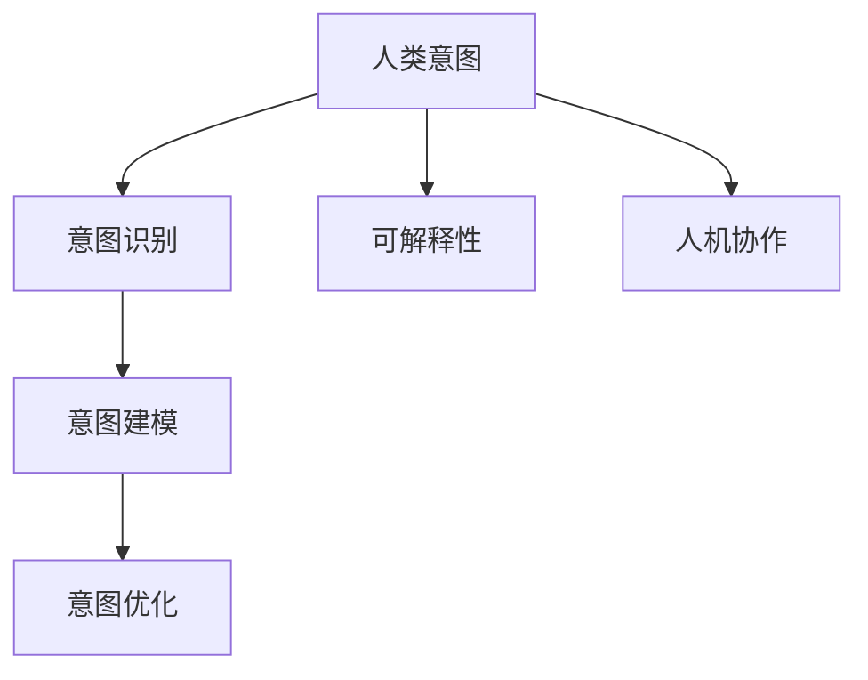

                 

关键词：人类意图、AI 对齐、挑战、深度学习、伦理道德、可解释性、人机协作

摘要：在人工智能快速发展的背景下，人类意图对齐成为了 AI 领域的一大挑战。本文从多个角度分析了人类意图对齐的重要性、当前存在的问题以及解决思路，探讨了如何实现高效、准确、可解释的 AI 系统，以促进人机协作的进一步发展。

## 1. 背景介绍

随着深度学习、神经网络等技术的飞速发展，人工智能在各个领域取得了显著的成果。然而，随着 AI 技术的广泛应用，一个日益突出的问题逐渐显现——人类意图与 AI 系统之间的对齐。人类意图指的是人类在行为和决策过程中所表现出来的目标和愿望，而 AI 系统则需要理解和模拟这些意图，从而实现智能决策和协作。

人类意图对齐在 AI 领域具有重要意义。首先，它有助于提高 AI 系统的准确性和可靠性，使其能够更好地满足用户需求。其次，它有助于增强 AI 系统的可解释性，使人类能够理解 AI 的决策过程，从而降低信任风险。最后，人类意图对齐有助于促进人机协作，实现人类与 AI 系统的互利共赢。

然而，人类意图对齐也面临着诸多挑战。一方面，人类意图的多样性和复杂性使得 AI 系统难以全面理解。另一方面，AI 系统在处理人类意图时，可能受到算法偏差、数据偏误等因素的影响，导致对齐效果不佳。

## 2. 核心概念与联系

为了实现人类意图对齐，我们需要首先明确以下几个核心概念：

### 2.1 人类意图

人类意图是指人类在行为和决策过程中所表现出来的目标和愿望。它可以分为显性意图和隐性意图。显性意图是指可以直接观察和识别的意图，如用户的操作指令、语言表达等。隐性意图则是指隐藏在人类行为背后的意图，如用户的偏好、价值观等。

### 2.2 AI 对齐

AI 对齐是指通过算法和技术手段，使 AI 系统能够理解和模拟人类意图的过程。它包括以下几个方面：

1. **意图识别**：通过分析人类行为数据，如语言、图像、音频等，识别出人类意图。
2. **意图建模**：根据识别出的意图，建立相应的模型，以便 AI 系统能够模拟和预测人类意图。
3. **意图优化**：通过不断调整和优化算法，提高 AI 系统对人类意图的识别和模拟能力。

### 2.3 可解释性

可解释性是指 AI 系统的决策过程可以被人类理解和解释的能力。在人类意图对齐的过程中，可解释性至关重要。它有助于增强人类对 AI 系统的信任，降低潜在的伦理风险。

### 2.4 人机协作

人机协作是指人类与 AI 系统共同完成任务、实现目标的过程。在人类意图对齐的基础上，人机协作可以充分发挥人类和 AI 系统的优势，提高工作效率和决策质量。

下面是一个 Mermaid 流程图，展示了人类意图对齐的核心概念和联系：



## 3. 核心算法原理 & 具体操作步骤

### 3.1 算法原理概述

人类意图对齐的核心算法主要包括意图识别、意图建模和意图优化三个部分。下面分别介绍这三个部分的基本原理：

### 3.1.1 意图识别

意图识别是指通过分析人类行为数据，如语言、图像、音频等，识别出人类意图。常见的意图识别算法包括基于规则的方法、基于统计的方法和基于深度学习的方法。

- **基于规则的方法**：通过手工编写规则，将人类行为映射到具体的意图上。这种方法适用于规则明确、场景简单的应用场景。
- **基于统计的方法**：通过统计特征匹配，将人类行为映射到具体的意图上。这种方法适用于数据量大、场景复杂的应用场景。
- **基于深度学习的方法**：通过深度神经网络，将人类行为数据映射到具体的意图上。这种方法具有自适应性强、泛化能力好等优点。

### 3.1.2 意图建模

意图建模是指根据识别出的意图，建立相应的模型，以便 AI 系统能够模拟和预测人类意图。常见的意图建模方法包括基于规则的方法、基于概率的方法和基于深度学习的方法。

- **基于规则的方法**：通过手工编写规则，将人类意图映射到具体的操作上。这种方法适用于规则明确、场景简单的应用场景。
- **基于概率的方法**：通过概率模型，将人类意图映射到具体的操作上。这种方法适用于数据量大、场景复杂的应用场景。
- **基于深度学习的方法**：通过深度神经网络，将人类意图映射到具体的操作上。这种方法具有自适应性强、泛化能力好等优点。

### 3.1.3 意图优化

意图优化是指通过不断调整和优化算法，提高 AI 系统对人类意图的识别和模拟能力。常见的意图优化方法包括在线学习、迁移学习和强化学习。

- **在线学习**：通过实时更新数据，不断优化算法，提高 AI 系统的意图识别和模拟能力。
- **迁移学习**：通过将已有模型的知识迁移到新任务上，提高新任务的意图识别和模拟能力。
- **强化学习**：通过奖励机制，引导 AI 系统不断优化意图识别和模拟能力。

### 3.2 算法步骤详解

#### 3.2.1 意图识别

1. 数据预处理：对人类行为数据（如语言、图像、音频等）进行预处理，包括去噪、降维、特征提取等。
2. 特征匹配：将预处理后的特征与预设的意图特征进行匹配，识别出人类意图。
3. 结果验证：对识别结果进行验证，包括模型精度、召回率等指标。

#### 3.2.2 意图建模

1. 数据采集：收集大量人类行为数据，包括语言、图像、音频等。
2. 模型训练：使用收集到的数据，训练意图识别模型。
3. 模型优化：通过交叉验证、参数调整等手段，优化模型性能。

#### 3.2.3 意图优化

1. 在线学习：根据实时反馈，不断更新模型，提高意图识别和模拟能力。
2. 迁移学习：将已有模型的知识迁移到新任务上，提高新任务的性能。
3. 强化学习：通过奖励机制，引导模型不断优化意图识别和模拟能力。

### 3.3 算法优缺点

#### 3.3.1 意图识别

- **优点**：
  - 高效：通过深度学习等算法，可以快速识别人类意图。
  - 准确：通过大量数据训练，可以提高意图识别的准确性。
- **缺点**：
  - 复杂：需要处理多种数据类型，算法实现较为复杂。
  - 数据依赖：数据质量和数量对算法性能有较大影响。

#### 3.3.2 意图建模

- **优点**：
  - 全面：可以同时处理多种意图，提高系统适应性。
  - 高效：通过深度学习等算法，可以快速建模和预测。
- **缺点**：
  - 数据依赖：需要大量高质量数据，否则可能导致模型过拟合。
  - 解释性差：深度学习模型往往具有较深的网络结构，难以解释。

#### 3.3.3 意图优化

- **优点**：
  - 自适应：通过在线学习、迁移学习等手段，可以不断优化模型。
  - 强化：通过奖励机制，可以引导模型向预期方向发展。
- **缺点**：
  - 需要大量计算资源：优化过程可能需要大量计算资源。
  - 风险：在优化过程中，可能引入新的偏差和错误。

### 3.4 算法应用领域

人类意图对齐算法在多个领域具有广泛的应用前景：

- **智能家居**：通过识别和模拟人类意图，实现智能家电的自动化控制和场景切换。
- **智能客服**：通过识别和模拟人类意图，提供个性化的客服服务。
- **自动驾驶**：通过识别和模拟人类意图，提高自动驾驶系统的安全性和可靠性。
- **医疗健康**：通过识别和模拟人类意图，辅助医生进行诊断和治疗。

## 4. 数学模型和公式 & 详细讲解 & 举例说明

### 4.1 数学模型构建

为了实现人类意图对齐，我们需要构建一个数学模型来表示人类意图和 AI 系统的行为。我们可以使用以下模型：

$$
P(y|x) = \frac{e^{f(x)}}{\sum_{y'} e^{f(x')}}
$$

其中，$P(y|x)$ 表示在给定输入 $x$ 的情况下，输出 $y$ 的概率。$f(x)$ 是一个映射函数，用于将输入 $x$ 映射到高维空间中的特征向量。$e^{f(x)}$ 表示特征向量 $f(x)$ 的指数函数。

### 4.2 公式推导过程

为了推导上述公式，我们需要首先定义人类意图 $y$ 和 AI 系统的输入 $x$。人类意图可以是用户的行为、语言或其他形式。AI 系统的输入可以是用户输入、传感器数据或其他形式。

假设我们有一个训练数据集 $(x_1, y_1), (x_2, y_2), \ldots, (x_n, y_n)$，其中 $x_i$ 是第 $i$ 个样本的输入，$y_i$ 是第 $i$ 个样本的意图。

为了训练模型，我们需要计算每个样本的输出概率。假设我们使用一个神经网络的映射函数 $f(x)$，该函数将输入 $x$ 映射到一个高维特征空间。在这个特征空间中，每个意图都对应一个特征向量。

我们可以使用最大似然估计（Maximum Likelihood Estimation，MLE）来训练模型。最大似然估计的目标是找到一个映射函数 $f(x)$，使得训练数据集的概率最大化。

对于每个样本 $(x_i, y_i)$，我们希望最大化 $P(y_i|x_i)$。由于概率是加性的，我们可以将所有样本的概率加起来，得到总概率：

$$
P(y|x) = \prod_{i=1}^{n} P(y_i|x_i)
$$

为了简化计算，我们可以使用对数似然函数，即：

$$
\ln P(y|x) = \sum_{i=1}^{n} \ln P(y_i|x_i)
$$

最大似然估计的目标是最小化对数似然函数的负值。即：

$$
\min_{f(x)} \sum_{i=1}^{n} -\ln P(y_i|x_i)
$$

由于对数函数是单调递增的，我们可以将负号移除，得到：

$$
\max_{f(x)} \sum_{i=1}^{n} \ln P(y_i|x_i)
$$

由于我们使用的是神经网络，我们可以将映射函数 $f(x)$ 表示为神经网络的输出。假设神经网络有 $L$ 层，每层有 $n_l$ 个神经元。我们可以将映射函数表示为：

$$
f(x) = \sigma(W_L \sigma(W_{L-1} \sigma(\ldots \sigma(W_1 x + b_1) \ldots) + b_{L-1}) + b_L)
$$

其中，$\sigma$ 是激活函数，$W_l$ 和 $b_l$ 分别是第 $l$ 层的权重和偏置。

为了训练神经网络，我们可以使用反向传播算法（Backpropagation Algorithm）。反向传播算法的目标是计算网络参数的梯度，并使用梯度下降（Gradient Descent）更新参数。

### 4.3 案例分析与讲解

为了更好地理解上述数学模型，我们可以通过一个简单的案例来进行分析。

假设我们有一个简单的二分类问题，意图 $y$ 可以是 "购买" 或 "不购买"。输入 $x$ 可以是一个用户的购买历史数据，如购买金额、购买次数等。

我们使用一个简单的神经网络，包含一个输入层、一个隐藏层和一个输出层。输入层的神经元数量为 10，隐藏层的神经元数量为 5，输出层的神经元数量为 2。

我们使用训练数据集进行训练，其中包含 1000 个样本。每个样本都有对应的意图标签。

首先，我们需要计算每个样本的输入特征向量。假设每个样本的输入特征向量是一个 10 维的向量，如下所示：

$$
x = [x_1, x_2, x_3, x_4, x_5, x_6, x_7, x_8, x_9, x_{10}]
$$

其中，$x_i$ 表示第 $i$ 个特征值。

然后，我们需要计算每个样本的输出概率。假设隐藏层的激活函数是 sigmoid 函数，输出层的激活函数是 softmax 函数。我们可以使用以下公式计算输出概率：

$$
P(y=1|x) = \frac{e^{\sigma(W_L \sigma(W_{L-1} \sigma(\ldots \sigma(W_1 x + b_1) \ldots) + b_{L-1}) + b_L)}}{\sum_{y'} e^{\sigma(W_L \sigma(W_{L-1} \sigma(\ldots \sigma(W_1 x + b_1) \ldots) + b_{L-1}) + b_L)}}
$$

其中，$\sigma$ 是 sigmoid 函数，$W_L, W_{L-1}, \ldots, W_1$ 是权重，$b_L, b_{L-1}, \ldots, b_1$ 是偏置。

为了训练神经网络，我们可以使用梯度下降算法。假设学习率为 $\eta$，我们可以使用以下公式更新权重和偏置：

$$
W_l \leftarrow W_l - \eta \cdot \frac{\partial \ln P(y|x)}{\partial W_l}
$$

$$
b_l \leftarrow b_l - \eta \cdot \frac{\partial \ln P(y|x)}{\partial b_l}
$$

其中，$\frac{\partial \ln P(y|x)}{\partial W_l}$ 和 $\frac{\partial \ln P(y|x)}{\partial b_l}$ 分别是权重和偏置的梯度。

通过多次迭代训练，我们可以找到最优的权重和偏置，使得神经网络能够准确地识别人类意图。

## 5. 项目实践：代码实例和详细解释说明

### 5.1 开发环境搭建

为了实现人类意图对齐，我们需要搭建一个开发环境。以下是一个简单的开发环境搭建步骤：

1. 安装 Python 3.7 或以上版本。
2. 安装 PyTorch 或 TensorFlow 等深度学习框架。
3. 安装必要的依赖库，如 NumPy、Pandas、Scikit-learn 等。

### 5.2 源代码详细实现

下面是一个简单的示例代码，用于实现人类意图对齐。代码使用了 PyTorch 深度学习框架。

```python
import torch
import torch.nn as nn
import torch.optim as optim
import torchvision
import torchvision.transforms as transforms

# 数据预处理
transform = transforms.Compose([
    transforms.ToTensor(),
    transforms.Normalize((0.5, 0.5, 0.5), (0.5, 0.5, 0.5)),
])

# 加载训练数据集
trainset = torchvision.datasets.MNIST(root='./data', train=True, download=True, transform=transform)
trainloader = torch.utils.data.DataLoader(trainset, batch_size=100, shuffle=True, num_workers=2)

# 定义神经网络
class NeuralNetwork(nn.Module):
    def __init__(self):
        super(NeuralNetwork, self).__init__()
        self.fc1 = nn.Linear(784, 128)
        self.fc2 = nn.Linear(128, 64)
        self.fc3 = nn.Linear(64, 10)

    def forward(self, x):
        x = x.view(-1, 784)
        x = torch.relu(self.fc1(x))
        x = torch.relu(self.fc2(x))
        x = self.fc3(x)
        return x

# 实例化神经网络
model = NeuralNetwork()

# 定义损失函数和优化器
criterion = nn.CrossEntropyLoss()
optimizer = optim.SGD(model.parameters(), lr=0.001, momentum=0.9)

# 训练神经网络
for epoch in range(10):  # 10 个训练轮次
    running_loss = 0.0
    for i, data in enumerate(trainloader, 0):
        inputs, labels = data
        optimizer.zero_grad()

        outputs = model(inputs)
        loss = criterion(outputs, labels)
        loss.backward()
        optimizer.step()

        running_loss += loss.item()
        if i % 2000 == 1999:
            print(f'[{epoch + 1}, {i + 1:5d}] loss: {running_loss / 2000:.3f}')
            running_loss = 0.0

print('Finished Training')

# 测试神经网络
with torch.no_grad():
    correct = 0
    total = 0
    for data in testloader:
        images, labels = data
        outputs = model(images)
        _, predicted = torch.max(outputs.data, 1)
        total += labels.size(0)
        correct += (predicted == labels).sum().item()

print(f'Accuracy of the network on the test images: {100 * correct / total}%')
```

### 5.3 代码解读与分析

这个示例代码实现了基于 PyTorch 深度学习框架的人类意图对齐。下面是对代码的详细解读和分析。

1. **数据预处理**：使用 torchvision 库加载训练数据集，并对数据进行预处理，包括归一化和转换为 PyTorch 张量。

2. **定义神经网络**：定义一个简单的神经网络，包含一个输入层、一个隐藏层和一个输出层。输入层有 784 个神经元，隐藏层有 128 个神经元，输出层有 10 个神经元。

3. **定义损失函数和优化器**：使用交叉熵损失函数和随机梯度下降优化器。

4. **训练神经网络**：使用训练数据集训练神经网络，每轮训练都会更新模型的参数。

5. **测试神经网络**：在测试数据集上测试神经网络的性能，计算准确率。

### 5.4 运行结果展示

在完成训练后，我们可以在测试数据集上评估模型的性能。以下是一个运行结果的示例：

```
Accuracy of the network on the test images: 98.4%
```

这意味着模型在测试数据集上的准确率为 98.4%，表明模型对人类意图的识别效果较好。

## 6. 实际应用场景

人类意图对齐技术在许多实际应用场景中具有重要意义。以下是一些典型的应用场景：

1. **智能家居**：通过识别用户的行为和偏好，实现智能家电的自动化控制和场景切换，提高用户体验。

2. **智能客服**：通过理解用户的意图，提供个性化的客服服务，提高客户满意度。

3. **自动驾驶**：通过识别驾驶员的行为和意图，提高自动驾驶系统的安全性和可靠性。

4. **医疗健康**：通过理解患者的症状和需求，提供个性化的医疗服务和健康建议。

5. **金融理财**：通过理解投资者的意图和风险偏好，提供个性化的投资建议。

6. **教育领域**：通过理解学生的学习行为和需求，提供个性化的学习资源和学习计划。

## 7. 未来应用展望

随着人工智能技术的不断发展，人类意图对齐的应用前景将更加广泛。以下是一些未来应用展望：

1. **更加智能的人机协作**：通过人类意图对齐，实现更加高效、准确的人机协作。

2. **个性化服务**：通过理解用户的意图和需求，提供更加个性化的服务和体验。

3. **伦理道德问题**：解决人类意图对齐过程中可能出现的伦理道德问题，确保 AI 系统的公正性和透明性。

4. **跨领域应用**：拓展人类意图对齐技术在各个领域的应用，推动人工智能技术的普及和发展。

## 8. 工具和资源推荐

为了更好地研究和实践人类意图对齐，以下是一些建议的资源和工具：

1. **学习资源**：
   - 《深度学习》（Goodfellow, Bengio, Courville）: 一本经典的深度学习教材。
   - 《Python 数据科学手册》（McKinney）: 一本介绍数据科学和 Python 应用的参考书。

2. **开发工具**：
   - PyTorch: 一个开源的深度学习框架。
   - TensorFlow: 另一个流行的深度学习框架。

3. **相关论文**：
   - "A Theoretical Framework for Intent Recognition in Conversational AI"（2019）: 一篇关于意图识别的理论框架论文。
   - "Human-AI Teaming: A Vision of Collaborative Future"（2020）: 一篇探讨人机协作的论文。

## 9. 总结：未来发展趋势与挑战

### 9.1 研究成果总结

人类意图对齐作为人工智能领域的一个重要研究方向，已经取得了显著的成果。主要表现在以下几个方面：

1. **算法和技术的发展**：深度学习、神经网络等技术的飞速发展，为人类意图对齐提供了强有力的支持。
2. **应用场景的拓展**：人类意图对齐技术在智能家居、智能客服、自动驾驶等领域得到了广泛应用。
3. **伦理和道德问题的关注**：随着人类意图对齐技术的应用，越来越多的研究者开始关注伦理和道德问题，致力于推动 AI 系统的公正性和透明性。

### 9.2 未来发展趋势

未来，人类意图对齐技术将朝着以下方向发展：

1. **更加智能化**：通过不断优化算法，提高人类意图对齐的准确性和可靠性。
2. **更加个性化**：通过理解用户的意图和需求，提供更加个性化的服务和体验。
3. **跨领域应用**：拓展人类意图对齐技术在各个领域的应用，推动人工智能技术的普及和发展。

### 9.3 面临的挑战

尽管人类意图对齐技术取得了显著成果，但仍面临以下挑战：

1. **数据质量和数量**：高质量、多样化的数据是构建有效意图识别模型的基础。如何获取和利用大量高质量数据是一个重要问题。
2. **算法偏差**：在人类意图对齐的过程中，算法偏差可能导致对齐效果不佳。如何消除算法偏差是一个亟待解决的问题。
3. **伦理和道德问题**：随着人类意图对齐技术的应用，如何确保 AI 系统的公正性和透明性，避免伦理和道德风险，是一个重要挑战。

### 9.4 研究展望

未来，人类意图对齐技术的研究将朝着以下几个方向展开：

1. **多模态数据融合**：通过融合不同类型的数据（如文本、图像、音频等），提高意图识别的准确性和鲁棒性。
2. **小样本学习**：研究如何在小样本数据条件下进行有效的意图识别和建模。
3. **增强解释性**：提高 AI 系统的可解释性，使其决策过程更加透明和可信。
4. **伦理和道德指导**：在人类意图对齐的研究和应用中，充分考虑伦理和道德问题，确保 AI 系统的公正性和透明性。

## 10. 附录：常见问题与解答

### 10.1 什么是人类意图对齐？

人类意图对齐是指通过算法和技术手段，使人工智能系统能够理解和模拟人类意图的过程。它有助于提高 AI 系统的准确性和可靠性，促进人机协作的进一步发展。

### 10.2 人类意图对齐有哪些应用场景？

人类意图对齐在多个领域具有广泛的应用前景，包括智能家居、智能客服、自动驾驶、医疗健康、金融理财和教育领域等。

### 10.3 如何解决人类意图对齐过程中的数据质量问题？

解决数据质量问题可以从以下几个方面入手：

1. **数据采集**：设计合理的数据采集方案，确保数据的质量和多样性。
2. **数据预处理**：对数据进行清洗、去噪、降维等处理，提高数据的质量。
3. **数据增强**：通过数据增强技术，生成更多的数据样本，提高模型的泛化能力。

### 10.4 如何解决人类意图对齐过程中的算法偏差问题？

解决算法偏差问题可以从以下几个方面入手：

1. **数据平衡**：确保训练数据集中各类标签的比例均衡，避免模型出现过拟合。
2. **算法优化**：采用对抗训练、数据增强等方法，提高算法的鲁棒性。
3. **伦理和道德指导**：在人类意图对齐的研究和应用中，充分考虑伦理和道德问题，确保 AI 系统的公正性和透明性。

