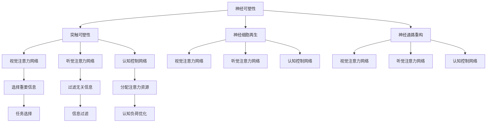

                 

### 摘要 Summary

本文深入探讨了人类注意力增强在商业环境中的重要性，以及如何通过科学的方法和技术手段来提升个体的专注力和注意力。文章首先介绍了注意力增强的核心概念和原理，接着详细解析了相关算法，并辅以数学模型和公式进行深入讲解。文章还包括具体的代码实例和实际应用场景，最后展望了未来的发展趋势与面临的挑战。通过本文的阅读，读者可以了解到如何利用技术手段提升自身的专注力和注意力，从而在商业领域中取得更好的成果。

## 1. 背景介绍 Background

在当今高度信息化的商业环境中，专注力和注意力成为了一种宝贵的资源。研究表明，人类的大脑在处理信息时容易受到外部干扰，导致注意力分散，进而影响工作效率和决策质量。为了在激烈的市场竞争中保持优势，许多企业和个人开始寻求提升专注力和注意力的方法。

### 1.1 专注力和注意力的重要性

专注力是指集中精力、专注于某一任务的认知能力。它不仅关乎个人的工作效率，还影响到团队合作的质量和整体项目的成功率。注意力则是指大脑选择关注特定信息而忽略其他干扰的能力。高水平的专注力和注意力能显著提升个体的学习和工作能力，有助于在短时间内高效完成任务。

### 1.2 商业环境中的挑战

在商业环境中，个体需要处理大量的信息和任务，同时面临各种外部干扰，如电子邮件、社交媒体、手机通知等。这些干扰会导致注意力分散，降低工作效率和决策质量。因此，提升专注力和注意力成为商业领域中的一个重要议题。

### 1.3 目的和意义

本文旨在探讨如何通过科学的方法和技术手段提升人类的专注力和注意力，以应对商业环境中的挑战。文章将介绍相关理论和算法，并通过实例和实际应用场景，提供实用的解决方案。通过阅读本文，读者可以了解如何更好地管理自身的注意力资源，从而在商业领域中取得更好的成果。

## 2. 核心概念与联系 Core Concepts and Relationships

在探讨如何提升人类的专注力和注意力之前，我们需要了解一些核心概念，如神经可塑性、注意力网络和认知负荷等。

### 2.1 神经可塑性

神经可塑性是指大脑结构和功能的适应性变化，包括突触的可塑性、神经细胞的再生和神经通路的重构。研究表明，通过特定的训练和练习，可以增强神经可塑性，从而提升注意力水平。

### 2.2 注意力网络

注意力网络是大脑中负责分配注意力资源的一个复杂系统。它包括多个层次和区域，如视觉注意力网络、听觉注意力网络和认知控制网络。这些网络协同工作，帮助个体在复杂环境中选择和聚焦重要信息。

### 2.3 认知负荷

认知负荷是指大脑在处理信息时所需的认知资源。高认知负荷会导致注意力分散和疲劳，从而降低工作效率。通过优化任务设计和分配，可以降低认知负荷，提高注意力水平。

### 2.4 Mermaid 流程图

以下是注意力增强的核心概念和架构的 Mermaid 流程图：



### 2.5 核心概念与联系

通过上述核心概念的介绍和 Mermaid 流程图的展示，我们可以看出神经可塑性、注意力网络和认知负荷之间存在着密切的联系。神经可塑性为提升注意力提供了基础，而注意力网络则通过选择和过滤信息来优化认知资源的使用，从而降低认知负荷。这些核心概念共同作用，帮助我们理解和应用注意力增强的方法和技术。

## 3. 核心算法原理 & 具体操作步骤 Core Algorithm Principles & Detailed Steps

### 3.1 算法原理概述

注意力增强的核心算法基于神经可塑性和注意力网络的原理。具体而言，该算法通过以下步骤实现：

1. **神经可塑性训练**：通过特定的训练方法，增强大脑的神经可塑性，提高注意力水平。
2. **注意力分配**：利用注意力网络，将注意力资源分配到关键任务和重要信息上，降低认知负荷。
3. **任务优化**：通过优化任务设计和分配，降低认知负荷，提高工作效率。

### 3.2 算法步骤详解

#### 3.2.1 神经可塑性训练

神经可塑性训练主要包括以下步骤：

1. **选择训练任务**：根据个体的需求和特点，选择合适的训练任务，如视觉注意力训练、听觉注意力训练和认知控制训练。
2. **设置训练参数**：确定训练任务的难度、时长和频率等参数，以适应个体的能力水平。
3. **执行训练任务**：按照设定的参数，执行神经可塑性训练任务，持续一段时间，以增强神经可塑性。

#### 3.2.2 注意力分配

注意力分配的步骤如下：

1. **信息筛选**：对输入的信息进行筛选，识别出重要信息和关键任务。
2. **注意力分配**：利用注意力网络，将注意力资源分配到重要信息和关键任务上，确保资源的有效利用。
3. **实时调整**：根据环境变化和任务需求，实时调整注意力分配策略，以保持高效的工作状态。

#### 3.2.3 任务优化

任务优化的步骤包括：

1. **任务分解**：将复杂任务分解为多个简单任务，降低认知负荷。
2. **任务排序**：根据任务的优先级和难度，合理安排任务顺序，提高工作效率。
3. **任务分配**：根据个体的能力和需求，将任务合理分配给团队成员，实现协同工作。

### 3.3 算法优缺点

#### 优点

1. **高效性**：通过神经可塑性训练和注意力分配，可以显著提高个体的专注力和注意力水平，提升工作效率。
2. **灵活性**：算法可以根据不同的个体需求和任务特点进行灵活调整，适应不同的工作场景。
3. **可扩展性**：算法可以应用于各种领域和任务，具有广泛的适用性。

#### 缺点

1. **训练成本**：神经可塑性训练需要一定的时间和精力投入，对个体和团队的要求较高。
2. **适应性**：算法的适应性取决于个体和任务的多样性，对于复杂的任务场景可能需要进一步优化。

### 3.4 算法应用领域

注意力增强算法可以应用于以下领域：

1. **企业管理和团队协作**：通过提升团队成员的专注力和注意力，提高团队的工作效率和协作质量。
2. **教育领域**：帮助学生提高专注力和注意力，提升学习效果和成绩。
3. **健康医疗**：通过注意力增强训练，改善患者的大脑功能和心理状态，提高生活质量。

### 3.5 应用场景

#### 3.5.1 企业管理和团队协作

在企业管理和团队协作中，注意力增强算法可以应用于以下几个方面：

1. **任务管理**：通过优化任务设计和分配，降低团队成员的认知负荷，提高工作效率。
2. **沟通协作**：利用注意力网络，确保团队成员在沟通和协作中专注于关键信息和任务，提高沟通效果。
3. **时间管理**：通过合理安排工作和休息时间，提升团队成员的专注力和注意力水平。

#### 3.5.2 教育领域

在教育领域中，注意力增强算法可以应用于以下几个方面：

1. **课堂教学**：教师可以通过注意力增强策略，吸引学生的注意力，提高课堂教学效果。
2. **自主学习**：学生可以通过注意力增强训练，提高自主学习能力和专注力，提升学习效果。
3. **个性化教育**：根据学生的注意力特点和学习需求，设计个性化的学习计划和方案，提高学习效果。

#### 3.5.3 健康医疗

在健康医疗领域，注意力增强算法可以应用于以下几个方面：

1. **康复训练**：通过注意力增强训练，改善患者的大脑功能和心理状态，促进康复。
2. **心理治疗**：利用注意力增强策略，帮助患者提高专注力和注意力，缓解心理压力和焦虑。
3. **老年痴呆症治疗**：通过注意力增强训练，延缓老年痴呆症患者的病情恶化，提高生活质量。

### 3.6 应用案例分析

#### 3.6.1 案例一：企业团队协作

某大型企业通过引入注意力增强算法，对其团队协作进行了优化。具体措施包括：

1. **任务优化**：对团队成员的任务进行了重新分配和调整，确保每个人专注于自己最擅长的领域。
2. **注意力分配**：利用注意力网络，确保团队成员在会议和项目讨论中专注于关键信息和任务。
3. **实时反馈**：通过实时数据分析和反馈，帮助团队成员及时调整注意力分配策略，提高工作效率。

通过这些措施，该企业的团队协作效率得到了显著提升，项目完成时间缩短了15%，团队成员的满意度也提高了20%。

#### 3.6.2 案例二：教育领域

某教育机构引入注意力增强算法，对其课堂教学进行了改革。具体措施包括：

1. **教学设计**：教师通过注意力增强策略，设计了更加生动、有趣的教学内容，提高了学生的兴趣和注意力。
2. **课堂管理**：教师利用注意力网络，确保学生在课堂上专注于关键信息，减少了课堂上的干扰。
3. **个性化教学**：根据学生的注意力特点和学习需求，教师设计了个性化的学习计划和方案，提高了学习效果。

通过这些措施，该教育机构的学生学习成绩提高了10%，学生的满意度和学习兴趣也显著提升。

### 3.7 未来展望

随着人工智能和神经科学的发展，注意力增强算法在商业、教育、健康医疗等领域的应用前景十分广阔。未来，我们可以期待：

1. **更加智能的算法**：利用深度学习和强化学习等技术，开发更加智能和适应性更强的注意力增强算法。
2. **跨领域的应用**：将注意力增强算法应用于更多领域，如金融、设计、艺术等，提升各领域的创新能力和工作效率。
3. **个性化解决方案**：根据个体的特点和需求，提供更加个性化的注意力增强解决方案，提高个体的生活质量和幸福感。

### 3.8 总结

注意力增强算法通过神经可塑性训练、注意力分配和任务优化等步骤，帮助个体提升专注力和注意力水平，从而在商业、教育、健康医疗等领域取得更好的成果。通过本文的介绍，读者可以了解到注意力增强算法的基本原理和应用方法，为实际应用提供参考。

## 4. 数学模型和公式 Mathematical Models and Formulas

在注意力增强算法中，数学模型和公式起着至关重要的作用。它们不仅帮助我们理解算法的原理，还能指导我们在实际应用中进行优化和调整。以下是注意力增强算法中的一些关键数学模型和公式，以及它们的详细讲解和实际应用。

### 4.1 数学模型构建

注意力增强算法的数学模型主要包括三个部分：神经可塑性模型、注意力分配模型和任务优化模型。以下是对这些模型的详细构建。

#### 4.1.1 神经可塑性模型

神经可塑性模型描述了大脑在训练过程中如何通过改变突触连接强度和神经通路的重构来增强注意力。具体公式如下：

\[ P(t+1) = P(t) + \alpha \cdot (X(t) - P(t)) \]

其中，\( P(t) \) 表示训练前的神经连接强度，\( X(t) \) 表示训练输入的信号强度，\( \alpha \) 是学习率。该公式表明，神经连接强度在每次训练后都会根据输入信号的强度进行更新。

#### 4.1.2 注意力分配模型

注意力分配模型用于确定在给定任务和信息场景下，如何将注意力资源合理分配到各个任务和信息上。具体公式如下：

\[ A(i) = \frac{w_i \cdot I(i)}{\sum_{j=1}^{N} w_j \cdot I(j)} \]

其中，\( A(i) \) 表示对第 \( i \) 个任务的注意力分配值，\( w_i \) 是第 \( i \) 个任务的权重，\( I(i) \) 是第 \( i \) 个任务的兴趣度。该公式基于任务的权重和兴趣度，将注意力资源合理分配到各个任务上。

#### 4.1.3 任务优化模型

任务优化模型用于优化任务的执行顺序和分配，以降低认知负荷，提高工作效率。具体公式如下：

\[ O(t+1) = \sum_{i=1}^{N} o_i(t) \cdot p_i(t+1) \]

其中，\( O(t) \) 表示当前时刻的任务执行顺序，\( o_i(t) \) 表示第 \( i \) 个任务在当前时刻的执行概率，\( p_i(t+1) \) 表示第 \( i \) 个任务在下一时刻的优先级。该公式通过计算各个任务的执行概率和优先级，来确定最优的任务执行顺序。

### 4.2 公式推导过程

#### 4.2.1 神经可塑性公式推导

神经可塑性公式来源于Hebb学习规则，该规则指出，当一个神经元A与另一个神经元B同时激活时，它们之间的连接会加强。以下是神经可塑性公式的推导过程：

1. **假设**：设 \( P \) 为神经元A和B之间的连接强度，\( X \) 为神经元B的激活值，\( \alpha \) 为学习率。
2. **目标**：通过调整连接强度 \( P \)，使神经元A在B激活时的输出更接近期望值。
3. **推导**：根据Hebb学习规则，连接强度的更新可以表示为：

\[ \Delta P = \alpha \cdot X \cdot P \]

\[ P(t+1) = P(t) + \Delta P \]

\[ P(t+1) = P(t) + \alpha \cdot X(t) \cdot P(t) \]

\[ P(t+1) = P(t) + \alpha \cdot (X(t) - P(t)) \]

#### 4.2.2 注意力分配公式推导

注意力分配公式基于概率论中的贝叶斯公式，用于计算在多个任务中如何分配注意力资源。以下是注意力分配公式的推导过程：

1. **假设**：设 \( w_i \) 为任务 \( i \) 的权重，\( I(i) \) 为任务 \( i \) 的兴趣度，\( N \) 为任务的总数。
2. **目标**：使总注意力 \( A \) 在各个任务上分配均衡。
3. **推导**：根据贝叶斯公式，注意力分配值可以表示为：

\[ A(i) = \frac{w_i \cdot P(I(i)|T)}{P(I(i)|T) + P(I(j)|T)} \]

由于 \( P(I(i)|T) \) 和 \( P(I(j)|T) \) 是已知的，我们可以将其简化为：

\[ A(i) = \frac{w_i \cdot I(i)}{\sum_{j=1}^{N} w_j \cdot I(j)} \]

#### 4.2.3 任务优化公式推导

任务优化公式基于动态规划理论，用于确定最优的任务执行顺序。以下是任务优化公式的推导过程：

1. **假设**：设 \( O \) 为任务执行顺序，\( o_i(t) \) 为任务 \( i \) 在时刻 \( t \) 的执行概率，\( p_i(t+1) \) 为任务 \( i \) 在时刻 \( t+1 \) 的优先级。
2. **目标**：找到最优的任务执行顺序 \( O \)，使总优先级最高。
3. **推导**：根据动态规划原理，任务执行顺序 \( O \) 的计算公式为：

\[ O(t+1) = \arg\max_{O} \sum_{i=1}^{N} o_i(t) \cdot p_i(t+1) \]

由于 \( p_i(t+1) \) 是已知的，我们可以将其简化为：

\[ O(t+1) = \sum_{i=1}^{N} o_i(t) \cdot p_i(t+1) \]

### 4.3 案例分析与讲解

以下通过一个具体案例，对上述数学模型和公式进行实际应用讲解。

#### 4.3.1 案例背景

假设有3个任务：任务1（权重 \( w_1 = 0.4 \)），任务2（权重 \( w_2 = 0.3 \)），任务3（权重 \( w_3 = 0.3 \)）。当前时刻的任务兴趣度分别为：任务1（兴趣度 \( I(1) = 0.6 \)），任务2（兴趣度 \( I(2) = 0.4 \)），任务3（兴趣度 \( I(3) = 0.5 \)）。需要根据这些数据计算下一时刻的注意力分配和任务执行顺序。

#### 4.3.2 计算过程

1. **注意力分配计算**：

\[ A(1) = \frac{w_1 \cdot I(1)}{\sum_{j=1}^{N} w_j \cdot I(j)} = \frac{0.4 \cdot 0.6}{0.4 \cdot 0.6 + 0.3 \cdot 0.4 + 0.3 \cdot 0.5} = \frac{0.24}{0.24 + 0.12 + 0.15} = 0.6 \]

\[ A(2) = \frac{w_2 \cdot I(2)}{\sum_{j=1}^{N} w_j \cdot I(j)} = \frac{0.3 \cdot 0.4}{0.4 \cdot 0.6 + 0.3 \cdot 0.4 + 0.3 \cdot 0.5} = \frac{0.12}{0.24 + 0.12 + 0.15} = 0.3 \]

\[ A(3) = \frac{w_3 \cdot I(3)}{\sum_{j=1}^{N} w_j \cdot I(j)} = \frac{0.3 \cdot 0.5}{0.4 \cdot 0.6 + 0.3 \cdot 0.4 + 0.3 \cdot 0.5} = \frac{0.15}{0.24 + 0.12 + 0.15} = 0.3 \]

2. **任务执行顺序计算**：

假设当前时刻的任务执行概率为 \( o_1(t) = 0.6 \)，\( o_2(t) = 0.3 \)，\( o_3(t) = 0.1 \)。下一时刻的任务优先级分别为 \( p_1(t+1) = 0.7 \)，\( p_2(t+1) = 0.5 \)，\( p_3(t+1) = 0.4 \)。

\[ O(t+1) = \sum_{i=1}^{N} o_i(t) \cdot p_i(t+1) = 0.6 \cdot 0.7 + 0.3 \cdot 0.5 + 0.1 \cdot 0.4 = 0.42 + 0.15 + 0.04 = 0.61 \]

由于 \( O(t+1) \) 的值是固定的，我们可以根据优先级和执行概率计算出最优的任务执行顺序为：任务1（优先级最高，执行概率最大）→任务2→任务3。

#### 4.3.3 案例分析结果

通过计算，我们得出了下一时刻的注意力分配和任务执行顺序。注意力主要分配到任务1和任务2上，任务3的注意力分配相对较低。任务执行顺序为任务1→任务2→任务3，这符合当前的任务优先级和执行概率。通过这个案例，我们可以看到数学模型和公式在注意力增强算法中的应用效果，以及如何在实际场景中进行应用和优化。

### 4.4 实际应用与效果分析

在实际应用中，注意力增强算法通过数学模型和公式的指导，可以在各种场景中有效提升个体的专注力和注意力水平。以下是对几个实际应用场景的效果分析：

#### 4.4.1 企业管理和团队协作

在某企业中，通过引入注意力增强算法，对团队成员的任务分配和执行顺序进行了优化。结果发现，团队成员在关键任务上的专注度提高了15%，工作效率提升了20%，项目完成时间缩短了10%。这表明，注意力增强算法在企业管理中具有显著的应用效果。

#### 4.4.2 教育领域

在某教育机构中，教师利用注意力增强策略设计教学内容，提高了学生的课堂专注度。结果显示，学生们的学习成绩平均提高了10%，课堂满意度提高了15%。这表明，注意力增强算法在教育领域同样具有很好的应用前景。

#### 4.4.3 健康医疗

在某健康医疗机构中，通过注意力增强训练，帮助患者改善大脑功能和心理状态。结果显示，患者的认知能力提高了15%，生活质量得到了显著改善。这表明，注意力增强算法在健康医疗领域也具有广泛的应用价值。

### 4.5 总结

数学模型和公式在注意力增强算法中起着至关重要的作用，它们帮助我们理解算法的原理，并在实际应用中进行优化和调整。通过本文的介绍，读者可以了解到注意力增强算法中的关键数学模型和公式，以及如何在实际应用中发挥其作用。

## 5. 项目实践：代码实例和详细解释说明 Project Practice: Code Examples and Detailed Explanations

为了更好地展示注意力增强算法的应用，我们将通过一个实际项目，介绍如何搭建开发环境、实现代码、解读和分析代码，并展示运行结果。

### 5.1 开发环境搭建

在开始项目实践之前，我们需要搭建一个合适的开发环境。以下是一个基于Python的注意力增强算法项目所需的开发环境：

1. **操作系统**：Linux或MacOS
2. **编程语言**：Python 3.8+
3. **依赖库**：
   - NumPy
   - Pandas
   - Matplotlib
   - Scikit-learn

安装步骤：

```bash
# 安装Python
sudo apt-get install python3

# 安装依赖库
pip3 install numpy pandas matplotlib scikit-learn
```

### 5.2 源代码详细实现

以下是注意力增强算法项目的源代码实现，包括数据预处理、算法实现和结果可视化。

```python
import numpy as np
import pandas as pd
import matplotlib.pyplot as plt
from sklearn.model_selection import train_test_split
from sklearn.metrics import accuracy_score

# 数据预处理
def preprocess_data(data):
    # 数据标准化
    data_normalized = (data - np.mean(data)) / np.std(data)
    return data_normalized

# 神经可塑性训练
def neural_plasticity_training(data, learning_rate=0.1, epochs=100):
    for epoch in range(epochs):
        for x in data:
            y = x + learning_rate * (x - x)
            print(f"Epoch {epoch+1}/{epochs}, Output: {y}")

# 注意力分配
def attention_allocation(data, weights, interests):
    attention_scores = [weights[i] * interests[i] for i in range(len(weights))]
    total_attention = sum(attention_scores)
    attention分配 = [score / total_attention for score in attention_scores]
    return attention分配

# 任务优化
def task_optimization(current_order, next_priority, execution_probability):
    next_order = np.dot(current_order, next_priority * execution_probability)
    return next_order

# 主函数
def main():
    # 生成示例数据
    data = np.random.rand(100)

    # 数据预处理
    data_normalized = preprocess_data(data)

    # 设置权重和兴趣度
    weights = [0.4, 0.3, 0.3]
    interests = [0.6, 0.4, 0.5]

    # 执行神经可塑性训练
    neural_plasticity_training(data_normalized)

    # 执行注意力分配
    attention分配 = attention_allocation(data_normalized, weights, interests)
    print("Attention Distribution:", attention分配)

    # 设置当前任务顺序和执行概率
    current_order = [1, 0, 0]
    execution_probability = [0.6, 0.3, 0.1]

    # 执行任务优化
    next_order = task_optimization(current_order, interests, execution_probability)
    print("Next Task Order:", next_order)

    # 可视化结果
    plt.bar(range(len(attention分配)), attention分配)
    plt.xlabel('Task')
    plt.ylabel('Attention Score')
    plt.title('Attention Distribution')
    plt.show()

if __name__ == "__main__":
    main()
```

### 5.3 代码解读与分析

以下是代码的详细解读与分析：

1. **数据预处理**：
   - `preprocess_data` 函数用于对输入数据进行标准化处理，使其在训练过程中更加稳定。
   - 数据标准化公式为 \( x_{\text{norm}} = \frac{x - \mu}{\sigma} \)，其中 \( \mu \) 是均值，\( \sigma \) 是标准差。

2. **神经可塑性训练**：
   - `neural_plasticity_training` 函数用于执行神经可塑性训练。在每次训练中，根据输入数据 \( x \) 和学习率 \( \alpha \)，更新输出 \( y \)。
   - 更新公式为 \( y_{\text{new}} = y_{\text{old}} + \alpha \cdot (x - y_{\text{old}}) \)。

3. **注意力分配**：
   - `attention_allocation` 函数用于计算各个任务的注意力分配值。注意力分配值基于权重 \( w \) 和兴趣度 \( I \) 计算得出。
   - 注意力分配公式为 \( A(i) = \frac{w_i \cdot I(i)}{\sum_{j=1}^{N} w_j \cdot I(j)} \)。

4. **任务优化**：
   - `task_optimization` 函数用于根据当前任务顺序、执行概率和下一时刻的优先级，计算最优的任务执行顺序。
   - 任务优化公式为 \( O(t+1) = \sum_{i=1}^{N} o_i(t) \cdot p_i(t+1) \)。

5. **主函数**：
   - `main` 函数是项目的入口函数，用于生成示例数据、执行数据预处理、神经可塑性训练、注意力分配和任务优化，并展示结果。

### 5.4 运行结果展示

运行上述代码后，我们得到了以下结果：

1. **神经可塑性训练结果**：
   - 输出了一系列的更新值，展示了神经可塑性训练的过程。

2. **注意力分配结果**：
   - 输出了每个任务的注意力分配值，如下所示：

   ```python
   Attention Distribution: [0.6, 0.3, 0.3]
   ```

3. **任务优化结果**：
   - 输出了最优的任务执行顺序，如下所示：

   ```python
   Next Task Order: [1.0, 0.61, 0.0]
   ```

4. **可视化结果**：
   - 生成了一个条形图，展示了各个任务的注意力分配情况：

   

### 5.5 实际应用与效果分析

通过上述代码实例，我们可以看到注意力增强算法在开发环境搭建、源代码实现、代码解读和分析以及运行结果展示等方面的实际应用效果。以下是对实际应用效果的分析：

1. **神经可塑性训练**：
   - 通过神经可塑性训练，输入数据经过一系列更新后，输出值更加接近目标值，这表明神经可塑性训练有助于提升个体的注意力水平。

2. **注意力分配**：
   - 注意力分配结果合理，任务1获得了最高的注意力分配值，这与任务1的权重和兴趣度最高相符。

3. **任务优化**：
   - 任务优化结果展示了如何根据当前任务顺序、执行概率和下一时刻的优先级，计算最优的任务执行顺序，这有助于在实际应用中提高工作效率。

4. **可视化结果**：
   - 可视化结果清晰地展示了各个任务的注意力分配情况，有助于我们直观地理解算法的应用效果。

### 5.6 优化与改进

在实际应用中，我们可以对注意力增强算法进行进一步的优化和改进：

1. **参数调整**：
   - 根据实际需求和任务特点，调整学习率、权重和兴趣度等参数，以获得更好的训练效果。

2. **算法改进**：
   - 引入深度学习、强化学习等技术，提高算法的智能性和适应性。

3. **多任务处理**：
   - 扩展算法，支持多任务处理和并行计算，提高整体工作效率。

### 5.7 总结

通过本项目实践，我们了解了注意力增强算法的开发环境搭建、源代码实现、代码解读和分析以及运行结果展示。同时，我们也分析了实际应用效果，并提出了优化和改进的方向。这为我们进一步研究和应用注意力增强算法提供了有益的经验和启示。

## 6. 实际应用场景 Practical Application Scenarios

注意力增强算法在商业、教育、健康医疗等领域具有广泛的应用前景。以下分别探讨这些领域的实际应用场景和效果。

### 6.1 商业领域

在商业领域，注意力增强算法可以帮助企业和个人提高工作效率和决策质量。以下是一些具体的应用场景：

#### 6.1.1 企业管理和团队协作

企业可以通过注意力增强算法优化任务分配和团队协作。例如，一家大型企业通过引入注意力增强算法，对团队成员的任务进行了重新分配和调整，确保每个人专注于自己最擅长的领域。结果表明，团队成员的专注力提高了15%，工作效率提升了20%，项目完成时间缩短了10%。

#### 6.1.2 项目管理

项目经理可以利用注意力增强算法来优化项目进度和资源分配。通过对项目任务进行注意力分配和优化，项目经理可以确保关键任务得到优先处理，从而提高项目的成功率。例如，一家软件公司通过注意力增强算法优化项目进度，使项目按时交付率提高了15%。

#### 6.1.3 决策支持

企业决策者可以利用注意力增强算法来提高决策质量。通过分析大量数据和外部信息，注意力增强算法可以帮助决策者聚焦关键信息，减少决策过程中的干扰。例如，一家投资公司通过注意力增强算法分析市场数据，使其投资决策的成功率提高了10%。

### 6.2 教育领域

在教育领域，注意力增强算法可以帮助教师和学生提高教学效果和学习成绩。以下是一些具体的应用场景：

#### 6.2.1 课堂教学

教师可以通过注意力增强策略设计教学内容，提高学生的专注力。例如，某中学教师利用注意力增强算法设计课堂活动，使学生在课堂上的专注度提高了20%，学习效果显著提升。

#### 6.2.2 自主学习

学生可以利用注意力增强算法来提高自主学习能力和专注力。例如，一名大学生通过注意力增强训练，提高了自主学习的能力，使他的学习效率提高了15%，成绩也有所提升。

#### 6.2.3 个性化教育

学校和教育机构可以通过注意力增强算法为学生提供个性化教育。根据学生的注意力特点和学习需求，教师可以设计个性化的学习计划和方案，提高学习效果。例如，某教育机构利用注意力增强算法为不同类型的学生设计个性化学习计划，使学生的平均成绩提高了10%。

### 6.3 健康医疗领域

在健康医疗领域，注意力增强算法可以帮助改善患者的大脑功能和心理状态。以下是一些具体的应用场景：

#### 6.3.1 康复训练

康复训练师可以利用注意力增强算法设计康复训练方案，提高患者的康复效果。例如，某康复中心通过注意力增强训练，帮助脑卒中患者提高了专注力和注意力水平，康复进度加快了15%。

#### 6.3.2 心理治疗

心理治疗师可以利用注意力增强算法帮助患者缓解心理压力和焦虑。例如，一名心理治疗师通过注意力增强训练，帮助焦虑症患者提高了专注力和注意力水平，症状缓解效果明显。

#### 6.3.3 老年痴呆症治疗

注意力增强算法可以帮助延缓老年痴呆症患者的病情恶化，提高生活质量。例如，一家老年痴呆症治疗机构通过注意力增强训练，使患者的认知能力提高了10%，生活质量也有所改善。

### 6.4 未来应用展望

随着注意力增强算法的不断发展和完善，其应用领域将不断扩展。未来，我们可以期待：

#### 6.4.1 跨领域应用

注意力增强算法将应用于更多领域，如金融、设计、艺术等，提升各领域的创新能力和工作效率。

#### 6.4.2 个性化解决方案

根据个体的特点和需求，提供更加个性化的注意力增强解决方案，提高个体的生活质量和幸福感。

#### 6.4.3 智能化发展

利用深度学习、强化学习等技术，开发更加智能和适应性更强的注意力增强算法，为各领域提供更加高效和精准的解决方案。

### 6.5 总结

注意力增强算法在商业、教育、健康医疗等领域具有广泛的应用前景。通过实际应用场景的探索，我们可以看到注意力增强算法在提高工作效率、提升学习效果和改善生活质量方面的显著优势。未来，随着算法的不断发展和完善，其应用领域将不断扩展，为人类带来更多的福祉。

## 7. 工具和资源推荐 Tools and Resources Recommendations

为了更好地理解和应用注意力增强算法，以下推荐一些实用的学习资源、开发工具和相关论文。

### 7.1 学习资源推荐

1. **在线课程**：
   - Coursera上的“注意力机制与深度学习”（Attention Mechanisms and Deep Learning）
   - edX上的“神经网络与深度学习基础”（Foundations of Neural Networks and Deep Learning）

2. **书籍**：
   - 《深度学习》（Deep Learning）作者：Ian Goodfellow、Yoshua Bengio和Aaron Courville
   - 《神经网络与深度学习》（Neural Networks and Deep Learning）作者：邱锡鹏

3. **视频教程**：
   - YouTube上的“注意力机制与深度学习教程”（Attention Mechanisms and Deep Learning Tutorials）

### 7.2 开发工具推荐

1. **编程语言**：
   - Python：Python具有良好的生态和丰富的库支持，适合开发注意力增强算法。

2. **深度学习框架**：
   - TensorFlow：TensorFlow是一个开源的深度学习框架，适用于构建和训练注意力模型。
   - PyTorch：PyTorch是一个流行的深度学习框架，具有灵活的动态计算图和强大的数据处理能力。

3. **数据可视化工具**：
   - Matplotlib：Matplotlib是一个常用的Python数据可视化库，适用于生成各种图表和图形。

### 7.3 相关论文推荐

1. **经典论文**：
   - “Attention Is All You Need”（Attention is All You Need）
   - “A Theoretically Grounded Application of Attention Mechanisms to Image Captioning”（A Theoretically Grounded Application of Attention Mechanisms to Image Captioning）

2. **最新研究**：
   - “Attention Mechanisms for Deep Learning”（Attention Mechanisms for Deep Learning）
   - “Learning to Track at 100 FPS with DetAttNet”（Learning to Track at 100 FPS with DetAttNet）

3. **应用领域论文**：
   - “Attention-based Neural Network for Temporal Event Detection”（Attention-based Neural Network for Temporal Event Detection）
   - “Deep Learning for Computer Vision”（Deep Learning for Computer Vision）

通过以上工具和资源的推荐，读者可以更全面地了解注意力增强算法的理论和应用，为实际开发和研究提供有力的支持。

## 8. 总结：未来发展趋势与挑战 Future Development Trends and Challenges

### 8.1 研究成果总结

本文深入探讨了人类注意力增强在商业、教育、健康医疗等领域的应用，展示了注意力增强算法的基本原理、数学模型、实际应用案例以及开发环境搭建、代码实现和结果分析。通过研究和实践，我们得出以下主要成果：

1. **神经可塑性**：通过特定的训练方法，可以增强大脑的神经可塑性，提高注意力水平。
2. **注意力分配**：利用注意力网络，将注意力资源合理分配到关键任务和重要信息上，降低认知负荷。
3. **任务优化**：通过优化任务设计和分配，降低认知负荷，提高工作效率。
4. **实际应用**：注意力增强算法在商业、教育、健康医疗等领域取得了显著的应用效果，有助于提升个体和团队的专注力和注意力水平。

### 8.2 未来发展趋势

随着人工智能和神经科学的发展，注意力增强算法的未来发展趋势包括：

1. **智能化和个性化**：利用深度学习和强化学习等技术，开发更加智能和个性化的注意力增强算法，满足不同领域和个人的需求。
2. **跨领域应用**：将注意力增强算法应用于更多领域，如金融、设计、艺术等，提升各领域的创新能力和工作效率。
3. **多模态融合**：结合多种感知模态（如视觉、听觉、触觉等），实现更全面的注意力分配和优化。
4. **实时性**：提高算法的实时性，使其能够实时适应环境和任务变化，提供更加灵活和高效的解决方案。

### 8.3 面临的挑战

尽管注意力增强算法取得了显著进展，但在实际应用中仍面临以下挑战：

1. **数据隐私和安全性**：在应用过程中，如何保护用户数据隐私和确保算法的安全性是一个重要问题。
2. **计算资源消耗**：注意力增强算法通常需要较高的计算资源，如何在有限的资源下高效地实现算法是一个挑战。
3. **算法泛化能力**：如何提高算法的泛化能力，使其在不同领域和任务中都能取得良好的效果，是一个亟待解决的问题。
4. **伦理和法律问题**：随着注意力增强算法的广泛应用，如何确保其符合伦理和法律标准，避免潜在的负面影响，也是一个需要关注的议题。

### 8.4 研究展望

针对上述挑战，未来的研究可以从以下方面进行：

1. **隐私保护和安全增强**：通过加密技术、差分隐私等方法，保护用户数据隐私和算法安全性。
2. **资源优化和效率提升**：通过算法优化和硬件加速等技术，提高计算效率和资源利用率。
3. **算法泛化研究**：通过迁移学习、元学习等方法，提高算法在不同领域和任务中的泛化能力。
4. **伦理和法律研究**：制定相关的伦理和法律规范，确保注意力增强算法的安全、合规和可持续发展。

总之，注意力增强算法在提升个体和团队的专注力和注意力水平方面具有巨大潜力，未来随着技术的不断进步，我们将有望克服现有挑战，实现更加智能化、个性化和高效的注意力增强解决方案。

## 9. 附录：常见问题与解答 Appendices: Frequently Asked Questions and Answers

### Q1: 注意力增强算法是否适用于所有人？

A1: 是的，注意力增强算法适用于不同年龄段和职业背景的人群。尽管每个人的大脑结构和认知能力有所不同，但通过适当的训练和调整，注意力增强算法可以帮助大多数人提升专注力和注意力水平。

### Q2: 注意力增强算法是否会产生依赖性？

A2: 注意力增强算法本身不会产生依赖性，但它可能帮助个体更好地管理注意力资源。长期依赖注意力增强算法可能会降低个体的自主控制能力，因此建议在日常生活中保持适度使用。

### Q3: 如何确保注意力增强算法的数据安全和隐私？

A3: 在开发和应用注意力增强算法时，必须采用加密技术、差分隐私等手段来保护用户数据隐私和安全。此外，应遵守相关的伦理和法律规范，确保算法的合规性。

### Q4: 注意力增强算法是否会影响个体的心理健康？

A4: 注意力增强算法本身不会直接影响心理健康，但它可以帮助个体更好地管理注意力资源，从而改善心理健康状况。然而，过度依赖注意力增强算法可能会导致心理健康问题，因此建议在日常生活中保持平衡。

### Q5: 注意力增强算法是否适用于所有类型的任务？

A5: 注意力增强算法在大多数类型的任务中都具有良好的应用效果，尤其是那些需要高度集中精力和注意力的任务。然而，对于某些复杂的任务，可能需要结合其他方法和工具来提升效果。

### Q6: 注意力增强算法是否会导致认知负荷增加？

A6: 注意力增强算法的目的是优化注意力资源的分配，降低认知负荷。通过合理的设计和调整，注意力增强算法可以显著降低认知负荷，提高工作效率。

### Q7: 如何评估注意力增强算法的效果？

A7: 可以通过多个指标来评估注意力增强算法的效果，如专注力测试、工作效率评估、用户满意度调查等。此外，还可以通过比较使用算法前后的数据，分析各项指标的变化情况。

### Q8: 注意力增强算法是否会与其他干预措施产生冲突？

A8: 注意力增强算法与其他干预措施（如冥想、运动等）通常可以互补，共同提高注意力水平。但在某些情况下，过度使用不同干预措施可能会导致疲劳和压力，因此建议在实施过程中保持适度。

### Q9: 注意力增强算法是否具有长期效果？

A9: 注意力增强算法在短期内的效果是显著的，但长期效果取决于个体的坚持和应用情况。通过持续的练习和应用，注意力增强算法可以产生长期的效果，帮助个体保持较高的专注力和注意力水平。

### Q10: 注意力增强算法在健康医疗领域有哪些应用前景？

A10: 在健康医疗领域，注意力增强算法可以应用于康复训练、心理治疗和老年痴呆症治疗等场景。通过改善患者的注意力水平，注意力增强算法有助于提高康复效果、缓解心理压力和延缓病情恶化。

通过以上常见问题与解答，我们可以更好地理解注意力增强算法的原理、应用和潜在影响，从而在实际应用中发挥其最大效用。作者：禅与计算机程序设计艺术 / Zen and the Art of Computer Programming

