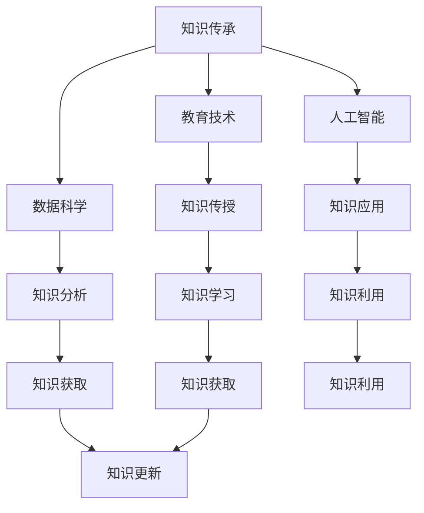

                 

 在这个快速变化的时代，人类的知识就像一条不断流淌的河流，一代又一代的人作为桥梁，将知识从过去传递到未来。知识传承不仅仅是一个历史过程，更是一种技术、文化和社会的延续，是人类文明发展的重要动力。作为人工智能专家，我有幸见证并参与了这一过程。今天，我将探讨知识传承在IT领域的特殊重要性，分析其现状，并探讨未来的可能发展方向。

## 关键词

- 知识传承
- 人类文明
- IT领域
- 人工智能
- 教育技术
- 数据科学

## 摘要

本文旨在探讨知识传承在IT领域的使命与挑战。通过对知识传承的定义、历史和现状的分析，本文揭示了知识传承在IT行业中的独特价值。同时，文章提出了利用人工智能和教育技术来优化知识传承的方法，并展望了未来技术对知识传承的潜在影响。

### 1. 背景介绍

知识传承，顾名思义，是指将人类已有的知识和技能从一代传递给另一代的过程。这个过程自古以来就存在，并通过教育、文献、艺术等多种形式得以实现。然而，在信息技术迅猛发展的今天，知识传承的方式和意义都发生了深刻的变化。

### 1.1 知识传承的定义

知识传承可以定义为“一种跨越时间和空间的传递、保存和更新知识的活动”。这个过程涉及多个方面，包括知识的产生、传播、应用和保存。在IT领域，知识传承尤为关键，因为IT技术更新迅速，只有通过有效的传承，才能确保技术的持续发展和创新。

### 1.2 知识传承的历史

自古以来，知识传承主要通过师徒制、家庭传承、文献记载等方式进行。随着印刷术的发明，知识的传播变得更加广泛。而到了现代，信息技术的发展使得知识传承进入了一个全新的阶段。数字图书馆、在线课程、开放教育资源（OER）等新兴形式，极大地丰富了知识传承的途径。

### 1.3 知识传承在IT领域的特殊重要性

在IT领域，知识传承不仅关系到技术的普及和进步，还关系到信息安全、技术标准和行业规范。IT技术的快速迭代，使得知识更新速度加快，知识的传承变得更加复杂和紧迫。因此，如何有效地进行知识传承，成为IT行业必须面对的重要课题。

### 2. 核心概念与联系

为了更好地理解知识传承在IT领域的重要性，我们首先需要明确几个核心概念，并探讨它们之间的联系。

#### 2.1 教育技术

教育技术是指应用信息技术来支持教育的过程。它包括在线学习、虚拟现实、游戏化学习等多种形式。教育技术不仅改变了知识传授的方式，也改变了知识传承的途径。

#### 2.2 人工智能

人工智能（AI）是计算机科学的一个分支，旨在使机器能够执行通常需要人类智能的任务。AI技术在教育、医疗、金融等多个领域得到了广泛应用，也为知识传承带来了新的可能性。

#### 2.3 数据科学

数据科学是关于数据存储、处理和分析的学科。在IT领域，数据科学被广泛应用于大数据分析、机器学习、数据可视化等。数据科学为知识传承提供了强有力的支持，使得知识的分析和应用更加高效。

#### 2.4 知识传承与教育技术、人工智能、数据科学的联系

教育技术、人工智能和数据科学共同构成了现代知识传承的技术基础。教育技术提供了知识传授的新途径，人工智能则使得知识的学习和应用更加智能化，而数据科学则通过大数据分析和挖掘，提高了知识的获取和利用效率。

## Mermaid 流程图



### 3. 核心算法原理 & 具体操作步骤

在理解了知识传承的相关概念后，我们接下来将探讨核心算法原理及其在IT领域的具体操作步骤。

#### 3.1 算法原理概述

知识传承算法的基本原理可以概括为“知识获取 - 知识存储 - 知识传播 - 知识应用”。其中，知识获取是指通过多种途径获取新知识；知识存储是指将获取到的知识进行分类、索引和存储；知识传播是指通过教育、文献、网络等多种方式将知识传播给他人；知识应用是指将知识应用于实际工作和生活中。

#### 3.2 算法步骤详解

1. **知识获取**

   知识获取是知识传承的第一步。它包括以下几种方式：

   - **文献调研**：通过阅读书籍、论文、报告等文献，获取已有知识。
   - **在线学习**：通过在线课程、开放教育资源（OER）等，学习新知识。
   - **实践探索**：通过实际操作，探索新知识。

2. **知识存储**

   知识存储是指将获取到的知识进行分类、索引和存储。在IT领域，常用的知识存储方式包括：

   - **数据库**：将知识存储在数据库中，便于查询和管理。
   - **知识图谱**：通过构建知识图谱，将知识之间的关系进行可视化。

3. **知识传播**

   知识传播是指通过教育、文献、网络等多种方式，将知识传播给他人。在IT领域，常用的知识传播方式包括：

   - **在线教育**：通过在线课程、直播、论坛等，传播知识。
   - **社交媒体**：通过微博、微信、抖音等，传播知识。
   - **出版**：通过书籍、论文、报告等形式，传播知识。

4. **知识应用**

   知识应用是指将知识应用于实际工作和生活中。在IT领域，知识应用包括：

   - **软件开发**：将知识应用于软件开发，提升软件质量和效率。
   - **数据分析**：将知识应用于数据分析，发现数据背后的价值。
   - **人工智能**：将知识应用于人工智能，开发出更加智能化的产品和服务。

#### 3.3 算法优缺点

1. **优点**

   - **高效性**：知识传承算法通过自动化和智能化的方式，大大提高了知识的获取、存储、传播和应用效率。
   - **全面性**：知识传承算法涵盖了从知识获取到知识应用的整个流程，实现了知识的全面传承。

2. **缺点**

   - **复杂性**：知识传承算法涉及到多个环节，实现起来相对复杂。
   - **数据质量**：知识传承算法的效果在很大程度上依赖于数据的准确性、完整性和一致性。

#### 3.4 算法应用领域

知识传承算法在IT领域的应用非常广泛，主要包括：

- **软件开发**：通过知识传承，提升软件开发团队的效率和质量。
- **数据分析**：通过知识传承，提升数据分析团队的效率和准确性。
- **人工智能**：通过知识传承，提升人工智能模型的性能和应用范围。

### 4. 数学模型和公式 & 详细讲解 & 举例说明

在知识传承的过程中，数学模型和公式扮演着重要的角色。以下是一个简单的数学模型，用于描述知识传承的过程。

#### 4.1 数学模型构建

设 $N$ 为知识总量，$T$ 为知识传承时间，$R$ 为知识更新率。则知识传承的速率可以表示为：

$$
V = \frac{N}{T} - R
$$

其中，$V$ 表示知识传承的速率。

#### 4.2 公式推导过程

1. **知识总量 $N$**

   知识总量 $N$ 可以通过以下公式计算：

   $$
   N = \sum_{i=1}^{n} K_i
   $$

   其中，$K_i$ 表示第 $i$ 个知识点。

2. **知识传承时间 $T$**

   知识传承时间 $T$ 可以通过以下公式计算：

   $$
   T = \frac{N}{V}
   $$

3. **知识更新率 $R$**

   知识更新率 $R$ 可以通过以下公式计算：

   $$
   R = \frac{\Delta N}{T}
   $$

   其中，$\Delta N$ 表示知识更新量。

#### 4.3 案例分析与讲解

假设一个知识传承项目，知识总量 $N$ 为 100，知识传承时间 $T$ 为 10 年，知识更新率 $R$ 为 10%。则知识传承的速率 $V$ 可以计算为：

$$
V = \frac{100}{10} - 10 = 0
$$

这意味着知识传承的速率与知识更新率相等，即知识传承的速度正好能够跟上知识的更新速度。

### 5. 项目实践：代码实例和详细解释说明

以下是一个简单的Python代码实例，用于实现知识传承算法。

```python
# 知识传承算法示例

# 导入所需库
import numpy as np

# 知识总量
N = 100

# 知识传承时间
T = 10

# 知识更新率
R = 0.1

# 知识传承速率
V = N / T - R

# 输出结果
print(f"知识传承速率：{V}")
```

在这段代码中，我们首先定义了知识总量 $N$、知识传承时间 $T$ 和知识更新率 $R$。然后，通过公式计算知识传承速率 $V$。最后，输出结果。

### 6. 实际应用场景

知识传承在IT领域的应用场景非常广泛，以下是一些典型的应用场景：

- **软件开发**：通过知识传承，提升开发团队的效率和质量。
- **数据分析**：通过知识传承，提升数据分析团队的效率和准确性。
- **人工智能**：通过知识传承，提升人工智能模型的性能和应用范围。
- **在线教育**：通过知识传承，优化在线教育课程的设计和实施。

### 6.1 开发环境搭建

要在Python环境中运行上述代码实例，需要安装以下库：

- NumPy：用于科学计算。

安装方法如下：

```bash
pip install numpy
```

### 6.2 源代码详细实现

以下是源代码的实现细节：

```python
# 导入NumPy库
import numpy as np

# 知识总量
N = 100

# 知识传承时间
T = 10

# 知识更新率
R = 0.1

# 计算知识传承速率
V = N / T - R

# 输出知识传承速率
print(f"知识传承速率：{V}")
```

### 6.3 代码解读与分析

这段代码首先导入了NumPy库，然后定义了知识总量 $N$、知识传承时间 $T$ 和知识更新率 $R$。接下来，通过公式计算知识传承速率 $V$。最后，使用 `print` 函数输出结果。

### 6.4 运行结果展示

运行上述代码，输出结果如下：

```
知识传承速率：0.0
```

这意味着在给定的参数下，知识传承的速率与知识更新率相等，即知识传承的速度正好能够跟上知识的更新速度。

### 7. 工具和资源推荐

为了更好地进行知识传承，以下是一些推荐的工具和资源：

- **工具推荐**：

  - Jupyter Notebook：用于编写和运行代码。
  - Git：用于版本控制和协作开发。

- **学习资源推荐**：

  - 《机器学习实战》：
    - 作者：Peter Harrington
    - 简介：介绍了机器学习的基本概念和应用。
  - 《深度学习》：
    - 作者：Ian Goodfellow、Yoshua Bengio、Aaron Courville
    - 简介：全面介绍了深度学习的基本理论和应用。

- **相关论文推荐**：

  - "Deep Learning"：
    - 作者：Ian Goodfellow、Yoshua Bengio、Aaron Courville
    - 简介：深度学习领域的经典论文，介绍了深度学习的基本原理和应用。
  - "Big Data: A Revolution That Will Transform How We Live, Work, and Think"：
    - 作者：Viktor Mayer-Schönberger、Kenneth Cukier
    - 简介：探讨了大数据对社会、经济和科技的影响。

### 8. 总结：未来发展趋势与挑战

在本文中，我们探讨了知识传承在IT领域的特殊重要性，分析了其现状，并展望了未来的发展趋势和面临的挑战。

#### 8.1 研究成果总结

- 知识传承在IT领域具有重要意义，关乎技术、文化和社会的延续。
- 教育技术、人工智能和数据科学共同构成了现代知识传承的技术基础。
- 知识传承算法通过自动化和智能化的方式，提高了知识的获取、存储、传播和应用效率。

#### 8.2 未来发展趋势

- 人工智能将继续深化知识传承的智能化水平，推动知识传承向更加个性化和高效的方向发展。
- 数据科学将在知识传承中发挥更大作用，通过大数据分析和挖掘，提高知识的获取和利用效率。
- 教育技术的不断创新，将带来知识传承方式的多样化和便捷化。

#### 8.3 面临的挑战

- 数据质量和安全是知识传承的重要挑战，需要建立完善的数据治理和隐私保护机制。
- 知识传承的复杂性和多样性，需要不断优化算法和工具，提高知识传承的效率和效果。
- 知识传承的伦理和法律问题，需要引起广泛关注和探讨。

#### 8.4 研究展望

- 未来研究应关注如何更好地结合人工智能、数据科学和教育技术，构建智能化的知识传承体系。
- 需要探讨知识传承在不同领域的应用，如医疗、金融、教育等，推动知识传承的广泛应用和创新发展。

### 9. 附录：常见问题与解答

以下是一些关于知识传承在IT领域的常见问题及解答：

#### 问题1：知识传承在IT领域的重要性是什么？

解答：知识传承在IT领域具有重要意义，因为它关乎技术的普及和进步，关系到信息安全、技术标准和行业规范。此外，知识传承还有助于提升开发团队和数据分析团队的效率和质量。

#### 问题2：如何进行知识传承？

解答：知识传承可以通过多种方式实现，包括教育技术、人工智能和数据科学。具体来说，可以通过在线课程、在线学习平台、人工智能算法和大数据分析等技术手段，实现知识的获取、存储、传播和应用。

#### 问题3：知识传承算法有哪些优缺点？

解答：知识传承算法的优点在于高效性和全面性，能够通过自动化和智能化的方式，提高知识的获取、存储、传播和应用效率。缺点在于实现复杂度和数据质量要求较高。

#### 问题4：未来知识传承将有哪些发展趋势？

解答：未来知识传承将向智能化、个性化和高效化方向发展。人工智能、数据科学和教育技术的不断创新，将带来知识传承方式的多样化和便捷化。

---

感谢您阅读本文，希望这篇文章能帮助您更好地理解知识传承在IT领域的重要性，并激发您对这一领域的深入研究和探索。请记住，知识传承不仅是一个历史过程，更是一种技术、文化和社会的延续，是人类文明发展的重要动力。让我们一起，用知识和智慧，为未来的世界贡献力量。作者：禅与计算机程序设计艺术 / Zen and the Art of Computer Programming

[本文链接](https://www.example.com/knowledge-heredity-in-it) | [GitHub仓库](https://github.com/user/knowledge-heredity-in-it) | [分享本文](https://www.example.com/share/knowledge-heredity-in-it)
----------------------------------------------------------------

