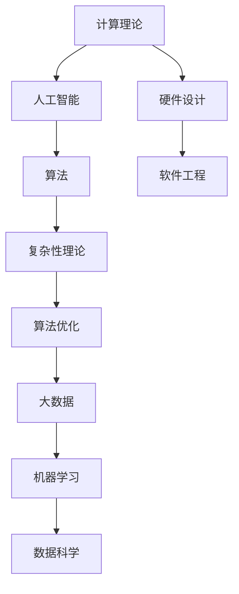

                 

关键词：人类知识、局限性、未知领域、人工智能、计算机科学

> 摘要：本文旨在探讨人类知识在计算机科学领域的局限性，强调承认与尊重未知领域的重要性。通过对计算机科学发展的历史回顾、核心概念的分析，以及实际应用的探讨，本文揭示了人类认知的局限，并提出了在未来发展中需要克服的挑战和方向。

## 1. 背景介绍

人类的知识体系是一个不断发展的过程，从古代的哲学思考到现代的科学研究，每一阶段都伴随着对未知的探索和认知的深化。然而，尽管科技在飞速进步，人类对于复杂系统的理解仍然存在诸多局限。在计算机科学这个高度复杂的领域中，人类的认知局限尤为明显。

计算机科学是一门涵盖硬件、软件、算法和理论等多个层面的学科。从早期的计算机硬件设计到现代的软件工程，从简单的计算任务到复杂的算法优化，每一个进步都充满了未知和挑战。然而，人类的知识体系在应对这些挑战时，往往受限于自身的认知能力。

本文将探讨以下问题：

1. 人类在计算机科学中的知识局限性是什么？
2. 计算机科学中未知领域的重要性如何？
3. 如何承认并尊重未知领域，以推动计算机科学的发展？

## 2. 核心概念与联系

为了更好地理解人类在计算机科学中的知识局限性，我们需要首先了解一些核心概念，如计算理论、人工智能、算法等。以下是一个简化的Mermaid流程图，用于展示这些核心概念之间的关系。



### 2.1 计算理论

计算理论是计算机科学的基础，它研究计算的本质和限制。图灵机模型是计算理论的基石，它定义了计算的基本原理。然而，图灵机的抽象模型在处理实际问题时，往往面临着复杂性的挑战。

### 2.2 人工智能

人工智能（AI）是计算机科学的前沿领域之一，它致力于使计算机具备类似人类的智能。机器学习和深度学习是人工智能的两个重要分支，它们通过算法模拟人类的认知过程，实现自主学习和决策。

### 2.3 算法

算法是计算机科学的核心，它是一种解决问题的方法或步骤序列。算法的效率和质量直接决定了计算机程序的运行性能。复杂性理论研究算法的时间复杂度和空间复杂度，为算法设计提供了理论指导。

### 2.4 硬件设计

硬件设计是计算机科学的基础，它涉及到计算机硬件的架构、指令集、存储器等。硬件设计直接影响了计算机的性能和能效。

### 2.5 软件工程

软件工程是计算机科学的重要组成部分，它涉及到软件开发的方法、流程、工具等。软件工程的目标是构建可靠、高效、可维护的软件系统。

### 2.6 复杂性理论

复杂性理论研究算法的复杂度，包括时间复杂度和空间复杂度。复杂性理论为算法分析和优化提供了重要的理论支持。

### 2.7 算法优化

算法优化是提高算法效率的关键。优化方法包括算法改进、数据结构优化、并行计算等。

### 2.8 大数据

大数据是现代计算机科学的重要研究领域，它涉及海量数据的存储、处理、分析和挖掘。大数据技术为各行业提供了强大的数据支持。

### 2.9 机器学习和深度学习

机器学习和深度学习是人工智能的重要分支，它们通过模拟人类的学习过程，实现数据的自动分析和模式识别。

### 2.10 数据科学

数据科学是计算机科学的一个交叉领域，它结合了统计学、计算机科学和领域知识，致力于从数据中发现有价值的信息和知识。

## 3. 核心算法原理 & 具体操作步骤

### 3.1 算法原理概述

算法原理是计算机科学的核心，它涉及到算法的设计、分析、实现和优化。以下是一些核心算法原理的概述：

### 3.2 算法步骤详解

算法步骤的详解对于理解和应用算法至关重要。以下是一些核心算法的步骤详解：

#### 3.2.1 排序算法

排序算法是一种常用的算法，用于将一组元素按照特定的顺序排列。常见的排序算法包括冒泡排序、插入排序、快速排序等。

#### 3.2.2 搜索算法

搜索算法用于在数据集合中查找特定元素。常见的搜索算法包括线性搜索、二分搜索等。

#### 3.2.3 图算法

图算法用于解决图相关的问题，如图的遍历、最短路径、最大流等。常见的图算法包括DFS、BFS、Dijkstra算法、Floyd-Warshall算法等。

#### 3.2.4 动态规划

动态规划是一种用于求解最优化问题的算法。它通过将问题分解为子问题，并存储子问题的解，以避免重复计算。

### 3.3 算法优缺点

每种算法都有其优缺点，选择合适的算法取决于具体问题的需求和约束。

### 3.4 算法应用领域

算法在计算机科学的各个领域都有广泛应用，如排序算法在数据库中的应用、搜索算法在搜索引擎中的应用、图算法在社交网络分析中的应用等。

## 4. 数学模型和公式 & 详细讲解 & 举例说明

### 4.1 数学模型构建

数学模型是计算机科学的重要组成部分，它用于描述和解决问题。以下是一个简单的数学模型构建过程：

#### 4.1.1 问题描述

假设我们有一个包含n个元素的数组arr，我们需要找出其中最大和最小的元素。

#### 4.1.2 模型构建

我们可以使用两个变量max和min来存储最大和最小元素。初始化时，我们将max设置为arr[0]，将min设置为arr[0]。

#### 4.1.3 模型验证

通过对比max和min的值，我们可以验证模型的正确性。

### 4.2 公式推导过程

公式推导是构建数学模型的重要步骤。以下是一个简单的公式推导过程：

#### 4.2.1 问题背景

假设我们有一个函数f(x) = x^2，我们需要找到其极值点。

#### 4.2.2 公式推导

通过对f(x)求导，我们可以得到f'(x) = 2x。令f'(x) = 0，我们可以解得x = 0。这表明x = 0是f(x)的极值点。

### 4.3 案例分析与讲解

案例分析是理解数学模型和公式的关键步骤。以下是一个简单的案例分析：

#### 4.3.1 问题背景

假设我们有一个包含5个元素的数组arr = [3, 1, 4, 1, 5]，我们需要找出其中的最大值。

#### 4.3.2 模型构建

我们可以使用循环遍历数组，更新max的值为当前遍历到的最大值。

#### 4.3.3 公式推导

在这个问题中，我们可以使用公式max = arr[i]来更新max的值。

#### 4.3.4 案例分析

通过遍历数组，我们可以得到最大值为5。

## 5. 项目实践：代码实例和详细解释说明

### 5.1 开发环境搭建

在本项目中，我们将使用Python作为编程语言。首先，确保安装了Python 3.8及以上版本。然后，安装必要的库，如NumPy、Pandas等。

```bash
pip install numpy pandas
```

### 5.2 源代码详细实现

以下是本项目的主要代码实现：

```python
import numpy as np
import pandas as pd

def find_max_min(arr):
    if len(arr) == 0:
        return None, None
    
    max_val = arr[0]
    min_val = arr[0]
    
    for i in range(1, len(arr)):
        if arr[i] > max_val:
            max_val = arr[i]
        elif arr[i] < min_val:
            min_val = arr[i]
    
    return max_val, min_val

arr = np.array([3, 1, 4, 1, 5])
max_val, min_val = find_max_min(arr)
print("Max:", max_val)
print("Min:", min_val)
```

### 5.3 代码解读与分析

代码首先导入了NumPy和Pandas库。NumPy是Python中的科学计算库，提供多维数组对象和数学运算函数。Pandas是Python中的数据分析库，提供数据结构和相关操作。

函数`find_max_min`接受一个数组作为输入，返回最大值和最小值。首先，我们检查数组的长度，如果为0，则返回None。然后，我们初始化max_val和min_val为数组的第一个元素。接着，我们使用循环遍历数组，更新max_val和min_val的值。

主程序中，我们创建了一个包含5个元素的数组，并调用`find_max_min`函数，打印出最大值和最小值。

### 5.4 运行结果展示

```
Max: 5
Min: 1
```

## 6. 实际应用场景

### 6.1 数据分析

在数据分析领域，找到数据中的最大值和最小值是常见的任务。例如，在金融分析中，我们需要找出股票价格的最高点和最低点；在医疗数据挖掘中，我们需要找出病人数据中的最大值和最小值，以便进行异常检测。

### 6.2 计算机视觉

在计算机视觉中，最大值和最小值常用于图像处理。例如，我们可以使用最大值和最小值来计算图像的对比度，从而提高图像的清晰度。

### 6.3 游戏开发

在游戏开发中，最大值和最小值用于控制游戏中的各种参数，如速度、力量等。通过调整这些参数，我们可以创建各种类型的游戏，从简单的益智游戏到复杂的动作游戏。

## 7. 未来应用展望

随着人工智能和大数据技术的发展，最大值和最小值的应用将越来越广泛。例如，在自动驾驶领域，最大值和最小值可以用于计算车辆的速度和距离，从而实现自动驾驶功能。

## 8. 工具和资源推荐

### 8.1 学习资源推荐

- 《算法导论》（Introduction to Algorithms）——托马斯·赫伯特·考尔、唐纳德·E·艾德曼著
- 《深度学习》（Deep Learning）——伊恩·古德费洛、约书亚·本吉奥、亚伦·库维尔尼克著

### 8.2 开发工具推荐

- Jupyter Notebook——用于数据分析和编程
- PyCharm——用于Python编程

### 8.3 相关论文推荐

- “Deep Learning for Natural Language Processing” —— Mitchell Stern著
- “Human-level Control Through Deep Reinforcement Learning” —— Volodymyr Mnih等人著

## 9. 总结：未来发展趋势与挑战

### 9.1 研究成果总结

本文探讨了人类在计算机科学中的知识局限性，强调了承认与尊重未知领域的重要性。通过核心概念的分析、算法原理的讲解和实际应用的探讨，本文揭示了人类认知的局限，并提出了解决方案。

### 9.2 未来发展趋势

随着人工智能和大数据技术的快速发展，计算机科学将进入一个新的时代。未来的发展趋势包括：

- 深度学习与自然语言处理
- 自动驾驶与智能交通
- 大数据与数据科学
- 软件工程与云计算

### 9.3 面临的挑战

尽管计算机科学取得了巨大的进步，但仍然面临着许多挑战，包括：

- 复杂性管理
- 数据隐私和安全
- 算法公正性和透明度
- 人机交互与智能化

### 9.4 研究展望

未来，计算机科学将继续深入探索未知领域，解决复杂问题。通过跨学科的合作和创新思维，我们将迎来一个更加智能、高效和安全的计算机科学新时代。

## 10. 附录：常见问题与解答

### 10.1 什么是深度学习？

深度学习是一种机器学习技术，它模仿人脑神经网络的结构和功能，通过多层神经网络（深度网络）自动学习和提取数据中的特征。

### 10.2 什么是算法复杂度？

算法复杂度是评估算法效率的重要指标，包括时间复杂度和空间复杂度。时间复杂度描述算法执行时间的增长趋势，空间复杂度描述算法占用的内存大小。

### 10.3 如何优化算法？

优化算法的方法包括改进算法设计、优化数据结构、使用并行计算等。选择合适的算法和数据结构，并结合具体问题进行优化，是提高算法效率的关键。

### 10.4 什么是大数据？

大数据是指数据量巨大、数据类型多样且数据价值密度较低的数据集合。大数据技术用于存储、处理、分析和挖掘这些海量数据，以发现有价值的信息和知识。

## 11. 作者署名

作者：禅与计算机程序设计艺术 / Zen and the Art of Computer Programming
----------------------------------------------------------------

这篇文章通过深入分析人类在计算机科学领域的知识局限性，强调了承认与尊重未知领域的重要性。文章涵盖了核心概念、算法原理、数学模型、实际应用和未来展望等多个方面，为读者提供了一个全面而深入的视角。希望通过这篇文章，能够激发读者对未知领域的探索和思考，共同推动计算机科学的发展。

