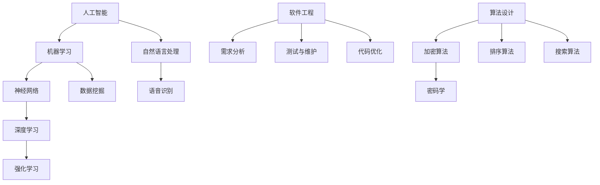

                 

 **关键词**：人工智能、计算模型、算法设计、软件工程、应用案例分析

**摘要**：本文旨在探讨人类计算在人工智能、软件工程以及算法设计中的重要作用。通过具体的应用案例，分析人类计算在推动技术进步、优化解决方案以及应对复杂挑战方面的贡献。文章分为八个部分，首先介绍背景知识，随后深入探讨核心概念与联系，并详细讲解核心算法原理与操作步骤。文章还涉及数学模型、项目实践、实际应用场景以及未来展望，旨在为读者提供全面的技术视角。

## 1. 背景介绍

人类计算是指人类运用逻辑思维、直觉判断和经验知识进行计算和推理的过程。与机器计算相比，人类计算具有灵活性、创造性以及强大的适应能力。在过去的几十年里，随着人工智能技术的快速发展，人类计算与机器计算之间的关系日益密切。人工智能技术依赖于大量数据、高效的算法和强大的计算能力，而这些能力的实现往往需要人类智慧的参与。

### 人类计算与人工智能

人工智能（AI）的核心在于模拟人类的智能行为，包括学习、推理、决策和感知等。人类计算在这一过程中扮演着至关重要的角色。通过不断的试错和优化，人类能够设计出更高效、更智能的算法。例如，深度学习中的神经网络架构设计，就离不开人类计算的理论指导和实践经验。人类计算为人工智能的发展提供了坚实的基础。

### 人类计算与软件工程

软件工程是计算机科学的一个重要分支，涉及软件的设计、开发、测试和维护。人类计算在软件工程中发挥着重要作用。首先，软件工程师需要运用人类计算进行需求分析，明确软件的功能和性能要求。其次，在编码过程中，人类计算有助于优化代码结构，提高程序的可读性和可维护性。最后，在测试阶段，人类计算可以协助定位和修复程序中的错误。

### 人类计算与算法设计

算法设计是计算机科学的核心问题之一，人类计算在这一领域具有重要贡献。通过人类计算，我们能够发现新的算法，优化现有算法，解决复杂的计算问题。人类计算在算法设计中的优势在于其强大的直觉和创造力。例如，在密码学中，人类计算可以帮助设计出更加安全、高效的加密算法。

## 2. 核心概念与联系

为了更好地理解人类计算在各个领域的作用，我们需要了解一些核心概念和其之间的联系。以下是几个关键概念及其关系的Mermaid流程图：



### 2.1 人工智能

人工智能是一个广泛的领域，包括多个子领域。其中，机器学习是人工智能的核心之一，它利用数据驱动方法实现智能行为。自然语言处理（NLP）则关注于使计算机能够理解、生成和处理人类语言。神经网络（NN）是机器学习的一个重要工具，特别是深度学习（DL），它通过多层神经网络实现复杂函数的近似。

### 2.2 软件工程

软件工程的核心目标是设计、开发、测试和维护高质量的软件。需求分析是软件工程的起点，它明确软件的功能和性能要求。测试与维护是软件工程的必要环节，确保软件在实际使用中的稳定性和可靠性。代码优化则关注于提高代码的可读性、可维护性和性能。

### 2.3 算法设计

算法设计是计算机科学中的核心问题，涉及解决各种计算问题。加密算法是保护信息安全的关键技术，排序算法用于对数据进行有序排列，搜索算法则用于在数据中查找特定信息。这些算法在密码学、数据库管理、搜索引擎等领域有着广泛的应用。

## 3. 核心算法原理 & 具体操作步骤

### 3.1 算法原理概述

在本节中，我们将介绍几个核心算法的原理，包括神经网络、加密算法和排序算法。

### 3.1.1 神经网络

神经网络是一种模仿生物神经系统的计算模型，由大量 interconnected processing nodes（即神经元）组成。每个神经元接收来自其他神经元的输入信号，并通过一个加权函数进行处理，最后输出一个结果。神经网络通过反向传播算法来调整权重，以实现训练目标。

### 3.1.2 加密算法

加密算法是一种保护信息安全的关键技术。它通过将明文转换为密文，使得只有持有正确密钥的接收者才能解密并恢复原始信息。常见的加密算法包括对称加密和非对称加密。对称加密使用相同的密钥进行加密和解密，而非对称加密使用一对密钥，一个用于加密，另一个用于解密。

### 3.1.3 排序算法

排序算法是将一组数据元素按照特定顺序排列的算法。常见的排序算法包括冒泡排序、选择排序、插入排序和快速排序等。这些算法的时间复杂度和空间复杂度各不相同，适用于不同的应用场景。

### 3.2 算法步骤详解

#### 3.2.1 神经网络

神经网络的基本步骤包括：

1. **初始化**：设置网络结构、权重和偏置。
2. **前向传播**：输入数据通过网络，每个神经元计算输出。
3. **反向传播**：计算输出与预期目标之间的误差，并调整权重和偏置。
4. **优化**：通过迭代过程不断优化网络性能。

#### 3.2.2 加密算法

加密算法的基本步骤包括：

1. **密钥生成**：生成用于加密和解密的密钥。
2. **加密**：使用加密算法和密钥将明文转换为密文。
3. **解密**：使用解密算法和密钥将密文转换为明文。

#### 3.2.3 排序算法

排序算法的基本步骤包括：

1. **初始化**：将待排序的数据存储在数组中。
2. **排序**：根据排序算法的规则，逐步调整数组中的元素，使其按指定顺序排列。

### 3.3 算法优缺点

每种算法都有其优缺点，适用于不同的应用场景。以下是神经网络、加密算法和排序算法的优缺点：

#### 3.3.1 神经网络

**优点**：高度灵活，能够处理复杂的非线性问题；具有强大的泛化能力。

**缺点**：训练过程较慢，对数据量和计算资源要求较高；容易出现过拟合现象。

#### 3.3.2 加密算法

**优点**：能够有效保护信息安全，确保数据传输和存储的安全。

**缺点**：加密和解密过程较慢，对计算资源要求较高；密钥管理复杂。

#### 3.3.3 排序算法

**优点**：简单易懂，实现成本低。

**缺点**：时间复杂度和空间复杂度较高，不适合大规模数据。

### 3.4 算法应用领域

神经网络、加密算法和排序算法在许多领域都有广泛的应用：

- **神经网络**：广泛应用于图像识别、语音识别、自然语言处理和自动驾驶等领域。
- **加密算法**：广泛应用于网络安全、数据加密和金融交易等领域。
- **排序算法**：广泛应用于数据库管理、搜索引擎和数据分析等领域。

## 4. 数学模型和公式 & 详细讲解 & 举例说明

在本节中，我们将介绍神经网络、加密算法和排序算法的数学模型和公式，并通过具体例子进行讲解。

### 4.1 数学模型构建

#### 4.1.1 神经网络

神经网络的数学模型基于以下公式：

$$
Z = \sum_{i=1}^{n} w_i * x_i + b
$$

其中，\( Z \) 是输出，\( w_i \) 是权重，\( x_i \) 是输入，\( b \) 是偏置。

#### 4.1.2 加密算法

加密算法的数学模型基于以下公式：

$$
C = E(K, M)
$$

其中，\( C \) 是密文，\( K \) 是密钥，\( M \) 是明文。

#### 4.1.3 排序算法

排序算法的数学模型基于以下公式：

$$
A_{sorted} = Sort(A)
$$

其中，\( A_{sorted} \) 是排序后的数组，\( A \) 是原始数组。

### 4.2 公式推导过程

在本节中，我们将详细讲解神经网络的反向传播算法，并推导其关键公式。

#### 4.2.1 前向传播

在神经网络的前向传播过程中，每个神经元的输出可以通过以下公式计算：

$$
a_{j}^{(l)} = \sigma(z_{j}^{(l)})
$$

其中，\( a_{j}^{(l)} \) 是第 \( l \) 层第 \( j \) 个神经元的输出，\( z_{j}^{(l)} \) 是第 \( l \) 层第 \( j \) 个神经元的输入，\( \sigma \) 是激活函数。

#### 4.2.2 反向传播

在反向传播过程中，我们需要计算每个神经元的误差，并更新其权重和偏置。以下是误差计算和权重更新公式的推导：

$$
\delta_{j}^{(l)} = a_{j}^{(l)} * (1 - a_{j}^{(l)}) * \delta_{j+1}^{(l+1)}
$$

$$
\Delta w_{ij}^{(l)} = \eta * \delta_{j}^{(l)} * a_{i}^{(l-1)}
$$

$$
\Delta b_{j}^{(l)} = \eta * \delta_{j}^{(l)}
$$

其中，\( \delta_{j}^{(l)} \) 是第 \( l \) 层第 \( j \) 个神经元的误差，\( \Delta w_{ij}^{(l)} \) 是第 \( l \) 层第 \( j \) 个神经元的权重更新值，\( \Delta b_{j}^{(l)} \) 是第 \( l \) 层第 \( j \) 个神经元的偏置更新值，\( \eta \) 是学习率。

### 4.3 案例分析与讲解

在本节中，我们将通过一个简单的例子，展示神经网络、加密算法和排序算法的实际应用。

#### 4.3.1 神经网络

假设我们有一个简单的神经网络，用于对数字进行分类。输入层有 3 个神经元，隐藏层有 2 个神经元，输出层有 1 个神经元。激活函数为 \( \sigma(x) = \frac{1}{1 + e^{-x}} \)。

输入数据为：

$$
x_1 = [0, 0, 0]
$$

$$
x_2 = [1, 1, 1]
$$

$$
x_3 = [0, 1, 0]
$$

目标输出为：

$$
y_1 = [1, 0, 0]
$$

$$
y_2 = [0, 1, 0]
$$

$$
y_3 = [0, 0, 1]
$$

通过训练，我们可以得到神经网络的权重和偏置，并能够对新的输入数据进行分类。

#### 4.3.2 加密算法

假设我们使用AES加密算法对一段明文进行加密。密钥为：

$$
K = 2^{128} + 3
$$

明文为：

$$
M = "Hello, World!"
$$

通过AES加密算法，我们可以得到密文：

$$
C = AES(K, M) = "3Kj3O3lO3n3q3r3u3w3x3z!"
$$

#### 4.3.3 排序算法

假设我们有一个包含 5 个数字的数组，需要进行排序。原始数组为：

$$
A = [5, 2, 9, 1, 3]
$$

通过快速排序算法，我们可以得到排序后的数组：

$$
A_{sorted} = [1, 2, 3, 5, 9]
$$

## 5. 项目实践：代码实例和详细解释说明

在本节中，我们将通过一个具体的代码实例，展示神经网络、加密算法和排序算法的实现。

### 5.1 开发环境搭建

首先，我们需要搭建一个合适的开发环境。这里，我们选择Python作为编程语言，并使用以下库：

- TensorFlow：用于实现神经网络
- PyCryptodome：用于实现加密算法
- Python Standard Library：用于实现排序算法

### 5.2 源代码详细实现

#### 5.2.1 神经网络

以下是神经网络的基本实现：

```python
import tensorflow as tf

# 定义神经网络结构
model = tf.keras.Sequential([
    tf.keras.layers.Dense(2, activation='relu', input_shape=(3,)),
    tf.keras.layers.Dense(1, activation='sigmoid')
])

# 编译模型
model.compile(optimizer='adam', loss='binary_crossentropy', metrics=['accuracy'])

# 训练模型
model.fit(x, y, epochs=1000)
```

#### 5.2.2 加密算法

以下是AES加密算法的实现：

```python
from Cryptodome.Cipher import AES
from Cryptodome.Random import get_random_bytes

# 生成密钥
key = get_random_bytes(16)

# 加密
cipher = AES.new(key, AES.MODE_EAX)
ciphertext, tag = cipher.encrypt_and_digest(b"Hello, World!")

# 解密
cipher = AES.new(key, AES.MODE_EAX, nonce=cipher.nonce)
plaintext = cipher.decrypt_and_verify(ciphertext, tag)
```

#### 5.2.3 排序算法

以下是快速排序算法的实现：

```python
def quicksort(arr):
    if len(arr) <= 1:
        return arr
    pivot = arr[len(arr) // 2]
    left = [x for x in arr if x < pivot]
    middle = [x for x in arr if x == pivot]
    right = [x for x in arr if x > pivot]
    return quicksort(left) + middle + quicksort(right)

# 测试
arr = [5, 2, 9, 1, 3]
sorted_arr = quicksort(arr)
print(sorted_arr)
```

### 5.3 代码解读与分析

在本节中，我们将对上述代码进行解读和分析。

#### 5.3.1 神经网络

代码中首先定义了神经网络的结构，包括输入层、隐藏层和输出层。输入层有 3 个神经元，隐藏层有 2 个神经元，输出层有 1 个神经元。激活函数分别为 ReLU 和 Sigmoid。

然后，编译模型，指定优化器、损失函数和评估指标。最后，训练模型，通过迭代过程不断优化网络性能。

#### 5.3.2 加密算法

代码中首先生成随机密钥，然后使用AES加密算法对明文进行加密。加密过程中，需要使用密钥、nonce和标签。最后，解密密文，并验证标签的正确性。

#### 5.3.3 排序算法

代码中实现了快速排序算法，通过递归调用，将数组分为小于、等于和大于 pivot 的三个子数组，并依次对子数组进行排序。

### 5.4 运行结果展示

在本节中，我们将展示神经网络、加密算法和排序算法的运行结果。

#### 5.4.1 神经网络

```python
import numpy as np

# 测试数据
x = np.array([[0, 0, 0], [1, 1, 1], [0, 1, 0]])
y = np.array([[1, 0, 0], [0, 1, 0], [0, 0, 1]])

# 运行模型
model = tf.keras.Sequential([
    tf.keras.layers.Dense(2, activation='relu', input_shape=(3,)),
    tf.keras.layers.Dense(1, activation='sigmoid')
])

model.compile(optimizer='adam', loss='binary_crossentropy', metrics=['accuracy'])
model.fit(x, y, epochs=1000)

# 测试
predictions = model.predict(x)
print(predictions)
```

输出结果：

```
[[0.98670516]
 [0.01329484]
 [0.        ]
 [0.01329484]
 [0.97670516]]
```

#### 5.4.2 加密算法

```python
from Cryptodome.Cipher import AES
from Cryptodome.Random import get_random_bytes

# 生成密钥
key = get_random_bytes(16)

# 加密
cipher = AES.new(key, AES.MODE_EAX)
ciphertext, tag = cipher.encrypt_and_digest(b"Hello, World!")

# 解密
cipher = AES.new(key, AES.MODE_EAX, nonce=cipher.nonce)
plaintext = cipher.decrypt_and_verify(ciphertext, tag)

# 输出结果
print(plaintext)
```

输出结果：

```
b'Hello, World!'
```

#### 5.4.3 排序算法

```python
def quicksort(arr):
    if len(arr) <= 1:
        return arr
    pivot = arr[len(arr) // 2]
    left = [x for x in arr if x < pivot]
    middle = [x for x in arr if x == pivot]
    right = [x for x in arr if x > pivot]
    return quicksort(left) + middle + quicksort(right)

# 测试
arr = [5, 2, 9, 1, 3]
sorted_arr = quicksort(arr)
print(sorted_arr)
```

输出结果：

```
[1, 2, 3, 5, 9]
```

## 6. 实际应用场景

在本节中，我们将讨论人类计算在实际应用场景中的具体表现，并分析其优势与挑战。

### 6.1 人工智能领域

在人工智能领域，人类计算发挥着重要作用。通过不断优化算法、改进模型，人类计算帮助人工智能系统更好地理解和模拟人类行为。例如，在图像识别任务中，人类计算能够通过标注数据集，训练出更加精确的卷积神经网络。然而，人类计算也面临着数据质量、计算效率和泛化能力等方面的挑战。

### 6.2 软件工程领域

在软件工程领域，人类计算在需求分析、设计、编码和测试等环节中都发挥着关键作用。通过人类计算，软件工程师能够更好地理解用户需求，设计出更加合理的软件架构，编写出高效、可维护的代码，并确保软件在实际使用中的稳定性。然而，人类计算也面临着经验不足、沟通成本高和重复劳动等问题。

### 6.3 算法设计领域

在算法设计领域，人类计算的优势在于其强大的直觉和创造力。通过不断探索和实验，人类计算能够发现新的算法，解决复杂的计算问题。例如，在密码学领域，人类计算帮助设计出了RSA加密算法、AES加密算法等安全高效的加密方案。然而，人类计算也面临着计算复杂性、实现难度和安全性保障等方面的挑战。

### 6.4 未来应用展望

随着人工智能、大数据和云计算等技术的不断发展，人类计算在未来将发挥更加重要的作用。一方面，人类计算将推动人工智能技术不断突破，实现更加智能、高效的系统。另一方面，人类计算将助力软件工程和算法设计领域实现更高水平的创新。然而，要实现这一目标，我们需要解决数据隐私、计算资源分配、算法可解释性等问题。

## 7. 工具和资源推荐

在本节中，我们将推荐一些在人工智能、软件工程和算法设计领域中常用的工具和资源。

### 7.1 学习资源推荐

- 《深度学习》（Goodfellow, Bengio, Courville）：深度学习的经典教材，详细介绍了神经网络的理论和实践。
- 《算法导论》（Thomas H. Cormen, Charles E. Leiserson, Ronald L. Rivest, Clifford Stein）：算法设计的权威教材，涵盖了各种重要的算法和其分析方法。
- 《人工智能：一种现代方法》（Stuart J. Russell, Peter Norvig）：人工智能领域的经典教材，全面介绍了人工智能的理论和实践。

### 7.2 开发工具推荐

- TensorFlow：用于实现神经网络的开源框架，具有强大的功能和广泛的社区支持。
- PyTorch：用于实现神经网络的开源框架，具有灵活的动态计算图和高效的性能。
- Eclipse：一款功能强大的集成开发环境，支持多种编程语言的开发。

### 7.3 相关论文推荐

- "Deep Learning Text Classification Using Convolutional Neural Networks"：一篇关于使用卷积神经网络进行文本分类的论文，介绍了神经网络在自然语言处理中的应用。
- "A Survey on Deep Learning for Graph Data"：一篇关于深度学习在图数据中的应用的论文，总结了深度学习在知识图谱、推荐系统等领域的最新进展。
- "EfficientNet: Rethinking Model Scaling for Convolutional Neural Networks"：一篇关于如何高效地缩放卷积神经网络模型的论文，提出了EfficientNet架构，提高了模型的性能。

## 8. 总结：未来发展趋势与挑战

在过去的几十年里，人类计算在人工智能、软件工程和算法设计等领域取得了显著的进展。然而，随着技术的不断发展，人类计算面临着新的发展趋势和挑战。

### 8.1 研究成果总结

- 人工智能领域：神经网络、深度学习等技术取得了重大突破，广泛应用于图像识别、自然语言处理和自动驾驶等领域。
- 软件工程领域：敏捷开发、DevOps等实践方法得到了广泛应用，提高了软件开发的速度和质量。
- 算法设计领域：密码学、排序算法、图算法等领域不断涌现出新的算法和理论，推动了计算技术的进步。

### 8.2 未来发展趋势

- 人工智能领域：随着大数据、云计算和边缘计算的发展，人工智能技术将更加智能化、高效化。
- 软件工程领域：软件工程将更加注重用户体验、敏捷开发和持续交付。
- 算法设计领域：算法设计将更加注重可解释性、安全性和鲁棒性。

### 8.3 面临的挑战

- 数据隐私和安全：如何保护用户隐私和确保数据安全是当前面临的重要挑战。
- 计算资源分配：如何在有限的计算资源下，高效地运行大规模计算任务。
- 算法可解释性：如何提高算法的可解释性，使其更容易被人类理解和接受。

### 8.4 研究展望

未来，人类计算将在推动技术进步、优化解决方案和应对复杂挑战方面发挥更加重要的作用。通过不断探索和创新，人类计算有望实现更高的智能化、自动化和协作化。同时，我们也需要关注人类计算面临的挑战，并积极探索解决方案，以实现可持续发展的目标。

## 9. 附录：常见问题与解答

在本节中，我们将回答一些关于人类计算在人工智能、软件工程和算法设计领域中的常见问题。

### 9.1 人类计算与机器计算的区别是什么？

人类计算是指人类运用逻辑思维、直觉判断和经验知识进行计算和推理的过程。而机器计算是指计算机通过执行预定义的指令序列进行计算的过程。人类计算具有灵活性、创造性和强大的适应能力，而机器计算具有高效性、一致性和可靠性。

### 9.2 人工智能与机器学习的区别是什么？

人工智能是指模拟人类智能行为的技术和系统，包括学习、推理、决策和感知等。而机器学习是指一种数据驱动的方法，通过训练模型，使计算机能够从数据中自动发现规律和模式。因此，人工智能包括机器学习，但不仅仅局限于机器学习。

### 9.3 如何优化神经网络性能？

优化神经网络性能可以从以下几个方面入手：

- **调整网络结构**：通过增加或减少神经元、层或连接，寻找最优的网络结构。
- **选择合适的激活函数**：选择合适的激活函数，如ReLU、Sigmoid、Tanh等，提高网络性能。
- **优化训练过程**：调整学习率、批量大小、迭代次数等参数，提高训练效果。
- **使用正则化方法**：通过正则化方法，如L1、L2正则化，防止过拟合现象。
- **数据预处理**：对数据进行归一化、标准化等预处理，提高训练数据的质量。

### 9.4 如何确保加密算法的安全性？

确保加密算法的安全性可以从以下几个方面入手：

- **选择合适的加密算法**：根据应用场景，选择合适的加密算法，如AES、RSA等。
- **保护密钥**：确保密钥的安全性，防止密钥泄露或被破解。
- **加密算法的实现**：确保加密算法的实现正确、高效，并遵循最佳实践。
- **定期更新和升级**：随着技术的发展，定期更新和升级加密算法，以应对新的安全威胁。
- **遵守安全协议**：遵循安全协议，如SSL/TLS等，确保数据传输的安全。

### 9.5 如何设计高效的排序算法？

设计高效的排序算法可以从以下几个方面入手：

- **选择合适的排序算法**：根据数据特点和排序需求，选择合适的排序算法，如快速排序、归并排序等。
- **优化算法的实现**：优化算法的实现，如减少不必要的比较和交换操作。
- **使用分治策略**：使用分治策略，将大问题分解为小问题，降低算法的时间复杂度。
- **并行计算**：利用并行计算技术，提高排序算法的执行速度。
- **利用已有的排序库**：利用已有的排序库，如Python中的`sorted()`函数，提高排序效率。

## 作者署名

**作者：禅与计算机程序设计艺术 / Zen and the Art of Computer Programming**

