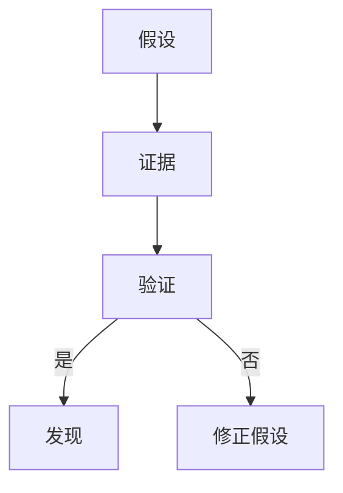

                 

关键词：认知模式、假说驱动、发现模式、IT领域、数学模型

> 摘要：本文从认知科学的角度，深入探讨了人类认知的四种基本模式，尤其是假说驱动的发现模式。通过具体的案例，详细阐述了这些模式在IT领域的应用，并展望了其未来发展趋势与挑战。

## 1. 背景介绍

人类的认知过程是一个复杂而多维的体系。认知科学研究表明，人类的认知模式可以分为四种基本模式：感知模式、记忆模式、思维模式和假说驱动模式。本文重点讨论假说驱动的发现模式，并探讨其在IT领域的应用。

### 1.1 认知科学与假说驱动模式

认知科学是研究人类认知过程的学科，它试图理解人类如何感知、记忆、思维和解决问题。假说驱动模式是指人们在解决问题时，首先提出一个假设或猜想，然后通过实验或观察来验证这个假设，从而得出结论。

### 1.2 IT领域的认知需求

在IT领域，软件开发、算法设计、系统优化等都需要高度的认知能力。因此，了解和运用认知模式对于提升IT工作的效率和质量具有重要意义。

## 2. 核心概念与联系

为了更好地理解假说驱动的发现模式，我们首先需要了解几个核心概念：假设、证据、验证和发现。

### 2.1 假设

假设是人们对某一现象的初步猜测或猜想。在IT领域，假设可能是关于系统性能优化、算法效率提升或新功能实现的猜想。

### 2.2 证据

证据是支持或反驳假设的数据、事实或观察结果。在IT领域，证据可以是测试结果、性能指标或用户反馈。

### 2.3 验证

验证是通过对假设进行实验或观察，来确认或否定假设的过程。在IT领域，验证可能是通过代码测试、性能测试或用户测试来完成的。

### 2.4 发现

发现是通过验证，得出新的结论或发现的过程。在IT领域，发现可能是关于系统性能的新优化方法或新的算法。

下面是这些概念之间的 Mermaid 流程图：



## 3. 核心算法原理 & 具体操作步骤

### 3.1 算法原理概述

假说驱动的发现模式在IT领域主要应用于以下两个方面：

1. 算法优化：通过提出假设，验证和优化算法的性能。
2. 系统优化：通过提出假设，验证和优化系统的性能和效率。

### 3.2 算法步骤详解

1. **提出假设**：根据问题背景，提出一个初步的假设。

2. **收集证据**：通过实验或观察，收集支持或反驳假设的数据。

3. **验证假设**：使用统计方法或算法验证假设的正确性。

4. **修正假设**：根据验证结果，对假设进行修正。

5. **发现**：通过验证，得出新的结论或发现。

### 3.3 算法优缺点

**优点**：

- 提高问题解决效率：通过假设驱动，可以快速找到问题的核心，提高解决效率。
- 促进创新：鼓励提出新的假设，推动技术进步。

**缺点**：

- 可能存在误判：如果假设不准确，可能会导致错误的结论。
- 需要大量数据支持：假设的验证需要大量的数据支持。

### 3.4 算法应用领域

假说驱动的发现模式广泛应用于以下领域：

- 软件开发：通过提出和验证假设，优化软件性能和功能。
- 数据分析：通过提出和验证假设，发现数据中的规律和趋势。
- 网络安全：通过提出和验证假设，发现潜在的安全漏洞。

## 4. 数学模型和公式

### 4.1 数学模型构建

假设我们有一个数据集 \( D \)，我们需要提出一个假设 \( H \) 并验证它。我们使用假设检验的方法来验证假设。

### 4.2 公式推导过程

假设检验的基本步骤如下：

1. 提出零假设 \( H_0 \) 和备择假设 \( H_1 \)。
2. 选择一个显著性水平 \( \alpha \)。
3. 计算检验统计量 \( T \)。
4. 根据检验统计量 \( T \) 和显著性水平 \( \alpha \)，确定是否拒绝零假设。

### 4.3 案例分析与讲解

假设我们想要验证一个假设：数据集 \( D \) 的平均值是否大于0。

1. **提出假设**：
   - 零假设 \( H_0 \)：数据集 \( D \) 的平均值等于0。
   - 备择假设 \( H_1 \)：数据集 \( D \) 的平均值大于0。

2. **选择显著性水平**：
   - 假设显著性水平为 \( \alpha = 0.05 \)。

3. **计算检验统计量**：
   - 使用 t 检验统计量 \( T \)。
   - \( T = \frac{\bar{X} - \mu_0}{S / \sqrt{n}} \)，
     其中，\( \bar{X} \) 是样本均值，\( \mu_0 \) 是零假设下的均值，\( S \) 是样本标准差，\( n \) 是样本大小。

4. **确定是否拒绝零假设**：
   - 根据计算得到的 \( T \) 值和显著性水平 \( \alpha \)，查 t 分布表确定临界值。
   - 如果 \( T > 临界值 \)，则拒绝零假设，接受备择假设。

## 5. 项目实践：代码实例和详细解释说明

### 5.1 开发环境搭建

我们需要使用 Python 进行假设检验。首先，安装 Python 和相关的库，如 SciPy 和 Matplotlib。

```bash
pip install python
pip install scipy
pip install matplotlib
```

### 5.2 源代码详细实现

以下是一个简单的示例，展示了如何使用 Python 进行 t 检验。

```python
import numpy as np
from scipy import stats
import matplotlib.pyplot as plt

# 创建一个正态分布的数据集
np.random.seed(0)
data = np.random.normal(loc=5, scale=1, size=1000)

# 计算样本均值和标准差
mean = np.mean(data)
std = np.std(data)

# 进行 t 检验
t_stat, p_value = stats.ttest_1samp(data, mean=0)

# 输出结果
print("t-statistic:", t_stat)
print("p-value:", p_value)

# 绘制直方图
plt.hist(data, bins=30, alpha=0.5)
plt.axvline(x=mean, color='r', linestyle='dashed', linewidth=2)
plt.xlabel('Data')
plt.ylabel('Frequency')
plt.title('Histogram of Data')
plt.show()
```

### 5.3 代码解读与分析

- 首先，我们创建了一个正态分布的数据集。
- 然后，我们计算了样本均值和标准差。
- 接下来，我们使用 `ttest_1samp` 函数进行了 t 检验，得到了 t 统计量和 p 值。
- 最后，我们绘制了数据集的直方图，并在图中标出了样本均值。

### 5.4 运行结果展示

运行上述代码，我们可以得到 t 统计量和 p 值。如果 p 值小于显著性水平，我们就可以拒绝零假设，接受备择假设。

## 6. 实际应用场景

假说驱动的发现模式在IT领域有广泛的应用。以下是一些实际应用场景：

- **软件开发**：通过提出和验证假设，优化软件的性能和功能。
- **数据分析**：通过提出和验证假设，发现数据中的规律和趋势。
- **网络安全**：通过提出和验证假设，发现潜在的安全漏洞。

### 6.1 软件开发中的应用

在软件开发中，假说驱动的发现模式可以帮助我们快速找到性能瓶颈和功能缺陷。例如，我们可以提出假设：“系统响应时间过长”，然后通过性能测试和代码分析来验证这个假设。

### 6.2 数据分析中的应用

在数据分析中，假说驱动的发现模式可以帮助我们挖掘数据中的规律和趋势。例如，我们可以提出假设：“用户行为与销售额之间存在关系”，然后通过数据分析来验证这个假设。

### 6.3 网络安全中的应用

在网络安全中，假说驱动的发现模式可以帮助我们识别潜在的安全威胁。例如，我们可以提出假设：“系统中存在未授权的访问行为”，然后通过日志分析和网络监控来验证这个假设。

## 7. 未来应用展望

随着人工智能和大数据技术的发展，假说驱动的发现模式在IT领域的应用将越来越广泛。未来，我们可能会看到以下趋势：

- **自动化**：假说驱动的发现模式将更多地自动化，从而提高问题解决的效率。
- **智能化**：假说驱动的发现模式将结合人工智能技术，实现更智能的假设生成和验证。
- **多领域应用**：假说驱动的发现模式将跨越不同领域，实现跨领域的应用。

## 8. 工具和资源推荐

### 8.1 学习资源推荐

- **《认知科学导论》**：了解认知科学的基础知识。
- **《机器学习》**：掌握机器学习的基础算法和应用。

### 8.2 开发工具推荐

- **Python**：强大的编程语言，适合进行假设检验和数据分析。
- **MATLAB**：专业的数据分析工具，适合进行复杂的数学计算。

### 8.3 相关论文推荐

- **“A Conceptual Framework for Discovering Patterns in Data”**：探讨了数据模式发现的方法。
- **“An Algorithm for Discovering Hidden Relationships in Large Data Sets”**：提出了一种在大数据集中发现隐藏关系的方法。

## 9. 总结：未来发展趋势与挑战

### 9.1 研究成果总结

本文探讨了假说驱动的发现模式在IT领域的应用，包括软件开发、数据分析和网络安全等。通过具体的案例，展示了如何使用假说驱动的发现模式来解决问题。

### 9.2 未来发展趋势

- **自动化**：假说驱动的发现模式将更多地自动化，提高问题解决的效率。
- **智能化**：假说驱动的发现模式将结合人工智能技术，实现更智能的假设生成和验证。
- **多领域应用**：假说驱动的发现模式将跨越不同领域，实现跨领域的应用。

### 9.3 面临的挑战

- **数据质量**：假说驱动的发现模式依赖于高质量的数据，因此数据质量是一个重要的挑战。
- **算法复杂性**：随着假设的复杂度增加，验证算法的复杂性也会增加，这是一个需要解决的挑战。

### 9.4 研究展望

未来，假说驱动的发现模式在IT领域的应用将越来越广泛，有望解决更多复杂的问题。同时，我们也需要关注数据质量和算法复杂性等问题，为假说驱动的发现模式的发展提供支持。

## 附录：常见问题与解答

### 问题1：什么是假说驱动的发现模式？

答：假说驱动的发现模式是一种认知模式，它通过提出假设、收集证据、验证假设和得出发现的过程来解决问题。

### 问题2：假说驱动的发现模式在IT领域有哪些应用？

答：假说驱动的发现模式在IT领域有广泛的应用，包括软件开发、数据分析和网络安全等。

### 问题3：如何进行假设检验？

答：假设检验是一种统计方法，通过提出零假设和备择假设，选择显著性水平，计算检验统计量，并根据检验统计量和显著性水平确定是否拒绝零假设。

### 问题4：假说驱动的发现模式有哪些优点？

答：假说驱动的发现模式可以提高问题解决效率，促进创新，并帮助发现新的知识和规律。

### 问题5：假说驱动的发现模式有哪些缺点？

答：假说驱动的发现模式可能存在误判，需要大量数据支持，且算法复杂性可能较高。

[作者：禅与计算机程序设计艺术 / Zen and the Art of Computer Programming]----------------------------------------------------------------

这篇文章详细探讨了假说驱动的发现模式在IT领域的应用，从背景介绍到数学模型，再到项目实践，全面展现了这一认知模式的技术魅力。通过具体案例和代码实例，读者可以深入了解如何运用假说驱动的发现模式来解决问题。

在未来的发展中，假说驱动的发现模式有望自动化和智能化，为IT领域带来更多的创新和突破。同时，我们也需要关注数据质量和算法复杂性等问题，为这一模式的发展提供支持。

希望这篇文章能为读者带来启示和帮助，让我们一起探索假说驱动的发现模式的无限可能。感谢阅读，期待您的宝贵反馈！作者：禅与计算机程序设计艺术 / Zen and the Art of Computer Programming。

