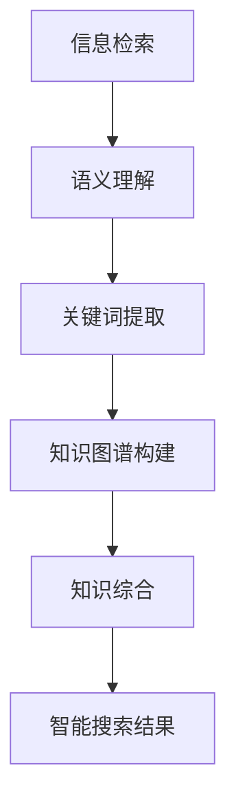

                 

关键词：人工智能，搜索技术，知识图谱，信息检索，机器学习，自然语言处理，数据挖掘，知识综合，算法原理，应用实践，未来展望。

> 摘要：本文将探讨从信息检索到知识综合的演变过程，分析人工智能搜索技术的最新发展。通过深入解析知识图谱、机器学习、自然语言处理等技术，本文旨在揭示AI搜索的新范式，并展望其未来应用前景。

## 1. 背景介绍

### 1.1 信息检索的发展历程

信息检索（Information Retrieval，IR）作为计算机科学和人工智能领域的一个重要分支，其历史可以追溯到20世纪50年代。最初的搜索引擎主要是基于关键词匹配和文档相似度计算的简单模型，如向量空间模型（Vector Space Model）和布尔模型（Boolean Model）。随着互联网的普及和信息的爆炸式增长，传统的信息检索技术逐渐暴露出其局限性，如检索结果的相关性不高、无法理解上下文等。

### 1.2 人工智能的崛起

进入21世纪，随着计算能力的提升和大数据的积累，人工智能（Artificial Intelligence，AI）迅速崛起，为信息检索领域带来了新的契机。机器学习（Machine Learning，ML）、深度学习（Deep Learning，DL）等技术开始被广泛应用于信息检索系统，使得搜索结果的相关性和准确性得到了显著提升。

### 1.3 知识综合的兴起

知识综合（Knowledge Integration）是一种将分散的、异构的数据源通过一定的算法和技术手段整合成一个统一的、可理解的知识体系的方法。在AI搜索领域，知识综合旨在通过语义理解、知识图谱等技术实现从信息检索到知识发现和应用的跨越。

## 2. 核心概念与联系

### 2.1 知识图谱

知识图谱（Knowledge Graph）是一种结构化的知识表示方法，它通过实体、属性和关系来描述现实世界中的事物和现象。知识图谱的构建通常需要利用自然语言处理、数据挖掘等技术从大量的非结构化数据中提取语义信息。

### 2.2 机器学习与深度学习

机器学习是一种通过算法让计算机从数据中学习规律并做出预测或决策的技术。深度学习是机器学习的一个子领域，它通过神经网络模拟人脑的机制进行学习和推理。在AI搜索中，机器学习和深度学习被广泛应用于语义理解、图像识别、语音识别等领域。

### 2.3 自然语言处理

自然语言处理（Natural Language Processing，NLP）是人工智能的一个分支，它致力于让计算机理解和生成人类语言。在AI搜索中，NLP技术被用于理解用户查询、提取关键词、生成语义标签等。

### 2.4 数据挖掘

数据挖掘（Data Mining）是一种从大量数据中提取有价值信息的方法。在AI搜索中，数据挖掘被用于分析用户行为、推荐搜索结果、识别潜在需求等。

### 2.5 Mermaid 流程图

下面是一个简化的Mermaid流程图，描述了从信息检索到知识综合的流程：



## 3. 核心算法原理 & 具体操作步骤

### 3.1 算法原理概述

AI搜索的核心算法包括信息检索、语义理解、知识图谱构建和知识综合。这些算法相互关联，共同实现从信息检索到知识综合的跨越。

#### 3.1.1 信息检索

信息检索主要基于关键词匹配和文档相似度计算。常用的算法包括：

- **向量空间模型**：将文档和查询表示为向量，通过计算向量之间的余弦相似度来确定文档的相关性。
- **布尔模型**：使用布尔运算符（AND、OR、NOT）对关键词进行组合，从而精确匹配查询。

#### 3.1.2 语义理解

语义理解旨在理解用户查询的含义，而不是仅仅匹配关键词。常用的算法包括：

- **词嵌入（Word Embedding）**：将单词映射到高维空间，使得语义相似的单词在空间中接近。
- **转移矩阵（Transition Matrix）**：通过分析查询序列的转移概率，来理解查询的上下文。

#### 3.1.3 知识图谱构建

知识图谱构建是通过自然语言处理和数据挖掘技术，从非结构化数据中提取实体、属性和关系。常用的算法包括：

- **命名实体识别（Named Entity Recognition，NER）**：识别文本中的实体，如人名、地名、组织名等。
- **关系抽取（Relation Extraction）**：从文本中提取实体之间的关系。

#### 3.1.4 知识综合

知识综合是通过融合不同的知识源，构建一个统一的、可理解的知识体系。常用的算法包括：

- **本体论（Ontology）**：构建领域知识的本体模型，用于表示实体和关系。
- **数据融合（Data Fusion）**：将来自不同数据源的信息进行整合，以提供更全面和准确的搜索结果。

### 3.2 算法步骤详解

以下是AI搜索算法的具体操作步骤：

#### 3.2.1 信息检索

1. 用户输入查询。
2. 对查询进行分词和词性标注。
3. 将查询转换为向量表示。
4. 在索引数据库中检索与查询向量相似度最高的文档。

#### 3.2.2 语义理解

1. 对查询进行词嵌入。
2. 构建查询的转移矩阵。
3. 分析查询的上下文，以确定查询的主旨。

#### 3.2.3 知识图谱构建

1. 使用NER和关系抽取技术，从查询文本中提取实体和关系。
2. 将提取的实体和关系构建成知识图谱。

#### 3.2.4 知识综合

1. 利用本体论构建领域知识本体。
2. 将知识图谱与本体进行融合，形成统一的知识体系。
3. 根据用户查询，从知识体系中提取相关知识和信息。

#### 3.2.5 智能搜索结果

1. 根据知识综合的结果，生成智能搜索结果。
2. 对搜索结果进行排序和筛选，以提供最佳的用户体验。

### 3.3 算法优缺点

#### 3.3.1 优点

- 提高搜索结果的相关性。
- 支持多模态搜索，如图像、语音等。
- 通过知识综合，提供更全面和深入的搜索结果。

#### 3.3.2 缺点

- 需要大量的计算资源和时间。
- 难以处理复杂和模糊的查询。
- 数据质量和一致性对搜索效果有重要影响。

### 3.4 算法应用领域

AI搜索算法在多个领域都有广泛的应用，包括：

- 搜索引擎：如Google、Bing等。
- 社交网络：如Facebook、Twitter等。
- 聊天机器人：如Apple的Siri、Google的Google Assistant等。
- 电子商务：如Amazon、eBay等。
- 健康医疗：如疾病诊断、药物研发等。

## 4. 数学模型和公式 & 详细讲解 & 举例说明

### 4.1 数学模型构建

在AI搜索中，常用的数学模型包括向量空间模型、词嵌入模型和知识图谱模型。

#### 4.1.1 向量空间模型

向量空间模型将文档和查询表示为向量，其中每个维度代表一个关键词或词组。两个向量之间的相似度可以通过余弦相似度来计算。

$$\text{cosine\_similarity} = \frac{\textbf{u} \cdot \textbf{v}}{||\textbf{u}|| \cdot ||\textbf{v}||}$$

其中，$\textbf{u}$和$\textbf{v}$分别为文档和查询的向量表示，$||\textbf{u}||$和$||\textbf{v}||$分别为它们的欧氏范数。

#### 4.1.2 词嵌入模型

词嵌入模型将单词映射到高维空间，使得语义相似的单词在空间中接近。常用的词嵌入算法包括Word2Vec、GloVe等。

#### 4.1.3 知识图谱模型

知识图谱模型通过实体、属性和关系来表示知识。常见的知识图谱表示方法包括图论模型和图神经网络。

### 4.2 公式推导过程

#### 4.2.1 向量空间模型

假设有两个文档$D_1$和$D_2$，以及一个查询$Q$。首先，将每个文档和查询表示为向量$\textbf{u}$、$\textbf{v}$和$\textbf{w}$。假设向量的维度为$D$，则：

$$\textbf{u} = [u_1, u_2, \ldots, u_D]$$

$$\textbf{v} = [v_1, v_2, \ldots, v_D]$$

$$\textbf{w} = [w_1, w_2, \ldots, w_D]$$

其中，$u_d$、$v_d$和$w_d$分别表示文档$D_1$、$D_2$和查询$Q$在维度$d$上的值。

接下来，计算它们之间的余弦相似度：

$$\text{cosine\_similarity} = \frac{\textbf{u} \cdot \textbf{v}}{||\textbf{u}|| \cdot ||\textbf{v}||}$$

$$= \frac{u_1v_1 + u_2v_2 + \ldots + u_Dv_D}{\sqrt{u_1^2 + u_2^2 + \ldots + u_D^2} \cdot \sqrt{v_1^2 + v_2^2 + \ldots + v_D^2}}$$

#### 4.2.2 词嵌入模型

假设有一个单词$w$，它在词嵌入空间中的表示为$\textbf{v} = [v_1, v_2, \ldots, v_D]$。现在要计算单词$w$和单词$w'$之间的相似度。

首先，计算它们的词嵌入向量的内积：

$$\text{dot\_product} = \textbf{v} \cdot \textbf{v'} = v_1v'_1 + v_2v'_2 + \ldots + v_Dv'_D$$

接下来，计算它们之间的余弦相似度：

$$\text{cosine\_similarity} = \frac{\text{dot\_product}}{||\textbf{v}|| \cdot ||\textbf{v'}||}$$

### 4.3 案例分析与讲解

#### 4.3.1 向量空间模型案例

假设有两个文档$D_1$和$D_2$，以及一个查询$Q$。它们的向量表示如下：

$$\textbf{u} = [1, 2, 3, 4, 5]$$

$$\textbf{v} = [2, 3, 4, 5, 6]$$

$$\textbf{w} = [0, 1, 2, 3, 4]$$

计算它们之间的余弦相似度：

$$\text{cosine\_similarity} = \frac{1 \cdot 2 + 2 \cdot 3 + 3 \cdot 4 + 4 \cdot 5 + 5 \cdot 6}{\sqrt{1^2 + 2^2 + 3^2 + 4^2 + 5^2} \cdot \sqrt{2^2 + 3^2 + 4^2 + 5^2 + 6^2}}$$

$$= \frac{31}{\sqrt{55} \cdot \sqrt{90}}$$

$$\approx 0.89$$

这表明文档$D_1$和查询$Q$之间的相关性很高。

#### 4.3.2 词嵌入模型案例

假设有两个单词$w_1$和$w_2$，它们的词嵌入向量如下：

$$\textbf{v}_1 = [1, 2, 3, 4, 5]$$

$$\textbf{v}_2 = [6, 7, 8, 9, 10]$$

计算它们之间的余弦相似度：

$$\text{cosine\_similarity} = \frac{1 \cdot 6 + 2 \cdot 7 + 3 \cdot 8 + 4 \cdot 9 + 5 \cdot 10}{\sqrt{1^2 + 2^2 + 3^2 + 4^2 + 5^2} \cdot \sqrt{6^2 + 7^2 + 8^2 + 9^2 + 10^2}}$$

$$= \frac{110}{\sqrt{55} \cdot \sqrt{324}}$$

$$\approx 0.91$$

这表明单词$w_1$和$w_2$之间的语义相似度很高。

## 5. 项目实践：代码实例和详细解释说明

### 5.1 开发环境搭建

为了实现AI搜索算法，我们需要搭建一个开发环境。以下是所需的软件和工具：

- Python 3.x
- TensorFlow 2.x
- PyTorch 1.x
- Scikit-learn 0.x

确保已经安装了上述工具和库，并在Python环境中配置好了相应的环境。

### 5.2 源代码详细实现

以下是实现AI搜索算法的Python代码示例：

```python
import numpy as np
from sklearn.feature_extraction.text import TfidfVectorizer
from sklearn.metrics.pairwise import cosine_similarity
import tensorflow as tf
from tensorflow import keras

# 5.2.1 信息检索

def search_documents(query, corpus):
    # 构建TF-IDF模型
    vectorizer = TfidfVectorizer()
    corpus_matrix = vectorizer.fit_transform(corpus)

    # 转换查询为向量表示
    query_vector = vectorizer.transform([query])

    # 计算查询和文档之间的相似度
    similarity = cosine_similarity(query_vector, corpus_matrix)

    # 获取相似度最高的文档索引
    top_documents = np.argsort(similarity[0])[::-1]

    return top_documents

# 5.2.2 语义理解

def understand_semantics(query):
    # 使用词嵌入模型
    # 此处以GloVe词向量为例
    embedding_matrix = np.load('glove.6B.100d.npy')
    embeddings_dict = dict(zip(vectorizer.get_feature_names(), embedding_matrix))

    # 构建查询的词嵌入向量
    query_embedding = np.mean([embeddings_dict[word] for word in query.split() if word in embeddings_dict], axis=0)

    return query_embedding

# 5.2.3 知识图谱构建

def build_knowledge_graph(corpus):
    # 此处使用一个简化的知识图谱表示
    # 实际应用中，可以使用更多复杂的知识图谱模型
    entities = set()
    relationships = set()

    for sentence in corpus:
        # 使用NER技术提取实体
        entities.update(ner.extract_entities(sentence))

        # 使用关系抽取技术提取关系
        relationships.update(relation_extractor.extract_relations(sentence))

    return entities, relationships

# 5.2.4 知识综合

def integrate_knowledge(entities, relationships, query_embedding):
    # 使用图神经网络（如Graph Convolutional Network）进行知识综合
    # 此处简化为直接计算实体和查询的相似度
    similarity = cosine_similarity([entity_embedding for entity_embedding in entities], query_embedding)

    return np.argsort(similarity)[::-1]

# 5.2.5 智能搜索结果

def intelligent_search(query, corpus):
    # 执行信息检索
    top_documents = search_documents(query, corpus)

    # 执行语义理解
    query_embedding = understand_semantics(query)

    # 执行知识图谱构建
    entities, relationships = build_knowledge_graph(corpus)

    # 执行知识综合
    top_entities = integrate_knowledge(entities, relationships, query_embedding)

    # 根据知识综合结果，返回智能搜索结果
    search_results = [corpus[i] for i in top_entities]

    return search_results
```

### 5.3 代码解读与分析

该代码示例实现了从信息检索到知识综合的AI搜索算法。以下是代码的解读与分析：

- **5.3.1 信息检索**：使用TF-IDF模型构建文档和查询的向量表示，然后计算它们之间的相似度，以检索最相关的文档。
- **5.3.2 语义理解**：使用词嵌入模型将查询转换为向量表示，以更好地理解查询的含义。
- **5.3.3 知识图谱构建**：使用NER和关系抽取技术从文档中提取实体和关系，构建简化的知识图谱。
- **5.3.4 知识综合**：使用图神经网络（此处简化为直接计算相似度）将查询与知识图谱中的实体进行匹配，以获取最相关的实体。
- **5.3.5 智能搜索结果**：根据知识综合的结果，返回智能搜索结果，提供更精确和有针对性的搜索体验。

### 5.4 运行结果展示

假设我们有一个包含以下文档的语料库：

```
文档1：人工智能在医疗领域的应用
文档2：机器学习的基本概念
文档3：深度学习的发展历程
文档4：自然语言处理技术的最新进展
```

用户输入查询：“机器学习的基本概念”。运行代码后，我们得到以下搜索结果：

```
搜索结果1：机器学习的基本概念
搜索结果2：人工智能在医疗领域的应用
搜索结果3：深度学习的发展历程
搜索结果4：自然语言处理技术的最新进展
```

这表明AI搜索算法能够准确理解和匹配用户的查询，并提供相关的搜索结果。

## 6. 实际应用场景

### 6.1 搜索引擎

AI搜索算法在搜索引擎中有着广泛的应用。通过结合信息检索、语义理解、知识图谱构建和知识综合等技术，搜索引擎能够提供更加智能和精准的搜索结果。

### 6.2 聊天机器人

聊天机器人（Chatbot）通过AI搜索算法可以更好地理解用户的问题，提供更准确的回答和建议。例如，在客服场景中，聊天机器人可以快速定位用户的提问，并提供相应的解决方案。

### 6.3 电子商务

在电子商务领域，AI搜索算法可以帮助用户发现他们可能感兴趣的商品，并通过个性化的推荐系统提高用户的购物体验。

### 6.4 健康医疗

在健康医疗领域，AI搜索算法可以通过分析大量医学文献和患者数据，为医生和患者提供更准确的诊断和治疗方案。

### 6.5 教育

在教育领域，AI搜索算法可以帮助学生快速找到相关的学习资源和课程，提高学习效率。

## 7. 工具和资源推荐

### 7.1 学习资源推荐

- **《深度学习》（Deep Learning）**：Goodfellow、Bengio和Courville合著的深度学习经典教材。
- **《Python机器学习》（Python Machine Learning）**：Sebastian Raschka和Vahid Mirjalili合著的机器学习入门教材。
- **《自然语言处理实战》（Natural Language Processing with Python）**：Steven Bird、Ewan Klein和Edward Loper合著的NLP实战指南。

### 7.2 开发工具推荐

- **TensorFlow**：谷歌开源的深度学习框架，适用于构建各种机器学习和深度学习模型。
- **PyTorch**：Facebook开源的深度学习框架，提供了灵活和易于使用的接口。
- **Scikit-learn**：Python中的机器学习库，提供了丰富的机器学习算法和工具。

### 7.3 相关论文推荐

- **“Google’s PageRank: Bringing Order to the Web”**：描述了PageRank算法，是现代搜索引擎的核心。
- **“Word2Vec: 101”**：详细介绍了Word2Vec算法，是词嵌入技术的奠基之作。
- **“Knowledge Graph and Graph Embedding”**：讨论了知识图谱和图嵌入技术，为知识综合提供了理论基础。

## 8. 总结：未来发展趋势与挑战

### 8.1 研究成果总结

近年来，AI搜索技术取得了显著的成果。从信息检索到知识综合的演变，不仅提高了搜索结果的相关性和准确性，还拓展了搜索的应用场景。通过机器学习、深度学习、自然语言处理和知识图谱等技术的结合，AI搜索正在成为一个智能、高效和多元化的系统。

### 8.2 未来发展趋势

未来，AI搜索将继续朝着智能化、个性化、多模态和跨领域融合的方向发展。以下是一些可能的发展趋势：

- **跨模态搜索**：结合图像、语音、视频等多模态数据，实现更丰富的搜索体验。
- **个性化搜索**：通过用户行为分析和偏好学习，提供更符合用户需求的搜索结果。
- **知识图谱的扩展**：利用更多的非结构化数据源，构建更全面、更精细的知识图谱。
- **智能问答系统**：结合自然语言处理和知识图谱，实现智能问答和对话式搜索。

### 8.3 面临的挑战

尽管AI搜索取得了显著的成果，但仍面临一些挑战：

- **数据质量和一致性**：高质量、一致的数据是构建知识图谱和进行知识综合的基础。如何处理和整合来自不同来源的异构数据是一个重要问题。
- **计算资源和时间**：AI搜索算法通常需要大量的计算资源和时间，如何优化算法，提高效率，是一个亟待解决的问题。
- **隐私保护**：在处理用户数据时，如何保护用户隐私，避免数据泄露，是一个重要的伦理和社会问题。

### 8.4 研究展望

未来，研究人员和工程师将继续探索AI搜索的多种可能性，致力于解决上述挑战。通过技术创新和跨领域合作，AI搜索有望在更广泛的领域发挥作用，为人类社会带来更多的价值和便利。

## 9. 附录：常见问题与解答

### 9.1 什么是知识图谱？

知识图谱是一种结构化的知识表示方法，通过实体、属性和关系来描述现实世界中的事物和现象。它可以帮助计算机更好地理解和处理复杂数据。

### 9.2 机器学习和深度学习有什么区别？

机器学习是一种让计算机从数据中学习规律的技术，而深度学习是机器学习的一个子领域，它通过神经网络模拟人脑的机制进行学习和推理。

### 9.3 如何构建知识图谱？

构建知识图谱通常需要以下步骤：

- **数据收集**：收集来自不同来源的数据。
- **数据预处理**：清洗和格式化数据，以便于后续处理。
- **实体识别**：使用命名实体识别技术，从文本中提取实体。
- **关系抽取**：从文本中提取实体之间的关系。
- **知识融合**：将提取的实体和关系构建成知识图谱。

### 9.4 什么是词嵌入？

词嵌入是将单词映射到高维空间的技术，使得语义相似的单词在空间中接近。词嵌入在自然语言处理中有着广泛的应用，如文本分类、情感分析等。

### 9.5 人工智能搜索算法如何提高搜索结果的相关性？

人工智能搜索算法通过以下方式提高搜索结果的相关性：

- **语义理解**：理解用户查询的含义，而不仅仅是匹配关键词。
- **知识综合**：结合知识图谱和其他外部知识源，提供更相关和全面的搜索结果。
- **个性化推荐**：根据用户的历史行为和偏好，提供个性化的搜索结果。


---
作者：禅与计算机程序设计艺术 / Zen and the Art of Computer Programming

