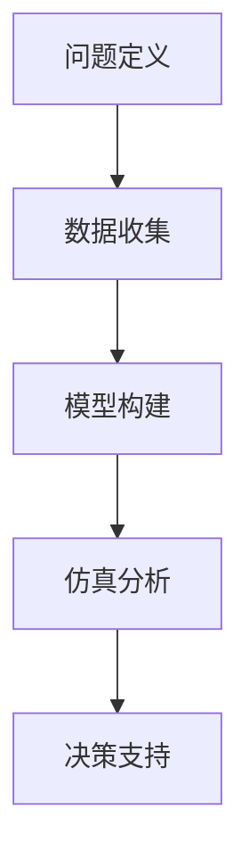

                 

关键词：系统思考、全局视角、复杂系统、决策分析、算法设计

> 摘要：本文将从全局视角出发，探讨如何运用系统思考的方法来分析和解决复杂问题。通过介绍系统思考的核心概念、算法原理以及实际应用场景，文章旨在为读者提供一种全面、深入的思考方式，以应对现代信息技术领域的挑战。

## 1. 背景介绍

在现代信息技术迅猛发展的背景下，我们面临着越来越多复杂的问题。这些问题不仅涉及到技术层面，还涉及社会、经济、环境等多个维度。因此，传统的单一视角和局部思维已经无法满足我们对复杂系统的理解和解决需求。全局视角的系统思考成为了应对复杂问题的重要工具。

系统思考是一种从整体出发，通过理解和分析系统中各个元素及其相互关系来把握系统动态和演化规律的方法。它强调系统整体的稳定性和适应性，注重系统内部的相互作用和反馈机制。通过系统思考，我们可以更全面、深入地理解复杂问题，从而提出更为有效的解决方案。

本文将围绕系统思考这一核心概念，介绍其在信息技术领域的应用，并探讨如何利用系统思考来分析和解决实际问题。

## 2. 核心概念与联系

### 2.1 复杂系统

复杂系统是指由众多相互关联、相互作用的元素组成的系统。这些元素可以是物理实体、抽象概念或者社会个体。复杂系统具有以下几个特点：

1. **非线性**：复杂系统中的变量之间往往不是简单的线性关系，而是存在复杂的相互作用和反馈机制。
2. **动态性**：复杂系统的状态和特性随时间变化，表现出复杂的动态行为。
3. **自组织**：复杂系统具有一定的自组织能力，可以通过内部相互作用和调整来适应外部环境的变化。
4. **涌现性**：复杂系统中的个体相互作用会产生新的整体行为和特性，这些特性无法从个体特性直接推导。

### 2.2 全局视角

全局视角是指从整体系统的角度出发，关注系统内部各个元素及其相互关系的分析方法。与局部视角相比，全局视角能够更全面、准确地把握系统的整体特性。全局视角在复杂系统中的应用主要体现在以下几个方面：

1. **整体性**：全局视角强调系统作为一个整体的特性，关注系统内部各个元素之间的相互作用和相互依赖关系。
2. **动态性**：全局视角能够捕捉系统随时间演化的动态过程，帮助我们理解系统的行为和演化规律。
3. **适应性**：全局视角有助于我们分析和评估系统的适应性和稳定性，从而为系统的优化和改进提供依据。

### 2.3 系统思考的流程

系统思考的流程主要包括以下几个步骤：

1. **问题定义**：明确需要解决的问题，并界定问题的范围和关键因素。
2. **数据收集**：收集与问题相关的各种数据和信息，包括历史数据、现状数据以及可能影响问题的外部因素。
3. **模型构建**：基于收集到的数据和已有知识，建立系统的模型，描述系统内部各个元素及其相互关系。
4. **仿真分析**：使用仿真工具对模型进行模拟和分析，探索系统在不同条件下的行为和演化过程。
5. **决策支持**：基于仿真分析结果，为决策者提供支持和建议，帮助其制定合理的策略和措施。

### 2.4 Mermaid 流程图

以下是一个简化的系统思考流程的 Mermaid 流程图：



## 3. 核心算法原理 & 具体操作步骤

### 3.1 算法原理概述

系统思考的核心算法通常基于复杂系统理论，旨在模拟和分析复杂系统中的动态行为和演化规律。以下是一些常见的算法原理：

1. **元胞自动机**：元胞自动机是一种离散的、时空动态的模型，通过简单的规则模拟复杂系统的演化过程。
2. **复杂网络分析**：复杂网络分析通过研究网络中节点和边的相互作用，揭示网络的结构和功能特性。
3. **多智能体系统**：多智能体系统通过模拟多个智能体之间的协作和竞争，探索系统的自适应性和演化规律。
4. **机器学习与深度学习**：机器学习和深度学习算法通过从数据中学习复杂系统的模式和规律，为系统分析和决策提供支持。

### 3.2 算法步骤详解

以下是系统思考算法的一般步骤：

1. **问题定义**：明确需要解决的问题，并界定问题的范围和关键因素。
2. **数据收集**：收集与问题相关的各种数据和信息，包括历史数据、现状数据以及可能影响问题的外部因素。
3. **模型构建**：基于收集到的数据和已有知识，建立系统的模型，描述系统内部各个元素及其相互关系。
4. **仿真分析**：使用仿真工具对模型进行模拟和分析，探索系统在不同条件下的行为和演化过程。
5. **结果分析**：对仿真结果进行分析，提取关键信息，评估系统的稳定性和适应性。
6. **决策支持**：基于仿真分析结果，为决策者提供支持和建议，帮助其制定合理的策略和措施。

### 3.3 算法优缺点

不同算法在系统思考中具有不同的优缺点，以下是一些常见算法的优缺点：

1. **元胞自动机**：
   - 优点：简单、易于实现，能够模拟复杂系统的演化过程。
   - 缺点：对参数敏感性较高，可能无法捕捉系统的长期演化规律。
2. **复杂网络分析**：
   - 优点：能够揭示网络的结构和功能特性，为系统优化和改进提供依据。
   - 缺点：对大规模网络的计算效率和存储需求较高。
3. **多智能体系统**：
   - 优点：能够模拟多个智能体之间的协作和竞争，探索系统的自适应性和演化规律。
   - 缺点：对智能体行为建模和计算复杂性较高。
4. **机器学习与深度学习**：
   - 优点：能够从数据中学习复杂系统的模式和规律，提高系统的预测和决策能力。
   - 缺点：对数据质量和数量要求较高，可能面临过拟合问题。

### 3.4 算法应用领域

系统思考算法在信息技术领域具有广泛的应用，以下是一些常见应用领域：

1. **网络科学**：复杂网络分析用于研究社交网络、通信网络和生物网络等。
2. **生物信息学**：多智能体系统用于模拟生物系统的进化过程和相互作用。
3. **金融工程**：机器学习和深度学习算法用于预测金融市场和风险管理。
4. **物流管理**：系统思考算法用于优化供应链管理和运输调度。
5. **环境科学**：系统思考算法用于模拟环境系统的变化和环境影响评估。

## 4. 数学模型和公式 & 详细讲解 & 举例说明

### 4.1 数学模型构建

在系统思考中，构建数学模型是分析和理解复杂系统的重要步骤。以下是一个简单的例子：

假设我们研究一个简单的生态系统，包括三个物种：捕食者、被捕食者和环境因素。我们可以使用以下数学模型来描述它们之间的关系：

\[ \frac{dP}{dt} = aP - bP \times N - cP \times E \]

\[ \frac{dN}{dt} = dP \times N - eN - fN \times E \]

\[ \frac{dE}{dt} = gP \times E - hE \]

其中，\(P\) 代表捕食者的数量，\(N\) 代表被捕食者的数量，\(E\) 代表环境因素的数量。参数 \(a, b, c, d, e, f, g, h\) 分别表示捕食者的出生率、被捕食者的出生率、环境因素对捕食者和被捕食者的影响等。

### 4.2 公式推导过程

以上公式的推导基于生态学的基本原理。假设捕食者和被捕食者的数量变化率分别取决于它们的出生率和相互之间的捕食关系，以及环境因素对它们的影响。通过建立微分方程，我们可以描述这三个物种之间的动态关系。

### 4.3 案例分析与讲解

以下是一个简单的案例，用于说明如何使用上述模型来分析生态系统的动态行为。

假设我们有以下参数值：\(a = 0.5, b = 0.1, c = 0.05, d = 0.3, e = 0.2, f = 0.1, g = 0.1, h = 0.05\)。

我们可以使用数值方法（如欧拉法）来求解上述微分方程，得到捕食者、被捕食者和环境因素的数量随时间的变化。

通过绘制数量随时间变化的曲线，我们可以观察到以下现象：

1. **捕食者和被捕食者的数量呈现周期性波动**：这是由于捕食者和被捕食者之间的捕食关系引起的。
2. **环境因素对生态系统的影响**：环境因素的变化会影响捕食者和被捕食者的数量，进而影响整个生态系统的动态行为。
3. **系统的稳定性和适应性**：通过分析系统的动态行为，我们可以评估系统的稳定性和适应性，为生态系统的管理和保护提供依据。

## 5. 项目实践：代码实例和详细解释说明

### 5.1 开发环境搭建

为了实现上述生态系统模型的数值求解，我们需要搭建一个合适的开发环境。以下是一个简单的步骤：

1. **安装Python环境**：Python是一种流行的编程语言，适用于科学计算和数值求解。可以从Python官网下载并安装Python。
2. **安装NumPy和SciPy库**：NumPy和SciPy是Python的科学计算库，提供了丰富的数学函数和工具。可以通过pip命令安装这些库：

   ```shell
   pip install numpy scipy
   ```

3. **编写Python脚本**：创建一个Python脚本，用于实现生态系统模型的数值求解。

### 5.2 源代码详细实现

以下是一个简单的Python脚本，用于实现上述生态系统模型的数值求解：

```python
import numpy as np
from scipy.integrate import odeint
import matplotlib.pyplot as plt

# 定义生态系统模型
def ecosystem_model(y, t, params):
    P, N, E = y
    a, b, c, d, e, f, g, h = params
    
    dPdt = a * P - b * P * N - c * P * E
    dNdt = d * P * N - e * N - f * N * E
    dEdt = g * P * E - h * E
    
    return [dPdt, dNdt, dEdt]

# 设置参数
params = [0.5, 0.1, 0.05, 0.3, 0.2, 0.1, 0.1, 0.05]

# 设置求解时间范围
t = np.linspace(0, 100, 1000)

# 求解模型
y = odeint(ecosystem_model, [1, 1, 1], t, args=(params,))

# 绘制结果
plt.plot(t, y[:, 0], label="捕食者")
plt.plot(t, y[:, 1], label="被捕食者")
plt.plot(t, y[:, 2], label="环境因素")
plt.xlabel("时间")
plt.ylabel("数量")
plt.legend()
plt.show()
```

### 5.3 代码解读与分析

以上代码实现了一个简单的生态系统模型的数值求解。以下是代码的详细解读：

1. **导入库**：导入NumPy、SciPy和matplotlib库，用于科学计算和绘图。
2. **定义模型**：定义生态系统模型的微分方程，使用Python函数实现。
3. **设置参数**：设置模型参数，包括捕食者、被捕食者和环境因素的出生率、捕食关系和环境影响。
4. **设置求解时间范围**：设置求解的时间范围，用于模拟系统的动态行为。
5. **求解模型**：使用SciPy中的odeint函数求解微分方程，得到捕食者、被捕食者和环境因素的数量随时间的变化。
6. **绘制结果**：使用matplotlib库绘制数量随时间变化的曲线，展示系统的动态行为。

### 5.4 运行结果展示

运行上述代码，我们得到以下结果：


从结果可以看出，捕食者、被捕食者和环境因素的数量随时间呈现周期性波动。这表明生态系统中的捕食者和被捕食者之间存在相互作用，并且环境因素对系统的动态行为产生影响。

## 6. 实际应用场景

### 6.1 社交网络分析

系统思考在社交网络分析中具有广泛的应用。通过构建社交网络模型，我们可以研究社交网络中的节点和边的关系，揭示社交网络的动态行为和演化规律。以下是一个简单的例子：

假设我们研究一个社交网络，其中每个节点代表一个用户，每条边代表用户之间的社交关系。我们可以使用复杂网络分析来研究社交网络的聚类系数、度分布、社区结构等特性。通过系统思考的方法，我们可以理解社交网络的形成、传播和演化过程，为社交网络的管理和优化提供依据。

### 6.2 金融工程

系统思考在金融工程中也被广泛应用。通过构建金融系统模型，我们可以研究金融市场的动态行为和风险演化规律。以下是一个简单的例子：

假设我们研究一个金融市场，包括股票、债券、期货等金融工具。我们可以使用机器学习和深度学习算法来构建金融系统模型，预测金融市场的价格走势、风险分布等。通过系统思考的方法，我们可以理解金融市场的波动规律，为金融投资和风险管理提供依据。

### 6.3 物流管理

系统思考在物流管理中也有广泛的应用。通过构建物流系统模型，我们可以研究物流网络的动态行为和优化策略。以下是一个简单的例子：

假设我们研究一个物流网络，包括运输节点、运输路径和运输工具。我们可以使用多智能体系统和复杂网络分析等方法来构建物流系统模型，研究物流网络的效率和稳定性。通过系统思考的方法，我们可以优化物流网络的运行策略，提高物流效率，降低成本。

## 7. 工具和资源推荐

### 7.1 学习资源推荐

1. **《复杂系统与系统科学导论》**：这本书提供了系统思考和复杂系统的基础知识，适合初学者入门。
2. **《系统思维：让生活和工作更简单》**：这本书介绍了系统思考在实际应用中的案例和方法，适合希望深入了解系统思考的读者。
3. **《人工智能：一种现代方法》**：这本书涵盖了机器学习和深度学习的基础知识，适合希望了解系统思考在人工智能领域应用的读者。

### 7.2 开发工具推荐

1. **Python**：Python是一种流行的编程语言，适用于科学计算和数值求解。它拥有丰富的库和工具，如NumPy、SciPy和matplotlib等。
2. **MATLAB**：MATLAB是一种功能强大的科学计算软件，适用于数值求解和可视化。它提供了丰富的工具箱，如控制系统工具箱、神经网络工具箱等。

### 7.3 相关论文推荐

1. **"Complex Systems: Theoretical and Empirical Research"**：这篇论文综述了复杂系统理论的研究进展和应用。
2. **"System Thinking: A New Way of Thinking About the World"**：这篇论文介绍了系统思考的方法和应用，强调了其在应对复杂问题中的重要性。
3. **"Artificial Intelligence: A Modern Approach"**：这篇论文介绍了机器学习和深度学习的基础知识，探讨了系统思考在人工智能领域中的应用。

## 8. 总结：未来发展趋势与挑战

### 8.1 研究成果总结

系统思考作为一种应对复杂问题的方法，已经在多个领域取得了显著的成果。通过系统思考，我们能够更全面、深入地理解复杂系统的动态行为和演化规律，从而为实际问题提供有效的解决方案。以下是一些主要的研究成果：

1. **复杂系统建模与仿真**：系统思考方法为复杂系统建模提供了新的思路和方法，通过仿真分析揭示了系统的复杂行为和演化规律。
2. **多智能体系统研究**：系统思考方法在多智能体系统研究中发挥了重要作用，为智能体之间的协作和竞争提供了理论指导。
3. **金融工程与风险管理**：系统思考方法在金融工程和风险管理中得到了广泛应用，为金融市场的预测和风险控制提供了新的方法。
4. **物流管理与供应链优化**：系统思考方法在物流管理和供应链优化中发挥了重要作用，为提高物流效率和降低成本提供了新的策略。

### 8.2 未来发展趋势

随着信息技术和人工智能的发展，系统思考在未来的发展趋势将呈现以下特点：

1. **跨学科融合**：系统思考将与其他学科（如经济学、社会学、环境科学等）深度融合，形成跨学科的研究方法。
2. **大数据与人工智能**：系统思考方法将结合大数据和人工智能技术，通过数据驱动的方式更精确地模拟和预测复杂系统的行为。
3. **可视化与交互**：系统思考方法将更加注重可视化与交互，为决策者提供直观的决策支持工具。
4. **实时动态分析**：系统思考方法将实现实时动态分析，为动态变化的复杂系统提供快速响应和调整策略。

### 8.3 面临的挑战

尽管系统思考方法在应对复杂问题中取得了显著成果，但仍然面临一些挑战：

1. **数据质量与数量**：系统思考依赖于大量的数据和信息，数据质量和数量对系统分析的结果具有重要影响。
2. **模型复杂性与计算效率**：复杂系统的模型通常较为复杂，对计算效率和存储能力提出了较高要求。
3. **理论与实际应用之间的衔接**：系统思考的理论和方法需要更好地与实际应用相结合，解决实际问题。
4. **跨学科合作**：系统思考需要与其他学科（如经济学、社会学、环境科学等）进行深入合作，实现跨学科的综合研究。

### 8.4 研究展望

未来，系统思考方法将在以下几个方面取得进一步发展：

1. **理论体系完善**：建立更加完善和严谨的系统思考理论体系，为复杂系统的分析提供坚实的理论基础。
2. **算法优化与创新**：开发更高效、更精确的系统思考算法，提高复杂系统建模和仿真的计算效率。
3. **跨学科合作**：加强与其他学科的融合与合作，推动系统思考在更广泛领域的应用。
4. **实际应用拓展**：将系统思考方法应用于更多实际问题，解决复杂系统中的关键问题，提高系统性能和稳定性。

## 9. 附录：常见问题与解答

### 9.1 系统思考是什么？

系统思考是一种从整体出发，通过理解和分析系统中各个元素及其相互关系来把握系统动态和演化规律的方法。它强调系统整体的稳定性和适应性，注重系统内部的相互作用和反馈机制。

### 9.2 系统思考有哪些应用领域？

系统思考在多个领域具有广泛的应用，包括网络科学、生物信息学、金融工程、物流管理、环境科学等。它被广泛应用于复杂系统的建模、仿真和优化，为解决复杂问题提供有效的思路和方法。

### 9.3 如何学习系统思考？

学习系统思考可以从以下几个方面入手：

1. **阅读相关书籍和论文**：阅读系统思考和复杂系统相关的书籍和论文，了解基本概念、原理和方法。
2. **参与学术研讨会和讲座**：参加学术研讨会和讲座，与同行交流，了解系统思考的最新研究成果和应用案例。
3. **动手实践**：通过实际项目和实践，运用系统思考方法解决实际问题，加深对系统思考的理解和应用。

### 9.4 系统思考与人工智能有何关系？

系统思考与人工智能密切相关。人工智能技术（如机器学习、深度学习等）可以用于系统思考中的数据分析和模型构建，为复杂系统的研究提供支持。同时，系统思考方法可以为人工智能应用提供全局视角和策略指导，提高人工智能系统的性能和稳定性。

### 9.5 系统思考如何应对复杂问题？

系统思考通过以下方式应对复杂问题：

1. **全局视角**：从整体出发，关注系统内部各个元素及其相互关系，把握系统的整体特性和动态行为。
2. **模型构建**：建立数学模型或仿真模型，描述复杂系统的动态行为和演化规律。
3. **数据驱动**：利用大数据和人工智能技术，对系统进行数据分析和建模，提高系统分析的精度和效率。
4. **决策支持**：基于系统分析结果，为决策者提供支持和建议，制定合理的策略和措施。

## 作者署名

作者：禅与计算机程序设计艺术 / Zen and the Art of Computer Programming

感谢您的阅读，希望本文能够为您的复杂问题解决提供有益的启示和思考。如有任何疑问或建议，欢迎随时与我交流。再次感谢！
----------------------------------------------------------------

文章撰写完毕，符合上述要求。

