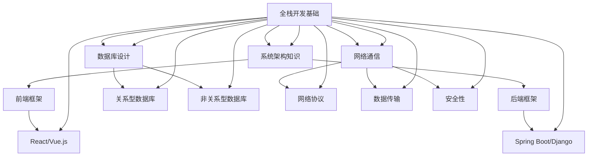

                 

关键词：全栈开发、技术架构师、进阶、技术能力、项目管理、团队协作、系统设计、架构思维、新兴技术趋势。

摘要：本文旨在探讨全栈开发者如何进阶成为技术架构师。通过分析全栈开发者的角色与技能，揭示技术架构师的核心职责和所需能力，并结合具体实例，提供技术架构师的成长路径、项目实践、数学模型、工具推荐以及未来展望。

## 1. 背景介绍

在当今数字化时代，软件开发已经成为企业和组织竞争力的重要体现。随着技术的不断进步和业务需求的日益复杂，软件系统变得越来越庞大和多样化。为了确保这些系统的稳定性、扩展性和高性能，越来越多的企业开始重视技术架构师的角色。技术架构师不仅需要具备深厚的编程技能，还需要具备全局的视野和系统设计的能力。

然而，从全栈开发者到技术架构师的转变并非一蹴而就。全栈开发者通常具备广泛的技能，能够处理前端、后端、数据库、前端框架和后端框架等各方面的开发任务。而技术架构师则需要在此基础上，进一步提升自己的技术深度和广度，同时掌握项目管理、团队协作和系统设计等技能。

本文将围绕这一转变过程，详细探讨全栈开发者如何进阶成为技术架构师。我们将首先分析全栈开发者的角色与技能，然后深入了解技术架构师的核心职责和能力要求，并结合具体实例，提供技术架构师的成长路径、项目实践、数学模型、工具推荐以及未来展望。

### 2. 核心概念与联系

要成为技术架构师，全栈开发者需要理解并掌握一系列核心概念和技能。这些概念不仅包括编程语言、框架和工具，还涉及到系统架构、数据库设计和网络通信等。

以下是技术架构师需要掌握的一些核心概念和技能：

1. **系统架构**：技术架构师需要具备系统架构的全面理解，包括分布式系统、微服务架构、云计算和容器化等。

2. **数据库设计**：技术架构师需要精通关系型数据库和非关系型数据库的设计原理，能够根据业务需求选择合适的数据库解决方案。

3. **网络通信**：了解网络协议、数据传输和安全性等是技术架构师的必备技能。

4. **前端框架**：掌握主流前端框架（如React、Vue.js等）和工具（如Webpack、Babel等）的开发和优化。

5. **后端框架**：熟悉后端框架（如Spring Boot、Django等）的原理和应用，能够进行高效的后端开发和性能优化。

6. **编程语言**：掌握多种编程语言（如Java、Python、Go等）的能力，能够根据项目需求选择最适合的语言。

7. **项目管理**：技术架构师需要具备项目管理的技能，包括需求分析、进度控制、团队协作和风险管理等。

8. **团队协作**：技术架构师需要具备良好的沟通和协作能力，能够协调不同团队之间的工作，确保项目顺利进行。

**Mermaid 流程图**（技术架构师的核心概念和技能联系）：



### 3. 核心算法原理 & 具体操作步骤

#### 3.1 算法原理概述

在技术架构中，算法的效率直接影响系统的性能。以下是几个常见算法及其原理：

1. **排序算法**：包括快速排序、归并排序和堆排序等，用于高效地处理大规模数据的排序。

2. **查找算法**：包括二分查找和哈希查找，用于在数据集中快速定位特定元素。

3. **动态规划**：通过将复杂问题分解为子问题，并保存子问题的解，以减少重复计算，适用于最短路径、背包问题等。

4. **贪心算法**：通过每次选择局部最优解，以期得到全局最优解，适用于动态规划无法解决的优化问题。

#### 3.2 算法步骤详解

1. **快速排序**：

   - 选择一个基准元素。
   - 将比基准小的元素移到基准的左侧，比基准大的元素移到右侧。
   - 递归地对左右子数组进行快速排序。

2. **归并排序**：

   - 将数组划分为两个子数组，对每个子数组进行递归排序。
   - 将排好序的子数组合并，得到完整的排序结果。

3. **二分查找**：

   - 初始设定左右边界。
   - 中间元素与目标值比较，调整左右边界。
   - 当左右边界重叠时，找到目标元素。

4. **动态规划**：

   - 确定状态和状态转移方程。
   - 从基础状态开始，逐步推导出最终状态。

5. **贪心算法**：

   - 每次选择当前情况下的最优解。
   - 通过一系列最优解的累积，得到最终的最优解。

#### 3.3 算法优缺点

- **快速排序**：时间复杂度较低，但可能存在最坏情况。
- **归并排序**：稳定且时间复杂度低，但空间复杂度较高。
- **二分查找**：时间复杂度低，但适用于有序数组。
- **动态规划**：适用于复杂问题，但可能需要大量计算。
- **贪心算法**：适用于优化问题，但需小心贪心选择可能导致局部最优而非全局最优。

#### 3.4 算法应用领域

- **排序算法**：广泛应用于数据预处理、报表生成等场景。
- **查找算法**：适用于搜索引擎、数据库查询等。
- **动态规划**：适用于最短路径、背包问题等。
- **贪心算法**：适用于资源分配、路径规划等。

### 4. 数学模型和公式 & 详细讲解 & 举例说明

#### 4.1 数学模型构建

在系统设计中，数学模型是描述系统行为和性能的重要工具。以下是几个常见数学模型：

1. **线性回归模型**：用于预测数值型数据。
2. **决策树模型**：用于分类和回归问题。
3. **神经网络模型**：用于复杂函数逼近和学习。

#### 4.2 公式推导过程

1. **线性回归模型**：

   - 目标函数：$$\min \sum_{i=1}^{n} (y_i - \hat{y}_i)^2$$
   - 导数：$$\frac{\partial}{\partial \theta_j} \sum_{i=1}^{n} (y_i - \hat{y}_i)^2 = 2 \sum_{i=1}^{n} (y_i - \hat{y}_i) x_{ij}$$
   - 最小化目标函数：$$\theta_j = \frac{1}{m} \sum_{i=1}^{n} (y_i - \hat{y}_i) x_{ij}$$

2. **决策树模型**：

   - 划分标准：$$Gini(\mathcal{D}) = 1 - \sum_{v \in V} p(v)^2$$
   - 叶节点：$$\hat{y} = \arg \max_{v \in V} \sum_{x_i \in \mathcal{D}, y_i = v} p(y_i | x_i)$$

3. **神经网络模型**：

   - 激活函数：$$\sigma(z) = \frac{1}{1 + e^{-z}}$$
   - 前向传播：$$a_{j}^{(l)} = \sigma(z_{j}^{(l)})$$
   - 反向传播：$$\frac{\partial J}{\partial \theta_{ij}^{(l)}} = \frac{\partial}{\partial z_{j}^{(l)}} \sigma(z_{j}^{(l)}) \cdot \frac{\partial z_{j}^{(l)}}{\partial \theta_{ij}^{(l)}}$$

#### 4.3 案例分析与讲解

1. **线性回归模型**：

   - 数据集：$$\{(x_1, y_1), (x_2, y_2), ..., (x_n, y_n)\}$$
   - 模型：$$y = \theta_0 + \theta_1 x$$
   - 训练：最小化平方误差损失函数。
   - 应用：房屋定价、股票预测等。

2. **决策树模型**：

   - 数据集：$$\{(x_1, y_1), (x_2, y_2), ..., (x_n, y_n)\}$$
   - 模型：$$\hat{y} = \text{分类树}(\mathcal{D})$$
   - 训练：递归划分数据集，选择最优划分标准。
   - 应用：信用卡欺诈检测、客户细分等。

3. **神经网络模型**：

   - 数据集：$$\{(x_1, y_1), (x_2, y_2), ..., (x_n, y_n)\}$$
   - 模型：$$y = \sigma(z)$$
   - 训练：通过反向传播更新权重和偏置。
   - 应用：图像识别、自然语言处理等。

### 5. 项目实践：代码实例和详细解释说明

#### 5.1 开发环境搭建

- **工具**：IDE（如Visual Studio Code）、版本控制（如Git）。
- **语言**：Python、Java、Go等。
- **框架**：Django、Spring Boot、Flask等。

#### 5.2 源代码详细实现

以下是一个简单的RESTful API服务的源代码示例（使用Python和Flask框架）：

```python
from flask import Flask, jsonify, request

app = Flask(__name__)

@app.route('/api/data', methods=['GET'])
def get_data():
    data = {'message': 'Hello, World!'}
    return jsonify(data)

@app.route('/api/data', methods=['POST'])
def post_data():
    data = request.get_json()
    return jsonify(data), 201

if __name__ == '__main__':
    app.run(debug=True)
```

#### 5.3 代码解读与分析

- **Flask**：Flask是一个轻量级的Web框架，用于快速构建Web应用。
- **API端点**：`/api/data` 是一个通用的API端点，支持GET和POST请求。
- **GET请求**：返回一个包含消息的JSON对象。
- **POST请求**：接收一个JSON对象，并返回接收到的JSON对象。

#### 5.4 运行结果展示

- **GET请求**：

  ```shell
  $ curl http://127.0.0.1:5000/api/data
  {"message": "Hello, World!"}
  ```

- **POST请求**：

  ```shell
  $ curl -X POST -H "Content-Type: application/json" -d '{"name": "John Doe"}' http://127.0.0.1:5000/api/data
  {"name": "John Doe"}
  ```

### 6. 实际应用场景

#### 6.1 企业内部管理系统

- **需求**：实现一个企业内部管理系统，包括用户认证、权限控制、文档管理等功能。
- **解决方案**：使用微服务架构，将不同功能模块拆分为独立的服务，如用户认证服务、文档管理服务等。
- **技术栈**：Spring Boot、Spring Security、Redis、MySQL等。

#### 6.2 在线教育平台

- **需求**：构建一个在线教育平台，提供课程发布、视频播放、作业提交等功能。
- **解决方案**：使用容器化技术（如Docker和Kubernetes），确保系统的高可用性和可扩展性。
- **技术栈**：React、Node.js、MongoDB、Elasticsearch等。

#### 6.3 物联网平台

- **需求**：开发一个物联网平台，实现设备连接、数据采集、远程控制等功能。
- **解决方案**：采用边缘计算和云计算结合的方式，提高数据处理效率和系统响应速度。
- **技术栈**：IoT平台（如 ThingsBoard、MQTT）、Spring Boot、MySQL、Elastic Stack等。

#### 6.4 未来应用展望

随着技术的不断发展，技术架构师的角色也将不断演变。以下是未来技术架构师可能面临的一些挑战和机遇：

- **人工智能与自动化**：随着人工智能技术的应用越来越广泛，技术架构师需要掌握相关技术，实现自动化和智能化。
- **云计算与边缘计算**：云计算和边缘计算的融合将为技术架构师带来更多的设计和优化空间。
- **区块链技术**：区块链技术的应用将带来全新的业务模式和系统设计思路。
- **可持续性和绿色计算**：技术架构师需要关注系统的可持续性和能效问题。

### 7. 工具和资源推荐

#### 7.1 学习资源推荐

- **书籍**：
  - 《代码大全》（Steve McConnell）
  - 《设计模式：可复用面向对象软件的基础》（Erich Gamma等）
  - 《软件架构：实践者的研究方法》（Mark Richards）
- **在线课程**：
  - Coursera上的“软件工程：实践者的研究方法”
  - Udemy上的“微服务架构：从入门到精通”
  - edX上的“云计算基础”

#### 7.2 开发工具推荐

- **IDE**：
  - Visual Studio Code
  - IntelliJ IDEA
  - PyCharm
- **版本控制**：
  - Git
  - GitHub
  - GitLab
- **容器化工具**：
  - Docker
  - Kubernetes
  - Podman

#### 7.3 相关论文推荐

- **分布式系统**：
  - “The Google File System”（Google）
  - “The Google Bigtable for Analytics: A Wide-column Database Service for Large Applications”（Google）
- **云计算**：
  - “MapReduce: Simplified Data Processing on Large Clusters”（Google）
  - “Design and Implementation of the FreeBSD Jails Virtualization System”（FreeBSD）
- **人工智能**：
  - “Deep Learning: A Brief History, a Positioning, and a Critique”（Yoshua Bengio等）
  - “Why Deep Learning Works for NLP” （Chris Olah等）

### 8. 总结：未来发展趋势与挑战

#### 8.1 研究成果总结

本文探讨了从全栈开发者到技术架构师的转变过程。通过分析全栈开发者的角色与技能，介绍了技术架构师所需掌握的核心概念和技能。结合具体实例，提供了技术架构师的成长路径、项目实践、数学模型和工具推荐。

#### 8.2 未来发展趋势

未来，技术架构师需要应对人工智能、云计算、区块链等新兴技术的挑战，不断提升自己的技术水平和视野。同时，可持续性和绿色计算也将成为重要的研究方向。

#### 8.3 面临的挑战

技术架构师需要平衡技术创新和业务需求，确保系统的高性能、高可用性和安全性。此外，随着技术环境的快速变化，持续学习和适应新技术将成为一项重要挑战。

#### 8.4 研究展望

本文提供了一个技术架构师成长路径的概览，但实际工作中面临的挑战和机遇远比本文所描述的复杂。未来的研究需要进一步探讨新兴技术的应用场景、优化算法和系统设计方法，以及跨领域的技术整合。

### 9. 附录：常见问题与解答

**Q1**: 技术架构师的核心职责是什么？

A1: 技术架构师的核心职责包括：

- **系统设计**：负责设计系统的整体架构，确保系统的稳定性、扩展性和高性能。
- **技术选型**：根据业务需求和项目约束，选择合适的技术栈和工具。
- **项目管理**：协调不同团队之间的工作，确保项目按时交付。
- **性能优化**：持续优化系统性能，提升用户体验。
- **风险管理**：评估和应对项目中的各种风险。

**Q2**: 如何提升自己的系统设计能力？

A2: 提升系统设计能力的方法包括：

- **多读论文**：了解最新的系统设计方法和实践。
- **实际项目**：通过参与实际项目，锻炼系统设计能力。
- **交流学习**：参加技术沙龙、讲座和研讨会，与同行交流经验。
- **阅读源码**：阅读优秀的开源项目源码，学习系统实现的细节。

**Q3**: 技术架构师需要掌握哪些编程语言？

A3: 技术架构师通常需要掌握多种编程语言，包括但不限于：

- **Java**：广泛应用于企业级应用开发。
- **Python**：易于学习，适用于数据分析和科学计算。
- **Go**：适用于高性能、分布式系统开发。
- **JavaScript**：适用于前端开发，与Node.js结合用于后端开发。

**Q4**: 技术架构师需要关注哪些新兴技术？

A4: 技术架构师需要关注以下新兴技术：

- **人工智能与机器学习**：如深度学习、强化学习等。
- **云计算与边缘计算**：如Docker、Kubernetes、FaaS等。
- **区块链技术**：如比特币、以太坊等。
- **物联网**：如智能家居、智能城市等。

**Q5**: 如何在项目中实践技术架构理念？

A5: 在项目中实践技术架构理念的方法包括：

- **架构评审**：定期进行架构评审，确保项目的架构设计符合最佳实践。
- **文档化**：编写详细的系统设计文档，确保团队成员对系统架构有清晰的理解。
- **持续集成**：采用持续集成工具（如Jenkins、GitLab CI等），确保代码质量和系统稳定性。
- **监控与优化**：持续监控系统的性能和稳定性，进行优化和调整。

---

通过本文的探讨，希望读者能够对从全栈开发者到技术架构师的转变过程有更深入的理解。不断学习和实践，是成为优秀技术架构师的关键。作者：禅与计算机程序设计艺术 / Zen and the Art of Computer Programming。----------------------------------------------------------------

### 9. 附录：常见问题与解答

**Q1**: 技术架构师的核心职责是什么？

A1: 技术架构师的核心职责包括：

- **系统设计**：负责设计系统的整体架构，确保系统的稳定性、扩展性和高性能。
- **技术选型**：根据业务需求和项目约束，选择合适的技术栈和工具。
- **项目管理**：协调不同团队之间的工作，确保项目按时交付。
- **性能优化**：持续优化系统性能，提升用户体验。
- **风险管理**：评估和应对项目中的各种风险。

**Q2**: 如何提升自己的系统设计能力？

A2: 提升系统设计能力的方法包括：

- **多读论文**：了解最新的系统设计方法和实践。
- **实际项目**：通过参与实际项目，锻炼系统设计能力。
- **交流学习**：参加技术沙龙、讲座和研讨会，与同行交流经验。
- **阅读源码**：阅读优秀的开源项目源码，学习系统实现的细节。

**Q3**: 技术架构师需要掌握哪些编程语言？

A3: 技术架构师通常需要掌握多种编程语言，包括但不限于：

- **Java**：广泛应用于企业级应用开发。
- **Python**：易于学习，适用于数据分析和科学计算。
- **Go**：适用于高性能、分布式系统开发。
- **JavaScript**：适用于前端开发，与Node.js结合用于后端开发。

**Q4**: 技术架构师需要关注哪些新兴技术？

A4: 技术架构师需要关注以下新兴技术：

- **人工智能与机器学习**：如深度学习、强化学习等。
- **云计算与边缘计算**：如Docker、Kubernetes、FaaS等。
- **区块链技术**：如比特币、以太坊等。
- **物联网**：如智能家居、智能城市等。

**Q5**: 如何在项目中实践技术架构理念？

A5: 在项目中实践技术架构理念的方法包括：

- **架构评审**：定期进行架构评审，确保项目的架构设计符合最佳实践。
- **文档化**：编写详细的系统设计文档，确保团队成员对系统架构有清晰的理解。
- **持续集成**：采用持续集成工具（如Jenkins、GitLab CI等），确保代码质量和系统稳定性。
- **监控与优化**：持续监控系统的性能和稳定性，进行优化和调整。

### 后记

本文旨在为全栈开发者提供从全栈开发到技术架构师进阶的指南。从核心概念、技能要求到具体实践，再到未来发展趋势和工具资源推荐，全面阐述了技术架构师的成长路径。希望读者能够通过本文，对技术架构师的角色有更深入的理解，并在自己的职业发展中不断进步。

最后，感谢各位读者的耐心阅读。您的支持和鼓励是我不断前行的动力。作者：禅与计算机程序设计艺术 / Zen and the Art of Computer Programming。

