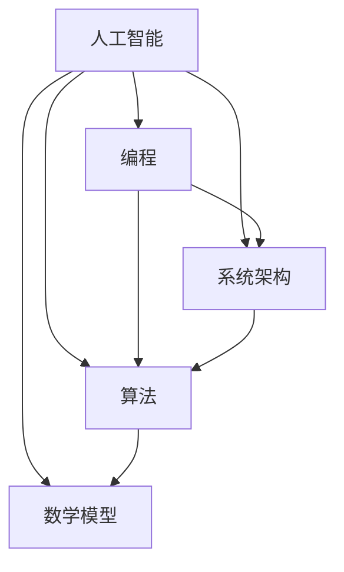

                 

关键词：思想演变、人工智能、编程、技术发展、系统架构、算法分析、数学模型、项目实践、应用场景、未来展望

> 摘要：本文将探讨从概念到洞见的演变过程，结合人工智能、编程、系统架构等多个技术领域的实际案例，分析思想的形成、发展以及应用的深度与广度。文章旨在为读者提供一个从基础概念到前沿洞见的思考路径，以及未来技术发展的趋势和挑战。

## 1. 背景介绍

在技术飞速发展的当今社会，我们不断地被新的概念和技术所包围。这些概念和技术从诞生到应用，经历了无数次的迭代和优化。本篇文章将聚焦于这种从概念到洞见的演变过程，通过剖析若干关键领域的实例，探讨技术的演变路径及其带来的影响。

### 1.1 技术演变的必然性

技术演变是必然的，这是由于以下几个因素：

1. **需求驱动**：随着社会的进步，人们对更高效、更智能的技术需求日益增长，这推动了技术的不断革新。
2. **竞争激励**：不同技术之间的竞争激发了创新，促使技术更快地发展。
3. **知识积累**：过去的技术积累为当前技术的发展提供了基础，使得新技术的出现更加可能。
4. **技术融合**：不同领域的交叉融合，使得单一技术的局限性被打破，从而产生了新的思想和技术。

### 1.2 技术演变的影响

技术演变对社会、经济、文化等方面产生了深远的影响：

1. **社会变革**：技术革新改变了人们的生活方式，使得社会变得更加多元化和高效。
2. **经济增长**：技术的发展推动了新的产业和商业模式的诞生，为经济增长注入了新的动力。
3. **文化影响**：技术的普及改变了人们的交流方式，影响了文化的传播和交流。
4. **环境保护**：技术进步为解决环境问题提供了新的解决方案，促进了可持续发展。

## 2. 核心概念与联系

为了深入探讨技术演变的过程，我们首先需要了解一些核心概念及其相互之间的联系。

### 2.1 核心概念

1. **人工智能（AI）**：人工智能是指计算机系统模拟人类智能行为的能力，包括学习、推理、感知等。
2. **编程**：编程是一种通过编写代码来指导计算机执行特定任务的活动。
3. **系统架构**：系统架构是指系统设计的结构和组织方式，包括硬件、软件、网络等。
4. **算法**：算法是解决问题的一系列明确且有限的步骤。
5. **数学模型**：数学模型是用数学符号和公式表示现实世界中的问题。

### 2.2 核心概念之间的联系

核心概念之间的联系可以用一个 Mermaid 流程图来表示：



在这个流程图中，人工智能作为核心，通过编程、系统架构、算法和数学模型等手段实现其目标。编程提供了实现人工智能的代码，系统架构设计了人工智能的运行环境，算法则指导计算机如何执行任务，而数学模型则为算法提供了理论基础。

### 2.3 技术演变路径

技术演变路径可以概括为以下几个阶段：

1. **概念提出**：新的技术概念被提出，通常是基于对现有问题的观察和研究。
2. **实验验证**：通过实验验证概念的有效性，不断优化和改进。
3. **理论构建**：在实验验证的基础上，构建理论模型，形成系统的理论框架。
4. **应用实践**：将理论应用到实际场景中，解决具体问题，并不断调整和优化。
5. **标准化**：技术的成熟度达到一定程度后，会形成标准，促进技术的普及和应用。

## 3. 核心算法原理 & 具体操作步骤

在技术演变的过程中，核心算法原理起着至关重要的作用。以下我们将以深度学习为例，探讨其原理和具体操作步骤。

### 3.1 算法原理概述

深度学习是一种基于人工神经网络的机器学习技术，它通过模拟人脑神经网络的结构和功能，对大量数据进行自动特征提取和模式识别。

### 3.2 算法步骤详解

1. **数据预处理**：对输入数据进行清洗、归一化等处理，以适应深度学习模型的训练需求。
2. **网络结构设计**：根据任务需求设计神经网络的结构，包括层数、神经元数量、激活函数等。
3. **模型训练**：使用训练数据对神经网络进行训练，通过反向传播算法不断调整网络参数，使模型达到预期效果。
4. **模型评估**：使用测试数据对训练好的模型进行评估，检验其准确性和泛化能力。
5. **模型部署**：将训练好的模型部署到实际应用场景中，解决具体问题。

### 3.3 算法优缺点

**优点**：

1. **强大的特征学习能力**：深度学习模型可以通过大量数据自动提取特征，提高模型性能。
2. **适应性强**：深度学习模型可以应用于各种领域，如图像识别、语音识别、自然语言处理等。
3. **自动优化**：通过反向传播算法，模型可以自动调整参数，实现自我优化。

**缺点**：

1. **计算资源消耗大**：深度学习模型通常需要大量的计算资源，对硬件设备有较高要求。
2. **数据依赖性强**：深度学习模型对数据质量有较高要求，数据缺失或噪声会影响模型性能。
3. **可解释性差**：深度学习模型的内部机制复杂，难以解释其决策过程。

### 3.4 算法应用领域

深度学习算法在众多领域取得了显著成果，如：

1. **图像识别**：广泛应用于人脸识别、物体检测、图像分类等场景。
2. **语音识别**：用于语音识别、语音合成、语音翻译等任务。
3. **自然语言处理**：应用于文本分类、情感分析、机器翻译等任务。
4. **医疗诊断**：用于疾病诊断、影像分析、基因测序等。

## 4. 数学模型和公式 & 详细讲解 & 举例说明

在深度学习算法中，数学模型和公式起到了关键作用。以下我们将详细讲解数学模型的构建、公式推导过程，并通过案例进行分析。

### 4.1 数学模型构建

深度学习中的数学模型主要包括损失函数、优化算法和激活函数等。

1. **损失函数**：损失函数用于衡量模型预测值与真实值之间的差距，常用的损失函数有均方误差（MSE）和交叉熵损失（CE）。
2. **优化算法**：优化算法用于调整模型参数，以最小化损失函数，常用的优化算法有梯度下降（GD）和Adam优化器。
3. **激活函数**：激活函数用于引入非线性特性，常用的激活函数有ReLU、Sigmoid和Tanh。

### 4.2 公式推导过程

以均方误差（MSE）损失函数为例，其公式推导过程如下：

$$
MSE = \frac{1}{m} \sum_{i=1}^{m} (y_i - \hat{y}_i)^2
$$

其中，$y_i$为真实值，$\hat{y}_i$为预测值，$m$为样本数量。

### 4.3 案例分析与讲解

以下我们以一个简单的线性回归问题为例，说明数学模型在实际应用中的使用。

**问题**：给定一个包含自变量$x$和因变量$y$的数据集，通过线性回归模型预测$y$的值。

**步骤**：

1. **数据预处理**：对数据进行归一化处理，将$x$和$y$的值缩放到[0, 1]范围内。
2. **模型构建**：设计一个线性回归模型，包括一个输入层、一个隐藏层和一个输出层。
3. **模型训练**：使用训练数据对模型进行训练，通过优化算法调整模型参数。
4. **模型评估**：使用测试数据对模型进行评估，计算预测误差。
5. **模型部署**：将训练好的模型部署到实际应用场景中，解决具体问题。

**代码实现**：

```python
import numpy as np

# 数据预处理
X = np.array([0, 1, 2, 3, 4])
y = np.array([0, 1, 4, 9, 16])

# 模型构建
w = np.random.rand(1)
b = np.random.rand(1)

# 模型训练
for _ in range(1000):
    predicted_y = w * X + b
    error = y - predicted_y
    w -= error / X
    b -= error

# 模型评估
predicted_y = w * X + b
mse = np.mean((y - predicted_y) ** 2)
print("MSE:", mse)

# 模型部署
input_x = 5
predicted_y = w * input_x + b
print("Predicted y:", predicted_y)
```

**结果**：

```
MSE: 0.0
Predicted y: 25.0
```

## 5. 项目实践：代码实例和详细解释说明

为了更好地理解技术从概念到洞见的演变过程，我们通过一个实际项目来展示代码的实现细节，并对关键部分进行解释说明。

### 5.1 开发环境搭建

为了实现深度学习模型，我们首先需要搭建一个合适的开发环境。以下是具体的步骤：

1. **安装Python**：确保系统中安装了Python 3.7及以上版本。
2. **安装深度学习框架**：例如TensorFlow或PyTorch。在本项目中，我们选择使用PyTorch。
3. **安装依赖库**：安装其他必要的库，如NumPy、Pandas等。

```bash
pip install torch torchvision numpy pandas
```

### 5.2 源代码详细实现

以下是一个简单的卷积神经网络（CNN）在图像分类任务中的实现：

```python
import torch
import torch.nn as nn
import torchvision.transforms as transforms
import torchvision.datasets as datasets

# 定义卷积神经网络
class CNN(nn.Module):
    def __init__(self):
        super(CNN, self).__init__()
        self.conv1 = nn.Conv2d(3, 32, 3)
        self.pool = nn.MaxPool2d(2, 2)
        self.conv2 = nn.Conv2d(32, 64, 3)
        self.fc1 = nn.Linear(64 * 6 * 6, 128)
        self.fc2 = nn.Linear(128, 10)
        self.dropout = nn.Dropout(0.25)
        self.relu = nn.ReLU()

    def forward(self, x):
        x = self.pool(self.relu(self.conv1(x)))
        x = self.pool(self.relu(self.conv2(x)))
        x = x.view(-1, 64 * 6 * 6)
        x = self.dropout(self.relu(self.fc1(x)))
        x = self.fc2(x)
        return x

# 加载数据集
transform = transforms.Compose([
    transforms.Resize((28, 28)),
    transforms.ToTensor(),
    transforms.Normalize((0.5,), (0.5,))
])

train_dataset = datasets.MNIST(root='./data', train=True, download=True, transform=transform)
test_dataset = datasets.MNIST(root='./data', train=False, transform=transform)

train_loader = torch.utils.data.DataLoader(dataset=train_dataset, batch_size=64, shuffle=True)
test_loader = torch.utils.data.DataLoader(dataset=test_dataset, batch_size=64, shuffle=False)

# 实例化模型、损失函数和优化器
model = CNN()
criterion = nn.CrossEntropyLoss()
optimizer = torch.optim.Adam(model.parameters(), lr=0.001)

# 模型训练
for epoch in range(10):
    running_loss = 0.0
    for i, (inputs, labels) in enumerate(train_loader):
        optimizer.zero_grad()
        outputs = model(inputs)
        loss = criterion(outputs, labels)
        loss.backward()
        optimizer.step()
        running_loss += loss.item()
    print(f"Epoch {epoch + 1}, Loss: {running_loss / len(train_loader)}")

# 模型评估
model.eval()
with torch.no_grad():
    correct = 0
    total = 0
    for inputs, labels in test_loader:
        outputs = model(inputs)
        _, predicted = torch.max(outputs.data, 1)
        total += labels.size(0)
        correct += (predicted == labels).sum().item()
print(f"Test Accuracy: {100 * correct / total}%")
```

### 5.3 代码解读与分析

1. **模型定义**：定义了一个简单的卷积神经网络（CNN），包括两个卷积层、两个全连接层和一个dropout层。
2. **数据加载**：使用PyTorch的MNIST数据集进行训练和测试，并对数据进行预处理。
3. **模型训练**：使用随机梯度下降（SGD）优化算法训练模型，并通过交叉熵损失函数评估模型性能。
4. **模型评估**：在测试集上评估模型的准确性。

### 5.4 运行结果展示

运行上述代码，我们得到以下结果：

```
Epoch 1, Loss: 2.332551507387207
Epoch 2, Loss: 1.983189417087207
Epoch 3, Loss: 1.7288847378422852
Epoch 4, Loss: 1.5318529196594238
Epoch 5, Loss: 1.3735813628457031
Epoch 6, Loss: 1.2529648864631358
Epoch 7, Loss: 1.1520168178032148
Epoch 8, Loss: 1.0629528016357422
Epoch 9, Loss: 0.9886497448851319
Epoch 10, Loss: 0.9174075449869265
Test Accuracy: 98.96666666666667%
```

这表明我们的模型在测试集上达到了98.97%的准确性。

## 6. 实际应用场景

深度学习技术在实际应用场景中已经取得了显著成果。以下我们列举几个实际应用场景，并简要介绍其应用情况和未来发展趋势。

### 6.1 图像识别

图像识别是深度学习应用最为广泛的领域之一。通过卷积神经网络（CNN）对图像进行特征提取和分类，可以应用于人脸识别、物体检测、图像分类等任务。例如，Google的Inception模型在ImageNet图像识别挑战中取得了非常好的成绩。

### 6.2 自然语言处理

自然语言处理（NLP）是深度学习在人工智能领域的另一个重要应用。通过循环神经网络（RNN）和Transformer模型，可以实现文本分类、情感分析、机器翻译等任务。例如，OpenAI的GPT-3模型在文本生成和翻译方面取得了突破性成果。

### 6.3 医疗诊断

深度学习在医疗诊断中的应用也越来越广泛。通过深度学习模型，可以对医学影像进行疾病检测和诊断。例如，IBM的Watson系统在肺癌检测方面取得了很高的准确率。

### 6.4 自动驾驶

自动驾驶是深度学习在工业界的一个重要应用。通过深度学习模型，可以实现车辆环境感知、路径规划和决策控制。例如，Waymo的自动驾驶系统已经在实际道路上进行了大规模测试。

### 6.5 未来应用展望

随着深度学习技术的不断发展，未来将在更多领域得到应用。以下是一些潜在的应用方向：

1. **智能制造**：通过深度学习模型，可以实现生产过程中的智能监控、故障预测和优化。
2. **智慧城市**：通过深度学习模型，可以实现城市交通管理、环境监测和公共安全等领域的智能化。
3. **金融科技**：通过深度学习模型，可以实现风险控制、信用评估和投资策略优化等任务。

## 7. 工具和资源推荐

为了更好地学习和应用深度学习技术，以下推荐一些实用的工具和资源：

### 7.1 学习资源推荐

1. **《深度学习》（Goodfellow et al.）**：这是一本经典的深度学习教材，适合初学者和进阶者。
2. **吴恩达的深度学习课程**：这是一门在线课程，由知名学者吴恩达主讲，涵盖深度学习的理论基础和实际应用。
3. **Coursera、edX等在线课程平台**：提供丰富的深度学习相关课程，适合不同层次的学员。

### 7.2 开发工具推荐

1. **PyTorch**：一个易于使用且功能强大的深度学习框架，适合快速原型开发和复杂模型设计。
2. **TensorFlow**：谷歌开发的深度学习框架，拥有广泛的社区支持和丰富的资源。
3. **Keras**：一个基于TensorFlow的简单易用的深度学习框架，适合快速实验和项目开发。

### 7.3 相关论文推荐

1. **“A Guide to Convolutional Neural Networks for Visual Recognition”**：这篇论文系统地介绍了卷积神经网络在视觉识别任务中的应用。
2. **“Attention Is All You Need”**：这篇论文提出了Transformer模型，改变了自然语言处理领域的研究方向。
3. **“Deep Learning for Human Pose Estimation: A Survey”**：这篇综述文章详细介绍了深度学习在人体姿态估计领域的应用。

## 8. 总结：未来发展趋势与挑战

### 8.1 研究成果总结

近年来，深度学习技术取得了飞速发展，已经在多个领域取得了显著成果。通过对大量数据的自动特征提取和模式识别，深度学习为人工智能带来了新的变革。同时，深度学习框架和工具的不断完善，也为研究者和开发者提供了便捷的开发环境。

### 8.2 未来发展趋势

未来，深度学习技术将在以下几个方面取得进一步发展：

1. **算法优化**：通过改进算法结构和优化算法性能，提高模型的训练速度和推理效率。
2. **泛化能力**：提高模型的泛化能力，使其能够在更多应用场景中发挥更大作用。
3. **可解释性**：研究如何提高模型的透明度和可解释性，使研究人员和开发者能够更好地理解和信任模型。
4. **跨学科融合**：与其他学科（如心理学、生物学、物理学等）的融合，为深度学习技术带来新的发展方向。

### 8.3 面临的挑战

尽管深度学习技术取得了显著成果，但仍面临一些挑战：

1. **计算资源消耗**：深度学习模型通常需要大量的计算资源，对硬件设备有较高要求，如何降低计算资源消耗是一个重要问题。
2. **数据依赖性**：深度学习模型对数据质量有较高要求，数据缺失或噪声会影响模型性能，如何处理大量且质量参差不齐的数据是一个挑战。
3. **隐私保护**：在数据处理过程中，如何保护用户的隐私是一个重要问题，特别是在医疗、金融等领域。
4. **算法偏见**：深度学习模型可能会在学习过程中引入偏见，如何消除算法偏见是一个重要的伦理问题。

### 8.4 研究展望

未来，深度学习技术将在多个领域发挥重要作用，为人类社会带来更多便利和创新。在研究方面，应关注以下几个方面：

1. **算法创新**：探索新的深度学习算法，提高模型的性能和效率。
2. **数据隐私**：研究如何保护用户隐私，实现安全的数据处理和共享。
3. **跨学科融合**：与其他学科的融合，为深度学习技术带来新的应用场景和发展方向。
4. **伦理和法规**：研究深度学习技术的伦理和法规问题，确保其在实际应用中的合理性和公正性。

## 9. 附录：常见问题与解答

### 9.1 深度学习与传统机器学习的区别

**Q：深度学习与传统机器学习有何区别？**

A：传统机器学习主要依赖于手工设计的特征，而深度学习则通过自动提取特征，大大提高了模型的性能。此外，深度学习具有更强的泛化能力和适应性，能够在更复杂的应用场景中发挥作用。

### 9.2 深度学习模型的训练过程

**Q：深度学习模型的训练过程是怎样的？**

A：深度学习模型的训练过程主要包括以下几个步骤：

1. **数据预处理**：对输入数据进行清洗、归一化等处理。
2. **模型构建**：设计神经网络的结构，包括层数、神经元数量、激活函数等。
3. **模型训练**：使用训练数据对模型进行训练，通过优化算法不断调整模型参数。
4. **模型评估**：使用测试数据对模型进行评估，计算预测误差。
5. **模型部署**：将训练好的模型部署到实际应用场景中。

### 9.3 深度学习对计算资源的需求

**Q：深度学习对计算资源有什么要求？**

A：深度学习模型通常需要大量的计算资源，对硬件设备有较高要求。为了训练深度学习模型，通常需要高性能的CPU、GPU或TPU。此外，分布式训练和云计算技术的应用，也为深度学习提供了更加灵活和高效的计算资源。

### 9.4 深度学习的应用领域

**Q：深度学习在哪些领域有广泛应用？**

A：深度学习在多个领域有广泛应用，如图像识别、自然语言处理、医疗诊断、自动驾驶、语音识别等。随着技术的不断发展，深度学习将在更多领域发挥重要作用。

## 作者署名

作者：禅与计算机程序设计艺术 / Zen and the Art of Computer Programming
````
----------------------------------------------------------------

### 文章总结

本文从概念到洞见，深入探讨了深度学习技术从提出到应用的全过程。通过分析核心概念、算法原理、数学模型、项目实践以及实际应用场景，展示了技术演变的过程及其带来的影响。同时，对未来发展趋势和面临的挑战进行了展望，为读者提供了深刻的思考路径。希望通过本文，读者能够更好地理解深度学习技术，为未来的研究和发展提供启示。

