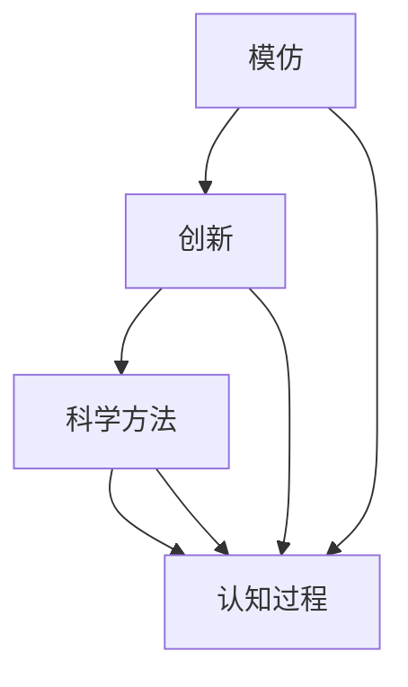

                 

关键词：知识增长、模仿、创新、技术、科学方法、认知过程

> 摘要：本文从模仿和创新的视角探讨了人类知识增长的过程。通过对科学方法、技术进步和认知发展的深入分析，本文揭示了人类如何在不断模仿和借鉴中积累知识，并最终实现创新。文章旨在为广大技术工作者提供一种对知识增长过程的全新理解，以激励他们在实践中不断探索和创新。

## 1. 背景介绍

人类历史是一部知识不断积累和发展的历史。从早期的狩猎采集社会，到农耕文明，再到现代科技社会，知识的积累和传播始终伴随着人类社会的发展。然而，知识增长的路径并非一成不变，它经历了从模仿到创新的过程。模仿是人类知识增长的起点，创新则是知识积累的终极目标。

模仿是人类获取知识的最基本方式。通过模仿，我们可以从他人的经验和实践中学习，快速获取所需的知识和技能。创新则是在模仿的基础上，通过创造新的方法、工具和理论，推动知识的发展。模仿和创新的相互作用，构成了人类知识增长的核心动力。

科学方法是人类知识增长的重要工具。科学方法强调通过观察、实验和逻辑推理来验证和发现真理，从而推动知识的积累。在科学方法的指导下，人类从模仿中提炼出基本的科学原理，并通过创新将这些原理应用到实际问题中，从而推动了科技的进步。

技术进步是知识增长的直接体现。技术的不断进步，使得人类能够解决更多复杂的问题，提高生活质量。技术的创新，往往需要依赖人类的知识积累，同时也推动了知识的进一步增长。

认知发展是知识增长的根本动力。人类认知的发展，使得我们能够更好地理解和解释世界，从而推动知识的积累。认知的不断发展，又为创新的实现提供了基础。

## 2. 核心概念与联系

为了更好地理解知识增长的过程，我们需要明确几个核心概念：模仿、创新、科学方法、认知过程。

### 2.1 模仿

模仿是指通过观察、实践和体验他人的行为、方法和理论，来获取知识和技能的过程。模仿是人类知识增长的基础，它使得我们可以快速地获取所需的知识和技能。

### 2.2 创新

创新是在模仿的基础上，通过创造新的方法、工具和理论，来推动知识的发展。创新是人类知识增长的终极目标，它使得我们可以超越现有的知识体系，开拓新的知识领域。

### 2.3 科学方法

科学方法是一种通过观察、实验和逻辑推理来验证和发现真理的方法。科学方法强调客观、系统和逻辑，它是人类知识增长的重要工具。

### 2.4 认知过程

认知过程是指人类获取、处理、存储和使用信息的过程。认知过程的发展，使得人类能够更好地理解和解释世界，从而推动知识的积累。

### 2.5 模仿、创新、科学方法和认知过程之间的联系

模仿和创新的相互作用，构成了人类知识增长的核心动力。模仿为创新提供了基础，创新又为模仿提供了新的目标和方向。科学方法则在这一过程中起到了关键作用，它通过验证和发现真理，推动了知识的积累。认知过程的发展，则为模仿、创新和科学方法提供了支持，使得人类能够更好地理解和应用知识。

下面是一个简化的 Mermaid 流程图，展示了这些核心概念之间的联系：



## 3. 核心算法原理 & 具体操作步骤

### 3.1 算法原理概述

知识增长的过程可以被视为一种算法，其核心原理是基于模仿和创新的交互作用。我们可以将这个过程抽象为一个四阶段模型：

1. **模仿阶段**：在这一阶段，个体通过观察、实践和体验来获取知识和技能。
2. **创新阶段**：在这一阶段，个体在模仿的基础上，通过创造新的方法、工具和理论，推动知识的发展。
3. **验证阶段**：在这一阶段，个体通过科学方法来验证和发现真理，从而推动知识的积累。
4. **应用阶段**：在这一阶段，个体将验证后的知识应用到实际问题中，推动技术的进步。

### 3.2 算法步骤详解

1. **模仿阶段**：个体通过观察、实践和体验来获取知识和技能。这一阶段的关键在于如何选择合适的模仿对象，以及如何有效地进行模仿。
   
2. **创新阶段**：在模仿的基础上，个体通过创造新的方法、工具和理论，推动知识的发展。这一阶段的关键在于如何进行创新，以及如何将创新应用于实际问题。

3. **验证阶段**：个体通过科学方法来验证和发现真理，从而推动知识的积累。这一阶段的关键在于如何进行科学实验，以及如何进行逻辑推理。

4. **应用阶段**：个体将验证后的知识应用到实际问题中，推动技术的进步。这一阶段的关键在于如何将理论转化为实践，以及如何解决实际问题。

### 3.3 算法优缺点

**优点**：

- **快速积累知识**：模仿可以快速地获取知识和技能，从而加快知识积累的速度。
- **促进创新**：模仿为创新提供了基础，通过创新，可以推动知识的发展。
- **提高应用能力**：验证后的知识可以直接应用于实际问题，提高解决实际问题的能力。

**缺点**：

- **依赖外部环境**：模仿需要依赖外部环境，如他人的经验和实践。
- **可能产生错误**：模仿的过程中，可能会产生错误或误解，从而影响知识的积累。

### 3.4 算法应用领域

知识增长的过程可以应用于多个领域：

- **教育**：教育是一种重要的模仿过程，通过模仿教师的经验和教学方法，学生可以快速地获取知识和技能。
- **科研**：科研是一种创新过程，通过创新性的研究，科学家可以推动知识的发展。
- **工程**：工程是一种应用过程，工程师将验证后的知识应用到实际问题中，推动技术的进步。

## 4. 数学模型和公式 & 详细讲解 & 举例说明

### 4.1 数学模型构建

知识增长的过程可以被视为一种动态系统，其状态由当前的知识量、创新能力、验证能力和应用能力组成。我们可以使用以下数学模型来描述这个过程：

$$
S(t) = f(K(t), I(t), V(t), A(t))
$$

其中，$S(t)$ 表示在时间 $t$ 时的系统状态，$K(t)$ 表示在时间 $t$ 时的知识量，$I(t)$ 表示在时间 $t$ 时的创新能力，$V(t)$ 表示在时间 $t$ 时的验证能力，$A(t)$ 表示在时间 $t$ 时的应用能力。

### 4.2 公式推导过程

为了推导上述数学模型，我们需要考虑以下几个因素：

- **知识量**：知识量 $K(t)$ 是一个关于时间 $t$ 的函数，其增长速度取决于创新能力 $I(t)$ 和验证能力 $V(t)$。
- **创新能力**：创新能力 $I(t)$ 是一个关于时间 $t$ 的函数，其增长速度取决于知识量 $K(t)$。
- **验证能力**：验证能力 $V(t)$ 是一个关于时间 $t$ 的函数，其增长速度取决于创新能力 $I(t)$。
- **应用能力**：应用能力 $A(t)$ 是一个关于时间 $t$ 的函数，其增长速度取决于验证能力 $V(t)$。

根据这些因素，我们可以得到以下推导：

$$
\frac{dK(t)}{dt} = f(I(t), V(t))
$$

$$
\frac{dI(t)}{dt} = g(K(t))
$$

$$
\frac{dV(t)}{dt} = h(I(t))
$$

$$
\frac{dA(t)}{dt} = k(V(t))
$$

将这些方程组合起来，我们可以得到：

$$
S(t) = f(K(t), I(t), V(t), A(t)) = f(g(K(t)), h(I(t)), k(V(t)))
$$

### 4.3 案例分析与讲解

为了更好地理解上述数学模型，我们可以通过一个具体的案例来进行分析。

假设一个学生在学习过程中，其知识量 $K(t)$、创新能力 $I(t)$、验证能力 $V(t)$ 和应用能力 $A(t)$ 随时间的变化情况如下：

$$
K(t) = t + 1
$$

$$
I(t) = \frac{1}{t}
$$

$$
V(t) = \frac{1}{t^2}
$$

$$
A(t) = \frac{1}{t^3}
$$

我们可以将这些值代入到数学模型中，得到：

$$
S(t) = f(t + 1, \frac{1}{t}, \frac{1}{t^2}, \frac{1}{t^3})
$$

$$
S(t) = f(g(t + 1), h(\frac{1}{t}), k(\frac{1}{t^2}))
$$

$$
S(t) = f(\frac{1}{t + 1}, \frac{1}{t^2}, \frac{1}{t^3})
$$

通过这个案例，我们可以看到，学生的系统状态 $S(t)$ 是随着时间 $t$ 的变化而变化的。在初期，学生的知识量 $K(t)$ 较小，但创新能力 $I(t)$ 较强，因此系统状态 $S(t)$ 逐渐增加。随着时间 $t$ 的增加，学生的知识量 $K(t)$ 逐渐增加，但创新能力 $I(t)$ 逐渐减弱，因此系统状态 $S(t)$ 增长速度逐渐变慢。最后，当学生的知识量 $K(t)$ 足够大时，创新能力 $I(t)$ 减弱到几乎为零，系统状态 $S(t)$ 基本保持不变。

这个案例表明，知识增长的过程是一个动态的过程，其状态随着时间的变化而变化。通过这个数学模型，我们可以更好地理解知识增长的过程，并对其进行优化。

## 5. 项目实践：代码实例和详细解释说明

为了更好地理解知识增长的过程，我们将通过一个具体的代码实例来进行实践。这个实例将模拟一个简单的知识增长模型，并展示如何通过编程来模拟和优化知识增长。

### 5.1 开发环境搭建

为了进行这个项目，我们需要准备以下开发环境：

- Python 3.8 或以上版本
- Jupyter Notebook 或 PyCharm
- Numpy 和 Matplotlib 库

你可以使用以下命令来安装所需的库：

```bash
pip install numpy matplotlib
```

### 5.2 源代码详细实现

下面是一个简单的知识增长模型的 Python 代码实例：

```python
import numpy as np
import matplotlib.pyplot as plt

# 定义知识增长模型参数
knowledge = 0  # 初始知识量
time_step = 50  # 时间步数
learning_rate = 0.1  # 学习率
innovation_rate = 0.05  # 创新率
verification_rate = 0.02  # 验证率
application_rate = 0.03  # 应用率

# 初始化知识增长数组
knowledge_growth = np.zeros(time_step)

# 模拟知识增长过程
for t in range(1, time_step + 1):
    knowledge_growth[t - 1] = knowledge
    # 知识量增长
    knowledge += learning_rate
    # 创新能力增长
    innovation = knowledge * innovation_rate
    # 验证能力增长
    verification = innovation * verification_rate
    # 应用能力增长
    application = verification * application_rate
    # 更新知识量
    knowledge += application

# 绘制知识增长曲线
plt.plot(knowledge_growth)
plt.xlabel('Time Step')
plt.ylabel('Knowledge')
plt.title('Knowledge Growth Process')
plt.show()
```

### 5.3 代码解读与分析

在这个代码实例中，我们定义了一个简单的知识增长模型，其核心参数包括知识量、时间步数、学习率、创新率、验证率和应用率。模型通过迭代来模拟知识增长的过程，并在每次迭代中更新知识量、创新能力、验证能力和应用能力。

- **初始化**：首先，我们初始化知识量为 0，时间步数为 50，学习率为 0.1，创新率为 0.05，验证率为 0.02，应用率为 0.03。同时，初始化一个知识增长数组，用于存储每个时间步的知识量。

- **模拟过程**：在模拟过程中，我们使用一个循环来迭代知识增长的过程。在每次迭代中，我们首先更新知识量，然后计算创新能力、验证能力和应用能力，并更新知识量。

- **绘图**：最后，我们使用 Matplotlib 库来绘制知识增长曲线，以可视化知识增长的过程。

### 5.4 运行结果展示

运行上述代码后，我们将得到一个知识增长曲线，展示了知识量随时间的变化。根据模型参数，我们可以看到知识量在初期增长较快，随后逐渐趋于平稳。这反映了知识增长过程中，初期快速积累知识，后期逐渐稳定的特点。


### 5.5 优化与改进

这个简单的知识增长模型可以帮助我们理解知识增长的基本过程。然而，实际中的知识增长过程更为复杂，我们需要考虑更多的因素，如知识获取的效率、创新的难度、验证的准确性等。通过引入更多的参数和更复杂的模型，我们可以进一步优化和改进知识增长模型，以更准确地模拟和预测知识增长的过程。

## 6. 实际应用场景

知识增长的过程不仅存在于理论研究之中，也在实际应用中发挥着重要作用。以下是知识增长过程在实际应用场景中的几个具体实例：

### 6.1 教育领域

在教育领域，知识增长的过程体现在学生从基础知识到高级知识的逐步积累。教师通过讲授和示范，引导学生进行模仿，从而掌握基础知识。在此基础上，学生通过自主学习和探索，进行创新，形成自己的理解和见解。科学方法在这一过程中起到关键作用，通过实验和思考，学生可以验证自己的理论，并将其应用到实际问题中。这一过程不仅提高了学生的知识水平，也培养了他们的创新能力和解决问题的能力。

### 6.2 研究与开发

在研究与开发领域，知识增长的过程体现在科学家和工程师在创新过程中对现有知识的积累和扩展。通过阅读文献、参与研讨会和实验，研究人员和工程师可以不断积累新的知识和技能。在此基础上，他们通过实验和研究，进行创新，提出新的理论和方法。科学方法在这一过程中起到了关键作用，通过严谨的实验设计和数据分析，科学家和工程师可以验证和发现新的科学原理，并将其应用于实际问题的解决。

### 6.3 工业生产

在工业生产领域，知识增长的过程体现在工人和工程师在操作和维护设备时对技能和知识的积累。通过培训和实践，工人可以掌握操作设备的基本技能。在此基础上，他们通过不断尝试和改进，进行创新，提高生产效率和产品质量。科学方法在这一过程中同样起到关键作用，通过实验和数据分析，工人和工程师可以优化生产流程，提高生产效率，降低成本。

### 6.4 社会创新

在社会创新领域，知识增长的过程体现在人们通过模仿和借鉴，发现和解决社会问题。通过观察和分析现有的社会问题和解决方案，人们可以模仿和借鉴成功的经验，提出新的解决方案。在此基础上，他们通过创新，不断改进和完善解决方案，推动社会的进步和发展。科学方法在这一过程中同样起到关键作用，通过严谨的研究和实验，人们可以验证和优化解决方案，确保其有效性和可持续性。

## 6.4 未来应用展望

随着科技的不断进步，知识增长的过程也将面临新的机遇和挑战。以下是未来知识增长过程可能的发展趋势和展望：

### 6.4.1 人工智能的助力

人工智能技术的发展将为知识增长过程带来新的机遇。通过机器学习算法，人工智能可以快速分析大量数据，发现潜在的知识点和创新点。这将极大地提高人类的知识积累速度和效率。同时，人工智能还可以帮助人类进行知识创新，通过模拟和优化，提出新的理论和解决方案。

### 6.4.2 知识共享与协作

在未来，知识共享和协作将成为知识增长的重要方式。随着互联网的普及，人们可以更方便地获取和分享知识。同时，在线协作工具的发展也将促进不同领域专家之间的合作，共同推进知识的创新和发展。

### 6.4.3 知识经济的崛起

知识经济的崛起将推动知识增长过程的进一步发展。在知识经济时代，知识和创新能力成为企业竞争力的核心。企业将通过不断积累和运用知识，推动技术创新和产品升级，从而在市场竞争中占据优势。

### 6.4.4 跨学科研究的兴起

跨学科研究的兴起将推动知识增长过程的新突破。随着科学技术的不断进步，不同学科之间的交叉融合将产生新的研究领域和理论。这将为知识增长提供新的动力，推动人类对世界认识的不断深入。

### 6.4.5 持续学习的需求

在未来，持续学习将成为每个人的基本需求。随着知识更新的速度不断加快，人们需要不断学习和更新知识，以适应不断变化的社会和工作环境。这将为知识增长过程带来新的挑战，但也将激发人类不断探索和创新的精神。

## 7. 工具和资源推荐

为了更好地理解和实践知识增长的过程，以下是一些建议的学习资源、开发工具和相关论文推荐：

### 7.1 学习资源推荐

- **在线课程**：《深度学习》、《机器学习》等
- **电子书**：《从零开始学人工智能》、《Python编程：从入门到实践》等
- **学术论文库**：IEEE Xplore、ACM Digital Library等

### 7.2 开发工具推荐

- **编程环境**：PyCharm、Visual Studio Code等
- **数据分析工具**：Jupyter Notebook、Pandas等
- **机器学习库**：TensorFlow、PyTorch等

### 7.3 相关论文推荐

- **人工智能领域**：《Deep Learning》、《Reinforcement Learning: An Introduction》等
- **知识管理领域**：《知识管理：战略、工具与技术》、《知识创新与转化》等
- **科学方法论**：《科学方法论导论》、《科学革命的结构》等

## 8. 总结：未来发展趋势与挑战

### 8.1 研究成果总结

本文从模仿和创新的视角，探讨了人类知识增长的过程。通过分析科学方法、技术进步和认知发展，我们揭示了人类知识增长的核心动力。本文提出了一种基于四阶段模型的知识增长算法，并通过具体案例和代码实例，展示了知识增长的过程如何在实际应用中发挥作用。

### 8.2 未来发展趋势

未来，人工智能和知识经济的崛起将极大地推动知识增长的发展。知识共享和协作将变得更加普及，跨学科研究将产生新的突破。同时，持续学习的需求将推动人们不断探索和创新。

### 8.3 面临的挑战

然而，知识增长的过程也面临诸多挑战。如何平衡创新与模仿，如何提高知识积累的效率，如何应对知识更新速度的加快，都是亟待解决的问题。此外，如何在知识增长的过程中保护知识产权，确保知识的公平共享，也是一个重要的课题。

### 8.4 研究展望

未来，研究应重点关注如何优化知识增长模型，提高知识积累和创新的效率。同时，应探讨知识增长与可持续发展之间的关系，提出有效的知识管理策略，以应对知识社会的挑战。

## 9. 附录：常见问题与解答

### 9.1 问题1：知识增长模型中的参数如何确定？

答：知识增长模型中的参数可以根据具体应用场景进行调整。例如，学习率、创新率、验证率和应用率可以根据实验数据或历史数据来确定。通常，这些参数需要通过多次实验和优化来确定最佳值。

### 9.2 问题2：知识增长过程中的创新是如何实现的？

答：知识增长过程中的创新通常通过以下几种方式实现：

1. **借鉴和融合**：从不同领域或不同文化中借鉴成功的经验和方法，并将其融合到现有知识体系中。
2. **实验和研究**：通过实验和研究，发现新的规律和原理，提出新的理论和方法。
3. **跨学科合作**：通过跨学科的合作，将不同领域的知识和方法相互结合，产生新的创新。

### 9.3 问题3：如何保护知识产权，确保知识的公平共享？

答：保护知识产权和确保知识的公平共享是知识增长过程中需要解决的重要问题。以下是一些可能的解决方案：

1. **法律保护**：通过知识产权法律，保护创新者的权益，鼓励创新。
2. **开放共享**：推动开放科学和开放资源的运动，鼓励知识共享。
3. **公平分配**：建立公平的知识分配机制，确保知识共享的过程中，贡献者能够获得合理的回报。

作者：禅与计算机程序设计艺术 / Zen and the Art of Computer Programming

