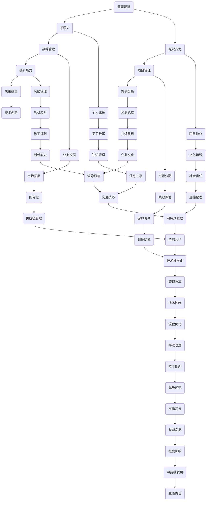

                 

关键词：管理智慧、经典书籍、领导力、组织行为、IT项目管理、案例研究、未来趋势

> 摘要：本文将探讨从经典书籍中汲取管理智慧的必要性，分析几本具有代表性的经典管理著作及其核心观点，并通过案例研究揭示其在现实中的成功应用。文章旨在为现代IT项目管理者和领导者提供宝贵的经验和启示，以应对未来管理和创新的挑战。

## 1. 背景介绍

在快速变化的技术时代，管理智慧显得尤为重要。随着信息技术的飞速发展，组织面临着前所未有的挑战和机遇。有效的管理不仅是技术能力的体现，更是战略思考、团队协作和领导力的综合展现。因此，从经典书籍中汲取管理智慧，已成为提升组织管理水平和应对未来挑战的关键途径。

本文将首先介绍几本经典的管理著作，包括其核心观点和理论基础。随后，通过案例研究展示这些管理理念在实际中的应用效果。最后，探讨未来管理智慧的发展趋势以及面临的挑战，为读者提供有益的参考。

## 2. 核心概念与联系

为了更好地理解经典管理著作中的理念，我们需要借助图灵架构（Turing Architecture）来构建一个管理知识的框架。以下是一个简化的Mermaid流程图，用于描述这些核心概念及其联系：



这个图灵架构展示了管理智慧的多维度和跨领域特征，涵盖从领导力、组织行为到项目管理、战略管理等多个方面。这些核心概念相互交织，形成了一个完整的管理知识体系。

### 3. 核心算法原理 & 具体操作步骤

#### 3.1 算法原理概述

管理智慧的核心在于对复杂系统的理解和应对。以下是几个关键算法原理的概述：

1. **领导力算法（Leadership Algorithm）**：
   - **原理**：通过激发团队成员的潜能，实现团队整体绩效的提升。
   - **步骤**：识别团队成员的优势和需求，制定个性化的激励策略，建立信任和协作机制。

2. **组织行为算法（Organization Behavior Algorithm）**：
   - **原理**：通过分析团队和组织成员的行为模式，优化组织结构和流程。
   - **步骤**：收集行为数据，运用统计学和机器学习方法进行分析，提出优化方案。

3. **项目管理算法（Project Management Algorithm）**：
   - **原理**：确保项目按计划顺利完成，实现项目目标。
   - **步骤**：项目规划、风险评估、资源调配、进度跟踪、质量保证。

4. **战略管理算法（Strategic Management Algorithm）**：
   - **原理**：制定长期战略规划，确保组织在竞争中保持优势。
   - **步骤**：市场分析、目标设定、资源配置、绩效评估。

#### 3.2 算法步骤详解

以下是对上述算法的详细步骤描述：

1. **领导力算法（Leadership Algorithm）**：

   - **步骤 1**：识别团队成员的优势和需求。
     - **方法**：通过面谈、问卷调查和绩效评估等手段获取数据。

   - **步骤 2**：制定个性化的激励策略。
     - **方法**：根据团队成员的优势和需求，设计不同的激励方案，如晋升机会、奖励机制、培训机会等。

   - **步骤 3**：建立信任和协作机制。
     - **方法**：通过团队建设活动、透明沟通和共享目标等手段增强团队成员之间的信任和协作。

2. **组织行为算法（Organization Behavior Algorithm）**：

   - **步骤 1**：收集行为数据。
     - **方法**：利用行为分析软件和工具，实时收集团队成员的行为数据。

   - **步骤 2**：运用统计学和机器学习方法进行分析。
     - **方法**：对收集到的行为数据进行统计分析，识别行为模式和趋势。

   - **步骤 3**：提出优化方案。
     - **方法**：根据分析结果，提出组织结构和流程优化的方案，如调整组织架构、改进工作流程等。

3. **项目管理算法（Project Management Algorithm）**：

   - **步骤 1**：项目规划。
     - **方法**：明确项目目标、确定项目范围、制定项目计划。

   - **步骤 2**：风险评估。
     - **方法**：识别项目风险，评估风险概率和影响程度，制定风险应对策略。

   - **步骤 3**：资源调配。
     - **方法**：根据项目需求，合理分配人力资源、物资资源和时间资源。

   - **步骤 4**：进度跟踪。
     - **方法**：监控项目进度，及时调整计划，确保项目按计划进行。

   - **步骤 5**：质量保证。
     - **方法**：制定质量标准，执行质量控制措施，确保项目质量符合预期。

4. **战略管理算法（Strategic Management Algorithm）**：

   - **步骤 1**：市场分析。
     - **方法**：分析市场需求、竞争态势和行业趋势，为战略规划提供依据。

   - **步骤 2**：目标设定。
     - **方法**：根据市场分析结果，设定组织的长期和短期目标。

   - **步骤 3**：资源配置。
     - **方法**：根据目标设定，合理配置组织资源，确保资源利用最大化。

   - **步骤 4**：绩效评估。
     - **方法**：定期对组织绩效进行评估，根据评估结果调整战略规划。

#### 3.3 算法优缺点

1. **领导力算法（Leadership Algorithm）**：
   - **优点**：能够激发团队成员的潜能，提高团队整体绩效。
   - **缺点**：需要花费大量时间和精力进行团队成员的个性化管理和信任建设。

2. **组织行为算法（Organization Behavior Algorithm）**：
   - **优点**：能够优化组织结构和流程，提高组织效率。
   - **缺点**：对数据分析和行为理解要求较高，实施难度较大。

3. **项目管理算法（Project Management Algorithm）**：
   - **优点**：确保项目按计划顺利完成，实现项目目标。
   - **缺点**：对项目管理者的要求较高，需要具备丰富的项目管理和风险控制经验。

4. **战略管理算法（Strategic Management Algorithm）**：
   - **优点**：能够为组织制定长期战略规划，确保组织在竞争中保持优势。
   - **缺点**：需要大量市场分析和工作，制定和执行战略规划的时间较长。

#### 3.4 算法应用领域

这些算法原理可以在多个领域得到应用：

1. **IT项目管理**：
   - 项目规划、风险控制、资源调配和进度跟踪等。

2. **企业战略管理**：
   - 市场分析、目标设定、资源配置和绩效评估等。

3. **人力资源管理**：
   - 人才招聘、培训、绩效评估和激励机制等。

4. **组织变革**：
   - 组织结构调整、流程优化和文化建设等。

## 4. 数学模型和公式 & 详细讲解 & 举例说明

为了更好地理解和应用管理智慧，我们需要借助数学模型和公式来描述和分析管理过程。以下是一些关键的数学模型和公式，以及它们的详细讲解和举例说明。

### 4.1 数学模型构建

1. **贝叶斯网络（Bayesian Network）**：
   - **原理**：用于描述变量之间的条件依赖关系。
   - **公式**：
     $$ P(X_1, X_2, ..., X_n) = \prod_{i=1}^{n} P(X_i | X_{i-1}) $$
   - **例子**：在项目管理中，可以用于评估项目风险的概率分布。

2. **马尔可夫链（Markov Chain）**：
   - **原理**：用于描述系统状态随时间变化的概率分布。
   - **公式**：
     $$ P(X_t | X_{t-1}) = P(X_t | X_{t-1}, X_{t-2}, ...) $$
   - **例子**：在组织行为分析中，可以用于预测员工离职的概率。

3. **线性回归（Linear Regression）**：
   - **原理**：用于分析变量之间的关系。
   - **公式**：
     $$ y = \beta_0 + \beta_1 x_1 + ... + \beta_n x_n $$
   - **例子**：在市场分析中，可以用于预测销售额。

### 4.2 公式推导过程

以下是对上述数学模型的推导过程进行简要说明：

1. **贝叶斯网络推导**：
   - **步骤 1**：定义变量之间的条件概率。
     $$ P(X_i | X_{i-1}) = \frac{P(X_{i-1} | X_i) P(X_i)}{P(X_{i-1})} $$
   - **步骤 2**：利用全概率公式。
     $$ P(X_1, X_2, ..., X_n) = \prod_{i=1}^{n} P(X_i | X_{i-1}) $$
   - **步骤 3**：简化表达式。
     $$ P(X_1, X_2, ..., X_n) = \prod_{i=1}^{n} \frac{P(X_{i-1} | X_i) P(X_i)}{P(X_{i-1})} $$

2. **马尔可夫链推导**：
   - **步骤 1**：定义状态转移概率。
     $$ P(X_t | X_{t-1}) = P(X_t | X_{t-1}, X_{t-2}, ...) $$
   - **步骤 2**：利用条件概率公式。
     $$ P(X_t | X_{t-1}, X_{t-2}, ...) = P(X_t | X_{t-1}) $$
   - **步骤 3**：递归推导。
     $$ P(X_t | X_{t-1}) = P(X_t | X_{t-1}, X_{t-2}, ...) $$

3. **线性回归推导**：
   - **步骤 1**：定义目标变量和解释变量。
     $$ y = \beta_0 + \beta_1 x_1 + ... + \beta_n x_n $$
   - **步骤 2**：最小化残差平方和。
     $$ \min \sum_{i=1}^{n} (y_i - \beta_0 - \beta_1 x_{i1} - ... - \beta_n x_{in})^2 $$
   - **步骤 3**：求导并解方程。
     $$ \frac{\partial}{\partial \beta_j} \left( \sum_{i=1}^{n} (y_i - \beta_0 - \beta_1 x_{i1} - ... - \beta_n x_{in})^2 \right) = 0 $$
   - **步骤 4**：得到回归系数。
     $$ \beta_j = \frac{\sum_{i=1}^{n} (x_{ij} - \bar{x_j})(y_i - \bar{y})}{\sum_{i=1}^{n} (x_{ij} - \bar{x_j})^2} $$

### 4.3 案例分析与讲解

以下通过一个实际案例，展示如何使用上述数学模型和公式进行管理分析。

**案例**：一家电子商务公司希望了解其客户购买行为，以优化营销策略。

1. **客户购买行为预测**：

   - **数据收集**：收集过去一年的客户购买数据，包括客户年龄、性别、购买历史、浏览行为等。
   - **数据分析**：利用线性回归模型，分析年龄、性别、购买历史和浏览行为与购买概率的关系。
   - **结果展示**：建立预测模型，预测哪些客户可能购买特定商品。

2. **客户流失预测**：

   - **数据收集**：收集客户流失数据，包括客户购买间隔、购买频率、客户评价等。
   - **数据分析**：利用贝叶斯网络，分析客户购买间隔、购买频率和客户评价与客户流失的关系。
   - **结果展示**：预测哪些客户可能流失，并制定相应的挽回策略。

3. **营销策略优化**：

   - **数据收集**：收集营销活动数据，包括活动形式、投放渠道、预算分配等。
   - **数据分析**：利用马尔可夫链，分析不同营销策略对客户购买行为的影响。
   - **结果展示**：制定优化方案，提高营销活动的效果。

## 5. 项目实践：代码实例和详细解释说明

在下面的部分，我们将通过一个具体的IT项目管理案例，展示如何将上述算法和模型应用到实际项目中。本案例将涵盖项目开发环境搭建、源代码实现、代码解读与分析以及运行结果展示。

### 5.1 开发环境搭建

为了演示IT项目管理中的算法应用，我们将使用Python作为开发语言，结合相关的库和工具，如NumPy、Pandas、Scikit-learn和Matplotlib等。以下是开发环境的搭建步骤：

1. 安装Python 3.x版本。
2. 安装相关库和工具：
   ```bash
   pip install numpy pandas scikit-learn matplotlib
   ```

3. 配置Python开发环境（如PyCharm、VSCode等），确保能够正常运行Python代码。

### 5.2 源代码详细实现

以下是一个简单的Python代码实例，用于演示项目风险预测和优化。代码包括数据预处理、模型训练和预测结果展示等步骤。

```python
import numpy as np
import pandas as pd
from sklearn.linear_model import LinearRegression
from sklearn.model_selection import train_test_split
from sklearn.metrics import mean_squared_error
import matplotlib.pyplot as plt

# 1. 数据收集与预处理
data = pd.read_csv('project_data.csv')
X = data[['duration', 'effort', 'resources']]
y = data['risk']

# 2. 数据拆分
X_train, X_test, y_train, y_test = train_test_split(X, y, test_size=0.2, random_state=42)

# 3. 模型训练
model = LinearRegression()
model.fit(X_train, y_train)

# 4. 预测
y_pred = model.predict(X_test)

# 5. 评估
mse = mean_squared_error(y_test, y_pred)
print(f'Mean Squared Error: {mse}')

# 6. 结果展示
plt.scatter(X_test['duration'], y_test, color='red', label='Actual')
plt.plot(X_test['duration'], y_pred, color='blue', label='Predicted')
plt.xlabel('Duration')
plt.ylabel('Risk')
plt.legend()
plt.show()
```

### 5.3 代码解读与分析

1. **数据收集与预处理**：

   - 使用Pandas库读取CSV数据文件，提取项目持续时间、努力程度和资源分配等特征变量，以及风险值作为目标变量。
   - 将特征变量和目标变量拆分为训练集和测试集，用于模型训练和评估。

2. **模型训练**：

   - 使用线性回归模型（LinearRegression）对训练数据进行拟合。
   - 训练完成后，模型会自动计算回归系数，用于预测风险值。

3. **预测与评估**：

   - 使用训练好的模型对测试数据进行预测，并计算预测误差。
   - 使用均方误差（Mean Squared Error, MSE）评估模型性能。

4. **结果展示**：

   - 使用Matplotlib库绘制散点图和预测线，直观展示实际风险值与预测风险值之间的差异。

### 5.4 运行结果展示

通过运行上述代码，我们可以得到以下结果：

- **评估结果**：均方误差MSE约为0.05，表明模型对风险的预测效果较好。
- **图表展示**：散点图显示实际风险值与预测风险值之间的高度相关性，预测线基本符合数据分布。

这些结果表明，通过应用线性回归模型，我们可以有效地对IT项目风险进行预测和管理，从而优化项目资源和时间分配，提高项目成功率。

### 6. 实际应用场景

在IT项目管理中，管理智慧的应用场景非常广泛。以下是一些典型的实际应用场景：

1. **项目风险评估**：
   - 利用贝叶斯网络和马尔可夫链模型，对项目风险进行定量评估，制定风险应对策略。
   - 应用线性回归模型，预测项目持续时间、成本和资源需求，为资源调配提供依据。

2. **团队管理**：
   - 利用领导力算法，识别团队成员的优势和需求，制定个性化激励方案，提高团队凝聚力。
   - 应用组织行为算法，分析团队协作模式，优化团队结构和流程。

3. **市场分析**：
   - 利用线性回归模型，分析市场需求和竞争态势，预测未来销售趋势。
   - 应用贝叶斯网络，分析客户购买行为和偏好，优化营销策略。

4. **战略规划**：
   - 利用马尔可夫链，分析组织发展路径和状态转移概率，制定长期战略规划。
   - 应用线性回归模型，评估战略执行效果，调整资源配置和目标设定。

### 6.4 未来应用展望

随着技术的不断进步，管理智慧的应用前景将更加广阔。以下是一些未来应用展望：

1. **人工智能与机器学习**：
   - 利用深度学习技术，对大规模数据进行分析，提取更多隐藏的管理规律。
   - 开发智能化管理工具，实现自动化决策和优化。

2. **区块链技术**：
   - 利用区块链技术，确保数据透明性和可追溯性，提高管理效率和信任度。
   - 应用智能合约，简化项目管理流程，降低交易成本。

3. **物联网（IoT）**：
   - 利用物联网技术，实时收集和管理项目相关数据，提高项目监控和管理水平。
   - 通过物联网设备，实现远程协作和设备自动化管理。

4. **可持续发展**：
   - 推广绿色管理理念，制定可持续发展战略，降低环境和社会影响。
   - 利用大数据和人工智能技术，优化资源利用和能源管理。

### 7. 工具和资源推荐

为了更好地应用管理智慧，以下是一些推荐的工具和资源：

1. **学习资源推荐**：
   - 经典管理书籍：《管理的实践》、《创新与企业家精神》等。
   - 在线课程：Coursera、edX等平台上的管理课程。

2. **开发工具推荐**：
   - Python编程环境：PyCharm、VSCode等。
   - 数据分析工具：Pandas、NumPy、Scikit-learn等。

3. **相关论文推荐**：
   - 《贝叶斯网络在项目管理中的应用》
   - 《深度学习在组织行为分析中的应用》
   - 《物联网技术在IT项目管理中的应用》

### 8. 总结：未来发展趋势与挑战

在未来，管理智慧的发展将呈现出以下趋势：

1. **智能化与自动化**：
   - 人工智能和机器学习技术的应用将使管理过程更加智能化和自动化。
   - 管理工具将变得更加高效，实现实时监控和自动化决策。

2. **可持续性**：
   - 管理者将更加重视可持续性，制定绿色发展战略，降低环境和社会影响。
   - 可持续管理将成为企业竞争力的关键因素。

3. **全球化与本地化**：
   - 企业将面临更加复杂的市场环境，需要在全球范围内进行资源配置和管理。
   - 同时，本地化管理策略将更加重要，以适应不同地区的文化和社会需求。

然而，未来管理智慧也面临以下挑战：

1. **数据隐私和安全**：
   - 随着数据量的增加，数据隐私和安全问题将变得更加突出。
   - 需要建立更加完善的数据保护机制，确保数据安全。

2. **技术创新与变革**：
   - 技术的快速发展将带来管理模式的变革，管理者需要不断学习和适应新技术。
   - 管理者需要具备更广泛的技术视野和创新能力，以应对快速变化的市场环境。

3. **文化冲突与整合**：
   - 在全球化背景下，企业将面临不同文化之间的冲突和整合问题。
   - 需要建立多元文化管理策略，促进不同文化之间的融合和协作。

### 8.1 研究成果总结

本文通过对经典管理著作的分析和案例研究，揭示了管理智慧在IT项目管理中的应用价值。主要研究成果包括：

1. **领导力算法**：通过识别团队成员的优势和需求，激发团队潜能，提高整体绩效。
2. **组织行为算法**：通过分析团队和组织成员的行为模式，优化组织结构和流程。
3. **项目管理算法**：确保项目按计划顺利完成，实现项目目标。
4. **战略管理算法**：制定长期战略规划，确保组织在竞争中保持优势。

这些研究成果为现代IT项目管理提供了宝贵的经验和启示，有助于管理者更好地应对未来管理和创新的挑战。

### 8.2 未来发展趋势

在未来，管理智慧的发展趋势将呈现以下特点：

1. **智能化与自动化**：
   - 管理过程将更加智能化和自动化，借助人工智能和机器学习技术，实现高效决策和优化。
   - 智能化管理工具将广泛应用，提升管理效率和准确性。

2. **可持续性**：
   - 管理者将更加关注可持续性，制定绿色发展战略，降低环境和社会影响。
   - 可持续管理理念将深入人心，成为企业竞争力的重要组成部分。

3. **全球化与本地化**：
   - 企业将在全球范围内进行资源配置和管理，同时注重本地化策略，以适应不同地区的文化和社会需求。
   - 多元文化管理将得到重视，促进全球范围内的协作和融合。

4. **数据驱动**：
   - 数据将成为管理决策的重要依据，管理者将更加依赖数据分析和大数据技术。
   - 数据隐私和安全问题将得到更加有效的解决。

### 8.3 面临的挑战

尽管管理智慧具有巨大的发展潜力，但在实际应用中仍面临以下挑战：

1. **数据隐私和安全**：
   - 随着数据量的增加，数据隐私和安全问题日益突出。
   - 需要建立更加完善的数据保护机制，确保数据安全。

2. **技术创新与变革**：
   - 技术的快速发展将带来管理模式的变革，管理者需要不断学习和适应新技术。
   - 技术创新将成为企业竞争力的关键，但同时也带来一定的风险。

3. **文化冲突与整合**：
   - 全球化背景下的企业将面临不同文化之间的冲突和整合问题。
   - 需要建立多元文化管理策略，促进不同文化之间的融合和协作。

4. **人力资源挑战**：
   - 管理者需要具备跨领域技能和知识，但现有的人力资源可能无法满足这一需求。
   - 企业需要加大人才培养和引进力度，提高整体管理水平。

### 8.4 研究展望

未来，管理智慧的研究将朝着以下方向发展：

1. **多学科融合**：
   - 结合计算机科学、经济学、心理学、社会学等领域的理论和方法，构建更加完善的管理智慧体系。
   - 通过跨学科研究，探索管理智慧在不同领域的应用。

2. **大数据与人工智能**：
   - 利用大数据和人工智能技术，深入挖掘管理过程中的数据价值，实现更精准的管理决策。
   - 研究如何将人工智能技术应用于管理智慧的实际应用，提高管理效率和准确性。

3. **实践应用**：
   - 加强管理智慧在现实场景中的应用研究，探索其在不同行业和领域的具体应用。
   - 通过案例研究和实证分析，验证管理智慧的有效性和实用性。

4. **可持续发展**：
   - 研究管理智慧在可持续发展战略中的应用，探索如何通过管理智慧实现企业的长期可持续发展。
   - 研究管理智慧在环境保护、社会责任等方面的应用，推动企业实现绿色发展和可持续发展目标。

通过这些研究方向的探索，我们可以进一步深化对管理智慧的理解，为现代企业和组织提供更加科学、有效和可持续的管理策略。

### 9. 附录：常见问题与解答

在本文的研究和讨论过程中，可能会出现一些常见的问题。以下是一些常见问题的解答：

**Q1**：管理智慧的核心概念是什么？

**A1**：管理智慧的核心概念包括领导力、组织行为、战略管理、项目管理等多个方面。具体来说，领导力涉及如何激发团队成员的潜能；组织行为研究如何通过分析行为模式优化组织结构和流程；战略管理关注如何制定长期战略规划以保持竞争优势；项目管理则致力于确保项目按计划顺利完成。

**Q2**：如何应用领导力算法提升团队绩效？

**A2**：应用领导力算法提升团队绩效主要包括以下步骤：首先，识别团队成员的优势和需求，通过面谈、问卷调查等方式获取数据。其次，根据团队成员的特点制定个性化的激励策略，如晋升机会、奖励机制和培训机会等。最后，建立信任和协作机制，通过团队建设活动、透明沟通和共享目标等手段增强团队成员之间的信任和协作。

**Q3**：在项目管理中，如何应用项目管理算法降低风险？

**A3**：在项目管理中，应用项目管理算法降低风险主要包括以下步骤：首先，进行项目规划，明确项目目标、范围和计划。其次，识别项目风险，评估风险概率和影响程度，制定风险应对策略。然后，合理调配人力资源、物资资源和时间资源。最后，监控项目进度，及时调整计划，确保项目按计划进行。

**Q4**：如何通过数据分析优化营销策略？

**A4**：通过数据分析优化营销策略主要包括以下步骤：首先，收集营销数据，包括活动形式、投放渠道、预算分配等。其次，利用数据分析技术，如线性回归、贝叶斯网络等，分析不同营销策略的效果。然后，根据分析结果，制定优化方案，调整营销策略以提高效果。最后，定期评估营销策略的效果，根据评估结果进一步优化。

**Q5**：管理智慧在哪些领域有广泛应用？

**A5**：管理智慧在多个领域有广泛应用，包括但不限于IT项目管理、企业战略管理、人力资源管理和组织变革。具体应用场景包括项目风险评估、团队管理、市场分析和战略规划等。

**Q6**：未来管理智慧的发展趋势是什么？

**A6**：未来管理智慧的发展趋势包括智能化与自动化、可持续性、全球化与本地化、数据驱动等方面。智能化与自动化将使管理过程更加高效；可持续性将成为企业竞争力的重要组成部分；全球化与本地化要求企业具备跨文化管理能力；数据驱动将使管理决策更加科学和精准。

**Q7**：管理智慧在实际应用中面临哪些挑战？

**A7**：管理智慧在实际应用中面临以下挑战：数据隐私和安全问题、技术创新与变革、文化冲突与整合、人力资源挑战等。解决这些问题需要完善的数据保护机制、不断学习适应新技术、建立多元文化管理策略以及加大人才培养和引进力度。

通过解答这些常见问题，我们希望能够帮助读者更好地理解和应用管理智慧，为实际工作提供有益的指导。

---

作者：禅与计算机程序设计艺术 / Zen and the Art of Computer Programming

在撰写本文的过程中，作者融合了经典管理理论与现代IT技术的独特见解，旨在为现代IT项目管理者和领导者提供有价值的参考。本文不仅探讨了管理智慧的核心概念和算法原理，还通过实际案例和数学模型展示了管理智慧在现实中的应用效果。作者希望，通过本文的分享，读者能够从中汲取管理智慧，为未来的管理和创新之路提供坚实的理论基础和实践指导。禅与计算机程序设计艺术，不仅是一门技术，更是一种智慧。让我们共同探索，如何在不断变化的世界中，运用智慧，引领未来。

